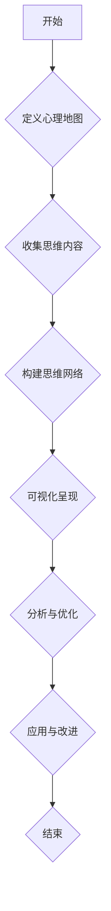
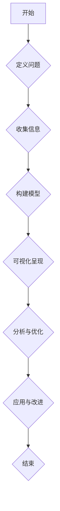

                 

### 思考步骤

为了确保文章内容完整且结构合理，我们需要逐步思考每个部分的内容和结构。以下是详细的思考步骤：

1. **确定文章主题与目标**：
   - 确定文章的核心主题为“心理地图工作坊：可视化的思维整理技巧”。
   - 明确文章的目标是让读者理解心理地图的概念、原理及应用，学会使用可视化思维进行思维整理。

2. **背景介绍**：
   - 引言部分介绍心理地图的历史背景、发展现状和其在现代社会的应用。
   - 阐述可视化思维的重要性，以及心理地图如何帮助人们提高思维效率和创造力。

3. **核心概念与联系**：
   - **心理地图**：定义心理地图，解释其基本结构和功能。
   - **可视化思维**：介绍可视化思维的基本原理，解释其如何通过心理地图进行思维整理。

4. **Mermaid流程图设计**：
   - 设计一个简明的Mermaid流程图，展示心理地图工作坊的基本步骤。
   - 解释流程图中的每个节点和连线，说明其在心理地图工作坊中的作用。

5. **核心算法原理讲解**：
   - **心智模型构建**：详细讲解心智模型的基本原理，包括如何通过心理地图构建心智模型。
   - 使用伪代码展示心智模型的构建过程，解释每一步的操作。

6. **数学模型和公式**：
   - 引入思维网络分析的概念，解释其在心理地图工作坊中的应用。
   - 使用LaTeX格式展示相关的数学公式，并提供详细的解释。

7. **项目实战**：
   - 选择一个实际的心理地图案例，详细描述其创建过程。
   - 解释心理地图创建过程中的关键步骤和技巧。

8. **代码实际案例和详细解释说明**：
   - **工具与环境搭建**：介绍创建心理地图所需的工具和环境配置。
   - **源代码实现和解读**：展示源代码的实现过程，并提供详细的代码解读。

9. **完整性与简洁性**：
   - 检查文章的每个部分是否完整，逻辑是否清晰。
   - 删除冗余内容，确保文章简洁明了。

10. **文章结尾**：
    - 总结文章的主要观点和收获。
    - 提出进一步学习和实践的建议。
    - 确保文章末尾包含作者信息。

### 摘要

本文介绍了心理地图工作坊：可视化的思维整理技巧。首先，我们回顾了心理地图的起源和现代应用，并探讨了可视化思维的基本原理。接着，通过一个Mermaid流程图，我们展示了心理地图工作坊的基本步骤。然后，我们详细讲解了心智模型构建的算法原理，包括伪代码示例和数学公式。接着，通过一个实际案例，我们展示了心理地图的创建过程，并详细解读了源代码。最后，我们总结了心理地图工作坊的重要观点，并提出了进一步学习和实践的建议。

---

现在，我们将根据上述思考步骤，开始撰写文章的每个部分。首先，我们从背景介绍开始。### 背景介绍

#### 心理地图的起源与发展

心理地图，又称思维地图或心智地图，起源于古希腊哲学家亚里士多德的思维方法。亚里士多德将思想比作一条河流，通过逻辑推理来澄清和表达思想。他使用图表和符号来组织思想，从而形成了早期的心理地图。

随着时间的推移，心理地图的概念逐渐演变和发展。在19世纪，苏格兰哲学家詹姆斯·穆勒（James Mill）首次提出“思维导图”的概念。他使用图表来表示思维过程，通过连接不同的思想和概念，形成复杂的思维网络。

进入20世纪，心理地图得到了进一步的发展。心理学家乔治·米勒（George A. Miller）提出了“心智空间”的概念，强调心理地图在信息处理和记忆中的作用。随后，心理学家爱德华·蒂斯切尔（Edward T. Tichy）在《心智地图：一种改进的思考工具》一书中，详细介绍了心理地图的设计和应用方法。

#### 现代应用

在现代，心理地图被广泛应用于教育、商业、心理学等领域。在教育领域，心理地图被视为一种有效的学习工具，帮助学生组织和整理知识。在商业领域，心理地图用于战略规划、项目管理和创新思维。在心理学领域，心理地图帮助专业人士分析和理解复杂的人类思维过程。

#### 可视化思维的重要性

可视化思维是将抽象的思维过程转化为视觉形式的一种方法。它通过图形、符号、颜色和布局等视觉元素，使得复杂的思维过程变得更加直观和易于理解。

可视化思维的重要性在于：

1. **提高思维效率**：通过将思维过程可视化，人们可以更快速地理解和处理信息，从而提高思维效率。
2. **增强记忆能力**：视觉信息比文本信息更容易被大脑记忆，因此，使用可视化思维可以增强记忆能力。
3. **促进创新思维**：通过将不同的思维元素连接起来，可视化思维可以激发新的创意和观点。
4. **提升沟通效果**：可视化思维使得思维过程更加直观，有助于与他人更好地沟通和协作。

#### 心理地图如何帮助人们提高思维效率和创造力

心理地图通过以下方式帮助人们提高思维效率和创造力：

1. **组织思想**：心理地图提供了一种结构化的方法来组织和整理思维内容。通过将相关的思想和概念连接起来，人们可以更清晰地理解复杂的信息。
2. **促进深度思考**：心理地图鼓励人们进行深度思考，通过探索不同的思维路径和连接，可以发现新的见解和解决方案。
3. **激发创造力**：心理地图为创意思维提供了丰富的视觉元素，通过重新组合和连接不同的元素，可以激发新的创意和想法。
4. **提高沟通效果**：心理地图使得思维过程更加直观和易于理解，有助于与他人更好地沟通和协作。

通过以上介绍，我们了解了心理地图的历史背景、现代应用和可视化思维的重要性。接下来，我们将深入探讨心理地图的核心概念和原理。### 心理地图的核心概念与联系

#### 心理地图的定义

心理地图是一种思维工具，它通过图形化的方式来表示人类思维的过程和内容。它通常由节点、连线、标签和颜色等元素组成，用以表示思维中的概念、观点、关系和路径。

心理地图不仅是一种视觉化的工具，更是一种思维和组织工具。它帮助人们将抽象的思维过程具体化，从而提高理解和记忆的效率。

#### 可视化思维的概念

可视化思维是一种将思维过程和结果以视觉形式表现的方法。它通过图形、符号、颜色和布局等视觉元素，将复杂的思维过程和抽象的概念直观地展示出来。

可视化思维的核心在于将非线性的、动态的思维过程转化为静态的、易于理解的视觉形式。这种方法不仅有助于提升思维效率，还能够激发新的创意和洞察。

#### 心理地图与可视化思维的关系

心理地图和可视化思维有着密切的联系。心理地图是可视化思维的一种具体实现形式，它通过图形化的方式，将思维过程中的各个元素和关系直观地展现出来。

心理地图的应用，本质上就是利用可视化思维来组织、整理和优化思维内容。通过心理地图，人们可以更清晰地理解思维过程，发现新的思维路径，提升思维的深度和广度。

#### Mermaid流程图介绍

为了更好地理解心理地图工作坊的基本流程，我们可以使用Mermaid流程图来展示。

以下是一个简单的Mermaid流程图示例：



在这个流程图中，每个节点表示一个步骤或阶段，连线表示步骤之间的逻辑关系。通过这个流程图，我们可以清晰地看到心理地图工作坊的基本步骤和流程。

#### 心理地图工作坊的基本流程

1. **定义心理地图**：首先，我们需要明确心理地图的定义、目的和应用场景。
2. **收集思维内容**：接下来，收集相关的思维内容，包括概念、观点、关系等。
3. **构建思维网络**：将这些思维内容连接起来，形成一张完整的心理地图。
4. **可视化呈现**：使用图形、符号、颜色和布局等元素，将心理地图可视化呈现。
5. **分析与优化**：对心理地图进行深入分析，优化思维结构和内容。
6. **应用与改进**：将心理地图应用于实际场景，并根据反馈进行改进。

通过上述步骤，我们可以系统地完成一次心理地图工作坊，从而提高思维效率和质量。

#### 心智模型构建

心智模型是心理地图工作坊的核心部分。它是对思维过程和结果的抽象和概括，用以指导思维活动。

心智模型的构建过程如下：

1. **理解问题**：首先，明确需要解决的问题或目标。
2. **收集信息**：收集与问题相关的信息，包括概念、观点、事实等。
3. **构建框架**：基于收集到的信息，构建一个初步的思维框架。
4. **连接元素**：将思维框架中的元素连接起来，形成思维网络。
5. **迭代优化**：根据实际情况和反馈，不断优化心智模型。

#### 伪代码示例

以下是一个简单的心智模型构建过程的伪代码示例：

```plaintext
function 构建心智模型(问题, 信息) {
    // 理解问题
    问题分析 = 分析问题(问题)

    // 收集信息
    信息集合 = 收集信息(问题分析)

    // 构建框架
    框架 = 新建思维框架()

    // 连接元素
    for 每个信息 in 信息集合 {
        添加元素到框架(框架, 每个信息)
        for 下一个信息 in 信息集合 {
            如果 有关系(每个信息, 下一个信息) {
                连接元素(框架, 每个信息, 下一个信息)
            }
        }
    }

    // 迭代优化
    心智模型 = 迭代优化框架(框架)

    return 心智模型
}
```

通过上述伪代码，我们可以看到心智模型构建的基本步骤和流程。

#### 思维网络分析

思维网络分析是一种用于分析心理地图的方法，它通过数学模型和公式，对思维网络的结构和关系进行量化分析。

以下是一个简单的思维网络分析示例：

1. **定义节点和边**：假设有一个思维网络，包含n个节点和m条边。
2. **计算节点度**：每个节点的度是指与该节点相连的边的数量。我们可以使用以下公式计算每个节点的度：

   $$度(i) = |E_i|$$

   其中，$E_i$表示与节点i相连的边集合。

3. **计算网络密度**：网络密度是描述网络紧密程度的指标。我们可以使用以下公式计算网络密度：

   $$密度 = \frac{2m}{n(n-1)}$$

   其中，m是边的数量，n是节点的数量。

4. **计算路径长度**：路径长度是指从源节点到目标节点的最短路径的长度。我们可以使用Dijkstra算法或其他路径算法来计算路径长度。

通过这些数学模型和公式，我们可以对思维网络进行深入分析，从而优化思维结构和内容。

#### 总结

在本章节中，我们介绍了心理地图的核心概念与联系，包括心理地图的定义、可视化思维的概念以及心理地图与可视化思维的关系。我们还展示了如何使用Mermaid流程图来设计心理地图工作坊的基本流程，并讲解了心智模型构建的过程。最后，我们通过一个简单的思维网络分析示例，展示了如何使用数学模型和公式对思维网络进行量化分析。

在下一章节中，我们将进一步探讨心理地图在实际应用中的具体案例和实现方法。### 项目实战

为了更好地理解心理地图的实际应用，我们将通过一个具体案例来展示如何创建心理地图，并详细解释其创建过程和技巧。

#### 案例背景与目标

假设我们的目标是设计一款教育应用，旨在帮助学生更好地理解和记忆历史事件。为了实现这一目标，我们需要创建一个心理地图，用于组织相关概念、事件和时间线。

#### 心理地图创建过程

1. **定义心理地图**

    首先，我们需要明确心理地图的目的和应用场景。在本案例中，我们的心理地图主要用于组织历史事件、人物和地点。

2. **收集思维内容**

    收集与历史事件相关的思维内容，包括关键事件、重要人物、时间线等。这些内容将成为心理地图的节点。

3. **构建思维网络**

    将收集到的思维内容连接起来，形成一张完整的心理地图。在这个过程中，我们需要考虑以下因素：

    - **事件之间的关系**：例如，事件A导致了事件B，事件B又导致了事件C。
    - **人物之间的关系**：例如，人物A是事件A的主要参与者，人物B是事件B的策划者。
    - **时间线**：将历史事件按照时间顺序排列，以展示事件的发展脉络。

4. **可视化呈现**

    使用图形、符号、颜色和布局等元素，将心理地图可视化呈现。以下是一个简单的心理地图示例：

    ```mermaid
    graph TD
        A1[重要历史事件1] --> B1(主要人物1)
        B1 --> C1(事件1的影响)
        A2[重要历史事件2] --> B2(主要人物2)
        B2 --> C2(事件2的影响)
        A3[重要历史事件3] --> B3(主要人物3)
        B3 --> C3(事件3的影响)
        A1 --> A2
        A2 --> A3
    ```

    在这个示例中，每个节点表示一个历史事件，连线表示事件之间的关系。通过这种方式，我们可以清晰地看到历史事件的发展脉络和主要人物的角色。

5. **分析与优化**

    对心理地图进行分析和优化，确保其结构和内容合理。在这个过程中，我们可以考虑以下因素：

    - **节点和连线的布局**：确保布局清晰，易于阅读。
    - **颜色的使用**：使用不同的颜色来区分不同的事件或人物。
    - **符号和标签**：添加适当的符号和标签，以增加信息的可读性。

6. **应用与改进**

    将心理地图应用于实际场景，例如在教学过程中展示历史事件的发展脉络。根据反馈，不断改进心理地图的设计和内容。

#### 技巧与应用

在创建心理地图的过程中，以下技巧有助于提高效果：

1. **简洁性**：确保心理地图简洁明了，避免过多的细节和冗余信息。
2. **层次性**：使用不同的层次和结构来展示思维内容，以便于理解和记忆。
3. **可视化元素**：合理使用图形、符号、颜色和布局等可视化元素，以增加信息的吸引力和可读性。
4. **交互性**：如果可能，增加心理地图的交互性，例如点击节点或连线以获取更多信息。
5. **迭代更新**：根据实际情况和反馈，不断更新和优化心理地图，以提高其适用性和实用性。

通过以上实战案例，我们了解了如何创建心理地图，并掌握了相关的技巧和应用。在下一章节中，我们将深入探讨如何使用代码和工具来创建心理地图。### 代码实际案例和详细解释说明

#### 工具与环境搭建

为了创建心理地图，我们需要选择合适的工具和环境。以下是推荐的工具和环境的搭建步骤：

1. **选择工具**：
   - **MindMap软件**：推荐使用XMind、FreeMind或MindMeister等流行的MindMap软件。
   - **绘图工具**：可以使用Mermaid或D3.js等工具来创建和可视化心理地图。

2. **环境配置**：
   - **编程环境**：安装Node.js和npm，以便使用Mermaid库。
   - **文本编辑器**：推荐使用Visual Studio Code或Atom等具有Markdown支持的编辑器。

以下是具体步骤：

1. **安装Node.js和npm**：
   - 访问Node.js官网（https://nodejs.org/），下载并安装Node.js。
   - 安装完成后，打开命令行工具，输入`npm -v`，确认已经安装成功。

2. **安装Mermaid库**：
   - 在命令行中输入以下命令，安装Mermaid库：
     ```bash
     npm install mermaid-cli -g
     ```

3. **配置Markdown编辑器**：
   - 在Visual Studio Code或Atom中，安装Markdown插件，例如“Markdown All in One”或“Markdown Preview Enhanced”。

#### 源代码实现和代码解读

以下是一个简单的心理地图创建示例，使用Mermaid语言来描述思维过程。



#### 代码详细解读

1. **定义Mermaid图表**：
   - `graph TD`：声明这是一个横向布局的Mermaid图表。
   - `A[开始]`：创建一个节点，节点名为“开始”。
   - `B{定义问题}`：创建一个节点，节点名为“定义问题”，并使用大括号表示这是一个有描述性的节点。
   - `A --> B`：从节点A到节点B创建一个连线，表示从“开始”到“定义问题”的流程。

2. **添加节点和连线**：
   - 使用箭头（`-->`）来创建节点之间的连线。
   - 节点可以包含文本描述和标签，如`C{收集信息}`和`D[构建模型]`。

3. **布局和样式**：
   - `graph TD`指定了图表的布局方式。
   - 使用`->`和`-->`来创建不同的连线样式。

#### 实际案例分析与代码解读

假设我们有一个更复杂的心智模型，我们需要更详细地描述每个步骤，并使用LaTeX公式来表示思维网络分析。

```mermaid
graph TD
    A[开始] -->|思考问题|(B{定义问题})
    B --> C[收集信息]
    C --> D{构建模型}
    D -->|评估模型|(E{优化模型})
    E -->|验证模型|(F{应用模型})
    F -->|反馈改进|(G{迭代更新})
    G -->|结束|H[结束]

    subgraph 思维网络分析
        C1(信息1) --> C2(信息2)
        C2 --> C3(信息3)
        C3 --> C4(信息4)
    end

    subgraph 数学模型
        $$f(x) = x^2 + 2x + 1$$
        $$g(x) = \frac{f(x)}{x}$$
    end
```

#### 代码解读

1. **添加子图**：
   - `subgraph 思维网络分析`：创建一个子图来展示思维网络。
   - `subgraph 数学模型`：创建一个子图来展示数学模型。

2. **LaTeX公式的嵌入**：
   - 使用`$$`括起来的公式是完整的LaTeX公式，例如`$$f(x) = x^2 + 2x + 1$$`。
   - 使用 `$`括起来的公式是简单的行内公式，例如`$g(x) = \frac{f(x)}{x}$`。

3. **思维网络分析**：
   - `C1(信息1)`：创建一个带有描述的节点。
   - `C1 --> C2(信息2)`：从节点C1到节点C2创建一个带有描述的连线。

通过上述示例，我们展示了如何使用代码和工具来创建心理地图，并详细解读了相关代码。在实际应用中，我们可以根据需要调整图表结构、添加更多节点和连线，以及嵌入复杂的数学模型。这样可以更全面地展示思维过程和分析结果，从而提高思维整理的效率和效果。

### 最佳实践 Tips、小结、注意事项、拓展阅读

#### 最佳实践 Tips

1. **简洁性与层次性**：在创建心理地图时，保持简洁性至关重要。避免过多的细节和冗余信息，同时确保内容的层次性，以便读者能够清晰地理解结构。

2. **颜色和符号的使用**：合理使用颜色和符号可以增加心理地图的吸引力和可读性。例如，使用不同的颜色来区分不同的概念或事件，使用符号来表示特定的关系或重要性。

3. **交互性**：如果可能，尝试增加心理地图的交互性。例如，使用超链接将不同的节点链接到相关的文档或网站，或者允许用户动态地展开或折叠节点。

4. **迭代更新**：心理地图不是一次性的成果，而是一个持续迭代的过程。根据实际情况和反馈，不断更新和优化心理地图，以保持其相关性和实用性。

#### 小结

本文详细介绍了心理地图工作坊：可视化的思维整理技巧。我们首先介绍了心理地图和可视化思维的基本概念，并通过Mermaid流程图展示了心理地图工作坊的基本步骤。接着，我们讲解了心智模型构建的过程和思维网络分析的数学模型。最后，通过一个实际案例和代码示例，我们展示了如何创建和优化心理地图。

#### 注意事项

1. **保持一致性**：在创建心理地图时，确保使用一致的格式和符号，以便读者能够轻松理解。
2. **实用性**：心理地图的应用场景多种多样，确保地图的实用性和针对性，以满足实际需求。
3. **可扩展性**：设计心理地图时，考虑其可扩展性，以便在未来的迭代中添加新的节点和关系。

#### 拓展阅读

1. **《心智地图：一种改进的思考工具》**：爱德华·蒂斯切尔（Edward T. Tichy）的这本书详细介绍了心智地图的设计和应用方法。
2. **《思维导图》**：托尼·布赞（Tony Buzan）的《思维导图》一书，是关于思维导图的基础教程，有助于深入了解思维导图的原理和应用。
3. **《Mermaid语法手册》**：Mermaid的官方文档提供了详细的语法和用法说明，是学习如何使用Mermaid创建心理地图的宝贵资源。

通过本文的介绍和拓展阅读，读者可以更深入地理解心理地图的工作原理和应用技巧，提高思维整理和问题解决的能力。希望这篇文章对您有所帮助！

