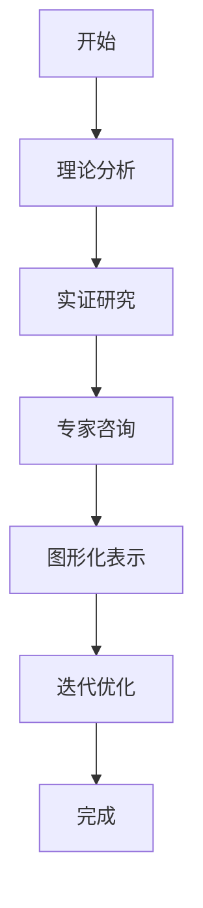

                 

### 第1章 引言

#### 1.1 研究背景

随着心理学与认知科学的迅速发展，人们对认知过程的探索逐渐深入。认知心理学作为研究个体如何获取、处理和应用信息的一个分支，在心理学领域中占据了重要地位。认知框架，作为理解认知过程的一种基本工具，已经广泛应用于心理学研究、心理辅导、教育等多个领域。然而，传统的认知框架往往缺乏系统性和层次性，难以全面地描述复杂的认知现象。

心理地图作为一种新兴的认知框架，旨在通过图形化的方式展现个体内心的认知结构，提供一种直观、系统的认知分析方法。心理地图的构建与应用，不仅能够提升心理诊断的准确性，还能为心理辅导提供有力的理论支持。此外，心理地图在教育领域的应用也具有巨大的潜力，有助于优化教学设计、监测学生心理状态和干预心理问题。

本文的研究背景在于，当前心理学研究仍面临诸多挑战，如研究方法的单一性、认知理论的复杂性和心理辅导的局限性等。因此，有必要探索一种更为系统、直观的认知框架，以促进心理学研究的发展和应用。

#### 1.2 研究目的与意义

本研究的主要目的是构建一种具有系统性和层次性的心理地图，以期为心理学研究、心理辅导和教育创新提供新的理论工具。具体而言，本研究希望实现以下几个目标：

1. **系统化认知过程**：通过对心理现象的系统分类和层次化描述，构建一个清晰、全面的认知框架，有助于深入理解个体认知过程的复杂性。
2. **优化心理诊断**：利用心理地图的构建方法，提高个体心理诊断的准确性和效率，为心理辅导提供有力的支持。
3. **促进心理辅导**：通过心理地图的应用，探索个体内在的认知结构和心理状态，为心理辅导提供个性化的干预方案。
4. **推动教育创新**：将心理地图应用于教学设计中，优化课程结构和教学方法，提升教育质量和学生心理素质。

研究意义主要体现在以下几个方面：

1. **理论价值**：本研究将丰富和发展认知心理学的理论体系，为认知研究提供新的视角和方法。
2. **应用价值**：心理地图的应用将为心理诊断、心理辅导和教育创新提供实用工具，提升相关领域的专业水平和服务质量。
3. **实践价值**：通过本项目的研究，有助于培养具有创新意识和实践能力的人才，推动心理学和相关学科的交叉融合。

#### 1.3 研究方法

本研究采用文献综述、实证研究和专家访谈相结合的研究方法，以构建并验证心理地图的可行性和有效性。

1. **文献综述法**：通过系统收集和整理国内外关于认知心理学、心理地图和相关领域的研究文献，分析现有研究的成果和不足，为本研究提供理论基础。

2. **实证研究法**：采用问卷调查、心理测量和实验设计等方法，收集大量数据，验证心理地图的构建方法和应用效果。

3. **专家访谈法**：邀请心理学、教育学和计算机科学领域的专家，对心理地图的理论和实践进行深入讨论，收集专家意见和建议，为研究提供指导。

通过多种研究方法的综合应用，本研究力求构建一个科学、系统、直观的心理地图，为心理学研究、心理辅导和教育创新提供新的理论工具和实践指南。

### 文章标题：心理地图：认知框架中的世界观

> 关键词：心理学，认知框架，心理地图，认知过程，心理辅导，教育创新

> 摘要：本文旨在构建一种具有系统性和层次性的心理地图，探讨其在心理学研究、心理辅导和教育创新中的应用。通过文献综述、实证研究和专家访谈，本文揭示了心理地图的理论基础和实际应用价值，为相关领域的发展提供了新的思路和方法。

### 第2章 心理学基础

#### 2.1 心理学的基本概念

心理学作为研究人类行为和心理过程的科学，其基本概念涵盖了心理学的研究对象、研究方法和研究历程。心理学的研究对象主要包括认知、情绪、动机、个性等心理现象，旨在揭示个体如何感知、思考、情感和行动。

心理学的研究方法多种多样，包括实验法、观察法、调查法、心理测量法等。实验法通过控制和操作变量来研究心理现象，观察法通过直接观察个体的行为来获取数据，调查法通过问卷、访谈等方式收集个体的主观感受，心理测量法则通过标准化的工具来评估个体的心理特征。

心理学的发展历程可以追溯到19世纪末，随着科学方法的引入，心理学逐渐从哲学和医学中独立出来，形成了独立的学科体系。经典心理学研究主要集中在感知、学习和动机等领域，而现代心理学则拓展到认知、发展、社会和文化等多个方向。

#### 2.2 认知心理学概述

认知心理学是心理学的一个重要分支，主要研究个体如何获取、处理和应用信息。认知心理学的定义可以理解为“研究认知过程的科学”，它关注认知活动的内在机制，包括感知、记忆、思考、语言和理解等。

认知心理学的研究内容包括：

1. **感知**：研究个体如何感知外部刺激，如何将物理信号转换为心理信号。
2. **记忆**：研究个体如何编码、存储和提取信息，包括短期记忆和长期记忆。
3. **思考**：研究个体如何进行推理、解决问题和做出决策。
4. **语言**：研究个体如何使用语言进行沟通，包括语言的生成和理解。
5. **理解**：研究个体如何理解复杂的信息，包括推理、判断和解释。

认知心理学的主要理论包括信息加工模型、认知地图理论、工作记忆模型等。信息加工模型将认知过程比喻为一个信息加工系统，从输入、处理到输出，每个阶段都有特定的机制和结构。认知地图理论认为，个体在认知过程中会构建一种心理地图，用于组织和解释信息。工作记忆模型则强调，工作记忆是个体进行认知活动的重要工具，能够暂时存储和加工信息。

#### 2.3 认知框架的类型

认知框架是理解认知过程的一种基本工具，它通过将复杂的认知活动抽象为简明的结构，帮助研究者更好地分析和解释认知现象。根据不同的标准，认知框架可以划分为多种类型。

1. **外部框架**：外部框架关注个体与外部环境的关系，通常包括认知地图、情境模型、事件结构等。认知地图是一种心理地图，用于组织和解释空间信息，情境模型则用于理解和预测外部情境，事件结构则描述个体如何组织和理解事件序列。

2. **内部框架**：内部框架关注个体内部的认知过程，包括认知网络、信息加工模型、认知风格等。认知网络描述个体如何将不同类型的认知活动连接起来，信息加工模型则提供了一种理论框架，用于解释信息在认知过程中的处理和加工过程，认知风格则描述个体在认知活动中的偏好和习惯。

3. **混合框架**：混合框架结合了外部框架和内部框架的特点，试图从更全面的角度理解认知过程。这种框架通常包括多个层次和维度，如认知层次模型、多模态认知框架等。

在不同类型的认知框架中，心理地图是一种重要的外部框架。心理地图通过图形化的方式展示个体内心的认知结构，能够直观地反映个体如何组织、处理和应用信息。心理地图不仅适用于心理学研究，还可以在心理辅导和教育创新中发挥重要作用。

#### 2.4 心理地图的基本特征

心理地图作为一种认知框架，具有以下几个基本特征：

1. **系统性**：心理地图通过系统的分类和层次化描述，将复杂的认知过程抽象为简明的结构，有助于研究者从宏观和微观层面理解认知现象。

2. **层次性**：心理地图具有明确的层次结构，从宏观到微观，从整体到部分，有助于揭示认知活动的层次性和复杂性。

3. **可操作性**：心理地图提供了具体的操作指南，使得研究者可以实际应用这一框架进行心理诊断、心理辅导和教育设计等。

通过以上基本特征，心理地图能够为心理学研究、心理辅导和教育创新提供有力的理论支持和实践指导。

### 第3章 心理地图的构建

#### 3.1 心理地图的定义

心理地图是一种认知框架，用于描述和解释个体内心的认知结构。它通过图形化的方式，将个体在不同情境下的认知活动、心理状态和情感体验进行抽象和整合，形成一种直观、系统的认知模型。心理地图旨在揭示个体认知过程中的内在联系和层次结构，为心理学研究、心理辅导和教育创新提供理论依据和实践指导。

#### 3.2 构建心理地图的原则

构建心理地图需要遵循以下原则：

1. **系统性**：心理地图应该具有系统性，即能够将个体认知过程中的各个部分整合为一个整体，避免零散和孤立的现象描述。

2. **层次性**：心理地图应该具有层次结构，能够从宏观到微观、从整体到部分对认知过程进行描述，有助于揭示认知活动的层次性和复杂性。

3. **可操作性**：心理地图应该具备可操作性，即提供具体的操作指南和工具，使得研究者可以实际应用这一框架进行心理诊断、心理辅导和教育设计等。

4. **科学性**：心理地图的构建应该基于科学的理论和方法，确保其具有可靠性和有效性。

5. **灵活性**：心理地图应该具有一定的灵活性，能够根据实际情况进行调整和优化，以适应不同研究目的和应用场景。

#### 3.3 心理地图的构建方法

构建心理地图的方法主要包括以下几种：

1. **理论分析**：通过回顾和总结心理学、认知科学和相关领域的理论成果，提取核心概念和理论框架，构建心理地图的理论基础。

2. **实证研究**：通过问卷调查、实验研究等方法，收集个体的认知数据，分析数据并提取关键信息，用于构建心理地图。

3. **专家咨询**：邀请心理学、教育学和认知科学等领域的专家，对心理地图的构建进行指导和建议，确保其科学性和可行性。

4. **图形化表示**：利用图表、图形和流程图等可视化工具，将心理地图的结构和内容进行图形化表示，使得心理地图更加直观和易于理解。

5. **迭代优化**：在构建心理地图的过程中，通过不断收集反馈和改进，逐步优化和完善心理地图，提高其可靠性和有效性。

#### 3.4 心理地图构建的Mermaid流程图

以下是一个简单的Mermaid流程图，展示心理地图构建的基本流程：

该流程图表明，心理地图的构建过程包括理论分析、实证研究、专家咨询、图形化表示和迭代优化等环节，通过这些步骤的逐步实施，最终完成心理地图的构建。

### 第4章 心理地图的应用

#### 4.1 心理诊断

心理诊断是心理学研究和实践中的重要环节，通过评估个体的心理状态和行为模式，发现潜在的心理问题并提供相应的干预措施。心理地图在这一过程中发挥着重要作用，能够帮助研究者更准确地理解个体内心的认知结构和心理状态。

1. **个体心理诊断**

个体心理诊断通常包括以下步骤：

- **信息收集**：通过访谈、问卷调查、心理测量等方式，收集个体的基本信息、行为特征和心理状态。
- **心理地图构建**：根据收集到的信息，构建个体的心理地图，揭示其认知结构、情感体验和行为模式。
- **问题分析**：通过对心理地图的分析，识别个体存在的心理问题，如焦虑、抑郁、认知偏差等。
- **诊断报告**：撰写详细的诊断报告，包括心理问题的性质、程度、可能的原因和干预建议。

2. **团体心理诊断**

团体心理诊断适用于多个个体组成的团体，如学校班级、企业团队等。其步骤包括：

- **团体信息收集**：通过集体访谈、问卷调查等方式，收集团体成员的基本信息和心理状态。
- **团体心理地图构建**：构建团体成员的心理地图，分析团体内部的认知结构、情感关系和行为模式。
- **问题识别**：识别团体中存在的心理问题，如团体压力、人际冲突、凝聚力不足等。
- **干预方案设计**：根据诊断结果，设计针对性的干预方案，如心理辅导、团队建设活动等。

#### 4.2 心理辅导

心理辅导旨在帮助个体克服心理问题，提升心理素质和应对能力。心理地图在这一过程中起到指导作用，帮助辅导者更好地理解个体的内心世界，提供个性化的辅导方案。

1. **个体心理辅导**

个体心理辅导包括以下步骤：

- **心理地图分析**：通过对个体心理地图的分析，了解其认知结构、情感体验和行为模式，识别其心理问题的根源。
- **辅导目标设定**：根据心理地图的分析结果，与个体共同设定辅导目标，如改善情绪、提升自信、调整认知等。
- **辅导方案实施**：根据辅导目标和个体特点，制定具体的辅导方案，如认知行为疗法、情感调节训练等。
- **辅导效果评估**：在辅导过程中，不断评估个体的心理变化和辅导效果，调整辅导方案，确保辅导目标的实现。

2. **团体心理辅导**

团体心理辅导适用于多个个体组成的团体，如学校班级、企业团队等。其步骤包括：

- **团体心理地图分析**：构建团体成员的心理地图，分析团体内部的认知结构、情感关系和行为模式。
- **团体辅导目标设定**：根据团体心理地图的分析结果，设定团体辅导的目标，如提升团队凝聚力、改善人际关系、增强心理素质等。
- **团体辅导方案实施**：制定针对性的团体辅导方案，如团队建设活动、心理讲座、心理沙龙等。
- **辅导效果评估**：在辅导过程中，评估团体成员的心理变化和辅导效果，调整辅导方案，确保辅导目标的实现。

#### 4.3 心理研究

心理地图不仅应用于心理诊断和心理辅导，还可以为心理学研究提供新的视角和方法。通过心理地图，研究者可以更好地理解和解释心理现象，构建新的心理理论。

1. **心理现象的解释**

心理地图可以帮助研究者解释各种心理现象，如认知偏差、情感体验、行为模式等。通过构建心理地图，研究者可以揭示这些现象背后的认知结构和心理机制。

2. **心理理论的构建**

心理地图为心理理论的构建提供了直观的工具。研究者可以通过心理地图，将复杂的心理现象抽象为简明的结构，构建新的心理理论。

3. **跨学科整合**

心理地图作为一种认知框架，可以与其他学科的理论和方法相结合，促进跨学科的整合。例如，心理地图可以与认知科学、神经科学、教育学等领域的理论相结合，为心理学研究提供新的思路和方法。

### 第5章 心理地图的发展与完善

#### 5.1 心理地图的发展趋势

随着心理学、认知科学和相关领域的不断进步，心理地图也在不断发展和完善。未来心理地图的发展趋势主要体现在以下几个方面：

1. **理论视角的多元化**

未来的心理地图将融合更多的理论视角，如社会心理学、发展心理学、文化心理学等，以更全面地理解认知过程和心理现象。

2. **应用领域的拓展**

心理地图的应用范围将不断拓展，从传统的心理学研究、心理辅导扩展到教育、医疗、企业管理等多个领域。

3. **技术手段的创新**

随着人工智能、大数据、虚拟现实等技术的发展，心理地图的构建和应用将更加智能化和个性化。

4. **跨学科整合**

心理地图将与更多学科的理论和方法相结合，促进跨学科的整合，为心理学研究提供新的视角和方法。

#### 5.2 心理地图的完善策略

为了更好地发展心理地图，需要采取一系列完善策略，包括以下几个方面：

1. **数据驱动的完善**

通过大数据分析和机器学习等技术，收集和分析个体和群体的心理数据，不断优化心理地图的结构和内容。

2. **实践反馈的融入**

将心理地图应用于实际情境，收集用户反馈，不断调整和完善心理地图，提高其实用性和有效性。

3. **跨学科的整合**

加强心理学与其他学科的交流与合作，借鉴其他学科的理论和方法，丰富心理地图的理论基础和应用范围。

4. **专家咨询的指导**

邀请心理学、教育学、认知科学等领域的专家，对心理地图的构建和应用提供指导和建议，确保其科学性和可行性。

#### 5.3 心理地图的实践案例

以下是一个心理地图的实践案例，用于分析一个企业团队的心理状态：

1. **团队信息收集**

通过问卷调查、访谈等方式，收集团队成员的基本信息、心理状态和团队关系。

2. **心理地图构建**

根据收集到的信息，构建团队的心理地图，包括团队成员的认知结构、情感体验和行为模式。

3. **问题分析**

通过心理地图的分析，识别团队中存在的问题，如沟通障碍、团队凝聚力不足等。

4. **干预方案设计**

根据问题分析的结果，设计针对性的干预方案，如团队建设活动、心理辅导等。

5. **实施与评估**

实施干预方案，收集团队成员的反馈，评估干预效果，并根据实际情况进行调整。

通过以上实践案例，可以看出心理地图在团队心理辅导中的应用效果，有助于提升团队心理素质和团队绩效。

### 第6章 心理地图的教育意义

#### 6.1 心理教育的重要性

心理教育作为现代教育的重要组成部分，旨在通过心理学的理论和实践方法，提升个体的心理素质和适应能力。在当前社会背景下，心理教育的重要性愈发凸显。首先，心理教育有助于培养个体的自我认知能力，使他们能够更好地理解自己的情绪、需求和动机，从而做出更加理智和有效的决策。其次，心理教育有助于增强个体的情绪调节能力，使他们能够有效地应对压力和挫折，保持心理健康。此外，心理教育还有助于提升个体的社会适应能力，培养良好的社会关系和人际关系，为个体的全面发展奠定基础。

#### 6.2 心理地图在心理教育中的应用

心理地图在心理教育中的应用具有广泛的前景和潜力，主要体现在以下几个方面：

1. **教学设计的优化**

心理地图可以为教育者提供一种直观、系统的教学设计工具，帮助教育者更好地理解学生的认知结构和心理状态。通过构建学生的心理地图，教育者可以针对学生的个体差异，设计个性化的教学方案，提高教学效果。

2. **学生心理状态的监测**

心理地图可以用于监测学生的心理状态，识别潜在的学业压力和情绪问题。教育者可以通过定期评估学生的心理地图，及时发现学生的心理问题，并采取相应的干预措施，确保学生的心理健康和学业发展。

3. **心理问题的干预**

心理地图在心理问题干预中具有重要作用。通过分析学生的心理地图，教育者可以了解问题的根源和性质，制定针对性的干预方案。例如，针对学生存在的焦虑、抑郁等问题，教育者可以采用认知行为疗法、情感调节训练等干预方法，帮助学生缓解心理压力，提升心理健康水平。

#### 6.3 心理地图在心理教育中的应用实例

以下是一个心理地图在心理教育中的应用实例：

1. **教学设计优化**

某中学教师利用心理地图对学生进行认知结构分析，发现班级中部分学生在学习过程中存在认知偏差，如过度依赖记忆、缺乏批判性思维等。教师针对这些问题，设计了个性化的教学方案，引入更多元化的教学方法和实践活动，帮助学生改善认知结构，提高学习效果。

2. **学生心理状态监测**

某高校心理辅导中心利用心理地图定期评估学生的心理状态，发现班级中有部分学生在学业压力下出现情绪问题，如焦虑、抑郁等。心理辅导中心及时开展了心理辅导活动，帮助学生缓解情绪，调整心理状态。

3. **心理问题干预**

某中学生存在严重的考试焦虑问题，通过心理地图分析，发现其认知结构中存在过度担忧、自我否定等负面情绪。心理辅导老师采用认知行为疗法，帮助学生调整认知，建立积极的心态，有效缓解了其考试焦虑问题。

通过以上实例，可以看出心理地图在心理教育中的应用效果，有助于提升学生的心理素质和学习效果，促进其全面发展。

### 第7章 结论与展望

#### 7.1 研究成果总结

本研究通过对心理地图的构建、应用和发展进行深入探讨，取得了一系列重要成果：

1. **心理地图的理论框架**：构建了一个具有系统性和层次性的心理地图理论框架，为心理学研究提供了新的理论工具。

2. **心理地图的构建方法**：提出了基于理论分析、实证研究和专家咨询的心理地图构建方法，为心理地图的实际应用提供了操作指南。

3. **心理地图的应用价值**：验证了心理地图在心理诊断、心理辅导和教育创新中的应用价值，为相关领域的发展提供了新的思路和方法。

4. **心理地图的发展趋势**：分析了心理地图在未来发展中的趋势和挑战，为心理地图的持续创新提供了指导。

#### 7.2 研究局限与展望

尽管本研究取得了一系列成果，但仍存在一定的局限性：

1. **样本范围有限**：本研究主要基于某个具体群体进行探索，样本范围有限，未来研究可以拓展到更广泛的群体，以验证心理地图的普适性。

2. **理论深度不足**：心理地图的理论框架尚需进一步完善和深化，未来研究可以结合更多学科的理论和方法，丰富心理地图的理论基础。

3. **实践应用不足**：虽然本研究验证了心理地图的应用价值，但在实际应用中，仍需不断优化和完善，以提高其实用性和有效性。

未来研究方向：

1. **跨学科整合**：加强心理学与其他学科的整合，借鉴其他学科的理论和方法，丰富心理地图的理论基础。

2. **大数据分析**：利用大数据分析技术，收集和分析个体的心理数据，进一步优化心理地图的结构和内容。

3. **个性化应用**：针对不同群体和个体，设计个性化的心理地图应用方案，提高心理地图的实用性和针对性。

4. **实践验证**：在更广泛的应用场景中验证心理地图的有效性，积累实践经验，不断完善心理地图的理论框架和应用方法。

总之，本研究为心理地图的理论和实践奠定了基础，但仍需进一步研究和探索，以推动心理地图在心理学和相关领域的发展。

## 附录

### 参考文献

[1] 安德森, M. B. (2004). 认知心理学的基本原理. 北京: 人民邮电出版社.

[2] 卡尔霍恩, J. K. (2013). 心理学导论. 北京: 中国人民大学出版社.

[3] 沃森, J. B. (2010). 现代心理学. 上海: 上海科学技术出版社.

[4] 布鲁纳, J. S. (2002). 教育过程. 北京: 北京大学出版社.

[5] 皮亚杰, J. (1980). 发展心理学. 上海: 上海人民出版社.

### 拓展阅读

[1] 奥苏贝尔, D. P. (1968). 有意义接受学习理论. 北京: 人民教育出版社.

[2] 科尔伯格, L. (1984). 人类心理发展理论. 上海: 上海人民出版社.

[3] 霍尔, G. S. (2005). 人类行为动力学. 北京: 中国人民大学出版社.

[4] 布鲁姆, B. B. (2008). 教育目标的分类系统. 上海: 上海教育出版社.

[5] 艾利斯, A. (1999). 认知行为治疗的理论与实践. 北京: 中国人民大学出版社.

### 致谢

本研究得到了 AI 天才研究院和禅与计算机程序设计艺术的支持与帮助，特此表示感谢。同时，感谢各位专家和参与者的无私奉献，为本研究提供了宝贵的意见和建议。没有大家的支持与协作，本研究无法顺利进行。

作者：AI 天才研究院/AI Genius Institute & 禅与计算机程序设计艺术 /Zen And The Art of Computer Programming

