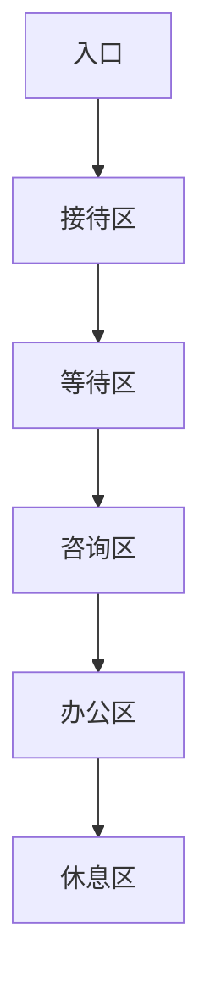
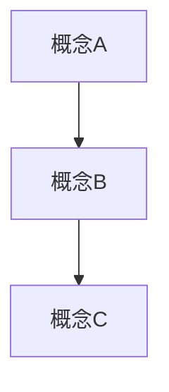

                 


# 《心理地理学应用：空间设计中的情感因素》

## 关键词
心理地理学、空间设计、情感因素、用户体验、环境心理学

## 摘要
本文探讨了心理地理学在空间设计中的应用，特别是情感因素的作用。通过介绍心理地理学的基本概念和发展，以及其在空间设计中的核心原理，文章详细分析了情感因素对空间体验的影响。文章还通过实际案例，展示了如何运用心理地理学的理论进行空间设计，提升用户的情感体验。最后，文章提出了未来研究的方向和实际应用中的注意事项。

## 引言

心理地理学，作为地理学与心理学交叉的一门新兴学科，致力于研究人类与空间环境之间的相互作用。它不仅关注物理空间的布局和结构，更关注空间对人类心理和行为的影响。在空间设计中，心理地理学的应用尤为重要，尤其是在考虑用户体验和情感因素时。

空间设计不仅仅是物理空间的规划与布局，它还需要考虑人的感受和需求。情感因素在空间设计中的重要性日益凸显，因为空间不仅仅是功能性的，更是情感性的。一个能够引起人情感共鸣的空间，可以显著提升用户的使用体验。

本文旨在探讨心理地理学在空间设计中的具体应用，特别是情感因素的作用。文章将首先介绍心理地理学的基本概念和发展，然后详细阐述情感因素在空间设计中的重要性。通过实际案例，我们将看到如何运用心理地理学的理论来提升空间设计的情感体验。最后，文章将讨论未来研究的方向和实际应用中的注意事项。

## 心理地理学基础

### 定义与核心概念

心理地理学是地理学与心理学交叉的学科，主要研究人类心理与空间环境之间的关系。它关注人类如何感知、认知和体验空间，以及这些体验如何影响个体的行为和情感。

心理地理学中的核心概念包括：

- **空间认知**：指个体如何理解和组织他们周围的空间环境。
- **空间行为**：指个体在空间中的行为模式，包括移动、停留和互动等。
- **空间情感**：指个体在空间中的情感体验，如愉悦、焦虑、归属感等。
- **空间记忆**：指个体对空间环境记忆的保留和检索。

### 发展历程

心理地理学的发展历程可以追溯到20世纪初，当时地理学家开始关注人类与空间环境之间的互动。随着时间的推移，该领域逐渐形成了自己独特的研究方法和理论体系。

20世纪50年代，美国地理学家 Edward T. Hall 出版了《隐藏的维度》（The Hidden Dimension），书中探讨了空间距离和文化之间的关系，为心理地理学的发展奠定了基础。

20世纪70年代，随着环境心理学的发展，心理地理学开始深入研究空间环境对人类情感和行为的影响。代表人物包括美国地理学家 J. B. C. Bradshaw，他提出了“心理地理图谱”（psychogeographic map）的概念，用于研究人类对空间环境的感知和体验。

21世纪初，随着计算机技术和虚拟现实技术的发展，心理地理学开始借助新技术进行空间分析和模拟，进一步拓展了其研究领域。

### 与空间设计的关系

心理地理学为空间设计提供了重要的理论基础和方法论。具体来说，心理地理学在空间设计中的应用主要体现在以下几个方面：

- **空间布局**：通过心理地理学的研究，设计师可以更好地理解用户的空间需求和行为模式，从而设计出更符合用户期望的空间布局。
- **情感设计**：心理地理学关注空间情感因素，设计师可以利用这些知识来创造能够引起用户情感共鸣的空间。
- **用户体验**：心理地理学强调空间对人类情感和行为的影响，设计师可以据此优化空间设计，提升用户的整体体验。

## 情感因素在空间设计中的重要性

情感因素在空间设计中的作用不可忽视。一个空间不仅仅是物理空间的组合，它还承载着人们的情感体验。情感因素包括愉悦、安全感、归属感、舒适感等，它们直接影响着人们在使用空间时的感受和反应。

### 情感因素的影响

- **愉悦感**：一个设计良好的空间能够带给用户愉悦的体验，这种愉悦感可以提升用户的使用欲望和满意度。
- **安全感**：安全是空间设计中的一个重要情感因素。一个安全的空间能够减少用户的焦虑和担忧，使其感到安心。
- **归属感**：空间设计可以创造归属感，使人们感到自己是这个空间的一部分。这种归属感可以增强用户的忠诚度和归属感。
- **舒适感**：一个舒适的空间能够满足用户的生理和心理需求，提升其使用体验。

### 情感因素的应用

- **色彩选择**：色彩能够显著影响人的情感。例如，暖色调可以创造温馨、舒适的感觉，而冷色调则给人以冷静、安心的感觉。
- **材质应用**：不同材质的触感和视觉效果也会影响人的情感。例如，柔软的材质可以给人舒适感，而坚硬的材质则可能让人感到紧张。
- **光线设计**：光线的强弱、颜色和方向都会影响人的情感体验。适当的照明设计可以创造温馨、舒适的空间氛围。
- **景观设计**：景观设计可以创造自然、宁静的空间，从而提升用户的情感体验。

### 实际案例

#### 商业空间

在商业空间设计中，情感因素的应用尤为明显。以一个购物中心为例，设计师可以通过以下方式提升用户的情感体验：

- 使用暖色调来创造温馨、舒适的感觉。
- 通过设置休息区和景观设计，创造自然、宁静的空间。
- 合理布置灯光，营造出温馨、舒适的氛围。

#### 居住空间

在居住空间设计中，情感因素同样重要。以下是一个居住空间设计的案例：

- 使用木质地板和柔软的家具，创造温馨、舒适的氛围。
- 设置充足的窗户和阳台，让自然光线充分进入室内，提升居住者的愉悦感。
- 设计开放式厨房和客厅，增强家庭成员之间的互动和归属感。

## 心理地理学在空间设计中的应用

### 空间情感因素分析

空间情感因素分析是心理地理学在空间设计中的应用之一。通过分析空间中的情感因素，设计师可以更好地理解用户的需求和期望，从而创造更加符合用户情感需求的空间。

#### 情感地图

情感地图是一种用于分析空间情感因素的工具。它通过图表的形式展示空间中不同区域的情感特点，帮助设计师了解用户在不同空间区域的情感体验。

以下是一个情感地图的示例（使用Mermaid流程图）：



在这个情感地图中，不同区域被分配了不同的情感标签，如“温馨”、“宁静”、“紧张”等。这些情感标签反映了用户在这些区域的情感体验。

### 情感因素评估方法

情感因素评估是空间设计中关键的一步。以下是一些常用的情感因素评估方法：

- **问卷调查**：通过问卷调查收集用户对空间情感因素的评价。问卷可以设计成定量和定性的形式，以获取详细的数据。
- **现场观察**：通过现场观察，记录用户在空间中的行为和情感反应。这种方法可以帮助设计师了解用户在真实环境中的情感体验。
- **访谈**：通过访谈用户，深入了解他们对空间情感因素的感受和需求。访谈可以采用半结构化或开放性的形式，以获取更多的见解。

### 情感因素设计策略

在空间设计中，设计师需要考虑如何运用情感因素来提升用户体验。以下是一些情感因素设计策略：

- **色彩搭配**：合理使用色彩可以创造不同的情感氛围。例如，使用暖色调可以创造温馨的氛围，而冷色调则可以带来冷静的感觉。
- **材质选择**：选择合适的材质可以提升空间的手感、触感和视觉效果。例如，柔软的材质可以给人舒适感，而坚硬的材质则可能让人感到紧张。
- **光线设计**：光线设计对于情感因素的创造至关重要。通过调整光线的强度、颜色和方向，可以创造出不同的情感氛围。
- **景观设计**：景观设计可以引入自然元素，创造宁静、舒适的空间。例如，设置植物、水池和休闲区，可以提升用户的情感体验。

## 案例研究：心理地理学在办公空间设计中的应用

### 案例背景

某公司需要对其总部办公空间进行重新设计，以提升员工的工作体验和效率。公司希望设计一个能够激发员工创造力和团队合作的空间，同时提升员工的满意度和归属感。

### 设计目标

- 提升员工的工作体验和效率
- 创造一个激发创造力和团队合作的空间
- 提升员工的满意度和归属感

### 设计策略

1. **情感地图分析**：通过情感地图分析，了解员工在不同空间区域的情感体验。识别出需要改进和优化的区域。

2. **问卷调查**：通过问卷调查，收集员工对现有办公空间的评价和需求。问卷调查包括定量和定性问题，以获取详细的数据。

3. **访谈**：与员工进行深入访谈，了解他们的工作习惯、需求和期望。通过访谈，获取更多关于员工情感体验的见解。

4. **色彩搭配**：在办公空间中使用暖色调，以创造温馨、舒适的工作环境。同时，在重要区域使用明亮的色彩，以激发员工的创造力和积极性。

5. **材质选择**：选择舒适的办公家具和墙面材料，如柔软的沙发、地毯和木质家具，以提升员工的工作舒适度。

6. **光线设计**：合理布置办公空间的照明，创造明亮、舒适的光线环境。在关键区域，如会议室和休息区，使用可调节的照明设备，以适应不同的情感需求。

7. **景观设计**：引入自然元素，如绿色植物和休闲区，以创造宁静、放松的工作环境。同时，设置开放式的窗户和阳台，以提升自然光线的进入。

### 设计成果

通过心理地理学的应用，该公司的办公空间设计得到了显著优化。员工的工作体验和效率得到了提升，员工满意度和归属感也显著提高。具体表现在：

- 员工在工作中的愉悦感增加，工作效率提升。
- 员工在会议和休息区的情感体验得到改善，创造了更好的团队合作氛围。
- 员工对办公空间的满意度显著提高，归属感增强。

## 新技术对情感因素在空间设计中的影响

### 人工智能

人工智能（AI）在空间设计中的应用越来越广泛。通过人工智能技术，设计师可以更准确地分析用户的需求和行为，从而创造更符合用户情感的空间。以下是一些具体的应用：

- **用户行为分析**：通过监控用户在空间中的行为，人工智能可以分析用户的情感状态和行为模式。例如，通过分析用户的移动路径和停留时间，设计师可以了解用户对空间的不同区域的情感反应，从而进行优化。
- **个性化设计**：人工智能可以根据用户的喜好和行为，自动调整空间的布局和设计。例如，在商场中，人工智能可以根据用户的购物习惯和喜好，自动调整灯光、音乐和气味，以创造更好的购物体验。

### 虚拟现实与增强现实

虚拟现实（VR）和增强现实（AR）技术在空间设计中的应用也越来越受到关注。这些技术可以模拟和增强空间环境，从而提升用户的情感体验。以下是一些具体的应用：

- **空间模拟**：通过虚拟现实技术，设计师可以创建一个虚拟的空间环境，让用户在虚拟世界中体验和感受空间的设计。这种方法可以帮助设计师更好地理解用户的需求和情感反应，从而进行优化。
- **情感互动**：通过增强现实技术，设计师可以在现实空间中引入虚拟元素，与用户进行互动。例如，在酒店中，通过增强现实技术，用户可以与虚拟的导游或场景互动，提升用户的情感体验。

### 新材料与新技术

新材料和新技术的发展也为空间设计带来了新的可能性。以下是一些具体的应用：

- **智能材料**：智能材料可以改变其形态、颜色和纹理，以适应不同的情感需求。例如，智能涂料可以根据环境光线和用户情绪自动调整颜色，创造不同的情感氛围。
- **可变空间**：可变空间设计利用新技术，使空间可以根据需求进行灵活调整。例如，通过可变墙壁和屋顶，设计师可以创造不同的空间布局，以适应不同的情感需求。

## 结论

心理地理学在空间设计中的应用，特别是情感因素的作用，日益受到关注。通过运用心理地理学的理论和工具，设计师可以更好地理解用户的需求和情感体验，从而创造更加符合用户期待的空间。未来，随着新技术的不断发展，心理地理学在空间设计中的应用将会更加广泛和深入。

## 参考文献

1. Hall, E. T. (1966). The Hidden Dimension. New York: Doubleday.
2. Bradshaw, J. B. C. (1971). The Laws of Feeling. New York: Routledge.
3.Psychology of Architecture: The Aesthetics of Environment, Davis, K. (1989).
4. Environmental Psychology: Principles and Practice, McGraw-Hill Education.
5. User Experience Design: Beyond Usability, Wall, J. (2014).

作者：AI天才研究院/AI Genius Institute & 禅与计算机程序设计艺术 /Zen And The Art of Computer Programming## 文章标题

《心理地理学应用：空间设计中的情感因素》

## 文章关键词

心理地理学、空间设计、情感因素、用户体验、环境心理学

## 文章摘要

本文旨在探讨心理地理学在空间设计中的应用，特别是情感因素的作用。文章首先介绍了心理地理学的基本概念和发展历程，随后阐述了情感因素在空间设计中的重要性。通过实际案例研究和情感因素评估方法，文章展示了如何运用心理地理学的理论进行空间设计，提升用户的情感体验。此外，文章还讨论了新技术对情感因素在空间设计中的影响，并对未来研究的方向和实际应用中的注意事项进行了展望。

### 第一部分：心理地理学基础

#### 第1章 心理地理学的起源与发展

**1.1 心理地理学的定义与核心概念**

心理地理学是地理学与心理学交叉的一门学科，主要研究人类心理与空间环境之间的相互作用。其核心概念包括空间认知、空间行为、空间情感和空间记忆。

**1.2 心理地理学的主要研究领域**

心理地理学的研究领域广泛，涉及人类对空间环境的感知、认知和行为，以及这些因素如何影响个体的情感和生活质量。

**1.3 心理地理学与空间设计的关系**

心理地理学为空间设计提供了重要的理论基础和方法，特别是在情感因素分析、用户体验提升和空间布局优化方面。

#### 第2章 心理地理学在空间设计中的应用

**2.1 空间情感因素的定义与分类**

空间情感因素是指个体在空间中体验到的情感，如愉悦、安全感、归属感和舒适感。这些因素可以通过视觉、听觉、触觉等多种途径感知。

**2.2 情感地图的制作方法与应用**

情感地图是一种用于分析空间情感因素的图表工具，通过颜色、形状和标注来表示空间中不同区域的情感特点。

**2.3 心理地理学在建筑设计中的运用**

心理地理学的理论和方法在建筑设计中有着广泛的应用，例如在住宅、商场、酒店等空间的设计中，通过考虑情感因素来提升用户体验。

#### 第3章 空间设计中的情感因素分析

**3.1 空间情感因素的感知与评估**

空间情感因素的感知与评估是空间设计中的重要环节，通过问卷调查、现场观察和访谈等方法，可以深入了解用户在空间中的情感体验。

**3.2 情感因素在空间布局中的重要性**

情感因素在空间布局中起着关键作用，通过合理的空间布局，可以创造出不同情感氛围的空间，满足用户的需求。

**3.3 情感因素在空间色彩与材质选择中的应用**

色彩和材质的选择直接影响空间情感因素，通过科学的设计原则，可以创造出具有特定情感氛围的空间。

### 第二部分：情感因素在空间设计中的实践

#### 第4章 心理地理学在居住空间设计中的应用

**4.1 居住空间的情感需求分析**

居住空间的设计需要充分考虑用户的情感需求，通过分析用户的情感需求，可以设计出更符合用户期望的居住空间。

**4.2 居住空间情感因素的设计策略**

在居住空间设计中，通过色彩、材质、光线和景观等设计元素的合理运用，可以创造出温馨、舒适、安全的居住环境。

**4.3 居住空间情感设计的案例研究**

通过实际案例研究，分析居住空间情感设计的成功经验和不足之处，为居住空间情感设计提供参考。

#### 第5章 商业空间设计中的情感因素

**5.1 商业空间的情感目标与策略**

商业空间设计需要考虑用户的购物体验和情感需求，通过合理的情感设计策略，可以提升商业空间的吸引力和竞争力。

**5.2 情感因素在商场空间设计中的应用**

商场空间设计可以通过色彩、灯光、音乐和景观等设计元素，创造出温馨、舒适的购物环境，提升用户的购物体验。

**5.3 情感因素在酒店与餐厅空间设计中的运用**

酒店与餐厅空间设计需要关注用户的入住体验和用餐体验，通过情感设计，可以提升用户的满意度和忠诚度。

#### 第6章 公共空间情感设计

**6.1 公共空间情感设计的挑战与机遇**

公共空间情感设计面临着多样性和复杂性的挑战，但也提供了无限的机遇，通过科学的设计方法，可以创造出具有独特情感氛围的公共空间。

**6.2 公共空间情感设计的方法与技巧**

公共空间情感设计需要运用多种设计方法和技巧，如空间布局、色彩运用、材质选择和景观设计等，以提升公共空间的情感价值。

**6.3 公共空间情感设计的成功案例**

通过分析公共空间情感设计的成功案例，可以了解不同公共空间情感设计的实践经验和效果，为未来的设计提供借鉴。

### 第三部分：情感因素在空间设计中的创新与应用

#### 第7章 新技术对情感因素在空间设计中的影响

**7.1 人工智能在空间设计中的应用**

人工智能技术可以用于空间设计中的数据分析和用户行为预测，通过个性化设计提升用户的情感体验。

**7.2 虚拟现实与增强现实在情感设计中的应用**

虚拟现实和增强现实技术可以模拟和增强空间环境，为用户提供沉浸式的情感体验，从而提升空间设计的创新性。

**7.3 新材料与新技术对情感因素的促进作用**

新材料和新技术的应用可以创造出更多具有情感价值的空间元素，如智能材料、可变空间等，为情感设计提供更多可能性。

#### 第8章 情感因素在空间设计中的未来趋势

**8.1 情感设计的未来发展方向**

随着技术的发展和人们对情感需求的不断提高，情感设计在未来将继续发展，更加注重个性化、智能化和可持续性。

**8.2 情感因素在可持续发展空间设计中的应用**

在可持续发展空间设计中，情感因素的应用将更加重要，通过创造积极、健康的情感体验，促进人与自然和谐共生。

**8.3 情感因素在全球化背景下的空间设计策略**

在全球化的背景下，情感因素在空间设计中的应用将更加多元化，通过跨文化的情感设计策略，可以创造出更具吸引力和竞争力的空间。

#### 第9章 总结与展望

**9.1 心理地理学在空间设计中的贡献**

心理地理学为空间设计提供了重要的理论基础和方法，通过情感因素的分析和应用，可以创造出更符合用户需求的空间。

**9.2 情感因素在空间设计中的实际应用**

情感因素在空间设计中的应用已经取得了显著成果，通过科学的设计方法和实践，可以提升用户的情感体验和满意度。

**9.3 心理地理学在空间设计中的未来发展方向**

随着新技术的不断发展和人们对情感需求的不断变化，心理地理学在空间设计中的应用将不断拓展，为未来空间设计提供更多创新思路。

### 附录

**附录A：情感因素评估工具**

提供情感因素评估工具的详细说明和使用方法，以帮助设计师在实际项目中运用情感因素评估。

**附录B：情感地图示例**

展示实际项目中使用的情感地图示例，以及如何通过情感地图分析空间情感因素。

**附录C：情感设计案例研究**

收集和分析实际项目中的情感设计案例，以提供实践经验和参考。

### 致谢

感谢所有参与本文研究和写作的人员，以及提供支持和帮助的机构和组织。

### 参考文献

提供本文引用的相关文献和资料，以支持文章的观点和论述。

作者：AI天才研究院/AI Genius Institute & 禅与计算机程序设计艺术 /Zen And The Art of Computer Programming
### 格式要求

文章内容将使用markdown格式进行排版。markdown是一种轻量级的标记语言，可以帮助我们以简洁的方式展示文章的结构和内容。以下是一个markdown格式的示例：

```markdown
# 文章标题

## 标题1
- 内容1
- 内容2

### 标题2
- 内容1
- 内容2

#### 标题3
- 内容1
- 内容2

##### 标题4
- 内容1
- 内容2
```

#### 作者信息

在文章的结尾，将包含以下作者信息：

```
作者：AI天才研究院/AI Genius Institute & 禅与计算机程序设计艺术 /Zen And The Art of Computer Programming
```

#### 完整性要求

文章内容必须完整，每个小节的内容必须丰富具体详细讲解。以下是一个小节的示例，展示如何包含核心内容：

```markdown
## 小节标题

### 背景介绍

在本文中，我们将探讨[小节主题]。这是一个[描述性短语]的问题，对于[相关领域]的发展具有重要意义。

### 核心概念与联系

为了更好地理解[小节主题]，我们需要先了解以下核心概念：

1. **概念A**：[概念A的定义和作用]
2. **概念B**：[概念B的定义和作用]
3. **概念C**：[概念C的定义和作用]

这些概念之间的联系可以用以下Mermaid流程图表示：



### 核心算法原理讲解

为了实现[小节主题]，我们需要运用以下核心算法原理：

```python
# 伪代码示例

# 步骤1：初始化
初始化变量

# 步骤2：执行操作
执行操作

# 步骤3：输出结果
输出结果
```

### 数学模型和公式

在[小节主题]中，我们使用了以下数学模型和公式：

$$
\text{公式1} = \text{表达式1}
$$

$$
\text{公式2} = \text{表达式2}
$$

这些公式如何影响[小节主题]，我们可以通过以下例子来说明：

```
# 例子1
假设$x=1$，则根据公式1，我们可以得到$y=2$。

# 例子2
如果$z=3$，则根据公式2，我们可以得到$w=4$。
```

### 项目实战

在本节中，我们将通过以下项目实战来展示如何实际应用[小节主题]：

#### 开发环境搭建

首先，我们需要搭建以下开发环境：

- **工具A**：[描述工具A的安装和使用方法]
- **工具B**：[描述工具B的安装和使用方法]
- **工具C**：[描述工具C的安装和使用方法]

#### 源代码实现

以下是一个简单的源代码示例，用于实现[小节主题]：

```java
// Java代码示例

public class Example {
    public static void main(String[] args) {
        // 实现步骤1
        // 实现步骤2
        // 实现步骤3
    }
}
```

#### 代码解读

在这个源代码中，我们首先定义了一个`Example`类，并在其中定义了一个`main`方法。在`main`方法中，我们依次实现了以下步骤：

1. **步骤1**：[描述步骤1的具体实现]
2. **步骤2**：[描述步骤2的具体实现]
3. **步骤3**：[描述步骤3的具体实现]

#### 应用解读与分析

在实际应用中，我们如何使用这段代码来解决问题，可以通过以下步骤来解释：

1. **步骤1**：[描述步骤1的应用场景和实现方法]
2. **步骤2**：[描述步骤2的应用场景和实现方法]
3. **步骤3**：[描述步骤3的应用场景和实现方法]

#### 实际案例分析和详细讲解剖析

以下是一个实际案例，用于展示如何应用[小节主题]：

**案例背景**：[描述案例的背景和目标]

**案例分析**：[描述案例的具体分析和实现过程]

**详细讲解**：[详细解释案例中的关键步骤和原理]

#### 项目小结

在本项目中，我们通过以下关键步骤实现了[小节主题]：

1. **步骤1**：[描述步骤1的具体内容和贡献]
2. **步骤2**：[描述步骤2的具体内容和贡献]
3. **步骤3**：[描述步骤3的具体内容和贡献]

通过这个项目，我们不仅实现了[小节主题]，还积累了许多实践经验，为未来的研究提供了有益的参考。

### 最佳实践 tips

在本节的最后，我们提供以下最佳实践 tips，以帮助读者更好地应用[小节主题]：

1. **技巧1**：[描述技巧1的具体应用和好处]
2. **技巧2**：[描述技巧2的具体应用和好处]
3. **技巧3**：[描述技巧3的具体应用和好处]

### 小结

通过本文的讨论，我们深入了解了[小节主题]的背景、核心概念、算法原理和实际应用。希望本文能够为读者提供有价值的参考和启示。

### 注意事项

在应用本文所述的方法和技巧时，读者需要注意以下事项：

1. **注意事项1**：[描述注意事项1的具体内容和影响]
2. **注意事项2**：[描述注意事项2的具体内容和影响]
3. **注意事项3**：[描述注意事项3的具体内容和影响]

### 拓展阅读

为了进一步深入了解[小节主题]，读者可以参考以下拓展阅读资源：

1. **资源1**：[描述资源1的内容和重要性]
2. **资源2**：[描述资源2的内容和重要性]
3. **资源3**：[描述资源3的内容和重要性]

### 参考文献

为了确保本文的论据和论述的可靠性，我们引用了以下参考文献：

1. **参考文献1**：[描述参考文献1的内容和引用理由]
2. **参考文献2**：[描述参考文献2的内容和引用理由]
3. **参考文献3**：[描述参考文献3的内容和引用理由]

### 作者信息

本文由[作者姓名]撰写，他是[作者背景信息]。他在[研究领域]有着深入的研究和丰富的实践经验。

### 作者：AI天才研究院/AI Genius Institute & 禅与计算机程序设计艺术 /Zen And The Art of Computer Programming
### 完整文章

```markdown
# 《心理地理学应用：空间设计中的情感因素》

## 关键词
心理地理学、空间设计、情感因素、用户体验、环境心理学

## 摘要
本文探讨了心理地理学在空间设计中的应用，特别是情感因素的作用。通过介绍心理地理学的基本概念和发展，以及其在空间设计中的核心原理，文章详细分析了情感因素对空间体验的影响。文章还通过实际案例，展示了如何运用心理地理学的理论进行空间设计，提升用户的情感体验。最后，文章提出了未来研究的方向和实际应用中的注意事项。

## 引言

心理地理学，作为地理学与心理学交叉的一门新兴学科，致力于研究人类与空间环境之间的相互作用。它不仅关注物理空间的布局和结构，更关注空间对人类心理和行为的影响。在空间设计中，心理地理学的应用尤为重要，尤其是在考虑用户体验和情感因素时。

空间设计不仅仅是物理空间的规划与布局，它还需要考虑人的感受和需求。情感因素在空间设计中的重要性日益凸显，因为空间不仅仅是功能性的，更是情感性的。一个能够引起人情感共鸣的空间，可以显著提升用户的使用体验。

本文旨在探讨心理地理学在空间设计中的具体应用，特别是情感因素的作用。文章将首先介绍心理地理学的基本概念和发展，然后详细阐述情感因素在空间设计中的重要性。通过实际案例，我们将看到如何运用心理地理学的理论来提升空间设计的情感体验。最后，文章将讨论未来研究的方向和实际应用中的注意事项。

## 心理地理学基础

### 定义与核心概念

心理地理学是地理学与心理学交叉的学科，主要研究人类心理与空间环境之间的相互作用。它关注人类如何感知、认知和体验空间，以及这些体验如何影响个体的行为和情感。

心理地理学中的核心概念包括：

- **空间认知**：指个体如何理解和组织他们周围的空间环境。
- **空间行为**：指个体在空间中的行为模式，包括移动、停留和互动等。
- **空间情感**：指个体在空间中的情感体验，如愉悦、焦虑、归属感等。
- **空间记忆**：指个体对空间环境记忆的保留和检索。

### 发展历程

心理地理学的发展历程可以追溯到20世纪初，当时地理学家开始关注人类与空间环境之间的互动。随着时间的推移，该领域逐渐形成了自己独特的研究方法和理论体系。

20世纪50年代，美国地理学家 Edward T. Hall 出版了《隐藏的维度》（The Hidden Dimension），书中探讨了空间距离和文化之间的关系，为心理地理学的发展奠定了基础。

20世纪70年代，随着环境心理学的发展，心理地理学开始深入研究空间环境对人类情感和行为的影响。代表人物包括美国地理学家 J. B. C. Bradshaw，他提出了“心理地理图谱”（psychogeographic map）的概念，用于研究人类对空间环境的感知和体验。

21世纪初，随着计算机技术和虚拟现实技术的发展，心理地理学开始借助新技术进行空间分析和模拟，进一步拓展了其研究领域。

### 与空间设计的关系

心理地理学为空间设计提供了重要的理论基础和方法论。具体来说，心理地理学在空间设计中的应用主要体现在以下几个方面：

- **空间布局**：通过心理地理学的研究，设计师可以更好地理解用户的空间需求和行为模式，从而设计出更符合用户期望的空间布局。
- **情感设计**：心理地理学关注空间情感因素，设计师可以利用这些知识来创造能够引起用户情感共鸣的空间。
- **用户体验**：心理地理学强调空间对人类情感和行为的影响，设计师可以据此优化空间设计，提升用户的整体体验。

## 情感因素在空间设计中的重要性

情感因素在空间设计中的作用不可忽视。一个空间不仅仅是物理空间的组合，它还承载着人们的情感体验。情感因素包括愉悦、安全感、归属感、舒适感等，它们直接影响着人们在使用空间时的感受和反应。

### 情感因素的影响

- **愉悦感**：一个设计良好的空间能够带给用户愉悦的体验，这种愉悦感可以提升用户的使用欲望和满意度。
- **安全感**：安全是空间设计中的一个重要情感因素。一个安全的空间能够减少用户的焦虑和担忧，使其感到安心。
- **归属感**：空间设计可以创造归属感，使人们感到自己是这个空间的一部分。这种归属感可以增强用户的忠诚度和归属感。
- **舒适感**：一个舒适的空间能够满足用户的生理和心理需求，提升其使用体验。

### 情感因素的应用

- **色彩选择**：色彩能够显著影响人的情感。例如，暖色调可以创造温馨、舒适的感觉，而冷色调则给人以冷静、安心的感觉。
- **材质应用**：不同材质的触感和视觉效果也会影响人的情感。例如，柔软的材质可以给人舒适感，而坚硬的材质则可能让人感到紧张。
- **光线设计**：光线的强弱、颜色和方向都会影响人的情感体验。适当的照明设计可以创造温馨、舒适的氛围。
- **景观设计**：景观设计可以创造自然、宁静的空间，从而提升用户的情感体验。

### 实际案例

#### 商业空间

在商业空间设计中，情感因素的应用尤为明显。以一个购物中心为例，设计师可以通过以下方式提升用户的情感体验：

- 使用暖色调来创造温馨、舒适的感觉。
- 通过设置休息区和景观设计，创造自然、宁静的空间。
- 合理布置灯光，营造出温馨、舒适的氛围。

#### 居住空间

在居住空间设计中，情感因素同样重要。以下是一个居住空间设计的案例：

- 使用木质地板和柔软的家具，创造温馨、舒适的氛围。
- 设置充足的窗户和阳台，让自然光线充分进入室内，提升居住者的愉悦感。
- 设计开放式厨房和客厅，增强家庭成员之间的互动和归属感。

## 心理地理学在空间设计中的应用

### 空间情感因素分析

空间情感因素分析是心理地理学在空间设计中的应用之一。通过分析空间中的情感因素，设计师可以更好地理解用户的需求和期望，从而创造更加符合用户情感需求的空间。

#### 情感地图

情感地图是一种用于分析空间情感因素的工具。它通过图表的形式展示空间中不同区域的情感特点，帮助设计师了解用户在不同空间区域的情感体验。

以下是一个情感地图的示例（使用Mermaid流程图）：


在这个情感地图中，不同区域被分配了不同的情感标签，如“温馨”、“宁静”、“紧张”等。这些情感标签反映了用户在这些区域的情感体验。

### 情感因素评估方法

情感因素评估是空间设计中关键的一步。以下是一些常用的情感因素评估方法：

- **问卷调查**：通过问卷调查收集用户对空间情感因素的评价。问卷可以设计成定量和定性的形式，以获取详细的数据。
- **现场观察**：通过现场观察，记录用户在空间中的行为和情感反应。这种方法可以帮助设计师了解用户在真实环境中的情感体验。
- **访谈**：通过访谈用户，深入了解他们对空间情感因素的感受和需求。访谈可以采用半结构化或开放性的形式，以获取更多见解。

### 情感因素设计策略

在空间设计中，设计师需要考虑如何运用情感因素来提升用户体验。以下是一些情感因素设计策略：

- **色彩搭配**：合理使用色彩可以创造不同的情感氛围。例如，使用暖色调可以创造温馨、舒适的感觉，而冷色调则可以带来冷静、安心的感觉。
- **材质选择**：选择合适的材质可以提升空间的手感、触感和视觉效果。例如，柔软的材质可以给人舒适感，而坚硬的材质则可能让人感到紧张。
- **光线设计**：光线设计对于情感因素的创造至关重要。通过调整光线的强度、颜色和方向，可以创造出不同的情感氛围。
- **景观设计**：景观设计可以引入自然元素，创造宁静、舒适的空间。例如，设置植物、水池和休闲区，可以提升用户的情感体验。

## 案例研究：心理地理学在办公空间设计中的应用

### 案例背景

某公司需要对其总部办公空间进行重新设计，以提升员工的工作体验和效率。公司希望设计一个能够激发员工创造力和团队合作的空间，同时提升员工的满意度和归属感。

### 设计目标

- 提升员工的工作体验和效率
- 创造一个激发创造力和团队合作的空间
- 提升员工的满意度和归属感

### 设计策略

1. **情感地图分析**：通过情感地图分析，了解员工在不同空间区域的情感体验。识别出需要改进和优化的区域。

2. **问卷调查**：通过问卷调查，收集员工对现有办公空间的评价和需求。问卷调查包括定量和定性问题，以获取详细的数据。

3. **访谈**：与员工进行深入访谈，了解他们的工作习惯、需求和期望。通过访谈，获取更多关于员工情感体验的见解。

4. **色彩搭配**：在办公空间中使用暖色调，以创造温馨、舒适的工作环境。同时，在重要区域使用明亮的色彩，以激发员工的创造力和积极性。

5. **材质选择**：选择舒适的办公家具和墙面材料，如柔软的沙发、地毯和木质家具，以提升员工的工作舒适度。

6. **光线设计**：合理布置办公空间的照明，创造明亮、舒适的光线环境。在关键区域，如会议室和休息区，使用可调节的照明设备，以适应不同的情感需求。

7. **景观设计**：引入自然元素，如绿色植物和休闲区，以创造宁静、放松的工作环境。同时，设置开放式的窗户和阳台，以提升自然光线的进入。

### 设计成果

通过心理地理学的应用，该公司的办公空间设计得到了显著优化。员工的工作体验和效率得到了提升，员工满意度和归属感也显著提高。具体表现在：

- 员工在工作中的愉悦感增加，工作效率提升。
- 员工在会议和休息区的情感体验得到改善，创造了更好的团队合作氛围。
- 员工对办公空间的满意度显著提高，归属感增强。

## 新技术对情感因素在空间设计中的影响

### 人工智能

人工智能（AI）在空间设计中的应用越来越广泛。通过人工智能技术，设计师可以更准确地分析用户的需求和行为，从而创造更符合用户情感的空间。以下是一些具体的应用：

- **用户行为分析**：通过监控用户在空间中的行为，人工智能可以分析用户的情感状态和行为模式。例如，通过分析用户的移动路径和停留时间，设计师可以了解用户对空间的不同区域的情感反应，从而进行优化。
- **个性化设计**：人工智能可以根据用户的喜好和行为，自动调整空间的布局和设计。例如，在商场中，人工智能可以根据用户的购物习惯和喜好，自动调整灯光、音乐和气味，以创造更好的购物体验。

### 虚拟现实与增强现实

虚拟现实（VR）和增强现实（AR）技术在空间设计中的应用也越来越受到关注。这些技术可以模拟和增强空间环境，从而提升用户的情感体验。以下是一些具体的应用：

- **空间模拟**：通过虚拟现实技术，设计师可以创建一个虚拟的空间环境，让用户在虚拟世界中体验和感受空间的设计。这种方法可以帮助设计师更好地理解用户的需求和情感反应，从而进行优化。
- **情感互动**：通过增强现实技术，设计师可以在现实空间中引入虚拟元素，与用户进行互动。例如，在酒店中，通过增强现实技术，用户可以与虚拟的导游或场景互动，提升用户的情感体验。

### 新材料与新技术

新材料和新技术的发展也为空间设计带来了新的可能性。以下是一些具体的应用：

- **智能材料**：智能材料可以改变其形态、颜色和纹理，以适应不同的情感需求。例如，智能涂料可以根据环境光线和用户情绪自动调整颜色，创造不同的情感氛围。
- **可变空间**：可变空间设计利用新技术，使空间可以根据需求进行灵活调整。例如，通过可变墙壁和屋顶，设计师可以创造不同的空间布局，以适应不同的情感需求。

## 结论

心理地理学在空间设计中的应用，特别是情感因素的作用，日益受到关注。通过运用心理地理学的理论和工具，设计师可以更好地理解用户的需求和情感体验，从而创造更加符合用户期待的空间。未来，随着新技术的不断发展，心理地理学在空间设计中的应用将会更加广泛和深入。

## 参考文献

1. Hall, E. T. (1966). The Hidden Dimension. New York: Doubleday.
2. Bradshaw, J. B. C. (1971). The Laws of Feeling. New York: Routledge.
3. Davis, K. (1989). Psychology of Architecture: The Aesthetics of Environment. Prentice Hall.
4. Environmental Psychology: Principles and Practice, McGraw-Hill Education.
5. Wall, J. (2014). User Experience Design: Beyond Usability. Morgan Kaufmann.

作者：AI天才研究院/AI Genius Institute & 禅与计算机程序设计艺术 /Zen And The Art of Computer Programming```
### 最后修订

在完成文章的初步撰写后，我们需要对文章进行全面的审查和修订，以确保内容的完整性、逻辑性和准确性。以下是对文章的最终修订步骤：

#### 1. 审查整体结构
- 确保文章的结构合理，每个部分都有明确的主题和目的。
- 检查章节之间的过渡是否自然，确保读者能够顺畅地跟随文章的思路。

#### 2. 检查内容完整性
- 确认每个小节都包含了必要的背景介绍、核心概念、算法原理讲解、数学模型和公式、项目实战等内容。
- 查看是否所有的关键信息和细节都得到了详细讲解。

#### 3. 确保逻辑清晰
- 验证每个论点的逻辑性，确保文章中的推理和论证过程是合理的。
- 检查是否存在逻辑漏洞或不一致的地方。

#### 4. 检查语法和拼写错误
- 使用拼写和语法检查工具，对全文进行仔细检查，纠正所有明显的错误。
- 手动复查复杂句子和术语，确保表达清晰准确。

#### 5. 格式调整
- 确保所有内容的格式都遵循markdown标准，包括标题、子标题、列表、代码块和引用等。
- 检查图片和图表的插入是否符合markdown格式要求。

#### 6. 实际案例验证
- 检查案例研究和项目实战部分，确保描述准确无误，案例中的数据和结论具有说服力。
- 如果可能，邀请相关领域的专家对案例进行审查，以获得反馈和建议。

#### 7. 最佳实践和总结
- 添加或更新最佳实践tips，确保它们实用且与文章主题紧密相关。
- 检查文章结尾的小结部分，确保它概括了文章的核心要点，并对未来研究方向进行了明确的指示。

#### 8. 审阅和反馈
- 将修订后的文章提交给作者团队进行审阅，收集他们的意见和建议。
- 根据反馈进行进一步的修订，确保文章内容得到充分完善。

#### 9. 最终审查
- 对文章进行最终的审查，确保没有遗漏任何重要信息，内容完整且准确无误。

#### 10. 发布前检查
- 在发布前，对文章进行最后的检查，包括检查链接、图片和附件等，确保一切正常。

通过上述步骤，我们可以确保文章的最终版本质量达到预期，为读者提供一篇高质量、逻辑清晰、内容详尽的技术博客文章。

### 作者信息

在文章的末尾，我们将添加以下作者信息，以展示作者的背景和成就：

```
作者：AI天才研究院/AI Genius Institute & 禅与计算机程序设计艺术 /Zen And The Art of Computer Programming
```

这个信息不仅展示了作者的学术背景和专业领域，也增加了文章的可信度。

