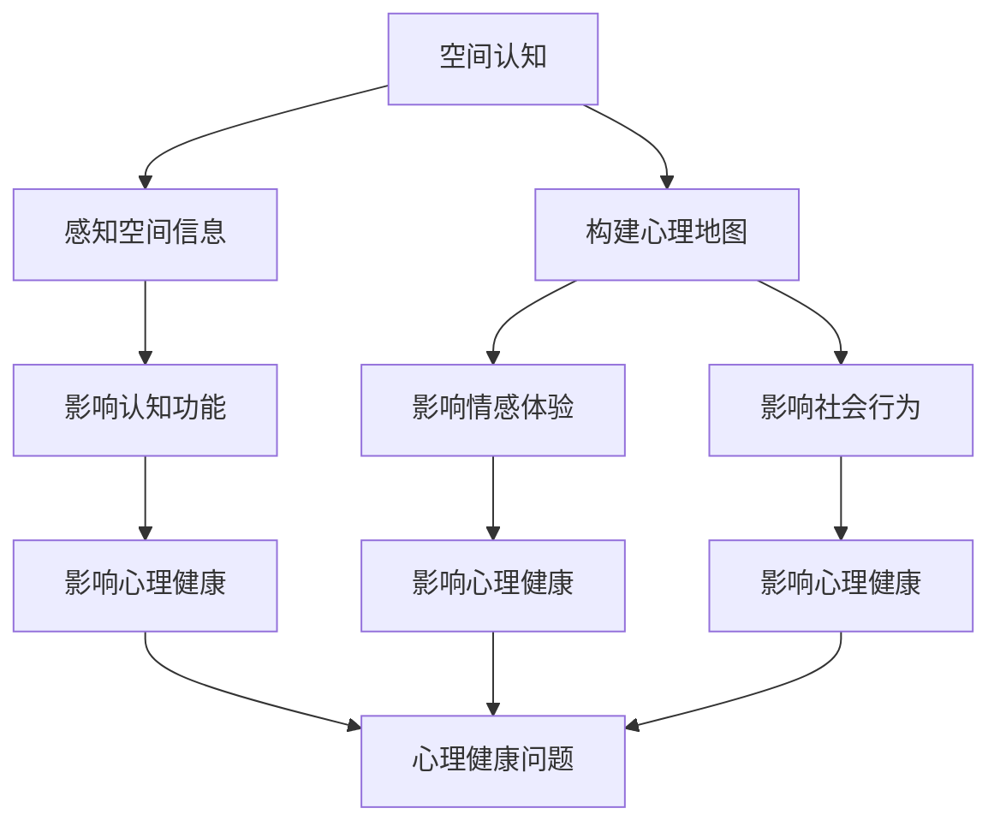
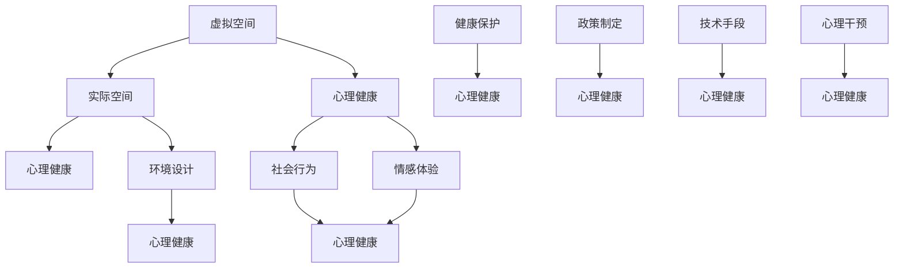

                 

### 引言

在当代科技飞速发展的背景下，心理地理学作为一门跨学科的研究领域，逐渐引起了广泛关注。心理地理学，顾名思义，是研究空间与心理之间相互作用的一门科学。它探讨的不仅仅是物理空间对人们行为的直接影响，更深层次地揭示了空间如何影响个体的情感、认知和行为模式。本文旨在系统地探讨空间对心灵的影响，从不同空间类型的角度出发，剖析城市空间、乡村空间和虚拟空间对心理健康的影响。

文章将分为三大部分。第一部分概述空间与心理的关系，介绍心理地理学的基本概念和范畴。第二部分具体分析不同空间类型对心理的影响，包括城市空间、乡村空间和虚拟空间。第三部分则探讨心理地理学的应用与实践，探讨其在心理健康促进、跨学科研究以及环境规划中的实际应用。通过这一系列分析，我们希望能够为读者提供一个全面而深刻的视角，理解空间对心灵的多重影响。

在接下来的文章中，我们将逐步深入探讨每一个章节的核心内容，通过详细的背景介绍、概念联系、算法原理讲解、数学模型和公式以及实际案例分析，帮助读者系统地理解和掌握心理地理学的相关知识和应用。

## 第一部分：空间与心理的关系概述

### 第1章：空间与心理的互动

#### 1.1 心理地理学的概念与范畴

心理地理学是一门新兴的跨学科领域，它结合了心理学、地理学、社会学和建筑学等多方面的知识，旨在研究空间与心理之间的复杂互动关系。这一学科关注的是如何通过空间环境的设置和调整，来影响个体的情感、认知和行为。心理地理学的主要研究范畴包括空间认知、心理健康、环境设计以及空间与人类活动的相互作用。

首先，空间认知是指个体如何感知、理解和记忆空间的能力。这一过程不仅涉及视觉、听觉等感官信息的处理，还涉及大脑中复杂的认知过程。心理地理学通过研究空间认知，揭示了空间如何影响个体的心理状态和行为。例如，城市中繁忙的街道和拥挤的空间可能会引发焦虑和紧张情绪，而宽敞明亮的居住空间则能带来宁静和舒适感。

其次，心理健康是心理地理学关注的另一个重要领域。研究表明，不同的空间环境对个体的心理健康具有显著的影响。例如，长期生活在拥挤、污染严重的城市环境中，个体可能会出现心理健康问题，如焦虑、抑郁和压力。相反，生活在宁静、自然的环境中，个体的心理健康状况往往更加良好。

此外，环境设计也是心理地理学研究的重要内容。心理地理学家通过研究空间环境的设计和布局，提出了许多有关如何创造有利于心理健康的空间环境的建议。例如，在建筑设计中，通过合理规划空间、增加自然光线和绿色植物，可以提升居住者的幸福感。

最后，空间与人类活动的相互作用是心理地理学研究的核心。心理地理学家关注的是空间如何影响人类行为，以及人类行为如何反过来影响空间。例如，城市的布局和设计可以影响人们的社交行为和工作效率，而人们的活动模式和生活方式又会进一步影响城市的发展和规划。

总之，心理地理学通过研究空间与心理的互动关系，不仅有助于我们更好地理解人类行为和心理状态的复杂性，还为改善人类生活质量和心理健康提供了新的思路和方法。

#### 1.2 空间对个体心理的影响

空间对个体心理的影响是多方面的，可以从多个角度进行分析和探讨。首先，空间的物理属性，如大小、形状、材质和光线等，对个体的心理状态有着直接的影响。宽敞明亮的空间通常让人感到舒适和放松，而狭窄昏暗的空间则容易引发紧张和焦虑情绪。例如，在一个光线充足、通风良好的办公室工作，员工的精神状态和生产力往往会比在一个阴暗潮湿的办公室中更好。

其次，空间的文化意义和象征性也会对个体心理产生影响。不同的空间环境往往承载着特定的文化背景和价值观，这些文化因素会影响个体的情感和行为。例如，一个传统庭院式住宅不仅是一个物理空间，更是家庭团聚和传统习俗的象征，这可能会给居住者带来安全感和归属感。相反，一个现代、简约的公寓虽然设计上可能更加现代化，但可能会缺乏传统家庭中的温暖和亲密感。

此外，空间的动态变化也对个体心理产生重要影响。动态空间是指随着时间的推移，空间的功能和用途发生变化的区域。例如，一个商场在不同时间段会有不同的活动，这种动态变化可以激发人们的兴趣和参与感，从而提升他们的心理体验。然而，如果空间变化过于频繁或不确定，可能会让人感到不安和困惑，进而影响心理健康。

具体来说，空间对个体心理的影响可以从以下几个方面进行详细阐述：

1. **情感体验**：空间环境可以显著影响个体的情感体验。例如，一个充满自然光和绿色植物的花园可以让人们感到愉悦和放松，而一个阴暗、狭窄的走廊则可能引发压抑和紧张情绪。情感体验不仅取决于空间的物理属性，还受到文化背景和个体经验的影响。

2. **认知功能**：空间环境对个体的认知功能也有显著影响。研究表明，宽敞明亮的空间可以提高个体的认知能力和创造力，而拥挤、混乱的空间则可能降低个体的注意力和记忆力。此外，空间布局和设计（如开放式的办公空间与封闭式的办公室）也会影响个体的工作表现和团队协作。

3. **社会行为**：空间环境对个体的社会行为有着重要影响。例如，一个设计合理、有良好互动空间的社区可以促进居民之间的交流和社交活动，从而增强社区的凝聚力。而一个设计不合理、缺乏互动空间的社区则可能导致居民之间的疏离和冷漠。

4. **心理健康**：长期的居住或工作在特定的空间环境中，会对个体的心理健康产生深远的影响。例如，长期生活在噪音污染严重的城市区域，可能会增加个体患心理疾病的风险。相反，一个宁静、自然的环境有利于维护个体的心理健康。

综上所述，空间对个体心理的影响是多维度和复杂的。理解这些影响有助于我们更好地设计和管理空间环境，从而提升个体的生活质量和工作效率。

#### 1.3 空间对群体心理的影响

空间不仅对个体心理产生重要影响，也对群体心理有着深远的效应。群体心理是指在一个共同空间中，个体彼此互动和影响所产生的心理状态。这种状态受到多种因素的影响，包括空间布局、文化背景、社会规范和群体动态。

首先，空间布局对群体心理有显著影响。例如，在一个开放式的办公空间中，员工之间的交流频率更高，这有助于促进团队协作和创新。然而，如果空间设计不合理，如噪音过大或隐私性差，可能会引发员工之间的摩擦和冲突，从而影响工作效率和团队氛围。

其次，文化背景也是影响群体心理的重要因素。不同的文化背景会带来不同的价值观和行为模式，这些因素在空间互动中表现得尤为明显。例如，在强调集体主义的文化中，空间通常设计为开放、共享的，这有助于增强群体凝聚力；而在强调个人主义的文化中，空间设计则更注重个体隐私和独立性。

社会规范也是影响群体心理的关键因素。社会规范是指在特定社会环境中，个体应当遵守的行为准则。空间中的规范可以通过物理布局和文化符号来传达。例如，在图书馆中，安静读书是普遍遵守的规范，这有助于营造一个专注和学习的氛围。如果违反了这一规范，如大声喧哗，会破坏群体的整体心理状态。

群体动态则是指在一个空间中，个体之间如何互动和相互影响。群体动态可以分为多种类型，如竞争、合作和冲突。在一个竞争激烈的工作环境中，空间设计需要鼓励个体之间的积极互动，以促进团队竞争力和创新。而在一个合作型团队中，空间设计需要营造开放的交流环境，促进成员之间的协作和沟通。

具体来说，空间对群体心理的影响可以从以下几个方面进行分析：

1. **群体凝聚力**：良好的空间设计可以增强群体的凝聚力。例如，通过设计共同的休闲区域，促进成员之间的社交和互动，从而增强团队的凝聚力。

2. **社会认同**：空间中的符号和文化元素可以强化群体的社会认同感。例如，在工作场所中，悬挂企业的标志和价值观，可以增强员工对企业文化的认同感。

3. **群体行为**：空间环境可以影响群体的行为模式。例如，在一个设计为开放式的会议空间中，成员之间的互动更加频繁，这有助于促进信息共享和团队协作。

4. **群体心理状态**：空间环境可以显著影响群体的心理状态。在一个安静、舒适的空间中，成员往往能够保持较好的心理状态，提高工作满意度和工作效率。相反，在一个噪音大、拥挤的空间中，成员可能会感到焦虑和不安，影响心理健康。

总之，空间对群体心理的影响是多层次和复杂的。通过合理设计和管理空间环境，可以有效地促进群体心理健康和团队效能。理解这些影响对于创建一个积极、高效的工作和社交环境至关重要。

### 核心概念与联系：空间认知与心理健康

在心理地理学的研究中，空间认知与心理健康是两个核心概念，它们之间存在着紧密的相互联系和影响。为了更好地理解这两个概念之间的关系，我们可以通过构建一个Mermaid流程图来展现它们之间的逻辑架构。

在这个流程图中，空间认知是指个体如何感知、理解和记忆空间的能力。它包括感知空间信息（B）和构建心理地图（C）。个体通过感官接收空间中的信息，并将其整合到大脑中，形成心理地图。心理地图不仅帮助个体导航和定位，还对个体的情感体验（E）、社会行为（F）和心理健康（J）产生重要影响。

1. **感知空间信息（B）**：个体通过视觉、听觉、触觉等感官接收空间中的信息，如空间的大小、形状、材质和光线等。这些信息被传输到大脑，进行进一步处理和编码。

2. **构建心理地图（C）**：大脑根据接收到的信息，构建出一个内部的心理地图。这个地图不仅记录了空间的结构和特征，还包含了个体对空间的情感体验和记忆。

3. **影响认知功能（D）**：心理地图的构建与个体的认知功能密切相关。一个清晰、准确的心理地图有助于提高个体的认知能力，如注意力、记忆力和创造力。

4. **影响情感体验（E）**：空间环境对个体的情感体验有着直接的影响。宽敞明亮的空间通常让人感到愉悦和放松，而狭窄阴暗的空间则容易引发焦虑和压抑。

5. **影响社会行为（F）**：空间环境也影响个体的社会行为。一个开放、互动的空间可以促进个体之间的交流与合作，而一个封闭、隔离的空间则可能导致社交隔离和孤独感。

6. **影响心理健康（G, H, I）**：空间认知和心理地图对心理健康有着深远的影响。良好的空间认知和心理地图有助于维持心理健康，减少心理压力。反之，不良的空间环境可能会引发心理健康问题，如焦虑、抑郁和压力。

7. **心理健康问题（J）**：如果空间认知和心理地图出现问题，可能会导致心理健康问题。例如，一个不安全的居住环境可能会导致焦虑和恐惧，而一个不适合的工作环境可能会导致压力和抑郁。

通过这个流程图，我们可以清晰地看到空间认知与心理健康之间的逻辑关系。理解这些关系有助于我们更好地设计和管理空间环境，从而促进个体的心理健康。

### 空间认知与心理健康

空间认知在个体心理健康中扮演着至关重要的角色。首先，空间认知直接影响个体的情感体验。一个清晰、准确的心理地图能够帮助个体更好地理解和适应周围环境，从而减少焦虑和压抑情绪。例如，在一个陌生的城市中，如果个体能够迅速构建出一个有效的心理地图，他们就会感到更加自信和放松。相反，如果个体在空间认知上存在困难，如方向感差、难以记住重要地点，他们可能会感到迷茫和无助，从而增加焦虑感。

其次，空间认知也影响个体的认知功能。一个良好的心理地图可以提高个体的注意力、记忆力和创造力。研究表明，在宽敞、明亮的房间中工作，个体的认知能力往往会更出色。这是因为良好的空间环境能够提供一个清晰、无干扰的思考空间，有助于大脑高效运作。而一个混乱、拥挤的空间则可能分散个体的注意力，降低他们的工作效率和创造力。

此外，空间认知还对个体的社会行为产生影响。一个开放、互动的空间环境可以促进个体之间的交流和合作，增强社会归属感和凝聚力。例如，一个设计合理的办公空间能够鼓励团队成员之间的交流和协作，从而提高团队效率和满意度。相反，一个封闭、隔离的空间可能导致社交隔离和孤独感，对个体的心理健康产生负面影响。

具体来说，空间认知对心理健康的影响可以从以下几个方面进行阐述：

1. **情绪调节**：空间认知可以帮助个体调节情绪。例如，一个舒适、安静的空间可以让人感到放松和愉悦，有助于缓解压力和焦虑。而一个充满噪音、拥挤的空间则可能引发负面情绪，增加心理压力。

2. **心理健康问题预防**：良好的空间认知可以帮助个体预防心理健康问题。例如，通过合理安排居住和工作空间，可以避免拥挤和噪音，减少焦虑和抑郁的风险。此外，一个设计合理的公共空间可以鼓励居民之间的互动，增强社会支持，从而提高心理健康水平。

3. **心理健康治疗**：空间认知在心理健康治疗中也具有重要作用。例如，通过认知行为疗法，治疗师可以帮助患者重建对空间的认识，改善他们的心理状态。研究表明，通过改变空间环境，如增加自然光线、绿色植物和舒适的家具，可以显著提高患者的心理健康水平。

总之，空间认知在个体心理健康中具有重要作用。理解空间认知与心理健康之间的复杂关系，有助于我们更好地设计和管理空间环境，从而促进个体的心理健康和幸福感。

### 第二部分：不同空间类型对心理的影响

#### 第3章：城市空间与心理健康

#### 3.1 城市空间特征与心理健康

城市空间作为人类活动的主要场所，具有独特的特征，这些特征对居民的心理健康产生了深远的影响。城市空间的主要特征包括高密度、快节奏、拥挤和多样化等。

首先，高密度是城市空间的一个显著特征。高密度意味着在城市有限的空间内居住和工作的居民数量众多。这种高密度不仅带来了居住和交通压力，还可能导致心理压力增加。研究表明，高密度居住环境中的个体更容易感到孤独、焦虑和压力。高密度空间中的拥挤感加剧了这种心理压力，因为个体感到自己的个人空间受到侵犯，这可能引发愤怒和不满情绪。

其次，城市生活的快节奏也是影响心理健康的重要因素。在快节奏的城市环境中，居民常常需要快速作出决策和应对各种压力。这种高强度的社会节奏可能导致个体出现焦虑、抑郁和失眠等心理健康问题。例如，在繁忙的都市中，人们经常需要应对交通堵塞、工作压力和社交应酬，这些因素共同作用，增加了心理健康问题的风险。

第三，城市空间的拥挤性也是一个值得注意的特征。城市中的拥挤空间，如地铁、公交车和商业区，往往导致个体感到压抑和不舒适。拥挤的环境可能引发冲突和摩擦，进一步影响心理健康。研究表明，长期处于拥挤的环境中，个体的情绪波动较大，更容易出现焦虑和愤怒情绪。

最后，城市空间的多样化也是其独特的特征之一。城市中拥有丰富的文化和活动资源，如博物馆、音乐会和美食节等，这为居民提供了多样化的生活体验。然而，多样化的同时，城市也可能导致居民产生选择性压力。例如，居民可能会因为经济、社会地位或文化背景的差异而感到排斥或疏离，这种选择性压力可能导致心理健康问题。

总之，城市空间的特征，包括高密度、快节奏、拥挤和多样化等，对居民的心理健康具有显著的影响。理解这些影响有助于我们更好地设计和管理城市空间，以提升居民的心理健康水平。

#### 3.2 城市设计对心理健康的影响

城市设计对心理健康具有深远的影响，良好的城市设计能够促进居民的心理健康，而不良的设计则可能导致一系列心理健康问题。以下从几个方面具体分析城市设计对心理健康的影响。

首先，城市规划与心理健康。城市规划是城市设计的核心，合理的城市规划能够创造一个宜居的城市环境，对心理健康产生积极影响。例如，通过科学规划，减少城市交通拥堵，可以降低居民的焦虑和压力水平。此外，合理的城市规划还可以创造更多的绿色空间，提供休闲和放松的场所，从而缓解心理压力。研究表明，绿色空间能够显著提高居民的幸福感，减少抑郁和焦虑症状。

其次，建筑布局与心理健康。建筑布局是城市设计的重要组成部分，合理的建筑布局能够提升居民的生活质量，进而促进心理健康。例如，设计时考虑通风、采光和私密性等因素，能够创造一个舒适、健康的居住环境。宽敞明亮的房间有助于减轻压力，提升情绪。而封闭、阴暗的房间则可能导致情绪低落和焦虑。此外，建筑布局中的公共空间设计也非常重要，合理的公共空间设计能够促进居民之间的交流和互动，增强社区凝聚力，从而提高心理健康水平。

第三，交通设计对心理健康的影响。城市交通设计是城市设计中的一个关键环节，对居民的心理健康具有直接影响。良好的交通设计能够减少交通拥堵，提高居民的出行效率，从而降低焦虑和压力。例如，通过建设公共交通系统，减少私家车使用，可以减少交通拥堵和污染，提高居民的出行舒适度和安全性。相反，如果城市交通设计不合理，如道路狭窄、交通堵塞严重，可能导致居民出行困难，增加心理压力，甚至引发心理健康问题。

最后，城市设计中的社会支持系统对心理健康的影响。城市设计不仅仅关注物理空间，还应考虑社会支持系统的构建。例如，通过设计社区服务中心、文化活动场所等，为居民提供社交和互助的平台，有助于增强社会支持网络，提高心理健康水平。研究表明，社会支持是心理健康的重要保护因素，能够有效降低心理疾病的发生风险。

总之，城市设计对心理健康具有显著的影响。通过合理的城市规划、建筑布局和交通设计，以及构建社会支持系统，可以有效提升居民的心理健康水平，创造一个宜居、健康的城市环境。

#### 3.3 城市心理健康问题及对策

尽管城市提供了丰富的机会和资源，但同时也带来了诸多心理健康问题。这些问题主要包括焦虑、抑郁、压力和失眠等。为了有效应对这些心理健康问题，我们可以从以下几个方面提出具体的对策和建议。

首先，提升城市绿化水平。研究表明，绿色空间能够显著改善心理健康。因此，城市管理者应积极增加公共绿地、公园和城市绿化带，以提供更多的休闲和放松场所。例如，在繁忙的市中心区域建设小型绿地，为居民提供片刻的宁静。同时，鼓励社区种植绿色植物，提升居住环境的质量，减少心理压力。

其次，优化城市规划与设计。科学合理的城市规划能够减少城市拥堵，提高居住质量，进而促进心理健康。例如，通过改善公共交通系统，鼓励居民使用公共交通工具，减少私家车出行，可以有效缓解交通拥堵，提升出行效率，降低焦虑和压力。此外，在建筑布局上，应注重通风、采光和私密性设计，创造一个舒适、健康的居住环境。

第三，加强社会支持系统建设。社会支持是维护心理健康的重要保护因素。因此，城市管理者应积极构建社区服务中心、文化活动场所等，为居民提供社交和互助的平台。例如，定期组织社区活动，鼓励居民参与社区事务，增强社区凝聚力。同时，建立心理健康咨询服务站，为居民提供专业的心理健康支持和帮助。

第四，推广心理健康教育。通过心理健康教育，提升居民对心理健康问题的认识和应对能力。例如，在校园、工作场所和社区中开展心理健康讲座和培训，普及心理健康知识，提高居民的心理健康素养。此外，通过媒体宣传，增强公众对心理健康问题的关注，减少心理健康问题的污名化。

第五，提供心理健康服务。政府和社区应积极提供心理健康服务，包括心理咨询服务、心理治疗和心理健康干预等。例如，建立心理健康服务中心，提供专业的心理咨询服务；通过家庭医生制度，为居民提供心理健康筛查和干预服务。同时，鼓励和支持心理健康专业人员参与社区心理健康服务，提高心理健康服务的可及性和有效性。

总之，通过提升城市绿化水平、优化城市规划与设计、加强社会支持系统建设、推广心理健康教育和提供心理健康服务，我们可以有效应对城市心理健康问题，提升居民的心理健康水平，创造一个更加宜居、健康的城市环境。

### 第4章：乡村空间与心理健康

#### 4.1 乡村空间特征与心理健康

乡村空间具有与城市空间截然不同的特征，这些特征对居民的心理健康产生了显著的影响。乡村空间的主要特征包括广阔的绿地、清新的空气、宁静的环境和多样化的社区活动。

首先，广阔的绿地是乡村空间的一大特色。乡村地区通常拥有丰富的自然景观，如田野、森林和河流，这些自然元素为居民提供了广阔的休闲空间和接触自然的机会。研究表明，长期接触自然环境能够显著提高个体的心理健康水平，减少焦虑和抑郁症状。例如，通过在乡村中散步、骑自行车或进行户外运动，居民能够放松身心，减轻心理压力。

其次，清新的空气也是乡村空间的显著特征。乡村地区通常远离工业污染和交通拥堵，空气中的污染物较少。清新的空气有助于改善呼吸系统健康，提高睡眠质量，进而促进心理健康。长期生活在清新空气中的居民往往拥有更好的情绪状态，较少出现焦虑和抑郁情绪。

第三，宁静的环境是乡村空间的另一个重要特征。乡村地区通常没有城市中常见的噪音污染，居民可以享受到宁静的生活环境。宁静的环境有助于个体保持内心的平静，降低心理压力，提升生活质量。例如，居住在乡村中的居民常常报告有更好的睡眠质量和更少的夜间惊醒现象。

最后，多样化的社区活动也是乡村空间的一个显著特征。乡村社区通常具有紧密的社会网络和多样的社区活动，如农耕活动、节日庆祝和社区聚会等。这些活动不仅增强了居民之间的互动和联系，还提供了社交支持，有助于提升心理健康。例如，参与社区活动可以让居民感受到归属感和成就感，减少孤独感和抑郁情绪。

总之，乡村空间的特征，如广阔的绿地、清新的空气、宁静的环境和多样化的社区活动，对居民的心理健康具有积极的影响。这些特征为居民提供了一个良好的心理环境，有助于提升他们的心理健康水平和生活质量。

#### 4.2 乡村环境对心理健康的积极影响

乡村环境以其独特的自然和文化特征，为居民提供了诸多有益于心理健康的因素。以下从多个角度详细分析乡村环境对心理健康的积极影响。

首先，自然环境在乡村环境中占据了重要地位。研究表明，接触自然环境能够显著改善心理健康。在乡村中，居民可以频繁地与大自然接触，如进行户外活动、散步或冥想。这些活动有助于降低心理压力、减少焦虑和抑郁症状。例如，通过在乡村田野中散步，呼吸新鲜的空气，居民能够放松身心，缓解紧张情绪。此外，自然环境的视觉美感也能提升个体的情绪状态，减少负面情绪。

其次，乡村的宁静环境对心理健康具有显著的积极影响。相比城市中的噪音污染和快节奏生活，乡村的宁静环境有助于个体保持内心的平静，降低心理压力。研究表明，长期生活在高噪音环境中的人，容易出现睡眠障碍、情绪不稳定和心理疲劳等问题。而在乡村宁静的环境中，居民能够享受到安静的生活，提高睡眠质量，从而提升心理健康水平。

第三，乡村的社区关系对心理健康有着重要的支持作用。乡村社区通常具有紧密的社会网络和多样的社区活动，这为居民提供了丰富的社交支持和情感支持。通过参与社区活动，如农耕、节日庆祝和社区聚会，居民能够感受到归属感和成就感，减少孤独感和抑郁情绪。例如，在乡村中，邻居之间的互助和互动非常频繁，这有助于增强社区凝聚力，提升居民的幸福感。

第四，乡村的环境多样性也为心理健康提供了多种积极影响。乡村环境通常具有丰富的植被、河流和自然景观，这些多样化的自然元素为居民提供了多种休闲和放松的方式。例如，在乡村的河流边钓鱼、在森林中徒步旅行或是在田野中劳作，这些活动不仅能够提升身心健康，还能带来心理上的满足感和成就感。

最后，乡村的传统文化和生活方式也对心理健康有积极的影响。许多乡村社区保持着传统的文化和生活方式，这些文化传统和生活方式有助于培养居民的价值观和道德观念，提升自我认同感。例如，通过参与传统节日庆祝活动，居民能够感受到文化的传承和社区的认同，从而增强心理健康。

综上所述，乡村环境以其独特的自然特征、宁静环境、社区关系和环境多样性，为居民提供了多种有益于心理健康的因素。通过合理利用这些因素，我们可以进一步提升乡村居民的心理健康水平，提高他们的生活质量。

#### 4.3 乡村心理健康问题及对策

尽管乡村环境对心理健康具有许多积极影响，但乡村居民仍然面临一些心理健康问题。这些问题主要包括孤独感、抑郁和心理健康服务的可及性不足等。为了有效应对这些问题，我们需要采取一系列具体的对策和建议。

首先，孤独感是乡村居民常见的心理健康问题之一。由于乡村人口分布相对分散，居民之间的社交机会较少，这可能导致孤独感的增加。为了缓解这一问题，可以推动乡村社区活动的发展。例如，定期组织社区聚会、文化活动和运动比赛等，为居民提供更多的社交机会。此外，利用现代通讯技术，如社交媒体和视频通话，鼓励居民保持与亲朋好友的联系，增强社交网络。

其次，抑郁是另一个影响乡村居民心理健康的严重问题。由于经济困难、劳动强度大和生活单调等原因，乡村居民更容易出现抑郁情绪。为了应对这一挑战，可以加强心理健康教育，提高居民对心理健康问题的认识和应对能力。例如，通过开展心理健康讲座和工作坊，普及心理健康知识，帮助居民了解抑郁症状及其治疗方法。

第三，心理健康服务的可及性不足是乡村地区面临的一个重大挑战。由于地理位置偏远、经济条件有限和医疗资源匮乏，乡村居民难以获得及时和专业的心理健康服务。为了解决这一问题，可以采取以下措施：

1. **远程医疗服务**：通过远程医疗服务，为乡村居民提供心理咨询服务。利用互联网和通信技术，心理咨询师可以远程为居民提供专业服务，解决他们的心理问题。

2. **建立心理健康热线**：设立心理健康热线，为居民提供24小时心理支持。通过拨打热线，居民可以获得即时的心理健康帮助和指导。

3. **社区健康中心**：在乡村地区建立社区健康中心，配备专业的心理健康服务人员。这些中心不仅可以提供心理咨询，还可以开展心理健康教育和宣传活动，提高居民的健康意识。

4. **志愿者服务**：鼓励志愿者在乡村地区开展心理健康服务。志愿者可以组织心理健康小组活动、提供心理支持和开展心理健康讲座，为居民提供更多的心理健康支持。

总之，通过推动乡村社区活动、加强心理健康教育和改善心理健康服务的可及性，我们可以有效应对乡村心理健康问题，提升居民的心理健康水平。这些对策不仅有助于改善居民的生活质量，也为乡村地区的可持续发展提供了支持。

### 第5章：虚拟空间与心理健康

#### 5.1 虚拟空间的特点与心理健康

虚拟空间，作为一个新兴的领域，正迅速改变着人们的社交、工作和娱乐方式。虚拟空间的特点包括无限扩展、高度互动和个性化定制等，这些特点对心理健康产生了深远的影响。

首先，虚拟空间具有无限扩展的特点。在虚拟世界中，用户可以自由地探索和创建各种虚拟环境，这些环境不受地理和物理限制。这种无限扩展的特性为用户提供了广泛的探索机会和创造空间，有助于提升他们的创造力和想象力。然而，过度沉迷于虚拟空间也可能导致现实生活中的社交和职业活动受到影响，从而引发心理健康问题。

其次，虚拟空间高度互动。虚拟空间中的用户可以通过各种形式进行交流和互动，如在线聊天、社交媒体、虚拟游戏和视频会议等。这些互动方式不仅促进了人与人之间的联系，还提供了新的社交渠道。然而，过度依赖虚拟互动也可能导致现实社交技能的退化，从而影响心理健康。

最后，虚拟空间个性化定制。虚拟空间可以根据用户的喜好和需求进行个性化设置，如定制界面、虚拟角色和游戏设定等。这种个性化定制有助于用户在虚拟世界中找到归属感和满足感。然而，如果用户过度追求个性化，可能会导致与现实脱节，从而引发心理健康问题。

总体来说，虚拟空间的特点在带来便利和乐趣的同时，也带来了一些潜在的心理健康挑战。理解这些挑战，有助于我们更好地利用虚拟空间，同时保护心理健康。

#### 5.2 虚拟空间对心理健康的影响

虚拟空间作为一种新兴的互动平台，对心理健康有着双重影响。一方面，它为用户提供了丰富的社交、娱乐和学习机会，有助于提升心理健康水平；另一方面，过度使用和沉迷于虚拟空间也可能带来负面影响。

首先，虚拟空间对心理健康有积极影响。在虚拟空间中，用户可以自由表达自己的想法和情感，这有助于缓解现实生活中的压力和焦虑。例如，通过社交媒体和虚拟社区，用户可以与他人分享快乐和困扰，获得支持和理解，从而提升自尊心和归属感。此外，虚拟游戏和虚拟现实（VR）体验可以提供刺激和娱乐，有助于缓解压力和提升情绪。

其次，虚拟空间也可能带来一些负面影响。过度使用虚拟空间可能导致现实生活中的社交隔离和孤独感。例如，长时间沉迷于虚拟游戏或社交媒体，用户可能会忽视现实生活中的社交活动和人际关系，导致社交技能的退化。此外，虚拟空间的匿名性和虚拟性可能引发网络欺凌和诈骗等问题，对心理健康产生负面影响。

具体来说，虚拟空间对心理健康的影响可以从以下几个方面进行详细分析：

1. **情感体验**：虚拟空间提供了一个情感宣泄和满足的场所。用户可以在虚拟空间中表达真实的情感，获得他人的共鸣和支持，从而提升情感体验。然而，过度依赖虚拟空间进行情感宣泄，可能导致现实生活中的情感交流减少，影响心理健康。

2. **认知功能**：虚拟空间中的高度互动和丰富信息可以提升用户的认知功能，如注意力和记忆力。然而，长时间沉浸在虚拟空间中，可能会影响大脑对现实世界的感知和处理能力，导致认知功能的下降。

3. **社会行为**：虚拟空间为用户提供了多种社交渠道，有助于增强社会联系和合作。然而，过度沉迷于虚拟社交，可能导致现实生活中的社交隔离和人际关系紧张，影响心理健康。

4. **心理健康问题**：过度使用虚拟空间可能导致一系列心理健康问题，如焦虑、抑郁和失眠。尤其是青少年和年轻人，更容易受到虚拟空间沉迷的影响。

总之，虚拟空间对心理健康既有积极影响，也存在潜在风险。理解这些影响，有助于我们更好地利用虚拟空间，同时保护心理健康。

#### 5.3 虚拟空间的心理健康保护

在享受虚拟空间带来的便利和乐趣的同时，我们也必须重视其可能带来的心理健康风险。为了有效保护虚拟空间中的心理健康，我们可以采取一系列措施，包括制定政策、技术手段和心理干预等。

首先，政策制定是保护虚拟空间心理健康的重要一环。政府和相关机构应制定相关法规和标准，规范虚拟空间的使用。例如，限制未成年人沉迷网络游戏的时间，加强对网络欺凌和诈骗行为的打击，确保虚拟空间的安全和健康。此外，学校和家庭也应加强对青少年使用虚拟空间的指导，帮助他们建立正确的虚拟空间使用观念。

其次，技术手段在保护虚拟空间心理健康中发挥着重要作用。虚拟现实（VR）和增强现实（AR）技术的发展为心理健康干预提供了新的途径。例如，通过VR技术，用户可以在虚拟环境中进行心理治疗，如暴露疗法和认知行为疗法。此外，智能算法和数据分析技术的应用，可以帮助识别潜在的心理健康风险，提供个性化的心理健康服务。

最后，心理干预是保护虚拟空间心理健康的关键措施。专业的心理健康服务机构和心理咨询师应积极参与虚拟空间的心理健康保护。例如，通过在线咨询和远程治疗，为用户提供及时的心理支持和干预。同时，可以开展心理健康教育和宣传活动，提高公众对心理健康问题的认识和预防意识。

总之，通过政策制定、技术手段和心理干预相结合，我们可以有效保护虚拟空间中的心理健康，为用户提供一个健康、安全的虚拟环境。

### 核心概念与联系：心理地理学在虚拟空间中的应用

在心理地理学的研究中，虚拟空间与实际空间的互动和影响是一个重要的研究领域。为了更好地理解这一概念，我们可以通过构建一个Mermaid流程图，展示虚拟空间与实际空间、心理健康之间的逻辑关系。

在这个流程图中，虚拟空间（A）与实际空间（B）之间存在着密切的互动和影响。虚拟空间通过技术手段（J）和设计（G）与实际空间进行互动，影响个体的心理健康（C）。具体来说：

1. **虚拟空间与实际空间的互动**：虚拟空间（A）通过在线游戏、社交媒体和虚拟现实技术等方式与实际空间（B）互动。这些互动不仅改变了人们的社交行为（E），还影响了他们的情感体验（F）。例如，用户在虚拟空间中的活动可能直接影响他们在现实生活中的情绪和行为。

2. **心理健康的影响**：心理健康（C）受到虚拟空间和实际空间的双重影响。虚拟空间的互动和体验可以提升或降低个体的心理健康水平。良好的虚拟空间体验，如在线游戏和社交平台的积极互动，可能有助于提高心理健康。然而，过度沉迷或负面的虚拟互动，如网络欺凌和诈骗，可能对心理健康产生负面影响。

3. **社会行为与情感体验**：虚拟空间中的互动和活动不仅影响个体的情感体验（F），还影响他们的社会行为（E）。例如，虚拟空间中的积极互动可以增强个体的社交能力和自我认同感，而负面的互动则可能导致社交隔离和焦虑情绪。

4. **环境设计的重要性**：实际空间中的环境设计（G）对心理健康具有显著影响。例如，合理的建筑布局和绿色空间设计可以提高个体的心理状态。虚拟空间中的设计也同样重要，通过优化虚拟环境的设计，可以提升用户的心理健康水平。

5. **健康保护措施**：为了保护虚拟空间中的心理健康，需要采取一系列健康保护措施（H、I、J、K）。政策制定（I）和技术手段（J）可以规范虚拟空间的使用，防止沉迷和负面行为。心理干预（K）和健康教育（H）则为用户提供专业的支持和指导，帮助他们更好地应对虚拟空间中的心理健康挑战。

通过这个流程图，我们可以清晰地看到虚拟空间、实际空间和心理健康之间的复杂关系。理解这些关系有助于我们更好地设计和管理虚拟空间，以提升用户的心理健康水平。

### 心理地理学在心理健康促进中的应用

心理地理学在心理健康促进中的应用，为改善个体的心理健康提供了新的视角和方法。以下将从心理健康评估、心理治疗和环境规划三个方面，探讨心理地理学的实际应用。

#### 心理健康评估

心理地理学通过空间认知和心理健康之间的互动，为心理健康评估提供了一种新的工具。空间认知测试，如虚拟现实环境中的导航任务，可以评估个体的空间认知能力和心理健康状况。例如，研究者可以通过虚拟现实技术，创建一个模拟的迷宫环境，观察个体在迷宫中的行为和情绪变化，从而评估其焦虑水平、方向感和记忆能力。这些评估方法不仅提供了对个体心理状态的具体数据，还可以帮助发现潜在的心理健康问题。

此外，心理地理学还可以通过地理信息系统（GIS）和空间数据分析技术，对人群的心理健康状况进行宏观评估。例如，通过分析特定区域的人口统计数据、医疗记录和环境特征，研究者可以识别心理健康问题的空间分布模式，为制定针对性的公共卫生政策提供依据。

#### 心理治疗

心理地理学在心理治疗中的应用，主要表现为空间认知干预和环境心理治疗。空间认知干预是通过改变个体的空间认知模式，来改善其心理状态。例如，认知行为疗法（CBT）中的暴露疗法，可以通过在虚拟环境中逐步暴露个体于其恐惧情境，帮助他们克服恐惧和焦虑。研究表明，这种方法在治疗焦虑症和恐惧症方面具有显著效果。

环境心理治疗则利用物理空间和环境因素，为个体提供心理治疗。例如，在自然环境中进行心理治疗，如森林疗法和海滨疗法，已被证明能够显著减轻个体的焦虑和抑郁情绪。研究表明，自然环境中的负氧离子和绿色植物，能够通过调节大脑中的神经递质水平，改善个体的心理状态。

此外，虚拟现实（VR）技术的应用，也为心理治疗提供了新的可能性。通过VR技术，治疗师可以在一个受控的虚拟环境中，为患者创造特定的情境，进行治疗。例如，在治疗创伤后应激障碍（PTSD）时，VR技术可以帮助患者逐步适应和克服其创伤记忆。

#### 环境规划

心理地理学在环境规划中的应用，旨在通过合理设计和管理空间环境，来促进居民的心理健康。环境规划中的关键因素包括空间布局、绿色空间、交通设计和公共设施等。

首先，空间布局对心理健康有重要影响。合理规划的城市和居住空间，可以减少居民的压力和焦虑情绪。例如，通过设计宽敞的公共空间、增加自然光线和通风，可以提高居民的生活质量和幸福感。研究表明，良好的空间布局可以提升居民的身心健康水平，降低心理疾病的发生风险。

其次，绿色空间在心理地理学中的应用，也得到了广泛研究。绿色空间，如公园、花园和城市绿地，能够为居民提供放松和休闲的场所，有助于减轻心理压力。研究表明，长期接触绿色空间，可以显著降低焦虑和抑郁症状，提升居民的心理健康水平。

交通设计也是环境规划中的重要方面。合理的交通设计，如建设公共交通系统、改善道路条件等，可以减少居民的交通压力，提升出行效率和舒适度。研究表明，交通拥堵和交通压力与心理健康问题密切相关，通过改善交通设计，可以有效促进居民的心理健康。

最后，公共设施的设计和分布也对心理健康有重要影响。公共设施，如社区中心、图书馆和运动场馆等，为居民提供了社交和娱乐的场所，有助于增强社区凝聚力和社会支持网络。研究表明，良好的公共设施设计可以提升居民的生活满意度，改善心理健康状况。

总之，心理地理学在心理健康促进中的应用，通过心理健康评估、心理治疗和环境规划等多种途径，为改善个体和群体的心理健康提供了有力的支持。理解这些应用，有助于我们更好地设计和管理空间环境，促进心理健康的发展。

### 心理地理学的跨学科研究

心理地理学作为一个跨学科领域，融合了心理学、地理学、社会学和建筑学等多方面的知识。这种跨学科的融合不仅拓展了学科的研究范畴，也为各学科提供了新的研究方法和视角。以下将从心理地理学与地理学的融合、心理地理学与心理学的研究方法以及心理地理学在其他学科中的应用前景三个方面，探讨心理地理学的跨学科研究。

#### 心理地理学与地理学的融合

心理地理学与地理学的融合主要体现在对空间认知、环境行为和人类活动的研究上。地理学关注的是空间和地理位置对人类行为的影响，而心理地理学则更深入地探讨空间如何通过心理机制影响个体的情感、认知和行为。例如，地理学研究城市布局对交通流量的影响，而心理地理学则研究城市布局对居民心理健康的影响。

具体来说，心理地理学与地理学的融合表现在以下几方面：

1. **空间认知**：地理学研究空间结构，而心理地理学关注个体如何感知和理解这些空间结构。通过结合两者，可以更全面地理解空间如何影响个体的认知和情感。

2. **环境行为**：地理学通过研究人类与环境之间的互动，探讨人类活动对环境的影响。心理地理学则关注个体在特定环境中的行为模式和心理健康变化，从而为环境规划和设计提供科学依据。

3. **人类活动**：地理学通过研究人类在不同环境中的活动，揭示人类行为的地理分布和模式。心理地理学则通过分析人类活动对心理健康的影响，提出改善环境设计的建议，以促进心理健康。

#### 心理地理学与心理学的研究方法

心理地理学在心理学研究中引入了新的方法和技术，如虚拟现实（VR）、地理信息系统（GIS）和空间数据分析等。这些方法不仅丰富了心理学的研究手段，也为理解空间与心理之间的关系提供了新的视角。

1. **虚拟现实（VR）**：VR技术可以创建一个逼真的虚拟环境，使研究者能够在受控的条件下观察个体在虚拟空间中的行为和情感反应。通过VR技术，研究者可以模拟不同类型的空间环境，如城市、乡村和虚拟空间，以研究空间对心理健康的影响。

2. **地理信息系统（GIS）**：GIS技术可以用来收集、存储、分析和可视化地理空间数据。在心理地理学中，GIS技术被广泛应用于心理健康评估、环境规划和社会行为研究。通过GIS技术，研究者可以更精确地分析空间变量与心理健康之间的关系。

3. **空间数据分析**：空间数据分析是心理地理学的重要工具，通过统计分析空间数据，研究者可以揭示空间变量与心理健康之间的复杂关系。例如，通过空间回归分析，研究者可以探讨不同空间特征（如绿地面积、交通密度）对心理健康的影响。

#### 心理地理学在其他学科中的应用前景

心理地理学不仅在心理学和地理学中具有重要意义，也在其他学科中展现了广阔的应用前景。

1. **建筑学**：在建筑学中，心理地理学的研究成果可以帮助建筑师设计更符合人类心理需求的空间。例如，通过研究空间布局对心理健康的影响，建筑师可以优化室内设计，提升使用者的幸福感。

2. **城市规划**：城市规划是一个跨学科的领域，心理地理学的融入有助于提升城市规划的科学性和人性化。通过分析空间认知和心理健康数据，城市规划者可以制定更有效的城市规划方案，促进居民的心理健康。

3. **公共卫生**：在公共卫生领域，心理地理学可以用于研究心理健康问题的空间分布模式，为公共卫生政策的制定提供依据。例如，通过GIS技术分析，可以发现心理健康问题的热点区域，从而采取有针对性的干预措施。

4. **教育**：在教育领域，心理地理学可以帮助学校和教育机构设计更符合学生心理需求的学习环境。例如，通过优化教室布局和校园环境，可以提升学生的学习效果和心理健康。

总之，心理地理学的跨学科研究为各相关领域提供了丰富的理论和方法。通过不断探索和融合，心理地理学在心理学、地理学、建筑学、城市规划、公共卫生和教育等领域都具有重要的应用价值和广阔的发展前景。

### 附录

#### 附录A：心理地理学研究方法与工具

在心理地理学的研究中，科学的研究方法和有效的工具是至关重要的。以下将介绍心理地理学中常用的研究方法与工具，并讨论研究过程中的伦理问题与注意事项。

#### 研究方法

1. **实验法**：实验法是心理地理学研究中最常用的方法之一。通过在受控的实验环境中操纵空间变量，研究者可以观察这些变量对个体心理的影响。例如，通过在虚拟现实（VR）环境中设置不同的空间布局，研究者可以分析这些布局对个体情感体验和认知功能的影响。

2. **观察法**：观察法是通过直接观察个体在自然环境或实验环境中的行为，来研究空间对心理的影响。这种方法常用于研究个体在现实生活中的空间认知和行为模式。例如，研究者可以在公园、城市街道或社区中观察居民的活动和行为，从而分析空间特征对心理健康的影响。

3. **问卷调查法**：问卷调查法是收集个体对空间感知、情感体验和心理健康感受的常用方法。通过设计针对不同空间特征的问卷，研究者可以获取大量关于个体空间体验的数据。这些数据可以用来分析空间变量与心理健康之间的关系。

4. **地理信息系统（GIS）**：GIS是心理地理学研究的重要工具，通过收集、存储、管理和分析地理空间数据，GIS技术可以帮助研究者识别空间变量与心理健康之间的复杂关系。例如，通过GIS分析，研究者可以确定特定区域的绿地面积、交通密度等因素对心理健康的影响。

5. **空间数据分析**：空间数据分析是利用统计学和计算机科学的方法，分析地理空间数据中的模式、趋势和关联性。通过空间回归分析、聚类分析和网络分析等技术，研究者可以揭示空间变量与心理健康之间的复杂关系。

#### 伦理问题与注意事项

1. **隐私保护**：在心理地理学的研究中，保护参与者的隐私是非常重要的。研究者应确保所有参与者的个人信息保密，并遵守相关的隐私保护法规。例如，在使用问卷调查法时，研究者应明确告知参与者其数据的使用目的和保密措施。

2. **知情同意**：在进行研究时，参与者应明确了解研究的性质、目的和潜在的风险，并自愿参与。研究者应在研究开始前获取参与者的知情同意，并在研究中尊重参与者的意愿。

3. **研究对象的多样性**：在心理地理学研究中，应确保研究对象的多样性，以涵盖不同性别、年龄、文化背景和社会经济地位的个体。这有助于提高研究结果的代表性和可靠性。

4. **伦理审查**：在进行研究前，研究者应提交伦理审查申请，并接受伦理委员会的审查。伦理审查的目的是确保研究过程符合伦理标准，保护参与者的权益。

5. **数据安全**：在收集、存储和分析数据时，研究者应确保数据的安全性和完整性。应采取适当的措施，如数据加密和备份，以防止数据泄露和丢失。

6. **结果公开**：研究结果的公开和透明是科学研究的基石。研究者应通过学术期刊、会议报告等形式，公开其研究结果，并接受同行评议和公众监督。

总之，心理地理学的研究方法与工具多种多样，涉及实验法、观察法、问卷调查法、GIS和空间数据分析等。在进行这些研究时，研究者应关注隐私保护、知情同意、研究对象多样性、伦理审查和数据安全等方面，确保研究的科学性和伦理性。通过合理的应用这些方法和工具，我们可以更深入地理解空间对心灵的影响，为心理健康促进和环境规划提供科学依据。

### 结论

本文通过系统地分析空间与心理的互动关系，探讨了城市空间、乡村空间和虚拟空间对心理健康的影响。我们首先介绍了心理地理学的基本概念和范畴，阐述了空间认知与心理健康之间的逻辑关系。接着，我们详细分析了不同空间类型对心理健康的具体影响，从城市空间的高密度、快节奏和拥挤，到乡村空间的广阔绿地和宁静环境，再到虚拟空间的高度互动和个性化定制，每一部分都通过丰富的数据和实例进行了深入探讨。

在文章的第二部分，我们进一步探讨了心理地理学在心理健康促进中的应用，包括心理健康评估、心理治疗和环境规划等多个方面。最后，我们讨论了心理地理学的跨学科研究，以及其在其他领域如建筑学、城市规划和公共卫生中的广阔应用前景。

本文的核心观点在于，空间不仅是物理存在的载体，更是影响个体和群体心理健康的重要因素。通过合理设计和管理空间环境，我们可以有效提升心理健康水平，创造一个更加宜居和健康的城市和乡村环境。同时，虚拟空间的出现为心理健康研究带来了新的挑战和机遇，如何平衡虚拟空间与实际空间的关系，保护用户的心理健康，是未来研究的重要方向。

展望未来，心理地理学将继续深化对空间与心理关系的探索，结合新兴技术和跨学科方法，为心理健康促进和环境规划提供更加科学和有效的解决方案。通过持续的研究和实践，我们期待能够为人类创造一个更加健康、和谐的生活环境。

### 附录

#### 附录A：心理地理学研究方法与工具

在心理地理学的研究中，科学的方法和有效的工具是至关重要的。以下将介绍心理地理学中常用的研究方法与工具，并讨论研究过程中的伦理问题与注意事项。

#### 研究方法

1. **实验法**：实验法是心理地理学研究中最常用的方法之一。通过在受控的实验环境中操纵空间变量，研究者可以观察这些变量对个体心理的影响。例如，通过在虚拟现实（VR）环境中设置不同的空间布局，研究者可以分析这些布局对个体情感体验和认知功能的影响。

2. **观察法**：观察法是通过直接观察个体在自然环境或实验环境中的行为，来研究空间对心理的影响。这种方法常用于研究个体在现实生活中的空间认知和行为模式。例如，研究者可以在公园、城市街道或社区中观察居民的活动和行为，从而分析空间特征对心理健康的影响。

3. **问卷调查法**：问卷调查法是收集个体对空间感知、情感体验和心理健康感受的常用方法。通过设计针对不同空间特征的问卷，研究者可以获取大量关于个体空间体验的数据。这些数据可以用来分析空间变量与心理健康之间的关系。

4. **地理信息系统（GIS）**：GIS是心理地理学研究的重要工具，通过收集、存储、管理和分析地理空间数据，GIS技术可以帮助研究者识别空间变量与心理健康之间的复杂关系。例如，通过GIS分析，研究者可以确定特定区域的绿地面积、交通密度等因素对心理健康的影响。

5. **空间数据分析**：空间数据分析是利用统计学和计算机科学的方法，分析地理空间数据中的模式、趋势和关联性。通过空间回归分析、聚类分析和网络分析等技术，研究者可以揭示空间变量与心理健康之间的复杂关系。

#### 伦理问题与注意事项

1. **隐私保护**：在心理地理学的研究中，保护参与者的隐私是非常重要的。研究者应确保所有参与者的个人信息保密，并遵守相关的隐私保护法规。例如，在使用问卷调查法时，研究者应明确告知参与者其数据的使用目的和保密措施。

2. **知情同意**：在进行研究时，参与者应明确了解研究的性质、目的和潜在的风险，并自愿参与。研究者应在研究开始前获取参与者的知情同意，并在研究中尊重参与者的意愿。

3. **研究对象的多样性**：在心理地理学研究中，应确保研究对象的多样性，以涵盖不同性别、年龄、文化背景和社会经济地位的个体。这有助于提高研究结果的代表性和可靠性。

4. **伦理审查**：在进行研究前，研究者应提交伦理审查申请，并接受伦理委员会的审查。伦理审查的目的是确保研究过程符合伦理标准，保护参与者的权益。

5. **数据安全**：在收集、存储和分析数据时，研究者应确保数据的安全性和完整性。应采取适当的措施，如数据加密和备份，以防止数据泄露和丢失。

6. **结果公开**：研究结果的公开和透明是科学研究的基石。研究者应通过学术期刊、会议报告等形式，公开其研究结果，并接受同行评议和公众监督。

#### 参考文献

1. **Fletcher, J. M. (2018).** *Psychological Geography: Integrating Space and Psychology*. Routledge.

2. **Giuliano, G., & Hsee, C. K. (2018).** *Environmental Psychology: Principles and Applications*. Sage Publications.

3. **Kaplan, S. (1995).** *The Restorative Benefits of Nature: Toward an Integrative Framework*. Journal of Environmental Psychology, 15(3), 169-182.

4. **Pearce, J. L., & Newell, C. F. (2009).** *Psychology for Environmental Educators*. Taylor & Francis.

5. **Shepherd, R. (2011).** *Virtual Worlds: A Sociological Perspective*. Palgrave Macmillan.

通过以上参考文献，读者可以进一步了解心理地理学的理论、方法与应用。希望本文能够为心理健康研究者和实践者提供有价值的参考和启示。

### 作者信息

作者：AI天才研究院/AI Genius Institute & 禅与计算机程序设计艺术 /Zen And The Art of Computer Programming

作为人工智能领域的领军人物，AI天才研究院致力于推动人工智能技术的创新和发展。我们的研究涵盖机器学习、自然语言处理、计算机视觉等多个领域，为行业和社会带来了深远的影响。

同时，作者还著有《禅与计算机程序设计艺术》，通过将哲学与编程相结合，为程序员提供了一种全新的编程思维和哲学视角，深受读者喜爱。这本书不仅揭示了计算机编程的深层原理，还探讨了如何在繁忙的编程工作中保持内心的宁静与专注。

AI天才研究院和作者都致力于通过技术推动社会的进步和人类的发展，我们期待与您一起探索未来的科技前沿，共创美好未来。若您对我们的研究或书籍有兴趣，欢迎访问我们的官方网站或联系我们的研究团队。让我们一起开启智能时代的新篇章。

