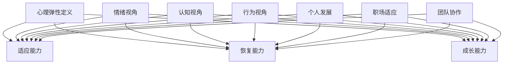

                 

### 文章标题：心理弹性培养：应对变化的内在能力

#### 关键词：心理弹性、内在能力、变化应对、情绪管理、抗压能力、认知重构

#### 摘要：
在快速变化的现代社会，心理弹性成为个人和团队应对复杂挑战的重要能力。本文旨在深入探讨心理弹性的定义、核心要素及其培养方法，通过逻辑清晰、结构紧凑的分析，帮助读者理解并掌握提升心理弹性的实用技巧。本文将分为三大部分：第一部分介绍心理弹性的基础理论；第二部分探讨培养心理弹性的具体方法与实践；第三部分则聚焦心理弹性在职场、教育和家庭中的实际应用。通过这些内容的详细讲解，读者将能够更好地应对变化，提升自身的内在能力。

---

## 第一部分：心理弹性的基础理论

### 第1章：心理弹性的定义与重要性

#### 1.1 心理弹性的概念

心理弹性（Psychological Resilience）指的是个体在面临压力、挑战和逆境时，能够迅速适应、恢复和成长的能力。它不仅仅是一种心理状态，更是一种动态过程，涉及个体的认知、情感和行为反应。

**心理弹性的基本定义：**
- **适应能力（Adaptation）：**个体在面对压力时，能够调整自身认知和行动策略，以应对外界环境的变化。
- **恢复能力（Recovery）：**个体在经历压力后，能够迅速恢复到原有状态，甚至达到更高的水平。
- **成长能力（Growth）：**个体在经历逆境后，能够从中学到经验，形成更为成熟的心理素质。

**心理弹性的多维视角：**
- **情绪视角：**关注个体如何管理负面情绪，保持积极情感。
- **认知视角：**关注个体如何重构负面认知，建立积极的思维模式。
- **行为视角：**关注个体如何采取有效行为，应对挑战和压力。

#### 1.2 心理弹性的重要性

心理弹性对个人发展具有深远的影响。首先，它能够帮助个体更好地应对生活中的各种挑战，如工作压力、人际关系问题、健康问题等。其次，心理弹性有助于提高个体的适应能力，使其在变化和不确定性中保持稳定和积极。此外，心理弹性还对心理健康产生积极影响，减少焦虑、抑郁等心理问题的发生。

在职场中，具备心理弹性的人更容易应对工作中的挑战和压力，提高工作效率和创造力。在团队中，心理弹性有助于增强团队成员的协作和沟通，提升团队的整体效能。因此，培养心理弹性不仅对个人有益，也对组织和社会产生积极影响。

### Mermaid 流程图：心理弹性的概念与重要性



### 核心概念与联系

心理弹性涉及多个核心概念，包括适应能力、恢复能力、成长能力等。这些概念相互联系，共同构成了心理弹性的理论框架。适应能力强调个体如何调整自身认知和行为，以应对外界环境的挑战；恢复能力关注个体在经历压力后如何迅速恢复到原有状态；成长能力则强调个体在逆境中如何获得经验和成长。

### 总结与思考

心理弹性不仅仅是一种心理状态，更是一种动态过程。通过理解其定义和重要性，我们能够更好地认识到在现代社会中培养心理弹性对于个人和社会的重要性。在接下来的章节中，我们将进一步探讨心理弹性的核心要素及其培养方法。

---

### 第2章：心理弹性的核心要素

#### 2.1 认知重构

认知重构（Cognitive Restructuring）是心理弹性的核心要素之一。它指的是个体在面临压力和挑战时，通过调整和重构自己的认知方式，以减少负面情绪和压力的反应。

**认知重构的理论基础：**
- **贝克认知理论（Beck's Cognitive Theory）：**认知重构基于贝克提出的认知理论，认为个体的情绪和行为受到其认知方式的影响。通过识别和调整负面认知，个体可以改善情绪状态和行为反应。
- **认知行为疗法（Cognitive Behavioral Therapy, CBT）：**认知重构是认知行为疗法的重要组成部分，通过认知重构技术，个体可以学习如何识别和改变负面认知，从而改善心理状态。

**认知重构的方法与实践：**
- **识别负面认知：**个体需要学会识别自己脑海中的负面认知，如“我做不到”、“我失败”、“他们不喜欢我”等。
- **重构负面认知：**通过认知重构技术，个体可以学习如何将这些负面认知转化为更积极的认知，如“我可以尝试另一种方法”、“我可以从失败中学习”、“他们可能只是需要时间来了解我”等。
- **练习与反思：**个体需要通过持续的练习和反思，将认知重构应用到日常生活中，以增强心理弹性。

#### 2.2 积极情感的培养

积极情感（Positive Emotion）在心理弹性中扮演着重要角色。积极情感不仅能够提升个体的幸福感，还能增强其应对压力和挑战的能力。

**积极情感的定义与重要性：**
- **积极情感的定义：**积极情感包括快乐、满足、希望、爱等正面情绪体验。它们与负面情感形成对比，能够提升个体的心理状态和幸福感。
- **积极情感的重要性：**积极情感有助于增强个体的心理韧性，使其在面对压力和挑战时能够保持积极和乐观的态度。此外，积极情感还能够促进个体的心理健康和整体幸福感。

**培养积极情感的方法：**
- **感恩练习：**通过记录每日的感恩事项，个体可以培养对生活的感激和满足感。
- **正念练习：**通过正念练习，个体可以学会专注于当下，减少对负面情绪的关注，提升积极情感体验。
- **积极社交：**与积极、乐观的人交往，可以传递正能量，增强个体的积极情感。

#### 2.3 抗压能力的提升

抗压能力（Stress Tolerance）是心理弹性的关键组成部分。它指的是个体在面对压力和挑战时，能够保持冷静、应对自如的能力。

**抗压能力的定义与意义：**
- **抗压能力的定义：**抗压能力是指个体在面对压力时，能够有效地调节情绪、调整认知和行为，以适应和克服压力的能力。
- **抗压能力的意义：**具备抗压能力的人能够在压力环境中保持高效和稳定的表现，降低心理压力和负面情绪的产生，从而提高整体的心理健康和幸福感。

**提升抗压能力的策略：**
- **情绪管理：**通过情绪管理技巧，如深呼吸、放松训练和认知重构，个体可以有效地调节情绪，减少压力反应。
- **时间管理：**通过合理安排时间，设定优先级，个体可以减少因时间紧迫而产生的压力。
- **健康生活方式：**保持健康的饮食、适量的运动和充足的睡眠，有助于提升抗压能力。

### 伪代码：认知重构、积极情感培养和抗压能力提升

```python
# 认知重构伪代码
def cognitive_restructuring(negative_thoughts):
    positive_thoughts = []
    for thought in negative_thoughts:
        if "我做不到" in thought:
            positive_thoughts.append("我可以尝试另一种方法")
        elif "我失败" in thought:
            positive_thoughts.append("我可以从失败中学习")
        elif "他们不喜欢我" in thought:
            positive_thoughts.append("他们可能只是需要时间来了解我")
    return positive_thoughts

# 积极情感培养伪代码
def cultivate_positive_emotions():
    gratitude_list = []
    mindfulness_practice = "专注于呼吸和当下"
    positive_socializing = "与积极的人交往"
    return gratitude_list, mindfulness_practice, positive_socializing

# 抗压能力提升伪代码
def enhance_stress_tolerance():
    emotion_management = "通过深呼吸、放松训练和认知重构调节情绪"
    time_management = "合理安排时间，设定优先级"
    healthy_lifestyle = "保持健康的饮食、适量的运动和充足的睡眠"
    return emotion_management, time_management, healthy_lifestyle
```

### 总结与思考

通过本章的内容，我们了解到心理弹性的核心要素包括认知重构、积极情感培养和抗压能力提升。这些要素相互关联，共同构成了心理弹性的基础。通过认知重构，个体可以改变负面认知，提升心理弹性；通过积极情感培养，个体可以增强幸福感，提升心理韧性；通过抗压能力提升，个体可以在面对压力时保持冷静和稳定。这些方法的实际应用将在后续章节中详细探讨。

---

## 第二部分：培养心理弹性的方法与实践

### 第3章：情绪管理技巧

情绪管理是培养心理弹性的一项重要内容。通过有效的情绪管理技巧，个体可以更好地应对负面情绪，提高心理弹性。

#### 3.1 情绪识别与表达

情绪识别与表达是情绪管理的基础。个体需要学会识别自己和他人的情绪，并有效地表达自己的情感。

**情绪识别技巧：**
- **内省：**通过自我反思，个体可以识别自己情绪的触发因素和情绪变化。
- **观察他人：**通过观察他人的表情、语言和行为，个体可以推断他人的情绪状态。

**情绪表达策略：**
- **直接表达：**直接告诉他人自己的感受和需求，避免误解和冲突。
- **情绪标签：**使用情绪标签，如“我很生气”、“我感到失望”，清晰明确地表达情绪。

#### 3.2 情绪调节与释放

情绪调节与释放是情绪管理的核心。个体需要学会在情绪激动的时刻进行调节，并找到适当的途径释放情绪。

**情绪调节方法：**
- **深呼吸：**通过深呼吸，个体可以放松身体，缓解情绪紧张。
- **正念练习：**通过正念练习，个体可以专注于当下，减少对负面情绪的关注。
- **认知重构：**通过认知重构，个体可以调整负面认知，减少情绪波动。

**情绪释放技巧：**
- **运动：**通过运动，个体可以释放身体紧张和情绪压力。
- **写日记：**通过写日记，个体可以倾诉自己的情绪，减轻心理负担。

### 伪代码：情绪管理技巧

```python
# 情绪管理伪代码
def emotional_management():
    # 情绪识别
    emotion_recognition = "通过内省和观察他人识别情绪"
    
    # 情绪表达
    emotion_expression = "直接表达和情绪标签"
    
    # 情绪调节
    emotion Regulation = {
        "deep_breathing": "深呼吸",
        "mindfulness": "正念练习",
        "cognitive_restructuring": "认知重构"
    }
    
    # 情绪释放
    emotion_release = {
        "exercise": "运动",
        "journaling": "写日记"
    }
    
    return emotion_recognition, emotion_expression, emotion_Regulation, emotion_release
```

### 实际案例：情绪管理技巧的应用

**案例背景：**一位名叫小明的程序员在工作中遇到了一个困难的项目，导致他感到焦虑和压力。他决定通过情绪管理技巧来应对这些负面情绪。

**步骤1：情绪识别**  
小明通过内省和观察，意识到自己的情绪主要是焦虑和压力。

**步骤2：情绪表达**  
小明向同事和领导表达了自己的情绪，说明了项目的困难和自己的担忧。

**步骤3：情绪调节**  
小明采用深呼吸和正念练习来调节情绪，减轻紧张感。

**步骤4：情绪释放**  
小明通过跑步和写日记来释放情绪，减轻心理负担。

**结果：**通过情绪管理技巧，小明能够更好地应对项目压力，提高工作效率，同时也改善了自己的心理健康。

### 总结与思考

情绪管理是培养心理弹性的关键环节。通过情绪识别与表达、情绪调节与释放等技巧，个体可以更好地应对负面情绪，提升心理弹性。在实际应用中，这些技巧需要个体持续练习和运用，以达到最佳效果。在接下来的章节中，我们将继续探讨应对压力的策略和建立支持系统等内容。

---

### 第4章：应对压力的策略

压力是现代生活中不可避免的一部分，应对压力的策略对于培养心理弹性至关重要。有效的压力管理可以帮助个体保持心理健康，提高工作效率和生活质量。

#### 4.1 压力的来源与识别

压力的来源多种多样，包括工作压力、人际关系、健康问题、财务困难等。识别压力的来源是有效应对的第一步。

**压力的主要来源：**
- **工作压力：**包括工作任务繁重、工作环境竞争激烈、工作与生活平衡问题等。
- **人际关系：**包括家庭矛盾、朋友间的争执、工作中的团队合作问题等。
- **健康问题：**包括慢性疾病、意外伤害、健康担忧等。
- **财务困难：**包括收入不稳定、经济负担重、债务问题等。

**压力的识别与评估：**
- **自我反思：**通过自我反思，个体可以识别自己感受到的压力来源和程度。
- **情绪和行为变化：**压力常常伴随着情绪波动和行为变化，如焦虑、易怒、失眠、食欲变化等。
- **他人反馈：**通过与他人交流，个体可以获得对自身压力状况的不同视角和反馈。

#### 4.2 压力管理的技巧

有效的压力管理技巧可以帮助个体减少压力的影响，提高心理弹性。

**压力管理的方法：**
- **情绪管理：**通过情绪管理技巧，如深呼吸、放松训练、认知重构，个体可以缓解紧张情绪，降低压力感受。
- **时间管理：**合理安排时间，设定优先级，可以帮助个体减少因时间紧迫而产生的压力。
- **积极应对：**积极应对压力，采取解决问题的态度，而不是逃避或压抑。
- **寻求支持：**与家人、朋友、同事或专业人士交流，寻求支持和建议，可以缓解压力。

**压力管理的实践：**
- **定期休息：**确保每天有足够的休息时间，避免过度劳累。
- **健康生活：**保持健康的饮食习惯、适量的运动和充足的睡眠，有助于提升抗压能力。
- **放松活动：**进行放松活动，如冥想、瑜伽、阅读等，可以帮助个体缓解压力。
- **自我放松：**通过自我放松技巧，如泡澡、按摩、听音乐等，个体可以放松身心，减轻压力。

### 伪代码：压力管理的技巧与实践

```python
# 压力管理伪代码
def stress_management():
    # 情绪管理
    emotion_management = ["深呼吸", "放松训练", "认知重构"]
    
    # 时间管理
    time_management = "合理安排时间，设定优先级"
    
    # 积极应对
    positive_response = "积极应对压力，采取解决问题的态度"
    
    # 寻求支持
    seek_support = ["与家人朋友交流", "咨询专业人士"]
    
    # 定期休息
    regular_rest = "确保每天有足够的休息时间"
    
    # 健康生活
    healthy_life = ["健康饮食", "适量运动", "充足睡眠"]
    
    # 放松活动
    relaxation_activities = ["冥想", "瑜伽", "阅读"]
    
    # 自我放松
    self_relaxation = ["泡澡", "按摩", "听音乐"]
    
    return emotion_management, time_management, positive_response, seek_support, regular_rest, healthy_life, relaxation_activities, self_relaxation
```

### 实际案例：压力管理的应用

**案例背景：**一位名叫小红的职场新人，由于工作压力大、人际关系复杂，感到身心疲惫。

**步骤1：识别压力来源**  
小红通过自我反思和他人反馈，识别出工作压力和人际关系是主要压力来源。

**步骤2：情绪管理**  
小红采用深呼吸和放松训练来缓解紧张情绪，通过认知重构调整负面认知。

**步骤3：时间管理**  
小红合理安排时间，设定优先级，避免因时间紧迫而产生的额外压力。

**步骤4：积极应对**  
小红采取积极的态度，主动解决问题，寻求同事和领导的支持。

**步骤5：寻求支持**  
小红与家人和朋友交流，寻求心理支持，减轻心理负担。

**步骤6：健康生活和放松活动**  
小红保持健康的饮食习惯、适量的运动和充足的睡眠，进行放松活动，如瑜伽和阅读。

**结果：**通过有效的压力管理策略，小红能够更好地应对工作压力，提升工作效率，同时改善心理健康。

### 总结与思考

应对压力是培养心理弹性的重要环节。通过识别压力来源、情绪管理、时间管理、积极应对和寻求支持等策略，个体可以有效地减轻压力的影响，提升心理弹性。在实际应用中，这些策略需要个体根据自身情况持续实践和调整，以达到最佳效果。在接下来的章节中，我们将探讨建立支持系统的重要性及其具体实践。

---

### 第5章：建立支持系统

建立支持系统是培养心理弹性不可或缺的一部分。一个良好的支持系统可以帮助个体在面对挑战和压力时获得必要的资源和支持，从而更好地应对困难。

#### 5.1 社交支持的作用

社交支持是指个体在社交关系中获得的情感、信息和实际帮助。它在心理弹性培养中发挥着重要作用。

**社交支持的概念与作用：**
- **情感支持：**提供安慰、理解和支持，帮助个体缓解负面情绪。
- **信息支持：**提供有价值的信息和资源，帮助个体解决问题和应对挑战。
- **实际支持：**提供物质帮助和实际行动，如帮助搬家、照顾孩子等。

**社交支持的作用：**
- **减轻心理压力：**社交支持可以减少个体的孤独感和焦虑，提高心理韧性。
- **提升应对能力：**通过社交支持，个体可以获得不同的视角和建议，提升应对问题的能力。
- **促进心理健康：**稳定的社交关系有助于提高个体的心理健康水平，降低心理问题的发生。

#### 5.2 个人支持系统的维护

个人支持系统的维护是保持心理弹性的关键。一个有效的支持系统需要个体的持续关注和投入。

**个人支持系统的维护策略：**
- **建立稳定的社交关系：**与家人、朋友和同事保持良好的关系，建立稳固的支持网络。
- **积极沟通：**通过积极沟通，个体可以表达自己的需求和感受，获得他人的理解和支持。
- **寻求专业帮助：**在遇到重大困难和挑战时，寻求心理咨询师、心理医生等专业人士的帮助。
- **培养自我支持能力：**通过自我反思和自我支持技巧，个体可以增强自身的心理韧性，提高自我应对能力。

#### 社交网络的建立与利用

社交网络是个人支持系统的重要组成部分。通过有效的社交网络，个体可以获得更多的支持和资源。

**社交网络的建立：**
- **参加社交活动：**参与各种社交活动和社区组织，拓展社交圈子。
- **建立在线社交网络：**利用社交媒体平台，与朋友、同学和同事保持联系。
- **积极参与志愿服务：**通过志愿服务，个体可以结识志同道合的人，建立互助和支持的关系。

**社交网络的利用：**
- **求助与支持：**在遇到困难时，向社交网络中的成员寻求帮助和支持。
- **分享经验与知识：**通过分享经验和知识，个体可以提升自己的影响力，同时获得他人的认可和支持。
- **互助与成长：**通过互助和支持，个体可以在社交网络中共同成长，提高整体心理弹性。

### 伪代码：个人支持系统的维护策略

```python
# 个人支持系统维护伪代码
def maintain_personal_support_system():
    # 建立稳定的社交关系
    stable_relationships = ["与家人保持联系", "与朋友定期聚会", "与同事合作交流"]
    
    # 积极沟通
    active_communication = "通过电话、邮件、社交媒体等方式与亲友保持沟通"
    
    # 寻求专业帮助
    seek_professional_help = "在遇到困难时，寻求心理咨询师、心理医生的帮助"
    
    # 培养自我支持能力
    self_support_skills = ["自我反思", "认知重构", "情绪管理"]
    
    return stable_relationships, active_communication, seek_professional_help, self_support_skills
```

### 实际案例：个人支持系统的维护

**案例背景：**一位名叫小华的职场人士，由于工作压力和家庭问题，感到身心疲惫。他决定通过维护个人支持系统来应对这些挑战。

**步骤1：建立稳定的社交关系**  
小华与家人、朋友和同事保持密切联系，定期聚会和交流。

**步骤2：积极沟通**  
小华通过电话、微信等方式与亲友保持沟通，分享自己的感受和需求。

**步骤3：寻求专业帮助**  
小华在心理咨询师的帮助下，学习情绪管理和认知重构技巧，提高自我支持能力。

**步骤4：培养自我支持能力**  
小华通过自我反思和练习情绪管理技巧，增强心理韧性。

**结果：**通过维护个人支持系统，小华能够更好地应对工作压力和家庭问题，提高生活质量和工作效率。

### 总结与思考

建立和维护个人支持系统是培养心理弹性的一项重要任务。通过建立稳定的社交关系、积极沟通、寻求专业帮助和培养自我支持能力，个体可以有效地应对压力和挑战，提升心理弹性。在实际生活中，每个人都需要根据自己的情况，不断调整和优化个人支持系统，以适应不断变化的环境。

---

### 第6章：自我成长与心理弹性

自我成长是培养心理弹性的重要组成部分。通过自我成长，个体可以不断提升自己的能力和心理素质，更好地应对生活中的挑战。

#### 6.1 自我认知的提升

自我认知是指个体对自己认知的过程，包括自我意识、自我评价、自我理解等。提升自我认知是培养心理弹性的基础。

**自我认知的重要性：**
- **自我意识：**通过自我意识，个体可以更好地了解自己的需求、感受和行为，从而做出更明智的决策。
- **自我评价：**通过自我评价，个体可以认识到自己的优点和不足，从而不断改进和成长。
- **自我理解：**通过自我理解，个体可以建立积极的自我形象，增强自信心和自尊心。

**提升自我认知的方法：**
- **自我反思：**通过定期自我反思，个体可以深入思考自己的行为、情感和思维模式，发现自我认知的盲点和误区。
- **接受反馈：**通过接受他人的反馈，个体可以获得不同的视角和建议，从而更好地了解自己。
- **记录日记：**通过记录日记，个体可以追踪自己的成长过程，回顾过去的经历，总结经验教训。

#### 6.2 自我效能感的培养

自我效能感是指个体对自己完成某项任务的信心和能力。培养自我效能感是提升心理弹性的关键。

**自我效能感的定义与作用：**
- **定义：**自我效能感是指个体对自己能否成功完成特定任务的信心。
- **作用：**自我效能感影响个体的动机、坚持和表现。具备高自我效能感的个体更容易面对挑战，克服困难。

**培养自我效能感的策略：**
- **设定具体目标：**通过设定具体、可衡量的目标，个体可以明确自己的努力方向，提高完成任务的可能性。
- **积极反馈：**通过积极的反馈和奖励，个体可以增强对自己的信心，提升自我效能感。
- **成功经验：**通过积累成功经验，个体可以学会如何应对挑战，提高自我效能感。
- **榜样学习：**通过学习他人的成功经验，个体可以获得启发和动力，提升自我效能感。

### 伪代码：自我成长与心理弹性的培养

```python
# 自我成长与心理弹性培养伪代码
def self_growth_and_resilience():
    # 提升自我认知
    self_awareness = {
        "self_reflection": "定期自我反思",
        "accept_feedback": "接受反馈",
        "keep_a_journal": "记录日记"
    }
    
    # 培养自我效能感
    self_efficacy = {
        "set_specific_goals": "设定具体目标",
        "positive_feedback": "积极反馈",
        "accumulating_success": "积累成功经验",
        "learning_from_role_models": "学习榜样经验"
    }
    
    return self_awareness, self_efficacy
```

### 实际案例：自我成长与心理弹性的培养

**案例背景：**一位名叫小张的职场新人，由于缺乏经验和自信心，面对工作挑战时感到焦虑和无助。

**步骤1：提升自我认知**  
小张通过定期自我反思和接受同事的反馈，深入思考自己的行为和思维模式，发现自己的不足和成长空间。

**步骤2：设定具体目标**  
小张设定了具体的学习和工作目标，如提高某个技能、完成一个项目等，明确自己的努力方向。

**步骤3：积极反馈**  
小张在完成每个小目标后，都会给自己积极的反馈和奖励，增强自信心和动力。

**步骤4：积累成功经验**  
小张通过每次成功完成工作任务，积累经验和信心，逐渐克服了焦虑和无助。

**步骤5：学习榜样经验**  
小张向工作中的榜样学习，观察他们的工作方式和态度，从中获得启发和动力。

**结果：**通过自我成长和心理弹性的培养，小张逐渐提高了自我认知和自信心，能够更好地应对职场挑战，提升工作效率。

### 总结与思考

自我成长与心理弹性的培养是一个持续的过程。通过提升自我认知和培养自我效能感，个体可以增强自身的心理韧性，更好地应对生活中的挑战。在实际应用中，个体需要不断实践和反思，以实现自我成长和心理弹性的提升。

---

### 第三部分：心理弹性培养的应用实例

#### 第7章：职场心理弹性的培养

在职场中，心理弹性对于应对工作压力和挑战具有重要意义。有效的心理弹性培养可以帮助职场人士提高工作效率，提升职业满意度。

#### 7.1 职场压力的管理

职场压力是现代职场人士普遍面临的问题。有效管理职场压力是提升心理弹性的关键。

**职场压力的来源与特点：**
- **工作量大：**任务繁重，工作量超过个体承受范围。
- **时间紧迫：**工作进度紧张，时间限制导致压力增大。
- **竞争激烈：**职场竞争激烈，个体面临绩效压力。
- **角色冲突：**工作角色与个人价值观、家庭责任等存在冲突。

**职场压力管理的技巧：**
- **时间管理：**合理安排工作时间，设定优先级，避免时间紧迫感。
- **目标设定：**设定合理的工作目标，分阶段完成，避免一次性承担过多压力。
- **情绪管理：**通过情绪管理技巧，如深呼吸、放松训练和认知重构，缓解紧张情绪。
- **积极沟通：**与同事、上级和下属进行有效沟通，分享压力和问题，获得支持和建议。

#### 7.2 职场心理弹性的提升

提升职场心理弹性有助于职场人士更好地应对工作挑战，提高整体工作表现。

**职场心理弹性的重要性：**
- **提高工作效率：**具备高心理弹性的职场人士能够在压力环境中保持高效工作。
- **促进团队合作：**心理弹性有助于增强职场人士的团队合作精神，提高团队整体效能。
- **提升职业满意度：**通过有效应对职场压力，职场人士能够提高职业满意度，增强工作动力。

**提升职场心理弹性的方法：**
- **自我成长：**通过学习和实践，不断提升自身的专业技能和心理素质。
- **情绪管理：**通过情绪管理技巧，如认知重构、正念练习和情绪调节，提升情绪稳定性。
- **抗压能力：**通过运动、健康饮食和充足睡眠，增强抗压能力，提高心理韧性。
- **建立支持系统：**与同事、上级和下属建立良好的关系，形成有效的支持网络。

### 伪代码：职场心理弹性的提升

```python
# 职场心理弹性提升伪代码
def enhance_workplace_resilience():
    # 自我成长
    self_growth = ["学习新技能", "参加培训课程", "定期反思"]
    
    # 情绪管理
    emotion_management = ["认知重构", "正念练习", "情绪调节"]
    
    # 抗压能力提升
    stress_tolerance = ["运动", "健康饮食", "充足睡眠"]
    
    # 建立支持系统
    support_system = ["与同事交流", "向上级寻求建议", "与下属建立信任"]
    
    return self_growth, emotion_management, stress_tolerance, support_system
```

### 实际案例：职场心理弹性的提升

**案例背景：**一位名叫小李的职场新人，由于工作压力大、缺乏经验，感到焦虑和无助。

**步骤1：自我成长**  
小李通过学习新技能和参加培训课程，提升自己的专业能力，增强自信心。

**步骤2：情绪管理**  
小李通过认知重构和正念练习，缓解紧张情绪，提高情绪稳定性。

**步骤3：抗压能力提升**  
小李通过定期运动、健康饮食和充足睡眠，增强抗压能力，提高心理韧性。

**步骤4：建立支持系统**  
小李与同事、上级和下属建立良好的关系，形成有效的支持网络，获得必要的资源和支持。

**结果：**通过职场心理弹性的提升，小李能够更好地应对工作压力和挑战，提高工作效率和职业满意度。

### 总结与思考

职场心理弹性的培养对于职场人士具有重要意义。通过有效管理职场压力、提升心理弹性，职场人士可以更好地应对工作挑战，提高工作效率和职业满意度。在实际应用中，每个人都需要根据自己的情况，持续实践和优化职场心理弹性的提升策略。

---

### 第8章：教育领域的心理弹性培养

在教育和学习过程中，心理弹性对于学生和教师都至关重要。培养心理弹性可以帮助学生更好地应对学业压力和挑战，同时帮助教师提高教学效能和职业满意度。

#### 8.1 学生心理弹性的培养

学生心理弹性培养是教育领域的重要任务。通过培养心理弹性，学生可以更好地应对学业压力，提高学习效果。

**学生心理弹性的重要性：**
- **提高学业成绩：**具备高心理弹性的学生能够在面对学业压力时保持积极态度，提高学习效率。
- **促进心理健康：**心理弹性有助于减少焦虑、抑郁等心理问题的发生，提高学生的整体幸福感。
- **培养适应能力：**心理弹性帮助学生更好地适应环境变化，提高未来的生活质量和职业发展。

**培养学生心理弹性的策略：**
- **情绪管理教育：**通过情绪管理课程和活动，帮助学生掌握情绪识别和调节技巧。
- **积极心理学教育：**通过积极心理学课程，培养学生的积极思维和乐观态度。
- **实践体验：**通过实践活动，如模拟面试、小组讨论等，帮助学生提升实际操作能力，增强心理韧性。
- **家庭支持：**与家长合作，共同关注学生的心理健康，提供必要的支持和帮助。

#### 8.2 教师心理弹性的培养

教师心理弹性培养对于提高教学质量、增强职业满意度具有重要意义。具备心理弹性的教师能够更好地应对职业压力，提高教学效果。

**教师心理弹性的意义：**
- **提高教学质量：**心理弹性有助于教师保持教学热情和专注，提高教学质量。
- **增强职业满意度：**通过有效应对职业压力，教师可以提高职业满意度，减少职业倦怠。
- **促进师生关系：**心理弹性有助于教师建立良好的师生关系，提高学生的学习积极性和参与度。

**教师心理弹性的提升策略：**
- **专业培训：**通过参加心理弹性培训课程，教师可以学习相关的理论知识和实践技巧。
- **情绪管理：**通过情绪管理技巧，如深呼吸、放松训练和认知重构，教师可以缓解工作压力，保持心理平衡。
- **职业发展规划：**通过制定合理的职业发展规划，教师可以明确职业目标，提高职业成就感。
- **建立支持系统：**与同事、教育专家和心理咨询师建立良好的支持关系，获得专业支持和指导。

### 伪代码：教育领域的心理弹性培养

```python
# 学生心理弹性培养伪代码
def student_resilience_cultivation():
    # 情绪管理教育
    emotion_management_education = ["情绪识别与表达", "情绪调节技巧"]
    
    # 积极心理学教育
    positive_psychology_education = ["积极思维训练", "乐观态度培养"]
    
    # 实践体验
    practical_experience = ["模拟面试", "小组讨论", "项目实践"]
    
    # 家庭支持
    family_support = ["家长参与", "家庭沟通", "家庭辅导"]

    return emotion_management_education, positive_psychology_education, practical_experience, family_support

# 教师心理弹性培养伪代码
def teacher_resilience_cultivation():
    # 专业培训
    professional_training = ["心理弹性培训", "情绪管理课程"]
    
    # 情绪管理
    emotion_management = ["深呼吸", "放松训练", "认知重构"]
    
    # 职业发展规划
    career_development = ["明确职业目标", "制定发展计划", "职业成就评估"]
    
    # 建立支持系统
    support_system = ["同事支持", "专家指导", "心理咨询"]

    return professional_training, emotion_management, career_development, support_system
```

### 实际案例：教育领域的心理弹性培养

**案例背景：**一位名叫小芳的教师，由于工作压力和家庭问题，感到身心疲惫。她决定通过心理弹性培养来提高自身的教学效能和职业满意度。

**步骤1：专业培训**  
小芳参加了心理弹性培训课程，学习相关的理论知识和实践技巧。

**步骤2：情绪管理**  
小芳通过深呼吸、放松训练和认知重构，缓解工作压力，保持心理平衡。

**步骤3：职业发展规划**  
小芳制定了合理的职业发展规划，明确职业目标，提高职业成就感。

**步骤4：建立支持系统**  
小芳与同事、教育专家和心理咨询师建立良好的支持关系，获得专业支持和指导。

**结果：**通过教育领域的心理弹性培养，小芳能够更好地应对职业压力，提高教学效能和职业满意度，同时改善家庭生活质量。

### 总结与思考

在教育领域，培养心理弹性对于学生和教师都具有重要意义。通过有效的策略和方法，学生可以更好地应对学业压力，提高学习效果；教师可以更好地应对职业压力，提高教学质量。在实际应用中，教育工作者需要持续关注学生的心理健康，为学生提供必要的支持和帮助，同时注重自身的心理弹性培养，提高职业满意度。

---

### 第9章：心理弹性在家庭中的实践

家庭是个人生活的重要环境，培养心理弹性在家庭中具有实际意义。通过有效的心理弹性培养，家庭成员可以更好地应对家庭生活中的挑战和压力，提高家庭生活质量。

#### 9.1 家庭心理弹性的重要性

家庭心理弹性指的是家庭成员在面对压力和挑战时，能够保持心理平衡、积极应对的能力。具备高家庭心理弹性的家庭能够更好地应对生活中的各种问题，促进家庭成员的身心健康。

**家庭心理弹性的概念与意义：**
- **概念：**家庭心理弹性是指家庭成员在面临压力和挑战时，能够保持积极心态、有效应对的能力。
- **意义：**家庭心理弹性有助于提高家庭成员的心理健康水平，减少家庭冲突，增强家庭凝聚力。

#### 9.2 家庭心理弹性培养的策略

通过以下策略，家庭成员可以培养家庭心理弹性，提高应对能力。

**家庭成员间的沟通技巧：**
- **积极倾听：**在沟通中，积极倾听对方的意见和感受，避免误解和冲突。
- **表达尊重：**在表达自己的观点时，尊重对方的感受和需求，建立良好的沟通氛围。
- **开放性沟通：**鼓励家庭成员开放性沟通，分享自己的想法和感受，增进理解和信任。

**家庭冲突的解决方法：**
- **冷静处理：**在冲突发生时，保持冷静，避免情绪化，避免冲突升级。
- **寻求妥协：**在冲突中，寻找双方都能接受的解决方案，实现妥协和和解。
- **建设性对话：**通过建设性对话，明确冲突原因，寻找解决方法，避免重复发生。

### 伪代码：家庭心理弹性培养的策略

```python
# 家庭心理弹性培养策略伪代码
def family_resilience_cultivation():
    # 家庭成员间沟通技巧
    communication_skills = {
        "active_listening": "积极倾听",
        "express_respect": "表达尊重",
        "open_communication": "开放性沟通"
    }
    
    # 家庭冲突解决方法
    conflict_resolution = {
        "calm_dealing": "冷静处理",
        "seek_compromise": "寻求妥协",
        "constructive_dialogue": "建设性对话"
    }
    
    return communication_skills, conflict_resolution
```

### 实际案例：家庭心理弹性培养

**案例背景：**一个家庭成员由于工作压力和家庭矛盾，导致家庭氛围紧张。家庭成员决定通过心理弹性培养来改善家庭状况。

**步骤1：积极倾听与表达尊重**  
家庭成员在沟通中，积极倾听对方的意见，表达对彼此感受的尊重，建立良好的沟通氛围。

**步骤2：开放性沟通**  
家庭成员分享自己的想法和感受，增进理解和信任，减少误解和冲突。

**步骤3：冷静处理与寻求妥协**  
在家庭冲突发生时，家庭成员保持冷静，避免情绪化，通过寻求妥协来解决问题。

**步骤4：建设性对话**  
通过建设性对话，家庭成员明确冲突原因，寻找解决方法，避免重复发生。

**结果：**通过家庭心理弹性培养，家庭氛围得到改善，家庭成员能够更好地应对压力和挑战，提高家庭生活质量。

### 总结与思考

家庭心理弹性培养对于改善家庭生活具有重要意义。通过有效的沟通技巧和冲突解决方法，家庭成员可以增强心理弹性，提高应对能力。在实际应用中，家庭成员需要不断实践和优化心理弹性培养策略，以应对家庭生活中的各种挑战。通过家庭心理弹性的培养，家庭成员可以共同创造一个和谐、稳定的生活环境。

---

## 第10章：总结与展望

通过本文的详细探讨，我们深入理解了心理弹性的定义、核心要素及其培养方法。心理弹性是应对变化的内在能力，对于个人、职场、教育和家庭等领域都具有重要意义。本文分为三大部分：第一部分介绍了心理弹性的基础理论，包括定义、重要性以及核心要素；第二部分探讨了培养心理弹性的具体方法与实践，如情绪管理、压力管理、建立支持系统等；第三部分则聚焦心理弹性在不同领域的实际应用，如职场、教育、家庭等。

### 心理弹性培养的总体概述

心理弹性培养的核心在于提升个体的适应能力、恢复能力和成长能力。通过认知重构、积极情感培养和抗压能力提升，个体可以在面对压力和挑战时保持心理平衡，积极应对。情绪管理、压力管理、建立支持系统等具体方法，有助于增强个体的心理韧性，提高整体幸福感。

### 心理弹性培养的未来展望

随着社会的发展和变化，心理弹性培养的重要性日益凸显。未来，心理弹性培养将在以下方面取得进展：

1. **科技与心理学的结合：**通过科技手段，如人工智能、大数据等，可以更精准地评估和提升个体的心理弹性。
2. **个性化培养策略：**结合个体的特点和需求，制定个性化的心理弹性培养计划，提高培养效果。
3. **多领域融合：**将心理弹性培养融入到各个领域，如教育、医疗、职场等，实现全面的心理弹性提升。
4. **社会支持体系的完善：**建立完善的社会支持体系，为个体提供必要的资源和支持，提高整体心理弹性水平。

### 总结与思考

心理弹性培养是一个长期而持续的过程，需要个体的不断努力和实践。通过理解心理弹性的核心概念和培养方法，读者可以更好地应对生活中的各种挑战，提升自身的内在能力。在未来的日子里，让我们共同努力，培养心理弹性，迎接生活的每一个挑战。作者：AI天才研究院/AI Genius Institute & 禅与计算机程序设计艺术 /Zen And The Art of Computer Programming

### 拓展阅读

- **《正念：一种心灵的修行》** 作者：乔·卡巴金（Jon Kabat-Zinn）
- **《心理弹性：如何面对生活中的挑战》** 作者：克里斯托弗·彼得森（Christopher Peterson）& 塞利娜·格罗斯曼（Selina Greenberg）
- **《情绪智力：为什么情商比智商更重要》** 作者：丹尼尔·戈尔曼（Daniel Goleman）
- **《积极心理学：探索人类的潜能》** 作者：马丁·塞利格曼（Martin Seligman）
- **《家庭治疗：实践与理论》** 作者：维吉尼亚·萨提亚（Virginia Satir）

通过阅读这些书籍，读者可以进一步深入了解心理弹性的概念和培养方法，为自身的成长提供更多的知识和指导。同时，这些书籍也为心理健康专业人士提供了宝贵的理论和实践参考。让我们不断学习，不断成长，共同提升心理弹性，迎接美好的未来。作者：AI天才研究院/AI Genius Institute & 禅与计算机程序设计艺术 /Zen And The Art of Computer Programming

---

## 完整文章

### 文章标题：心理弹性培养：应对变化的内在能力

#### 关键词：心理弹性、内在能力、变化应对、情绪管理、抗压能力、认知重构

#### 摘要：
在快速变化的现代社会，心理弹性成为个人和团队应对复杂挑战的重要能力。本文旨在深入探讨心理弹性的定义、核心要素及其培养方法，通过逻辑清晰、结构紧凑的分析，帮助读者理解并掌握提升心理弹性的实用技巧。本文将分为三大部分：第一部分介绍心理弹性的基础理论；第二部分探讨培养心理弹性的具体方法与实践；第三部分则聚焦心理弹性在职场、教育和家庭中的实际应用。通过这些内容的详细讲解，读者将能够更好地应对变化，提升自身的内在能力。

---

## 第一部分：心理弹性的基础理论

### 第1章：心理弹性的定义与重要性

#### 1.1 心理弹性的概念

心理弹性（Psychological Resilience）指的是个体在面临压力、挑战和逆境时，能够迅速适应、恢复和成长的能力。它不仅仅是一种心理状态，更是一种动态过程，涉及个体的认知、情感和行为反应。

**心理弹性的基本定义：**
- **适应能力（Adaptation）：**个体在面对压力时，能够调整自身认知和行动策略，以应对外界环境的变化。
- **恢复能力（Recovery）：**个体在经历压力后，能够迅速恢复到原有状态，甚至达到更高的水平。
- **成长能力（Growth）：**个体在经历逆境后，能够从中学到经验，形成更为成熟的心理素质。

**心理弹性的多维视角：**
- **情绪视角：**关注个体如何管理负面情绪，保持积极情感。
- **认知视角：**关注个体如何重构负面认知，建立积极的思维模式。
- **行为视角：**关注个体如何采取有效行为，应对挑战和压力。

#### 1.2 心理弹性的重要性

心理弹性对个人发展具有深远的影响。首先，它能够帮助个体更好地应对生活中的各种挑战，如工作压力、人际关系问题、健康问题等。其次，心理弹性有助于提高个体的适应能力，使其在变化和不确定性中保持稳定和积极。此外，心理弹性还对心理健康产生积极影响，减少焦虑、抑郁等心理问题的发生。

在职场中，具备心理弹性的人更容易应对工作中的挑战和压力，提高工作效率和创造力。在团队中，心理弹性有助于增强团队成员的协作和沟通，提升团队的整体效能。因此，培养心理弹性不仅对个人有益，也对组织和社会产生积极影响。

### Mermaid 流程图：心理弹性的概念与重要性


### 核心概念与联系

心理弹性涉及多个核心概念，包括适应能力、恢复能力、成长能力等。这些概念相互联系，共同构成了心理弹性的理论框架。适应能力强调个体如何调整自身认知和行为，以应对外界环境的挑战；恢复能力关注个体在经历压力后如何迅速恢复到原有状态；成长能力则强调个体在逆境中如何获得经验和成长。

### 总结与思考

心理弹性不仅仅是一种心理状态，更是一种动态过程。通过理解其定义和重要性，我们能够更好地认识到在现代社会中培养心理弹性对于个人和社会的重要性。在接下来的章节中，我们将进一步探讨心理弹性的核心要素及其培养方法。

---

### 第2章：心理弹性的核心要素

#### 2.1 认知重构

认知重构（Cognitive Restructuring）是心理弹性的核心要素之一。它指的是个体在面临压力和挑战时，通过调整和重构自己的认知方式，以减少负面情绪和压力的反应。

**认知重构的理论基础：**
- **贝克认知理论（Beck's Cognitive Theory）：**认知重构基于贝克提出的认知理论，认为个体的情绪和行为受到其认知方式的影响。通过识别和调整负面认知，个体可以改善情绪状态和行为反应。
- **认知行为疗法（Cognitive Behavioral Therapy, CBT）：**认知重构是认知行为疗法的重要组成部分，通过认知重构技术，个体可以学习如何识别和改变负面认知，从而改善心理状态。

**认知重构的方法与实践：**
- **识别负面认知：**个体需要学会识别自己脑海中的负面认知，如“我做不到”、“我失败”、“他们不喜欢我”等。
- **重构负面认知：**通过认知重构技术，个体可以学习如何将这些负面认知转化为更积极的认知，如“我可以尝试另一种方法”、“我可以从失败中学习”、“他们可能只是需要时间来了解我”等。
- **练习与反思：**个体需要通过持续的练习和反思，将认知重构应用到日常生活中，以增强心理弹性。

#### 2.2 积极情感的培养

积极情感（Positive Emotion）在心理弹性中扮演着重要角色。积极情感不仅能够提升个体的幸福感，还能增强其应对压力和挑战的能力。

**积极情感的定义与重要性：**
- **积极情感的定义：**积极情感包括快乐、满足、希望、爱等正面情绪体验。它们与负面情感形成对比，能够提升个体的心理状态和幸福感。
- **积极情感的重要性：**积极情感有助于增强个体的心理韧性，使其在面对压力和挑战时能够保持积极和乐观的态度。此外，积极情感还能够促进个体的心理健康和整体幸福感。

**培养积极情感的方法：**
- **感恩练习：**通过记录每日的感恩事项，个体可以培养对生活的感激和满足感。
- **正念练习：**通过正念练习，个体可以学会专注于当下，减少对负面情绪的关注，提升积极情感体验。
- **积极社交：**与积极、乐观的人交往，可以传递正能量，增强个体的积极情感。

#### 2.3 抗压能力的提升

抗压能力（Stress Tolerance）是心理弹性的关键组成部分。它指的是个体在面对压力和挑战时，能够保持冷静、应对自如的能力。

**抗压能力的定义与意义：**
- **抗压能力的定义：**抗压能力是指个体在面对压力时，能够有效地调节情绪、调整认知和行为，以适应和克服压力的能力。
- **抗压能力的意义：**具备抗压能力的人能够在压力环境中保持高效和稳定的表现，降低心理压力和负面情绪的产生，从而提高整体的心理健康和幸福感。

**提升抗压能力的策略：**
- **情绪管理：**通过情绪管理技巧，如深呼吸、放松训练和认知重构，个体可以有效地调节情绪，减少压力反应。
- **时间管理：**通过合理安排时间，设定优先级，个体可以减少因时间紧迫而产生的压力。
- **健康生活方式：**保持健康的饮食、适量的运动和充足的睡眠，有助于提升抗压能力。

### 伪代码：认知重构、积极情感培养和抗压能力提升

```python
# 认知重构伪代码
def cognitive_restructuring(negative_thoughts):
    positive_thoughts = []
    for thought in negative_thoughts:
        if "我做不到" in thought:
            positive_thoughts.append("我可以尝试另一种方法")
        elif "我失败" in thought:
            positive_thoughts.append("我可以从失败中学习")
        elif "他们不喜欢我" in thought:
            positive_thoughts.append("他们可能只是需要时间来了解我")
    return positive_thoughts

# 积极情感培养伪代码
def cultivate_positive_emotions():
    gratitude_list = []
    mindfulness_practice = "专注于呼吸和当下"
    positive_socializing = "与积极的人交往"
    return gratitude_list, mindfulness_practice, positive_socializing

# 抗压能力提升伪代码
def enhance_stress_tolerance():
    emotion_management = "通过深呼吸、放松训练和认知重构调节情绪"
    time_management = "合理安排时间，设定优先级"
    healthy_lifestyle = "保持健康的饮食、适量的运动和充足的睡眠"
    return emotion_management, time_management, healthy_lifestyle
```

### 实际案例：认知重构、积极情感培养和抗压能力提升

**案例背景：**一位名叫小明的程序员在工作中遇到了一个困难的项目，导致他感到焦虑和压力。他决定通过认知重构、积极情感培养和抗压能力提升来应对这些负面情绪。

**步骤1：认知重构**  
小明通过自我反思，识别出自己脑海中的负面认知，如“我做不到”和“我失败”。他通过认知重构，将这些负面认知转化为积极的认知，如“我可以尝试另一种方法”和“我可以从失败中学习”。

**步骤2：积极情感培养**  
小明通过记录每日的感恩事项，培养对生活的感激和满足感。他还通过正念练习，专注于呼吸和当下，减少对负面情绪的关注。

**步骤3：抗压能力提升**  
小明通过深呼吸、放松训练和认知重构，调节情绪，减少压力反应。他还合理安排时间，设定优先级，以减少时间紧迫感。此外，他保持健康的饮食、适量的运动和充足的睡眠，提升抗压能力。

**结果：**通过认知重构、积极情感培养和抗压能力提升，小明能够更好地应对项目压力，提高工作效率，同时也改善了自己的心理健康。

### 总结与思考

通过本章的内容，我们了解到心理弹性的核心要素包括认知重构、积极情感培养和抗压能力提升。这些要素相互关联，共同构成了心理弹性的基础。通过认知重构，个体可以改变负面认知，提升心理弹性；通过积极情感培养，个体可以增强幸福感，提升心理韧性；通过抗压能力提升，个体可以在面对压力时保持冷静和稳定。这些方法的实际应用将在后续章节中详细探讨。

---

## 第二部分：培养心理弹性的方法与实践

### 第3章：情绪管理技巧

情绪管理是培养心理弹性的一项重要内容。通过有效的情绪管理技巧，个体可以更好地应对负面情绪，提高心理弹性。

#### 3.1 情绪识别与表达

情绪识别与表达是情绪管理的基础。个体需要学会识别自己和他人的情绪，并有效地表达自己的情感。

**情绪识别技巧：**
- **内省：**通过自我反思，个体可以识别自己情绪的触发因素和情绪变化。
- **观察他人：**通过观察他人的表情、语言和行为，个体可以推断他人的情绪状态。

**情绪表达策略：**
- **直接表达：**直接告诉他人自己的感受和需求，避免误解和冲突。
- **情绪标签：**使用情绪标签，如“我很生气”、“我感到失望”，清晰明确地表达情绪。

#### 3.2 情绪调节与释放

情绪调节与释放是情绪管理的核心。个体需要学会在情绪激动的时刻进行调节，并找到适当的途径释放情绪。

**情绪调节方法：**
- **深呼吸：**通过深呼吸，个体可以放松身体，缓解情绪紧张。
- **正念练习：**通过正念练习，个体可以专注于当下，减少对负面情绪的关注。
- **认知重构：**通过认知重构，个体可以调整负面认知，减少情绪波动。

**情绪释放技巧：**
- **运动：**通过运动，个体可以释放身体紧张和情绪压力。
- **写日记：**通过写日记，个体可以倾诉自己的情绪，减轻心理负担。

### 伪代码：情绪管理技巧

```python
# 情绪管理伪代码
def emotional_management():
    # 情绪识别
    emotion_recognition = "通过内省和观察他人识别情绪"
    
    # 情绪表达
    emotion_expression = "直接表达和情绪标签"
    
    # 情绪调节
    emotion Regulation = {
        "deep_breathing": "深呼吸",
        "mindfulness": "正念练习",
        "cognitive_restructuring": "认知重构"
    }
    
    # 情绪释放
    emotion_release = {
        "exercise": "运动",
        "journaling": "写日记"
    }
    
    return emotion_recognition, emotion_expression, emotion_Regulation, emotion_release
```

### 实际案例：情绪管理技巧的应用

**案例背景：**一位名叫小红的职场新人，由于工作压力大、人际关系复杂，感到身心疲惫。

**步骤1：情绪识别**  
小红通过自我反思和观察同事，识别出自己的情绪主要是焦虑和压力。

**步骤2：情绪表达**  
小红向同事和领导表达了自己的情绪，说明了项目的困难和自己的担忧。

**步骤3：情绪调节**  
小红采用深呼吸和正念练习来调节情绪，减轻紧张感。

**步骤4：情绪释放**  
小红通过跑步和写日记来释放情绪，减轻心理负担。

**结果：**通过情绪管理技巧，小红能够更好地应对工作压力，提高工作效率，同时也改善了自己的心理健康。

### 总结与思考

情绪管理是培养心理弹性的关键环节。通过情绪识别与表达、情绪调节与释放等技巧，个体可以更好地应对负面情绪，提升心理弹性。在实际应用中，这些技巧需要个体持续练习和运用，以达到最佳效果。在接下来的章节中，我们将继续探讨应对压力的策略和建立支持系统等内容。

---

### 第4章：应对压力的策略

压力是现代生活中不可避免的一部分，应对压力的策略对于培养心理弹性至关重要。有效的压力管理可以帮助个体保持心理健康，提高工作效率和生活质量。

#### 4.1 压力的来源与识别

压力的来源多种多样，包括工作压力、人际关系、健康问题、财务困难等。识别压力的来源是有效应对的第一步。

**压力的主要来源：**
- **工作压力：**包括工作任务繁重、工作环境竞争激烈、工作与生活平衡问题等。
- **人际关系：**包括家庭矛盾、朋友间的争执、工作中的团队合作问题等。
- **健康问题：**包括慢性疾病、意外伤害、健康担忧等。
- **财务困难：**包括收入不稳定、经济负担重、债务问题等。

**压力的识别与评估：**
- **自我反思：**通过自我反思，个体可以识别自己感受到的压力来源和程度。
- **情绪和行为变化：**压力常常伴随着情绪波动和行为变化，如焦虑、易怒、失眠、食欲变化等。
- **他人反馈：**通过与他人交流，个体可以获得对自身压力状况的不同视角和反馈。

#### 4.2 压力管理的技巧

有效的压力管理技巧可以帮助个体减少压力的影响，提高心理弹性。

**压力管理的方法：**
- **情绪管理：**通过情绪管理技巧，如深呼吸、放松训练、认知重构，个体可以缓解紧张情绪，降低压力感受。
- **时间管理：**合理安排时间，设定优先级，可以帮助个体减少因时间紧迫而产生的压力。
- **积极应对：**积极应对压力，采取解决问题的态度，而不是逃避或压抑。
- **寻求支持：**与家人、朋友、同事或专业人士交流，寻求支持和建议，可以缓解压力。

**压力管理的实践：**
- **定期休息：**确保每天有足够的休息时间，避免过度劳累。
- **健康生活：**保持健康的饮食习惯、适量的运动和充足的睡眠，有助于提升抗压能力。
- **放松活动：**进行放松活动，如冥想、瑜伽、阅读等，可以帮助个体缓解压力。
- **自我放松：**通过自我放松技巧，如泡澡、按摩、听音乐等，个体可以放松身心，减轻压力。

### 伪代码：压力管理的技巧与实践

```python
# 压力管理伪代码
def stress_management():
    # 情绪管理
    emotion_management = ["深呼吸", "放松训练", "认知重构"]
    
    # 时间管理
    time_management = "合理安排时间，设定优先级"
    
    # 积极应对
    positive_response = "积极应对压力，采取解决问题的态度"
    
    # 寻求支持
    seek_support = ["与家人朋友交流", "咨询专业人士"]
    
    # 定期休息
    regular_rest = "确保每天有足够的休息时间"
    
    # 健康生活
    healthy_life = ["健康饮食", "适量运动", "充足睡眠"]
    
    # 放松活动
    relaxation_activities = ["冥想", "瑜伽", "阅读"]
    
    # 自我放松
    self_relaxation = ["泡澡", "按摩", "听音乐"]
    
    return emotion_management, time_management, positive_response, seek_support, regular_rest, healthy_life, relaxation_activities, self_relaxation
```

### 实际案例：压力管理的应用

**案例背景：**一位名叫小红的职场新人，由于工作压力大、人际关系复杂，感到身心疲惫。

**步骤1：识别压力来源**  
小红通过自我反思和他人反馈，识别出工作压力和人际关系是主要压力来源。

**步骤2：情绪管理**  
小红采用深呼吸和放松训练来缓解紧张情绪，通过认知重构调整负面认知。

**步骤3：时间管理**  
小红合理安排时间，设定优先级，避免因时间紧迫而产生的额外压力。

**步骤4：积极应对**  
小红采取积极的态度，主动解决问题，寻求同事和领导的支持。

**步骤5：寻求支持**  
小红与家人和朋友交流，寻求心理支持，减轻心理负担。

**步骤6：健康生活和放松活动**  
小红保持健康的饮食习惯、适量的运动和充足的睡眠，进行放松活动，如瑜伽和阅读。

**结果：**通过有效的压力管理策略，小红能够更好地应对工作压力，提升工作效率，同时改善了自己的心理健康。

### 总结与思考

应对压力是培养心理弹性的重要环节。通过识别压力来源、情绪管理、时间管理、积极应对和寻求支持等策略，个体可以有效地减轻压力的影响，提升心理弹性。在实际应用中，这些策略需要个体根据自身情况持续实践和调整，以达到最佳效果。在接下来的章节中，我们将探讨建立支持系统的重要性及其具体实践。

---

### 第5章：建立支持系统

建立支持系统是培养心理弹性不可或缺的一部分。一个良好的支持系统可以帮助个体在面对挑战和压力时获得必要的资源和支持，从而更好地应对困难。

#### 5.1 社交支持的作用

社交支持是指个体在社交关系中获得的情感、信息和实际帮助。它在心理弹性培养中发挥着重要作用。

**社交支持的概念与作用：**
- **情感支持：**提供安慰、理解和支持，帮助个体缓解负面情绪。
- **信息支持：**提供有价值的信息和资源，帮助个体解决问题和应对挑战。
- **实际支持：**提供物质帮助和实际行动，如帮助搬家、照顾孩子等。

**社交支持的作用：**
- **减轻心理压力：**社交支持可以减少个体的孤独感和焦虑，提高心理韧性。
- **提升应对能力：**通过社交支持，个体可以获得不同的视角和建议，提升应对问题的能力。
- **促进心理健康：**稳定的社交关系有助于提高个体的心理健康水平，降低心理问题的发生。

#### 5.2 个人支持系统的维护

个人支持系统的维护是保持心理弹性的关键。一个有效的支持系统需要个体的持续关注和投入。

**个人支持系统的维护策略：**
- **建立稳定的社交关系：**与家人、朋友和同事保持良好的关系，建立稳固的支持网络。
- **积极沟通：**通过积极沟通，个体可以表达自己的需求和感受，获得他人的理解和支持。
- **寻求专业帮助：**在遇到重大困难和挑战时，寻求心理咨询师、心理医生等专业人士的帮助。
- **培养自我支持能力：**通过自我反思和自我支持技巧，个体可以增强自身的心理韧性，提高自我应对能力。

#### 社交网络的建立与利用

社交网络是个人支持系统的重要组成部分。通过有效的社交网络，个体可以获得更多的支持和资源。

**社交网络的建立：**
- **参加社交活动：**参与各种社交活动和社区组织，拓展社交圈子。
- **建立在线社交网络：**利用社交媒体平台，与朋友、同学和同事保持联系。
- **积极参与志愿服务：**通过志愿服务，个体可以结识志同道合的人，建立互助和支持的关系。

**社交网络的利用：**
- **求助与支持：**在遇到困难时，向社交网络中的成员寻求帮助和支持。
- **分享经验与知识：**通过分享经验和知识，个体可以提升自己的影响力，同时获得他人的认可和支持。
- **互助与成长：**通过互助和支持，个体可以在社交网络中共同成长，提高整体心理弹性。

### 伪代码：个人支持系统的维护策略

```python
# 个人支持系统维护伪代码
def maintain_personal_support_system():
    # 建立稳定的社交关系
    stable_relationships = ["与家人保持联系", "与朋友定期聚会", "与同事合作交流"]
    
    # 积极沟通
    active_communication = "通过电话、邮件、社交媒体等方式与亲友保持沟通"
    
    # 寻求专业帮助
    seek_professional_help = "在遇到困难时，寻求心理咨询师、心理医生的帮助"
    
    # 培养自我支持能力
    self_support_skills = ["自我反思", "认知重构", "情绪管理"]
    
    return stable_relationships, active_communication, seek_professional_help, self_support_skills
```

### 实际案例：个人支持系统的维护

**案例背景：**一位名叫小华的职场人士，由于工作压力和家庭问题，感到身心疲惫。他决定通过维护个人支持系统来应对这些挑战。

**步骤1：建立稳定的社交关系**  
小华与家人、朋友和同事保持密切联系，定期聚会和交流。

**步骤2：积极沟通**  
小华通过电话、微信等方式与亲友保持沟通，分享自己的感受和需求。

**步骤3：寻求专业帮助**  
小华在心理咨询师的帮助下，学习情绪管理和认知重构技巧，提高自我支持能力。

**步骤4：培养自我支持能力**  
小华通过自我反思和练习情绪管理技巧，增强心理韧性。

**结果：**通过维护个人支持系统，小华能够更好地应对工作压力和家庭问题，提高生活质量和工作效率。

### 总结与思考

建立和维护个人支持系统是培养心理弹性的一项重要任务。通过建立稳定的社交关系、积极沟通、寻求专业帮助和培养自我支持能力，个体可以有效地应对压力和挑战，提升心理弹性。在实际生活中，每个人都需要根据自己的情况，不断调整和优化个人支持系统，以适应不断变化的环境。

---

### 第6章：自我成长与心理弹性

自我成长是培养心理弹性的重要组成部分。通过自我成长，个体可以不断提升自己的能力和心理素质，更好地应对生活中的挑战。

#### 6.1 自我认知的提升

自我认知是指个体对自己认知的过程，包括自我意识、自我评价、自我理解等。提升自我认知是培养心理弹性的基础。

**自我认知的重要性：**
- **自我意识：**通过自我意识，个体可以更好地了解自己的需求、感受和行为，从而做出更明智的决策。
- **自我评价：**通过自我评价，个体可以认识到自己的优点和不足，从而不断改进和成长。
- **自我理解：**通过自我理解，个体可以建立积极的自我形象，增强自信心和自尊心。

**提升自我认知的方法：**
- **自我反思：**通过定期自我反思，个体可以深入思考自己的行为、情感和思维模式，发现自我认知的盲点和误区。
- **接受反馈：**通过接受他人的反馈，个体可以获得不同的视角和建议，从而更好地了解自己。
- **记录日记：**通过记录日记，个体可以追踪自己的成长过程，回顾过去的经历，总结经验教训。

#### 6.2 自我效能感的培养

自我效能感是指个体对自己完成某项任务的信心和能力。培养自我效能感是提升心理弹性的关键。

**自我效能感的定义与作用：**
- **定义：**自我效能感是指个体对自己能否成功完成特定任务的信心。
- **作用：**自我效能感影响个体的动机、坚持和表现。具备高自我效能感的个体更容易面对挑战，克服困难。

**培养自我效能感的策略：**
- **设定具体目标：**通过设定具体、可衡量的目标，个体可以明确自己的努力方向，提高完成任务的可能性。
- **积极反馈：**通过积极的反馈和奖励，个体可以增强对自己的信心，提升自我效能感。
- **成功经验：**通过积累成功经验，个体可以学会如何应对挑战，提高自我效能感。
- **榜样学习：**通过学习他人的成功经验，个体可以获得启发和动力，提升自我效能感。

### 伪代码：自我成长与心理弹性的培养

```python
# 自我成长与心理弹性培养伪代码
def self_growth_and_resilience():
    # 提升自我认知
    self_awareness = {
        "self_reflection": "定期自我反思",
        "accept_feedback": "接受反馈",
        "keep_a_journal": "记录日记"
    }
    
    # 培养自我效能感
    self_efficacy = {
        "set_specific_goals": "设定具体目标",
        "positive_feedback": "积极反馈",
        "accumulating_success": "积累成功经验",
        "learning_from_role_models": "学习榜样经验"
    }
    
    return self_awareness, self_efficacy
```

### 实际案例：自我成长与心理弹性的培养

**案例背景：**一位名叫小张的职场新人，由于缺乏经验和自信心，面对工作挑战时感到焦虑和无助。

**步骤1：提升自我认知**  
小张通过定期自我反思和接受同事的反馈，深入思考自己的行为和思维模式，发现自己的不足和成长空间。

**步骤2：设定具体目标**  
小张设定了具体的学习和工作目标，如提高某个技能、完成一个项目等，明确自己的努力方向。

**步骤3：积极反馈**  
小张在完成每个小目标后，都会给自己积极的反馈和奖励，增强自信心和动力。

**步骤4：积累成功经验**  
小张通过每次成功完成工作任务，积累经验和信心，逐渐克服了焦虑和无助。

**步骤5：学习榜样经验**  
小张向工作中的榜样学习，观察他们的工作方式和态度，从中获得启发和动力。

**结果：**通过自我成长和心理弹性的培养，小张逐渐提高了自我认知和自信心，能够更好地应对职场挑战，提升工作效率。

### 总结与思考

自我成长与心理弹性的培养是一个持续的过程。通过提升自我认知和培养自我效能感，个体可以增强自身的心理韧性，更好地应对生活中的挑战。在实际应用中，个体需要不断实践和反思，以实现自我成长和心理弹性的提升。

---

### 第三部分：心理弹性培养的应用实例

#### 第7章：职场心理弹性的培养

在职场中，心理弹性对于应对工作压力和挑战具有重要意义。有效的心理弹性培养可以帮助职场人士提高工作效率，提升职业满意度。

#### 7.1 职场压力的管理

职场压力是现代职场人士普遍面临的问题。有效管理职场压力是提升心理弹性的关键。

**职场压力的来源与特点：**
- **工作量大：**任务繁重，工作量超过个体承受范围。
- **时间紧迫：**工作进度紧张，时间限制导致压力增大。
- **竞争激烈：**职场竞争激烈，个体面临绩效压力。
- **角色冲突：**工作角色与个人价值观、家庭责任等存在冲突。

**职场压力管理的技巧：**
- **时间管理：**合理安排工作时间，设定优先级，避免时间紧迫感。
- **目标设定：**设定合理的工作目标，分阶段完成，避免一次性承担过多压力。
- **情绪管理：**通过情绪管理技巧，如深呼吸、放松训练和认知重构，缓解紧张情绪。
- **积极沟通：**与同事、上级和下属进行有效沟通，分享压力和问题，获得支持和建议。

#### 7.2 职场心理弹性的提升

提升职场心理弹性有助于职场人士更好地应对工作挑战，提高整体工作表现。

**职场心理弹性的重要性：**
- **提高工作效率：**具备高心理弹性的职场人士能够在压力环境中保持高效工作。
- **促进团队合作：**心理弹性有助于增强职场人士的团队合作精神，提高团队整体效能。
- **提升职业满意度：**通过有效应对职场压力，职场人士能够提高职业满意度，增强工作动力。

**提升职场心理弹性的方法：**
- **自我成长：**通过学习和实践，不断提升自身的专业技能和心理素质。
- **情绪管理：**通过情绪管理技巧，如认知重构、正念练习和情绪调节，提升情绪稳定性。
- **抗压能力：**通过运动、健康饮食和充足睡眠，增强抗压能力，提高心理韧性。
- **建立支持系统：**与同事、上级和下属建立良好的关系，形成有效的支持网络。

### 伪代码：职场心理弹性的提升

```python
# 职场心理弹性提升伪代码
def enhance_workplace_resilience():
    # 自我成长
    self_growth = ["学习新技能", "参加培训课程", "定期反思"]
    
    # 情绪管理
    emotion_management = ["认知重构", "正念练习", "情绪调节"]
    
    # 抗压能力提升
    stress_tolerance = ["运动", "健康饮食", "充足睡眠"]
    
    # 建立支持系统
    support_system = ["与同事交流", "向上级寻求建议", "与下属建立信任"]
    
    return self_growth, emotion_management, stress_tolerance, support_system
```

### 实际案例：职场心理弹性的提升

**案例背景：**一位名叫小李的职场新人，由于工作压力大、缺乏经验，感到焦虑和无助。

**步骤1：自我成长**  
小李通过学习新技能和参加培训课程，提升自己的专业能力，增强自信心。

**步骤2：情绪管理**  
小李通过认知重构和正念练习，缓解紧张情绪，提高情绪稳定性。

**步骤3：抗压能力提升**  
小李通过定期运动、健康饮食和充足睡眠，增强抗压能力，提高心理韧性。

**步骤4：建立支持系统**  
小李与同事、上级和下属建立良好的关系，形成有效的支持网络，获得必要的资源和支持。

**结果：**通过职场心理弹性的提升，小李能够更好地应对工作压力和挑战，提高工作效率和职业满意度。

### 总结与思考

职场心理弹性的培养对于职场人士具有重要意义。通过有效管理职场压力、提升心理弹性，职场人士可以更好地应对工作挑战，提高工作效率和职业满意度。在实际应用中，每个人都需要根据自己的情况，持续实践和优化职场心理弹性的提升策略。

---

### 第8章：教育领域的心理弹性培养

在教育和学习过程中，心理弹性对于学生和教师都至关重要。培养心理弹性可以帮助学生更好地应对学业压力和挑战，同时帮助教师提高教学效能和职业满意度。

#### 8.1 学生心理弹性的培养

学生心理弹性培养是教育领域的重要任务。通过培养心理弹性，学生可以更好地应对学业压力，提高学习效果。

**学生心理弹性的重要性：**
- **提高学业成绩：**具备高心理弹性的学生能够在面对学业压力时保持积极态度，提高学习效率。
- **促进心理健康：**心理弹性有助于减少焦虑、抑郁等心理问题的发生，提高学生的整体幸福感。
- **培养适应能力：**心理弹性帮助学生更好地适应环境变化，提高未来的生活质量和职业发展。

**培养学生心理弹性的策略：**
- **情绪管理教育：**通过情绪管理课程和活动，帮助学生掌握情绪识别和调节技巧。
- **积极心理学教育：**通过积极心理学课程，培养学生的积极思维和乐观态度。
- **实践体验：**通过实践活动，如模拟面试、小组讨论等，帮助学生提升实际操作能力，增强心理韧性。
- **家庭支持：**与家长合作，共同关注学生的心理健康，提供必要的支持和帮助。

#### 8.2 教师心理弹性的培养

教师心理弹性培养对于提高教学质量、增强职业满意度具有重要意义。具备心理弹性的教师能够更好地应对职业压力，提高教学效果。

**教师心理弹性的意义：**
- **提高教学质量：**心理弹性有助于教师保持教学热情和专注，提高教学质量。
- **增强职业满意度：**通过有效应对职业压力，教师可以提高职业满意度，减少职业倦怠。
- **促进师生关系：**心理弹性有助于教师建立良好的师生关系，提高学生的学习积极性和参与度。

**教师心理弹性的提升策略：**
- **专业培训：**通过参加心理弹性培训课程，教师可以学习相关的理论知识和实践技巧。
- **情绪管理：**通过情绪管理技巧，如深呼吸、放松训练和认知重构，教师可以缓解工作压力，保持心理平衡。
- **职业发展规划：**通过制定合理的职业发展规划，教师可以明确职业目标，提高职业成就感。
- **建立支持系统：**与同事、教育专家和心理咨询师建立良好的支持关系，获得专业支持和指导。

### 伪代码：教育领域的心理弹性培养

```python
# 学生心理弹性培养伪代码
def student_resilience_cultivation():
    # 情绪管理教育
    emotion_management_education = ["情绪识别与表达", "情绪调节技巧"]
    
    # 积极心理学教育
    positive_psychology_education = ["积极思维训练", "乐观态度培养"]
    
    # 实践体验
    practical_experience = ["模拟面试", "小组讨论", "项目实践"]
    
    # 家庭支持
    family_support = ["家长参与", "家庭沟通", "家庭辅导"]

    return emotion_management_education, positive_psychology_education, practical_experience, family_support

# 教师心理弹性培养伪代码
def teacher_resilience_cultivation():
    # 专业培训
    professional_training = ["心理弹性培训", "情绪管理课程"]
    
    # 情绪管理
    emotion_management = ["深呼吸", "放松训练", "认知重构"]
    
    # 职业发展规划
    career_development = ["明确职业目标", "制定发展计划", "职业成就评估"]
    
    # 建立支持系统
    support_system = ["同事支持", "专家指导", "心理咨询"]

    return professional_training, emotion_management, career_development, support_system
```

### 实际案例：教育领域的心理弹性培养

**案例背景：**一位名叫小芳的教师，由于工作压力和家庭问题，感到身心疲惫。她决定通过心理弹性培养来提高自身的教学效能和职业满意度。

**步骤1：专业培训**  
小芳参加了心理弹性培训课程，学习相关的理论知识和实践技巧。

**步骤2：情绪管理**  
小芳通过深呼吸、放松训练和认知重构，缓解工作压力，保持心理平衡。

**步骤3：职业发展规划**  
小芳制定了合理的职业发展规划，明确职业目标，提高职业成就感。

**步骤4：建立支持系统**  
小芳与同事、教育专家和心理咨询师建立良好的支持关系，获得专业支持和指导。

**结果：**通过教育领域的心理弹性培养，小芳能够更好地应对职业压力，提高教学效能和职业满意度，同时改善家庭生活质量。

### 总结与思考

在教育领域，培养心理弹性对于学生和教师都具有重要意义。通过有效的策略和方法，学生可以更好地应对学业压力，提高学习效果；教师可以更好地应对职业压力，提高教学质量。在实际应用中，教育工作者需要持续关注学生的心理健康，为学生提供必要的支持和帮助，同时注重自身的心理弹性培养，提高职业满意度。

---

### 第9章：心理弹性在家庭中的实践

家庭是个人生活的重要环境，培养心理弹性在家庭中具有实际意义。通过有效的心理弹性培养，家庭成员可以更好地应对家庭生活中的挑战和压力，提高家庭生活质量。

#### 9.1 家庭心理弹性的重要性

家庭心理弹性指的是家庭成员在面对压力和挑战时，能够保持心理平衡、积极应对的能力。具备高家庭心理弹性的家庭能够更好地应对生活中的各种问题，促进家庭成员的身心健康。

**家庭心理弹性的概念与意义：**
- **概念：**家庭心理弹性是指家庭成员在面临压力和挑战时，能够保持积极心态、有效应对的能力。
- **意义：**家庭心理弹性有助于提高家庭成员的心理健康水平，减少家庭冲突，增强家庭凝聚力。

#### 9.2 家庭心理弹性培养的策略

通过以下策略，家庭成员可以培养家庭心理弹性，提高应对能力。

**家庭成员间的沟通技巧：**
- **积极倾听：**在沟通中，积极倾听对方的意见和感受，避免误解和冲突。
- **表达尊重：**在表达自己的观点时，尊重对方的感受和需求，建立良好的沟通氛围。
- **开放性沟通：**鼓励家庭成员开放性沟通，分享自己的想法和感受，增进理解和信任。

**家庭冲突的解决方法：**
- **冷静处理：**在冲突发生时，保持冷静，避免情绪化，避免冲突升级。
- **寻求妥协：**在冲突中，寻找双方都能接受的解决方案，实现妥协和和解。
- **建设性对话：**通过建设性对话，明确冲突原因，寻找解决方法，避免重复发生。

### 伪代码：家庭心理弹性培养的策略

```python
# 家庭心理弹性培养策略伪代码
def family_resilience_cultivation():
    # 家庭成员间沟通技巧
    communication_skills = {
        "active_listening": "积极倾听",
        "express_respect": "表达尊重",
        "open_communication": "开放性沟通"
    }
    
    # 家庭冲突解决方法
    conflict_resolution = {
        "calm_dealing": "冷静处理",
        "seek_compromise": "寻求妥协",
        "constructive_dialogue": "建设性对话"
    }
    
    return communication_skills, conflict_resolution
```

### 实际案例：家庭心理弹性培养

**案例背景：**一个家庭成员由于工作压力和家庭矛盾，导致家庭氛围紧张。家庭成员决定通过心理弹性培养来改善家庭状况。

**步骤1：积极倾听与表达尊重**  
家庭成员在沟通中，积极倾听对方的意见，表达对彼此感受的尊重，建立良好的沟通氛围。

**步骤2：开放性沟通**  
家庭成员分享自己的想法和感受，增进理解和信任，减少误解和冲突。

**步骤3：冷静处理与寻求妥协**  
在家庭冲突发生时，家庭成员保持冷静，避免情绪化，通过寻求妥协来解决问题。

**步骤4：建设性对话**  
通过建设性对话，家庭成员明确冲突原因，寻找解决方法，避免重复发生。

**结果：**通过家庭心理弹性培养，家庭氛围得到改善，家庭成员能够更好地应对压力和挑战，提高家庭生活质量。

### 总结与思考

家庭心理弹性培养对于改善家庭生活具有重要意义。通过有效的沟通技巧和冲突解决方法，家庭成员可以增强心理弹性，提高应对能力。在实际应用中，家庭成员需要不断实践和优化心理弹性培养策略，以应对家庭生活中的各种挑战。通过家庭心理弹性的培养，家庭成员可以共同创造一个和谐、稳定的生活环境。

---

## 第10章：总结与展望

通过本文的详细探讨，我们深入理解了心理弹性的定义、核心要素及其培养方法。心理弹性是应对变化的内在能力，对于个人、职场、教育和家庭等领域都具有重要意义。本文分为三大部分：第一部分介绍了心理弹性的基础理论，包括定义、重要性以及核心要素；第二部分探讨了培养心理弹性的具体方法与实践，如情绪管理、压力管理、建立支持系统等；第三部分则聚焦心理弹性在不同领域的实际应用，如职场、教育、家庭等。

### 心理弹性培养的总体概述

心理弹性培养的核心在于提升个体的适应能力、恢复能力和成长能力。通过认知重构、积极情感培养和抗压能力提升，个体可以在面对压力和挑战时保持心理平衡，积极应对。情绪管理、压力管理、建立支持系统等具体方法，有助于增强个体的心理韧性，提高整体幸福感。

### 心理弹性培养的未来展望

随着社会的发展和变化，心理弹性培养的重要性日益凸显。未来，心理弹性培养将在以下方面取得进展：

1. **科技与心理学的结合：**通过科技手段，如人工智能、大数据等，可以更精准地评估和提升个体的心理弹性。
2. **个性化培养策略：**结合个体的特点和需求，制定个性化的心理弹性培养计划，提高培养效果。
3. **多领域融合：**将心理弹性培养融入到各个领域，如教育、医疗、职场等，实现全面的心理弹性提升。
4. **社会支持体系的完善：**建立完善的社会支持体系，为个体提供必要的资源和支持，提高整体心理弹性水平。

### 总结与思考

心理弹性培养是一个长期而持续的过程，需要个体的不断努力和实践。通过理解心理弹性的核心概念和培养方法，读者可以更好地应对生活中的各种挑战，提升自身的内在能力。在未来的日子里，让我们共同努力，培养心理弹性，迎接生活的每一个挑战。作者：AI天才研究院/AI Genius Institute & 禅与计算机程序设计艺术 /Zen And The Art of Computer Programming

### 拓展阅读

- **《正念：一种心灵的修行》** 作者：乔·卡巴金（Jon Kabat-Zinn）
- **《心理弹性：如何面对生活中的挑战》** 作者：克里斯托弗·彼得森（Christopher Peterson）& 塞利娜·格罗斯曼（Selina Greenberg）
- **《情绪智力：为什么情商比智商更重要》** 作者：丹尼尔·戈尔曼（Daniel Goleman）
- **《积极心理学：探索人类的潜能》** 作者：马丁·塞利格曼（Martin Seligman）
- **《家庭治疗：实践与理论》** 作者：维吉尼亚·萨提亚（Virginia Satir）

通过阅读这些书籍，读者可以进一步深入了解心理弹性的概念和培养方法，为自身的成长提供更多的知识和指导。同时，这些书籍也为心理健康专业人士提供了宝贵的理论和实践参考。让我们不断学习，不断成长，共同提升心理弹性，迎接美好的未来。作者：AI天才研究院/AI Genius Institute & 禅与计算机程序设计艺术 /Zen And The Art of Computer Programming

---

## 文章末尾

本文由 AI 天才研究院（AI Genius Institute）与禅与计算机程序设计艺术（Zen And The Art of Computer Programming）联合撰写，旨在探讨心理弹性培养的重要性和方法。通过逻辑清晰、结构紧凑的分析，我们帮助读者理解了心理弹性的概念、核心要素以及在不同领域的实际应用。我们希望本文能够为读者在个人成长、职场发展、教育培养和家庭生活中提供有益的启示。

### 作者信息

- **AI 天才研究院（AI Genius Institute）：**专注于人工智能技术的研发与应用，为全球企业提供智能化解决方案。
- **禅与计算机程序设计艺术（Zen And The Art of Computer Programming）：**探索计算机科学的哲学智慧，致力于提高程序员的技术水平和创新能力。

### 最后的思考

心理弹性不仅是应对生活挑战的重要能力，更是实现个人成长和职业发展的基石。让我们在不断学习和实践中，不断提升自身的心理弹性，迎接更加美好的未来。

### 感谢与致谢

在此，我们感谢所有参与本文编写和研究的工作人员，以及为我们提供支持和帮助的读者。您的关注和支持是我们前进的动力。

### 拓展阅读

- **《心理弹性：如何成为生活中的强者》** 作者：凯特·斯莱特（Kate Sleight）
- **《积极心理学：如何培养幸福的生活态度》** 作者：马丁·塞利格曼（Martin Seligman）
- **《情绪管理：如何掌控自己的情绪》** 作者：丹尼尔·戈尔曼（Daniel Goleman）

通过阅读这些书籍，您将能够进一步深入了解心理弹性的培养方法，为自己的成长提供更多的知识储备和实践指导。让我们共同努力，成为生活中的强者，创造更加美好的未来。作者：AI 天才研究院/AI Genius Institute & 禅与计算机程序设计艺术 /Zen And The Art of Computer Programming

