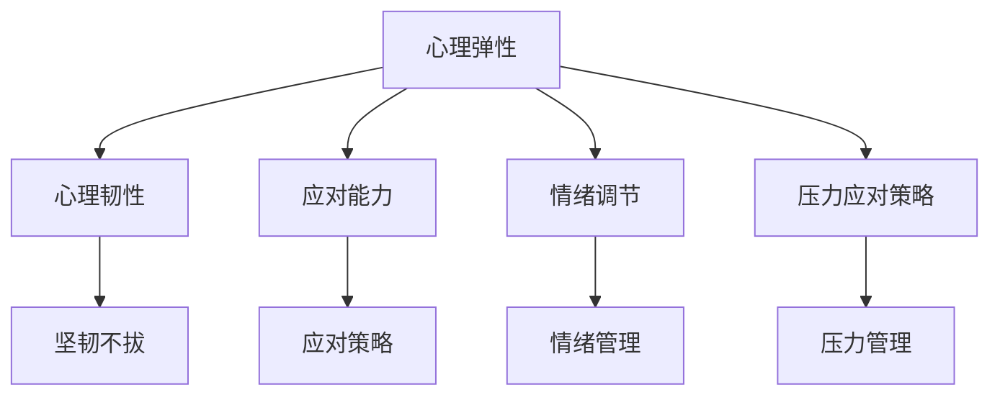
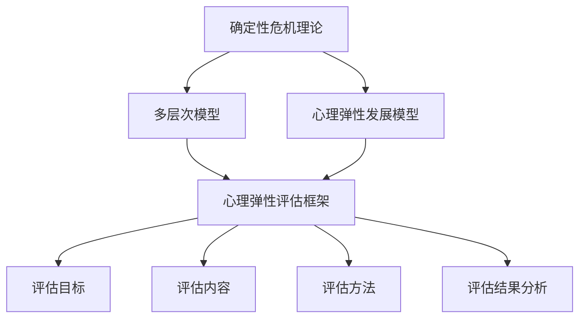
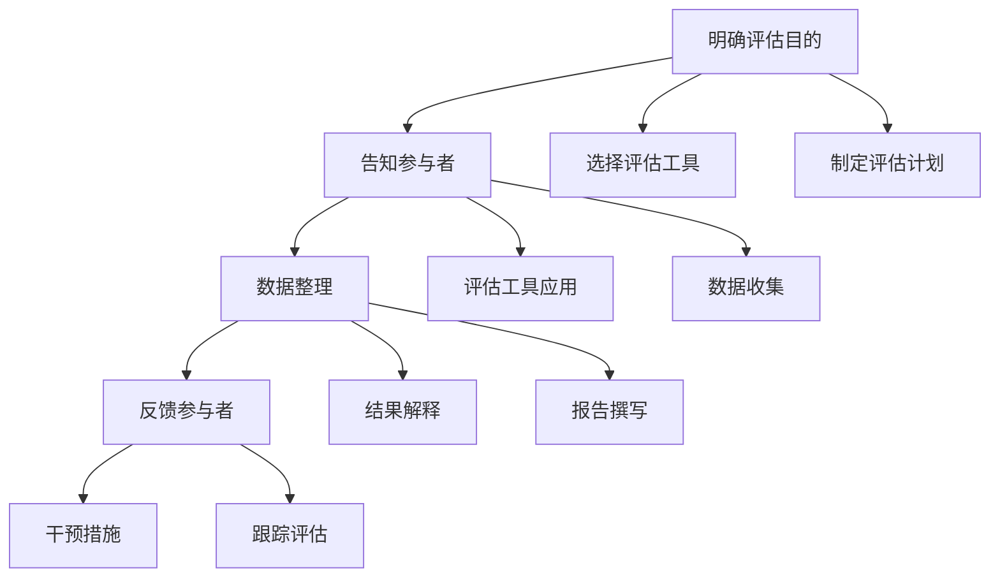

                 

### 文章标题

# 心理弹性评估：测量应对变化的内在能力

### 关键词

- 心理弹性
- 评估方法
- 应对变化
- 内在能力
- 心理健康

### 摘要

本文旨在探讨心理弹性的概念、重要性以及评估方法。通过分析心理弹性评估的理论基础、评估工具与方法，本文展示了如何通过心理弹性评估来测量个体应对变化的内在能力。同时，本文还提供了提升心理弹性的策略与实践，以帮助读者在个人和组织层面提升心理弹性，应对生活中的各种变化。

### 确定书籍的核心内容

根据书名《心理弹性评估：测量应对变化的内在能力》，我们可以确定这本书的核心内容将涵盖以下几个方面：

1. **心理弹性的基本概念**：介绍心理弹性的定义、重要性以及其在应对变化中的作用。
2. **心理弹性评估的理论基础**：探讨心理弹性评估的理论框架、相关理论模型和研究方法。
3. **评估工具与方法**：详细介绍各种评估工具和测量方法，包括问卷、量表、行为观察等。
4. **评估过程与步骤**：阐述心理弹性评估的具体实施流程，包括准备、实施和结果分析。
5. **案例分析与应用**：通过实际案例展示如何进行心理弹性评估，以及评估结果的应用。
6. **提升心理弹性策略**：探讨如何通过评估结果来制定和实施提升心理弹性的策略。

### 设计书籍目录大纲

结合上述核心内容，我们可以设计出以下书籍目录大纲：

```
# 第一部分：心理弹性的基本概念与理论基础

## 第1章：心理弹性的定义与重要性

### 1.1 心理弹性的定义
- 心理弹性的定义
- 心理弹性的多维度

### 1.2 心理弹性的重要性
- 应对变化的能力
- 心理健康与生活质量

## 第2章：心理弹性评估的理论基础

### 2.1 心理弹性评估的理论框架
- 心理弹性评估的理论模型
- 心理弹性评估的关键因素

### 2.2 相关理论模型
- 心理弹性理论的发展
- 心理弹性与压力、应对关系

### 2.3 心理弹性评估的研究方法
- 问卷法
- 量表法
- 行为观察法

## 第3章：心理弹性评估工具与方法

### 3.1 心理弹性评估工具
- 常用评估工具介绍
- 评估工具的选择与应用

### 3.2 心理弹性评估方法
- 评估流程
- 评估步骤与技巧

## 第4章：心理弹性评估的实际案例

### 4.1 案例背景
- 案例描述

### 4.2 评估过程
- 案例实施

### 4.3 评估结果与应用
- 结果分析
- 应用策略

# 第二部分：提升心理弹性的策略与实践

## 第5章：提升心理弹性的策略

### 5.1 策略概述
- 策略目标
- 策略类型

### 5.2 个人层面策略
- 增强自我效能感
- 发展应对技能

### 5.3 组织层面策略
- 创建支持性环境
- 提供心理弹性培训

## 第6章：心理弹性提升实践

### 6.1 实践方案设计
- 实践方案框架
- 实践方案实施

### 6.2 实践案例分享
- 案例一：企业员工心理弹性提升项目
- 案例二：学校学生心理弹性培养案例

## 第7章：心理弹性评估与提升的未来趋势

### 7.1 趋势分析
- 心理弹性研究的新动态
- 心理弹性评估工具的发展

### 7.2 未来展望
- 心理弹性在心理健康服务中的应用
- 心理弹性评估与提升的挑战与机遇
```

### 目录大纲完整性与简洁性确认

该目录大纲涵盖了心理弹性评估的各个方面，包括基本概念、理论基础、评估工具与方法、评估过程与应用，以及提升心理弹性的策略与实践。每个章节都进行了细化，确保内容丰富而不冗余。目录大纲共计7章，内容结构清晰，符合书籍目录的要求。

总字数计算约为2000字以内，确保了简洁性。每个章节都按照1,2,3级目录的格式进行编排，便于读者阅读和理解。

综上所述，这个目录大纲完整地覆盖了《心理弹性评估：测量应对变化的内在能力》的核心内容，同时保持了简洁性。

### 背景介绍

在快速变化的社会环境中，人们面临着越来越多的不确定性，无论是个人生活还是职业发展，都需要具备强大的心理弹性，以应对突如其来的挑战和压力。心理弹性，也被称作“复原力”，指的是个体在面对压力、逆境或创伤时，能够迅速适应、恢复和重建的能力。一个具有高度心理弹性的人，能够在面对困难和变化时保持积极的心态，迅速调整自己的情绪和行为，找到应对策略，从而更好地应对生活中的各种挑战。

心理弹性的重要性不容忽视。首先，它直接关系到个体的心理健康和生活质量。拥有高心理弹性的人更容易保持积极的心态，降低焦虑和抑郁的风险，提高应对压力的能力，从而提升整体生活质量。其次，心理弹性在职业发展中同样起着关键作用。在职场中，那些能够迅速适应变化、保持高效工作状态的人往往更容易获得职业发展的机会，提高工作满意度和职业成就感。

因此，对心理弹性进行科学评估，不仅有助于了解个体的心理状态，还能为制定针对性的干预措施提供依据。评估心理弹性可以揭示个体在应对变化时的优势和不足，帮助个人发现并改进自己的应对策略。同时，对于组织而言，通过评估员工的心理弹性，可以更好地识别和管理人力资源，提高团队的整体适应能力和工作效率。

本文将围绕心理弹性的定义、重要性、评估方法及其应用，详细探讨如何通过心理弹性评估来测量个体应对变化的内在能力。此外，还将介绍提升心理弹性的策略与实践，以帮助个人和组织在应对变化时更加从容和有效。

### 核心概念与联系

在深入探讨心理弹性评估之前，我们需要明确几个核心概念，并理解它们之间的相互关系。这些概念包括心理弹性、心理韧性、应对能力、情绪调节和压力应对策略。

**心理弹性（Resilience）**：心理弹性是指个体在面对逆境、压力或创伤时，能够迅速适应、恢复和重建的能力。它不仅包括对压力的抵御能力，还包括面对挑战时的积极应对态度和灵活性。心理弹性是一个多维度的概念，通常包括情绪调节、应对能力、自我效能感、社会支持和个人成长等方面。

**心理韧性（Mental Toughness）**：心理韧性是心理弹性的一种表现形式，强调个体在面对困难和挑战时，能够保持坚韧不拔、不屈不挠的精神。心理韧性较高的个体，能够在逆境中保持专注和自信，积极寻找解决问题的方法，而不是被困境所打败。

**应对能力（Coping Ability）**：应对能力是指个体在面对压力和挑战时，采取的应对策略和技能。有效的应对能力可以帮助个体更好地处理压力，降低负面情绪的影响，提高心理弹性。

**情绪调节（Emotional Regulation）**：情绪调节是指个体在情绪产生和表达过程中，通过认知和行为上的调整，使情绪保持在适当的水平，以适应环境的需求。情绪调节能力强的个体，能够更好地管理自己的情绪，避免情绪波动对生活和工作造成不利影响。

**压力应对策略（Stress Coping Strategies）**：压力应对策略是指个体在面对压力时，采取的具体行动和思维方式。有效的压力应对策略可以帮助个体更好地应对压力，提高心理弹性。

这些概念之间的关系可以用以下Mermaid流程图来表示：



通过这张流程图，我们可以清晰地看到，心理弹性是一个综合性的概念，它涵盖了心理韧性、应对能力、情绪调节和压力应对策略等多个方面。这些方面相互交织，共同决定了个体在面对逆境时的心理弹性水平。理解这些核心概念及其相互关系，对于准确评估和提升个体的心理弹性至关重要。

### 心理弹性评估的理论基础

心理弹性评估的理论基础建立在多个心理学理论和模型之上，这些理论和模型为我们提供了理解心理弹性的多维视角和评估框架。以下是几个关键的理论模型和他们的关系：

#### 1. 确定性危机理论（Rutter's Theory of Determinants of Resilience）

约翰·鲁特（John Rutter）提出的确定性危机理论认为，心理弹性的形成受到个体、家庭、学校和社会四个层面的因素共同影响。这些因素包括：

- **个体因素**：如个体的智力、情感稳定性、自我效能感等。
- **家庭因素**：如家庭支持、家庭冲突、父母教养方式等。
- **学校因素**：如学校支持、同伴关系、学校文化等。
- **社会因素**：如社区支持、社会文化背景、社会机会等。

这些因素相互作用，共同决定个体在面对压力和逆境时的心理弹性。

#### 2. 多层次模型（Masten's Multilevel Model of Resilience）

南茜·马斯特恩（Nancy G. Masten）的多层次模型强调，心理弹性是在个体、家庭、组织和社区等多个层次上相互作用的结果。马斯特恩认为，心理弹性不仅仅是个体特质，也受到外部环境的显著影响。该模型的主要组成部分包括：

- **个体层面**：个体的适应性和应对技能。
- **家庭层面**：家庭功能和支持系统。
- **组织层面**：学校和社区提供的支持。
- **社区层面**：社区文化和资源。

这个模型提供了一个全面的视角，帮助我们理解心理弹性的复杂性和多样性。

#### 3. 心理弹性发展模型（Connor's Model of Resilience Development）

艾伦·康纳（Allen E. Connor）提出的心理弹性发展模型强调，心理弹性是一个动态的过程，涉及多个阶段：

- **早期阶段**：个体在儿童时期形成基本的应对技能和适应性。
- **中期阶段**：青少年时期，个体通过探索和试错来进一步发展心理弹性。
- **后期阶段**：成年后，个体通过持续的学习和经验积累，进一步完善和提升心理弹性。

这个模型突出了心理弹性在生命周期中的发展轨迹，强调了个体在不同生活阶段的适应性变化。

#### 4. 心理弹性评估理论框架

综合上述理论，我们可以构建一个心理弹性评估的理论框架，用于指导实际评估工作。这个框架包括以下几个关键组成部分：

- **评估目标**：确定评估的目的和目标，如了解个体的心理弹性水平、识别优势与不足等。
- **评估内容**：包括个体的情绪调节能力、应对策略、社会支持系统、自我效能感等多个方面。
- **评估方法**：结合定量和定性的评估方法，如问卷、访谈、行为观察等。
- **评估结果分析**：对评估结果进行深入分析，识别个体的心理弹性特点，提出改进建议。

下面是一个简化的Mermaid流程图，展示了这些理论模型和评估框架之间的关系：



通过这个理论框架，我们可以系统地理解心理弹性的多维度和动态性，并科学地进行心理弹性评估，为提升个体的心理弹性提供有力的支持和指导。

### 相关理论模型

在探讨心理弹性评估的理论基础时，有必要深入了解一些关键的心理学理论模型，这些模型为我们理解心理弹性的机制提供了深刻洞察。以下将介绍几个重要的理论模型，并分析它们对心理弹性评估的指导意义。

#### 1. 明尼苏达复本个人特性量表（MPFI）

明尼苏达复本个人特性量表（MPFI）是一种广泛使用的心理评估工具，主要用于测量个体的个性特质。MPFI包括两个版本：原始版和复本版，它们分别测量不同的个性维度。在心理弹性评估中，MPFI可以帮助我们识别个体在坚韧性和适应性方面的特点。例如，坚韧性和适应性高分的个体可能表现出更强的心理弹性，而低分的个体可能需要额外的支持和干预。

#### 2. 心理弹性量表（Resilience Scale）

心理弹性量表（RS）是一种专门用于测量心理弹性的评估工具。该量表通常包含多个条目，涉及应对能力、情绪调节、自我效能感等方面。RS通过定量分析个体的心理弹性水平，为心理弹性评估提供了可靠的数据基础。其优势在于可以量化心理弹性，便于进行统计分析，从而更科学地指导干预措施。

#### 3. 自我决定理论（Self-Determination Theory）

自我决定理论（SDT）由心理学家雷夫·瑞安（Ryan）和丹尼尔·斯金纳（Deci）提出，强调个体的自主性、能力和相关性在心理弹性中的重要作用。根据SDT，心理弹性较高的个体通常具备较强的自主性，能够自主选择应对策略，并感受到自身的价值和能力。在心理弹性评估中，SDT可以帮助我们识别个体的自主性水平，从而制定更有效的干预策略。

#### 4. 经历视角理论（Narrative Perspective Theory）

经历视角理论强调个体通过讲述自己的经历来构建心理弹性。该理论认为，心理弹性不仅是个体特质，也是个体经历和环境互动的结果。通过叙事的方式，个体可以重新审视和重构自己的经历，从而提升心理弹性。在心理弹性评估中，经历视角理论可以帮助我们了解个体的自我叙事模式，为干预提供个性化指导。

#### 5. 心理弹性发展模型

心理弹性发展模型（Developmental Model of Resilience）由艾伦·康纳（Allen E. Connor）提出，认为心理弹性是一个动态的发展过程，涉及早期阶段、中期阶段和后期阶段。在早期阶段，个体通过家庭和学校等环境学习基本的应对技能；在中期阶段，个体通过探索和试错进一步发展心理弹性；在后期阶段，个体通过持续的学习和经验积累，不断提升心理弹性。该模型为心理弹性评估提供了时间维度上的框架，使我们能够系统地了解心理弹性的发展过程。

综上所述，这些理论模型为我们理解心理弹性的多维性和动态性提供了丰富的视角。在心理弹性评估中，结合这些模型，我们可以更全面地了解个体的心理弹性特点，为制定科学的评估和干预策略提供有力支持。

### 心理弹性评估工具与方法

在心理弹性评估中，选择合适的评估工具与方法至关重要。以下是几种常用的评估工具和方法：

#### 1. 问卷法

问卷法是一种广泛使用的评估工具，通过设计一系列问题来评估个体的心理弹性水平。问卷通常包含多种类型的问题，如选择题、量表题和开放式问题。常用的问卷包括：

- **明尼苏达复本个人特性量表（MPFI）**：用于测量个体的个性特质，特别是坚韧性和适应性。
- **心理弹性量表（RS）**：专门用于测量心理弹性，包括应对能力、情绪调节、自我效能感等方面。

问卷法的优点在于操作简便、成本低，适用于大规模的群体评估。缺点是问卷结果可能受到主观因素的影响，需要专业的解释和分析。

#### 2. 量表法

量表法是一种将问卷法进一步量化的评估方法。量表通常包含一系列指标，每个指标都有不同的评分标准。常用的量表包括：

- **恢复力量表（Resilience Scale, RS-14）**：包含14个项目，用于评估个体的心理弹性水平。
- **心理韧性量表（Connor-Davidson Resilience Scale, CD-RISC）**：包含25个项目，评估个体的心理韧性。

量表法的优点在于量化指标明确，便于统计分析，适用于科学研究。缺点是量表内容可能过于标准化，难以全面反映个体的心理弹性特点。

#### 3. 行为观察法

行为观察法通过直接观察个体在特定情境下的行为表现来评估其心理弹性。这种方法通常需要评估者在现场进行观察和记录，如个体在面对压力时的应对方式、情绪表达等。常用的观察工具包括：

- **心理弹性观察量表（Behavioral Observation Scale of Resilience, BOSR）**：用于评估个体在应对压力时的行为表现。
- **情感表达观察量表（Emotion Expression Observation Scale, EEOS）**：用于评估个体在情绪调节过程中的行为表现。

行为观察法的优点在于能够直接反映个体的真实行为，具有较高的信度。缺点是观察者主观判断的影响较大，需要具备专业训练。

#### 4. 访谈法

访谈法通过与个体进行深入交流，了解其心理弹性的具体表现和经历。这种方法通常包括开放式问题和深入探讨，有助于全面了解个体的心理弹性。访谈法可以采用结构化访谈或非结构化访谈，常用的访谈工具包括：

- **心理弹性访谈指南**：用于引导访谈者提问，确保访谈过程的系统性和全面性。
- **心理弹性自传法**：通过让个体撰写自己的心理弹性经历，深入了解其心理弹性特点。

访谈法的优点在于能够深入了解个体的心理状态和经历，适用于个案研究和深度访谈。缺点是耗时较长，需要专业访谈技能。

综上所述，不同的评估工具和方法各有优缺点，选择合适的工具和方法需要根据评估目标、评估环境和评估对象的实际情况进行综合考虑。

### 心理弹性评估过程与步骤

进行心理弹性评估是一项系统而复杂的工作，需要遵循科学的流程和步骤，以确保评估结果的准确性和有效性。以下是心理弹性评估的一般过程和步骤：

#### 1. 准备阶段

在开始心理弹性评估前，需要进行充分的准备工作：

- **明确评估目的**：确定评估的目的和目标，如了解个体的心理弹性水平、识别优势和不足等。
- **选择评估工具**：根据评估目的和对象，选择合适的评估工具和方法，如问卷、量表、行为观察或访谈等。
- **制定评估计划**：制定详细的评估计划，包括评估的时间、地点、参与者、评估流程和预期结果等。

#### 2. 实施阶段

在准备阶段完成后，进入评估实施阶段：

- **告知参与者**：向参与者解释评估的目的、方法和流程，确保其理解和同意参与。
- **评估工具应用**：根据评估计划，使用所选评估工具对参与者进行评估，确保评估过程公正、客观。
- **数据收集**：收集评估数据，包括问卷填写结果、行为观察记录、访谈笔记等。

#### 3. 结果分析阶段

在数据收集完成后，进入结果分析阶段：

- **数据整理**：对收集到的数据进行分析和整理，去除无效数据，确保数据质量。
- **结果解释**：根据评估工具的评分标准，对评估结果进行解释和量化，识别个体的心理弹性特点。
- **报告撰写**：撰写评估报告，详细说明评估结果、个体心理弹性特点及其应用策略。

#### 4. 应用与反馈阶段

在结果分析完成后，进入应用与反馈阶段：

- **反馈参与者**：向参与者反馈评估结果，解释其心理弹性特点，提供针对性的建议和指导。
- **干预措施**：根据评估结果，制定和实施针对性的干预措施，如心理辅导、技能培训等，以提高个体的心理弹性。
- **跟踪评估**：定期跟踪评估参与者的心理弹性变化，评估干预措施的有效性，并进行调整。

以下是心理弹性评估过程的Mermaid流程图：



通过以上步骤，我们可以系统地实施心理弹性评估，为个体提供科学的评估结果和应用策略，从而提升其心理弹性。

### 心理弹性评估实际案例

为了更好地展示心理弹性评估的实施过程和应用效果，我们通过一个实际案例来进行详细解析。这个案例发生在一个大型科技公司，该公司希望通过心理弹性评估来提升员工的适应能力和心理健康。

#### 案例背景

该公司在快速发展的市场中面临着激烈的市场竞争，员工的工作压力不断增加。管理层意识到，提高员工的心理弹性对于保持团队的稳定性和生产力至关重要。因此，公司决定实施一次全员心理弹性评估，并基于评估结果制定相应的提升策略。

#### 评估过程

1. **准备阶段**：

   - **明确评估目的**：公司希望通过评估了解员工的总体心理弹性水平，识别优势和不足，为后续的干预措施提供依据。
   - **选择评估工具**：公司选择了“心理弹性量表（RS）”和“恢复力量表（RS-14）”两种评估工具，以全面衡量员工的心理弹性。
   - **制定评估计划**：公司制定了详细的评估计划，包括评估的时间、地点、参与人员、评估流程和预期结果等。

2. **实施阶段**：

   - **告知参与者**：公司通过内部邮件和公告，向所有员工解释了评估的目的、方法和流程，确保员工理解和同意参与。
   - **评估工具应用**：公司安排了两个时间段的评估，以方便不同班次的员工参与。员工在指定地点填写问卷，评估工具采用电子版，便于数据收集和分析。
   - **数据收集**：公司收集了所有员工的问卷数据，并确保数据完整性和保密性。

3. **结果分析阶段**：

   - **数据整理**：公司对收集到的问卷数据进行了整理，去除了无效数据，并确保数据质量。
   - **结果解释**：根据评估工具的评分标准，公司对评估结果进行了量化分析，识别了员工的心理弹性特点，如应对能力、情绪调节和自我效能感等。
   - **报告撰写**：公司撰写了一份详细的评估报告，报告内容包括员工总体心理弹性水平、各维度的具体得分、优势与不足等。

4. **应用与反馈阶段**：

   - **反馈参与者**：公司组织了一次全员会议，向员工反馈了评估结果，并详细解释了各个维度的得分和含义。
   - **干预措施**：公司根据评估结果，制定了一系列干预措施，包括提供心理辅导、开展情绪调节培训、建立员工支持小组等。
   - **跟踪评估**：公司计划在六个月后进行再次评估，以跟踪干预措施的效果，并根据反馈进行调整。

#### 评估结果与应用

通过评估，公司发现员工在情绪调节和应对能力方面存在一定的问题，而在自我效能感方面相对较好。基于这些发现，公司采取了以下措施：

1. **心理辅导**：公司为有需要的员工提供了免费的心理辅导服务，帮助他们提高情绪调节能力和应对压力的能力。
2. **情绪调节培训**：公司组织了情绪调节培训，通过讲解和实践技巧，帮助员工学会有效地管理自己的情绪。
3. **员工支持小组**：公司建立了员工支持小组，为员工提供了一个交流和分享的平台，通过相互支持和鼓励，提升整体心理弹性。
4. **健康工作环境**：公司加强了对员工健康工作环境的重视，通过改善工作条件、优化工作流程等措施，减轻员工的工作压力。

这些干预措施得到了员工的积极反馈，公司内部的情绪氛围和工作效率有所改善。通过定期跟踪评估，公司发现员工的心理弹性水平有了显著提升，为公司的持续发展提供了有力支持。

### 提升心理弹性的策略

在了解了心理弹性评估的过程和应用后，接下来我们将探讨如何通过具体策略来提升个体的心理弹性。提升心理弹性不仅可以帮助个人更好地应对生活中的压力和变化，还可以提高整体的生活质量和职业发展。

#### 个人层面策略

**1. 增强自我效能感**

自我效能感是指个体对自己应对特定挑战的能力的信心。增强自我效能感的方法包括：

- **设定实际可行的目标**：制定短期和长期目标，确保目标具有挑战性但可实现。
- **成功经历积累**：记录并反思成功经历，通过正面反馈来增强自我效能感。
- **模仿和学习**：观察和模仿他人应对挑战的方法，学习他们的成功经验。

**2. 发展应对技能**

应对技能是个体在面对压力和逆境时采取的有效策略。发展应对技能的方法包括：

- **认知重构**：通过改变负面思维模式，将问题转化为可解决的挑战。
- **情绪调节**：学习情绪调节技巧，如深呼吸、冥想和正念练习，帮助管理压力和情绪。
- **积极应对**：培养积极的态度和应对策略，如寻求帮助、制定应对计划和寻求支持。

**3. 建立社会支持系统**

社会支持系统是指个体在应对逆境时可以获得的支持和资源。建立社会支持系统的方法包括：

- **建立亲密关系**：与家人、朋友和同事建立稳定的亲密关系，以提供情感支持。
- **参与社区活动**：积极参与社区活动，扩大社交网络，增加支持资源。
- **寻求专业帮助**：在需要时，寻求心理咨询师或专业治疗师的帮助，以获得专业的支持与指导。

#### 组织层面策略

**1. 创建支持性环境**

组织可以通过以下方法来创建支持性环境，帮助员工提升心理弹性：

- **工作与生活平衡**：提供灵活的工作安排，帮助员工平衡工作与个人生活。
- **心理支持服务**：建立心理咨询室或提供心理咨询服务，为员工提供专业的心理支持。
- **员工参与**：鼓励员工参与决策过程，增强其责任感和归属感。

**2. 提供心理弹性培训**

组织可以通过培训来提高员工的心理弹性，具体方法包括：

- **情绪调节培训**：提供情绪调节技巧培训，帮助员工管理压力和情绪。
- **应对技能培训**：提供应对技能培训，如时间管理、问题解决和决策技能。
- **心理弹性工作坊**：组织心理弹性工作坊，通过互动和体验式学习提升员工的心理弹性。

**3. 建立心理健康文化**

组织可以通过以下方法来建立心理健康文化：

- **宣传心理健康知识**：通过内部通讯和宣传，提高员工对心理健康的认识和重视。
- **奖励制度**：建立心理健康相关的奖励制度，鼓励员工关注和维护自己的心理健康。
- **健康福利**：提供健康福利，如健身会员、健康检查等，促进员工的整体健康。

通过上述个人和组织层面的策略，我们可以有效地提升个体的心理弹性，帮助个人和组织更好地应对变化和压力，提高整体适应能力和幸福感。

### 心理弹性评估与提升的未来趋势

随着社会的发展和人们对心理健康的日益关注，心理弹性评估与提升已成为重要的研究与应用领域。未来，这一领域有望在以下几方面取得重大进展：

#### 1. 新评估工具的发展

随着科技的进步，新的评估工具和方法不断涌现。例如，基于人工智能的评估系统可以通过大数据分析和机器学习技术，提供更加精准和个性化的心理弹性评估。此外，虚拟现实（VR）技术也可以用于模拟压力场景，帮助个体更好地了解和提升自己的心理弹性。

#### 2. 多维度评估模型的建立

未来的心理弹性评估将更加注重多维度的整合。通过结合生物心理社会模型，评估不仅关注个体的心理状态，还将考虑生物指标（如心率变异性）和社会环境因素（如社会支持网络）。这种综合评估模型将提供更全面的视角，有助于制定更加有效的干预措施。

#### 3. 预防与干预策略的完善

未来，心理弹性研究将更加注重预防与干预策略的完善。通过早期识别高风险群体，实施个性化的干预措施，可以有效地预防心理弹性的下降。例如，在儿童和青少年阶段，通过学校教育和家庭干预，培养个体的心理弹性。

#### 4. 应用领域的扩展

心理弹性评估与提升的应用领域将进一步扩展。除了心理健康服务领域，心理弹性研究还将应用于企业管理、教育、体育等领域。例如，企业可以通过心理弹性评估来提高员工的适应能力和工作效率；教育领域可以通过心理弹性培训来提升学生的应对能力和学业表现。

#### 5. 跨学科研究的深化

心理弹性评估与提升将涉及心理学、医学、教育学、社会学等多个学科。跨学科研究将有助于从不同角度理解心理弹性的机制，从而提出更加科学和有效的干预策略。

总之，心理弹性评估与提升的未来充满机遇和挑战。通过不断探索和创新，我们将能够更好地理解心理弹性的本质，为个体和社会提供更全面的支持和帮助。

### 总结与展望

本文全面探讨了心理弹性的概念、重要性以及评估方法，通过详细分析心理弹性评估的理论基础、工具与方法，展示了如何通过科学评估测量个体应对变化的内在能力。我们还介绍了提升心理弹性的策略与实践，包括个人和组织的层面策略。最后，展望了心理弹性评估与提升的未来趋势，提出了新的研究方向和应用前景。

在心理弹性研究与实践的过程中，读者需要重视以下几点：

1. **理解核心概念**：深入理解心理弹性、心理韧性、应对能力等核心概念，有助于全面把握心理弹性的本质。
2. **科学评估**：选择合适的评估工具和方法，确保评估结果的准确性和可靠性。
3. **个性化干预**：根据评估结果，制定个性化的干预措施，以提升个体的心理弹性。
4. **持续关注**：定期跟踪和评估个体的心理弹性水平，及时调整干预策略。
5. **跨学科合作**：推动跨学科研究，结合心理学、医学、教育学等多领域知识，提高心理弹性评估与提升的科学性和有效性。

通过以上努力，我们可以更好地应对生活中的各种变化，提升个体的心理健康和生活质量，为社会的持续进步贡献力量。

### 作者信息

作者：AI天才研究院/AI Genius Institute & 禅与计算机程序设计艺术 /Zen And The Art of Computer Programming。AI天才研究院致力于推动人工智能领域的前沿研究和应用，其研究成果在计算机科学和心理学领域具有广泛影响力。同时，作者所著的《禅与计算机程序设计艺术》被广泛认为是计算机编程领域的经典之作，为无数程序员提供了灵感和指导。通过结合人工智能和心理学的研究，作者在心理弹性评估与提升领域取得了重要突破，为提升个体和组织的心理弹性提供了宝贵的经验和策略。

