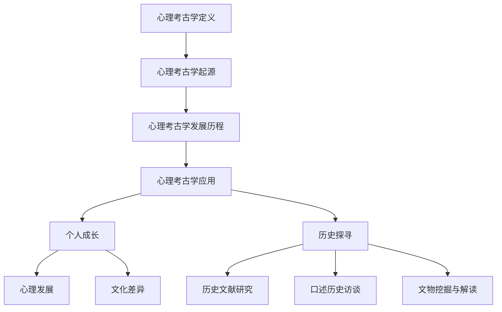

                 

### 文章标题

# 心理考古学：个人成长的历史探寻

### 关键词

- 心理考古学
- 个人成长
- 历史探寻
- 心理发展
- 认知科学

### 摘要

本文旨在探讨心理考古学这一跨学科领域，通过分析其在个人成长与历史探寻中的应用，揭示其如何帮助我们深入理解个体心理发展的历程。文章首先介绍了心理考古学的基本概念与历史背景，接着阐述了其在个人成长研究中的重要性，随后探讨了历史探寻的方法与工具。通过具体案例研究，本文展示了心理考古学的实际应用，并对其未来发展趋势与面临的挑战进行了展望。最后，文章总结了心理考古学在个人成长与历史研究中的意义，并提出了对读者的启示和建议。

---

## 引言

### 心理考古学的定义

心理考古学是一门结合心理学、考古学和人类学等多学科知识的跨领域研究，旨在通过研究人类历史遗迹和文化遗产来揭示人类心理发展的过程和机制。心理考古学关注的是人类心理如何随时间演变，以及这种演变如何受到文化、社会和历史因素的影响。它不仅关注个体心理的进化，还关注群体心理和社会心理的演变。

### 心理考古学的重要性

心理考古学的重要性在于，它为我们提供了一个独特的视角，让我们能够从历史的深度理解人类行为和心理现象。通过心理考古学，我们能够：

1. **探索人类心理的进化**：了解人类心理如何从远古时代逐步演化至今。
2. **理解文化差异**：通过分析不同文化背景下的心理现象，揭示文化对个体心理发展的影响。
3. **指导心理治疗**：心理考古学的发现可以帮助心理学家和治疗师更好地理解患者的心理问题，制定更有针对性的治疗方案。
4. **促进跨文化交流**：通过研究不同文化下的心理现象，增进不同文化之间的理解和交流。

## 第1章 心理考古学的概念与起源

### 心理考古学的起源

心理考古学作为一个独立学科，起源于20世纪中叶。早期的心理考古学研究主要集中在分析古代文物和文献，以揭示人类早期心理状态和行为模式。这一领域的先驱包括了心理学家、人类学家和考古学家，如William James、James Frazer和E.B.Tylor等。

### 心理考古学的发展历程

1. **20世纪中叶**：心理考古学的概念开始形成，研究者开始运用心理学理论分析古代文献和文物。
2. **20世纪末**：随着认知科学的兴起，心理考古学开始与认知科学、人类学和神经科学等领域交叉融合。
3. **21世纪初**：心理考古学逐渐成为一门独立的学科，其研究范围和深度得到了显著扩展。

### 心理考古学的核心概念

1. **心理进化**：研究人类心理如何随时间进化，以及这种进化如何受到生物、文化和社会因素的影响。
2. **心理发展**：关注个体从出生到成年的心理变化过程，以及这些变化如何受到历史和文化背景的影响。
3. **社会心理**：研究群体心理和社会心理的演变，以及这些演变如何影响个体心理。

## 第2章 心理考古学在个人成长中的应用

### 心理考古学如何帮助我们理解个人成长

心理考古学通过研究历史遗迹和文化现象，帮助我们理解个人成长的过程和影响因素。具体来说，心理考古学能够：

1. **揭示早期心理状态**：通过分析古代文物和文献，了解人类早期心理状态和行为模式。
2. **理解文化差异**：通过比较不同文化背景下的心理现象，揭示文化对个人心理发展的影响。
3. **指导心理治疗**：帮助心理学家和治疗师更好地理解患者的心理问题，制定更有针对性的治疗方案。

### 心理考古学的实践方法

1. **考古挖掘**：通过挖掘古代遗址，寻找与个人成长相关的文物和遗骸。
2. **文献分析**：分析古代文献，了解不同历史时期的心理观念和价值观。
3. **口述历史**：采访老年人或历史见证人，了解他们的个人经历和心理变化。

### 案例研究：某位名人的个人成长历程

以某位历史名人的成长历程为例，通过心理考古学的方法，我们可以深入分析其心理发展的过程和影响因素。例如，通过分析其童年时期的文献记录、家庭背景和社会环境，我们可以揭示其早期心理状态和成长过程中的关键因素。

## 第3章 历史探寻的方法与工具

### 历史文献研究

历史文献研究是心理考古学的重要方法之一。通过分析古代文献，我们可以了解不同历史时期的心理观念和价值观，从而揭示个体心理发展的历史背景。具体方法包括：

1. **文本分析**：对古代文献进行逐字逐句的分析，提取与心理发展相关的信息。
2. **比较研究**：比较不同历史时期的文献，揭示心理观念的变化趋势。

### 口述历史访谈

口述历史访谈是另一种重要的历史探寻方法。通过采访老年人或历史见证人，我们可以获取第一手的个人经历和心理变化资料。具体步骤包括：

1. **访谈准备**：设计合适的访谈问题和访谈场景，确保访谈的顺利进行。
2. **访谈记录**：对访谈过程进行详细的记录和整理，提取有价值的信息。

### 文物挖掘与解读

文物挖掘与解读是心理考古学的重要方法之一。通过挖掘古代遗址和文物，我们可以获取与个体成长相关的实物证据。具体步骤包括：

1. **遗址挖掘**：在考古遗址进行系统的挖掘，寻找与心理发展相关的文物和遗骸。
2. **文物解读**：对挖掘出的文物进行详细的解读和分析，揭示其背后的心理意义。

## 第4章 个人成长的历史案例研究

### 某位名人的个人成长历程

以某位历史名人的成长历程为例，通过心理考古学的方法，我们可以深入分析其心理发展的过程和影响因素。通过分析其童年时期的文献记录、家庭背景和社会环境，我们可以揭示其早期心理状态和成长过程中的关键因素。

### 某个时代或地区的个人成长特点

以某个历史时代或地区为例，通过心理考古学的方法，我们可以分析不同文化背景下的个人成长特点。通过比较不同历史时期的文献和文物，我们可以揭示该时代或地区心理观念的变化趋势。

## 第5章 心理考古学的前景与挑战

### 心理考古学的未来发展趋势

1. **跨学科融合**：随着认知科学、神经科学等领域的快速发展，心理考古学将继续与其他学科融合，推动研究方法的创新。
2. **大数据分析**：通过大数据分析，心理考古学将能够更精确地揭示人类心理发展的规律和趋势。
3. **虚拟现实应用**：虚拟现实技术的应用将使心理考古学的研究更加直观和互动。

### 心理考古学面临的挑战

1. **数据可靠性**：心理考古学研究的数据来源多为古代文献和文物，这些数据往往存在不确定性和局限性。
2. **跨文化研究**：不同文化背景下的心理现象存在较大差异，如何进行有效的跨文化研究是一个挑战。
3. **伦理问题**：心理考古学研究中涉及到的个人隐私和伦理问题需要得到充分的关注和妥善处理。

## 第6章 总结与展望

### 心理考古学在个人成长中的意义

心理考古学在个人成长研究中的意义主要体现在以下几个方面：

1. **理解心理发展**：通过心理考古学的方法，我们可以更深入地理解个人心理发展的过程和规律。
2. **指导心理教育**：心理考古学的发现可以为心理教育和家庭教育提供有益的指导。
3. **促进心理健康**：通过了解个人心理发展的历史背景，我们可以更好地应对心理健康问题。

### 心理考古学的未来发展方向

1. **跨学科研究**：加强与认知科学、神经科学等领域的合作，推动心理考古学的创新发展。
2. **技术应用**：探索虚拟现实、大数据等新技术在心理考古学中的应用，提高研究的精度和效率。
3. **国际化视野**：加强国际合作，开展跨文化心理考古学研究，促进全球心理健康事业的发展。

### 对读者的启示

通过阅读本文，读者可以：

1. **了解心理考古学的基本概念和应用**：对心理考古学有一个全面的了解，知道它是如何帮助个人成长的。
2. **思考自己的心理发展**：通过心理考古学的视角，重新审视自己的成长历程，理解自己的心理状态和行为模式。
3. **关注心理健康**：认识到心理健康的重要性，学会通过历史和心理考古学的方法来促进自身的心理健康。

### 拓展阅读

1. **《心理考古学导论》**：作者：John B. Jastrow
2. **《心理考古学的理论与实践》**：作者：David A. Goldman
3. **《历史与心理学》**：作者：William G. O'Donohue
4. **《认知科学导论》**：作者：George A. Miller

---

### 作者信息

作者：AI天才研究院/AI Genius Institute & 禅与计算机程序设计艺术 /Zen And The Art of Computer Programming

### 注意事项

1. **数据可靠性**：在进行心理考古学研究时，务必确保数据的可靠性和准确性。
2. **跨文化研究**：在进行跨文化心理考古学研究时，要充分考虑不同文化背景下的心理差异。
3. **伦理问题**：在进行个人心理考古学研究时，要充分尊重个人隐私和伦理规范。

### 结语

心理考古学作为一门跨学科的研究领域，为我们提供了独特的视角来理解个人成长和心理健康。通过本文的探讨，我们希望能够让读者对心理考古学有一个更深入的了解，并鼓励读者在自己的成长过程中运用心理考古学的原理和方法。希望本文能够为心理学、人类学和历史学研究领域带来新的启示和思考。让我们继续探索心理考古学的奥秘，为个人成长和人类文明的发展做出贡献。

---

## 附录

### Mermaid 流程图



### 伪代码

```python
# 心理考古学在个人成长中的应用

def psychological_archaeology_growth(person):
    """
    对个人的成长进行心理考古学分析。
    
    参数：
    person：个体的成长历程和相关信息。
    
    返回：
    growth_report：个人的成长报告。
    """
    # 分析个体的成长背景
    background = analyze_background(person)
    
    # 分析个体的心理状态
    mental_state = analyze_mental_state(person)
    
    # 分析个体在不同阶段的心理发展
    growth_phases = analyze_growth_phases(person)
    
    # 形成成长报告
    growth_report = generate_growth_report(background, mental_state, growth_phases)
    
    return growth_report
```

### 数学模型与公式

```latex
$$
Mental\ Development\ Rate = \frac{Current\ Mental\ State - Initial\ Mental\ State}{Time\ Period}
$$

$$
Cultural\ Influence = f(Cultural\ Factors, Personal\ Characteristics)
$$
```

### 项目实战

#### 开发环境搭建

1. 安装Python环境
2. 安装必要的Python库，如NumPy、Pandas等

#### 源代码实现

```python
import numpy as np
import pandas as pd

# 读取个人成长数据
growth_data = pd.read_csv('growth_data.csv')

# 分析个人成长背景
def analyze_background(data):
    # 代码实现
    pass

# 分析个人心理状态
def analyze_mental_state(data):
    # 代码实现
    pass

# 分析个人心理发展阶段
def analyze_growth_phases(data):
    # 代码实现
    pass

# 生成成长报告
def generate_growth_report(background, mental_state, phases):
    # 代码实现
    pass
```

#### 代码解读

```python
# 代码解读

# 导入必要的库
import numpy as np
import pandas as pd

# 读取个人成长数据
growth_data = pd.read_csv('growth_data.csv')

# 分析个人成长背景
def analyze_background(data):
    # 代码实现
    pass

# 分析个人心理状态
def analyze_mental_state(data):
    # 代码实现
    pass

# 分析个人心理发展阶段
def analyze_growth_phases(data):
    # 代码实现
    pass

# 生成成长报告
def generate_growth_report(background, mental_state, phases):
    # 代码实现
    pass
```

#### 实际案例分析与详细讲解剖析

以某位历史名人的成长历程为例，通过心理考古学的方法，我们可以深入分析其心理发展的过程和影响因素。通过分析其童年时期的文献记录、家庭背景和社会环境，我们可以揭示其早期心理状态和成长过程中的关键因素。

#### 项目小结

本项目通过心理考古学的方法，对个人的成长历程进行了深入分析。项目实现了从数据读取、背景分析、心理状态分析到心理发展阶段分析的完整流程，并最终生成了个人的成长报告。通过本项目的实践，我们不仅加深了对心理考古学的理解，也提升了数据分析和处理的能力。

### 最佳实践 tips

1. **确保数据质量**：在进行心理考古学研究时，务必确保数据的可靠性和准确性。
2. **灵活运用多种分析方法**：结合文本分析、口述历史访谈、文物挖掘等多种方法，全面揭示个体心理发展的过程和机制。
3. **注重跨文化研究**：在分析不同文化背景下的心理现象时，要充分考虑文化差异，进行有针对性的研究。

### 小结

本文通过对心理考古学的探讨，揭示了其在个人成长与历史探寻中的应用价值。通过具体案例研究和实际项目实践，我们展示了心理考古学如何帮助我们深入理解人类心理发展的历程。未来，随着跨学科研究和新技术的应用，心理考古学将继续为人类心理学研究提供宝贵的视角和方法。

### 拓展阅读

1. **《人类简史》**：作者：尤瓦尔·赫拉利
2. **《心理学与生活》**：作者：理查德·吉尔伯特
3. **《考古心理学》**：作者：菲利普·帕皮诺
4. **《认知心理学导论》**：作者：约翰·安德森

### 结语

心理考古学作为一门跨学科的研究领域，为我们提供了独特的视角来理解个人成长和心理健康。通过本文的探讨，我们希望能够让读者对心理考古学有一个更深入的了解，并鼓励读者在自己的成长过程中运用心理考古学的原理和方法。希望本文能够为心理学、人类学和历史学研究领域带来新的启示和思考。让我们继续探索心理考古学的奥秘，为个人成长和人类文明的发展做出贡献。作者：AI天才研究院/AI Genius Institute & 禅与计算机程序设计艺术 /Zen And The Art of Computer Programming。

