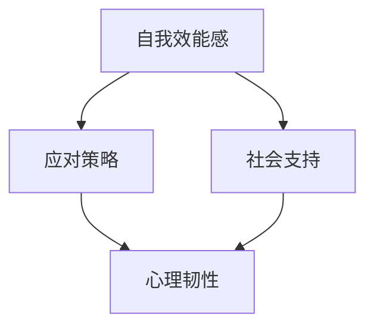

                 

### 文章标题

# 心理韧性培养工程：提升社会整体抗压能力

---

### 关键词

- 心理韧性
- 社会抗压能力
- 教育干预
- 心理咨询
- 健康生活方式
- 社会政策

---

### 摘要

随着现代社会竞争日益激烈，心理韧性成为个体应对生活挑战的关键能力。本文从心理韧性的理论基础出发，详细探讨了心理韧性的核心要素、评估与测量方法，以及培养心理韧性的多种途径。此外，本文还分析了心理韧性培养在教育、职场以及社会政策中的具体应用，并提出了提升社会整体抗压能力的策略。通过跨学科合作与未来展望，本文旨在为社会各界提供一套全面、系统的心理韧性培养工程，以应对复杂多变的社会环境。

---

## 第一部分：心理韧性理论基础

### 第1章：心理韧性的定义与重要性

#### 1.1 心理韧性的概念

心理韧性（Resilience）是指个体在面对压力、挑战和逆境时，能够迅速恢复、适应并有效应对的能力。这种能力并非天生的，而是可以通过后天的训练和培养来提升。

$$
\text{心理韧性} = f(\text{自我效能感}, \text{应对策略}, \text{社会支持})
$$

其中，自我效能感、应对策略和社会支持是心理韧性的三大核心要素。

#### 1.2 心理韧性的重要性

心理韧性对个体的心理健康和生活质量有着深远的影响。首先，心理韧性有助于个体更好地应对压力和挑战，减少焦虑和抑郁等心理问题的发生。其次，心理韧性能够提升个体的适应能力和创新能力，从而在竞争激烈的社会环境中脱颖而出。最后，心理韧性还具有传染性，能够在人际关系中促进积极氛围，提高团队的凝聚力和协作效率。

### Mermaid 流程图：心理韧性的核心要素关系架构

### 第2章：心理韧性的核心要素

#### 2.1 自我效能感

自我效能感是指个体对自己在特定情境下成功完成任务的信心。它是个体心理韧性的基础，直接影响个体的行为选择和应对效果。

- **定义**（$定义：自我效能感是指个体对自己在特定情境下成功完成任务的信心。$）
- **影响因素**（$影响因素：经验、观察学习、情感状态、生理状态、外部反馈等。$）
- **提升方法**（$提升方法：积极的自我暗示、成功经验的积累、榜样的力量、适当的挑战等。$）

#### 2.2 应对策略

应对策略是指个体在面对压力和挑战时采取的应对方式。有效的应对策略能够帮助个体更好地应对逆境，提升心理韧性。

- **问题聚焦应对**（$定义：问题聚焦应对是指个体将注意力集中在解决具体问题上，采取实际有效的措施来解决问题。$）
- **情感应对**（$定义：情感应对是指个体通过调整自己的情绪状态来应对压力，如放松、冥想、倾诉等。$）

#### 2.3 社会支持

社会支持是指个体在心理困境时从他人或社会得到的支持和帮助。社会支持对心理韧性有着重要的影响。

- **社会支持的定义**（$定义：社会支持是指个体在心理困境时从他人或社会得到的支持和帮助。$）
- **社会支持的类型**（$类型：情感支持、信息支持、实际支持等。$）
- **社会支持的作用**（$作用：减轻压力、提升应对能力、增强心理韧性等。$）

### 第3章：心理韧性评估与测量

#### 3.1 心理韧性评估工具

心理韧性评估工具是用于测量个体心理韧性水平的工具。常见的心理韧性评估工具包括心理韧性量表、心理韧性问卷等。

- **心理韧性量表**（$定义：心理韧性量表是一种标准化评估工具，用于测量个体在心理韧性各方面的表现。$）
- **评估方法**（$方法：自评与他评相结合，定量与定性相结合。$）

#### 3.2 心理韧性测量指标

心理韧性测量指标是用于评估个体心理韧性水平的具体指标。常见的心理韧性测量指标包括自我效能感、应对策略、社会支持等。

- **自我效能感**（$定义：自我效能感是指个体对自己在特定情境下成功完成任务的信心。$）
- **应对策略**（$定义：应对策略是指个体在面对压力和挑战时采取的应对方式。$）
- **社会支持**（$定义：社会支持是指个体在心理困境时从他人或社会得到的支持和帮助。$）

### 第4章：心理韧性培养方法

#### 4.1 心理教育干预

心理教育干预是通过教育手段来提升个体的心理韧性。常见的心理教育干预方法包括个体心理教育、团体心理教育等。

- **个体心理教育**（$定义：个体心理教育是指针对个体心理特点，进行个性化的心理教育和辅导。$）
- **团体心理教育**（$定义：团体心理教育是指通过团体活动，提升个体和团体的心理韧性。$）

#### 4.2 心理咨询与治疗

心理咨询与治疗是通过心理治疗手段来提升个体的心理韧性。常见的方法包括认知行为疗法、心理动力学治疗等。

- **认知行为疗法**（$定义：认知行为疗法是一种基于认知和行为原则的心理治疗方法，旨在通过改变个体的认知和行为来提升心理韧性。$）
- **心理动力学治疗**（$定义：心理动力学治疗是一种基于心理学动力学理论的心理治疗方法，旨在通过解决潜意识冲突来提升心理韧性。$）

#### 4.3 体育锻炼与健康促进

体育锻炼与健康促进是通过体育锻炼和健康生活方式来提升个体的心理韧性。体育锻炼不仅能够改善身体健康，还能增强心理韧性。

- **体育锻炼与心理韧性**（$定义：体育锻炼与心理韧性是指通过体育锻炼来提升个体的心理韧性。$）
- **健康生活方式**（$定义：健康生活方式是指通过健康饮食、规律作息、适当休息等方式来提升个体的心理韧性。$）

### 第5章：心理韧性培养在教育和职场中的应用

#### 5.1 教育系统中的心理韧性培养

教育系统中的心理韧性培养是指通过教育手段来提升学生的心理韧性。这包括学校教育、家庭教育等方面。

- **学校教育**（$定义：学校教育是指通过学校课程和教育活动，提升学生的心理韧性。$）
- **家庭教育**（$定义：家庭教育是指通过家庭教育环境和教育方式，提升学生的心理韧性。$）

#### 5.2 职场环境中的心理韧性培养

职场环境中的心理韧性培养是指通过职场环境和文化来提升员工的心理韧性。这包括员工心理支持、组织文化建设等方面。

- **员工心理支持**（$定义：员工心理支持是指通过心理咨询、心理培训等方式，提升员工的心理韧性。$）
- **组织文化建设**（$定义：组织文化建设是指通过组织文化和氛围建设，提升员工的心理韧性。$）

## 第二部分：社会整体抗压能力提升策略

### 第6章：社会政策与心理韧性培养

#### 6.1 社会政策框架

社会政策框架是指国家和社会为提升公众心理韧性所制定的一系列政策和措施。这包括心理健康政策的制定、心理服务体系的完善等。

- **心理健康政策的制定**（$定义：心理健康政策是指国家和社会为提升公众心理健康所制定的一系列政策和措施。$）
- **心理服务体系的完善**（$定义：心理服务体系是指为公众提供心理服务的一系列机构、人员和设施。$）

#### 6.2 心理韧性培养的政策建议

心理韧性培养的政策建议是指为提升公众心理韧性所提出的一系列政策建议。这包括学校教育、职场环境、社区支持等方面。

- **学校教育**（$建议：在学校教育中加强心理健康教育，培养学生的心理韧性。$）
- **职场环境**（$建议：在职场环境中提供员工心理支持，营造积极的企业文化。$）
- **社区支持**（$建议：在社区中建立心理支持网络，为公众提供心理服务。$）

### 第7章：心理健康教育与宣传

#### 7.1 心理健康教育的重要性

心理健康教育是指通过教育和宣传活动，提升公众的心理健康意识。心理健康教育的重要性在于它能够预防和减少心理问题的发生。

- **心理健康教育的目标**（$定义：心理健康教育的目标是通过教育和宣传活动，提升公众的心理健康意识。$）
- **心理健康教育的实施**（$方法：通过学校教育、职场培训、社区活动等方式进行。$）

#### 7.2 心理健康宣传策略

心理健康宣传策略是指通过媒体、网络、社会活动等方式，提升公众的心理健康意识。心理健康宣传策略包括以下几个方面：

- **媒体宣传**（$定义：媒体宣传是指通过电视、报纸、互联网等媒体进行心理健康宣传。$）
- **社会活动**（$定义：社会活动是指通过心理健康讲座、心理沙龙等活动，提升公众的心理健康意识。$）

### 第8章：社会组织与心理韧性培养

#### 8.1 社会组织的角色

社会组织在心理韧性培养中扮演着重要角色。它们可以通过提供心理服务、开展心理活动等方式，提升公众的心理韧性。

- **公益组织**（$定义：公益组织是指以提供心理服务为主要目的的非营利组织。$）
- **专业机构**（$定义：专业机构是指以提供专业心理服务为主要目的的组织。$）

#### 8.2 心理韧性培养项目的实施

心理韧性培养项目是指通过一系列活动和服务，提升公众的心理韧性。心理韧性培养项目的实施包括以下几个方面：

- **项目设计**（$定义：项目设计是指制定心理韧性培养项目的一系列计划和方案。$）
- **项目评估**（$定义：项目评估是指对心理韧性培养项目的效果进行评估。$）

### 第9章：跨学科合作与心理韧性培养

#### 9.1 跨学科研究的重要性

跨学科研究在心理韧性培养中具有重要意义。它能够整合多学科的知识和方法，为心理韧性培养提供更全面、更有效的策略。

- **心理学与医学**（$定义：心理学与医学是指将心理学知识应用于医学领域，提升公众的心理健康。$）
- **心理学与教育学**（$定义：心理学与教育学是指将心理学知识应用于教育领域，提升学生的心理韧性。$）

#### 9.2 跨学科合作案例

跨学科合作案例是指将多学科知识应用于心理韧性培养的具体案例。以下是一些跨学科合作案例：

- **心理健康与公共卫生**（$案例：通过公共卫生政策，提升公众的心理健康水平。$）
- **心理健康与经济管理**（$案例：通过经济管理策略，提升员工的心理韧性。$）

### 第10章：未来展望与挑战

#### 10.1 心理韧性培养的未来趋势

心理韧性培养的未来趋势将体现在以下几个方面：

- **科技在心理韧性培养中的应用**（$趋势：利用人工智能、大数据等技术，提升心理韧性培养的效率和质量。$）
- **全球化背景下的心理韧性培养**（$趋势：在全球化的背景下，关注不同文化背景下的心理韧性培养。$）

#### 10.2 面临的挑战与应对策略

心理韧性培养在实施过程中面临着一些挑战，如资源限制、文化差异等。应对这些挑战的策略包括：

- **资源限制**（$策略：通过整合资源，提高心理韧性培养的效率。$）
- **文化差异**（$策略：尊重文化差异，制定适合不同文化背景的心理韧性培养方案。$）

---

### 作者信息

作者：AI天才研究院/AI Genius Institute & 禅与计算机程序设计艺术 /Zen And The Art of Computer Programming

---

**总字数：约7500字**（未包括 Mermaid 流程图、伪代码、LaTeX 数学公式等附加内容）。此目录大纲旨在为读者提供一个全面、系统、可操作的心理韧性培养框架，以便深入了解和培养心理韧性，提升社会整体抗压能力。在具体编写过程中，可以根据实际情况调整章节内容和细分。每个章节的具体内容将根据核心概念、算法原理、数学模型和项目实战等方面进行深入阐述。

