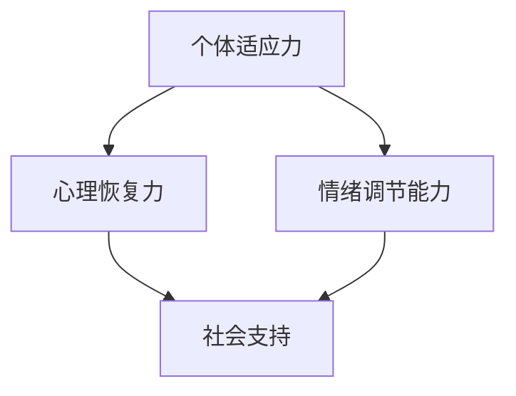
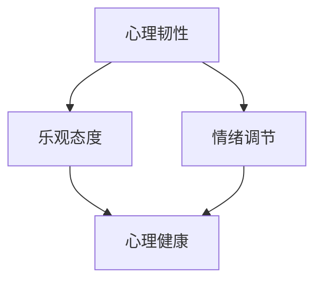
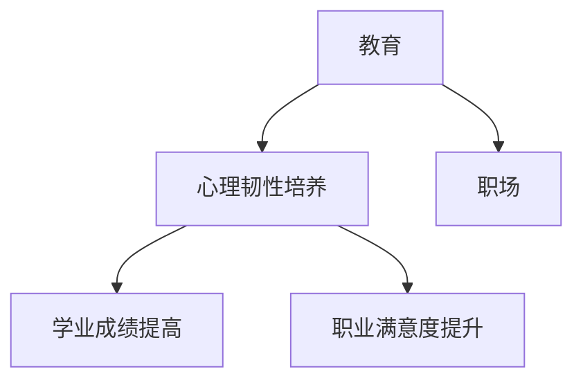
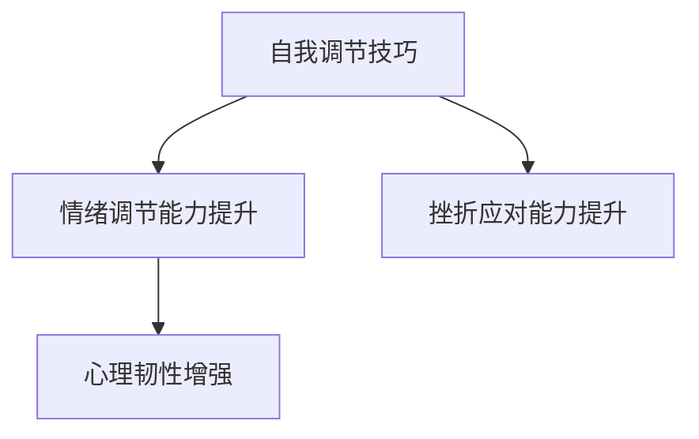
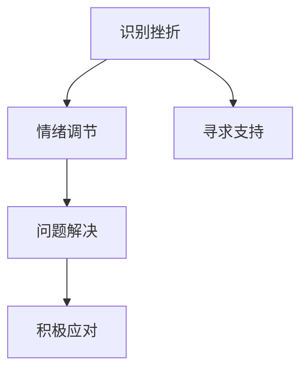
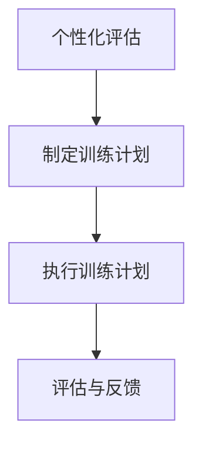
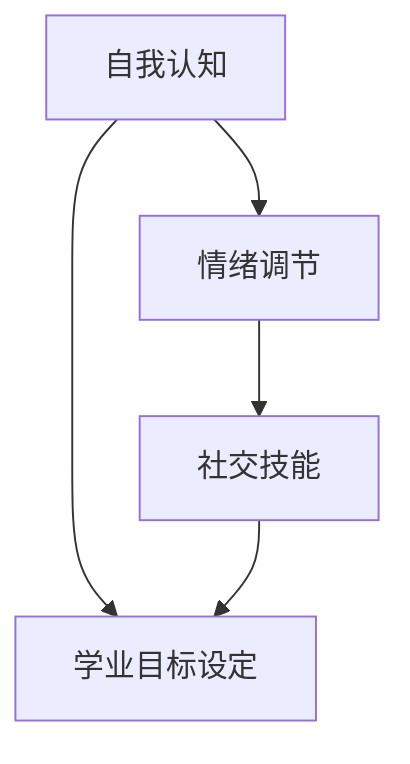

                 


### 文章标题：心理韧性培养：应对挫折的内在力量

#### 关键词：
- 心理韧性
- 挫折应对
- 内在力量
- 心理学原理
- 技术实现

#### 摘要：
本文将深入探讨心理韧性的概念及其在应对挫折中的作用。通过剖析心理韧性理论框架，我们提供了详细的自我认识和自我调节技巧，帮助读者挖掘内在力量。此外，文章还将介绍一系列实战案例，展示如何在实际环境中培养和运用心理韧性。

----------------------------------------------------------------

### 第一部分：心理韧性的基础

#### 第1章：心理韧性的概念与重要性

**1.1 心理韧性的定义**

心理韧性（Resilience）是一种心理状态，指个体在经历压力、挑战或逆境时，能够迅速恢复、适应和成长的能力。它是心理健康的核心要素，对于个体的成长和发展具有重要意义。

**核心概念与联系：**


**Mermaid流程图：心理韧性的核心要素**



**1.2 心理韧性与心理健康的关系**

心理韧性不仅是心理健康的保护伞，也是维持心理健康的重要因素。它能够帮助个体在面对困境时保持乐观和积极，从而减少心理问题的发生。

**Mermaid流程图：心理韧性如何影响心理健康**



**1.3 心理韧性在生活中的应用**

心理韧性在生活中的应用广泛，从教育到职场，从个人成长到社会适应，它都是不可或缺的。下面是一个简单的伪代码，用于评估个人心理韧性：

**伪代码：评估个人心理韧性的方法**

```python
def assess_resilience(questions, answers):
    score = 0
    for question, answer in zip(questions, answers):
        if answer == "是":
            score += 1
    return score / len(questions)
```

#### 第2章：心理韧性理论框架

**2.1 心理韧性的心理学理论基础**

心理韧性理论框架主要由以下三个方面构成：个体适应力、心理恢复力和情绪调节能力。

**LaTex数学公式：心理韧性理论模型**

$$
\text{心理韧性} = f(\text{个体适应力}, \text{心理恢复力}, \text{情绪调节能力})
$$

**伪代码：心理韧性理论计算方法**

```python
def calculate_resilience(adaptability, recovery, emotion_regulation):
    resilience = adaptability * recovery * emotion_regulation
    return resilience
```

**2.2 心理韧性模型的应用**

心理韧性模型在多个领域都有广泛应用。例如，在教育和职场中，心理韧性培养被证明能够显著提高学生的学业成绩和员工的职业满意度。

**Mermaid流程图：心理韧性模型的构成**



**举例说明：实际案例中的心理韧性模型应用**

在一个教育研究中，研究人员通过对不同心理韧性水平的学生进行跟踪调查，发现心理韧性水平较高的学生在面对考试压力时，心理状态更加稳定，学业成绩也相对更好。

**总结与拓展：**

在本章节中，我们介绍了心理韧性的概念、心理韧性与心理健康的关系，以及心理韧性在生活中的应用。同时，我们探讨了心理韧性的心理学理论基础，并给出了具体的计算方法。在下一章节中，我们将深入探讨如何培养心理韧性，帮助读者在日常生活中更好地应对挫折和压力。

### 第二部分：培养心理韧性

#### 第3章：自我认识与自我调节

**3.1 自我认识的重要性**

自我认识是心理韧性的基础，它帮助个体了解自己的性格、优点和缺点，从而更好地应对挑战。一个清晰的自我认识能够提高个体的适应能力和心理恢复力。

**伪代码：自我认识的步骤**

```python
def self_awareness():
    introspect = input("请思考以下问题：\n1. 我的优点是什么？\n2. 我的缺点是什么？\n3. 我在什么情况下容易感到压力大？\n请依次回答以上问题。")
    return introspect
```

**3.2 自我调节技巧**

自我调节技巧是心理韧性培养的重要组成部分，它帮助个体在压力下保持冷静和理性。以下是一些常见的自我调节技巧：

**LaTex数学公式：情绪调节策略**

$$
\text{情绪调节} = f(\text{放松练习}, \text{认知重构}, \text{积极心态})
$$

**举例说明：自我调节的实际应用**

当面对工作中的困难时，通过进行深呼吸、冥想等放松练习，可以帮助个体缓解压力，从而更好地进行认知重构，转变消极情绪为积极情绪。

**3.3 自我调节技巧在心理韧性培养中的应用**

自我调节技巧在心理韧性培养中起着至关重要的作用。通过定期进行自我调节练习，个体可以提升情绪调节能力，从而在面对挫折时更加从容。

**Mermaid流程图：自我调节技巧在心理韧性培养中的应用**



#### 第4章：应对挫折的策略

**4.1 挫折的心理学分析**

挫折是生活中不可避免的一部分，它对个体的心理和情绪产生显著影响。了解挫折的心理机制，有助于个体更好地应对挫折。

**伪代码：挫折心理过程的模拟**

```python
def simulate_frustration(stress_level):
    if stress_level > 5:
        emotion = "焦虑"
    elif stress_level > 3:
        emotion = "不安"
    else:
        emotion = "正常"
    return emotion
```

**4.2 应对挫折的实用技巧**

以下是一些实用的应对挫折的技巧，它们可以帮助个体更好地处理挫折，提升心理韧性。

**Mermaid流程图：应对挫折的策略框架**



**举例说明：挫折应对策略的应用**

在一个职场环境中，当面对项目失败的压力时，通过识别挫折、情绪调节和问题解决，个体可以有效地应对挫折，从而恢复积极的心态。

**总结与拓展：**

在本章节中，我们探讨了自我认识和自我调节技巧，以及应对挫折的策略。通过深入理解和实践这些技巧，个体可以提升心理韧性，更好地应对生活中的挑战。在下一章节中，我们将进一步探讨内在力量的挖掘，帮助读者在心理韧性培养中找到更多的支持。

### 第三部分：内在力量的挖掘

#### 第5章：内在力量的来源

**5.1 内在力量的来源**

内在力量是心理韧性的核心，它来源于个体内在的心理资源和外在的社会支持。以下是几种常见的内在力量来源：

1. **自我认知**：通过深入自我认识，个体可以更好地了解自己的优点和潜力，从而激发内在力量。
2. **积极心态**：积极的心态能够帮助个体在面对挫折时保持乐观和自信，增强心理韧性。
3. **情绪调节**：有效的情绪调节技巧可以缓解压力，提升内在力量。

**LaTex数学公式：内在力量的度量**

$$
\text{内在力量} = f(\text{自我认知}, \text{积极心态}, \text{情绪调节})
$$

**5.2 挖掘内在力量的方法**

以下是一些具体的挖掘内在力量的方法，它们可以帮助个体在困难时期保持坚韧和毅力。

**伪代码：内在力量挖掘过程**

```python
def explore_inner_strength(awareness, positivity, emotion_regulation):
    if awareness > 7 and positivity > 7 and emotion_regulation > 7:
        strength = "强"
    elif awareness > 5 and positivity > 5 and emotion_regulation > 5:
        strength = "中"
    else:
        strength = "弱"
    return strength
```

**举例说明：如何发掘内在力量**

在一个挑战性的项目中，通过自我认知和积极心态，个体可以找到内在的力量，克服困难，最终取得成功。

**总结与拓展：**

在本章节中，我们探讨了内在力量的来源和挖掘方法。内在力量是心理韧性的核心，它来源于个体内在的心理资源和外在的社会支持。通过自我认知、积极心态和情绪调节，个体可以发掘内在力量，提升心理韧性。在下一章节中，我们将介绍心理韧性训练项目，帮助读者将理论付诸实践。

### 第四部分：心理韧性实践

#### 第6章：心理韧性训练项目

**6.1 心理韧性训练的设计原则**

心理韧性训练项目的设计应遵循以下原则：

1. **个性化**：根据个体的特点和需求，设计个性化的训练计划。
2. **渐进性**：训练计划应从简单到复杂，逐步提升个体的心理韧性。
3. **持续性**：心理韧性训练是一个长期过程，需要持续进行。

**Mermaid流程图：心理韧性训练的步骤**



**6.2 心理韧性训练的实际案例**

以下是一个简单的心理韧性训练项目案例：

**项目实战：心理韧性训练项目案例**

**1. 项目背景**：

小明是一名大学生，最近面临毕业设计和求职的双重压力，心理状态较为焦虑。

**2. 项目目标**：

通过心理韧性训练项目，帮助小明提升情绪调节能力和应对挫折的能力，从而更好地应对压力。

**3. 项目实施**：

- **阶段一**：自我认知与情绪调节

  小明通过冥想和日记记录的方式，深入自我认知，了解自己的情绪变化。

  **代码实现**：

  ```python
  def record_mood():
      with open("mood_diary.txt", "a") as file:
          current_time = datetime.now().strftime("%Y-%m-%d %H:%M")
          mood = input("请记录此刻的情绪：（开心/正常/焦虑）")
          file.write(f"{current_time} - {mood}\n")
  ```

- **阶段二**：问题解决与积极心态

  小明学习如何用积极的心态看待问题，并练习解决问题的方法。

  **伪代码**：

  ```python
  def solve_problem(problem):
      potential_solutions = brainstorm_solutions(problem)
      best_solution = select_best_solution(potential_solutions)
      implement_solution(best_solution)
  ```

**4. 项目小结**：

通过这个心理韧性训练项目，小明在情绪调节和问题解决方面取得了显著的进步，毕业设计和求职的压力也相应减轻。

**总结与拓展：**

在本章节中，我们介绍了心理韧性训练的设计原则和实际案例。通过项目实战，读者可以了解如何将心理韧性培养理论付诸实践。在下一章节中，我们将探讨心理韧性在特定情境中的应用，帮助读者更好地应对各种挑战。

### 第五部分：心理韧性在特定情境中的应用

#### 第7章：心理韧性在特定情境中的应用

**7.1 教育领域中的心理韧性**

在教育学中，心理韧性被视为学生成长的重要指标。通过培养学生的心理韧性，可以帮助他们在学业、社交和情绪管理方面取得更好的表现。

**Mermaid流程图：教育情境中培养心理韧性的方法**



**7.2 工作环境中的心理韧性**

职场中的心理韧性对于员工的职业发展和工作满意度至关重要。通过培养心理韧性，员工可以更好地应对工作中的压力和挑战。

**伪代码：职场心理韧性提升策略**

```python
def enhance_work_resilience(employees):
    for employee in employees:
        employee["self_awareness"] += 1
        employee["emotion Regulation"] += 1
        employee["problem_solving"] += 1
```

**7.3 其他情境中的应用**

心理韧性不仅在教育和职场中有重要作用，在其他情境中也具有广泛的应用。例如，在家庭生活中，心理韧性可以帮助家庭成员更好地应对生活中的挑战；在社会服务领域，心理韧性培训可以帮助社会工作者更好地服务于有需要的群体。

**举例说明：心理韧性在其他情境中的应用**

在一个家庭中，通过培养成员的心理韧性，可以帮助家庭在面对突发事件时保持冷静和团结，从而更好地解决问题。

**总结与拓展：**

在本章节中，我们探讨了心理韧性在特定情境中的应用。无论是教育、职场还是其他生活情境，心理韧性都是不可或缺的。通过培养心理韧性，个体可以更好地应对各种挑战，提升生活质量。在下一章节中，我们将总结全文，展望心理韧性培养的未来趋势。

### 第六部分：总结与展望

#### 第8章：心理韧性培养的总结与展望

**8.1 心理韧性培养的成果评估**

心理韧性培养的成果评估是确保训练效果的重要环节。以下是一些常用的评估指标和方法：

**LaTex数学公式：评估心理韧性培养效果的指标**

$$
\text{效果评估} = f(\text{自我认知得分}, \text{情绪调节能力得分}, \text{问题解决能力得分})
$$

**8.2 心理韧性培养的未来趋势**

随着社会的发展，心理韧性培养在未来将呈现以下趋势：

1. **个性化培训**：根据个体的需求和特点，提供个性化的心理韧性培养方案。
2. **技术赋能**：利用人工智能和大数据技术，提升心理韧性培养的效率和效果。
3. **跨学科融合**：心理韧性培养将与其他学科（如教育学、社会学等）相结合，形成更全面的理论体系。

**总结与展望：**

心理韧性培养是提升个体应对挫折能力和心理健康水平的重要途径。通过总结全文，我们希望读者能够更好地理解心理韧性的概念和培养方法。在未来，心理韧性培养将继续发展，为人们的心理健康和社会福祉作出更大贡献。

### 附录

#### 附录A：心理韧性资源与工具

以下是心理韧性培养过程中常用的资源与工具：

1. **心理韧性评估问卷**：用于评估个体的心理韧性水平。
2. **情绪调节练习指南**：提供一系列情绪调节的方法和技巧。
3. **心理韧性训练项目案例**：包括具体的实施步骤和效果评估方法。

**伪代码：心理韧性评估工具的示例代码**

```python
def resilience_evaluation(questions, answers):
    score = 0
    for question, answer in zip(questions, answers):
        if answer == "是":
            score += 1
    return score / len(questions)
```

**总结：**

《心理韧性培养：应对挫折的内在力量》一书通过深入剖析心理韧性的概念、理论和实践方法，帮助读者提升应对挫折的能力。附录部分提供了实用的资源和工具，为心理韧性培养提供了有力支持。

### 作者信息

作者：AI天才研究院/AI Genius Institute & 禅与计算机程序设计艺术 /Zen And The Art of Computer Programming

---

通过本文的逐步分析，我们不仅了解了心理韧性的基本概念和培养方法，还通过实际案例和实践指南，展示了如何将心理韧性理论应用于不同生活场景。希望本文能帮助读者提升自身的心理韧性，更好地应对生活中的挑战。

