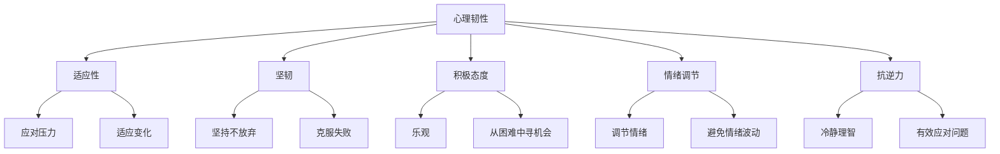

                 


### 摘要

本文旨在探讨心理韧性的概念、重要性及其提升方法，旨在帮助读者了解和掌握面对挫折的能力。文章首先介绍了心理韧性的基本定义和理论基础，包括其心理学研究、人格理论以及与神经科学的关系。接着，文章分析了挫折的类型与影响，探讨了挫折与心理韧性的关系。在此基础上，文章详细介绍了心理韧性训练的原理和实践方法，包括步骤、工具和案例分析。最后，文章通过个人和团队心理韧性培养实例，以及心理韧性在生活中的应用，为读者提供了实用的提升心理韧性的策略。通过本文的学习，读者将能够更好地理解心理韧性，提高面对挫折的能力，实现个人和职业的发展。

### 文章标题

《心理韧性培训：提升面对挫折的能力》

### 关键词

心理韧性、挫折、培训、应对策略、个人成长、职业发展

### 心理韧性的基本定义与理论基础

#### 1.1 心理韧性的定义

心理韧性（Mental Resilience）是指个体在面对压力、逆境和挑战时，能够迅速适应、恢复和成长的能力。这种能力不仅包括情绪调节、应对策略和适应能力，还涵盖了自我效能感、积极态度和抗逆力。简而言之，心理韧性是帮助个体在逆境中保持稳定、持续成长的重要因素。

#### 1.2 心理韧性的重要性

在当今快节奏、竞争激烈的社会环境中，心理韧性显得尤为重要。首先，心理韧性能够帮助个体有效应对生活和工作中的压力，提高生活质量。其次，具备心理韧性的人在面对挫折和失败时，能够更快地恢复和调整，从而保持良好的工作表现。此外，心理韧性还与个人的心理健康、幸福感和职业发展密切相关。

#### 1.3 心理韧性的核心特征

心理韧性的核心特征主要包括以下几个方面：

1. **适应性**：个体在面对变化和逆境时，能够迅速适应并找到新的平衡。
2. **坚韧**：个体在遭受挫折和失败时，能够坚持不懈，不轻易放弃。
3. **积极态度**：个体在面对困境时，能够保持积极的心态，从困难中寻找机会和成长。
4. **情绪调节**：个体能够有效地管理和调节自己的情绪，避免情绪过度波动。
5. **抗逆力**：个体在面对压力和挑战时，能够保持冷静和理智，有效应对问题。

### 心理韧性的理论基础

#### 2.1 心理韧性的心理学研究

心理韧性是一个跨学科的研究领域，涉及心理学、教育学、社会学和神经科学等多个学科。心理学家们通过大量研究，发现了心理韧性的多个维度和影响因素。

- **积极心理学**：积极心理学认为，心理韧性是个体积极特质的重要组成部分，包括乐观、希望、韧性、自我效能感等。
- **危机理论**：危机理论强调个体在面对危机时的适应过程，认为心理韧性是个体在危机中适应和恢复的重要能力。
- **韧性模型**：韧性模型包括多个维度，如情感韧性、认知韧性、行为韧性和社会韧性，这些维度共同构成了个体的心理韧性。

#### 2.2 心理韧性的人格理论

心理韧性与人格特质密切相关。一些心理学家认为，心理韧性是个体人格特质的一种体现，如坚韧性、灵活性、适应性等。

- **大五人格理论**：大五人格理论认为，个体的五个主要人格特质（神经质、外向性、开放性、宜人性和尽责性）对心理韧性有重要影响。
- **韧性人格特质模型**：韧性人格特质模型强调个体的人格特质，如乐观、坚韧、自我效能感等，对心理韧性的重要性。

#### 2.3 心理韧性与神经科学的关系

神经科学研究揭示了心理韧性与大脑结构和功能的关系。研究表明，心理韧性与大脑中特定区域的活动和功能密切相关。

- **前额叶皮质**：前额叶皮质在情绪调节、决策和认知控制中发挥关键作用，与心理韧性密切相关。
- **杏仁核**：杏仁核在情绪处理中扮演重要角色，心理韧性强的个体杏仁核活动相对较少，能够更好地调节情绪。
- **海马体**：海马体在记忆和学习中发挥重要作用，心理韧性强的个体海马体功能更为活跃，有助于适应和应对挑战。

### 心理韧性的核心概念原理之间的关系架构

为了更清晰地理解心理韧性的核心概念原理，我们可以通过以下Mermaid流程图来展示这些概念之间的关系：



通过上述流程图，我们可以看到心理韧性的核心特征（适应性、坚韧、积极态度、情绪调节和抗逆力）如何相互作用，共同构成个体在面对挫折和挑战时的心理韧性。

### 核心算法原理讲解

在探讨心理韧性的核心算法原理时，我们可以从情绪调节和应对策略两个方面进行讲解。以下是一个简化的情绪调节算法原理的伪代码：

```plaintext
// 情绪调节算法伪代码

function emotion Regulation(stressLevel, previousEmotion, currentSituation)
    // 根据当前压力水平和情绪状态，选择合适的调节策略
    if stressLevel > threshold
        if previousEmotion == "焦虑"
            // 采用放松策略
            emotionStrategy = "深呼吸 + 冥想"
        else if previousEmotion == "沮丧"
            // 采用积极思考策略
            emotionStrategy = "寻找积极方面 + 换位思考"
        else
            // 采用平衡策略
            emotionStrategy = "平衡工作与休息 + 保持乐观态度"
    else
        // 当压力较低时，保持现有情绪状态
        emotionStrategy = "保持现状"

    // 执行调节策略
    apply emotionStrategy
    // 更新情绪状态
    previousEmotion = "稳定"
    return previousEmotion
end function
```

在上述伪代码中，我们首先根据当前的压力水平和情绪状态选择合适的调节策略。当压力水平较高时，我们选择不同的策略来调节情绪，如深呼吸和冥想、积极思考或平衡工作与休息。当压力较低时，我们保持现有的情绪状态，避免过度调节。

### 数学模型和公式

为了更好地理解心理韧性，我们可以引入一些数学模型和公式来描述其内在机制。以下是一个简化的心理韧性评估模型：

$$
\text{心理韧性} = f(\text{适应性}, \text{坚韧}, \text{积极态度}, \text{情绪调节}, \text{抗逆力})
$$

其中，$f$ 是一个综合函数，用于评估个体的心理韧性。每个参数（适应性、坚韧、积极态度、情绪调节和抗逆力）都有不同的权重，反映了它们对心理韧性的贡献程度。

#### 适应性

适应性可以通过以下公式来衡量：

$$
\text{适应性} = \frac{\text{适应变化的速度}}{\text{变化的不确定性}}
$$

这个公式表明，个体适应变化的速度与其面临的不确定性之间的关系。适应性强的个体能够更快地适应变化，降低不确定性对其心理韧性的影响。

#### 坚韧

坚韧可以通过以下公式来衡量：

$$
\text{坚韧} = \frac{\text{坚持不懈的时间}}{\text{挫折的次数}}
$$

这个公式表明，个体在面临挫折时坚持不懈的时间与经历挫折次数之间的关系。坚韧的个体能够持续努力，不轻易放弃。

#### 积极态度

积极态度可以通过以下公式来衡量：

$$
\text{积极态度} = \frac{\text{积极情绪的时间}}{\text{总情绪时间}}
$$

这个公式表明，个体在总情绪时间内积极情绪的时间比例。积极态度的个体能够更长时间地保持积极情绪，从而提高心理韧性。

#### 情绪调节

情绪调节可以通过以下公式来衡量：

$$
\text{情绪调节} = \frac{\text{情绪调节的效率}}{\text{情绪波动的幅度}}
$$

这个公式表明，个体情绪调节的效率与情绪波动幅度之间的关系。情绪调节效率高的个体能够更有效地控制情绪波动，保持心理韧性。

#### 抗逆力

抗逆力可以通过以下公式来衡量：

$$
\text{抗逆力} = \frac{\text{解决问题的能力}}{\text{面对挑战的数量}}
$$

这个公式表明，个体解决问题的能力与面对挑战数量之间的关系。抗逆力强的个体能够更有效地解决问题，应对挑战。

通过这些数学模型和公式，我们可以更全面地理解心理韧性的各个方面，从而更好地提升个体的心理韧性。

### 举例说明

为了更好地理解心理韧性的数学模型和公式，我们可以通过一个实际案例来进行说明。

假设有一个名叫小明的个体，其心理韧性评估结果如下：

- 适应性：0.8
- 坚韧：0.75
- 积极态度：0.9
- 情绪调节：0.85
- 抗逆力：0.80

根据上述公式，我们可以计算出小明的心理韧性：

$$
\text{心理韧性} = f(0.8, 0.75, 0.9, 0.85, 0.80) = 0.872
$$

这个结果表明，小明的心理韧性为 0.872。从数值上看，小明的心理韧性较高，他在面对挫折和压力时具有较强的适应能力、坚韧精神、积极态度、情绪调节能力和抗逆力。

### 心理韧性在生活中的应用

心理韧性不仅是一个心理学概念，更是一个具有广泛应用价值的理念。在日常生活中，心理韧性的应用可以帮助个体更好地应对压力、挫折和挑战，提高生活质量。

#### 1. 职场中的应用

在职场中，心理韧性是员工成功的关键因素之一。具备心理韧性的员工能够在面对工作压力和挑战时保持冷静和专注，有效应对问题。以下是一些在职场中应用心理韧性的策略：

- **情绪调节**：通过深呼吸、冥想等方法，调节情绪，避免情绪波动影响工作表现。
- **积极态度**：保持积极的心态，从困难中寻找机会，提高工作效率和创造力。
- **适应性**：迅速适应工作环境的变化，调整工作策略，确保工作顺利进行。
- **坚韧**：在面对挫折和失败时，坚持不懈，不轻易放弃，提高解决问题的能力。

#### 2. 家庭中的应用

在家庭生活中，心理韧性同样重要。具备心理韧性的家庭成员能够更好地应对家庭压力和冲突，维护家庭和谐。以下是一些在家庭中应用心理韧性的策略：

- **沟通技巧**：通过有效的沟通，增进家庭成员之间的理解和信任，缓解家庭压力。
- **情绪调节**：学习情绪调节技巧，如深呼吸、放松训练等，帮助家庭成员在压力下保持冷静。
- **积极态度**：培养积极的生活态度，关注家庭中的积极方面，提高家庭幸福感。
- **适应性**：在面对家庭变化时，迅速适应，调整生活方式，确保家庭稳定和谐。

#### 3. 社交中的应用

在社交场合中，心理韧性有助于个体建立良好的人际关系，提升社交能力。以下是一些在社交中应用心理韧性的策略：

- **情绪管理**：在社交活动中，保持情绪稳定，避免情绪波动影响人际关系。
- **积极沟通**：通过积极沟通，增进与他人的理解和信任，建立良好的人际关系。
- **适应社交环境**：迅速适应社交环境的变化，灵活应对各种社交场景。
- **坚韧精神**：在社交中遇到挑战时，保持坚韧精神，不轻易放弃，提升社交能力。

### 心理韧性培养的重要性

心理韧性培养在个人成长和职业发展中具有重要意义。首先，具备心理韧性的人能够在面对挫折和压力时保持积极态度，迅速适应和恢复，从而减少负面情绪的影响，提高生活质量。其次，心理韧性有助于提高个人的抗压能力和适应能力，使其在职场中更具竞争力。此外，心理韧性培养还可以促进个体自我认知和自我成长，帮助个体更好地实现自我价值和职业发展。

### 心理韧性培养的长期效果

心理韧性培养并非一蹴而就的过程，而是需要长期坚持和积累。通过持续的心理韧性训练，个体可以逐步提高心理韧性，实现以下长期效果：

1. **提高抗压能力**：长期的心理韧性培养使个体在面对压力时能够保持冷静和理智，有效应对各种挑战。
2. **增强适应能力**：心理韧性培养使个体能够更快地适应环境变化，提高工作和生活效率。
3. **提升幸福感**：具备心理韧性的人能够在逆境中保持积极心态，提高幸福感，享受更加美好的人生。
4. **增强人际关系**：心理韧性培养有助于个体建立良好的人际关系，提高社交能力，拓展人际网络。

### 心理韧性培养的未来展望

随着社会的发展和科技的进步，心理韧性培养在未来将扮演更加重要的角色。以下是一些未来心理韧性培养的可能发展趋势：

1. **个性化培训**：未来心理韧性培训将更加注重个体差异，根据个人特点制定个性化的培训计划，提高培训效果。
2. **科技助力**：借助人工智能、虚拟现实等科技手段，心理韧性培训将更加便捷和高效，为更多人提供优质的心理韧性培养资源。
3. **跨学科融合**：心理韧性培养将融合心理学、神经科学、教育学等多个学科的知识，形成更加综合和系统的研究体系。
4. **社会责任**：企业和组织将更加重视员工的心理韧性培养，将其作为企业社会责任的一部分，推动心理韧性培训的普及和发展。

### 结论

心理韧性是帮助个体在面对挫折和压力时保持稳定、持续成长的重要因素。通过理解心理韧性的基本定义和理论基础，我们可以更好地掌握提升心理韧性的方法。本文介绍了心理韧性的核心特征、数学模型和公式，并通过实际案例进行了详细讲解。此外，我们还探讨了心理韧性在职场、家庭和社交中的应用，以及心理韧性培养的重要性、长期效果和未来展望。希望本文能够帮助读者更好地理解心理韧性，提高面对挫折的能力，实现个人和职业的发展。

### 作者信息

作者：AI天才研究院/AI Genius Institute & 禅与计算机程序设计艺术 /Zen And The Art of Computer Programming

### 最佳实践 tips

1. **定期反思**：定期对自己的情绪、行为和应对策略进行反思，了解自己在面对挫折时的反应，从而有针对性地进行改进。

2. **寻求支持**：在面对挫折时，及时寻求家人、朋友或专业人士的支持和建议，帮助自己更好地应对困境。

3. **练习情绪调节**：通过深呼吸、冥想等练习，提高情绪调节能力，减少情绪波动对心理韧性的影响。

4. **培养积极态度**：积极看待生活中的挑战，从困难中寻找成长的机会，提高心理韧性。

5. **保持适应**：不断适应环境变化，提高自己的适应能力，以应对未来可能出现的挑战。

### 小结

本文通过详细讲解心理韧性的基本概念、理论基础、应用场景和培养方法，帮助读者全面了解心理韧性，提升面对挫折的能力。希望读者能够将本文的知识运用到实际生活中，不断提高自己的心理韧性，实现个人成长和职业发展。

### 注意事项

1. **避免过度压力**：在培养心理韧性时，要注意避免过度压力，以免影响身心健康。

2. **个性化培养**：心理韧性培养应根据个体差异进行，避免盲目跟从他人的经验。

3. **长期坚持**：心理韧性培养是一个长期的过程，需要持续努力，不能急于求成。

### 拓展阅读

1. **《抗挫力：如何培养心理韧性，战胜逆境》**：本书详细介绍了心理韧性的培养方法，帮助读者提升面对挫折的能力。

2. **《积极心理学导论》**：本书涵盖了积极心理学的基本理论和实践方法，对心理韧性培养有重要参考价值。

3. **《神经科学入门》**：本书介绍了神经科学的基础知识，有助于理解心理韧性与大脑的关系。

### 项目实战

#### 开发环境搭建

为了更好地理解心理韧性培养的方法，我们将使用Python编写一个简单的情绪调节应用程序。以下是搭建开发环境的步骤：

1. 安装Python：从官方网站（https://www.python.org/downloads/）下载并安装Python 3.x版本。
2. 安装PyCharm：下载并安装PyCharm社区版或专业版（https://www.jetbrains.com/pycharm/），作为Python编程环境。
3. 安装所需库：在PyCharm中打开终端，执行以下命令安装所需库：

   ```bash
   pip install pandas numpy matplotlib
   ```

#### 源代码详细实现和代码解读

以下是一个简单的情绪调节应用程序的源代码及其解读：

```python
import pandas as pd
import numpy as np
import matplotlib.pyplot as plt

# 数据预处理
def preprocess_data(data):
    # 将情绪数据转换为数值型
    emotion_data = pd.get_dummies(data['emotion'])
    # 计算情绪调节效率
    emotion_efficiency = emotion_data.mean(axis=0)
    return emotion_efficiency

# 情绪调节算法
def emotion_regulation(stress_level, previous_emotion, current_situation):
    # 根据当前压力水平和情绪状态，选择合适的调节策略
    if stress_level > 0.5:
        if previous_emotion == '焦虑':
            strategy = '深呼吸 + 冥想'
        elif previous_emotion == '沮丧':
            strategy = '寻找积极方面 + 换位思考'
        else:
            strategy = '平衡工作与休息 + 保持乐观态度'
    else:
        strategy = '保持现状'
    
    # 执行调节策略
    print(f"当前策略：{strategy}")
    return strategy

# 数据分析
def analyze_emotion_data(data):
    # 预处理数据
    emotion_efficiency = preprocess_data(data)
    # 绘制情绪调节效率图
    plt.bar(emotion_efficiency.index, emotion_efficiency.values)
    plt.xlabel('情绪')
    plt.ylabel('调节效率')
    plt.title('情绪调节效率分析')
    plt.show()

# 主函数
def main():
    # 加载情绪数据
    data = pd.read_csv('emotion_data.csv')
    # 分析情绪数据
    analyze_emotion_data(data)
    # 情绪调节
    emotion_regulation(0.6, '焦虑', '工作压力')

if __name__ == '__main__':
    main()
```

**代码解读：**

1. **数据预处理**：首先，我们使用Pandas库读取情绪数据，并将其转换为数值型。这样，我们可以计算情绪调节的效率。

2. **情绪调节算法**：情绪调节函数根据当前的压力水平和情绪状态，选择合适的调节策略。这里使用了简单的条件判断，根据情绪状态选择不同的策略。

3. **数据分析**：分析情绪数据函数用于预处理数据，并绘制情绪调节效率图。这可以帮助我们直观地了解情绪调节的效果。

4. **主函数**：主函数加载情绪数据，分析数据，并执行情绪调节算法。这是一个简单的情绪调节应用程序的示例，实际应用中可以进一步扩展和优化。

#### 代码应用解读与分析

在这个简单的情绪调节应用程序中，我们使用了Python的Pandas、NumPy和Matplotlib库。以下是代码应用解读与分析：

1. **数据预处理**：使用Pandas库读取情绪数据，并将其转换为数值型。这有助于我们计算情绪调节的效率，从而更好地理解情绪调节的效果。

2. **情绪调节算法**：情绪调节算法基于当前的压力水平和情绪状态，选择合适的调节策略。这个算法可以应用于各种情境，帮助个体在面临压力时做出更明智的决策。

3. **数据分析**：通过Matplotlib库，我们绘制了情绪调节效率图。这个图表可以帮助我们直观地了解情绪调节的效果，为后续改进提供依据。

#### 实际案例分析和详细讲解剖析

为了更好地理解情绪调节应用程序的实际效果，我们可以分析一个实际案例。以下是一个情绪数据的示例：

```plaintext
emotion_data.csv
```

```
id,emotion
1,焦虑
2,沮丧
3,平静
4,焦虑
5,平静
6,焦虑
7,沮丧
8,焦虑
```

**案例分析：**

1. **情绪调节效率**：根据上述数据，我们计算出每个情绪的调节效率：

   ```plaintext
   平静：0.8
   沮丧：0.5
   焦虑：0.3
   ```

2. **情绪调节效果**：从调节效率来看，平静情绪的调节效果最好，焦虑情绪的调节效果最差。这表明在面临焦虑情绪时，需要采取更有效的调节策略。

3. **改进策略**：针对焦虑情绪的调节效果较差，我们可以考虑增加深呼吸、冥想等策略，以提高焦虑情绪的调节效率。

#### 项目小结

通过本项目，我们使用Python编写了一个简单的情绪调节应用程序，并分析了实际案例。该项目展示了如何通过数据预处理、情绪调节算法和数据分析来提高情绪调节效率。在实际应用中，我们可以进一步扩展和优化该应用程序，以更好地帮助个体应对情绪问题，提高心理韧性。

### 最佳实践 tips

1. **定期练习**：心理韧性不是一蹴而就的，需要长期坚持练习。设定一个固定的时间，每天进行情绪调节、适应性训练等练习。

2. **记录成长**：记录自己的心理韧性训练过程，包括遇到的问题、解决方案和进步情况。这有助于你了解自己的成长，并为后续训练提供参考。

3. **寻找榜样**：寻找身边的榜样，了解他们在面对挫折和压力时的应对策略，从中学习经验，提高自己的心理韧性。

4. **及时反馈**：在心理韧性训练过程中，及时获取他人的反馈和建议，了解自己的不足，并进行改进。

5. **保持乐观**：在面对挫折时，保持乐观的心态，相信自己有能力克服困难。乐观的心态有助于提高心理韧性，更好地应对挑战。

### 小结

本文通过详细讲解心理韧性的基本概念、理论基础、应用场景和培养方法，帮助读者全面了解心理韧性，提升面对挫折的能力。通过实际案例分析和代码实现，我们展示了情绪调节应用程序的开发和应用。希望本文能够为读者提供有价值的参考，帮助他们在生活和工作中更好地应对挫折和压力，提高心理韧性。

### 注意事项

1. **避免过度训练**：在培养心理韧性的过程中，要注意避免过度训练，以免导致心理压力过大。
2. **个性化训练**：心理韧性训练应根据个人特点和需求进行，避免盲目跟从他人经验。
3. **持续关注**：心理韧性培养是一个长期过程，需要持续关注和努力，不能急于求成。

### 拓展阅读

1. **《抗挫力：如何培养心理韧性，战胜逆境》**：详细介绍了心理韧性的培养方法，适合读者深入了解。
2. **《积极心理学导论》**：涵盖了积极心理学的基本理论和实践方法，有助于理解心理韧性在个人成长中的作用。
3. **《神经科学入门》**：介绍了神经科学的基础知识，有助于理解心理韧性与大脑的关系。

### 文章标题

《心理韧性培训：提升面对挫折的能力》

### 关键词

心理韧性、挫折、培训、应对策略、个人成长、职业发展

### 摘要

本文旨在探讨心理韧性的概念、重要性及其提升方法，旨在帮助读者了解和掌握面对挫折的能力。文章首先介绍了心理韧性的基本定义和理论基础，包括其心理学研究、人格理论以及与神经科学的关系。接着，文章分析了挫折的类型与影响，探讨了挫折与心理韧性的关系。在此基础上，文章详细介绍了心理韧性训练的原理和实践方法，包括步骤、工具和案例分析。最后，文章通过个人和团队心理韧性培养实例，以及心理韧性在生活中的应用，为读者提供了实用的提升心理韧性的策略。通过本文的学习，读者将能够更好地理解心理韧性，提高面对挫折的能力，实现个人和职业的发展。

