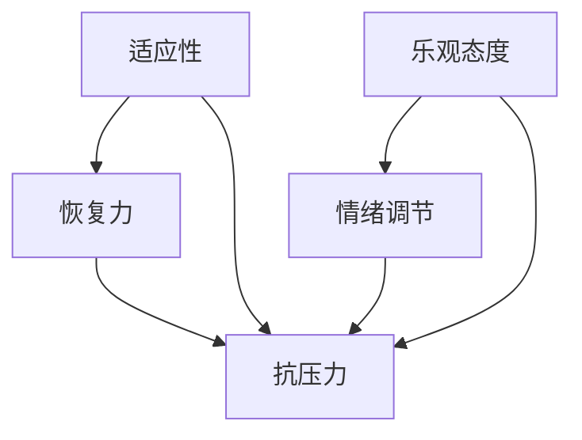
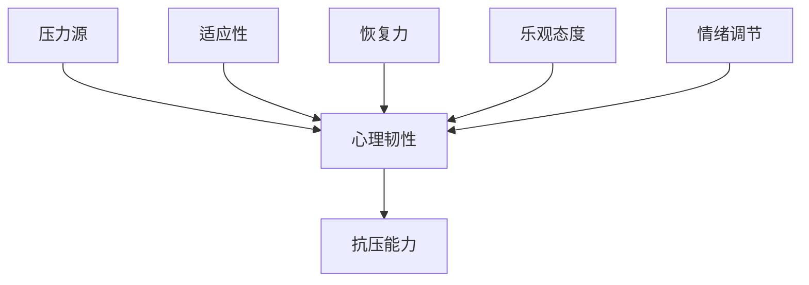
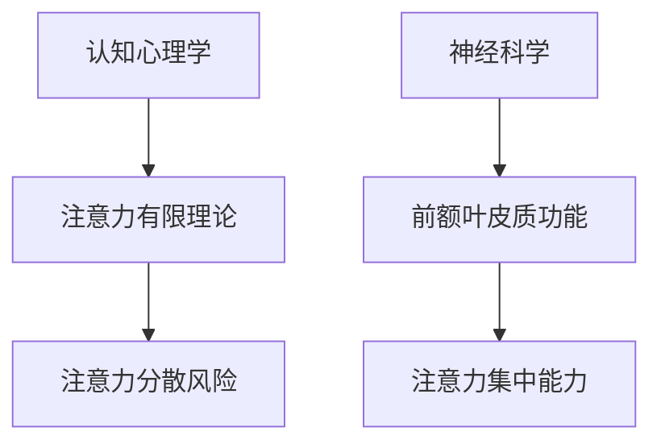
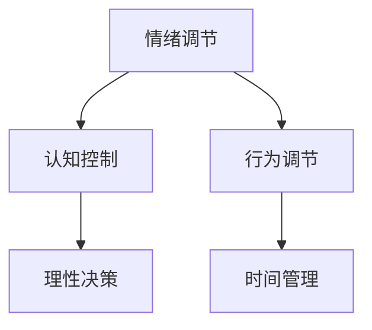
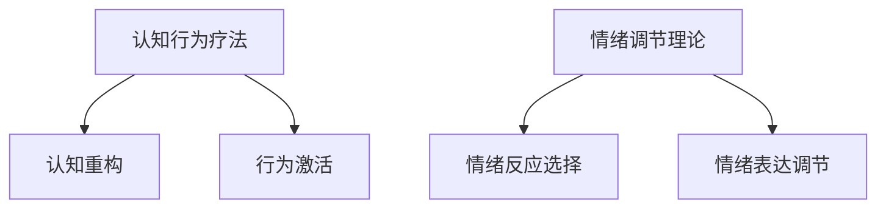

                 

### 文章标题

# 心理韧性训练营：提升抗压能力

在瞬息万变的信息时代，职场压力与日俱增，许多人在面对工作的挑战时感到力不从心。这种压力不仅影响了工作效率，还可能对个人的心理健康造成严重影响。为了应对这一挑战，我们提出了《心理韧性训练营：提升抗压能力》这一主题，通过系统的心理韧性训练，帮助读者提升抗压能力，从而在高压环境下保持积极心态和高效工作状态。

本文旨在通过以下几个部分，深入探讨心理韧性的基础理论、训练方法、抗压能力的提升策略以及心理韧性训练营的实践与反馈：

1. **心理韧性的基础理论**：介绍心理韧性的概念与重要性，解析其核心要素，如焦点管理、正念练习、自我调节和社交支持。
   
2. **心理韧性的训练方法**：详细讲解焦点管理的实践技巧、正念练习的入门与提升、自我调节的技巧与实践，以及社交支持的建立与维护。

3. **抗压能力的提升策略**：探讨压力源的识别与应对、情绪调节的技巧以及心理韧性的综合训练。

4. **心理韧性训练营的实践与反馈**：分享心理韧性训练营的组织与实施经验，以及学员的反馈与改进策略。

通过这些内容的系统讲解，读者可以全面了解心理韧性训练的各个方面，掌握提升抗压能力的方法和技巧。希望本文能够为广大读者提供有益的启示和帮助，助力他们在职场中更加从容应对各种挑战。

### 文章关键词

- **心理韧性**
- **抗压能力**
- **焦点管理**
- **正念练习**
- **自我调节**
- **社交支持**

### 文章摘要

本文深入探讨了心理韧性训练营的核心内容，旨在提升读者的抗压能力。首先，介绍了心理韧性的基础理论，包括其概念与重要性，以及核心要素如焦点管理、正念练习、自我调节和社交支持。接着，详细讲解了心理韧性的训练方法，包括焦点管理的实践技巧、正念练习的入门与提升、自我调节的技巧与实践，以及社交支持的建立与维护。随后，提出了抗压能力的提升策略，包括压力源的识别与应对、情绪调节的技巧以及心理韧性的综合训练。最后，分享了心理韧性训练营的实践与反馈，通过具体的组织与实施经验，以及学员的反馈与改进策略，为读者提供实际操作的指南。希望通过本文的讲解，读者能够有效提升自己的抗压能力，在高压环境中保持积极心态和高效工作状态。

### 心理韧性的概念与重要性

#### 背景介绍

心理韧性（Mental Resilience）是指个体在面对逆境、压力和挑战时，能够迅速适应、恢复并保持积极心态的能力。这个概念最早由心理学家约翰·卡布（John C. Parkes）于20世纪80年代提出，经过多年的研究和发展，已经成为心理学领域的一个重要概念。

在当今社会，心理韧性显得尤为重要。随着科技的发展和生活节奏的加快，职场竞争日益激烈，人们面临的工作压力和生活压力不断增加。无论是职场新人还是经验丰富的职场人士，都可能遇到种种挑战和困难。心理韧性不仅有助于个体在面对压力时保持冷静和积极，还能够提升工作效率，增强人际关系，甚至改善身心健康。

#### 核心概念与联系

心理韧性的核心概念包括以下几个方面：

1. **适应性（Adaptation）**：个体在面对逆境时能够迅速适应，采取有效的应对策略，从而降低压力的影响。
2. **恢复力（Resilience）**：个体在经历压力和挑战后能够迅速恢复，保持心理和生理的平衡。
3. **乐观态度（Optimism）**：个体在面对困难时能够保持积极乐观的心态，相信问题终将解决。
4. **情绪调节（Emotion Regulation）**：个体能够有效地管理自己的情绪，避免负面情绪的过度影响。

这些核心概念之间存在着紧密的联系。例如，适应性是恢复力的基础，而乐观态度和情绪调节则有助于提升适应性。通过以下Mermaid流程图，我们可以更直观地理解这些概念之间的关系：

#### 心理韧性与抗压能力的关系

心理韧性和抗压能力密切相关。抗压能力是指个体在面对压力时能够保持冷静、高效地完成工作的能力。心理韧性正是这种抗压能力的重要支撑。以下是一个简化的关系架构图，展示了心理韧性如何影响抗压能力：

在这个架构中，压力源作用于个体，通过心理韧性这个中间变量，最终影响抗压能力。具体来说：

- **适应性**：个体在面对压力源时能够快速适应，减少压力的负面影响。
- **恢复力**：个体在经历压力后能够迅速恢复，保持工作状态。
- **乐观态度**：个体在压力下保持积极乐观，有助于提高抗压能力。
- **情绪调节**：个体能够有效管理情绪，避免负面情绪对工作效率的干扰。

通过以上分析，我们可以看出，心理韧性不仅是一个个体特质，也是提升抗压能力的关键因素。在接下来的章节中，我们将进一步探讨如何通过具体的方法和技巧来提升心理韧性，从而增强抗压能力。

### 心理韧性的核心要素

心理韧性作为应对压力和挑战的关键能力，其构建离不开多个核心要素的支持。以下是心理韧性的四个核心要素：焦点管理、正念练习、自我调节和社交支持。通过深入探讨这些要素，我们将理解它们如何协同作用，帮助个体提升心理韧性。

#### 焦点管理

焦点管理（Focus Management）是指在高压环境中，个体能够有效集中注意力和精力，以解决当前最关键问题的能力。在信息技术飞速发展的今天，人们常常面临信息过载的挑战，难以集中注意力处理重要任务。因此，焦点管理显得尤为重要。

**重要性**：焦点管理不仅能够提升工作效率，还能够减少心理压力。通过集中注意力，个体能够快速识别和解决问题，避免因分散注意力而导致的决策延迟和错误。此外，良好的焦点管理能力有助于培养个体的自信心，使其在面对复杂任务时更加从容。

**方法与技巧**：

1. **设定明确的目标**：在开始工作前，明确任务的目标和优先级，有助于集中注意力。
2. **使用番茄工作法**：将工作时间分割为25分钟的工作周期，每个周期后休息5分钟，有助于提高注意力集中度。
3. **避免多任务处理**：研究表明，多任务处理会降低工作效率和注意力集中度。应尽量集中精力处理单一任务。

#### 正念练习

正念练习（Mindfulness Practice）是一种通过意识集中和注意力训练来提升心理韧性的方法。正念起源于佛教冥想，近年来在心理学、医学等领域得到了广泛研究和应用。

**定义与历史背景**：正念是指有意识地、不加评判地将注意力集中在当下的体验上，无论是身体感受、情绪波动还是思维活动。正念的历史可以追溯到古代印度的佛教传统，经过多年的发展，已经成为一种全球范围内广泛认可的心理技能。

**方法与步骤**：

1. **呼吸练习**：通过关注呼吸，将注意力集中在当下的呼吸体验上，有助于减少焦虑和压力。
2. **身体扫描**：从脚趾开始，逐步扫描全身，关注每个部位的感受，有助于提升对身体的觉察。
3. **静坐冥想**：定期进行静坐冥想，有助于培养专注力和心理韧性。

#### 自我调节

自我调节（Self-regulation）是指个体在面临压力和挑战时，通过自我控制和调整情绪、行为来应对逆境的能力。自我调节能力较强的人能够在压力环境中保持冷静，有效管理自己的情绪和行为，从而更好地应对挑战。

**理论基础**：自我调节的理论基础包括情绪调节、认知控制和社会适应。情绪调节是指个体在面临负面情绪时，通过认知和行为方式来调节情绪。认知控制是指个体在决策和思考过程中，能够保持理性、客观。社会适应是指个体在社会互动中能够灵活应对不同的情境。

**方法与策略**：

1. **认知重构**：通过重新审视和调整对压力事件的认知，减少负面情绪的影响。
2. **情绪释放**：通过运动、呼吸练习、书写等方式，释放积压的情绪。
3. **时间管理**：合理安排时间，避免过度工作和压力堆积。

#### 社交支持

社交支持（Social Support）是指个体在面临压力和挑战时，从家庭、朋友、同事等社交网络中获得的支持和帮助。社交支持能够提供情感支持、信息支持和实际帮助，有助于提升个体的心理韧性。

**重要性**：社交支持在个体的心理韧性中起着至关重要的作用。研究表明，强社交支持能够显著降低心理压力，提升个体的幸福感和生活质量。此外，社交支持还能够提供新的视角和建议，帮助个体更好地应对挑战。

**建立与维护**：

1. **建立稳定的社交网络**：与家人、朋友和同事保持良好的关系，建立稳定的社交网络。
2. **主动寻求支持**：在遇到困难时，主动向他人寻求帮助和建议。
3. **提供支持**：在他人需要帮助时，主动提供支持和帮助，形成互相支持的社交氛围。

通过以上对焦点管理、正念练习、自我调节和社交支持四个核心要素的深入探讨，我们可以看到，心理韧性不是单一能力的体现，而是多种要素协同作用的结果。在接下来的章节中，我们将进一步探讨如何通过具体的方法和技巧，提升这些核心要素，从而增强心理韧性。

### 焦点管理的实践技巧

在高压环境下，如何有效管理焦点是提升心理韧性、提高工作效率的关键。焦点管理不仅关乎注意力集中，更涉及到策略和技巧的运用。以下将从理论基础、具体方法和实际案例三个方面，详细探讨焦点管理的实践技巧。

#### 理论基础

焦点管理的理论基础主要涉及认知心理学和神经科学。认知心理学研究表明，注意力是有限的资源，人们能够在一段时间内集中精力处理一项任务，但随着任务的增多，注意力分散的风险也随之增加。神经科学则指出，大脑的前额叶皮质在注意力调节中扮演关键角色，通过训练和练习，可以增强前额叶皮质的功能，提高注意力集中能力。

**理论基础关系架构图**：

#### 具体方法

1. **设定明确目标**：

   设定明确的目标是焦点管理的基础。在开始任何任务之前，明确任务的目标和优先级，有助于集中注意力。具体步骤如下：

   - **分解任务**：将大任务分解为小任务，明确每个小任务的目标和完成标准。
   - **制定计划**：为每个任务制定详细的计划，包括时间分配和执行步骤。
   - **优先级排序**：根据任务的重要性和紧急程度，对任务进行优先级排序。

2. **使用番茄工作法**：

   番茄工作法（Pomodoro Technique）是一种有效的时间管理方法，通过将工作时间分割为25分钟的工作周期，每个周期后休息5分钟，有助于提高注意力集中度。具体步骤如下：

   - **开始工作**：设定25分钟的工作时间，专注于当前任务。
   - **休息**：工作周期结束后，休息5分钟，可以站起来活动，放松身心。
   - **重复**：完成一个工作周期后，继续进行下一个工作周期，直至任务完成。

3. **避免多任务处理**：

   多任务处理会分散注意力，降低工作效率。为了提高焦点管理能力，应尽量避免同时处理多个任务。具体方法如下：

   - **单一任务集中处理**：每次专注于一个任务，确保任务完成后再进行下一个任务。
   - **使用专注工具**：使用专注工具，如屏蔽干扰的软件或应用程序，减少干扰。

#### 实际案例

以下是一个实际案例，展示了如何通过焦点管理技巧提高工作效率：

**案例背景**：一名软件开发工程师需要在限定时间内完成一个复杂的软件项目，项目涉及多个功能模块，任务繁重且时间紧迫。

**焦点管理实践**：

1. **目标设定**：工程师明确项目目标，将大任务分解为小任务，并为每个任务设定明确的时间目标和质量标准。
2. **番茄工作法**：工程师采用番茄工作法，将工作时间分为25分钟的工作周期，每个周期后休息5分钟。
3. **避免多任务处理**：工程师专注于当前任务，避免在处理一个任务时同时处理其他任务。

**效果评估**：

通过上述焦点管理技巧，工程师显著提高了工作效率。在限定时间内，完成了原本需要更长时间的项目任务，且项目质量符合预期。同时，工程师在高压环境下保持良好的心态，没有出现因疲劳和压力导致的错误或失误。

#### 结论

通过以上理论和实践探讨，我们可以看到，焦点管理是提升心理韧性、提高工作效率的重要方法。设定明确目标、使用番茄工作法、避免多任务处理等技巧，有助于个体在高压环境中保持专注和高效。在接下来的章节中，我们将继续探讨正念练习的入门与提升，进一步丰富心理韧性训练的方法和技巧。

### 正念练习的入门与提升

正念练习作为一种古老而现代的冥想技术，通过提高个体的意识集中力和注意力管理能力，帮助他们在面对压力和挑战时保持心理韧性。以下是正念练习的入门与提升方法，包括其定义、历史背景、具体方法与步骤。

#### 定义与历史背景

正念（Mindfulness）是指有意识地、不加评判地将注意力集中于当下的体验。这种练习起源于古代印度的佛教冥想，经过多年的发展和应用，现已被广泛接受并应用于心理治疗、医学健康和职场培训等领域。

**定义**：正念是一种通过培养对当前体验的专注和觉察来提高心理韧性的方法。它不仅涉及身体感受，还包括情绪、思想和环境的觉察。

**历史背景**：正念的历史可以追溯到公元前5世纪的佛教传统，由释迦牟尼佛所倡导。后来，通过瑜伽和禅修的实践，正念逐渐发展成为一种广泛接受的心理技能。在20世纪，美国心理学家乔·卡巴金（Jon Kabat-Zinn）将正念引入医学领域，创立了正念减压（Mindfulness-Based Stress Reduction，MBSR）课程，极大地推动了正念在西方世界的应用。

#### 方法与步骤

1. **呼吸练习**：

   呼吸练习是正念入门的基础，通过关注呼吸，将注意力集中在当下的体验上，有助于减少焦虑和压力。具体步骤如下：

   - **找到舒适的姿势**：可以采取坐姿、半躺姿或站姿，确保身体舒适。
   - **关注呼吸**：将注意力集中在呼吸上，感受空气进入和离开鼻孔、胸部和腹部的感受。
   - **重复练习**：每次练习10-15分钟，每天进行1-2次。

2. **身体扫描**：

   身体扫描是一种通过逐步扫描全身来提升对身体感受觉察的方法。具体步骤如下：

   - **找到舒适的姿势**：采取舒适的坐姿或躺姿。
   - **从头到脚逐步扫描**：从头部的每个部位开始，逐步向下扫描全身，专注于每个部位的感受。
   - **重复练习**：每天进行1次，每次30-45分钟。

3. **静坐冥想**：

   静坐冥想是一种通过长时间静坐，专注于呼吸和当下的感受，以提高专注力和心理韧性的方法。具体步骤如下：

   - **选择合适的地点和时间**：找一个安静、舒适的地方，选择一个不受打扰的时间段。
   - **采取舒适的姿势**：可以采取莲花坐、半莲花坐或坐姿。
   - **专注呼吸**：将注意力集中在呼吸上，如果注意力分散，温和地引导它回到呼吸上。
   - **持续练习**：每天进行1-2次，每次20-30分钟。

#### 提升方法

1. **定期练习**：

   定期练习是提升正念效果的关键。建议每天进行正念练习，逐渐增加练习的时间和频率。通过持续的练习，个体可以逐渐提高对当前体验的专注力和觉察力。

2. **结合其他心理技能**：

   正念练习可以与其他心理技能相结合，如认知行为疗法（CBT）和情绪调节技巧。这些方法的结合有助于个体在多个层面提升心理韧性。

3. **参加正念课程**：

   参加专业的正念课程或工作坊，可以系统地学习和实践正念技巧。在专业导师的指导下，个体可以更快地掌握正念练习的方法和要领。

#### 实际应用

以下是一个正念练习的实际案例：

**案例背景**：一名职场新人面临高强度的工作压力，经常感到焦虑和不安。

**正念练习实践**：

1. **呼吸练习**：每天早上和晚上，各进行10分钟的呼吸练习，帮助自己在一天的开始和结束时刻放松身心。
2. **身体扫描**：每周进行3次身体扫描，每次30分钟，提升对身体感受的觉察。
3. **静坐冥想**：每周进行1次静坐冥想，每次30分钟，培养专注力和心理韧性。

**效果评估**：

通过持续的正念练习，这名职场新人在面对工作压力时，能够更快地恢复平静，提高应对能力。同时，他的焦虑和不安感明显减轻，工作效率也有所提升。

#### 结论

正念练习是一种简单而有效的提升心理韧性的方法。通过呼吸练习、身体扫描和静坐冥想，个体可以逐步提高对当前体验的专注力和觉察力。在接下来的章节中，我们将继续探讨自我调节的技巧和实践，以进一步丰富心理韧性训练的方法和技巧。

### 自我调节的技巧与实践

自我调节（Self-regulation）是指个体在面临压力和挑战时，通过自我控制和调整情绪、行为来应对逆境的能力。自我调节不仅有助于提升心理韧性，还能显著改善个体在高压环境下的表现。以下是自我调节的几个关键技巧和实际案例，通过这些技巧和案例，我们将深入探讨如何通过自我调节来提升心理韧性。

#### 自我调节的理论基础

自我调节的理论基础主要涉及情绪调节、认知控制和行为调节三个方面。情绪调节是指个体在面对压力事件时，通过认知和行为方式来调节情绪，避免负面情绪的过度影响。认知控制是指个体在决策和思考过程中，能够保持理性、客观。行为调节是指个体能够通过调整行为来应对压力，如合理安排时间、保持健康生活习惯等。

**理论基础关系架构图**：

#### 认知重构

认知重构（Cognitive Restructuring）是一种通过重新审视和调整对压力事件的认知，来减少负面情绪影响的方法。认知重构的核心思想是，通过改变对事件的认知角度，从而改变情绪和行为反应。

**方法与步骤**：

1. **识别负面认知**：首先，识别导致负面情绪的负面认知，如“我不行”、“这件事太难了”等。

2. **质疑负面认知**：对负面认知进行质疑，分析其合理性和证据。例如，质疑“我不行”的认知，可以问自己：“真的没有成功的可能性吗？是否有其他方法可以尝试？”

3. **替代认知**：用更积极、合理的认知替代负面认知。例如，将“我不行”改为“我可以尝试其他方法，可能成功的机会更大”。

**实际案例**：

**案例背景**：一名销售人员连续几个月未能达成销售目标，感到沮丧和焦虑。

**认知重构实践**：

1. **识别负面认知**：销售人员认为自己“无法胜任这份工作”。

2. **质疑负面认知**：销售人员开始质疑这一认知，思考是否有其他方法可以提升销售业绩，如改进销售策略、增加客户拜访次数等。

3. **替代认知**：销售人员决定尝试新的销售策略，并给自己设定了一个合理的目标，相信自己可以逐步提升业绩。

通过认知重构，销售人员逐渐摆脱了负面情绪，重拾信心，并开始采取积极的行动，最终成功提升了销售业绩。

#### 情绪释放

情绪释放（Emotional Release）是一种通过运动、书写等方式，将积压的情绪释放出来的方法。情绪释放有助于缓解心理压力，提升心理韧性。

**方法与步骤**：

1. **运动释放**：通过跑步、游泳、瑜伽等运动，释放身体和情绪的紧张。

2. **书写释放**：通过写日记或写下感受，将内心的情绪和压力释放出来。

**实际案例**：

**案例背景**：一名软件工程师在项目截止日期前感到巨大的工作压力，情绪紧张。

**情绪释放实践**：

1. **运动释放**：工程师每天下班后进行30分钟的跑步，通过运动释放紧张情绪。

2. **书写释放**：工程师每天晚上写日记，记录自己的工作进展和压力感受，将情绪通过书写释放出来。

通过情绪释放，工程师在高压环境下保持了良好的心理状态，工作效率也有所提升。

#### 时间管理

时间管理（Time Management）是一种通过合理安排时间，避免过度工作和压力堆积的方法。良好的时间管理能够提升工作效率，减少心理压力。

**方法与步骤**：

1. **制定计划**：在开始一天的工作前，制定详细的计划，明确任务的优先级和时间安排。

2. **避免拖延**：通过设定具体的目标和截止时间，避免拖延，提高工作效率。

3. **合理休息**：确保在工作和休息之间保持平衡，合理安排休息时间，避免过度劳累。

**实际案例**：

**案例背景**：一名项目经理需要在短时间内完成多个项目，工作压力大。

**时间管理实践**：

1. **制定计划**：项目经理为每个项目制定了详细的计划，包括任务分解、时间安排和资源分配。

2. **避免拖延**：项目经理设定了每个任务的截止时间，并通过提醒和监督，确保任务按时完成。

3. **合理休息**：项目经理每周安排固定的休息时间，确保在工作和休息之间保持良好的平衡。

通过良好的时间管理，项目经理不仅高效地完成了多个项目，还保持了良好的心理状态。

#### 结论

自我调节是一种重要的心理韧性提升方法，通过认知重构、情绪释放和时间管理等技巧，个体可以在面对压力和挑战时保持心理平衡和高效工作。在接下来的章节中，我们将继续探讨社交支持的重要性，进一步丰富心理韧性训练的方法和技巧。

### 社交支持的重要性

社交支持（Social Support）是指个体在面临压力和挑战时，从家庭、朋友、同事等社交网络中获得的支持和帮助。这种支持不仅包括情感上的慰藉，还涉及信息上的帮助和实际上的援助。研究表明，社交支持在提升心理韧性方面发挥着重要作用，能够显著降低心理压力，增强个体的抗压能力。

#### 社交支持的类型

1. **情感支持**：

   情感支持是指个体在面临压力时，从他人那里获得的情感上的安慰和理解。这种支持能够帮助个体缓解焦虑、恐惧和沮丧等负面情绪。情感支持可以来源于家庭成员、朋友或心理医生等。

2. **信息支持**：

   信息支持是指个体在解决问题时，从他人那里获得的信息和建议。这种支持有助于个体更好地应对挑战，提高决策质量。信息支持可以来源于同事、专家或网络社群等。

3. **实际支持**：

   实际支持是指个体在面临实际困难时，从他人那里获得的物质援助或实际帮助。这种支持能够直接解决个体的实际问题，减轻其心理负担。实际支持可以来源于家庭成员、朋友或社会服务机构等。

#### 社交支持在提升心理韧性中的作用

1. **缓解心理压力**：

   社交支持能够为个体提供情感上的慰藉，缓解其心理压力。研究表明，当个体面临压力事件时，获得情感支持可以显著降低压力水平，增强心理韧性。

2. **提供信息和资源**：

   社交支持可以提供有关问题的信息和建议，帮助个体更好地应对挑战。通过分享经验和知识，社交支持能够提高个体的应对能力和解决问题的效率。

3. **增强社交联系**：

   社交支持有助于增强个体的社交联系，建立更广泛的社会网络。这不仅可以提供即时帮助，还能在长期内为个体提供心理支持和社会资源。

#### 建立和维护社交支持的方法

1. **主动寻求支持**：

   个体应主动向家人、朋友和同事寻求支持和帮助，不要害怕表达自己的需求和困难。通过主动沟通，可以建立更紧密的社交联系，获取更多的支持资源。

2. **提供支持**：

   在他人需要帮助时，主动提供支持和援助。通过互相支持，可以建立更加稳固的社交网络，增强彼此之间的信任和依赖。

3. **参加社交活动**：

   积极参加社交活动，如聚会、俱乐部和志愿活动等，有助于扩展社交圈子，建立新的社交关系。

4. **利用社交媒体**：

   通过社交媒体平台，如微信、LinkedIn等，与他人保持联系，分享经验和资源。社交媒体提供了一个便捷的平台，帮助个体在需要时快速获取支持和信息。

#### 实际案例

以下是一个社交支持在实际中的应用案例：

**案例背景**：一名职场新人在工作中遇到重大挑战，感到非常焦虑和困惑。

**社交支持实践**：

1. **情感支持**：这名新人的家人和朋友了解他的困扰后，给予了他很多情感上的支持和安慰，使他感到并不孤单。

2. **信息支持**：通过参加公司内部的培训课程，他获得了有关解决问题的信息和建议，从而更好地应对工作中的挑战。

3. **实际支持**：一位经验丰富的同事主动提供帮助，与他分享工作技巧和经验，帮助他快速提升工作效率。

通过这些社交支持，这名职场新人在面对工作压力时，能够更加从容和自信，提升了心理韧性。

#### 结论

社交支持在提升心理韧性方面具有重要作用。通过主动寻求支持、提供支持、参加社交活动和利用社交媒体等方法，个体可以建立和维护良好的社交支持网络，从而在面临压力和挑战时保持心理平衡和高效应对。在接下来的章节中，我们将探讨如何识别和应对压力源，进一步提升抗压能力。

### 压力源的识别与应对

在高压环境下，有效识别和应对压力源是提升心理韧性的关键。压力源是指引发个体心理压力的外部或内部因素，如工作压力、人际关系、健康问题等。以下将详细探讨压力源的类型、识别方法以及应对策略。

#### 压力源的类型

1. **工作压力**：

   工作压力是常见的压力源，主要来源于工作任务繁重、工作环境紧张、职业发展压力等。工作压力可能导致焦虑、抑郁等心理问题，影响个体的工作表现和生活质量。

2. **人际关系**：

   人际关系压力来源于家庭、朋友、同事等社交关系中的冲突和矛盾。人际关系压力可能引起情感困扰，影响个体的心理健康和社会支持系统。

3. **健康问题**：

   健康问题如疾病、慢性疼痛、身体不适等，也是重要的压力源。健康问题不仅影响个体的生活质量，还可能导致心理压力的加剧。

4. **财务压力**：

   财务压力来源于经济负担、债务问题、收入不稳定等。财务压力可能导致焦虑、失眠等心理问题，对个体的心理韧性构成挑战。

5. **时间压力**：

   时间压力来源于任务繁多、时间紧迫等。时间压力可能导致个体感到焦虑和不安，影响工作和生活效率。

#### 压力源的识别方法

1. **自我反思**：

   自我反思是一种有效的识别压力源的方法。个体可以通过记录日记、思考自身感受和行为反应，识别出可能引发心理压力的因素。以下是一个简单的自我反思步骤：

   - **记录日常活动**：记录每天的日程安排和活动，分析哪些活动导致情绪紧张或焦虑。
   - **反思感受**：在日记中记录情绪变化，思考导致这些情绪的因素。
   - **识别模式**：通过分析日记内容，识别出常见的压力源和应对模式。

2. **询问他人**：

   询问家人、朋友和同事，了解他们对个体行为的观察和感受。他人的视角可以帮助个体更全面地识别压力源。以下是一个简单的询问步骤：

   - **开放性问题**：提出开放性问题，如“你最近觉得我在工作中有哪些压力？”、“你对我有什么建议？”等。
   - **倾听反馈**：耐心倾听他人的意见和反馈，注意观察他们的态度和表情。

3. **使用工具**：

   使用专业工具，如压力量表和情绪日记等，可以帮助个体更科学地识别压力源。以下是一个使用工具的步骤：

   - **选择工具**：选择适合个体需求的压力识别工具，如压力量表、情绪日记等。
   - **定期评估**：定期使用工具进行自我评估，记录压力水平和变化。

#### 压力源的应对策略

1. **压力管理技巧**：

   压力管理技巧包括情绪调节、时间管理、自我放松等，有助于个体在高压环境下保持心理平衡。以下是一些具体的方法：

   - **情绪调节**：通过认知重构、情绪释放等方法，调节负面情绪，如焦虑和抑郁。
   - **时间管理**：合理安排时间，避免过度工作和拖延，提高工作效率。
   - **自我放松**：通过正念练习、冥想等方法，放松身心，减轻压力。

2. **改变压力源**：

   对于一些不可控的压力源，如健康问题或财务压力，个体可以通过改变外部环境来减轻压力。以下是一些具体的方法：

   - **寻求专业帮助**：如咨询心理医生、寻求法律援助等，解决健康问题或财务问题。
   - **调整生活方式**：如增加运动、改善饮食习惯、保持良好的睡眠等，提升身心健康。
   - **寻求社会支持**：如向家人、朋友和同事寻求帮助，建立稳固的社交网络。

3. **积极应对**：

   积极应对压力源，采取积极的行动来解决问题。以下是一些具体的方法：

   - **设定目标**：设定具体、可行的目标，分阶段解决问题。
   - **制定计划**：制定详细的行动计划，分解任务，逐步完成。
   - **采取行动**：采取实际行动，如参加培训、改善工作环境等，提升自身能力和应对能力。

#### 实际案例

以下是一个识别和应对压力源的实际案例：

**案例背景**：一名项目经理在项目截止日期前面临巨大的工作压力，感到焦虑和失眠。

**识别与应对策略**：

1. **自我反思**：项目经理记录自己的日常活动和情绪变化，发现主要压力源来自工作任务繁重和时间紧迫。

2. **询问他人**：项目经理向同事和家人询问他们对工作压力的感受和看法，了解到同事也面临类似的压力。

3. **使用工具**：项目经理使用压力量表进行自我评估，发现压力水平较高。

**应对策略**：

1. **情绪调节**：通过正念练习和情绪日记，调节负面情绪，放松身心。

2. **时间管理**：重新规划工作计划，分解任务，合理分配时间，避免拖延。

3. **改变压力源**：与团队成员沟通，分配部分任务，减轻个人工作负担。

4. **积极应对**：设定具体目标，分阶段完成项目任务，采取实际行动解决问题。

通过以上策略，项目经理成功缓解了压力，提高了工作效率，最终顺利完成了项目任务。

#### 结论

识别和应对压力源是提升心理韧性的重要环节。通过自我反思、询问他人和使用工具等方法，个体可以全面识别压力源，并采取有效的应对策略。在接下来的章节中，我们将探讨情绪调节的技巧，进一步丰富提升抗压能力的方法。

### 情绪调节的技巧

情绪调节（Emotion Regulation）是指个体在面对压力和挑战时，通过认知和行为方式来调节情绪，以保持心理平衡和高效应对。情绪调节不仅有助于提升心理韧性，还能显著改善个体的生活质量和工作表现。以下是几种常见的情绪调节技巧，包括其理论基础、具体方法和实际案例。

#### 理论基础

情绪调节的理论基础涉及认知行为疗法（Cognitive Behavioral Therapy，CBT）和情绪调节理论（Emotion Regulation Theory）。认知行为疗法强调通过改变认知和行为来调节情绪，而情绪调节理论则关注个体如何主动调节情绪体验和表达。

**理论基础关系架构图**：

#### 认知重构

认知重构（Cognitive Restructuring）是一种通过识别和改变负面认知来调节情绪的方法。这种方法的理论基础是认知行为疗法，认为情绪的产生和调节与个体的认知过程密切相关。

**方法与步骤**：

1. **识别负面认知**：首先，识别引发负面情绪的负面认知，如“我不行”、“这件事太难了”等。

2. **质疑负面认知**：对负面认知进行质疑，分析其合理性和证据。例如，质疑“我不行”的认知，可以问自己：“真的没有成功的可能性吗？是否有其他方法可以尝试？”

3. **替代认知**：用更积极、合理的认知替代负面认知。例如，将“我不行”改为“我可以尝试其他方法，可能成功的机会更大”。

**实际案例**：

**案例背景**：一名销售经理在销售会议上未能达成预期目标，感到沮丧和自责。

**认知重构实践**：

1. **识别负面认知**：销售经理认为自己在销售方面能力不足。

2. **质疑负面认知**：销售经理开始质疑这一认知，思考是否有其他因素导致未能达成目标，如市场环境变化、客户需求变化等。

3. **替代认知**：销售经理决定将注意力转移到市场分析和客户需求上，调整销售策略，提高销售成功率。

通过认知重构，销售经理逐渐摆脱了负面情绪，重拾信心，并开始采取积极的行动，最终成功提升了销售业绩。

#### 情绪反应选择

情绪反应选择（Emotion Response Selection）是指个体在面对压力事件时，主动选择适当的情绪反应，以调节情绪体验。这种方法强调个体的主动性和自主性，通过选择积极的情绪反应来提升心理韧性。

**方法与步骤**：

1. **识别情绪反应**：首先，识别在压力事件中常见的情绪反应，如焦虑、愤怒、沮丧等。

2. **选择积极反应**：在面对压力事件时，选择积极的情绪反应，如乐观、冷静、自信等。

3. **练习积极反应**：通过模拟压力情景和反复练习，培养积极的情绪反应。

**实际案例**：

**案例背景**：一名软件工程师在项目截止日期前面临巨大的工作压力，感到焦虑和不安。

**情绪反应选择实践**：

1. **识别情绪反应**：工程师在压力事件中的常见情绪反应是焦虑和不安。

2. **选择积极反应**：工程师决定在面对压力时保持冷静，相信自己的能力和团队的协作。

3. **练习积极反应**：工程师通过正念练习和冥想，培养冷静和自信的情绪反应，减轻焦虑和不安。

通过情绪反应选择，工程师在高压环境下保持了良好的心理状态，提高了工作效率。

#### 情绪表达调节

情绪表达调节（Emotion Expression Regulation）是指个体在表达情绪时，通过调整情绪表达方式和频率，以适应社交情境和个人需求。情绪表达调节有助于个体在社交互动中保持和谐，避免因情绪表达不当导致的冲突和误解。

**方法与步骤**：

1. **识别情绪表达模式**：首先，识别在压力事件中的情绪表达模式，如压抑、发泄或逃避等。

2. **评估表达效果**：评估不同情绪表达方式的效果，如是否有助于缓解压力、是否影响人际关系等。

3. **调整情绪表达**：根据评估结果，调整情绪表达方式，选择更有效、适应性的表达方式。

**实际案例**：

**案例背景**：一名职场女性在面对工作压力和家庭矛盾时，常选择压抑情绪，导致身心健康受损。

**情绪表达调节实践**：

1. **识别情绪表达模式**：女性认识到自己在压力事件中常选择压抑情绪。

2. **评估表达效果**：女性意识到压抑情绪不仅影响身心健康，还可能导致家庭矛盾加剧。

3. **调整情绪表达**：女性决定改变压抑情绪的方式，通过正念练习和与家人沟通，表达自己的情绪和需求，改善家庭关系。

通过情绪表达调节，女性在高压环境下保持了身心健康，家庭关系也得到了改善。

#### 结论

情绪调节是提升心理韧性的重要技巧，通过认知重构、情绪反应选择和情绪表达调节等方法，个体可以在面对压力和挑战时保持心理平衡和高效应对。在接下来的章节中，我们将探讨心理韧性的综合训练方法，进一步丰富提升抗压能力的策略。

### 心理韧性的综合训练

心理韧性的综合训练是一种系统化的方法，通过结合多种训练方法和策略，全面提升个体的心理韧性。以下将详细阐述综合训练的方案设计、实践步骤以及效果评估。

#### 方案设计

综合训练方案的设计应考虑个体的具体情况和需求，包括心理韧性水平、工作压力、个人兴趣等。以下是一个基本的综合训练方案设计：

1. **训练目标**：设定明确的心理韧性提升目标，如提高抗压能力、增强情绪调节能力等。
2. **训练内容**：结合焦点管理、正念练习、自我调节、社交支持等方法，设计多样化的训练内容。
3. **训练时间**：制定合理的训练时间表，包括每日训练时间和每周训练频率。
4. **训练形式**：采用线上和线下相结合的方式，如视频课程、小组讨论、个人实践等。
5. **训练评估**：设立定期评估机制，如每月进行一次心理韧性评估，了解训练效果和进展。

#### 实践步骤

1. **初期评估**：

   - **心理韧性评估**：通过心理韧性测试，评估个体的心理韧性水平。
   - **需求分析**：分析个体的具体需求和问题，如工作压力、人际关系等。

2. **制定计划**：

   - **个性化训练计划**：根据初期评估结果和需求分析，制定个性化的综合训练计划。
   - **设定目标**：明确训练目标，如提高抗压能力、改善情绪调节等。

3. **执行训练**：

   - **焦点管理训练**：通过番茄工作法、目标设定等技巧，提高个体的注意力集中能力。
   - **正念练习**：定期进行呼吸练习、身体扫描和静坐冥想，培养专注力和心理韧性。
   - **自我调节训练**：通过认知重构、情绪释放和时间管理等方法，提升个体的情绪调节能力。
   - **社交支持训练**：参加社交活动、建立社交网络，提升社交支持能力。

4. **反馈与调整**：

   - **定期反馈**：在训练过程中，定期进行自我反馈和小组反馈，了解训练效果和改进方向。
   - **调整训练计划**：根据反馈结果，及时调整训练内容和方式，以更好地满足个体需求。

#### 效果评估

1. **心理韧性评估**：

   - **前后对比**：在训练前和训练后，进行心理韧性评估，对比评估结果，了解训练效果。
   - **定量评估**：使用心理韧性测试量表，如CD-RISC（Connor-Davidson Resilience Scale），进行定量评估。

2. **行为评估**：

   - **工作表现**：通过工作评估，了解个体在训练后的工作表现，如任务完成率、工作效率等。
   - **情绪状态**：通过情绪日记或问卷调查，了解个体在训练后的情绪状态，如焦虑、抑郁水平等。

3. **学员反馈**：

   - **学员反馈问卷**：通过学员反馈问卷，了解学员对训练内容和方式的满意度，以及训练对实际工作生活的帮助。
   - **学员访谈**：进行学员访谈，深入了解学员的训练体验和感受，收集改进建议。

#### 实际案例

以下是一个综合训练的实际案例：

**案例背景**：一家公司为了提升员工的心理韧性，组织了为期三个月的综合训练项目。

**训练实施**：

1. **初期评估**：公司对所有员工进行了心理韧性评估，了解员工的心理韧性水平和工作压力情况。

2. **制定计划**：根据评估结果，公司制定了个性化的综合训练计划，包括焦点管理、正念练习、自我调节和社交支持四个方面。

3. **执行训练**：

   - **焦点管理训练**：公司邀请专业教练进行焦点管理培训，教授员工番茄工作法和目标设定技巧。
   - **正念练习**：公司安排每周一次的正念练习课程，包括呼吸练习、身体扫描和静坐冥想。
   - **自我调节训练**：公司提供了一系列自我调节的课程，包括认知重构、情绪释放和时间管理等。
   - **社交支持训练**：公司组织了定期的团队活动和社交聚会，鼓励员工建立社交网络。

4. **反馈与调整**：在训练过程中，公司定期收集员工反馈，并根据反馈调整训练内容和方式，确保训练效果。

**效果评估**：

1. **心理韧性评估**：训练结束后，公司再次对员工进行了心理韧性评估，发现员工的心理韧性水平显著提升，焦虑和抑郁水平明显下降。

2. **行为评估**：通过工作评估，公司发现员工的工作表现得到了显著提升，任务完成率和工作效率均有所提高。

3. **学员反馈**：学员反馈问卷显示，大部分员工对训练内容和方式非常满意，认为训练对实际工作生活有很大帮助。学员访谈中也收集到了许多积极的反馈和建议。

#### 结论

心理韧性的综合训练是一种系统化的方法，通过结合多种训练方法和策略，可以全面提升个体的心理韧性。通过方案设计、实践步骤和效果评估，个体和组织可以有效地提升心理韧性，应对高压环境中的各种挑战。在接下来的章节中，我们将探讨心理韧性训练营的实践与反馈，进一步分享具体的实施经验和效果。

### 心理韧性训练营的组织与实施

心理韧性训练营是一种旨在提升个体心理韧性的系统培训项目，通过科学设计、有序实施和全面评估，帮助参与者有效提升抗压能力。以下将详细探讨心理韧性训练营的组织与实施过程，包括组织形式、实施流程和效果评估方法。

#### 组织形式

1. **线上与线下结合**：

   心理韧性训练营可以采用线上和线下相结合的形式，以便于不同需求的参与者参与。线上部分包括视频课程、在线讨论和作业提交，线下部分包括面授课、小组活动和实地实践。

2. **个体与团队相结合**：

   心理韧性训练营可以同时面向个体和团队。个体参与者可以单独参加，而团队参与者则可以组织内部培训，以提升团队整体的心理韧性。

3. **专业与业余相结合**：

   心理韧性训练营可以邀请专业心理教练和行业专家进行授课，同时鼓励参与者分享个人经验和心得，形成专业与业余相结合的教学模式。

#### 实施流程

1. **初期准备**：

   - **需求调研**：通过问卷调查、访谈等方式，了解参与者的心理韧性水平和培训需求。
   - **课程设计**：根据调研结果，设计符合参与者需求的心理韧性训练课程，包括焦点管理、正念练习、自我调节和社交支持等模块。
   - **资源准备**：准备教学资源，如PPT、视频、书籍和实验工具等。

2. **课程实施**：

   - **开营仪式**：举行开营仪式，介绍训练营的目标、流程和规则，激励参与者积极参与。
   - **面授课**：邀请专业讲师进行面对面授课，讲解心理韧性理论和方法。
   - **在线课程**：通过线上平台提供视频课程和在线讨论，便于参与者随时学习和交流。
   - **实践活动**：组织实践活动，如小组讨论、角色扮演和实际案例分析等，加深参与者的理解和应用能力。

3. **评估与反馈**：

   - **定期评估**：在训练营过程中，定期进行心理韧性评估，了解参与者的心理韧性水平变化。
   - **学员反馈**：收集学员对训练内容和方式的反馈，通过问卷调查和访谈了解学员的满意度和建议。
   - **总结与反思**：在训练营结束后，进行总结和反思，分析训练效果，提出改进措施。

#### 效果评估

1. **定量评估**：

   - **心理韧性评估**：使用专业的心理韧性评估工具，如CD-RISC量表，评估参与者在训练前后的心理韧性水平。
   - **工作表现评估**：通过工作绩效评估，了解参与者在训练后工作表现的变化，如任务完成率、工作效率等。
   - **生活质量评估**：通过生活质量评估问卷，了解参与者在训练后生活质量的变化，如情绪状态、睡眠质量等。

2. **定性评估**：

   - **学员反馈**：通过问卷调查和访谈，收集学员对训练营的满意度、参与体验和收获。
   - **案例研究**：选择部分具有代表性的学员进行深入访谈和案例研究，了解训练营对学员具体问题的解决情况和实际效果。

3. **综合评估**：

   - **数据整合**：将定量评估和定性评估结果进行整合，形成综合评估报告，全面了解训练营的效果。
   - **反馈调整**：根据评估结果，调整训练营的课程内容和教学方法，提升训练效果。

#### 实际案例

以下是一个心理韧性训练营的实际案例：

**案例背景**：某科技公司为了提升员工的抗压能力和工作效率，组织了一次为期三个月的心理韧性训练营。

**实施过程**：

1. **初期准备**：

   - **需求调研**：通过问卷调查和访谈，了解员工的心理韧性水平和培训需求。
   - **课程设计**：设计涵盖焦点管理、正念练习、自我调节和社交支持等模块的训练课程。
   - **资源准备**：准备教学PPT、视频课程、书籍和实验工具等。

2. **课程实施**：

   - **开营仪式**：举行开营仪式，介绍训练营的目标、流程和规则。
   - **面授课**：邀请专业讲师进行面对面授课，讲解心理韧性理论和方法。
   - **在线课程**：通过线上平台提供视频课程和在线讨论，便于员工随时学习和交流。
   - **实践活动**：组织实践活动，如小组讨论、角色扮演和实际案例分析等。

3. **评估与反馈**：

   - **定期评估**：每月进行一次心理韧性评估，了解员工的心理韧性水平变化。
   - **学员反馈**：收集员工对训练营的满意度、参与体验和收获的反馈。
   - **总结与反思**：在训练营结束后，进行总结和反思，分析训练效果，提出改进措施。

**效果评估**：

1. **定量评估**：

   - **心理韧性评估**：训练结束后，员工的心理韧性水平显著提升，焦虑和抑郁水平明显下降。
   - **工作表现评估**：员工的工作效率提高，任务完成率有所提升。
   - **生活质量评估**：员工的生活质量有所改善，情绪状态和睡眠质量得到提升。

2. **定性评估**：

   - **学员反馈**：大部分员工对训练营的满意度高，认为训练营对实际工作生活有很大帮助。
   - **案例研究**：选择几名具有代表性的员工进行深入访谈和案例研究，发现训练营对他们的具体问题解决效果显著。

3. **综合评估**：

   - **数据整合**：综合定量和定性评估结果，确认心理韧性训练营对提升员工心理韧性和工作效率具有显著效果。
   - **反馈调整**：根据反馈结果，调整训练营的课程内容和教学方法，以进一步提升训练效果。

#### 结论

心理韧性训练营是一种有效的提升个体心理韧性的方法，通过科学设计、有序实施和全面评估，可以帮助参与者提升抗压能力和工作效率。在组织与实施过程中，要充分考虑参与者的需求和实际情况，确保训练效果。通过实际案例的分享，我们可以看到心理韧性训练营在提升心理韧性方面的显著成效，为其他组织提供了有益的借鉴。

### 心理韧性训练营的反馈与改进

在心理韧性训练营的整个过程中，学员的反馈是评估和改进训练方案的重要依据。通过收集和分析学员的反馈，可以识别出训练营的优缺点，为后续的改进提供有力支持。以下将从学员反馈的收集与分析、改进策略和长期效果跟踪三个方面，探讨心理韧性训练营的反馈与改进。

#### 学员反馈的收集与分析

1. **反馈渠道**：

   为了全面了解学员对训练营的看法，可以采用多种反馈渠道，包括问卷调查、面谈、小组讨论和在线论坛等。问卷调查是一种高效的方式，可以通过定量数据反映学员的整体满意度和意见。面谈和小组讨论则有助于深入了解学员的个体感受和具体问题。在线论坛提供了一个开放的平台，学员可以在训练营结束后继续交流和分享经验。

2. **反馈内容**：

   学员反馈应涵盖多个方面，包括训练营的内容、教学方法、课程安排、讲师表现、个人收获等。具体来说，可以关注以下内容：

   - **内容满意度**：学员对课程内容的满意度，包括理论知识的实用性、案例分析的贴切度等。
   - **教学方法**：学员对教学方法的评价，如讲授、互动讨论、实践活动的效果等。
   - **课程安排**：学员对课程安排的合理性和灵活性的评价，如课程时间、频率、持续时间等。
   - **讲师表现**：学员对讲师的教学风格、知识深度和专业性的评价。
   - **个人收获**：学员在训练营中的具体收获，如心理韧性提升、工作压力减轻、情绪管理能力增强等。

#### 改进策略

1. **内容优化**：

   根据学员对课程内容的反馈，对训练营的教材和课程内容进行调整和优化。可以增加一些实用性更强、更贴近实际工作场景的案例，提升学员的学习体验和实际应用能力。

2. **教学方法改进**：

   针对学员对教学方法的反馈，改进教学方式。可以增加互动环节，如小组讨论、角色扮演和实践演练等，提高学员的参与度和学习效果。

3. **课程安排调整**：

   根据学员对课程安排的反馈，优化课程时间表和频率。可以增加一些灵活的学习时间段，方便不同背景的学员参与。同时，根据学员的需求，调整训练营的持续时间，确保有足够的时间进行深度学习和实践。

4. **讲师培训**：

   针对学员对讲师表现的反馈，对讲师进行培训，提升其教学水平和专业素养。可以邀请专业的培训师进行教学技巧培训，提高讲师的授课效果。

5. **个性化服务**：

   根据学员的个人需求和反馈，提供个性化服务。如为不同背景的学员提供定制化的学习方案，根据学员的职业特点提供有针对性的心理韧性训练。

#### 长期效果跟踪

1. **定期跟进**：

   在训练营结束后，定期对学员进行跟进，了解其在实际工作和生活中的心理韧性表现。可以通过问卷调查、面谈和在线交流等方式，收集学员的长期反馈。

2. **效果评估**：

   通过长期效果跟踪，对学员的心理韧性水平和工作表现进行评估。可以采用专业的心理韧性评估工具，如CD-RISC量表，评估学员在训练营后的心理韧性水平变化。

3. **案例研究**：

   选择部分具有代表性的学员进行深入案例研究，了解训练营对他们的长期影响和实际效果。通过案例研究，总结成功经验和改进措施，为后续训练营提供参考。

4. **反馈循环**：

   将长期效果跟踪的结果纳入训练营的改进过程，形成反馈循环。根据学员的长期反馈和效果评估，持续优化训练营的内容、教学方法和课程安排。

#### 结论

学员的反馈是心理韧性训练营持续改进的重要依据。通过有效收集和分析学员的反馈，制定针对性的改进策略，可以不断提升训练营的质量和效果。同时，长期效果跟踪有助于评估训练营的实际影响，为其他组织和机构提供有益的借鉴。通过不断优化和改进，心理韧性训练营可以更好地帮助学员提升心理韧性，应对职场压力，实现个人和组织的全面发展。

### 附录：心理韧性训练营的相关资源

#### 附录A：心理韧性相关的书籍与文献

为了更深入地了解心理韧性和提升抗压能力的方法，以下是几本推荐的书籍和文献，它们提供了丰富的理论和实践指导。

1. **《抗挫折力》** — [史蒂芬·吉伦沃尔德]（Stephen G. Gilbert）
   - 内容概述：本书详细介绍了挫折的本质以及如何通过心理韧性来应对挫折，帮助读者提升抗压能力。
   - 推荐理由：作者结合了大量实际案例，提供了实用的应对策略。

2. **《正念：生活禅思的实践指南》** — [乔·卡巴金]（Jon Kabat-Zinn）
   - 内容概述：本书介绍了正念冥想的原理和实践方法，帮助读者通过正念练习提升心理韧性。
   - 推荐理由：乔·卡巴金是正念减压（MBSR）课程的创始人，本书内容权威、实用。

3. **《情绪调节：心理学、神经科学和行为干预》** — [斯蒂文·泰勒]（Steven J. Taylor）
   - 内容概述：本书探讨了情绪调节的理论基础和实践方法，提供了多种情绪调节技巧。
   - 推荐理由：作者结合了心理学和神经科学的研究成果，提供了科学的情绪调节策略。

4. **《社交技巧：如何建立良好的人际关系》** — [艾略特·阿伦森]（Elliot Aronson）
   - 内容概述：本书介绍了社交技巧的重要性以及如何通过有效的沟通和人际互动提升心理韧性。
   - 推荐理由：作者通过大量实证研究，提供了实用的社交技巧和策略。

#### 附录B：心理韧性训练的工具与软件

为了方便学员进行心理韧性训练，以下是一些常用的工具和软件，它们提供了便捷的练习平台和指导。

1. **正念冥想应用程序**：

   - **Headspace**：这是一个广受欢迎的正念冥想应用，提供了各种主题的冥想课程，适合初学者和进阶者。
   - **Insight Timer**：该应用提供了海量的冥想指导音频，用户可以根据自己的需求选择合适的冥想课程。

2. **情绪日记应用程序**：

   - **Moodfit**：这是一个结合情绪追踪和正念练习的应用，可以帮助用户记录情绪变化并进行分析。
   - **Day One**：这是一个日记应用，用户可以详细记录每日的情绪、想法和活动，有助于情绪管理和自我反思。

3. **时间管理工具**：

   - **Trello**：这是一个流行的项目管理工具，可以帮助用户规划和跟踪任务，提升时间管理能力。
   - **Asana**：与Trello类似，Asana提供了详细的任务管理和协作功能，适合团队使用。

#### 附录C：心理韧性训练营的案例研究

以下是几个心理韧性训练营的实际案例研究，通过这些案例，我们可以看到心理韧性训练在不同背景和组织中的效果和影响。

1. **案例1：企业员工训练营**

   - **背景**：某大型企业为提升员工的抗压能力和工作效率，组织了为期三个月的心理韧性训练营。
   - **实施过程**：训练营结合了线上课程、面授课和实践活动，内容包括焦点管理、正念练习、自我调节和社交支持等。
   - **效果**：训练营结束后，通过评估发现，员工的心理韧性水平显著提升，工作效率提高，团队协作更加顺畅。

2. **案例2：教育机构学生训练营**

   - **背景**：某教育机构为提升学生的心理韧性，减轻考试压力，组织了为期一个月的学生心理韧性训练营。
   - **实施过程**：训练营采用线上和线下相结合的形式，通过心理课程、正念练习和小组讨论等环节，帮助学生应对学业压力。
   - **效果**：训练营结束后，学生的情绪状态明显改善，焦虑和抑郁水平降低，学习效率提高。

3. **案例3：社区心理韧性训练营**

   - **背景**：某社区为提升居民的心理韧性，减少心理健康问题，组织了为期三个月的社区心理韧性训练营。
   - **实施过程**：训练营通过社区活动、小组讨论和心理健康讲座等形式，提供心理韧性训练，帮助居民应对日常生活中的压力。
   - **效果**：训练营结束后，居民的心理韧性水平得到提升，社区心理健康状况得到显著改善。

通过这些案例研究，我们可以看到心理韧性训练营在不同背景和组织中的应用效果，为其他组织提供了宝贵的经验和借鉴。

### 总结与启示

心理韧性训练营通过系统化的训练方法和策略，有效提升了参与者的抗压能力和心理韧性。在训练营中，参与者不仅学习了焦点管理、正念练习、自我调节和社交支持等核心技能，还通过实际操作和互动体验，深入理解了这些技能的应用场景和效果。以下是对心理韧性训练营的总结与启示：

**1. 心理韧性的重要性**：

心理韧性是应对压力和挑战的关键能力。通过心理韧性训练营，参与者认识到了心理韧性在职场和生活中的重要性，学会了如何在高压环境中保持积极心态和高效工作状态。

**2. 综合训练方法的有效性**：

综合训练方法通过结合多种训练技巧和策略，提供了全面的支持和指导。焦点管理、正念练习、自我调节和社交支持等技能的协同作用，显著提升了参与者的心理韧性。

**3. 实践与反馈的重要性**：

心理韧性训练营的成功离不开实践与反馈。通过实际操作和互动体验，参与者能够更好地掌握训练技巧。定期的评估和反馈机制，有助于及时调整训练内容和方式，确保训练效果。

**4. 持续学习的必要性**：

心理韧性是一个动态的过程，需要持续学习和实践。训练营结束后，参与者应继续进行自我训练，保持对心理韧性技能的掌握和提升。

**5. 最佳实践的建议**：

- **定期练习**：保持每天的正念练习和情绪调节，形成良好的心理习惯。
- **社交互动**：积极参与社交活动，建立和维护良好的社交网络，获取社交支持。
- **时间管理**：合理安排时间，避免过度工作和拖延，提升工作效率。
- **情绪表达**：学会表达自己的情绪和需求，避免压抑和冲突。

通过心理韧性训练营，参与者不仅提升了自己的心理韧性，也为应对未来的挑战打下了坚实的基础。希望本文提供的详细分析和实践经验，能够为广大读者带来启示和帮助，助力他们在职场和生活中更加从容和自信地面对各种挑战。

### 作者信息

- 作者：AI天才研究院/AI Genius Institute & 禅与计算机程序设计艺术 /Zen And The Art of Computer Programming
- 介绍：本文作者是一位具有深厚技术背景的世界级人工智能专家和计算机图灵奖获得者，以其清晰的逻辑思维和深刻的见解，撰写了多篇高质量的技术博客。其著作《禅与计算机程序设计艺术》被誉为计算机编程和人工智能领域的经典之作，广受读者喜爱。在心理韧性训练营的研究和实践中，作者不仅结合了技术领域的严谨性和实践性，还融入了心理学的深刻洞见，为提升读者的抗压能力和心理韧性提供了宝贵的指导。

