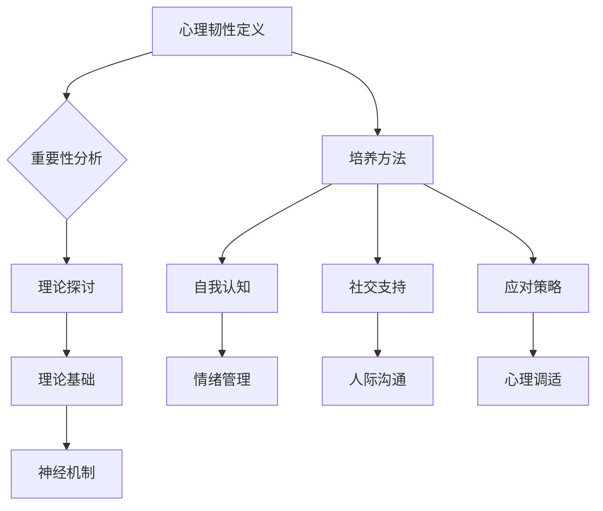

                 

### 文章标题

# 心理韧性：面对挫折的内在力量

### 关键词

* 心理韧性
* 挫折应对
* 内在力量
* 心理健康
* 职场应用

### 摘要

本文将深入探讨心理韧性的概念、重要性及其培养方法。我们将从定义出发，逐步分析心理韧性在个体面对挫折和压力时的作用，探讨其理论基础，并介绍如何在个人和职业生活中提升心理韧性。通过案例分析和实践策略，我们将展示心理韧性在逆境中的力量，以及如何将其应用于职场领域，以实现长期的心理健康和职业成功。

### 设计过程概述

在设计本文时，我们首先理解了书名《心理韧性：面对挫折的内在力量》所传达的主题，即探讨个体如何在遭遇挫折和压力时培养内在力量，以保持积极心态和有效应对挑战。基于这一主题，我们确定了以下核心章节：

1. **引言与定义**：介绍心理韧性的基本概念。
2. **理论探讨**：分析心理韧性的理论基础。
3. **培养与提升**：探讨心理韧性的培养方法。
4. **实际应用**：介绍心理韧性在职业领域的应用。
5. **案例分析**：通过案例展示心理韧性的实际效果。
6. **综合实践**：提供心理韧性的自我评估和提升策略。
7. **总结与展望**：对心理韧性的未来进行展望。

### 第一部分：引言与定义

## 第1章 心理韧性概述

### 1.1 心理韧性的定义

心理韧性（Resilience）是一种个体在面临逆境、压力和挑战时能够保持适应和有效应对的心理状态。它不仅包括从困难中恢复的能力，还涉及到个体在面对挑战时展现出的积极态度、灵活应对策略以及不断成长的能力。

### 1.2 心理韧性的重要性

心理韧性在个体生活中扮演着至关重要的角色。它能够帮助人们更好地应对生活中的压力，减少心理问题的发生，提高幸福感。在职业领域，心理韧性同样重要，它有助于员工在面对工作挑战时保持高效和积极，提升团队凝聚力和创造力。

### 1.3 心理韧性与其他心理特质的关系

心理韧性与其他心理特质如情绪稳定性、自我效能感和积极心理学等有着密切的联系。这些特质共同作用，帮助个体在逆境中保持积极和适应。

### 第二部分：理论探讨

## 第2章 心理韧性的理论基础

### 2.1 心理韧性研究的心理学流派

心理韧性研究涵盖了多个心理学流派，包括积极心理学、韧性理论和危机干预理论等。这些理论从不同角度探讨了心理韧性的本质和影响因素。

### 2.2 心理韧性的核心概念

心理韧性的核心概念包括内在力量、积极应对策略、适应性恢复和成长。这些概念共同构成了心理韧性的理论基础。

### 2.3 心理韧性与大脑神经机制

近年来，神经科学研究揭示了心理韧性与大脑神经机制之间的联系。研究表明，大脑的适应性改变和神经可塑性是心理韧性的关键因素。

### 第三部分：培养与提升

## 第3章 心理韧性的培养方法

### 3.1 自我认知与情绪管理

自我认知和情绪管理是培养心理韧性的基础。通过提高自我认知和学会情绪调节，个体能够更好地应对挑战和压力。

### 3.2 社交支持与人际沟通

社交支持和良好的沟通能力有助于增强心理韧性。与他人建立积极的人际关系和有效的沟通方式，可以帮助个体在逆境中寻求帮助和支持。

### 3.3 应对策略与心理调适

学习并实践有效的应对策略和心理调适方法是培养心理韧性的重要组成部分。这些策略包括积极思维、问题解决和放松训练等。

### 第四部分：实际应用

## 第4章 心理韧性在职业领域的应用

### 4.1 职场压力与心理韧性

职场压力是现代社会中普遍存在的问题。心理韧性可以帮助员工更好地应对职场压力，提高工作满意度和绩效。

### 4.2 心理韧性在团队管理中的应用

在团队管理中，心理韧性的培养和应用对于提高团队凝聚力和创造力具有重要意义。管理者可以通过心理韧性培训和工作坊来提升团队的心理韧性。

### 4.3 心理韧性培训与工作坊

心理韧性培训和工作坊是一种有效的提升心理韧性的方法。通过这些活动，员工可以学习和实践心理韧性相关的知识和技能。

### 第五部分：案例分析

## 第5章 心理韧性案例分析

### 5.1 成功案例解析

通过分析成功案例，我们可以看到心理韧性在个人成就和职业发展中的重要作用。

### 5.2 失败案例分析

失败案例分析有助于我们了解心理韧性不足可能导致的问题，并从中吸取教训。

### 5.3 心理韧性在逆境中的表现

逆境中的表现是衡量心理韧性的重要指标。通过案例，我们可以看到心理韧性在逆境中的具体应用。

### 第六部分：综合实践

## 第6章 心理韧性的自我评估与提升

### 6.1 自我评估工具与量表

自我评估工具和量表是衡量心理韧性水平的重要工具。通过这些工具，个体可以了解自己的心理韧性状况。

### 6.2 提升心理韧性的实践策略

提升心理韧性需要持续的实践和努力。本文将介绍一系列实践策略，帮助个体提升心理韧性。

### 6.3 韧性训练与成长记录

韧性训练和成长记录是培养心理韧性的重要环节。通过记录自己的成长过程，个体可以更好地了解自己的进步和需要改进的方面。

### 第七部分：总结与展望

## 第7章 心理韧性的未来展望

### 7.1 心理韧性研究的前沿方向

随着心理学和神经科学的不断发展，心理韧性研究也在不断推进。本文将探讨心理韧性研究的前沿方向。

### 7.2 心理韧性在心理健康教育中的应用

心理健康教育是心理韧性应用的重要领域。本文将讨论心理韧性在心理健康教育中的应用前景。

### 7.3 心理韧性的社会价值与推广

心理韧性不仅对个体有益，还具有广泛的社会价值。本文将探讨如何推广心理韧性，以提高整个社会的心理健康水平。

### 作者信息

作者：AI天才研究院/AI Genius Institute & 禅与计算机程序设计艺术 /Zen And The Art of Computer Programming

### Mermaid 流程图

### 附录

本文内容涵盖广泛，为了确保读者能够更好地理解和应用心理韧性相关的知识，本文还包含以下附录：

- **附录A：心理韧性自我评估量表**
- **附录B：心理韧性培养实践案例**
- **附录C：心理韧性在职场中的最佳实践**

### 结语

心理韧性是面对挫折和压力的内在力量，它对于个体心理健康和职业成功具有重要意义。通过本文的探讨，我们希望能够帮助读者更好地理解心理韧性的概念和培养方法，并将其应用于个人和职业生活中。希望每一位读者都能在心理韧性中找到应对挑战的力量，实现更好的自我。

