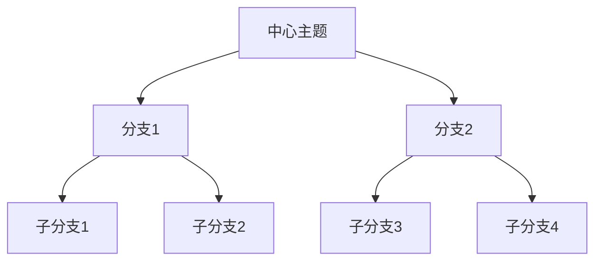

                 

### 文章标题

《思维导图创新工作坊：认知地图的绘制与应用技巧》

### 关键词

思维导图，认知地图，创新工作坊，绘制技巧，应用技巧，项目实战

### 摘要

本文旨在深入探讨思维导图及其在认知地图绘制与应用方面的独特价值。首先，我们将回顾思维导图的历史和发展，解析其核心概念和原理，并通过Mermaid流程图展示思维导图的基本结构。接着，我们将详细介绍认知地图的绘制方法，运用伪代码解释绘制过程，并结合具体的数学模型和公式进行详细讲解。随后，本文将探讨思维导图在提升学习效率和工作效率方面的应用技巧，并分享创意思维与决策的实际应用。文章还将通过项目实战和案例分析，展示思维导图在个人知识管理系统、团队协作与项目管理、企业创新与战略规划以及教育领域的具体应用。最后，我们将总结最佳实践，提出注意事项，并推荐拓展阅读资源。

## 引言

在信息爆炸的时代，人们面临的信息量不断增长，如何有效地整理、理解和利用这些信息成为一个重要的挑战。思维导图作为一种强大的思维工具，通过图像化的方式帮助人们构建清晰的知识结构，提升思维效率和创造力。认知地图则是在思维导图的基础上，进一步深化对知识的理解和应用。本文将围绕思维导图和认知地图展开，探讨它们的基本概念、绘制方法、应用技巧，并通过具体项目实战和案例分析，展示其在不同领域的实际应用。

### 思维导图的历史与发展

思维导图（Mind Map）的起源可以追溯到1971年，由英国心理学家东尼·博赞（Tony Buzan）提出。博赞观察到大脑中的神经网络结构，认为人们应该以更加自然、直观的方式思考和记忆信息。他受此启发，开发出思维导图这一工具，旨在通过视觉化的方式，帮助人们更好地理解和记忆信息。

思维导图的发展经历了几个重要阶段。首先，博赞在1970年代初期出版了《思维导图》（"The Mind Map Book"），系统地阐述了思维导图的原理和应用。随后，随着计算机技术的发展，思维导图逐渐从传统的手工绘制转向数字化工具。现代思维导图软件如XMind、MindManager等，提供了丰富的功能，使得思维导图的绘制和应用更加便捷和高效。

### 思维导图的基本原理

思维导图的基本原理基于人脑的自然思维方式。人脑是一个复杂的网络系统，不同区域负责不同的功能，如记忆、思考、创造等。思维导图通过中心主题和分支结构，模拟人脑的网络结构，帮助人们更好地组织和理解信息。

中心主题是思维导图的核心，它代表了整个思维导图的主题或目标。从中心主题出发，通过分支和子分支结构，将相关的信息逐一展开。每个分支和子分支都包含关键词或短语，这些关键词或短语代表了具体的信息点。连接线则将不同的分支和子分支连接起来，形成了一个有机的整体。

#### 思维导图的核心要素

思维导图的核心要素包括中心主题、分支、子分支和连接线。

- **中心主题**：思维导图的核心，代表了整个思维导图的主题或目标。  
- **分支**：从中心主题出发，代表主要的主题或分类。  
- **子分支**：从分支延伸出的子主题或子分类，提供了更详细的信息。  
- **连接线**：将不同的分支和子分支连接起来，形成了一个有机的整体。

#### Mermaid流程图展示

以下是一个简单的Mermaid流程图，展示了思维导图的基本结构：



在这个例子中，"中心主题"代表了整个思维导图的主题，"分支"和"子分支"则代表了具体的信息点。通过这个简单的例子，我们可以看到思维导图如何通过结构化的方式，将复杂的信息直观地呈现出来。

### 认知地图的概念与作用

认知地图（Cognitive Map）是一种用于表示大脑中对环境、知识或信息的内部表征的模型。它源于美国心理学家詹姆斯·吉布森（James J. Gibson）和爱德华·C·托尔曼（Edward C. Tolman）的研究，旨在解释动物和人类如何通过环境信息构建并利用内部表征进行导航和决策。

#### 认知地图的概念

认知地图是一种抽象的心理模型，它不是物理环境的精确复制，而是一种基于经验的、高度简化的内部表征。这种模型帮助个体在认知过程中进行空间定位、信息组织和问题解决。与物理地图不同，认知地图包含了对环境结构和关系的主观感知和理解，而不仅仅是地理特征的记录。

#### 认知地图的作用

认知地图在多个认知过程中发挥着关键作用：

1. **导航**：在物理环境中，认知地图帮助个体进行有效的路径规划和位置记忆。通过内部表征，个体能够预测下一步的动作和结果，从而更高效地移动和探索环境。

2. **问题解决**：在解决问题时，认知地图提供了一个信息框架，帮助个体组织和分析相关信息，找到最佳的解决方案。

3. **记忆**：认知地图通过将信息关联和分类，增强了记忆的效果。当信息与已有的认知地图结构相匹配时，记忆变得更加容易和牢固。

4. **学习和理解**：认知地图有助于新信息的吸收和整合，通过将新信息与已有知识结构相联系，促进深层次的学习和理解。

#### 认知地图的类型与应用场景

认知地图可以分为多种类型，每种类型适用于不同的应用场景：

1. **空间认知地图**：这种地图用于表示物理空间的结构，如城市地图或个人房间布局。它帮助个体进行空间导航和记忆。

2. **知识结构认知地图**：这类地图用于表示知识领域的结构，如图表、流程图或概念图。它有助于学习和理解复杂的概念和理论。

3. **情境认知地图**：这种地图用于表示特定情境中的信息和关系，如决策树或决策框架。它有助于在特定情境下进行有效的决策。

4. **个人知识管理系统**：认知地图可以整合个人知识和经验，形成一个个人知识管理系统。这种系统帮助个体有效地组织和检索信息，提高工作效率。

### 认知地图的绘制步骤

要绘制一个有效的认知地图，需要遵循一系列步骤。以下是认知地图绘制的基本流程：

#### 1. 收集信息

首先，收集与主题相关的信息。这些信息可以来自于阅读材料、个人经验或观察。确保收集的信息全面且具有代表性。

#### 2. 组织信息

在收集到足够的信息后，对其进行分类和组织。可以使用思维导图或其他可视化工具，将信息按类别或关系进行结构化。这一步有助于形成初步的认知地图框架。

#### 3. 绘制初步草图

基于组织好的信息，开始绘制认知地图的初步草图。草图可以采用手绘或数字工具制作。草图应包含中心主题、主要分支和子分支，以及它们之间的连接关系。

#### 4. 修订与优化

完成初步草图后，对其进行审查和修订。检查信息是否完整、逻辑是否清晰，以及视觉呈现是否吸引人。根据反馈进行优化，确保认知地图的结构和内容都是准确和有效的。

### 实例讲解

以下是一个具体的认知地图绘制实例：

#### 主题：个人健康

1. **收集信息**：

   - 饮食习惯
   - 运动频率
   - 睡眠质量
   - 心理状态

2. **组织信息**：

   - 饮食习惯：健康饮食、饮食习惯不良
   - 运动频率：每周锻炼次数、锻炼强度
   - 睡眠质量：睡眠时长、睡眠质量
   - 心理状态：情绪管理、压力应对

3. **绘制初步草图**：

   ```mermaid
   graph TD
   A[个人健康] --> B[饮食习惯]
   A --> C[运动频率]
   A --> D[睡眠质量]
   A --> E[心理状态]
   B --> F[健康饮食]
   B --> G[饮食习惯不良]
   C --> H[每周锻炼次数]
   C --> I[锻炼强度]
   D --> J[睡眠时长]
   D --> K[睡眠质量]
   E --> L[情绪管理]
   E --> M[压力应对]
   ```

4. **修订与优化**：

   根据初步草图，审查信息分类的合理性和连接关系的逻辑性。如果需要，对草图进行修订，确保每个分支和子分支都清晰明了。

通过上述步骤，我们成功地绘制了一个关于个人健康的认知地图。这个地图不仅帮助我们更清晰地理解个人健康的各个方面，还可以作为参考，指导我们改善和维持健康生活方式。

### 思维导图的应用技巧

思维导图作为一种强大的工具，在提升学习效率和工作效率方面有着广泛的应用。以下是几种常用的应用技巧。

#### 提升学习效率的技巧

1. **学习内容梳理**：

   在学习新知识时，使用思维导图可以帮助整理和梳理学习内容。首先，确定学习主题，然后从中心主题出发，逐层扩展，将相关知识点分解成分支和子分支。这样，学习内容就变得结构化，易于理解和记忆。

   实例：

   ```mermaid
   graph TD
   A[人工智能] --> B[机器学习]
   A --> C[深度学习]
   A --> D[自然语言处理]
   B --> E[监督学习]
   B --> F[无监督学习]
   C --> G[卷积神经网络]
   C --> H[循环神经网络]
   D --> I[语言模型]
   D --> J[对话系统]
   ```

2. **复习策略**：

   定期使用思维导图进行复习，可以帮助巩固记忆。将复习的内容再次绘制成思维导图，检查分支和子分支的完整性。如果发现某些分支或子分支有缺失或模糊，可以针对性地进行补充和加强。

3. **知识点关联**：

   在学习过程中，通过思维导图将不同的知识点进行关联，形成网络结构。这种方法不仅有助于记忆，还可以促进知识的迁移和应用。例如，将不同学科的知识点进行交叉连接，发现它们之间的联系。

   实例：

   ```mermaid
   graph TD
   A[数学] --> B[几何]
   A --> C[代数]
   B --> D[三角形]
   B --> E[圆]
   C --> F[一元二次方程]
   C --> G[多项式]
   D --> H[正三角形的性质]
   E --> I[圆的面积公式]
   F --> J[求解一元二次方程的步骤]
   G --> K[多项式展开]
   ```

#### 提升工作效率的技巧

1. **工作任务分解**：

   在处理工作任务时，使用思维导图可以帮助分解任务，明确每个子任务的步骤和依赖关系。从中心任务出发，逐层扩展，将任务分解成具体的子任务和行动项。

   实例：

   ```mermaid
   graph TD
   A[项目规划] --> B[需求分析]
   A --> C[设计方案]
   A --> D[开发实现]
   A --> E[测试与验收]
   B --> F[用户访谈]
   B --> G[需求文档]
   C --> H[UI设计]
   C --> I[功能设计]
   D --> J[编码实现]
   E --> K[功能测试]
   E --> L[性能测试]
   ```

2. **项目管理**：

   思维导图在项目管理中也有广泛应用。通过思维导图，可以清晰地展示项目进度、任务分配和资源调度。项目经理可以实时监控项目的进展，及时调整计划和资源。

   实例：

   ```mermaid
   graph TD
   A[项目进度] --> B[需求分析]
   B --> C[设计阶段]
   C --> D[开发阶段]
   D --> E[测试阶段]
   E --> F[验收阶段]
   B --> G[任务分配]
   G --> H[资源调度]
   ```

3. **问题解决**：

   当遇到问题时，使用思维导图可以帮助理清问题的本质和影响因素。通过分解问题，识别关键因素，制定解决方案。

   实例：

   ```mermaid
   graph TD
   A[系统崩溃] --> B[硬件故障]
   A --> C[软件错误]
   B --> D[电源问题]
   B --> E[硬件老化]
   C --> F[代码缺陷]
   C --> G[配置问题]
   ```

#### 创意思维与决策的应用

1. **创新思维方法**：

   思维导图在创意思维中有着独特的优势。通过自由发散思维，将不同的想法和观点绘制成思维导图，可以促进创新和创造力。

   实例：

   ```mermaid
   graph TD
   A[创意主题] --> B[解决方案1]
   A --> C[解决方案2]
   A --> D[解决方案3]
   B --> E[优势分析]
   B --> F[挑战分析]
   C --> G[优势分析]
   C --> H[挑战分析]
   D --> I[优势分析]
   D --> J[挑战分析]
   ```

2. **决策分析**：

   在决策过程中，思维导图可以帮助评估不同选项的优缺点，制定最优策略。通过思维导图，可以清晰地列出决策因素和对应的权重，从而做出更为明智的决策。

   实例：

   ```mermaid
   graph TD
   A[决策分析] --> B[选项1]
   A --> C[选项2]
   A --> D[选项3]
   B --> E[优点]
   B --> F[缺点]
   C --> G[优点]
   C --> H[缺点]
   D --> I[优点]
   D --> J[缺点]
   ```

通过以上技巧，思维导图不仅可以帮助提升学习效率和工作效率，还可以激发创意思维，辅助决策。在实际应用中，可以根据具体场景灵活运用这些技巧，最大化地发挥思维导图的优势。

### 项目实战与案例分析

在思维导图的实际应用中，不同领域都展示了其强大的作用。以下将通过两个实战项目和两个案例分析，展示思维导图在个人知识管理系统、团队协作与项目管理以及企业创新与战略规划中的具体应用。

#### 实战项目一：个人知识管理系统

**项目背景**：

在信息化时代，个人需要掌握和处理大量的知识。建立一个有效的个人知识管理系统（PKMS），有助于更好地管理和利用这些知识，提高工作效率。

**项目目标**：

- 整理个人知识体系，确保知识结构清晰
- 提高知识检索效率，快速找到所需信息
- 促进知识的整合与迁移，提升创新能力

**实施过程**：

1. **知识梳理**：

   首先，收集个人已掌握的知识点，包括学习笔记、项目文档、阅读材料等。使用思维导图工具，将收集到的知识进行分类和结构化整理。中心主题为“个人知识体系”，主要分支包括“技术知识”、“管理知识”、“生活技能”等。

   ```mermaid
   graph TD
   A[个人知识体系] --> B[技术知识]
   A --> C[管理知识]
   A --> D[生活技能]
   B --> E[编程语言]
   B --> F[数据结构]
   C --> G[项目管理]
   C --> H[团队协作]
   D --> I[健康养生]
   D --> J[旅行攻略]
   ```

2. **知识整合**：

   将不同领域和知识点进行整合，形成更加系统化的知识结构。例如，将编程语言的知识点与数据结构的知识点进行关联，形成编程实践的知识体系。

   ```mermaid
   graph TD
   A[个人知识体系] --> B[编程实践]
   B --> C[编程语言]
   B --> D[数据结构]
   C --> E[Python]
   C --> F[Java]
   D --> G[数组]
   D --> H[链表]
   ```

3. **知识应用**：

   通过思维导图，定期回顾和更新知识体系。在遇到新问题时，迅速检索相关知识点，结合实际情境进行应用。例如，在项目中需要使用Python进行数据分析，可以快速找到相关的知识点，确保项目顺利进行。

**项目小结**：

通过建立个人知识管理系统，不仅提高了知识整理和检索的效率，还促进了知识的整合和应用。思维导图作为一种有效的工具，在其中发挥了关键作用。

#### 实战项目二：团队协作与项目管理

**项目背景**：

在现代企业中，团队协作和项目管理是确保项目成功的关键。使用思维导图可以提升团队协作效率，优化项目管理流程。

**项目目标**：

- 提高团队协作效率，确保项目按时按质完成
- 明确项目任务分配，优化资源调度
- 提升项目沟通和反馈机制

**实施过程**：

1. **项目计划**：

   在项目启动阶段，使用思维导图制定项目计划。从项目目标出发，分解为关键里程碑和子任务。每个子任务再细分为具体的工作项，明确责任人和完成时间。

   ```mermaid
   graph TD
   A[项目计划] --> B[需求分析]
   B --> C[设计阶段]
   C --> D[开发阶段]
   D --> E[测试阶段]
   E --> F[验收阶段]
   B --> G[任务分配]
   G --> H[用户访谈]
   G --> I[需求文档]
   ```

2. **任务跟踪**：

   使用思维导图实时跟踪项目进展，监控关键里程碑和子任务的完成情况。根据项目进度，及时调整计划和资源。

   ```mermaid
   graph TD
   A[项目进度] --> B[需求分析]
   B --> C[进行中]
   C --> D[完成]
   D --> E[验收]
   E --> F[完成]
   ```

3. **团队沟通**：

   定期召开团队会议，使用思维导图展示项目进展和问题。团队成员可以针对项目中的问题和挑战，提出建议和解决方案，提高团队协作效率。

   ```mermaid
   graph TD
   A[团队会议] --> B[项目进展]
   B --> C[需求分析]
   C --> D[进行中]
   C --> E[设计阶段]
   E --> F[进行中]
   ```

**项目小结**：

通过思维导图，团队协作和项目管理变得更加透明和高效。思维导图不仅帮助明确了项目任务和进度，还促进了团队成员之间的沟通和协作。

#### 案例分析一：企业创新与战略规划

**案例背景**：

企业创新和战略规划是企业发展的关键。通过思维导图，可以系统地分析市场趋势、竞争态势和内部资源，制定有效的创新战略。

**案例分析**：

1. **市场趋势分析**：

   使用思维导图分析市场趋势，从宏观和微观两个层面理解市场环境。包括行业趋势、消费者需求变化、技术进步等。

   ```mermaid
   graph TD
   A[市场趋势] --> B[行业趋势]
   B --> C[技术进步]
   B --> D[消费者需求]
   A --> E[竞争态势]
   E --> F[竞争对手分析]
   E --> G[市场占有率]
   ```

2. **内部资源分析**：

   分析企业内部资源，包括人力资源、技术能力、资金状况等。通过思维导图，将资源进行分类和整合，找到企业的核心竞争力。

   ```mermaid
   graph TD
   A[内部资源] --> B[人力资源]
   A --> C[技术能力]
   A --> D[资金状况]
   B --> E[研发团队]
   B --> F[市场团队]
   C --> G[技术优势]
   C --> H[专利数量]
   ```

3. **创新战略制定**：

   结合市场趋势和内部资源，制定创新战略。通过思维导图，明确创新方向、目标和具体实施步骤。

   ```mermaid
   graph TD
   A[创新战略] --> B[创新方向]
   A --> C[目标设定]
   A --> D[实施步骤]
   B --> E[产品创新]
   B --> F[服务创新]
   C --> G[市场开拓]
   C --> H[技术研发]
   ```

**案例启示**：

通过思维导图，企业可以更加系统地分析市场和企业资源，制定出符合实际的创新战略。思维导图不仅帮助明确了创新方向和目标，还促进了战略实施过程的透明和高效。

#### 案例分析二：教育领域应用与教学设计

**案例背景**：

在教育领域，思维导图被广泛应用于教学设计和学生管理中。通过思维导图，教师可以更好地组织教学内容，提高教学效果。

**案例分析**：

1. **教学设计**：

   教师可以使用思维导图进行教学设计，从课程目标、教学内容、教学方法等多个方面进行系统规划。

   ```mermaid
   graph TD
   A[教学设计] --> B[课程目标]
   A --> C[教学内容]
   A --> D[教学方法]
   B --> E[知识点1]
   B --> F[知识点2]
   B --> G[知识点3]
   C --> H[教学模块1]
   C --> I[教学模块2]
   C --> J[教学模块3]
   D --> K[讲授法]
   D --> L[讨论法]
   D --> M[实验法]
   ```

2. **学生管理**：

   教师可以使用思维导图记录学生的学习进度和表现，及时进行反馈和指导。

   ```mermaid
   graph TD
   A[学生管理] --> B[学习进度]
   A --> C[学习表现]
   A --> D[反馈与指导]
   B --> E[知识点掌握情况]
   B --> F[作业完成情况]
   C --> G[课堂参与度]
   C --> H[考试成绩]
   D --> I[个性化指导]
   D --> J[课程调整]
   ```

**案例启示**：

通过思维导图，教师可以更加系统地组织和优化教学设计，提高教学效果。同时，思维导图在学生管理中的应用，有助于教师更好地了解学生情况，提供个性化的指导和帮助。

### 附录

#### 附录A：思维导图工具推荐

1. **XMind**：
   - 特点：界面简洁，功能丰富，支持多种格式导出。
   - 下载链接：[XMind官网](https://www.xmind.cn/)

2. **MindManager**：
   - 特点：专业性强，适用于企业级用户，支持多种协作功能。
   - 下载链接：[MindManager官网](https://www.mindmanager.com/)

3. **MindMeister**：
   - 特点：在线协作，实时更新，适合团队协作使用。
   - 下载链接：[MindMeister官网](https://www.mindmeister.com/)

#### 附录B：思维导图常见问题解答

1. **如何快速绘制思维导图**？

   - 使用模板：大多数思维导图工具都提供多种模板，可以根据需要快速选择。
   - 优化工具栏：将常用功能添加到工具栏，提高绘图效率。
   - 规划结构：在开始绘制之前，先规划好思维导图的结构，有助于快速展开。

2. **如何保存和分享思维导图**？

   - 保存格式：大多数工具支持多种格式导出，如PDF、PNG、Xmind等。
   - 云存储：将思维导图保存到云存储服务，方便随时查看和更新。
   - 分享链接：通过生成分享链接，可以方便地与他人共享思维导图。

### 结语

思维导图作为一种强大的思维工具，不仅在个人知识管理、团队协作和企业创新中发挥了重要作用，还在教育领域展现了其独特的应用价值。通过本文的介绍，相信读者对思维导图及其应用有了更深入的了解。希望读者能够结合实际需求，灵活运用思维导图，提升工作效率，激发创新思维。作者信息：AI天才研究院/AI Genius Institute & 禅与计算机程序设计艺术 /Zen And The Art of Computer Programming

---

### 最佳实践 Tips、小结、注意事项、拓展阅读

#### 最佳实践 Tips

1. **快速绘制技巧**：在绘制思维导图时，可以先在草稿纸上进行初步构思，确定整体结构后再进行详细绘制。

2. **颜色与字体使用**：合理使用颜色和字体可以增加思维导图的视觉吸引力，但不要过度，以免造成混乱。

3. **定期更新**：思维导图应定期更新，以反映最新的知识和项目进展。

#### 小结

思维导图作为一种强大的思维工具，通过结构化的方式帮助人们整理、理解和应用信息。它不仅适用于个人知识管理，还在团队协作、企业创新和教育领域展示了广泛的应用价值。

#### 注意事项

1. **避免过度复杂**：思维导图应保持简洁明了，避免过多细节导致混乱。

2. **合理分配时间**：在绘制思维导图时，要合理分配时间，避免拖延。

3. **团队合作**：思维导图可以用于团队合作，但要确保团队成员之间的沟通和协作。

#### 拓展阅读

1. **东尼·博赞《思维导图》**：详细介绍了思维导图的原理和应用。

2. **《认知地图：思维导图的科学基础与应用》**：探讨了认知地图的科学原理和实际应用。

3. **《思维导图实战：从入门到精通》**：提供了丰富的实战案例，帮助读者掌握思维导图的使用技巧。

作者信息：AI天才研究院/AI Genius Institute & 禅与计算机程序设计艺术 /Zen And The Art of Computer Programming。希望本文对您在思维导图和认知地图的应用上有所启发和帮助。

