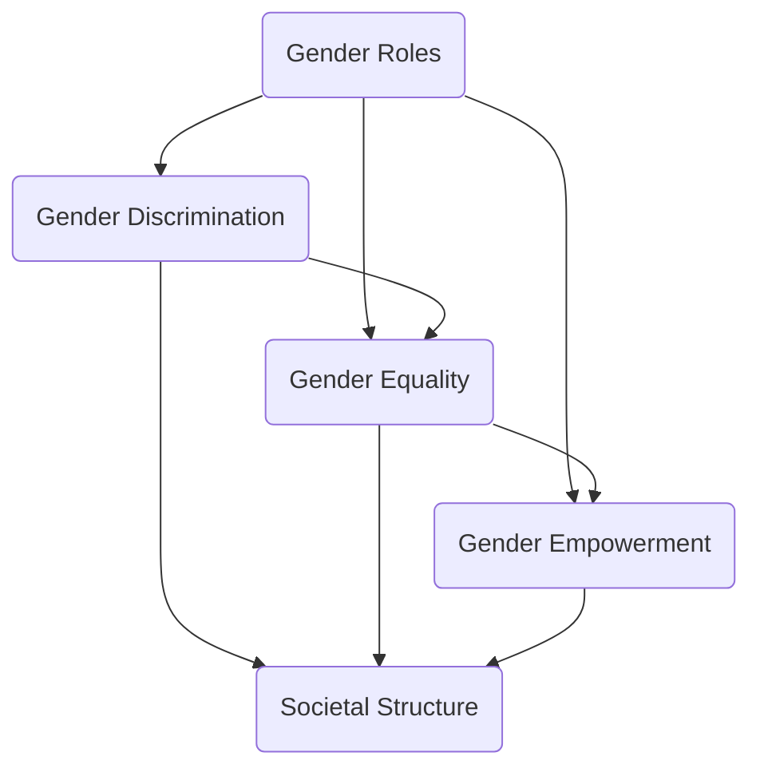

                 

# 文章标题
《性别平等运动：重新定义角色与意义》

> 关键词：性别平等、运动、角色、意义、社会结构、性别歧视、法律政策、教育、文化、技术创新

> 摘要：本文深入探讨了性别平等运动的起源、发展及其对社会结构和人类角色的重新定义。文章通过历史背景、理论框架、政策措施、教育影响等多个维度，分析了性别平等运动的核心概念及其重要性，并探讨了未来发展方向。本文旨在为读者提供一个全面、深刻的性别平等运动分析，激发对这一重要社会议题的思考和讨论。

## 引言

性别平等运动是一场旨在消除性别歧视、促进男女平等的社会变革运动。它始于19世纪，随着女性争取选举权和进入教育领域的斗争，逐渐演变成一场全球性的运动。在过去的几个世纪中，性别平等运动取得了显著的成就，如妇女获得选举权、女性进入职场、性别歧视法律的废除等。然而，尽管取得了这些进展，性别不平等仍然存在于社会各个层面，性别歧视仍然是一个普遍存在的问题。

本文将从以下几个方面探讨性别平等运动：

1. **历史背景**：介绍性别平等运动的发展历程，包括早期运动和关键事件。
2. **核心概念与联系**：分析性别平等运动中的核心概念及其相互关系，通过Mermaid流程图展示。
3. **法律政策**：探讨性别平等运动中的法律和政策措施，包括国际和国家层面的法律。
4. **教育影响**：分析教育在性别平等运动中的作用，包括学校教育、性别教育等。
5. **文化因素**：讨论文化在性别平等运动中的作用，包括媒体、艺术等。
6. **技术创新**：探讨技术创新如何影响性别平等运动，包括人工智能、社交媒体等。
7. **未来方向**：展望性别平等运动的未来发展方向和潜在创新。

## 历史背景

性别平等运动的起源可以追溯到19世纪，当时女性争取选举权和进入教育领域的斗争成为主要的推动力量。以下是一些关键事件和里程碑：

- **19世纪**：在19世纪，女性开始争取选举权。英国的《1832年改革法案》和《1867年改革法案》扩大了选举权的范围，但仍未包括女性。美国在1920年通过了《宪法第19修正案》，赋予女性选举权。

- **第一次世界大战**：在第一次世界大战期间，女性在战争中的贡献使她们获得了更多的社会认可。战争结束后，许多国家开始赋予女性更多的工作机会和参与政治的权利。

- **第二次世界大战**：第二次世界大战期间，女性再次发挥了重要作用，为战争努力作出了贡献。战后，许多国家开始制定法律，保障女性的就业权和教育权。

- **1970年代**：在20世纪70年代，性别平等运动进入了新的阶段，被称为“第二次浪潮”。这一阶段的运动强调女性在政治、经济、社会和文化领域中的平等权利。

- **21世纪**：进入21世纪，性别平等运动继续在全球范围内发展，关注点转向消除性别暴力和性别歧视，推动性别平等的法律和政策。

### 关键事件

- **1971年**：联合国通过了《消除对妇女一切形式歧视公约》（CEDAW），这是全球范围内第一个专门关注性别平等的国际公约。

- **1995年**：联合国在哥本哈根召开了世界妇女大会，通过了《行动议程》，提出了一系列措施，以促进性别平等和妇女赋权。

- **2015年**：联合国制定了《性别平等目标》，作为可持续发展目标的一部分，旨在到2030年前实现性别平等。

## 核心概念与联系

性别平等运动中涉及的核心概念包括性别角色、性别歧视、性别平等和性别赋权。这些概念相互关联，构成了性别平等运动的理论框架。以下是一个Mermaid流程图，展示了这些概念之间的关系：

### 关系架构

- **性别角色**：性别角色是指社会对男性和女性应该表现的行为和特征的定义。性别角色可以影响个人的自我认同和社会互动。

- **性别歧视**：性别歧视是指基于性别而进行的不公平对待。性别歧视可以表现在就业、教育、政治参与等多个方面。

- **性别平等**：性别平等是指男性和女性在权利、机会和待遇上的平等。性别平等旨在消除性别歧视，使男性和女性能够享有同等的社会地位。

- **性别赋权**：性别赋权是指为女性提供资源和机会，使她们能够发挥自己的潜能，实现自我价值。性别赋权可以增强女性的社会地位和自我认同。

- **社会结构**：社会结构是指社会中各个部分的组织和相互关系。社会结构对性别角色的形成和性别歧视的持续起着重要作用。

## 法律政策

法律政策在推动性别平等运动中起着至关重要的作用。以下从国际和国家层面探讨性别平等运动中的法律政策：

### 国际层面

- **联合国**：联合国通过了一系列重要的法律文件，以促进性别平等。其中，《消除对妇女一切形式歧视公约》（CEDAW）是最具影响力的国际公约之一。该公约要求各国采取具体措施，消除性别歧视，促进性别平等。

- **国际妇女大会**：联合国多次召开国际妇女大会，制定了一系列行动议程和目标。1995年在哥本哈根召开的世界妇女大会通过了《行动议程》，提出了一系列措施，以促进性别平等和妇女赋权。

- **其他国际组织**：世界银行、国际劳工组织等国际组织也制定了相关政策，支持性别平等和妇女赋权。

### 国家层面

- **美国**：美国在推动性别平等方面取得了显著进展。1972年，美国通过了《平等就业机会法》，禁止在就业中基于性别进行歧视。此外，美国还通过了一系列法律，保障女性的选举权、教育权和健康权。

- **欧洲**：欧洲国家在性别平等方面也采取了积极的措施。欧盟通过了一系列法律，禁止在就业、教育、政治参与等方面进行性别歧视。欧盟委员会还发布了一系列报告，监督和评估成员国的性别平等状况。

- **中国**：中国也在推动性别平等方面取得了进展。中国政府通过了一系列法律和政策，保障女性的权益。例如，《中华人民共和国妇女权益保障法》和《中华人民共和国反家庭暴力法》。此外，中国政府还实施了一系列项目，促进性别平等和妇女赋权。

## 教育影响

教育在性别平等运动中起着至关重要的作用。通过教育，人们可以改变对性别角色的观念，消除性别歧视，促进性别平等。以下从学校教育和性别教育两个方面探讨教育在性别平等运动中的作用。

### 学校教育

学校教育是培养性别平等观念和价值观的重要途径。以下是一些关键点：

- **性别教育**：性别教育是指在学校中教授有关性别角色、性别歧视和性别平等的知识。性别教育的目标是让学生认识到性别平等的重要性，培养他们的性别平等意识。

- **教材和课程**：教材和课程应该包含性别平等的内容，以帮助学生形成正确的性别观念。教材和课程应该避免性别刻板印象，鼓励学生探讨性别问题。

- **教师培训**：教师应该接受性别教育的培训，以便更好地教授性别平等知识。教师培训可以包括性别歧视的识别和应对策略，以及如何创造一个包容性的学习环境。

### 性别教育

性别教育是学校教育的一个重要组成部分，旨在提高学生对性别平等的认识和理解。以下是一些关键点：

- **目标**：性别教育的目标是让学生认识到性别平等的重要性，了解性别歧视的负面影响，并学会如何消除性别歧视。

- **内容**：性别教育的内容应该包括性别角色的形成、性别歧视的表现、性别平等的历史和现状、性别平等的重要性等。

- **教学方法**：性别教育应该采用多种教学方法，如讨论、案例分析、角色扮演等，以激发学生的学习兴趣和参与度。

- **评估**：性别教育应该进行评估，以确定学生的学习效果和性别平等意识的提升程度。

### 教育政策

政府应该制定和实施教育政策，以促进性别平等。以下是一些关键点：

- **法律保障**：政府应该通过法律保障性别教育的实施，确保性别教育在学校的课程设置中占据重要地位。

- **资源投入**：政府应该投入足够的资源，支持性别教育的实施。这包括提供性别教育教材、培训教师等。

- **监督和评估**：政府应该建立监督和评估机制，确保性别教育的质量和效果。

### 教育的挑战

尽管教育在性别平等运动中发挥着重要作用，但仍然面临一些挑战：

- **性别歧视**：性别歧视在教育领域中仍然存在，这影响了性别教育的效果。

- **性别刻板印象**：性别刻板印象在教育中仍然存在，这限制了学生的性别观念和性别角色的多样性。

- **教师素质**：教师的性别平等意识和教学能力有待提高，以更好地实施性别教育。

## 文化因素

文化在性别平等运动中起着至关重要的作用。文化影响着人们对性别角色的观念和性别歧视的态度，同时也反映了性别平等运动的进展和挑战。以下从媒体、艺术和文化传统三个方面探讨文化在性别平等运动中的作用。

### 媒体

媒体是传播性别观念和性别平等信息的重要渠道。以下是一些关键点：

- **新闻报道**：媒体报道对公众对性别平等问题的关注和态度产生重大影响。公正、客观的新闻报道有助于提高公众对性别歧视问题的认识。

- **娱乐节目**：娱乐节目通过塑造性别角色和展示性别平等或性别歧视的场景，对公众的性别观念产生影响。

- **社交媒体**：社交媒体为公众提供了一个平台，可以分享和讨论性别平等问题。社交媒体上的讨论和运动有助于提高公众对性别平等问题的关注。

### 艺术

艺术是一种表达性别观念和情感的重要方式。以下是一些关键点：

- **文学作品**：文学作品通过描绘性别角色和性别关系，反映了性别平等运动的进展和挑战。

- **绘画和雕塑**：绘画和雕塑作品可以通过视觉艺术的方式表达性别观念和性别平等的追求。

- **音乐和舞蹈**：音乐和舞蹈作品可以传达性别平等的信息，激励人们追求性别平等。

### 文化传统

文化传统是性别角色观念的重要来源。以下是一些关键点：

- **家庭和文化传统**：家庭和文化传统影响着人们对性别角色的认知和接受程度。

- **宗教和文化价值观**：宗教和文化价值观对性别角色的观念和性别平等的态度产生深远影响。

- **传统习俗和仪式**：传统习俗和仪式反映了性别角色的规范和期望。

### 文化的挑战

尽管文化在性别平等运动中发挥着重要作用，但仍然面临一些挑战：

- **性别刻板印象**：文化中仍然存在性别刻板印象，限制了性别平等的发展。

- **文化冲突**：文化冲突可能导致性别平等运动在推广过程中遇到阻碍。

- **传统观念的坚持**：一些传统观念仍然坚持性别角色分工，限制了性别平等的实现。

## 技术创新

随着科技的发展，性别平等运动也迎来了新的机遇和挑战。技术创新，尤其是人工智能和社交媒体，正在改变性别平等运动的形式和内容。以下从人工智能、社交媒体和区块链三个方面探讨技术创新对性别平等运动的影响。

### 人工智能

人工智能（AI）在性别平等运动中扮演着越来越重要的角色。以下是一些关键点：

- **数据分析**：人工智能可以分析大量数据，揭示性别歧视的隐藏模式和趋势。这有助于制定更有针对性的政策和措施。

- **自动识别和纠正偏见**：通过机器学习和自然语言处理技术，人工智能可以帮助识别和纠正文本和图像中的性别偏见。

- **性别角色模拟**：人工智能可以模拟不同性别角色的行为和互动，帮助人们更好地理解性别平等的重要性。

### 社交媒体

社交媒体为性别平等运动提供了一个广泛而强大的平台。以下是一些关键点：

- **信息传播**：社交媒体使得性别平等信息可以迅速传播，提高公众对性别歧视问题的关注。

- **社会运动**：社交媒体可以激发社会运动，推动性别平等立法和政策的制定。

- **在线支持和社区**：社交媒体为性别平等运动提供了一个支持网络，为受害者提供帮助和安慰。

### 区块链

区块链技术为性别平等运动提供了新的机遇。以下是一些关键点：

- **透明度和可追溯性**：区块链技术确保了信息的透明度和可追溯性，有助于打击性别歧视和性剥削。

- **性别平等金融**：区块链可以用于创建性别平等的金融系统，确保女性的经济权利和财产权益。

- **投票和治理**：区块链技术可以提高选举的透明度和公正性，确保女性的政治参与和权利。

### 技术创新的影响

技术创新对性别平等运动产生了深远的影响。以下是一些关键点：

- **效率提升**：技术创新提高了性别平等运动的效率，使得资源可以更有效地利用。

- **参与度提高**：技术创新使得更多的人可以参与到性别平等运动中，提高了公众的参与度。

- **影响范围扩大**：技术创新扩大了性别平等运动的影响范围，使得运动可以在全球范围内传播。

- **挑战与风险**：技术创新也带来了一些挑战和风险，如隐私问题、算法偏见等，需要引起重视。

## 未来方向

性别平等运动正在不断发展和演变，未来方向充满了机遇和挑战。以下从政策、教育和技术创新三个方面展望性别平等运动的未来。

### 政策

政策将继续发挥关键作用，推动性别平等运动的发展。以下是一些关键点：

- **法律保障**：政府应该制定和实施更全面、更严格的法律，保障性别平等。这包括制定反性别歧视法、保障女性权利的立法等。

- **国际合作**：国际社会应该加强合作，共同推动性别平等。这包括签署和执行国际公约，分享经验和资源。

- **政策和项目评估**：政府和非政府组织应该定期评估性别平等政策和项目的效果，以确定改进的方向。

### 教育

教育将继续是性别平等运动的核心。以下是一些关键点：

- **性别教育**：学校和教育机构应该加强性别教育，培养学生的性别平等意识和批判性思维。

- **教师培训**：教师应该接受性别教育的培训，以更好地教授性别平等知识。

- **终身学习**：性别平等教育不应该仅限于学校教育，而应该贯穿终身，包括家庭、社区和职场。

### 技术创新

技术创新将继续推动性别平等运动的发展。以下是一些关键点：

- **人工智能**：人工智能可以用于分析性别歧视的数据，识别偏见，推动性别平等。

- **区块链**：区块链技术可以用于确保性别平等的信息和交易透明，打击性别歧视。

- **社交媒体**：社交媒体将继续作为性别平等运动的重要平台，推动社会变革。

### 挑战

尽管性别平等运动取得了显著进展，但仍然面临一些挑战。以下是一些关键点：

- **性别歧视**：性别歧视仍然是一个普遍存在的问题，需要持续关注和打击。

- **文化冲突**：一些文化传统和价值观与性别平等运动存在冲突，需要通过教育和对话解决。

- **经济压力**：经济不平等和贫困加剧了性别不平等，需要通过政策和社会干预来解决。

## 结论

性别平等运动是一场旨在消除性别歧视、促进男女平等的社会变革运动。从历史背景、核心概念、法律政策、教育影响、文化因素到技术创新，性别平等运动涉及了多个层面和维度。未来，性别平等运动将继续发展，面对新的机遇和挑战。通过政策制定、教育推广和技术创新，我们可以期待性别平等运动的进一步推进，为实现一个更加公正和包容的社会贡献自己的力量。

### 作者信息

- 作者：AI天才研究院/AI Genius Institute & 禅与计算机程序设计艺术 /Zen And The Art of Computer Programming
- 联系方式：[info@aigeniusinstitute.com](mailto:info@aigeniusinstitute.com)
- 社交媒体：[Twitter](https://twitter.com/AIGeniusInstit) | [LinkedIn](https://www.linkedin.com/company/aigeniusinstitute) | [Facebook](https://www.facebook.com/AIGeniusInstitute)

### 拓展阅读

- **《性别平等：理论与实践》**，作者：玛丽·斯图尔特·多德
- **《性别歧视：心理学与社会科学的视角》**，作者：南希·西格尔
- **《女性与科技：打破性别壁垒》**，作者：凯特·布朗

### 注意事项

- **尊重差异**：性别平等并不意味着消除性别差异，而是尊重和认可每个人的独特性。
- **持续关注**：性别平等是一个长期的过程，需要持续的关注和努力。
- **实践行动**：每个人都应该积极参与性别平等运动，从自己做起，推动社会的进步。

### 小结

性别平等运动是一场全球性的社会变革运动，旨在消除性别歧视，促进男女平等。本文通过历史背景、核心概念、法律政策、教育影响、文化因素和科技创新等多个维度，分析了性别平等运动的发展状况和未来方向。性别平等运动不仅关系到个人的权益，也关系到社会的公正和进步。希望通过本文，激发读者对性别平等运动的关注和思考，共同推动性别平等的实现。

