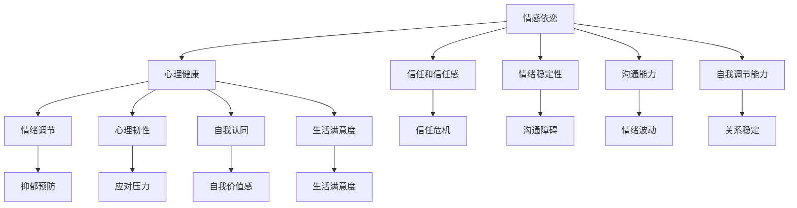

                 

### 文章标题

《情感依恋：亲密关系中的安全感与意义》

### 关键词

情感依恋、安全感、亲密关系、依恋理论、心理健康

### 摘要

本文将探讨情感依恋在亲密关系中的重要作用，特别是安全感在其中所扮演的角色。通过对情感依恋的定义、历史发展、核心概念以及与安全感的相互关系进行深入分析，本文旨在揭示情感依恋如何影响亲密关系的稳定性与个体心理健康。文章还将探讨如何建立和维持情感依恋，以及面对挑战时如何处理情感依恋问题。最终，本文将对情感依恋与心理健康的关系进行总结，并给出实践建议，以帮助读者在现实生活中构建更稳定、更有安全感的亲密关系。

## 引言

### 背景

在现代社会中，人际关系，特别是亲密关系，对个体的心理健康和生活质量有着深远的影响。随着社会的发展和生活节奏的加快，人们在追求事业成功、经济独立的同时，也越来越关注情感需求的满足。然而，情感依恋的问题也随之浮现。许多人在建立和维持亲密关系时面临挑战，尤其是在安全感方面感到缺失。这种缺失不仅影响了关系的稳定性，还对个体的心理健康产生负面影响。

### 目的

本文旨在深入探讨情感依恋的概念、历史背景、核心原理及其与安全感的密切关系。通过系统的分析和逻辑推理，本文旨在帮助读者理解情感依恋在亲密关系中的作用，以及如何通过建立和维持情感依恋来提升安全感。此外，本文还将探讨安全感缺失对亲密关系的影响，并提出相应的解决策略。

### 文章结构

本文将分为五个主要部分：

1. **情感依恋概述**：介绍情感依恋的概念、历史发展和核心理论。
2. **亲密关系中的安全感**：探讨安全感在亲密关系中的重要性及其影响因素。
3. **情感依恋的建立与维持**：详细讨论情感依恋的建立和维持方法，以及面对挑战时的应对策略。
4. **安全感与情感依恋的关系**：分析安全感与情感依恋的互动机制，以及安全感缺失对亲密关系的影响。
5. **情感依恋与心理健康**：探讨情感依恋与心理健康的关系，并给出实践建议。

通过以上结构，本文将系统地阐述情感依恋在亲密关系中的安全感和意义，为读者提供理论与实践相结合的深入理解。

### 情感依恋的概念与历史发展

#### 1.1 情感依恋的定义

情感依恋是指个体在情感上对另一个人产生强烈依赖和情感联系的心理状态。这种依恋可以是亲子关系、友谊关系，但最典型的表现是亲密关系中的伴侣依恋。情感依恋的核心在于个体对对方的信任、安全感以及彼此之间的情感互动。

#### 1.2 情感依恋的历史背景

情感依恋的概念最早可以追溯到20世纪50年代，由英国心理学家约翰·鲍尔比（John Bowlby）提出。鲍尔比通过研究婴儿与母亲之间的互动，发现了婴儿在早期依恋阶段对母亲的依赖，以及这种依恋对婴儿情感发展的重要性。他的研究奠定了依恋理论的基础。

随后的研究扩展到了成人亲密关系的领域，例如玛丽·安斯沃斯（Mary Ainsworth）的陌生情境实验，通过观察婴儿在不同情境下的行为，提出了不同类型的依恋风格，如安全型、回避型和焦虑型。

#### 1.3 情感依恋的理论基础

情感依恋的理论基础主要包括以下几种：

1. **安全基地模型（Secure Base Model）**：约翰·鲍尔比提出的模型认为，安全型依恋风格下的个体在面临压力和不确定性时，能够从亲密伴侣那里获得情感支持，形成一个安全基地，从而更好地应对外界挑战。

2. **系统理论（Systems Theory）**：这种理论强调情感依恋作为一种动态系统，个体和伴侣之间的互动和行为是相互影响的。安全型依恋风格的个体能够在互动中表现出相互信任、尊重和支持。

3. **依恋风格的连续体模型（Continuum Model of Attachment Styles）**：这种模型认为，个体的依恋风格不是固定不变的，而是一个连续体，可以从安全型向回避型或焦虑型转变。依恋风格的动态变化受到个体经历、伴侣行为和环境因素的影响。

#### 1.4 情感依恋的核心概念

1. **信任**：信任是情感依恋的核心要素之一。在亲密关系中，信任意味着个体相信伴侣会提供情感支持和保护，从而减少恐惧和不确定性。

2. **安全感**：安全感是指个体在亲密关系中感受到的情感支持与保护，能够安心地依赖伴侣，即使在面对外界压力和不确定性时也能保持内心的平静。

3. **情感互动**：情感互动是建立和维护情感依恋的重要途径。通过积极倾听、情感表达和共同活动，个体和伴侣能够增强彼此的情感联系。

#### 1.5 情感依恋的演变

随着社会的发展和心理学研究的深入，情感依恋的概念也在不断演变。现代心理学研究不仅关注个体在情感依恋中的行为模式，还探讨了文化、社会背景对依恋风格的影响，以及不同类型的亲密关系（如同性恋关系、跨文化关系）中的情感依恋特点。

#### 1.6 情感依恋与亲密关系的联系

情感依恋与亲密关系密不可分。一个安全型依恋风格的个体在亲密关系中更可能表现出开放、真诚和亲密的行为，从而促进关系的稳定和满意度。相反，回避型或焦虑型依恋风格的个体可能在亲密关系中遇到更多的障碍，如沟通不畅、信任缺失和情感冲突。

#### 1.7 情感依恋的影响因素

情感依恋的发展受到多种因素的影响，包括：

1. **早期家庭环境**：早期与主要照顾者的互动模式对个体依恋风格的形成有重要影响。

2. **个体经历**：个体在成长过程中的经历，如创伤事件、失去亲人等，也会影响依恋风格。

3. **伴侣行为**：伴侣的互动方式和行为对个体依恋风格有显著影响。

4. **文化和社会背景**：不同的文化和社会背景对情感依恋的理解和表达方式有不同影响。

通过以上对情感依恋概念的深入探讨，我们可以更好地理解情感依恋在亲密关系中的重要性，以及其在个体心理健康中的意义。接下来，我们将进一步探讨亲密关系中的安全感，分析其定义、重要性及其在亲密关系中的作用。

### 亲密关系中的安全感

#### 2.1 安全感的定义与重要性

安全感是情感依恋中的关键要素，它涉及到个体在亲密关系中感受到的情感支持和保护。根据心理学定义，安全感是指个体在面对外界压力和不确定性时，能够从亲密伴侣那里获得心理上的安抚和稳定感。这种安全感不仅仅是一种情感状态，更是一种心理需求，对个体的情感健康和亲密关系的稳定性有着深远的影响。

安全感在亲密关系中的重要性不可忽视。首先，安全感是建立和维护亲密关系的基础。一个充满安全感的亲密关系能够让个体感到被接受、被尊重和被保护，从而增强关系的信任和忠诚度。其次，安全感有助于缓解压力和焦虑，提高个体的情绪稳定性。在面临生活中的挑战和困难时，拥有安全感能够使个体更加自信和坚定，从而更好地应对外界环境的变化。

#### 2.2 安全感在亲密关系中的作用

安全感在亲密关系中扮演着多重角色，以下是其主要作用：

1. **促进信任与沟通**：安全感是建立信任的基石。在安全的环境中，个体更容易敞开心扉，与伴侣进行坦诚的沟通。这种开放和诚实的沟通有助于增进彼此的理解，减少误解和冲突。

2. **增强情感连接**：安全感能够促进个体和伴侣之间的情感连接。当个体感到安全时，他们更愿意分享自己的内心世界，表达情感和需求。这种情感的交流和连接能够加深彼此之间的亲密感，增强关系的稳定性。

3. **提高适应能力**：在面对外界压力和不确定性时，安全感能够提高个体的适应能力。安全型依恋风格的个体能够在亲密伴侣的支持下，更好地应对生活中的挑战，从而保持心理健康。

4. **预防情感隔离**：安全感能够预防情感隔离，避免个体在亲密关系中感到孤独和无助。当个体在亲密关系中感到被理解和支持时，他们更不容易产生情感隔离，从而保持良好的心理健康。

#### 2.3 安全感的影响因素

安全感的影响因素是多方面的，包括个体特征、伴侣行为、环境因素等。以下是一些主要的影响因素：

1. **个体特征**：个体的依恋风格对其安全感有重要影响。安全型依恋风格的个体通常拥有较高的安全感，而回避型或焦虑型依恋风格的个体可能在安全感方面存在缺失。

2. **伴侣行为**：伴侣的行为对安全感有显著影响。例如，伴侣的信任度、支持度以及情感表达方式都会影响个体的安全感。一个积极、理解和支持的伴侣能够增强个体的安全感。

3. **沟通质量**：沟通是建立安全感的核心。有效的沟通能够增进彼此的理解，减少误解和冲突。高质量的沟通能够帮助个体在亲密关系中感受到被尊重和被理解，从而增强安全感。

4. **环境因素**：环境因素如家庭背景、社会支持等也会影响个体的安全感。一个稳定和支持性的家庭环境以及良好的社会支持网络能够增强个体的安全感。

5. **历史经历**：个体的早期经历，如童年时期与父母的互动模式，会对安全感产生长期影响。一个在安全环境中成长的个体通常拥有较高的安全感。

#### 2.4 安全感缺失的表现

当个体在亲密关系中缺乏安全感时，可能表现出以下行为和情感反应：

1. **过度依赖**：个体可能在情感上过度依赖伴侣，害怕失去对方，从而表现出强烈的占有欲和控制欲。

2. **焦虑与不安**：缺乏安全感可能导致个体在面对外界压力时感到焦虑和不安，难以放松和信任他人。

3. **逃避与回避**：为了避免面对不安全感的痛苦，个体可能会选择逃避或回避亲密关系，避免与伴侣进行深层次的情感交流和互动。

4. **情绪波动**：缺乏安全感可能导致个体的情绪波动较大，容易陷入负面情绪，如沮丧、愤怒和焦虑。

5. **自我怀疑**：个体可能在亲密关系中对自己产生怀疑，担心自己不够好，无法得到伴侣的认可和爱。

#### 2.5 安全感缺失的原因

安全感缺失的原因复杂多样，以下是一些常见的原因：

1. **早期经历**：个体在童年时期与主要照顾者的互动模式对其依恋风格和安全感有重要影响。不安全或负面的早期经历可能导致个体在亲密关系中缺乏安全感。

2. **伴侣行为**：伴侣的行为方式，如缺乏信任、不支持或不理解，可能导致个体在亲密关系中感到不安全。

3. **个性特点**：某些个性特点，如焦虑型依恋风格，可能导致个体在亲密关系中更容易感到不安全。

4. **外界压力**：生活中的各种压力，如工作压力、经济困难等，也可能影响个体的安全感。

5. **文化因素**：不同的文化背景可能对安全感有不同理解，某些文化可能更强调独立和个人成就，而忽视亲密关系的情感支持。

通过以上对安全感的深入探讨，我们可以更好地理解安全感在亲密关系中的重要性，以及影响安全感的各种因素。在接下来的章节中，我们将进一步探讨情感依恋的建立和维持，以及面对挑战时的应对策略。

### 情感依恋的建立

#### 3.1 建立情感依恋的初步阶段

情感依恋的建立是一个复杂而渐进的过程，它始于初步阶段的互动和接触。在这一阶段，个体通过初次交往和相互了解，开始建立起初步的情感联系。具体来说，初步阶段主要包括以下几个步骤：

1. **初次接触**：初次接触是情感依恋建立的第一步。在这一阶段，个体通过外表、言行举止等非言语信号，对对方产生第一印象。这种初始印象对后续的情感依恋发展具有重要影响。

2. **建立信任**：信任是情感依恋的重要基石。在初步阶段，个体需要通过言行一致、真诚表达等行为，逐步建立起对对方的信任。信任的建立有助于减少个体在初次交往中的不确定性和恐惧感。

3. **共同兴趣和价值观**：共同兴趣和价值观是增强情感依恋的重要因素。在这一阶段，个体通过寻找共同的兴趣爱好和价值观，来增加彼此之间的互动和共鸣。这种共同点能够促进情感的加深和关系的稳定。

4. **积极互动**：积极的互动是初步阶段的核心。在这一阶段，个体需要通过积极的言谈和行为，表达对对方的关注和喜爱，从而增强彼此的情感联系。

#### 3.2 建立情感依恋的关键因素

在情感依恋的建立过程中，以下几个关键因素起着至关重要的作用：

1. **相似性**：相似性是情感依恋的重要基础。个体在价值观、兴趣、生活习惯等方面的相似性，能够增强彼此之间的吸引力和共同点。研究表明，相似性越高，情感依恋的发展越顺利。

2. **忠诚和信任**：忠诚和信任是情感依恋的核心要素。一个稳定的亲密关系离不开双方的忠诚和信任。忠诚意味着个体对关系的承诺和责任，而信任则是指个体相信伴侣会遵守承诺，提供情感支持和保护。

3. **情感表达**：情感表达是建立情感依恋的重要途径。个体需要学会通过言语、身体语言和情绪表达，向对方传达自己的感受和需求。积极的情感表达能够增强彼此之间的情感联系，促进关系的深化。

4. **相互支持**：相互支持是情感依恋的重要特征。在亲密关系中，个体需要相互提供情感支持和实际帮助，共同应对生活中的挑战和困难。这种相互支持能够增强关系的稳定性，提高个体的安全感。

#### 3.3 情感依恋的建立过程

情感依恋的建立过程可以分为以下几个阶段：

1. **吸引阶段**：在这一阶段，个体通过初次接触和互动，对对方产生吸引。这种吸引可能源于外表、性格、才华等多方面因素。

2. **熟悉阶段**：在吸引的基础上，个体通过进一步的交流和互动，逐步了解对方的性格、兴趣和价值观。这一阶段的互动有助于增强彼此之间的熟悉度和信任感。

3. **亲密阶段**：在熟悉阶段之后，个体开始进入亲密阶段。在这一阶段，双方的情感联系逐渐加深，彼此之间的互动变得更加频繁和深入。这一阶段的情感依恋建立主要依赖于相似性、忠诚和信任等因素。

4. **稳定阶段**：经过亲密阶段的深化，情感依恋逐渐进入稳定阶段。在这一阶段，双方已经建立起较为稳定的亲密关系，能够相互提供情感支持和实际帮助，共同应对生活中的各种挑战。

5. **成熟阶段**：在稳定阶段之后，情感依恋进入成熟阶段。在这一阶段，双方的情感联系更加牢固，能够应对生活中的各种变化和挑战。这一阶段的情感依恋已经达到了较高的成熟度，能够为个体提供持久的安全感和支持。

#### 3.4 情感依恋与心理健康的关系

情感依恋的建立不仅对亲密关系的稳定性有重要影响，还对个体的心理健康产生深远的影响。以下是情感依恋与心理健康关系的几个方面：

1. **安全感**：情感依恋能够为个体提供安全感，降低焦虑和压力。一个稳定的亲密关系能够使个体在面对外界压力时感到被支持和保护，从而保持良好的心理健康。

2. **自尊与自我价值感**：稳定的情感依恋有助于提升个体的自尊和自我价值感。在亲密关系中，个体能够感受到被尊重和被爱，从而增强对自己的认同和肯定。

3. **情绪调节**：情感依恋能够帮助个体更好地调节情绪，降低负面情绪的影响。在情感支持的基础上，个体能够更好地应对生活中的挫折和困难，保持积极的心态。

4. **心理韧性**：情感依恋有助于提升个体的心理韧性，增强应对压力和挫折的能力。在情感依恋的支持下，个体能够更加自信地面对生活中的各种挑战。

#### 3.5 建立情感依恋的策略

为了有效建立情感依恋，个体可以采取以下策略：

1. **积极沟通**：通过积极的沟通，个体能够更好地了解对方的想法和感受，从而增强情感联系。主动倾听、表达情感和提出建议都是有效的沟通策略。

2. **共同活动**：共同参与活动有助于增进彼此之间的情感联系。通过共同活动，个体能够分享快乐和挑战，加深彼此之间的亲密感。

3. **表达关爱**：通过言语和行为表达对对方的关爱，个体能够增强对方的情感依恋。例如，赞美对方、给予支持和关心都是有效的表达方式。

4. **建立信任**：信任是情感依恋的重要基石。通过诚实、可靠和承诺，个体能够逐步建立起对对方的信任，从而增强情感依恋。

5. **尊重差异**：尊重彼此的差异和个性，有助于建立和谐的亲密关系。理解对方的观点和需求，能够促进双方的情感联系。

通过以上策略，个体能够更好地建立和维护情感依恋，提升亲密关系的稳定性与个体心理健康。在接下来的章节中，我们将探讨如何维持情感依恋，以及面对挑战时如何处理情感依恋问题。

### 情感依恋的维持

#### 4.1 维持情感依恋的方法

在亲密关系中，维持情感依恋是确保关系稳定性和幸福感的核心。以下是一些有效的方法，帮助个体和伴侣在长时间的关系中保持情感依恋：

1. **有效沟通**：沟通是维持情感依恋的关键。有效的沟通不仅包括表达自己的想法和感受，还需要倾听伴侣的观点和需求。以下是一些沟通技巧：

   - **主动倾听**：在对方讲话时，给予充分的关注，不要打断，确保对方感受到被理解。
   - **情感共鸣**：尝试从对方的角度理解其情感，表达同情和共鸣。
   - **清晰表达**：在表达自己的观点时，尽量清晰、具体，避免模糊和含糊的表述。

2. **共同活动**：共同参与活动是增强情感连接的重要途径。这些活动可以是共同的兴趣、爱好，也可以是简单的日常事务。以下是一些建议：

   - **共享爱好**：参与双方都喜欢的活动，如旅行、运动、艺术等，可以增进共同的兴趣和情感。
   - **日常互动**：通过日常的小事，如一起做饭、散步、看电影等，培养亲密感和默契。
   - **共同目标**：设定共同的目标和计划，如家庭旅行、职业发展等，可以增强双方的共同感和责任感。

3. **情感表达**：情感表达是维持情感依恋的基础。以下是一些情感表达的方法：

   - **积极肯定**：通过赞美、鼓励和肯定来表达对伴侣的欣赏和爱意。
   - **情绪分享**：在适当的时候分享自己的情绪和感受，让对方了解自己的内心世界。
   - **表达感激**：定期表达对伴侣的感激之情，让伴侣感受到自己的付出被重视。

4. **信任与支持**：信任和支持是情感依恋的支柱。以下是一些维护信任和支持的方法：

   - **诚实与透明**：在关系中保持诚实和透明，避免隐瞒和欺骗。
   - **相互信任**：信任是建立和维护情感依恋的基础。在对方需要时，给予信任和支持。
   - **共情与理解**：在伴侣遇到困难时，提供情感支持，共情和理解对方的处境。

5. **独立性**：在维持情感依恋的同时，保持独立性也是重要的。以下是一些独立性建议：

   - **个人空间**：给予彼此一定的个人空间，尊重对方的兴趣爱好和社交圈。
   - **个人成长**：鼓励对方追求个人目标和兴趣，支持对方的个人成长。
   - **自我关怀**：保持自我关怀，关注自己的情感需求，避免过度依赖伴侣。

#### 4.2 面对挑战：处理情感依恋的问题

在亲密关系中，难免会遇到各种挑战和问题，这些问题可能会对情感依恋产生负面影响。以下是一些常见的问题和应对策略：

1. **沟通障碍**：沟通障碍是亲密关系中最常见的问题。以下是一些应对策略：

   - **积极解决**：面对沟通问题，积极寻找解决方案，而不是回避或逃避。
   - **倾听与理解**：在沟通中，注重倾听对方的意见，尝试理解对方的立场和感受。
   - **寻求第三方帮助**：如果问题难以自行解决，可以寻求专业咨询师或心理医生的帮助。

2. **信任危机**：信任危机可能导致情感依恋的破裂。以下是一些应对策略：

   - **诚实面对**：在信任危机中，诚实面对问题，不逃避责任和错误。
   - **重建信任**：通过积极的行动和表现，逐步重建双方的信任。
   - **共同成长**：在信任重建的过程中，共同努力，共同成长。

3. **价值观差异**：价值观差异可能导致双方在生活和决策上的冲突。以下是一些应对策略：

   - **尊重差异**：尊重对方的价值观，寻找共同点和妥协空间。
   - **开放讨论**：在冲突中，通过开放和诚实的讨论，理解对方的观点。
   - **共同决策**：在重要决策中，双方共同参与，共同承担责任。

4. **外部压力**：外部压力，如工作压力、家庭压力等，可能会影响亲密关系。以下是一些应对策略：

   - **相互支持**：在对方面对压力时，给予情感支持和实际帮助。
   - **时间管理**：合理安排时间和精力，确保有足够的时间陪伴对方。
   - **积极应对**：共同寻找应对外部压力的方法，如锻炼、放松技巧等。

5. **情绪波动**：情绪波动可能导致双方在关系中的冲突和不稳定。以下是一些应对策略：

   - **情绪管理**：学会情绪管理，通过冥想、深呼吸等方式缓解情绪。
   - **表达情绪**：在适当的时候，表达自己的情绪和感受，避免压抑和爆发。
   - **寻求支持**：在情绪波动时，寻求亲友或专业人士的支持和帮助。

通过以上方法和策略，个体和伴侣可以更好地应对亲密关系中的挑战，维持情感依恋，确保关系的稳定性和幸福感。

#### 4.3 情感依恋的长久维系

要实现情感依恋的长久维系，个体和伴侣需要不断地投入努力和智慧。以下是一些策略和方法，帮助关系在长时间内保持活力和稳定性：

1. **持续的互动和沟通**：沟通是维系情感依恋的基石。即使日常生活变得平淡，也要保持有效的沟通，分享彼此的日常点滴、兴趣和梦想。以下是一些建议：

   - **定期约会**：安排固定的约会时间，为彼此创造独处的空间。
   - **分享日常**：在日常生活中，分享各自的经历、感受和想法，保持情感交流。
   - **倾听与理解**：在对方讲话时，给予充分的关注和理解，避免打断和批评。

2. **共同目标和价值观**：共同的目标和价值观能够增强伴侣之间的归属感和一致性。以下是一些建议：

   - **设定共同目标**：设定短期和长期的共同目标，如家庭旅行、职业发展等。
   - **价值观匹配**：在决策和生活中，尊重并共同维护彼此的价值观。
   - **共同参与**：在实现目标的过程中，共同参与和承担责任。

3. **情感表达和赞美**：积极的情感表达和赞美能够增强彼此的感情。以下是一些建议：

   - **赞美对方**：在日常生活中的小事上，积极赞美对方，表达对对方的欣赏。
   - **惊喜与礼物**：偶尔给对方带来惊喜和礼物，表达爱意和关心。
   - **情感表达**：在适当的时候，表达自己的情感和爱意，让伴侣感受到自己的心意。

4. **个人成长和独立性**：在关系中长期维系过程中，个人成长和独立性同样重要。以下是一些建议：

   - **支持个人成长**：鼓励对方追求个人兴趣和职业发展，支持对方的成长。
   - **保持独立性**：保持一定的个人空间和独立性，尊重对方的个人需求和爱好。
   - **共同面对挑战**：在面对外部压力和挑战时，共同应对，增强彼此的信任和依赖。

5. **处理冲突和问题**：冲突和问题是关系中的常态，如何处理这些问题决定了关系的稳定性。以下是一些建议：

   - **积极解决**：遇到问题时，积极寻找解决方案，而不是逃避或指责。
   - **理解与妥协**：在冲突中，尝试从对方的角度理解问题，寻找妥协和共识。
   - **寻求专业帮助**：如果问题难以自行解决，可以寻求心理咨询师或婚姻顾问的帮助。

6. **情感支持与信任**：信任和支持是长久维系情感依恋的核心。以下是一些建议：

   - **建立信任**：在关系中，保持诚实和透明，建立双方的信任基础。
   - **情感支持**：在对方需要时，提供情感上的支持和安慰，让对方感到被关爱。
   - **共同成长**：在面对挑战和困难时，共同成长，增强关系的稳定性。

通过以上策略和方法，个体和伴侣可以更好地维持情感依恋，确保关系在长时间内保持活力和稳定性，从而实现长久和谐的关系。

### 安全感与情感依恋的互动

#### 5.1 安全感对情感依恋的影响

安全感在情感依恋中扮演着至关重要的角色，它不仅是依恋关系稳定性的保障，也是个体心理健康的重要基础。首先，安全感对情感依恋的稳定性和深度有着直接的影响。一个充满安全感的个体在亲密关系中能够更加开放和坦诚，愿意分享自己的内心世界和情感需求。这种开放性有助于增强双方的情感连接，使得关系更加紧密和深厚。

具体来说，安全感对情感依恋的影响表现在以下几个方面：

1. **信任的建立**：安全感是信任的基石。一个感到安全的个体更容易信任伴侣，相信对方会遵守承诺，提供情感支持和保护。信任的建立不仅有助于减少关系中的不确定性和恐惧，还能促进双方之间的有效沟通和互动。

2. **情感的深度**：安全感使个体在情感上更加投入和信任，愿意在亲密关系中表达深层次的情感和需求。这种深度有助于建立情感依恋，使关系更加牢固和持久。

3. **适应能力**：在充满安全感的环境中，个体在面对外界压力和不确定性时，能够更加从容和自信。这种适应能力不仅有助于个体的心理健康，也使亲密关系在面对挑战时更加稳定。

4. **情感的稳定性**：安全感能够提高个体在亲密关系中的情绪稳定性，减少因焦虑和不安导致的情绪波动。这种稳定性有助于减少关系中的冲突和矛盾，提升关系的整体质量。

#### 5.2 情感依恋对安全感的影响

情感依恋不仅受安全感的直接影响，同时也对安全感产生反馈效应。一个健康和稳定的情感依恋关系能够显著提升个体的安全感。以下从几个方面分析情感依恋对安全感的影响：

1. **情感支持**：情感依恋提供了一种情感支持系统，当个体在面临压力和困难时，能够从伴侣那里获得情感上的安抚和支持。这种支持能够增强个体对生活的掌控感，提高安全感。

2. **归属感和认同感**：在情感依恋中，个体能够感受到来自伴侣的归属感和认同感。这种情感联系使个体感到自己被接纳和珍惜，从而增强内心的安全感。

3. **信任和依赖**：情感依恋建立在信任和依赖的基础上。当个体在关系中感受到被信任和依赖时，他们会更加安心和放松，减少对不确定性和风险的恐惧。

4. **情感表达的自由**：在健康的关系中，个体能够自由地表达自己的情感和需求，而不必担心被误解或排斥。这种自由的表达有助于个体建立内心的安全感，增强对关系的信心。

#### 5.3 安全感与情感依恋的动态平衡

安全感与情感依恋之间存在一种动态平衡关系，两者相互作用，共同影响亲密关系的质量和稳定性。以下是这种动态平衡的几个方面：

1. **相互促进**：安全感能够促进情感依恋的发展，而稳定的情感依恋关系又能够增强个体的安全感。两者相互促进，形成良性循环，使关系更加稳定和健康。

2. **相互依赖**：安全感和情感依恋是相互依赖的。个体的安全感需要依靠稳定的情感依恋关系来获得，而情感依恋的发展也需要安全感作为基础。两者相互依赖，共同维护关系的稳定性。

3. **适应与调整**：在关系的发展过程中，个体和伴侣需要不断地适应和调整以维持这种动态平衡。例如，当面对外部压力或内部冲突时，双方需要共同努力，通过沟通和理解来调整彼此的情感状态，以保持关系的稳定和安全。

4. **应对挑战**：在面对挑战和困难时，安全感和情感依恋能够相互支持，帮助个体和伴侣共同应对。安全感提供了心理上的安抚和支持，而情感依恋则提供了情感上的连接和支持。

#### 5.4 动态平衡中的挑战与调整

尽管安全感与情感依恋之间存在动态平衡，但在实际生活中，两者之间的平衡并非总是一帆风顺。以下是一些常见的挑战和调整策略：

1. **信任危机**：信任是安全感的基础。当信任受到威胁时，安全感可能受到严重打击。应对信任危机的关键是双方通过诚实和透明来重建信任，通过共同的努力恢复关系的稳定性。

2. **价值观差异**：价值观差异可能导致双方在决策和生活方式上的冲突，影响安全感和情感依恋。应对策略包括尊重差异、开放讨论和共同决策，以找到双方都能接受的解决方案。

3. **沟通障碍**：沟通障碍可能导致误解和冲突，影响安全感和情感依恋。有效的沟通技巧，如倾听、表达和共鸣，有助于解决沟通问题，增强关系的稳定性。

4. **外部压力**：外部压力，如工作、家庭等，可能对关系产生负面影响。应对外部压力的方法包括相互支持、合理安排时间和寻求专业帮助。

通过理解和应对这些挑战，个体和伴侣可以更好地维持安全感和情感依恋的动态平衡，确保亲密关系的稳定和幸福。

### 安全感缺失与情感依恋问题

#### 6.1 安全感缺失的表现

在亲密关系中，安全感缺失会导致一系列明显的行为和情感表现，这些表现不仅影响个体的心理健康，也会对关系产生深远的负面影响。以下是安全感缺失的一些常见表现：

1. **焦虑与紧张**：安全感缺失的个体在亲密关系中常常感到焦虑和紧张。他们可能担心伴侣会离开，或者担心伴侣不能满足自己的情感需求。这种焦虑感常常表现为情绪波动、易怒和缺乏安全感。

2. **情绪波动**：个体在安全感缺失的情况下，情绪波动可能会变得更加剧烈。他们可能会在短期内从极度的快乐转向极度的悲伤，或者从信任转变为怀疑。这种情绪上的不稳定会给关系带来巨大的压力。

3. **逃避与回避**：为了逃避与伴侣的亲密接触和情感交流，个体可能会选择回避或逃避。这种行为可能表现为不愿意参与共同活动，或者选择独自度过时间。这种逃避行为会导致关系疏远，加剧安全感缺失的问题。

4. **过度依赖**：缺乏安全感的个体可能会对伴侣产生过度的依赖，表现为强烈的占有欲和控制欲。他们可能会通过跟踪、检查或控制伴侣的行为来确保自己的安全感。这种行为不仅对伴侣构成压力，也可能导致关系破裂。

5. **自我怀疑**：安全感缺失的个体可能会对自己的价值和伴侣的忠诚产生怀疑。他们可能会认为自己在关系中的表现不够好，或者担心伴侣对自己的感情不够深厚。这种自我怀疑会导致自信心下降，影响个体的心理健康。

#### 6.2 安全感缺失的原因

安全感缺失的原因多种多样，以下是一些常见的原因：

1. **早期经历**：个体的早期家庭环境和与主要照顾者的互动模式对其依恋风格和安全感有重要影响。如果个体在童年时期与主要照顾者之间缺乏安全感和信任，他们可能在亲密关系中难以建立安全感。

2. **伴侣行为**：伴侣的行为方式，如缺乏信任、不理解和忽视个体的情感需求，可能导致个体在关系中缺乏安全感。例如，伴侣的背叛、不忠或忽视都可能对个体的安全感产生负面影响。

3. **个性特点**：某些个性特点，如焦虑型和回避型依恋风格，可能导致个体在亲密关系中更容易感到不安全。这些个体可能在情感表达和信任建立方面存在困难，从而影响安全感。

4. **外界压力**：生活中的各种压力，如工作压力、经济困难或健康问题，也可能影响个体的安全感。当个体在应对外部压力时感到无法应对或支持不足时，他们可能会在亲密关系中感到不安全。

5. **文化因素**：不同的文化背景可能对安全感有不同的理解。在某些文化中，独立和个人成就被过度强调，而情感依恋和亲密关系的支持可能被忽视，这可能导致个体在亲密关系中缺乏安全感。

#### 6.3 缺乏安全感对亲密关系的影响

缺乏安全感对亲密关系的影响是深远和多方面的。以下是几个主要的影响：

1. **信任危机**：缺乏安全感可能导致信任危机。当个体感到不安全时，他们可能会怀疑伴侣的忠诚和诚信，从而影响双方之间的信任。信任的破裂会破坏亲密关系的基础。

2. **沟通障碍**：缺乏安全感会影响个体的沟通能力。他们可能会在表达自己的情感和需求时犹豫不决，或者因为害怕被拒绝而避免沟通。这种沟通障碍会加剧误解和冲突，影响关系的稳定性。

3. **情绪波动**：缺乏安全感会导致个体的情绪波动增加，表现为易怒、焦虑和情绪不稳定。这些情绪波动会给亲密关系带来压力，甚至导致关系破裂。

4. **逃避与回避**：为了逃避不安全感和潜在的冲突，个体可能会选择逃避或回避亲密关系。这种行为会导致关系疏远，减少双方的情感连接。

5. **依赖与控制**：缺乏安全感的个体可能会通过过度依赖和控制来寻求安全感。这种行为不仅对伴侣构成压力，也可能导致关系中的权力斗争，影响关系的健康和稳定性。

通过理解和应对安全感缺失的问题，个体和伴侣可以采取措施来提升安全感，从而改善亲密关系的质量和稳定性。在下一部分中，我们将探讨情感依恋与心理健康的关系，并给出实践建议。

### 情感依恋与心理健康

#### 7.1 情感依恋对心理健康的影响

情感依恋在个体的心理健康中起着至关重要的作用，它不仅影响个体的情绪状态，还对其心理韧性、自我认同和生活满意度产生深远的影响。以下是情感依恋对心理健康的主要影响：

1. **情绪调节**：一个健康和稳定的情感依恋关系能够帮助个体更好地调节情绪。在情感支持的环境中，个体在面对压力和挫折时能够感受到安慰和鼓励，从而减少负面情绪的影响。研究表明，情感依恋能够显著降低抑郁和焦虑的发生率。

2. **心理韧性**：情感依恋提供了情感支持系统，增强了个体在面对逆境时的心理韧性。一个安全型依恋风格的个体在遇到困难时，能够从伴侣那里获得心理上的支持，从而更好地应对挑战和压力。

3. **自我认同**：情感依恋有助于个体建立积极的自我认同。在健康的关系中，个体能够感受到自己的价值被认可和珍惜，从而增强对自己的认同和自信。这种自我认同有助于提升个体的心理健康和生活满意度。

4. **生活满意度**：情感依恋对个体生活满意度有显著影响。一个充满安全感和支持的亲密关系能够提高个体的生活质量和幸福感，使个体更加满意和满足。

#### 7.2 心理健康对情感依恋的作用

心理健康不仅受到情感依恋的影响，同时它也反作用于情感依恋。一个心理健康良好的个体在建立和维护情感依恋时更具优势。以下是心理健康对情感依恋的作用：

1. **信任和信任感**：心理健康良好的个体通常拥有较高的信任感，他们能够更容易地相信伴侣的忠诚和诚信。这种信任感有助于建立稳定的情感依恋关系。

2. **情绪稳定性**：心理健康良好的个体情绪波动较小，能够更好地处理情感冲突和压力。这种情绪稳定性有助于维护亲密关系的稳定和和谐。

3. **沟通能力**：心理健康有助于提高个体的沟通能力。一个心理健康良好的个体能够更有效地表达自己的情感和需求，同时也能更好地理解伴侣的情感和需求，从而增强情感依恋。

4. **自我调节能力**：心理健康良好的个体具有较强的自我调节能力，他们能够在面对情感冲突和压力时保持冷静和理智，从而更好地应对关系中的挑战。

#### 7.3 情感依恋与心理健康的关系模型

情感依恋与心理健康之间的关系可以通过多个理论模型进行解释。以下是几个关键的理论模型：

1. **互惠模型（Reciprocal Model）**：该模型认为情感依恋和心理健康是相互影响的。一个安全型依恋风格的个体在健康的关系中能够获得情感支持，从而提高心理健康水平。反过来，一个心理健康良好的个体能够更好地维护情感依恋，从而提高关系的稳定性。

2. **路径-目标模型（Path-Goal Model）**：该模型强调情感支持在个体应对压力和挑战中的关键作用。一个健康和稳定的情感依恋关系能够为个体提供路径和目标，帮助他们在面对困难时保持动力和决心。

3. **心理韧性模型（Resilience Model）**：该模型认为情感依恋是心理韧性的重要组成部分。一个稳定的情感依恋关系能够增强个体的心理韧性，使他们能够更好地应对生活中的挑战和逆境。

#### 7.4 常见的心理健康问题与情感依恋的关系

在亲密关系中，常见的心理健康问题如抑郁症、焦虑症等，与情感依恋有着密切的关系。以下是一些具体的关系：

1. **抑郁症**：抑郁症患者往往在情感依恋方面存在困难。他们的依恋风格可能偏向回避型或焦虑型，导致他们在建立和维护亲密关系时遇到障碍。同时，抑郁情绪也可能影响个体在关系中的行为和情感表达，进一步加剧关系的不稳定。

2. **焦虑症**：焦虑症患者可能在情感依恋中表现出过度的担忧和紧张。他们可能担心伴侣会离开，或者担心自己的需求无法得到满足。这种焦虑感不仅影响个体的心理健康，也会对亲密关系产生负面影响。

#### 7.5 情感依恋与心理健康的关系图解

为了更直观地理解情感依恋与心理健康之间的关系，可以使用Mermaid流程图进行图解。以下是一个简化的Mermaid流程图示例：

通过这个流程图，我们可以清晰地看到情感依恋与心理健康之间的多重联系和相互作用。

#### 7.6 实际案例与情感依恋心理健康关系剖析

为了更深入地理解情感依恋与心理健康的关系，我们可以通过实际案例来剖析。以下是一个具体案例：

**案例**：小丽是一名年轻女性，她与男友交往已有三年。然而，小丽在关系中总是感到不安和焦虑。她担心男友会离开她，因此经常检查男友的手机和社交媒体账号。尽管男友一再解释这是不信任的表现，但小丽依然难以改变自己的行为。

**分析**：在这个案例中，小丽的安全感缺失导致了她在情感依恋方面的焦虑和过度控制行为。她的早期经历和家庭环境可能对她的依恋风格产生了负面影响，使她在亲密关系中难以建立安全感。这种安全感缺失不仅影响了她与男友的关系，也对她自身的心理健康产生了负面影响。

**建议**：为了改善这种情况，小丽需要通过心理治疗和沟通来逐步提升自己的安全感。同时，她的男友也需要给予更多的理解和支持，帮助她建立信任和安全感。通过共同努力，他们可以逐步改善关系，提高小丽的心理健康水平。

通过以上对情感依恋与心理健康关系的深入探讨，我们可以看到情感依恋对个体心理健康的重要影响。了解和改善情感依恋，不仅可以提升亲密关系的质量和稳定性，也有助于促进个体的心理健康和生活满意度。

### 提升情感依恋与安全感的心理策略

为了提升情感依恋与安全感，个体和伴侣可以采取一系列心理策略，这些策略有助于建立和维持健康的亲密关系。以下是几种有效的心理策略：

#### 1. 情感表达与沟通

**情感表达**：情感表达是建立情感依恋的重要途径。个体需要学会表达自己的情感和需求，这不仅包括言语上的表达，还包括非言语信号，如身体接触、表情和姿态。以下是一些建议：

- **真诚表达**：在表达情感时，保持真诚和坦率，避免隐藏真实感受。
- **具体表达**：在表达情感时，尽量具体和明确，避免模糊不清的表述，例如：“我感到有些担心，因为你最近看起来很累。”
- **非言语表达**：通过身体接触、眼神交流和微笑等非言语信号，传达情感和关心。

**沟通技巧**：有效的沟通是提升安全感和信任的关键。以下是一些沟通技巧：

- **积极倾听**：在对方讲话时，给予充分的关注，避免打断或插话。
- **情感共鸣**：尝试从对方的角度理解其情感，表达同情和理解。
- **避免指责**：在沟通中，避免使用指责性语言，而是使用“I”语言，例如：“我感到有些困扰，因为......”
- **定期回顾**：定期与伴侣回顾沟通效果，讨论改进方法。

#### 2. 建立信任

**信任是情感依恋的基石**。建立信任需要时间和努力，以下是一些建立信任的策略：

- **诚实与透明**：在关系中保持诚实和透明，避免隐瞒和欺骗。
- **履行承诺**：履行对伴侣的承诺，例如，按时约会、履行共同计划等。
- **一致性**：在行为和言语上保持一致性，避免突然改变态度或行为。
- **信任的重建**：当信任受到威胁时，通过诚实和努力重建信任。

#### 3. 提高自我意识

**自我意识**是理解和改善情感依恋的关键。以下是一些建议：

- **自我反思**：定期进行自我反思，了解自己的情感需求、行为模式和心理状态。
- **情绪管理**：学会情绪管理，通过冥想、深呼吸等方法缓解负面情绪。
- **自我接纳**：接纳自己的优点和缺点，建立积极的自我认同。
- **界限设定**：明确自己的界限，避免过度依赖和过度控制。

#### 4. 增强情感支持

**情感支持**是提升安全感的重要因素。以下是一些建议：

- **倾听与理解**：在伴侣需要时，给予倾听和理解，提供情感支持。
- **共同经历**：通过共同活动和经历，增强情感连接和信任。
- **情感分享**：鼓励双方分享彼此的喜怒哀乐，增强情感的深度和广度。
- **情绪共鸣**：在适当的时候，表达情感共鸣和同情，增强情感依恋。

#### 5. 解决冲突

**冲突是亲密关系中的常态**，但有效的冲突解决策略能够提升关系的稳定性。以下是一些建议：

- **开放讨论**：在冲突中，保持开放和诚实的态度，避免指责和攻击。
- **倾听对方**：在对方表达意见时，给予充分的倾听和理解。
- **寻求共识**：寻找双方都能接受的解决方案，达成共识。
- **寻求外部支持**：如果冲突难以自行解决，可以寻求专业咨询师或心理医生的帮助。

通过以上心理策略，个体和伴侣可以提升情感依恋与安全感，建立更稳定、更健康的亲密关系。

### 总结

本文全面探讨了情感依恋在亲密关系中的重要性，特别是在安全感方面的作用。首先，我们介绍了情感依恋的定义、历史发展和理论基础，强调了信任、安全感与情感互动在情感依恋中的核心地位。接着，我们深入分析了安全感在亲密关系中的定义、重要性以及影响因素，如个体特征、伴侣行为和环境因素。随后，文章讨论了情感依恋的建立与维持方法，包括积极沟通、共同活动、情感表达和建立信任等，并提出了面对挑战时的应对策略。在探讨安全感与情感依恋的互动时，我们分析了两者之间的动态平衡及其对亲密关系的影响。此外，我们还详细探讨了安全感缺失的表现和原因，以及对亲密关系的负面影响。最后，文章探讨了情感依恋与心理健康的关系，并提出了提升情感依恋与安全感的心理策略。

通过本文，我们希望读者能够深入理解情感依恋在亲密关系中的重要性，认识到安全感对于关系稳定性和个体心理健康的关键作用。在现实生活中，建立和维护情感依恋需要不断的努力和智慧。读者可以尝试运用本文提出的方法和策略，提升自身的安全感，改善亲密关系，从而实现更稳定、更健康的人际互动。

### 注意事项与最佳实践

在建立和维护情感依恋的过程中，读者需要注意以下几个方面：

1. **尊重差异**：每个人都有独特的个性和需求，尊重伴侣的差异是维持情感依恋的关键。在沟通和互动中，避免将个人的期望强加给对方，而是尝试理解对方的立场和感受。

2. **诚实与透明**：诚实是信任的基础。在亲密关系中，保持诚实和透明，避免隐瞒和欺骗，有助于建立和维护情感依恋。

3. **持续投入**：情感依恋的建立和维护需要时间和精力。读者需要持续投入，积极参与彼此的生活，通过日常的小事和共同的活动来增强情感连接。

4. **情感表达**：学会表达自己的情感和需求，不仅包括积极的情感，也包括负面的情绪。通过开放和诚实的情感表达，可以增进双方的理解和信任。

5. **专业帮助**：当面对情感依恋问题难以自行解决时，寻求专业心理咨询师或婚姻顾问的帮助是一个明智的选择。专业人士能够提供有效的指导和建议，帮助读者改善关系。

通过遵循这些注意事项和最佳实践，读者可以在亲密关系中建立更稳定、更健康的情感依恋，提升安全感，从而实现更满意和幸福的人际互动。

### 拓展阅读

为了进一步深入理解情感依恋和安全感在亲密关系中的复杂性和多样性，读者可以参考以下拓展阅读资源：

1. **学术书籍**：
   - 《情感依恋：理论与实践》（Attachment: Theory, Research, and Clinical Applications）作者：John Bowlby
   - 《亲密关系》（The Chemistry Between Us: Love, Sex, and the Science of Attraction）作者：David Buss

2. **期刊文章**：
   - “Attachment, Secure Base Behaviour, and Experiences in Marriage: A Study in newlyweds.” Journal of Marriage and Family，作者：Mary Ainsworth,等。
   - “Attachment and Secure Base Behaviour in Young Adulthood: A Longitudinal Study.” Journal of Family Psychology，作者：Mary Ainsworth,等。

3. **在线课程**：
   - Coursera上的“Attachment, Attachment Theory, and Emotional Development”课程。
   - edX上的“Introduction to Emotional Intelligence”课程。

4. **博客与论坛**：
   - Psychology Today网站上的相关博客文章。
   - Reddit上的r/Relationships和r/AttachmentTheory论坛。

通过阅读这些资源，读者可以更全面地了解情感依恋和安全感的科学基础，以及如何在现实生活中应用这些理论来改善亲密关系。

