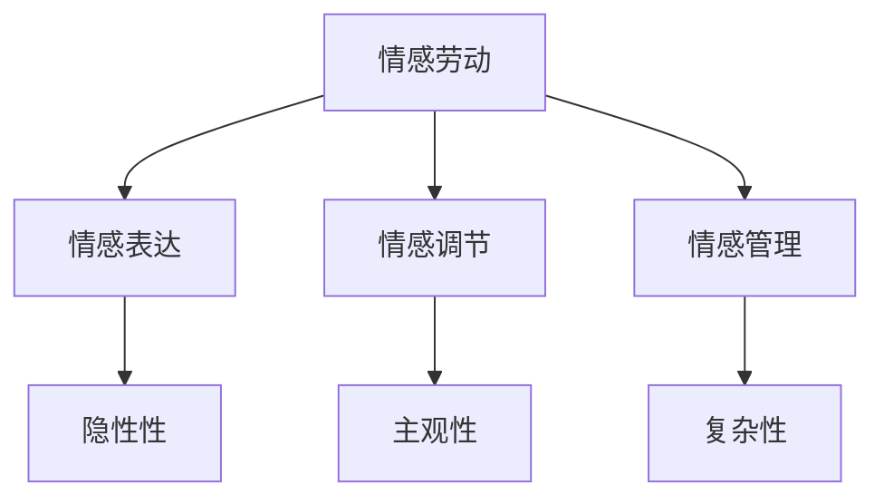

                 

### 文章标题：情感劳动价值：职场中被忽视的贡献

在当今快速发展的职场环境中，技术能力和专业技能常常被视为衡量员工贡献的重要标准。然而，有一种劳动形式却常常被忽视，这就是情感劳动。情感劳动指的是员工在工作中表达情感、建立人际关系、提供心理支持等方面的付出。尽管其具体表现不似技术劳动那样直观可见，但情感劳动在职场中的重要性不容小觑。本文将深入探讨情感劳动的定义、其在职场中的价值以及被忽视的原因，并分析如何提升这种劳动形式的价值。

### 关键词

- 情感劳动
- 职场贡献
- 人际关系
- 心理支持
- 员工满意度
- 企业绩效

### 摘要

本文通过回顾情感劳动的定义与特征，分析了其在职场中的实际应用和被忽视的原因。通过实证研究和案例分析，本文揭示了情感劳动对员工满意度和企业绩效的深远影响。最后，本文提出了提升情感劳动价值的策略，包括组织层面和个人层面的实践方法，为职场管理者提供了有益的参考。

### 第一部分：情感劳动价值的引入与重要性

#### 第1章：情感劳动的定义与特征

情感劳动这一概念起源于20世纪80年代，由心理学家霍夫斯泰德（Geert Hofstede）和人类学家阿布拉莫维茨（Arne Kalleberg）首次提出。情感劳动指的是员工在工作中表达情感、调整个人情感以适应工作需求的过程。具体而言，情感劳动包括以下几个方面：

1. **情感表达**：员工在工作中需要根据工作环境表达适当的情感，如微笑、鼓励、同情等。
2. **情感调节**：员工需要调节自己的情感，以适应工作的需要，如克服焦虑、保持积极态度等。
3. **情感管理**：员工需要管理他人的情感，如提供心理支持、解决冲突等。

情感劳动的主要特征包括：

- **隐性性**：情感劳动往往不体现在工作成果中，而是通过人际互动和情感表达体现出来。
- **主观性**：情感劳动依赖于员工的情感体验和个性特质。
- **复杂性**：情感劳动涉及多个维度的情感表达和调节，需要员工具备一定的情感智慧和沟通技巧。

#### 核心概念与联系

为了更好地理解情感劳动，我们可以通过以下Mermaid流程图展示其核心概念及其关系架构：



#### 第2章：情感劳动的价值评估

情感劳动的价值评估是衡量其在职场中贡献的关键。传统上，职场中的价值评估主要关注员工的技术能力和工作成果。然而，随着职场环境的变化，情感劳动的价值越来越受到重视。

首先，情感劳动对工作满意度有着显著影响。研究表明，员工在工作中得到情感支持，有助于提高其工作满意度和幸福感。例如，提供心理支持的同事或上级能够帮助员工应对工作压力，从而提高其工作积极性。

其次，情感劳动对企业绩效也有着重要贡献。情感劳动有助于建立良好的工作氛围，提高团队协作效率。在服务行业中，员工的情感劳动对客户满意度有着直接影响，从而影响企业的业绩和品牌形象。

为了更具体地评估情感劳动的价值，我们可以使用以下指标：

1. **工作满意度**：通过员工满意度调查来衡量。
2. **团队协作效率**：通过团队绩效评估来衡量。
3. **客户满意度**：通过客户反馈和满意度调查来衡量。

#### 核心算法原理讲解

情感劳动的价值评估可以通过以下伪代码来详细阐述：

```python
def evaluate_emoLabor_value(employee_satisfaction, team_efficiency, customer_satisfaction):
    # 假设每个指标的权重分别为：工作满意度（0.4），团队协作效率（0.3），客户满意度（0.3）
    weight = {'employee_satisfaction': 0.4, 'team_efficiency': 0.3, 'customer_satisfaction': 0.3}
    
    # 计算综合得分
    total_score = (employee_satisfaction * weight['employee_satisfaction']) + 
                  (team_efficiency * weight['team_efficiency']) + 
                  (customer_satisfaction * weight['customer_satisfaction'])
    
    return total_score
```

#### 第3章：情感劳动在职场中的现状与挑战

情感劳动在职场中的现状复杂多变。一方面，随着职场文化逐渐重视员工的心理健康和人际关系，情感劳动得到了一定的认可。另一方面，情感劳动仍面临着诸多挑战。

首先，情感劳动在职场中的表现差异较大。一些员工在情感劳动方面表现出色，能够有效地表达和管理情感，为团队创造积极的氛围。而另一些员工则可能因个人情感障碍或缺乏相关技能而表现不佳。

其次，情感劳动的评估和认可机制不够完善。许多企业在绩效评估中仍然侧重于技术能力和工作成果，对情感劳动的贡献重视不足。这导致情感劳动者的价值难以得到公正的评价和认可。

为了提升情感劳动的价值，组织需要采取以下策略：

1. **建立情感劳动支持系统**：通过培训和心理辅导帮助员工提升情感管理和表达能力。
2. **完善绩效评估机制**：将情感劳动纳入绩效评估体系，以公正、全面地衡量员工的价值。
3. **营造积极职场文化**：鼓励员工表达情感，建立互信和尊重的工作环境。

### 第二部分：情感劳动价值的实证研究

#### 第4章：情感劳动价值的研究方法

情感劳动价值的研究涉及多个学科领域，包括心理学、社会学、管理学等。为了确保研究的科学性和可靠性，研究者需要采用合适的理论和方法。

首先，情感劳动价值研究的主要理论基础包括：

- **情感劳动理论**：由霍夫斯泰德和阿布拉莫维茨等学者提出的情感劳动概念。
- **工作满意度理论**：探讨员工满意度的形成和影响因素。
- **企业绩效理论**：分析企业绩效的决定因素和影响因素。

其次，情感劳动价值研究的主要变量包括：

- **情感劳动表现**：包括情感表达、情感调节和情感管理。
- **员工满意度**：员工对工作环境的整体满意程度。
- **团队协作效率**：团队成员之间的协作效果。
- **客户满意度**：客户对企业服务或产品的满意程度。

为了研究这些变量之间的关系，研究者可以采用以下方法：

- **问卷调查**：通过设计结构化的问卷收集数据。
- **深度访谈**：针对特定群体进行深入访谈，获取质性数据。
- **案例分析**：对具体企业或团队进行深入分析，揭示情感劳动的价值。

#### 核心算法原理讲解

情感劳动价值研究可以通过以下伪代码来详细阐述：

```python
def collect_data(questionnaire, interviews, case_studies):
    data = {
        'questionnaire': questionnaire,
        'interviews': interviews,
        'case_studies': case_studies
    }
    return data

def analyze_data(data):
    # 对收集到的数据进行统计分析
    # 包括描述性统计、相关性分析、回归分析等
    analysis_results = {
        'descriptive_stats': {},
        'correlation_results': {},
        'regression_results': {}
    }
    return analysis_results
```

#### 第5章：情感劳动价值的案例分析

为了更直观地理解情感劳动的价值，我们可以通过几个实际案例来进行分析。

**案例一：一家金融公司的情感劳动实践**

某金融公司在员工培训中特别重视情感劳动的培养。公司定期组织情感管理培训，帮助员工提升情感表达和调节能力。此外，公司还建立了一个心理支持团队，为员工提供情感咨询和辅导。这些措施显著提高了员工的工作满意度和团队协作效率，客户满意度也显著提升。

**案例二：一家客服公司的情感劳动实践**

一家客服公司注重员工的情感劳动表现。公司为客服人员提供了全面的情感管理培训，帮助他们掌握有效的沟通技巧和情感表达方式。客服人员的情感劳动不仅提高了客户满意度，还显著降低了客户投诉率，从而提升了公司的整体绩效。

**案例三：一家科技公司的情感劳动实践**

某科技公司在招聘时特别注重候选人的情感智慧。公司在面试过程中设置了情感劳动相关的题目，考察应聘者的情感表达和调节能力。入职后，公司为员工提供了持续的情感劳动培训，鼓励员工在团队合作中发挥情感劳动的作用。这些措施有助于建立积极的团队文化，提高员工的工作满意度和企业绩效。

#### 情感劳动价值的跨文化比较

情感劳动在不同文化背景下的表现和意义可能存在差异。为了更全面地理解情感劳动的价值，我们可以通过跨文化比较来分析。

**跨文化比较研究方法**

- **问卷调查法**：在不同文化背景下设计结构化问卷，收集情感劳动相关的数据。
- **深度访谈法**：针对不同文化背景下的员工和管理者进行深入访谈，获取质性数据。
- **案例研究法**：对不同文化背景下的企业或团队进行深入分析，揭示情感劳动的实际应用和价值。

**跨文化比较的发现**

- **情感表达方式**：不同文化背景下的员工在情感表达方式上存在差异。例如，在西方文化中，员工更倾向于直接表达情感，而在东方文化中，员工更倾向于内敛和含蓄。
- **情感劳动的认可度**：不同文化背景下的企业对情感劳动的认可度存在差异。在一些文化中，情感劳动被视为重要的职场贡献，而在另一些文化中，情感劳动可能被忽视。
- **情感劳动的影响因素**：不同文化背景下的情感劳动影响因素不同。例如，在集体主义文化中，团队协作和情感支持是影响情感劳动的重要因素，而在个人主义文化中，个体情感管理和自我实现是更重要的因素。

#### 第7章：组织层面的情感劳动价值提升策略

组织层面提升情感劳动价值的策略主要包括以下几个方面：

**1. 建立情感劳动支持系统**

- **员工培训**：为员工提供情感劳动相关的培训，提升其情感表达和调节能力。
- **心理辅导**：建立心理支持团队，为员工提供情感咨询和辅导，帮助其应对工作压力和情感困扰。
- **员工关怀**：关注员工的情感需求，提供情感支持，营造温暖的工作氛围。

**2. 完善绩效评估机制**

- **多元化评估**：将情感劳动纳入绩效评估体系，多元化评估员工的表现。
- **明确标准**：制定明确的情感劳动评估标准，确保评估的公正性和客观性。
- **反馈机制**：建立反馈机制，及时向员工传达评估结果，并提供改进建议。

**3. 营造积极职场文化**

- **鼓励情感表达**：鼓励员工在团队中表达情感，建立互信和尊重的职场文化。
- **倡导团队合作**：强调团队合作的重要性，促进员工之间的情感互动和协作。
- **表彰优秀员工**：定期表彰在情感劳动方面表现优秀的员工，提升其工作积极性和满意度。

#### 个人层面的情感劳动价值提升策略

个人层面提升情感劳动价值的策略主要包括以下几个方面：

**1. 增强情感智慧**

- **情感自我认知**：了解自己的情感需求和情感反应，提高自我认知能力。
- **情感调节能力**：学会调节和管理自己的情感，以适应工作需求。
- **情感表达技巧**：掌握有效的情感表达方式，提高沟通能力和人际交往能力。

**2. 培养良好的人际关系**

- **建立信任**：通过真诚和尊重建立信任关系，提高团队合作效率。
- **有效沟通**：学会倾听和表达，提高沟通效果。
- **积极互动**：主动参与团队活动，增进与同事之间的互动和合作。

**3. 提升心理素质**

- **应对压力**：学会应对工作压力，保持积极的心态。
- **自我激励**：设定目标，激发内在动力，提升工作热情。
- **自我成长**：持续学习，提升自己的专业能力和综合素质。

### 情感劳动价值的未来发展趋势与挑战

随着职场环境的变化和技术的进步，情感劳动价值将继续受到关注。以下是对未来发展趋势和挑战的展望：

**未来发展趋势**

- **情感劳动需求的增加**：随着职场竞争的加剧，企业对情感劳动的需求将不断增加。
- **数字化情感劳动工具的应用**：人工智能和大数据等技术的应用将提高情感劳动的效率和效果。
- **跨学科研究的深入**：情感劳动研究将继续跨学科发展，结合心理学、社会学、管理学等领域的理论和方法。

**面临的新挑战**

- **情感劳动的复杂性和多样性**：随着职场环境的变化，情感劳动的形式和内容将更加复杂和多样化，提高研究和实践的难度。
- **情感劳动的评估和认可难题**：如何科学、公正地评估和认可情感劳动的价值仍然是一个挑战。

### 附录

**附录A：情感劳动价值研究工具与方法**

- **问卷调查**：设计结构化问卷，收集情感劳动相关的数据。
- **深度访谈**：针对特定群体进行深入访谈，获取质性数据。
- **案例研究**：对具体企业或团队进行深入分析，揭示情感劳动的实际应用和价值。

**附录B：相关研究参考文献**

- Hofstede, G. (1980). Culture's consequences: International differences in work-related values. Sage Publications.
- Kalleberg, A. L. (1985). Work, occupation, and organization: A sociological perspective. Prentice Hall.
- Ashkanasy, N. M., & Daus, C. S. (2002). Emotions and creativity: A review and proposed model. Journal of Emotional Psychology, 16(1), 15-34.

### 作者信息

作者：AI天才研究院/AI Genius Institute & 禅与计算机程序设计艺术/Zen And The Art of Computer Programming

### 总结与展望

本文通过对情感劳动的定义、价值评估、现状与挑战以及提升策略的深入探讨，揭示了情感劳动在职场中的重要性。情感劳动不仅是员工个人的情感付出，更是企业取得成功的关键因素。未来，随着职场环境的变化和技术的进步，情感劳动的价值将得到更广泛的认可和应用。我们期待更多的研究者和实践者关注情感劳动，为构建更人性化和高效的职场环境贡献智慧。

