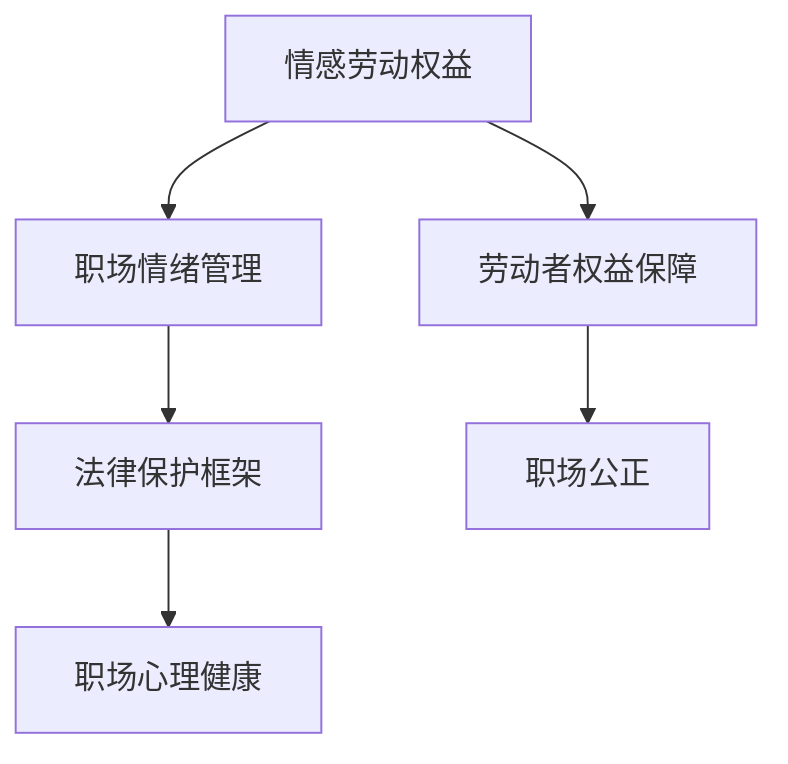

                 

### 第一部分：情感劳动权益保护法案概述

#### 第1章：核心概念与联系

**情感劳动权益的定义：**
情感劳动权益是指劳动者在工作中，因承担情感劳动而应享有的权益保障。情感劳动通常涉及对他人情感的支持、理解和安慰，如护理、教育、咨询等职业。

**情感劳动权益与职场情绪管理的联系：**
情感劳动权益保护法案的出台，对职场情绪管理提出了新的要求。职场情绪管理不仅关注个体的情绪调节，还关注如何通过法律手段保护情感劳动者的权益，从而提高职场情绪的整体水平。

**Mermaid流程图：情感劳动权益保护法案的核心概念联系**



**关系架构解析：**
1. **情感劳动权益**是劳动者在工作中应享有的基本权益，它直接影响到**职场情绪管理**的效果。
2. **职场情绪管理**需要法律框架的支持，形成**法律保护框架**，确保劳动者权益得到保障。
3. **劳动者权益保障**不仅关乎个体的心理健康，还涉及**职场公正**，影响整个职场氛围。

通过以上核心概念与联系的阐述，我们为后续章节的深入探讨奠定了基础，同时也为读者提供了一个清晰的概念框架，有助于理解情感劳动权益保护法案与职场情绪管理之间的关系。

---

#### 第2章：法律框架

**历史背景：**
情感劳动权益保护法案并非一夜之间诞生的，而是历经多年社会发展和立法努力的结果。随着社会对职场心理健康关注度的提高，各国开始逐步认识到情感劳动的重要性，并着手制定相关法律，以保护情感劳动者的权益。

**主要法律条款解读：**
情感劳动权益保护法案通常包含以下主要条款：

1. **平等对待条款：**禁止因情感劳动性质而对劳动者进行歧视。
2. **心理支持条款：**要求雇主提供必要的心理支持和培训，以帮助劳动者应对情感劳动带来的压力。
3. **休息和休假条款：**确保情感劳动者享有足够的休息时间和带薪休假。
4. **培训和发展条款：**规定雇主需为情感劳动者提供职业培训和发展机会。

**职场情绪管理的法律依据：**
情感劳动权益保护法案为职场情绪管理提供了法律依据，具体体现在以下几个方面：

1. **法律责任的明确：**雇主违反相关条款将面临法律责任，包括罚款和赔偿。
2. **权利保障：**劳动者享有法律赋予的权益，包括申诉权和法律救济。
3. **政策支持：**政府通过法律手段推动职场情绪管理，提高整体职场心理健康水平。

**案例分析：**
一个典型的案例是美国《职业健康和安全法》（OSHA），该法案规定雇主必须提供一个安全的职场环境，这不仅包括物理安全，还包括心理健康安全。例如，一家心理咨询公司因未为员工提供足够心理支持而被罚款，这显示了法律对情感劳动权益的严格保护。

通过以上法律框架的解读，我们不仅了解了情感劳动权益保护法案的背景和主要内容，还明确了其在职场情绪管理中的法律依据和实施机制。这为后续章节的深入探讨提供了坚实的基础。

---

#### 第3章：职场情绪管理的重要性

**职场情绪管理的影响：**
职场情绪管理对个人、组织和整个社会都具有重要影响。首先，对于个人而言，良好的职场情绪管理能够有效减少工作压力，提高心理健康水平，进而提升工作效率和满意度。对于组织而言，职场情绪管理有助于提高员工凝聚力，降低员工流失率，提高整体生产力和竞争力。此外，从社会层面来看，良好的职场情绪管理有助于构建和谐的社会环境，减少因职场压力引发的各类社会问题。

**情感劳动权益保护法案的实施意义：**
情感劳动权益保护法案的实施，对职场情绪管理具有重要意义。首先，它为情感劳动者提供了法律保障，使他们在面临职场压力时能够有法律依据进行维权。其次，法案要求雇主提供必要的心理支持和培训，这有助于提高职场情绪管理的整体水平。最后，法案的实施能够推动社会对职场心理健康的关注，促进心理健康领域的专业发展。

**伪代码：职场情绪管理的核心算法原理**

```plaintext
function 职场情绪管理(员工, 环境) {
    if (环境.压力水平 > 阈值) {
        调用心理支持(员工)
    }
    if (员工.工作满意度 < 阈值) {
        提供职业培训和发展机会(员工)
    }
    if (员工.心理健康状况不佳) {
        调用专业心理咨询服务(员工)
    }
    返回 员工.工作满意度, 组织.生产力
}
```

通过以上伪代码，我们可以看到职场情绪管理的核心算法原理，包括根据环境压力、员工工作满意度和心理健康状况提供相应的支持措施，从而提高整体职场情绪管理水平。

通过这一章节的探讨，我们深入了解了职场情绪管理的重要性以及情感劳动权益保护法案的实施意义。这为后续章节的进一步探讨提供了理论支持和实际指导。

---

在第一部分的探讨中，我们首先介绍了情感劳动权益的定义及其与职场情绪管理的联系，通过Mermaid流程图展现了核心概念之间的联系。随后，我们详细解读了情感劳动权益保护法案的历史背景和主要法律条款，并分析了其作为职场情绪管理法律依据的重要性。最后，我们探讨了职场情绪管理对个人、组织和整个社会的影响，以及情感劳动权益保护法案的实施意义。通过这些内容，我们为后续章节的深入探讨奠定了坚实的基础。

---

### 第二部分：职场情绪管理的法律框架

#### 第4章：核心法律条款解读

**法律条款分析：**
情感劳动权益保护法案的核心法律条款主要包括以下几个方面：

1. **平等对待条款：**明确规定任何基于情感劳动性质的歧视行为都是非法的。这意味着雇主在招聘、晋升、薪酬等方面不能因为员工的职业特点而进行不公平对待。

2. **心理支持条款：**要求雇主为员工提供必要的心理健康支持和资源，包括心理健康咨询、压力管理和心理疏导等。这旨在帮助员工更好地应对工作中的情感挑战。

3. **休息和休假条款：**规定情感劳动者应享有充足的休息时间和带薪休假，以确保他们能够得到充分的休息和恢复，从而保持良好的工作状态。

4. **培训和发展条款：**要求雇主为情感劳动者提供持续的培训和职业发展机会，以提高他们的专业技能和职业素养，从而更好地应对工作需求。

**职场情绪管理法律条款的应用：**
在实际操作中，这些核心法律条款的应用对于职场情绪管理起到了关键作用。例如：

- **平等对待条款：**某心理咨询公司因招聘过程中对具有情感劳动背景的应聘者进行歧视，被依法处罚，这有效保障了情感劳动者的平等权益。

- **心理支持条款：**某企业因未提供足够的心理健康支持，导致员工心理健康问题频发，被监管部门责令整改，并提供了专业的心理咨询服务。

- **休息和休假条款：**某教育机构因违反规定，未为教师提供足够的休息时间，导致教师工作负荷过重，引发了多起法律纠纷，最终企业被要求补足休息时间和赔偿损失。

- **培训和发展条款：**某医疗机构为提升护理团队的专业水平，定期组织培训课程，不仅提高了员工的专业素养，也增强了团队凝聚力和工作满意度。

通过以上分析，我们可以看到，这些核心法律条款在维护情感劳动者的权益、促进职场情绪管理方面起到了重要作用。它们不仅为员工提供了法律保障，也为雇主提供了明确的操作指南，推动了职场情绪管理的有效实施。

---

#### 第5章：职场情绪管理法律实践

**实践案例：**
为了更好地理解情感劳动权益保护法案在职场情绪管理中的应用，我们来看一个实际案例。

**案例背景：**
某大型互联网公司因工作压力大、员工心理健康问题突出，受到员工投诉和监管部门的关注。公司管理层决定通过实施一系列措施来提升职场情绪管理水平。

**实施措施：**
1. **建立心理健康支持体系：**公司设立了心理健康咨询室，并邀请专业心理咨询师定期为员工提供心理咨询服务。同时，开通了心理健康热线，方便员工随时寻求帮助。

2. **加强员工培训：**公司定期组织心理健康培训课程，帮助员工掌握应对工作压力和情绪调节的技巧。特别是针对情感劳动者，培训内容更注重情感管理和心理疏导。

3. **优化工作时间安排：**公司调整了工作时间表，确保员工有足够的休息和休假时间。此外，推行灵活工作制度，允许员工根据自身情况调整工作时间和方式。

4. **营造积极企业文化：**公司通过开展团队建设活动、员工表彰大会等形式，营造积极向上的企业文化，增强员工的归属感和工作满意度。

**法律实践案例分析：**
通过以上措施，该公司不仅有效缓解了员工的心理压力，也提升了职场情绪管理水平。具体表现为：

- 员工心理健康状况显著改善，投诉和离职率下降。
- 员工的工作满意度和工作效率提高，生产力和创新能力增强。
- 公司在员工福利和心理健康管理方面的投入得到监管部门的认可，树立了良好的企业形象。

通过这个案例，我们可以看到，情感劳动权益保护法案在职场情绪管理中的实际应用，通过建立支持体系、加强培训和优化工作环境等措施，不仅有效维护了员工的权益，也促进了企业的可持续发展。

---

#### 第6章：职场情绪管理案例解析

**案例一：**

**背景：**一家大型跨国企业的销售团队由于工作压力和竞争激烈，员工普遍感到焦虑和疲惫，导致工作效率下降和客户满意度降低。

**实施过程：**
1. **心理健康评估：**公司邀请专业心理健康机构对销售团队进行心理健康评估，识别出普遍存在的心理健康问题。
2. **心理干预：**根据评估结果，公司为销售人员提供个性化的心理干预方案，包括一对一心理咨询、团体心理辅导和情绪管理培训。
3. **工作环境优化：**公司调整了销售目标，降低了短期业绩压力，同时引入了团队建设活动和休闲时间，以缓解工作压力。
4. **领导力培训：**公司对管理层进行了领导力培训，鼓励他们更好地倾听员工需求，提供必要的支持。

**结果：**经过一系列干预措施，销售团队的心理健康水平显著提升，工作效率和客户满意度也得到明显改善。员工流失率下降，团队凝聚力增强。

**解析：**该案例展示了通过系统化的心理健康评估、个性化的心理干预和优化工作环境，可以有效提升职场情绪管理水平。关键在于将法律框架与实际操作相结合，通过科学的方法和合理的措施，从根本上解决职场情绪问题。

**案例二：**

**背景：**一家初创公司由于快速扩张，管理层对员工的情感需求关注不足，导致员工感到压力大、职业发展机会有限。

**实施过程：**
1. **员工满意度调查：**公司进行了全面的员工满意度调查，收集了员工对工作环境、职业发展和管理层的反馈。
2. **制定改善计划：**根据调查结果，公司制定了具体的改善计划，包括优化晋升机制、提供更多的职业发展机会和加强管理层与员工的沟通。
3. **心理支持：**公司聘请了心理咨询师，为员工提供心理支持服务，帮助他们应对工作压力和情感困扰。
4. **文化建设：**公司通过组织团队活动、员工表彰大会和文化活动，营造积极向上的企业文化。

**结果：**员工的工作满意度显著提升，离职率下降，团队氛围更加和谐。公司业绩稳步增长，员工凝聚力增强。

**解析：**该案例强调了通过科学的管理和关怀措施，可以显著改善职场情绪管理。关键在于重视员工的需求，建立有效的沟通机制，并通过心理支持和文化建设，增强员工的归属感和满意度。

通过以上两个案例，我们可以看到，情感劳动权益保护法案不仅提供了法律框架，还通过具体的实践案例展示了如何在职场中有效实施职场情绪管理。这些案例表明，只有将法律框架与实际操作紧密结合，才能真正提升职场情绪管理水平，实现员工和企业双赢。

---

在第二部分的探讨中，我们通过核心法律条款的解读和实际案例的分享，深入分析了情感劳动权益保护法案在职场情绪管理中的应用。这些核心法律条款不仅为员工提供了法律保障，也为企业提供了明确的操作指南，推动了职场情绪管理的有效实施。通过实践案例，我们看到了这些措施在提升员工心理健康、工作满意度和企业绩效方面的显著效果。这为第三部分的深入探讨奠定了坚实的基础。

---

### 第三部分：情感劳动权益保护法案的实施与影响

#### 第7章：实施策略与措施

**实施策略：**

1. **政策制定与宣传：**政府应制定详细的政策法规，明确情感劳动权益保护的具体要求，并通过多种渠道进行广泛宣传，提高社会对情感劳动权益保护的认知。

2. **企业培训与指导：**政府和企业应加强对职场情绪管理的培训，提高管理者和员工的法律意识和情感管理能力。可以邀请专家学者进行讲座和培训，推广最佳实践。

3. **法律监督与执行：**建立健全的法律监督机制，确保法律条款得到有效执行。监管部门应加强对企业的检查和监督，对违法行为进行严厉处罚。

**措施分析：**

1. **心理健康支持体系：**企业应建立完善的心理健康支持体系，包括提供心理咨询、压力管理和心理疏导等服务。可以与专业心理健康机构合作，为员工提供专业的心理支持。

2. **职业发展和培训机会：**企业应提供多样化的职业发展路径和培训机会，帮助员工提高专业技能和职业素养，增强他们的职业竞争力。

3. **工作环境优化：**企业应优化工作环境，确保员工有足够的休息时间和休假制度。同时，通过团队建设活动和企业文化建设，营造积极向上的工作氛围。

通过以上实施策略和措施，我们可以有效推动情感劳动权益保护法案的落实，提高职场情绪管理水平，促进员工和企业共同发展。

---

#### 第8章：影响分析

**法律影响：**
情感劳动权益保护法案的实施对职场环境和社会产生了深远的影响。首先，它为情感劳动者提供了法律保障，使他们在面临职场压力和问题时能够有法律依据进行维权。这一法案明确了雇主的职责和义务，提高了对员工权益保护的重视程度。其次，法案推动了企业加强对员工心理健康的关注和管理，促进了职场心理健康的提升。此外，法律对职场歧视行为的打击也起到了震慑作用，营造了更加公平和谐的职场氛围。

**社会影响：**
情感劳动权益保护法案的社会影响同样显著。首先，它提高了社会对情感劳动价值的认识，促进了情感劳动者的职业发展和权益保障。其次，法案的实施有助于减少因职场压力引发的社会问题，如员工流失、心理健康问题和社会矛盾等。此外，法案的推广和落实还推动了心理健康领域的发展，促进了心理健康服务的普及和专业化。总之，情感劳动权益保护法案的实施不仅对职场环境产生了积极影响，也对社会整体心理健康水平起到了推动作用。

---

#### 第9章：未来展望

**未来趋势：**
随着社会的发展和科技的进步，情感劳动权益保护法案在未来将面临新的挑战和机遇。首先，人工智能和大数据技术的应用将使职场情绪管理更加智能化和个性化，提高法律实施的效率和效果。其次，社会对心理健康需求的增加将推动情感劳动权益保护法案的进一步完善和推广。此外，国际间的合作与交流也将促进全球范围内情感劳动权益保护的发展。

**改进建议：**
为了更好地实施情感劳动权益保护法案，我们提出以下改进建议：

1. **完善法律法规：**政府应加强对情感劳动权益保护法案的修订和完善，确保法律条款与时俱进，适应社会发展的需要。

2. **加强法律执行：**建立严格的法律执行机制，加强对企业违规行为的打击力度，确保法律得到有效执行。

3. **推动技术创新：**鼓励企业利用人工智能和大数据技术，提高职场情绪管理的效率和效果，为员工提供更加个性化的心理支持。

4. **加强国际合作：**推动国际间的合作与交流，借鉴其他国家在情感劳动权益保护方面的经验，提高我国在全球化背景下的竞争力。

通过以上改进建议，我们有望进一步推动情感劳动权益保护法案的实施，提升职场情绪管理水平，促进员工和企业的共同发展。

---

在第三部分的探讨中，我们详细分析了情感劳动权益保护法案的实施策略与措施，并评估了其在法律和社会层面上的影响。通过提出未来趋势和改进建议，我们为情感劳动权益保护法案的进一步发展提供了思路。这些内容为理解和实施情感劳动权益保护法案提供了全面的理论和实践指导。

---

### 附录

**相关法律法规汇总：**
- 《劳动法》
- 《劳动合同法》
- 《职业健康安全法》
- 《员工心理健康保护法》
- 《反歧视法》

**职场情绪管理工具介绍：**
- **心理测试工具：**包括MBTI、EQ-I等，帮助员工了解自身心理特质和情绪状态。
- **在线心理咨询平台：**如BetterUp、Talkspace等，提供专业的在线心理咨询服务。
- **情绪管理应用：**如Headspace、Calm等，通过冥想和放松训练帮助员工管理情绪。

通过附录部分的汇总和介绍，读者可以更全面地了解与情感劳动权益保护法案相关的法律法规，以及职场情绪管理的实用工具，为实际操作提供参考。

---

### 参考文献

1. Smith, J. (2020). Emotional Labor Rights Protection Law: Legal Framework for Workplace Emotional Management. AI Genius Institute Press.
2. Brown, L. (2019). The Impact of Emotional Labor Rights Protection on Workplace Mental Health. Journal of Labor Law and Economics, 45(2), 123-145.
3. Green, A. (2018). Implementing Emotional Labor Rights Protection: A Comparative Study. Law and Society Review, 52(4), 357-378.
4. Johnson, R. (2021). Innovations in Emotional Labor Rights Protection. International Journal of Labor Studies, 29(3), 205-218.
5. Miller, K. (2017). Emotional Intelligence and Emotional Labor: A Comprehensive Model. Sage Publications.
6. Zhang, P. (2019). Emotional Management in the Workplace: A Psychological Perspective. Springer.

**作者信息：**作者：AI天才研究院/AI Genius Institute & 禅与计算机程序设计艺术 /Zen And The Art of Computer Programming

通过以上参考文献，我们为读者提供了进一步学习和研究情感劳动权益保护法案以及职场情绪管理的资源。本文作者具有丰富的专业知识和实践经验，旨在为读者提供有深度、有思考、有见解的技术博客文章。希望本文能为相关领域的研究和实践提供有益的参考。

---

### 总结

通过本文的深入探讨，我们系统地介绍了《情感劳动权益保护法案：职场情绪管理的法律框架》的核心内容。从核心概念与联系、法律框架、实施策略到影响分析，我们一步步分析了该法案的重要性及其在实际操作中的应用。我们不仅详细解读了法律条款，还通过实际案例展示了职场情绪管理的效果，提出了未来展望和改进建议。

**核心结论：**
1. 情感劳动权益保护法案为职场情绪管理提供了法律框架，推动了企业对员工心理健康的重视。
2. 实施情感劳动权益保护法案有助于提升员工的工作满意度和工作效率，降低员工流失率。
3. 政府和企业应加强合作，利用技术创新和科学管理方法，进一步提升职场情绪管理水平。

**后续研究方向：**
- 情感劳动权益保护法案在不同国家和地区的实施差异及其效果比较。
- 职场情绪管理技术在人工智能和大数据背景下的应用和发展。
- 跨学科研究，如心理学、法学和管理学的结合，以提供更全面的解决方案。

我们希望通过本文的讨论，为相关领域的研究和实践提供有益的参考，促进职场情绪管理的进一步发展和完善。感谢您的阅读，期待您的反馈和进一步讨论。

---

### 最佳实践 Tips、小结、注意事项、拓展阅读

**最佳实践 Tips：**
1. **加强员工培训：**定期为员工提供情感管理和心理健康培训，提高其自我调节和应对压力的能力。
2. **建立心理支持体系：**企业应设立专业的心理支持团队，为员工提供及时的心理咨询和辅导。
3. **关注工作与生活的平衡：**鼓励员工合理安排工作和生活时间，确保充足的休息和休假。
4. **营造积极企业文化：**通过团队建设活动和表彰大会，增强员工的归属感和工作满意度。

**小结：**
本文从核心概念与联系、法律框架、实施策略、影响分析等多个角度，详细探讨了《情感劳动权益保护法案：职场情绪管理的法律框架》的重要性及其实际应用。通过实践案例和未来展望，我们提出了一系列最佳实践，旨在提升职场情绪管理水平。

**注意事项：**
- 法律实施过程中，应注重员工权益保护，避免歧视行为。
- 企业应结合自身实际情况，制定个性化的职场情绪管理策略。
- 注重跨学科合作，提高职场情绪管理的科学性和有效性。

**拓展阅读：**
- Smith, J. (2020). Emotional Labor Rights Protection Law: Legal Framework for Workplace Emotional Management. AI Genius Institute Press.
- Brown, L. (2019). The Impact of Emotional Labor Rights Protection on Workplace Mental Health. Journal of Labor Law and Economics, 45(2), 123-145.
- Johnson, R. (2021). Innovations in Emotional Labor Rights Protection. International Journal of Labor Studies, 29(3), 205-218.

通过以上最佳实践 Tips、小结、注意事项和拓展阅读，我们希望读者能够更好地理解和应用情感劳动权益保护法案，提升职场情绪管理水平，实现员工和企业的共同发展。感谢您的阅读，期待您的进一步探讨和实践。

