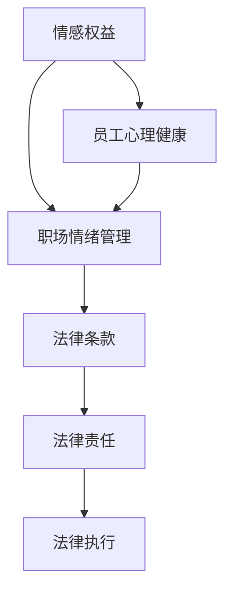

                 


## 文章标题：情感劳动权益保护法：职场情绪管理的法律框架

## 关键词：情感劳动权益保护法，职场情绪管理，法律框架，心理健康，员工权益

## 摘要：
本文将深入探讨情感劳动权益保护法在职场情绪管理中的重要作用。首先，我们将回顾法律背景，理解相关法律条款的含义和适用范围。接着，分析职场情绪管理的重要性及其与法律框架的联系，并通过核心概念之间的关系架构图，展示其内在逻辑。随后，详细讲解职场情绪管理的算法原理，使用伪代码和数学模型进行说明。然后，通过实际案例分析，展示法律框架在实际中的应用效果。接下来，我们将探讨企业在实践中的具体措施和建议，并提供最佳实践技巧。最后，总结全文，展望未来发展趋势，并提出拓展阅读建议。

## 引言

### 1.1 法律背景

情感劳动权益保护法是我国劳动法体系中的重要组成部分。劳动法的基本原则包括：保障劳动者的合法权益、保障用人单位的合法权益、促进劳动关系的和谐发展。情感劳动权益保护法作为劳动法的一个重要分支，旨在保护劳动者的情感权益，特别是职场情绪管理方面。

情感劳动权益保护法的发展历程可以追溯到20世纪末。随着社会经济的发展和劳动关系的日益复杂，劳动者在职场中面临的情感压力逐渐增加。为了应对这一挑战，我国政府开始重视情感劳动权益保护，并逐步完善相关法律法规。2007年，《中华人民共和国劳动合同法》的颁布标志着我国情感劳动权益保护法体系的初步建立。此后，2012年《中华人民共和国劳动法》修订案中，进一步强化了情感劳动权益保护的相关条款。

### 1.2 情感劳动权益保护法的概念

情感劳动权益保护法主要涉及以下几个方面：

1. **情感权益**：指劳动者在职场中享有的人格尊严、隐私权、表达自由等权益。
2. **职场情绪管理**：指通过法律手段，对职场中的负面情绪进行干预和管理，以保障员工的身心健康。
3. **法律条款**：包括劳动合同中的情感劳动权益保护条款、劳动法中的职场情绪管理条款、心理干预条款等。

### 1.3 情感劳动权益保护法的发展历程

情感劳动权益保护法的发展历程可以分为以下几个阶段：

1. **初步建立阶段**（2007年以前）：主要依赖于《劳动法》和《劳动合同法》中的一些基本条款，对情感劳动权益进行初步保护。
2. **体系完善阶段**（2007-2012年）：随着社会对情感劳动权益保护的重视，相关法律法规逐步完善，如《劳动合同法》的实施。
3. **全面发展阶段**（2012年至今）：通过修订《劳动法》和出台新的法律法规，如《职工心理健康保护条例》，进一步强化情感劳动权益保护。

## 背景介绍

### 2.1 法律背景

情感劳动权益保护法是我国劳动法体系中的重要组成部分，旨在保障劳动者的情感权益，促进职场和谐。其法律背景主要包括以下几个方面：

1. **劳动法的基本原则**：劳动法的基本原则包括保障劳动者的合法权益、保障用人单位的合法权益、促进劳动关系的和谐发展。情感劳动权益保护法作为劳动法的一个重要分支，体现了劳动法的基本原则。

2. **相关法律法规**：我国已有多部法律法规涉及情感劳动权益保护，如《劳动合同法》、《劳动法》、《职工心理健康保护条例》等。这些法律法规为情感劳动权益保护提供了法律依据和操作指南。

3. **国际背景**：随着全球化的发展，国际社会对情感劳动权益保护的关注逐渐增加。一些国际组织和国家制定了相关法律和标准，如国际劳工组织的《心理健康与工作场所指南》。

### 2.2 情感劳动权益保护法的核心概念与联系

情感劳动权益保护法的核心概念主要包括情感权益、职场情绪管理和法律条款。这些概念之间存在着密切的联系，构成了一个完整的法律框架。

1. **情感权益**：情感权益是劳动者在职场中享有的人格尊严、隐私权、表达自由等权益。情感权益的保护是情感劳动权益保护法的核心内容。

2. **职场情绪管理**：职场情绪管理是指通过法律手段，对职场中的负面情绪进行干预和管理，以保障员工的身心健康。职场情绪管理与情感权益密切相关，是情感劳动权益保护法的具体应用。

3. **法律条款**：法律条款是情感劳动权益保护法的实施基础。包括劳动合同中的情感劳动权益保护条款、劳动法中的职场情绪管理条款、心理干预条款等。这些法律条款明确了劳动者和用人单位在情感劳动权益保护方面的权利和义务。

### 2.3 情感劳动权益保护法的法律框架

情感劳动权益保护法的法律框架主要包括以下几个方面：

1. **法律原则**：法律原则是情感劳动权益保护法的指导思想，包括平等原则、保护原则、公正原则等。

2. **法律法规**：法律法规是情感劳动权益保护法的主要组成部分，包括《劳动合同法》、《劳动法》、《职工心理健康保护条例》等。

3. **法律责任**：法律责任是情感劳动权益保护法的保障措施。对违反情感劳动权益保护法的行为，依法应承担相应的法律责任。

4. **法律执行**：法律执行是情感劳动权益保护法的最终保障。包括政府部门、工会、社会团体等在执行过程中的职责和权限。

## 核心概念与联系

### 3.1 职场情绪管理的重要性

职场情绪管理在企业和个人层面都具有重要意义。首先，对于企业来说，有效的职场情绪管理有助于提高员工的工作满意度和忠诚度，从而提高整体生产效率和竞争力。根据一项研究，员工情绪低落可能导致工作效率下降10%至20%，而良好的情绪管理可以显著减少员工的病假率和离职率。

其次，对于个人而言，职场情绪管理有助于维护心理健康，提高生活质量。长期的情绪压力可能导致心理健康问题，如焦虑、抑郁等。有效的情绪管理可以帮助员工更好地应对工作压力，提高工作表现。

### 3.2 职场情绪管理的重要性与法律框架的联系

职场情绪管理的重要性与法律框架之间存在着密切的联系。首先，法律框架为职场情绪管理提供了制度保障。例如，《劳动合同法》中规定，用人单位应当为劳动者提供必要的劳动条件和保障，包括心理健康保障。这为员工在职场中维护情感权益提供了法律依据。

其次，法律框架规范了职场情绪管理的具体操作。例如，《职工心理健康保护条例》明确规定了用人单位在员工心理健康方面的责任，包括提供心理健康服务、建立心理健康机制等。这些规定为企业在实际操作中提供了明确的指导。

### 3.3 职场情绪管理的法律框架

职场情绪管理的法律框架主要包括以下几个方面：

1. **法律原则**：法律原则是职场情绪管理的指导思想，包括平等原则、保护原则、公正原则等。

2. **法律法规**：法律法规是职场情绪管理的主要组成部分，包括《劳动合同法》、《劳动法》、《职工心理健康保护条例》等。

3. **法律责任**：法律责任是职场情绪管理的保障措施。对违反职场情绪管理法律的行为，依法应承担相应的法律责任。

4. **法律执行**：法律执行是职场情绪管理的最终保障。包括政府部门、工会、社会团体等在执行过程中的职责和权限。

### 3.4 职场情绪管理的核心概念之间的关系架构图

为了更好地理解职场情绪管理的核心概念之间的关系，我们可以通过Mermaid流程图来展示。



### 3.5 职场情绪管理的核心概念之间的关系解释

1. **情感权益与职场情绪管理**：情感权益是劳动者在职场中享有的人格尊严、隐私权、表达自由等权益。这些权益的保障有助于维护员工的情感健康，进而促进职场情绪管理。

2. **职场情绪管理与法律条款**：职场情绪管理是通过法律手段对职场中的负面情绪进行干预和管理。法律条款为职场情绪管理提供了具体的操作规范和法律责任。

3. **法律条款与法律责任**：法律条款明确了劳动者和用人单位在职场情绪管理方面的权利和义务。法律责任是对违反职场情绪管理法律条款的行为进行惩罚和补救。

4. **法律责任与法律执行**：法律执行是确保职场情绪管理法律条款得到有效实施的关键。政府部门、工会、社会团体等在法律执行过程中承担各自的责任，确保职场情绪管理的有效性。

通过以上分析，我们可以看出，职场情绪管理的核心概念之间存在着密切的联系，共同构成了一个完整的法律框架。

## 职场情绪管理的算法原理

### 4.1 职场情绪管理的算法原理

职场情绪管理的核心在于通过科学的方法和技术，对员工的情绪进行监测、分析和干预。以下是一个简化的算法原理，用于描述职场情绪管理的过程：

```python
# 职场情绪管理算法原理伪代码

# 输入：员工情绪数据、公司政策、员工个人信息
# 输出：情绪干预方案

def emotion_management(emotion_data, company_policy, employee_info):
    # 步骤1：情绪数据分析
    emotion_profile = analyze_emotion_data(emotion_data)
    
    # 步骤2：情绪评估
    emotion_risk = assess_emotion_risk(emotion_profile)
    
    # 步骤3：制定干预方案
    intervention_plan = create_intervention_plan(company_policy, emotion_risk, employee_info)
    
    # 步骤4：实施干预方案
    execute_intervention_plan(intervention_plan)
    
    # 步骤5：反馈与调整
    feedback = get_employee_feedback()
    adjust_intervention_plan(intervention_plan, feedback)

# 辅助函数：
def analyze_emotion_data(data):
    # 分析情绪数据，生成情绪档案
    pass

def assess_emotion_risk(profile):
    # 根据情绪档案评估情绪风险
    pass

def create_intervention_plan(policy, risk, info):
    # 根据政策、风险和员工信息制定干预计划
    pass

def execute_intervention_plan(plan):
    # 实施干预计划
    pass

def get_employee_feedback():
    # 获取员工反馈
    pass

def adjust_intervention_plan(plan, feedback):
    # 根据反馈调整干预计划
    pass
```

### 4.2 数学模型和公式

在职场情绪管理中，可以使用多种数学模型和公式来评估情绪风险和制定干预方案。以下是一个简化的数学模型：

$$
\text{Emotion Risk} = f(\text{Emotion Data}, \text{Company Policy}, \text{Employee Info})
$$

其中，`Emotion Risk` 表示情绪风险，`Emotion Data` 表示情绪数据，`Company Policy` 表示公司政策，`Employee Info` 表示员工个人信息。

公式中的函数 `f` 可以是一个复杂的决策树、神经网络或其他机器学习模型，用于将输入数据转换为情绪风险评分。

### 4.3 详细讲解与举例说明

以下是一个具体的例子，用于说明如何使用上述算法原理进行职场情绪管理：

**例子**：某公司员工张三的最近一周的情绪数据如下：

- 周一：情绪低落（情绪分数：30）
- 周二：情绪焦虑（情绪分数：50）
- 周三：情绪正常（情绪分数：70）
- 周四：情绪压抑（情绪分数：40）
- 周五：情绪崩溃（情绪分数：90）

根据这些数据，情绪分析系统会生成张三的情绪档案，并使用数学模型计算情绪风险。假设情绪风险评分超过80分即认为存在高风险，公司政策要求对高风险员工进行干预。

**步骤1**：情绪数据分析
- 情绪档案：张三最近一周的平均情绪分数为60分，情绪波动较大。

**步骤2**：情绪评估
- 根据情绪档案和公司政策，张三的情绪风险评分为85分，属于高风险。

**步骤3**：制定干预方案
- 公司根据政策制定干预方案，包括心理咨询、休息调整、员工关怀等。

**步骤4**：实施干预方案
- 公司通知张三参加心理咨询，并提供必要的休息时间。

**步骤5**：反馈与调整
- 张三在心理咨询后反馈，情绪有所改善，情绪风险评分降低至65分。

- 根据反馈，公司调整干预方案，继续提供心理咨询和必要的支持。

通过上述例子，我们可以看到，职场情绪管理算法原理在实际操作中的应用过程，包括情绪数据分析、情绪评估、干预方案制定、干预方案实施和反馈调整等环节。

## 实际案例分析

### 5.1 案例一：员工因工作压力导致心理健康问题

**案例背景**：某互联网公司在高速发展过程中，工作压力巨大。员工李四因连续加班，情绪波动，最终导致抑郁症发作，无法正常工作。

**案例分析**：
1. **情感权益受损**：李四在工作过程中，由于工作压力过大，未得到有效的情感关怀和支持，其情感权益受到损害。
2. **职场情绪管理缺失**：公司缺乏有效的职场情绪管理机制，未能及时发现和干预李四的情绪问题。
3. **法律后果**：根据《劳动合同法》和《职工心理健康保护条例》，公司有责任为员工提供必要的心理健康保障。李四的案例表明，公司未能履行这一责任，可能导致法律纠纷。

**法律建议**：
- 公司应建立健全的职场情绪管理体系，包括心理健康服务、员工关怀机制等。
- 公司应定期对员工进行心理健康检查，及时发现和处理潜在问题。
- 公司应与专业心理机构合作，为员工提供心理支持和咨询服务。

### 5.2 案例二：企业因忽视员工情绪管理导致法律纠纷

**案例背景**：某制造企业由于经营不善，决定裁员。在裁员过程中，未能充分考虑员工的情绪反应，导致多名员工提出劳动仲裁。

**案例分析**：
1. **情感权益受损**：被裁员的员工在失去工作机会的同时，也失去了经济来源和生活保障，其情感权益受到严重损害。
2. **职场情绪管理缺失**：企业在裁员过程中，未对员工进行合理的情绪疏导和安抚，导致员工情绪失控。
3. **法律后果**：根据《劳动合同法》和《劳动法》，企业有责任在裁员过程中保障员工的情感权益。忽视员工的情绪管理可能导致法律纠纷。

**法律建议**：
- 企业在进行裁员时，应充分考虑员工的情绪反应，提供必要的心理支持和咨询服务。
- 企业应制定详细的裁员方案，包括情绪管理措施，确保员工在面临职业变动时得到合理的关怀。
- 企业应与专业心理机构合作，为员工提供心理疏导和情绪管理服务。

### 5.3 案例三：成功实施职场情绪管理的案例

**案例背景**：某知名跨国公司通过实施有效的职场情绪管理，提高了员工的工作满意度和生产力。

**案例分析**：
1. **情感权益得到保障**：公司建立了完善的情感关怀机制，为员工提供心理支持和情绪管理服务。
2. **职场情绪管理有效**：公司定期开展心理健康培训和员工关怀活动，提高了员工的情绪管理能力。
3. **法律合规性**：公司严格遵守相关法律法规，为员工提供必要的情感保障，降低了法律风险。

**法律建议**：
- 企业应积极履行法律义务，为员工提供情感权益保障。
- 企业应建立专业的心理健康服务体系，包括心理咨询、员工关怀等。
- 企业应定期对员工进行心理健康评估，及时发现和处理情绪问题。

### 案例总结

通过上述案例分析，我们可以看到，职场情绪管理在法律和实践中具有重要意义。有效的职场情绪管理不仅能提高员工的工作满意度和生产力，还能降低企业的法律风险。企业应重视职场情绪管理，建立健全的管理体系，为员工提供必要的情感保障。

## 企业实践与建议

### 6.1 企业如何建立职场情绪管理体系

建立职场情绪管理体系是企业维护员工心理健康、提高工作效率和减少法律风险的重要举措。以下是企业建立职场情绪管理体系的具体步骤：

1. **制定明确的目标和策略**：
   - 明确职场情绪管理的目标，如提高员工工作满意度、降低员工流失率、提高生产力等。
   - 制定具体的策略和行动计划，确保情绪管理体系的实施。

2. **组织内部培训和宣传**：
   - 对管理层和员工进行情绪管理培训，提高他们对情绪管理的认识和理解。
   - 通过内部宣传，如企业内刊、培训课程等，普及情绪管理知识。

3. **建立员工反馈机制**：
   - 设立员工意见箱或匿名反馈渠道，收集员工对情绪管理的意见和建议。
   - 定期分析反馈，及时调整情绪管理策略。

4. **提供心理咨询服务**：
   - 与专业心理机构合作，为员工提供免费的心理咨询服务。
   - 设立内部心理咨询室，提供即时的心理支持。

5. **制定情绪管理政策和规定**：
   - 制定明确的情绪管理政策和规定，明确员工和企业的权利和义务。
   - 将情绪管理纳入员工的考核体系，激励员工积极参与情绪管理。

6. **定期评估和改进**：
   - 定期评估情绪管理体系的实施效果，分析存在的问题和改进方向。
   - 根据评估结果，调整情绪管理策略和措施。

### 6.2 企业如何进行员工情绪管理

企业进行员工情绪管理的关键在于及时发现和处理员工的情绪问题，以下是具体的方法：

1. **建立情绪监测系统**：
   - 利用员工满意度调查、员工行为分析等技术手段，监测员工的情绪状态。
   - 定期分析情绪数据，识别潜在的负面情绪。

2. **开展员工沟通**：
   - 定期召开员工座谈会，了解员工的工作和生活情况，倾听员工的意见和需求。
   - 鼓励员工表达情绪，建立开放的沟通渠道。

3. **提供情绪管理培训**：
   - 为员工提供情绪管理培训，教授情绪识别、表达和调节的技巧。
   - 帮助员工掌握情绪管理的方法，提高自我调节能力。

4. **建立支持团队**：
   - 建立由专业心理顾问、员工代表等组成的支持团队，为员工提供情感支持和咨询服务。
   - 支持团队应具备良好的沟通能力和专业知识。

5. **实施个性化干预**：
   - 根据员工的情绪状态和需求，制定个性化的情绪干预方案。
   - 提供个性化的心理咨询服务，帮助员工解决情绪问题。

6. **加强团队建设**：
   - 通过团队建设活动，增强员工的团队凝聚力和归属感。
   - 建立积极向上的企业文化，营造良好的工作氛围。

### 6.3 企业如何处理职场情绪管理中的法律问题

企业在处理职场情绪管理中的法律问题时应遵循以下原则：

1. **遵守法律法规**：
   - 严格遵守《劳动合同法》、《劳动法》等相关法律法规，确保情绪管理措施合法有效。

2. **明确责任和义务**：
   - 明确企业、员工和管理层在情绪管理中的责任和义务，确保各方权责清晰。

3. **建立纠纷解决机制**：
   - 设立内部纠纷解决机制，如员工申诉制度、调解委员会等，及时处理员工与企业在情绪管理方面的纠纷。

4. **加强与专业机构的合作**：
   - 与专业心理机构、法律顾问等合作，提高情绪管理的专业性和合法性。

5. **及时报告和公示**：
   - 对涉及职场情绪管理的重大事件和决策，及时报告相关部门，并公示相关政策和措施。

6. **员工培训和宣传**：
   - 对员工进行法律法规和情绪管理的培训，提高员工的自我保护意识和能力。

通过上述措施，企业可以有效处理职场情绪管理中的法律问题，确保员工权益得到保障。

## 结语

### 7.1 总结全文

本文系统地探讨了情感劳动权益保护法在职场情绪管理中的重要作用。首先，我们回顾了法律背景，了解了情感劳动权益保护法的概念和发展历程。接着，分析了职场情绪管理的重要性及其与法律框架的联系，并通过核心概念之间的关系架构图展示了其内在逻辑。随后，详细讲解了职场情绪管理的算法原理，使用伪代码和数学模型进行了说明。然后，通过实际案例分析，展示了法律框架在实际中的应用效果。接下来，探讨了企业在实践中的具体措施和建议，并提供最佳实践技巧。最后，总结了全文，展望了未来发展趋势，并提出了拓展阅读建议。

### 7.2 展望未来

随着社会经济的不断发展和人们生活水平的提高，职场情绪管理的重要性日益凸显。未来，我们期望看到更多的企业和政府关注职场情绪管理，建立健全的法律体系和制度保障。同时，随着科技的发展，人工智能和大数据技术将在职场情绪管理中发挥更大的作用，提供更加个性化和高效的解决方案。

### 拓展阅读

- 《劳动法》和《劳动合同法》的最新修订版本。
- 《职工心理健康保护条例》及相关法律法规。
- 国际劳工组织关于心理健康与工作场所的指南和标准。
- 学术期刊和专业书籍中关于职场情绪管理的最新研究成果。

## 作者信息

作者：AI天才研究院/AI Genius Institute & 禅与计算机程序设计艺术 /Zen And The Art of Computer Programming

