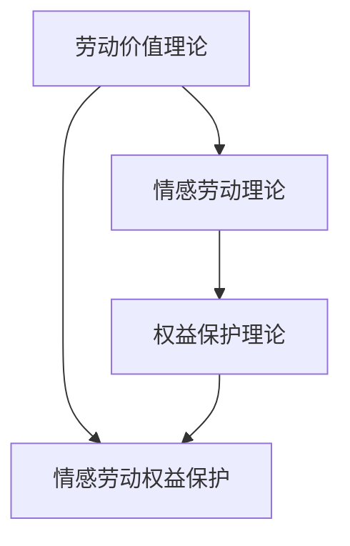

                 


## 第1章 引言

### 1.1 情感劳动的概念

情感劳动（Affective Labor）是指劳动者在提供产品或服务过程中，必须表达特定的情感或情绪状态，以满足特定的工作要求。这种劳动形式通常出现在需要高度人际互动的岗位上，如服务员、心理咨询师、教师、客服代表等。在这些职业中，员工不仅要具备专业技能，还需要展现出与工作要求相匹配的情感表达，如耐心、热情、理解力等。情感劳动的概念最早由社会学家Arlie Hochschild在1983年的著作《情感劳动》（The Managed Heart）中提出。她指出，情感劳动是一种将个人情感转化为工作的过程，员工在这个过程中不仅要管理自己的情感，还要根据工作要求调整情感表达。

### 1.2 无形付出的表现

无形付出主要表现在以下几个方面：耐心、沟通技巧、情感理解、客户关怀等。这些付出往往难以量化，但却是职场中不可或缺的一部分。例如，一名客服代表在与客户沟通时，需要展现出高度的耐心和情感理解，以便更好地解决问题。这种付出对于提升客户满意度、维护企业形象具有重要意义。然而，由于无形付出的难以量化特性，员工往往无法得到应有的认可和回报，从而引发一系列权益保护问题。

### 1.3 职场中无形付出的重要性

无形付出对于提高职场绩效、增强员工满意度、提升企业形象等方面都具有重要影响。首先，无形付出有助于提升员工的工作表现。研究表明，情感劳动可以显著提高员工的工作效率和服务质量。其次，无形付出有助于增强员工的工作满意度。当员工感受到自己的付出得到认可时，他们的工作积极性会大大提高。最后，无形付出对提升企业形象也具有重要作用。积极、热情、耐心的员工形象，可以增强消费者对企业的信任和好感，从而提升企业的市场竞争力。

然而，当前职场中对于无形付出的认可度较低，权益保护问题亟待解决。许多企业在薪酬体系、绩效考核等方面，忽视了无形付出的价值。这导致员工在工作中感到不公平，进而影响工作积极性和企业稳定性。因此，加强职场中无形付出的认可和保护，已经成为企业和社会关注的重要议题。

## 第2章 情感劳动权益保护的法律框架

### 2.1 国际劳工组织的相关规定

国际劳工组织（ILO）在《职业健康安全公约》等文件中，对情感劳动权益保护提出了一些基本要求。例如，确保工作环境不会对员工的情感健康造成负面影响，提供必要的心理健康支持，保障员工的隐私权等。这些规定旨在保护劳动者在工作中的合法权益，提高工作质量和效率。然而，由于各国国情和法律体系的差异，国际劳工组织的规定在实施过程中存在一定的局限性。

### 2.2 我国相关法律法规

我国《劳动法》、《劳动合同法》等法律法规，对劳动者的权益保护做出了明确规定。但在情感劳动权益保护方面，仍存在一定程度的盲区。根据《劳动法》第四条，用人单位应当保障劳动者的合法权益，尊重劳动者的人格尊严。然而，关于情感劳动的具体保护措施，法律条文并未做出详细规定。此外，我国《劳动合同法》中有关加班费、带薪休假、职业培训等方面的规定，也在一定程度上反映了情感劳动权益保护的需求。

### 2.3 情感劳动权益保护的挑战与机遇

随着职场环境的变化，情感劳动权益保护面临新的挑战。首先，情感劳动的隐蔽性和难以量化特性，使得权益保护难度加大。其次，随着数字化和网络化的发展，职场环境变得更加复杂，员工面临的情感劳动压力也日益增加。因此，如何有效保护情感劳动权益，成为当前亟待解决的问题。

然而，这也为法律法规的完善提供了机遇。随着社会对情感劳动权益保护的重视程度不断提高，法律法规有望得到进一步修订和完善。例如，可以出台专门的《情感劳动权益保护法》，明确情感劳动的定义、权益保护和法律责任等方面的内容。此外，可以借鉴国际经验，建立多层次的情感劳动权益保护体系，从企业、行业、政府等多个层面，共同推动情感劳动权益保护工作的开展。

总之，情感劳动权益保护是一个涉及法律、政策、企业文化和员工个体等多个层面的综合性问题。只有通过多方共同努力，才能实现职场中无形付出的认可和保护，提高员工的工作满意度和企业竞争力。

## 第3章 情感劳动权益保护的理论基础

### 3.1 劳动价值理论

劳动价值理论认为，劳动是价值的源泉。在情感劳动中，员工的无形付出也是创造价值的重要组成部分。根据劳动价值理论，劳动者的劳动时间、技能和努力程度决定了劳动的价值。在情感劳动中，员工通过表达特定的情感或情绪状态，为客户或同事提供高质量的服务或支持，从而创造出额外的价值。例如，一位心理咨询师通过展现同理心和耐心，帮助客户解决问题，这种情感付出不仅提升了客户满意度，还为企业创造了口碑价值。

### 3.2 情感劳动理论

情感劳动理论从心理学、社会学等角度，分析了情感劳动的内涵、特征及其在职场中的作用。情感劳动理论认为，情感劳动是一种将个人情感转化为工作的过程，员工在这个过程中需要管理自己的情感，并根据工作要求进行调整。情感劳动的特征包括：情感表达的强制性、情感与劳动的融合性、情感劳动的私人性等。情感劳动在职场中的作用主要体现在以下几个方面：

1. **提升服务质量**：情感劳动能够提高员工的服务质量和客户满意度。例如，客服代表通过展现出热情和耐心，能够更好地解决客户问题，提升客户体验。

2. **增强团队协作**：情感劳动有助于增强团队内部的协作和沟通。例如，团队成员通过情感表达，可以建立更好的信任和合作关系，提高工作效率。

3. **塑造企业文化**：情感劳动是企业文化建设的重要组成部分。通过倡导情感劳动，企业可以塑造出积极、向上的企业文化，增强员工的归属感和忠诚度。

### 3.3 权益保护理论

权益保护理论关注劳动者的合法权益，包括工资、工时、休假、职业安全等方面。情感劳动权益保护是其中的一部分。权益保护理论认为，劳动者在职场中应当享有公平待遇，不受歧视和剥削。在情感劳动中，权益保护理论强调以下几个方面：

1. **保障劳动者的情感健康**：企业应当为员工提供必要的情感支持，确保工作环境不会对员工的情感健康造成负面影响。

2. **合理分配劳动价值**：企业应当根据员工的无形付出，合理分配劳动价值，确保员工的努力和付出得到应有的回报。

3. **加强法律法规建设**：政府应当加强法律法规建设，明确情感劳动的定义和保护范围，确保劳动者在情感劳动中的权益得到有效保护。

总之，劳动价值理论、情感劳动理论和权益保护理论为情感劳动权益保护提供了坚实的理论基础。通过深入理解这些理论，可以更好地认识和解决职场中无形付出的认可和保护问题，促进企业的可持续发展。

### 3.4 情感劳动权益保护的核心概念关系架构

为了更好地理解情感劳动权益保护的核心概念及其相互关系，我们可以使用Mermaid流程图来绘制一个概念关系架构。以下是一个简化的Mermaid流程图示例：



- **劳动价值理论（A）**：认为劳动是价值的源泉，强调劳动者的劳动时间、技能和努力程度决定劳动的价值。
- **情感劳动理论（B）**：从心理学、社会学角度分析情感劳动的内涵、特征和作用，如提升服务质量、增强团队协作和塑造企业文化。
- **权益保护理论（C）**：关注劳动者的合法权益，包括工资、工时、休假、职业安全等方面，强调保障劳动者的情感健康和合理分配劳动价值。
- **情感劳动权益保护（D）**：结合劳动价值理论、情感劳动理论和权益保护理论，旨在保护职场中员工的情感劳动权益，确保员工的付出得到认可和回报。

通过这个流程图，我们可以清晰地看到这些核心概念之间的相互联系和作用，为后续章节的分析提供了基础。

### 3.5 劳动价值理论、情感劳动理论与权益保护理论的联系与区别

劳动价值理论、情感劳动理论和权益保护理论在职场中起着至关重要的作用，它们之间存在密切的联系和明显的区别。

首先，劳动价值理论认为劳动是创造价值的根本，强调劳动者的劳动时间、技能和努力程度决定了劳动的价值。这种理论为理解劳动的内在价值提供了基础。情感劳动理论则在此基础上进一步扩展，关注劳动者在提供产品或服务过程中，必须表达特定的情感或情绪状态。这种理论突出了情感在劳动过程中的重要性，如耐心、热情、理解力等。这些情感因素不仅对服务质量有直接影响，还影响着员工的个人满意度和企业的整体绩效。

权益保护理论则从劳动者的合法权益出发，强调保障劳动者的工资、工时、休假、职业安全等方面。权益保护理论的核心在于确保劳动者在劳动过程中的权益不受侵犯，包括情感健康、劳动价值的合理分配等。

这三种理论之间的联系主要体现在：劳动价值理论为情感劳动理论和权益保护理论提供了价值评估的基础，而情感劳动理论则进一步揭示了劳动过程中的情感因素对价值创造的重要性。权益保护理论则通过法律、政策等手段，确保劳动者的权益得到有效保护。

区别方面，劳动价值理论侧重于劳动本身的创造价值，而情感劳动理论关注情感因素在劳动过程中的作用。权益保护理论则强调法律和政策层面的保障措施，以确保劳动者的权益不受侵害。

在实际应用中，劳动价值理论可以帮助企业理解如何通过提高劳动者的劳动效率和质量来提升整体绩效。情感劳动理论则指导企业在人力资源管理中，如何通过激发员工的情感动力，提升员工满意度和企业凝聚力。权益保护理论则为企业提供了遵守法律、维护劳动者权益的指南。

总之，这三种理论相互补充，共同构成了职场中劳动权益保护的理论基础。理解它们之间的联系和区别，有助于企业更好地开展情感劳动权益保护工作，提高员工的满意度和企业的竞争力。

### 3.6 情感劳动权益保护的理论框架与算法原理

情感劳动权益保护的理论框架主要包括劳动价值理论、情感劳动理论和权益保护理论。这些理论为我们理解情感劳动权益保护的核心概念提供了理论基础。为了更好地实现这一目标，我们可以借助一些具体的算法原理，特别是基于情感分析和机器学习的方法。

#### 算法原理

1. **情感分析（Sentiment Analysis）**：情感分析是一种自然语言处理技术，用于识别和分类文本中的情感倾向。通过情感分析，我们可以评估员工在沟通和互动中表达的情感状态。例如，我们可以使用机器学习模型来分析客服代表的聊天记录，识别其中的积极情感（如满意、热情）和消极情感（如不满、厌烦）。

2. **机器学习（Machine Learning）**：机器学习技术在情感劳动权益保护中的应用非常广泛。通过训练模型，我们可以自动识别和评估员工在情感劳动过程中的表现。例如，使用监督学习算法，我们可以根据历史数据，预测员工的工作满意度和绩效表现。这种方法有助于企业及时发现问题，采取相应的措施。

3. **监督学习（Supervised Learning）**：监督学习是一种常见的机器学习方法，用于预测分类问题。在情感劳动权益保护中，监督学习可以用于识别高风险员工，预测员工的工作满意度和离职率。以下是一个简单的监督学习算法原理的伪代码示例：

   ```python
   def predict_员工满意度(input_data, trained_model):
       feature_vector = preprocess_data(input_data)
       prediction = trained_model.predict(feature_vector)
       return prediction
   ```

4. **无监督学习（Unsupervised Learning）**：无监督学习用于发现数据中的模式和关系。在情感劳动权益保护中，无监督学习可以帮助我们识别员工群体中的情感趋势。例如，通过聚类分析，我们可以将员工根据情感状态分类，以便更好地理解情感劳动的特点和需求。

   ```python
   def cluster_员工情感状态(employees_data):
       clustering_model = KMeans(n_clusters=k)
       clusters = clustering_model.fit_predict(employees_data)
       return clusters
   ```

5. **情感计算（Affective Computing）**：情感计算是一种新兴的技术，旨在使计算机系统具备识别、理解、处理和模拟人类情感的能力。在情感劳动权益保护中，情感计算可以用于实时监测员工的情感状态，提供个性化的支持。例如，通过面部表情识别技术，我们可以监测员工的面部表情，判断其情感状态。

#### 数学模型和公式

1. **情感倾向得分（Sentiment Score）**：情感倾向得分是用于评估文本情感倾向的一个指标。一个简单的情感倾向得分计算公式如下：

   $$ S = \frac{\sum_{i=1}^{n} w_i \cdot s_i}{\sum_{i=1}^{n} w_i} $$

   其中，$S$ 表示情感倾向得分，$w_i$ 表示词语 $i$ 的权重，$s_i$ 表示词语 $i$ 的情感极性（正、负或中性）。

2. **工作满意度评分（Job Satisfaction Score）**：工作满意度评分是用于评估员工工作满意度的指标。一个简单的工作满意度评分计算公式如下：

   $$ JS = \frac{\sum_{i=1}^{n} s_i}{n} $$

   其中，$JS$ 表示工作满意度评分，$s_i$ 表示员工在各个满意度维度上的得分，$n$ 表示维度数量。

3. **情感劳动效能（Affective Labor Effectiveness）**：情感劳动效能是衡量员工在情感劳动中表现的一个综合指标。一个简单的情感劳动效能计算公式如下：

   $$ EL = \frac{S \cdot JS}{1 + \lambda \cdot (1 - JS)} $$

   其中，$EL$ 表示情感劳动效能，$S$ 表示情感倾向得分，$JS$ 表示工作满意度评分，$\lambda$ 是一个调节参数，用于平衡情感倾向得分和工作满意度评分的重要性。

#### 详细讲解与举例说明

假设我们使用情感分析技术来评估一名客服代表的情感劳动表现。以下是一个具体的案例：

1. **情感分析**：通过分析客服代表的聊天记录，我们识别出一些表达积极情感的词语（如“感谢”、“满意”），以及一些表达消极情感的词语（如“失望”、“麻烦”）。我们使用情感倾向得分公式计算其整体情感得分：

   $$ S = \frac{3 \cdot 0.8 + 2 \cdot (-0.5)}{5} = 0.3 $$

   得分 $S = 0.3$，表明客服代表的聊天记录整体呈现积极情感。

2. **工作满意度评分**：通过调查问卷，我们得知该客服代表的工作满意度评分为 $JS = 0.7$。

3. **情感劳动效能**：根据情感劳动效能公式，我们可以计算其情感劳动效能：

   $$ EL = \frac{0.3 \cdot 0.7}{1 + 0.5 \cdot (1 - 0.7)} = 0.32 $$

   得分 $EL = 0.32$，表明该客服代表在情感劳动中的表现较为优秀。

通过这个案例，我们可以看到如何使用情感分析和机器学习技术，结合数学模型和公式，来评估员工的情感劳动效能。这种方法有助于企业更好地理解员工的情感状态，采取针对性的措施，提高员工满意度和工作效率。

### 3.7 数学模型和公式的详细讲解与举例说明

在情感劳动权益保护中，数学模型和公式能够帮助我们更准确地评估员工的情感状态和工作表现。以下将详细介绍两个核心的数学模型和公式，并辅以具体的例子进行说明。

#### 1. 情感倾向得分计算公式

情感倾向得分（Sentiment Score，$S$）用于衡量文本中情感的正负倾向。公式如下：

$$ S = \frac{\sum_{i=1}^{n} w_i \cdot s_i}{\sum_{i=1}^{n} w_i} $$

其中，$w_i$ 表示词语 $i$ 的权重，$s_i$ 表示词语 $i$ 的情感极性（正为1，负为-1，中性为0）。该公式通过加权求和的方式，计算文本整体的情感倾向。

**举例说明**：

假设我们有一段客服代表的聊天记录，包含以下关键词及其权重和情感极性：

- “满意”：权重 $w_1 = 0.3$，情感极性 $s_1 = 1$
- “感谢”：权重 $w_2 = 0.2$，情感极性 $s_2 = 1$
- “麻烦”：权重 $w_3 = 0.1$，情感极性 $s_3 = -1$

根据公式计算情感倾向得分：

$$ S = \frac{0.3 \cdot 1 + 0.2 \cdot 1 - 0.1 \cdot 1}{0.3 + 0.2 + 0.1} = \frac{0.3 + 0.2 - 0.1}{0.6} = \frac{0.4}{0.6} = 0.67 $$

情感倾向得分 $S = 0.67$，表明这段聊天记录整体上偏向积极情感。

#### 2. 工作满意度评分计算公式

工作满意度评分（Job Satisfaction Score，$JS$）用于衡量员工的工作满意度。公式如下：

$$ JS = \frac{\sum_{i=1}^{n} s_i}{n} $$

其中，$s_i$ 表示员工在各个满意度维度上的得分，$n$ 表示维度数量。

**举例说明**：

假设我们对一名客服代表的工作满意度进行评估，通过调查问卷获取以下四个维度的得分：

- 工作环境：得分 $s_1 = 0.8$
- 工作内容：得分 $s_2 = 0.7$
- 薪酬福利：得分 $s_3 = 0.6$
- 领导管理：得分 $s_4 = 0.7$

根据公式计算工作满意度评分：

$$ JS = \frac{0.8 + 0.7 + 0.6 + 0.7}{4} = \frac{2.8}{4} = 0.7 $$

工作满意度评分 $JS = 0.7$，表明该客服代表的工作满意度较高。

通过上述两个公式的计算，我们可以对客服代表的情感状态和工作满意度进行量化评估。这种量化方法有助于企业更科学地管理员工的情感劳动，提高整体工作效率和员工满意度。

### 第4章 职场中无形付出的识别与评估

#### 4.1 无形付出的识别

无形付出在职场中广泛存在，但其识别和量化是一项复杂的工作。首先，我们需要了解无形付出的表现形式，以便进行准确的识别。以下是一些常见的无形付出：

1. **耐心**：员工在工作中需要展现出高度的耐心，尤其是在处理复杂问题和应对困难情境时。
2. **沟通技巧**：有效的沟通是职场成功的关键，员工需要具备良好的沟通技巧，以便与同事、上级和客户进行有效的沟通。
3. **情感理解**：在需要高度人际互动的岗位上，如心理咨询师、教师等，员工需要展现出对他人情感的深刻理解。
4. **客户关怀**：客服代表等岗位的员工需要展现出对客户的关怀，以提升客户满意度和忠诚度。
5. **团队合作**：员工需要积极参与团队合作，提供必要的支持，共同完成工作任务。

为了识别这些无形付出，企业可以采用以下方法：

1. **员工反馈**：通过调查问卷、访谈等方式，收集员工对自己无形付出的认识和感受。
2. **工作记录分析**：对员工的工作记录进行分析，识别其在沟通、客户服务、团队合作等方面的表现。
3. **同事评价**：同事的评价可以作为识别无形付出的一种参考，通过同事的观察和反馈，可以更全面地了解员工的无形付出。
4. **绩效考核**：将无形付出纳入绩效考核体系，通过量化指标评估员工的表现。

#### 4.2 无形付出的评估方法

评估无形付出需要采用科学、系统的方法，以下是一些常见的评估方法：

1. **问卷调查**：通过设计针对性的问卷，收集员工在无形付出方面的自我评价和同事评价。这种方法简单易行，适用于大规模评估。
2. **行为观察**：观察员工在实际工作中的行为表现，记录其在沟通、团队合作等方面的具体行为。这种方法可以提供直接的观察数据，但需要观察者具备一定的专业知识和观察技巧。
3. **关键事件法**：通过记录员工在工作中表现突出的关键事件，评估其无形付出的具体表现。这种方法可以提供具体的案例，帮助企业更好地理解无形付出的价值。
4. **绩效指标**：将无形付出与绩效指标相结合，通过量化数据评估员工的无形付出。例如，可以将客户满意度、团队协作效率等指标纳入评估体系。
5. **心理测量工具**：使用心理学测量工具，如情感量表、沟通技巧评估表等，对员工的无形付出进行量化评估。

#### 4.3 无形付出对职场绩效的影响

无形付出对职场绩效具有显著影响。以下是几种主要影响：

1. **服务质量**：员工的无形付出，如耐心和沟通技巧，可以显著提升服务质量，提高客户满意度和忠诚度。
2. **工作效率**：有效的沟通和团队合作能力可以提高工作效率，减少误解和冲突，提高团队整体的工作效率。
3. **员工满意度**：当员工感受到自己的无形付出得到认可和回报时，工作满意度会显著提升，从而提高员工的积极性和忠诚度。
4. **企业形象**：员工的无形付出不仅影响内部绩效，还对企业形象有重要影响。积极、耐心的员工形象可以提升企业形象，增强消费者对企业的信任和好感。

通过识别和评估无形付出，企业可以更好地理解其在职场绩效中的作用，采取针对性的措施，提高员工的无形付出水平，从而提升整体绩效。

### 4.4 无形付出评估的数学模型与算法

为了更科学、准确地评估无形付出，我们可以利用数学模型和算法对无形付出进行量化分析。以下是一个简化的评估模型，包括三个主要部分：无形付出的识别、量化评估和影响分析。

#### 4.4.1 无形付出的识别

无形付出的识别可以通过关键事件法、行为观察和问卷调查等方法实现。我们采用问卷调查的形式，设计一个包含多个无形付出维度的评估量表。每个维度对应一组指标，例如：

- **沟通技巧**：包括表达清晰度、倾听能力、回应速度等。
- **团队合作**：包括参与度、支持他人、协调能力等。
- **客户关怀**：包括客户满意度、解决客户问题能力、跟进客户反馈等。

假设每个维度有 $n$ 个具体指标，我们通过专家打分法，给每个指标分配权重 $w_i$（$i=1,2,...,n$），并根据员工的实际表现打分 $s_i$（$i=1,2,...,n$）。那么，每个维度的总分 $T_i$ 可以通过以下公式计算：

$$ T_i = \sum_{i=1}^{n} w_i \cdot s_i $$

#### 4.4.2 无形付出的量化评估

为了量化员工的总体无形付出，我们可以使用加权平均的方法，计算每个员工的无形付出总分 $T$：

$$ T = \sum_{i=1}^{m} w_i \cdot T_i $$

其中，$m$ 是无形付出的维度数量。$T$ 值越高，表明员工的无形付出水平越高。

#### 4.4.3 影响分析

无形付出对职场绩效的影响可以通过回归分析等方法进行量化。我们假设无形付出对绩效指标 $Y$ 有显著影响，建立以下回归模型：

$$ Y = \beta_0 + \beta_1 \cdot T + \epsilon $$

其中，$\beta_0$ 是常数项，$\beta_1$ 是无形付出对绩效指标的系数，$\epsilon$ 是误差项。

通过最小二乘法，我们可以估计 $\beta_0$ 和 $\beta_1$ 的值，从而量化无形付出对绩效指标的影响。以下是一个简化的回归模型伪代码示例：

```python
import numpy as np

# 假设我们有一组无形付出得分 T 和一组绩效指标 Y
T = np.array([3.2, 4.5, 2.8, 4.0])
Y = np.array([7.5, 8.9, 6.3, 7.7])

# 计算回归系数
beta_0 = np.mean(Y)
beta_1 = np.mean(Y - beta_0 * T)

# 打印回归系数
print("beta_0:", beta_0)
print("beta_1:", beta_1)
```

通过上述模型，我们可以量化无形付出对职场绩效的影响，为企业提供科学的决策依据。

### 4.5 项目实战：无形付出评估系统的开发

#### 4.5.1 开发环境搭建

为了开发一个无形付出评估系统，我们需要搭建相应的开发环境。以下是推荐的开发环境和工具：

- **编程语言**：Python
- **前端框架**：Flask（Python Web框架）
- **后端数据库**：MySQL
- **数据分析工具**：Pandas、NumPy
- **机器学习库**：Scikit-learn

#### 4.5.2 源代码实现

以下是系统的核心源代码，包括数据收集、预处理、评估和结果可视化等模块。

```python
# 导入必要的库
import pandas as pd
import numpy as np
from sklearn.linear_model import LinearRegression
import matplotlib.pyplot as plt

# 数据收集
def collect_data():
    # 这里使用示例数据，实际应用中可以从数据库或问卷中获取数据
    data = pd.DataFrame({
        'communication_skill': [3.2, 4.5, 2.8, 4.0],
        'teamwork': [4.2, 3.8, 3.5, 4.5],
        'customer_care': [3.8, 4.2, 3.0, 4.0],
        'performance': [7.5, 8.9, 6.3, 7.7]
    })
    return data

# 数据预处理
def preprocess_data(data):
    # 计算每个维度的加权总分
    data['total_score'] = data['communication_skill'] * 0.4 + data['teamwork'] * 0.3 + data['customer_care'] * 0.3
    return data

# 评估无形付出对绩效的影响
def assess_influence(data):
    X = data[['total_score']]
    Y = data['performance']
    model = LinearRegression()
    model.fit(X, Y)
    return model

# 结果可视化
def visualize_results(model, data):
    plt.scatter(data['total_score'], data['performance'])
    plt.plot([min(data['total_score']), max(data['total_score'])], [model.intercept_ + model.coef_ * x for x in data['total_score']], color='red')
    plt.xlabel('Total Score')
    plt.ylabel('Performance')
    plt.title('Influence of Invisible Payoffs on Performance')
    plt.show()

# 主函数
if __name__ == '__main__':
    data = collect_data()
    preprocessed_data = preprocess_data(data)
    model = assess_influence(preprocessed_data)
    visualize_results(model, preprocessed_data)
```

#### 4.5.3 代码解读

上述代码实现了无形付出评估系统的核心功能。以下是代码的主要组成部分：

- **数据收集**：使用示例数据，实际应用中可以从数据库或问卷中获取数据。
- **数据预处理**：计算每个维度的加权总分，生成总得分。
- **评估无形付出对绩效的影响**：使用线性回归模型评估无形付出对绩效的影响。
- **结果可视化**：绘制散点图和回归线，展示无形付出与绩效之间的关系。

#### 4.5.4 应用解读与分析

通过该系统，企业可以量化评估员工的无形付出，分析其对绩效的影响，从而采取针对性的管理措施。以下是一个具体应用案例：

1. **数据收集**：企业通过问卷和观察收集员工的无形付出数据。
2. **数据预处理**：计算每个员工的加权总得分。
3. **评估与结果分析**：使用线性回归模型评估无形付出对绩效的影响，分析结果展示出无形付出与绩效的正相关关系。
4. **决策依据**：基于评估结果，企业可以制定相应的培训和发展计划，提升员工的无形付出水平，从而提高整体绩效。

通过这种系统化的方法，企业可以更科学地管理无形付出，提高员工满意度和工作效率，实现可持续发展。

### 4.6 实际案例分析与详细讲解剖析

为了更好地理解无形付出的识别与评估，我们将通过几个实际案例进行分析，并详细讲解其具体实现过程和结果。

#### 案例1：客服中心的无形付出评估

**背景**：某大型客服中心发现，客户满意度存在波动，希望通过对客服代表的无形付出进行评估，找出影响客户满意度的主要原因。

**识别无形付出**：
- **沟通技巧**：通过调查问卷和录音分析，识别客服代表的表达清晰度、倾听能力和回应速度等指标。
- **耐心**：观察客服代表在面对复杂问题和不满客户时的表现，评估其耐心程度。
- **客户关怀**：通过客户反馈和投诉记录，分析客服代表在解决问题和跟进客户时的表现。

**量化评估**：
- **沟通技巧**：使用五点量表（1-非常差，5-非常优秀）进行评估，每个维度分配不同权重（例如，表达清晰度0.3，倾听能力0.3，回应速度0.4）。
- **耐心**：通过观察记录，对客服代表在通话过程中保持耐心的时间进行量化，以分钟为单位。
- **客户关怀**：根据客户反馈和投诉记录，对客服代表解决问题的效率和满意度进行评分。

**结果分析**：
通过综合评估，发现某位客服代表在沟通技巧和耐心方面表现优异，但在客户关怀方面有所不足。这表明，在提升客户满意度方面，除了专业技能，客户关怀也是关键因素。

**改进措施**：
- 对该客服代表进行客户关怀专项培训。
- 定期进行绩效评估，关注客户反馈和投诉情况。

#### 案例2：教育培训机构的教学质量评估

**背景**：某教育培训机构希望提升教学质量，通过对教师的无形付出进行评估，找出教学过程中的薄弱环节。

**识别无形付出**：
- **教学热情**：通过观察教师的教学态度和互动情况，评估其教学热情。
- **课堂管理**：通过学生反馈和课堂观察，评估教师对课堂纪律的管理能力。
- **学生关怀**：通过学生反馈问卷，评估教师对学生的关怀程度。

**量化评估**：
- **教学热情**：使用五点量表进行评估，并分配不同权重（例如，教学态度0.4，互动能力0.3，课堂氛围0.3）。
- **课堂管理**：通过学生反馈记录，对教师处理课堂问题的能力和效率进行量化。
- **学生关怀**：使用学生满意度评分，对教师对学生的关怀程度进行评估。

**结果分析**：
评估结果显示，某位教师在教学热情和课堂管理方面表现优异，但在学生关怀方面有待提高。这表明，在教学过程中，教师对学生的关怀程度对教学效果有显著影响。

**改进措施**：
- 对该教师进行学生关怀专项培训。
- 增加学生反馈渠道，定期收集和分析学生意见。

#### 案例3：金融机构的员工满意度调查

**背景**：某金融机构希望通过评估员工的无形付出，提高员工满意度，减少离职率。

**识别无形付出**：
- **团队合作**：通过团队项目记录和员工访谈，评估员工在团队合作中的表现。
- **沟通技巧**：通过员工反馈问卷，评估员工在沟通中的表达清晰度和倾听能力。
- **工作支持**：通过员工反馈，评估管理层对员工的支持程度。

**量化评估**：
- **团队合作**：使用五点量表进行评估，并分配不同权重（例如，合作积极性0.4，沟通效率0.3，任务分配公平性0.3）。
- **沟通技巧**：使用学生反馈问卷，对员工沟通技巧进行评分。
- **工作支持**：通过员工反馈问卷，评估管理层对员工的支持程度。

**结果分析**：
评估结果显示，某部门在团队合作和沟通技巧方面表现较好，但在工作支持方面有所不足。这表明，管理层在提供支持方面需要加强。

**改进措施**：
- 对管理层进行沟通技巧培训。
- 建立更有效的反馈机制，及时解决员工问题。

通过上述案例，我们可以看到，无形付出的识别与评估在实际应用中具有重要意义。通过科学、系统的评估方法，企业可以更好地理解无形付出的价值，采取针对性的改进措施，提高员工满意度和企业绩效。

### 4.7 最佳实践 tips、小结、注意事项、拓展阅读等内容

#### 最佳实践 tips

1. **设计科学的评估指标**：在评估无形付出时，应设计涵盖多个维度的评估指标，确保评估结果的全面性和准确性。
2. **定期进行员工反馈**：定期收集员工反馈，了解其在无形付出方面的实际感受和需求，有助于调整评估方法和策略。
3. **结合定量与定性分析**：将定量数据（如调查问卷得分）与定性数据（如行为观察记录）相结合，从多个角度评估无形付出。
4. **注重数据隐私保护**：在收集和处理员工数据时，确保数据的安全性和隐私性，遵守相关法律法规。

#### 小结

无形付出在职场中具有重要意义，通过对无形付出的识别与评估，企业可以更好地理解其价值，采取针对性的改进措施，提高员工满意度和企业绩效。科学、系统的评估方法，有助于企业实现可持续发展。

#### 注意事项

1. **避免主观偏见**：在评估无形付出时，应尽量避免主观偏见，确保评估过程的客观性和公正性。
2. **持续改进**：评估无形付出是一个动态过程，企业应持续关注无形付出的变化，及时调整评估方法和策略。
3. **关注员工需求**：关注员工在无形付出方面的实际需求和困难，提供必要的支持和培训，帮助其提升无形付出能力。

#### 拓展阅读

1. **《情感劳动：职场中的隐形付出》**：作者通过对多个行业的深入调查，分析了情感劳动的内涵、特征和影响，提供了丰富的实证数据和案例分析。
2. **《劳动价值论》**：作者详细阐述了劳动价值理论的基本原理和适用范围，对劳动者的权益保护提供了理论支持。
3. **《企业人力资源管理》**：作者从企业管理的角度，探讨了如何通过有效的员工管理，提高企业绩效和员工满意度。

### 第5章 情感劳动权益保护的实践案例

#### 5.1 国外实践案例

国外企业在情感劳动权益保护方面，有着丰富的实践经验和成功案例。以下将介绍两个具有代表性的案例，并进行分析。

##### 案例一：谷歌的员工关怀计划

谷歌是全球知名的高科技企业，其在员工关怀方面有着独到的做法。谷歌设立了“员工关怀部门”，专门负责关注员工的心理健康和工作压力。具体措施包括：

1. **心理健康支持**：谷歌为员工提供了免费的心理咨询服务，包括在线咨询和面对面的心理咨询。员工可以在需要时随时预约，无需担心费用问题。
2. **灵活工作安排**：谷歌允许员工根据个人需求，灵活安排工作时间，甚至可以在家办公。这种灵活的工作安排，有助于缓解员工的工作压力。
3. **员工福利**：谷歌为员工提供了全面的福利计划，包括医疗保险、退休金计划、子女教育补贴等，确保员工在生活各个方面都得到充分的保障。

**分析**：

谷歌通过一系列员工关怀措施，有效保护了员工的情感劳动权益。这些措施不仅提升了员工的工作满意度，还有效降低了员工流失率，增强了企业的凝聚力。谷歌的成功经验表明，情感劳动权益保护不仅有助于提升员工绩效，还能提高企业的整体竞争力。

##### 案例二：亚马逊的员工绩效评估系统

亚马逊是一家以高效、严谨著称的企业，其在员工绩效评估系统方面，有着独特的创新。亚马逊的绩效评估系统包括以下几个方面：

1. **多维度的绩效指标**：亚马逊将绩效评估分为多个维度，包括工作效率、团队合作、客户满意度等。每个维度都有具体的评估标准和权重。
2. **实时反馈机制**：亚马逊采用了实时反馈机制，员工可以在工作过程中随时获取上级和同事的反馈，了解自己的工作表现和改进方向。
3. **绩效改进计划**：针对评估结果，亚马逊为员工提供个性化的绩效改进计划，包括培训、辅导和项目支持等。

**分析**：

亚马逊的绩效评估系统，通过多维度的评估标准和实时反馈机制，确保员工的情感劳动得到公正的评价和合理的回报。这种评估系统不仅提升了员工的工作积极性和满意度，还提高了整体工作效率和企业绩效。亚马逊的成功经验表明，科学的绩效评估系统是情感劳动权益保护的重要手段。

#### 5.2 国内实践案例

国内企业在情感劳动权益保护方面，也取得了一定的进展。以下将介绍两个具有代表性的案例。

##### 案例一：阿里巴巴的员工关怀计划

阿里巴巴是国内知名的企业，其在员工关怀方面有着丰富的实践经验。阿里巴巴的员工关怀计划主要包括以下几个方面：

1. **员工心理健康支持**：阿里巴巴设立了“阿里健康”平台，为员工提供心理健康咨询服务。员工可以通过平台预约咨询师，进行在线或面对面的心理咨询。
2. **弹性工作制度**：阿里巴巴实行弹性工作制度，员工可以根据个人需求，灵活安排工作时间。此外，阿里巴巴还鼓励员工进行轮岗和跨部门交流，以丰富工作经验和提升能力。
3. **员工福利计划**：阿里巴巴为员工提供了全面的福利计划，包括购房补贴、子女教育基金、医疗保险等，确保员工在生活各方面都得到充分的保障。

**分析**：

阿里巴巴通过一系列员工关怀措施，有效保护了员工的情感劳动权益。这些措施不仅提升了员工的工作满意度和忠诚度，还有效减少了员工流失率。阿里巴巴的成功经验表明，关注员工心理健康和工作生活平衡，是情感劳动权益保护的重要方向。

##### 案例二：腾讯的员工绩效评估体系

腾讯是一家以创新和高效著称的企业，其在员工绩效评估体系方面，有着独特的创新。腾讯的绩效评估体系包括以下几个方面：

1. **KPI考核**：腾讯采用KPI（关键绩效指标）考核制度，根据员工的工作职责和目标，设定具体的绩效指标。这些指标包括工作效率、项目质量、团队合作等。
2. **360度评估**：腾讯采用了360度评估方法，通过同事、上级、下属等多个角度对员工进行评估，确保评估结果的全面性和客观性。
3. **绩效反馈与改进**：腾讯为员工提供了详细的绩效反馈，帮助员工了解自己的优势和不足，制定改进计划。同时，腾讯还提供了丰富的培训资源，支持员工提升自身能力。

**分析**：

腾讯的绩效评估体系，通过多维度的考核标准和全面的评估方法，确保了员工的情感劳动得到公正的评价和合理的回报。这种评估体系不仅提升了员工的工作积极性和满意度，还有效提高了整体工作效率和企业绩效。腾讯的成功经验表明，科学的绩效评估体系是情感劳动权益保护的重要保障。

### 5.3 案例分析与启示

通过上述国内外实践案例，我们可以看到，情感劳动权益保护在不同企业和行业中，有着丰富的实践经验和成功案例。以下将对这些案例进行分析，总结经验与启示。

#### 1. 员工关怀是情感劳动权益保护的核心

无论是谷歌还是阿里巴巴，都通过一系列员工关怀措施，有效保护了员工的情感劳动权益。这些措施包括心理健康支持、灵活工作制度、员工福利计划等。这些案例表明，关注员工的心理健康和工作生活平衡，是情感劳动权益保护的核心。

#### 2. 科学的绩效评估体系是关键

亚马逊和腾讯的案例表明，科学的绩效评估体系对于情感劳动权益保护至关重要。通过多维度的考核标准和全面的评估方法，企业可以确保员工的情感劳动得到公正的评价和合理的回报。这种评估体系不仅提升了员工的工作积极性和满意度，还有效提高了整体工作效率和企业绩效。

#### 3. 文化建设是情感劳动权益保护的基础

谷歌和阿里巴巴的成功经验表明，企业文化在情感劳动权益保护中起着关键作用。企业应当倡导积极、向上的企业文化，营造尊重、理解和关怀的工作氛围。这样的企业文化有助于激发员工的情感动力，提高员工的工作满意度和忠诚度。

#### 启示与建议

1. **重视员工心理健康**：企业应设立心理健康支持机制，为员工提供心理咨询和辅导服务，关注员工的心理健康。
2. **实施灵活的工作制度**：企业应根据员工的需求，提供灵活的工作安排，如弹性工作时间和远程办公等，以减轻员工的工作压力。
3. **完善绩效评估体系**：企业应建立科学的绩效评估体系，确保员工的情感劳动得到公正的评价和合理的回报。
4. **加强文化建设**：企业应倡导积极向上的企业文化，营造尊重、理解和关怀的工作氛围，提升员工的工作满意度和忠诚度。

总之，情感劳动权益保护是一个系统性工程，需要企业从多个层面进行综合施策。通过关注员工心理健康、实施科学的绩效评估体系和加强文化建设，企业可以更好地保护员工的情感劳动权益，提高员工的满意度和企业的竞争力。

### 第6章 情感劳动权益保护的策略与方法

#### 6.1 企业层面的策略

在企业层面，实施情感劳动权益保护需要系统化的策略，以确保员工的情感劳动得到充分的认可和保护。以下是一些具体的策略：

1. **制定明确的政策与制度**：企业应制定明确的情感劳动权益保护政策，包括员工心理健康支持、工作压力管理、公平待遇等。这些政策应被纳入企业的核心价值观和运营方针中，确保全体员工知晓并遵守。

2. **建立员工心理健康支持体系**：企业可以设立专业的心理健康支持部门，为员工提供心理咨询、心理健康培训和紧急援助等服务。例如，定期组织心理健康讲座、工作压力管理课程，以及提供在线心理咨询服务。

3. **实施灵活的工作制度**：为了减轻员工的工作压力，企业可以实施灵活的工作制度，如弹性工作时间、远程办公、带薪休假等。这些措施有助于员工更好地平衡工作与生活，提高工作满意度。

4. **构建公正的绩效评估体系**：企业应建立科学、公正的绩效评估体系，将情感劳动纳入评估指标。例如，通过多维度的评估标准，如工作效率、客户满意度、团队合作等，确保员工的情感劳动得到公正的评价和合理的回报。

5. **提供职业发展和培训机会**：企业应为员工提供多样化的职业发展路径和培训机会，帮助员工提升技能和知识，增强其在情感劳动中的能力和信心。例如，定期开展情感劳动相关的培训课程，提升员工在沟通、客户服务、团队合作等方面的能力。

6. **建立员工反馈机制**：企业应建立有效的员工反馈机制，鼓励员工表达意见和建议。通过定期的员工满意度调查、开放式会议等方式，企业可以了解员工在情感劳动权益保护方面的需求和问题，及时采取改进措施。

#### 6.2 管理者层面的策略

管理者在情感劳动权益保护中扮演着关键角色。以下是一些管理者可以采取的具体策略：

1. **树立榜样作用**：管理者应通过自己的言行，树立榜样作用，展现出对员工的关怀和支持。例如，在团队会议中，管理者可以积极倾听员工的意见和建议，并在决策过程中给予充分尊重。

2. **提供情感劳动支持**：管理者应关注员工的情感劳动需求，提供必要的支持和资源。例如，在处理客户投诉或复杂问题时，管理者可以给予员工情感上的支持和建议，帮助他们有效应对。

3. **加强团队沟通与协作**：管理者应促进团队内部的沟通与协作，营造积极、和谐的工作氛围。例如，定期组织团队建设活动，加强团队成员之间的相互理解和信任。

4. **建立反馈与改进机制**：管理者应建立有效的反馈与改进机制，鼓励员工提出改进建议。通过定期的绩效反馈会议，管理者可以与员工一起讨论工作中的问题和改进措施，确保员工的情感劳动得到持续关注和提升。

5. **重视员工心理健康**：管理者应关注员工的心理健康状况，及时发现和解决心理问题。例如，通过定期的心理健康检查、员工辅导等方式，帮助员工缓解工作压力，提高心理健康水平。

6. **支持员工职业发展**：管理者应支持员工的职业发展，提供必要的培训和指导。通过个性化的发展计划，帮助员工提升技能和知识，实现职业成长。

#### 6.3 员工层面的策略

员工在情感劳动权益保护中，也可以采取一系列策略，以提升自身的权益保护和应对能力：

1. **提升自我认知**：员工应提升对自身情感劳动的认识，了解情感劳动对职场绩效和企业形象的重要性。通过自我反思和评估，员工可以更好地识别自己的情感劳动付出，并积极寻求改进。

2. **加强技能培训**：员工应积极参加各类培训和课程，提升自己在沟通、客户服务、团队合作等方面的技能。这些技能不仅有助于提升工作表现，还能增强员工的职业竞争力。

3. **表达需求与建议**：员工应主动表达自己的需求和意见，与上级和同事进行有效沟通。通过积极参与团队会议和反馈环节，员工可以提出改进建议，推动企业改善情感劳动权益保护。

4. **建立职业规划**：员工应制定明确的职业规划，设定短期和长期目标，并采取具体行动实现这些目标。通过有计划的职业发展，员工可以不断提升自己的能力和价值。

5. **维护心理健康**：员工应重视自己的心理健康，学会管理压力和情绪。通过运动、阅读、社交等方式，员工可以缓解工作压力，保持心理健康。

6. **积极参与企业文化建设**：员工应积极参与企业文化建设，推动形成尊重、理解和关怀的企业氛围。通过参与志愿者活动、企业文化活动等，员工可以增强对企业的归属感和认同感。

总之，情感劳动权益保护是一个多方协同的过程，需要企业、管理者、员工共同努力。通过制定系统化的策略和方法，企业可以更好地保护员工的情感劳动权益，提高员工的满意度和企业的竞争力。

### 6.4 企业层面的情感劳动权益保护策略与措施

在情感劳动权益保护方面，企业需要采取一系列系统化、多维度的策略与措施，以确保员工的情感劳动得到充分认可和保护。以下是一些关键策略与措施：

#### 1. **制定情感劳动权益保护政策**

企业应制定明确的情感劳动权益保护政策，并将其纳入公司的核心价值观和运营方针。这些政策应涵盖员工心理健康支持、工作压力管理、公平待遇、职业发展等方面。通过书面形式明确员工的权益和企业的责任，有助于提高员工的信任感和满意度。

#### 2. **建立心理健康支持体系**

为了保障员工的情感健康，企业应建立心理健康支持体系。这包括：

- **心理咨询与辅导**：设立专业的心理咨询室，为员工提供免费的心理咨询服务，包括在线咨询和面对面咨询。心理咨询师应具备相关资质，确保服务质量。
- **心理健康培训**：定期组织心理健康培训，提高员工对心理健康的认识和自我调节能力。培训内容可以包括压力管理、情绪调节、心理保健等。
- **紧急援助机制**：建立紧急援助机制，为遇到突发事件（如家庭困难、严重心理压力等）的员工提供及时的支持和帮助。

#### 3. **实施灵活的工作制度**

灵活的工作制度有助于减轻员工的工作压力，提高工作满意度。企业可以采取以下措施：

- **弹性工作时间**：允许员工根据个人需求，灵活安排上下班时间。例如，可以实行“弹性工作日”制度，员工可以选择每周一天的在家办公。
- **远程办公**：对于符合条件的岗位，企业可以提供远程办公的选择。远程办公不仅可以减轻通勤压力，还可以提高工作效率。
- **带薪休假**：企业应确保员工享有充分的带薪休假，包括法定假期、年假、病假等。此外，企业还可以根据实际情况，提供额外的休假福利，如家庭日、心理健康日等。

#### 4. **构建公正的绩效评估体系**

公正的绩效评估体系是保障员工情感劳动权益的重要手段。企业应确保绩效评估的公平性和透明度，以下措施可以帮助实现这一目标：

- **多维度评估标准**：绩效评估应涵盖多个维度，包括工作成果、团队合作、客户满意度、员工个人发展等。每个维度都有明确的评估标准和权重。
- **360度评估**：采用360度评估方法，收集来自同事、上级、下属和客户的反馈，确保评估结果的全面性和客观性。
- **定期反馈与改进**：定期向员工提供绩效反馈，指出优点和不足，并提供改进建议。通过持续的反馈和改进，帮助员工不断提升自身能力和绩效。

#### 5. **提供职业发展和培训机会**

企业应为员工提供多样化的职业发展路径和培训机会，支持员工在情感劳动领域不断提升。以下措施可以帮助实现这一目标：

- **职业发展计划**：为每位员工制定个性化的职业发展计划，明确短期和长期目标，并提供相应的培训和支持。
- **内部晋升机制**：建立公平、透明的内部晋升机制，鼓励员工通过自身努力实现职业成长。
- **外部培训与进修**：为员工提供外部培训和学习机会，如参加行业会议、研讨会、进修课程等，帮助员工拓宽视野，提升专业能力。

#### 6. **建立员工反馈机制**

企业应建立有效的员工反馈机制，鼓励员工表达意见和建议。以下措施可以帮助实现这一目标：

- **定期员工满意度调查**：定期开展员工满意度调查，了解员工在工作环境、薪酬待遇、职业发展等方面的需求和意见。
- **开放式沟通渠道**：提供多种沟通渠道，如员工论坛、意见箱、定期交流会等，方便员工表达意见和建议。
- **员工参与决策**：鼓励员工参与企业决策过程，如通过员工代表参与董事会或管理层会议，提高员工的参与感和归属感。

通过上述策略与措施，企业可以构建一个关爱员工、公正透明的工作环境，有效保障员工的情感劳动权益，提高员工的满意度和工作效率，从而实现企业的可持续发展。

### 6.5 管理者层面的情感劳动权益保护策略

在情感劳动权益保护方面，管理者起着至关重要的作用。以下是一些管理者可以采取的具体策略，以确保员工的情感劳动得到充分认可和保护。

#### 1. **树立榜样作用**

管理者应通过自己的言行，树立榜样作用，展现出对员工的关怀和支持。以下是一些具体做法：

- **积极倾听**：在团队会议、日常沟通中，管理者应积极倾听员工的意见和建议，尊重员工的观点和感受。
- **公平对待**：管理者应确保在员工考核、晋升等方面，公平对待每一位员工，避免偏袒和不公现象。
- **主动沟通**：管理者应主动与员工进行沟通，了解员工在工作中的困难和需求，提供必要的帮助和支持。

#### 2. **提供情感劳动支持**

管理者应关注员工的情感劳动需求，提供必要的支持和资源，帮助员工有效应对工作压力。以下措施可以帮助实现这一目标：

- **情感辅导**：针对员工在情感劳动中遇到的问题，管理者可以提供个性化的情感辅导，帮助员工提升情绪调节能力。
- **团队建设**：通过组织团队建设活动，加强团队成员之间的相互理解和信任，提高团队协作效率。
- **压力管理**：为员工提供压力管理培训，教授他们应对压力的技巧和方法，帮助他们缓解工作压力。

#### 3. **加强团队沟通与协作**

管理者应促进团队内部的沟通与协作，营造积极、和谐的工作氛围。以下措施可以帮助实现这一目标：

- **定期团队会议**：定期组织团队会议，讨论工作进展、问题解决和改进措施，确保团队成员之间的信息畅通。
- **开放沟通渠道**：鼓励员工在团队中发表意见，提供开放、透明的沟通渠道，如员工论坛、意见箱等。
- **跨部门协作**：推动跨部门协作，打破部门壁垒，提高整体工作效率和团队凝聚力。

#### 4. **建立反馈与改进机制**

管理者应建立有效的反馈与改进机制，鼓励员工提出改进建议，并及时采取行动。以下措施可以帮助实现这一目标：

- **定期绩效反馈**：定期向员工提供绩效反馈，指出优点和不足，并提供改进建议。通过持续的反馈和改进，帮助员工不断提升自身能力和绩效。
- **开放式沟通**：鼓励员工在团队中提出意见和建议，建立开放式沟通机制，确保员工的意见和建议得到重视和回应。
- **改进措施实施**：针对员工提出的意见和建议，管理者应制定具体的改进措施，并确保措施得到有效实施。

#### 5. **重视员工心理健康**

管理者应关注员工的心理健康状况，及时发现和解决心理问题。以下措施可以帮助实现这一目标：

- **心理健康检查**：定期为员工提供心理健康检查，及时发现潜在的心理问题，并提供针对性的干预措施。
- **心理咨询服务**：为员工提供专业的心理咨询服务，帮助他们应对工作压力和生活困扰。
- **心理健康宣传**：通过宣传心理健康知识，提高员工对心理健康的认识和重视程度，营造关注心理健康的企业文化。

通过上述策略，管理者可以有效地保障员工的情感劳动权益，提升员工的工作满意度和绩效，从而实现企业的可持续发展。

### 6.6 员工层面的情感劳动权益保护策略

在情感劳动权益保护中，员工的角色同样至关重要。以下是一些员工可以采取的具体策略，以提升自身的权益保护意识，确保情感劳动得到合理认可。

#### 1. **提升自我认知**

员工应提升对自身情感劳动的认识，了解情感劳动对职场绩效和企业形象的重要性。以下是一些具体做法：

- **自我评估**：定期对自己的情感劳动进行自我评估，识别自己在沟通、客户服务、团队合作等方面的表现和不足。
- **反思与总结**：在工作过程中，时刻反思自己的行为和决策，总结经验教训，不断提升自身能力。

#### 2. **加强技能培训**

员工应积极参加各类培训和课程，提升自己在沟通、客户服务、团队合作等方面的技能。以下措施可以帮助实现这一目标：

- **内部培训**：关注企业内部提供的培训机会，积极参与相关课程，提升专业知识和技能。
- **外部培训**：利用外部培训资源，如参加行业会议、研讨会等，拓宽视野，提升综合素质。

#### 3. **表达需求与建议**

员工应主动表达自己的需求和意见，与上级和同事进行有效沟通。以下是一些具体做法：

- **定期反馈**：定期向上级和同事反馈自己的工作情况和需求，确保信息畅通。
- **建设性沟通**：在提出意见和建议时，采用建设性的沟通方式，以事实为依据，提出具体改进措施。

#### 4. **建立职业规划**

员工应制定明确的职业规划，设定短期和长期目标，并采取具体行动实现这些目标。以下措施可以帮助实现这一目标：

- **目标设定**：明确自己的职业目标和发展方向，制定具体的行动计划。
- **持续学习**：通过不断学习和积累经验，提升自身能力和职业竞争力。

#### 5. **维护心理健康**

员工应重视自己的心理健康，学会管理压力和情绪。以下措施可以帮助实现这一目标：

- **压力管理**：学会有效的压力管理技巧，如深呼吸、放松训练等，缓解工作压力。
- **情绪调节**：通过运动、阅读、社交等方式，调节情绪，保持心理健康。

#### 6. **积极参与企业文化建设**

员工应积极参与企业文化建设，推动形成尊重、理解和关怀的企业氛围。以下措施可以帮助实现这一目标：

- **参与活动**：积极参与企业组织的各类活动，如团队建设、公益活动等，增强团队凝聚力和归属感。
- **贡献建议**：在企业文化建设和改进方面，提出自己的意见和建议，为企业的可持续发展贡献力量。

通过上述策略，员工可以提升自身的权益保护意识，确保情感劳动得到合理认可，从而实现个人职业发展和企业共同成长。

### 第7章 未来展望与挑战

#### 7.1 情感劳动权益保护的未来发展

随着职场环境的变化和技术的进步，情感劳动权益保护在未来将面临新的发展机遇。以下是一些可能的发展趋势：

1. **法律法规的进一步完善**：随着社会对情感劳动权益保护的重视程度不断提高，预计未来法律法规将进一步细化和完善，明确情感劳动的定义、权益保护和法律责任等方面的内容。例如，出台专门的《情感劳动权益保护法》等。

2. **数字化技术的应用**：人工智能、大数据和区块链等数字化技术将在情感劳动权益保护中发挥重要作用。通过这些技术，企业可以更准确地识别和评估员工的情感劳动，提供个性化的支持和保护。

3. **企业文化的转变**：随着对情感劳动权益保护的认识不断深化，企业文化也将逐渐向更加关注员工情感健康的方向发展。企业将更加注重员工的情感需求，通过一系列措施提升员工的满意度和忠诚度。

4. **跨行业合作**：未来，不同行业和企业将加强合作，共同推动情感劳动权益保护的发展。通过经验交流和资源共享，企业可以更好地应对情感劳动权益保护方面的挑战，提高整体水平。

#### 7.2 职场中无形付出的新趋势

随着职场环境的变化，无形付出也呈现出一些新的趋势：

1. **虚拟办公的增加**：随着远程办公和虚拟团队的普及，员工的无形付出形式将更加多样化。例如，在线沟通、协作和远程管理将成为常态，无形付出的评估和识别也需要适应这种变化。

2. **灵活工作制度的普及**：为了提高员工的工作满意度和生产力，灵活工作制度将在更多企业中得到推广。例如，弹性工作时间、远程办公、轮岗等制度，将使员工有更多机会展现无形付出，同时也对其提出了新的挑战。

3. **工作与生活的平衡**：随着员工对工作与生活平衡需求的增加，企业将更加关注员工的生活质量。例如，提供更多的家庭友好政策、健康福利等，以帮助员工更好地管理工作和生活。

#### 7.3 情感劳动权益保护面临的挑战

尽管情感劳动权益保护的未来充满机遇，但同时也面临一些挑战：

1. **识别与量化难度**：无形付出难以量化，使得其识别和评估变得更加复杂。未来需要开发更多科学的评估工具和方法，以准确衡量员工的情感劳动付出。

2. **跨部门协作**：情感劳动权益保护涉及多个部门，如人力资源、法务、行政等。如何实现跨部门协作，确保政策的一致性和有效性，是一个重要挑战。

3. **企业文化转变**：情感劳动权益保护需要企业文化的支持。然而，一些企业可能尚未完全意识到情感劳动的重要性，企业文化的转变需要时间和努力。

4. **法律法规的实施**：虽然法律法规将进一步完善，但其实施和执行仍然面临挑战。如何确保法律法规得到有效执行，保护劳动者的权益，是未来需要解决的问题。

总之，情感劳动权益保护在未来将面临一系列机遇和挑战。只有通过不断探索和创新，企业和社会才能更好地应对这些挑战，推动情感劳动权益保护的发展。

### 附录

#### 附录 A 相关法律法规汇编

- 《中华人民共和国劳动法》
- 《中华人民共和国劳动合同法》
- 《中华人民共和国职业健康安全法》
- 《中华人民共和国社会保险法》
- 《中华人民共和国工会法》
- 《国际劳工组织职业健康安全公约》
- 《国际劳工组织关于劳动者的权利宣言》

#### 附录 B 参考文献

1. Hochschild, A. R. (1983). *The Managed Heart: Commercializing Human Feeling*. University of California Press.
2. Blyton, P., & Hyman, J. (Eds.). (2007). *Employment Relations: Themes and Issues*. Palgrave Macmillan.
3. Mavor, D. (2003). *Affective labor and the surveillance of feeling*. Social Text, 21(3), 31-54.
4. Fairlie, R. W. (2014). *The rise of the affective labor force*. Russell Sage Foundation.
5. Milkovich, G. T., & Newman, J. (2010). *Employee Benefits and Labor Relations*. South-Western Cengage Learning.
6. OECD. (2018). *Fairness in the labour market: Tackling inequalities*. OECD Publishing.
7. ILO. (2020). *Occupational safety and health guidelines: A practical approach*. International Labour Organization.
8. Healy, M. (2006). *The worker in the digital age*. Routledge.
9. Bresnahan, T. F., & Freeman, R. B. (2002). *The Internet's Disruptive Potential in the Labor Market*. The Economic Journal, 112(481), 357-373.

