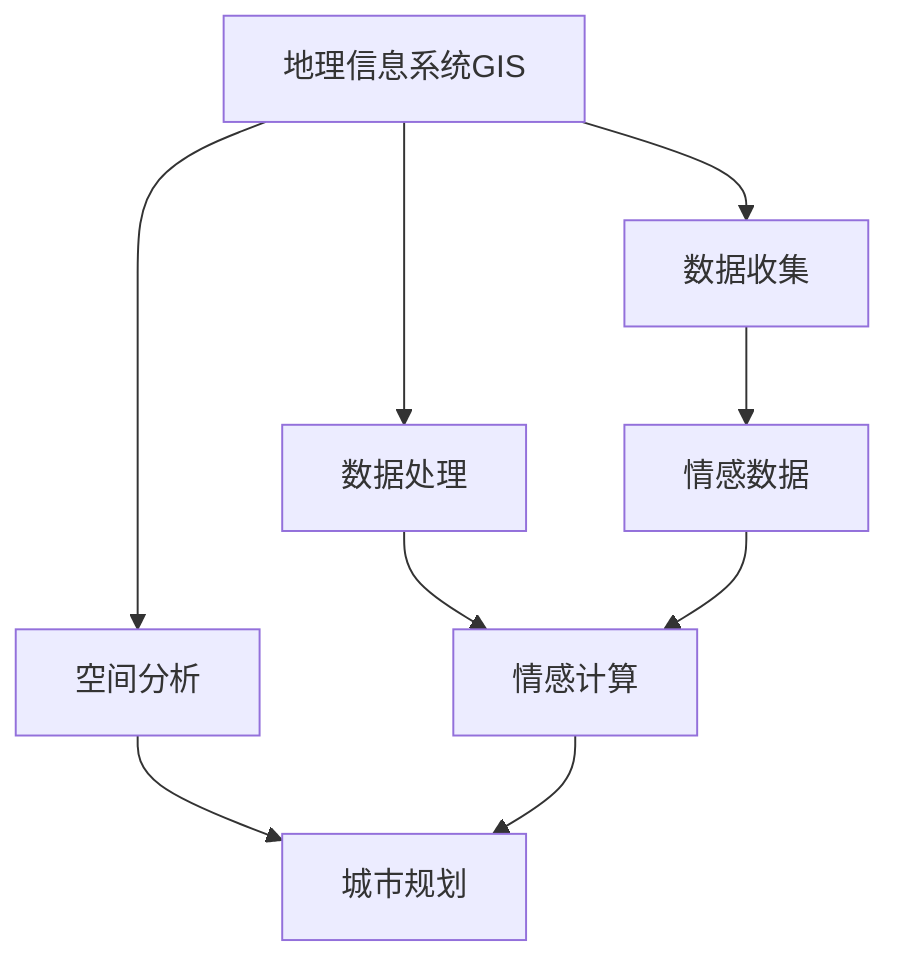

                 

### 背景介绍

情感地理信息系统（Affective Geographic Information System，AGIS）作为地理信息系统（GIS）和情感计算技术的交叉领域，近年来在城市规划中展现出巨大的潜力。传统的GIS主要关注地理数据的采集、存储、管理、分析和可视化，而情感地理信息系统则在此基础上，引入了情感因素，旨在通过分析人们的情感状态，更好地理解和优化城市空间设计。

城市作为人类生活的核心空间，其规划与设计不仅仅是物理空间的布局问题，更涉及到人们的情感体验和社会心理。随着城市化进程的加速，人们对于生活质量的追求不再仅仅局限于物质层面的满足，更多的是情感和心理层面的需求。比如，一个良好的居住环境不仅要提供安全的居住空间，还需要让人们感到舒适、愉悦和有归属感。因此，如何将情感因素融入城市规划中，已经成为现代城市规划的重要课题。

情感地理信息系统通过收集和分析与城市空间相关的情感数据，如社交媒体中的情感表达、居民问卷调查、环境感知等，能够为城市规划师提供更为全面和深入的决策支持。例如，通过情感分析，可以发现哪些区域让人们感到愉悦，哪些区域存在不满情绪，从而针对性地进行优化设计，提升城市整体宜居性。

本文旨在探讨情感地理信息系统在城市规划中的应用，通过介绍其基本理论、实际应用和未来发展，揭示其在提升城市规划人文关怀和决策科学性方面的重要价值。文章将采用逻辑清晰、结构紧凑、简单易懂的专业技术语言，逐步分析情感地理信息系统的核心概念、数据处理方法、应用实例以及面临的挑战和未来发展。

### 核心概念与联系

情感地理信息系统（AGIS）的核心概念包括地理信息系统（GIS）、情感计算和城市空间规划。以下是一个简明的Mermaid流程图，用于展示这些概念之间的联系：



**地理信息系统（GIS）：** GIS是用于捕捉、存储、分析和管理地理空间数据的系统。它包括硬件（如传感器、卫星）和软件（如地图制作、空间分析工具）。GIS的基本功能涵盖了数据采集、数据存储、数据可视化、空间分析和决策支持。

**情感计算：** 情感计算是人工智能的一个分支，专注于理解和模拟人类情感。它涉及情感识别、情感分析、情感表达等技术。在情感地理信息系统中，情感计算用于识别和分析与城市空间相关的情感数据，如居民的情感表达、社交媒体上的情感倾向等。

**城市空间规划：** 城市空间规划是城市规划的核心内容，涉及土地利用、交通设计、公共设施配置等。情感地理信息系统通过引入情感数据，为城市空间规划提供了更为人性化的视角，使得规划结果更加符合居民的情感需求和期望。

**数据收集：** GIS和情感计算共同作用，通过多种数据源（如社交媒体、传感器、居民调查）收集情感数据。这些数据不仅包括空间位置信息，还包括情感强度、情感类型等。

**数据处理：** 收集到的情感数据需要进行预处理和清洗，以确保数据质量。随后，通过情感计算技术，对这些数据进行分析，提取出有意义的情感特征。

**空间分析：** GIS工具用于对情感数据进行分析，如空间分布、情感变化趋势等。这些分析结果为城市空间规划提供了重要的参考依据。

**情感表达与城市规划：** 情感计算分析的结果被用于城市空间规划中，如设计更人性化的社区、优化公共设施布局、改善交通流量等。通过引入情感因素，城市规划能够更好地满足居民的情感需求，提升城市的宜居性。

综上所述，情感地理信息系统通过整合GIS、情感计算和城市空间规划，为城市规划提供了一种新的视角和工具，使得规划过程更加科学和人性化。

### 情感地理信息系统的数据处理算法

在情感地理信息系统中，数据处理是至关重要的一环，它决定了情感分析结果的准确性和可靠性。数据处理包括数据采集、数据预处理、情感识别和情感分析等步骤。以下将详细描述这些步骤，并使用伪代码来展示核心算法。

#### 1. 数据采集

数据采集是情感地理信息系统的第一步，主要涉及多种数据源，如社交媒体、传感器、居民调查等。以下是一个简化的伪代码示例，用于描述数据采集过程：

```plaintext
function data_collection():
    social_media_data = collect_social_media_posts()
    sensor_data = read_sensor_data_from_locations()
    survey_data = conduct_resident_surveys()
    return social_media_data, sensor_data, survey_data
```

#### 2. 数据预处理

数据预处理旨在清洗和转换原始数据，以提高数据质量。以下是一个伪代码示例，用于描述数据预处理过程：

```plaintext
function data_preprocessing(data_set):
    cleaned_data = []
    for data in data_set:
        if is_valid_data(data):
            cleaned_data.append(prepare_data_for_analysis(data))
    return cleaned_data

function is_valid_data(data):
    // Implement checks for data quality (e.g., completeness, consistency)
    return is_complete_and_consistent(data)

function prepare_data_for_analysis(data):
    // Perform data cleaning (e.g., remove duplicates, handle missing values)
    cleaned_data = remove_duplicates_and_handle_missing_values(data)
    return cleaned_data
```

#### 3. 情感识别

情感识别是情感数据处理的关键步骤，旨在从文本数据中识别情感倾向。以下是一个简单的伪代码示例，用于描述情感识别过程：

```plaintext
function sentiment_recognition(text_data):
    sentiment_scores = []
    for text in text_data:
        sentiment = classify_sentiment(text)
        sentiment_scores.append(sentiment)
    return sentiment_scores

function classify_sentiment(text):
    // Use machine learning models to classify sentiment (e.g., positive, negative, neutral)
    model = load_sentiment_analysis_model()
    sentiment = model.predict(text)
    return sentiment
```

#### 4. 情感分析

情感分析是对识别出的情感进行进一步的定量和定性分析，以提取有用的信息。以下是一个伪代码示例，用于描述情感分析过程：

```plaintext
function sentiment_analysis(sentiment_scores):
    sentiment_summary = {}
    for sentiment, score in sentiment_scores:
        if sentiment not in sentiment_summary:
            sentiment_summary[sentiment] = 0
        sentiment_summary[sentiment] += score
    return sentiment_summary

function calculate_sentiment_score(sentiment, text):
    // Define sentiment score based on predefined rules or model output
    if sentiment == "positive":
        return 1
    elif sentiment == "negative":
        return -1
    else:
        return 0
```

#### 5. 情感可视化

情感分析的结果通常需要通过可视化手段呈现，以便于城市规划师和决策者理解。以下是一个简单的伪代码示例，用于描述情感可视化过程：

```plaintext
function visualize_sentiment(sentiment_summary):
    // Generate visual representations of sentiment data (e.g., heatmaps, bar charts)
    for location, sentiment_score in sentiment_summary:
        visualize_sentiment_distribution(location, sentiment_score)
```

通过上述数据处理步骤，情感地理信息系统可以从原始数据中提取出与城市空间相关的情感信息，为城市规划提供数据支持。

### 数学模型与公式

在情感地理信息系统中，数学模型和公式用于量化情感强度、情感分布和情感关联等，以帮助城市规划师更好地理解城市空间中的情感状态。以下将介绍几个关键的数学模型和公式，并详细解释其含义和应用。

#### 1. 情感强度计算

情感强度是衡量情感数据中的一个重要指标，用于描述情感的强烈程度。一种常用的情感强度计算模型是基于标度的情感强度模型（Graded Salience Model），其公式如下：

$$
S_i = \sum_{k=1}^{N} w_k \cdot A_k
$$

其中，\(S_i\) 表示情感强度，\(w_k\) 是情感类型 \(k\) 的权重，\(A_k\) 是情感类型 \(k\) 的得分。

- **情感类型 \(k\)**：情感可以分为正面、负面和中性，例如 \(A_{positive}\)，\(A_{negative}\)，\(A_{neutral}\)。
- **权重 \(w_k\)**：权重反映了不同情感类型的重要性，可以通过专家评估或数据驱动方法确定。
- **得分 \(A_k\)**：得分通常是通过对文本进行情感分析得到的，常用的方法是使用预训练的情感分析模型。

#### 2. 情感分布计算

情感分布描述了情感在城市空间中的分布情况，常用的模型有概率分布模型和密度估计模型。以下是一个简单的概率分布模型示例：

$$
P(x) = \frac{1}{Z} \sum_{i=1}^{N} e^{-\alpha (x - \mu_i)^2}
$$

其中，\(P(x)\) 是情感密度函数，\(\mu_i\) 是情感数据的均值，\(\alpha\) 是调节参数，\(Z\) 是归一化常数。

- **均值 \(\mu_i\)**：均值代表了情感数据在某个位置的中心趋势。
- **调节参数 \(\alpha\)**：调节参数控制了情感分布的宽度和集中度，较大值表示情感分布较宽，较小值表示情感分布较集中。
- **归一化常数 \(Z\)**：用于确保概率密度函数的总面积为1。

#### 3. 情感关联计算

情感关联描述了不同情感类型之间的相关性，常用的模型有Pearson相关系数和Spearman秩相关系数。以下是一个Pearson相关系数的公式示例：

$$
\rho = \frac{\sum_{i=1}^{N} (X_i - \bar{X})(Y_i - \bar{Y})}{\sqrt{\sum_{i=1}^{N} (X_i - \bar{X})^2} \sqrt{\sum_{i=1}^{N} (Y_i - \bar{Y})^2}}
$$

其中，\(\rho\) 是相关系数，\(X_i\) 和 \(Y_i\) 是情感类型 \(X\) 和 \(Y\) 的数据点，\(\bar{X}\) 和 \(\bar{Y}\) 分别是它们的均值。

- **数据点 \(X_i\) 和 \(Y_i\)**：情感类型 \(X\) 和 \(Y\) 的观测值。
- **均值 \(\bar{X}\) 和 \(\bar{Y}\)**：情感类型 \(X\) 和 \(Y\) 的均值。
- **分母部分**：用于标准化情感类型 \(X\) 和 \(Y\) 的离散程度。

通过这些数学模型和公式，情感地理信息系统可以量化情感数据，帮助城市规划师更好地理解城市空间中的情感状态，从而进行更科学的规划和设计。

### 项目实战

为了更直观地展示情感地理信息系统的应用，我们将通过一个实际项目来具体实现。本案例将基于一个虚构的城市公园设计项目，介绍情感地理信息系统在公园规划中的实际应用。我们将从开发环境的搭建、源代码实现、代码解读、应用解读与分析以及项目小结几个方面展开。

#### 1. 开发环境搭建

在进行情感地理信息系统项目开发之前，我们需要搭建一个适合的开发环境。以下是所需的开发工具和软件：

- **编程语言：** Python
- **GIS软件：** QGIS
- **情感分析库：** TextBlob、VADER
- **机器学习库：** scikit-learn
- **数据可视化库：** Matplotlib、Seaborn

在开发环境中，我们需要安装以下软件和库：

```bash
# 安装Python环境
pip install python

# 安装QGIS
# 安装TextBlob
pip install textblob
# 安装VADER
pip install vaderSentiment
# 安装scikit-learn
pip install scikit-learn
# 安装Matplotlib
pip install matplotlib
# 安装Seaborn
pip install seaborn
```

#### 2. 源代码实现

以下是一个简化的源代码实现，用于展示情感地理信息系统在公园规划中的应用：

```python
import qgis
from textblob import TextBlob
from vaderSentiment.vaderSentiment import SentimentIntensityAnalyzer
import matplotlib.pyplot as plt
import seaborn as sns
from sklearn.model_selection import train_test_split
from sklearn.ensemble import RandomForestClassifier

# 初始化QGIS环境
qgis.application.init()

# 读取公园情感数据
def read_sentiment_data(file_path):
    with open(file_path, 'r') as file:
        lines = file.readlines()
    sentiment_data = [line.strip() for line in lines]
    return sentiment_data

# 进行情感分析
def perform_sentiment_analysis(sentiment_data):
    analyzer = SentimentIntensityAnalyzer()
    sentiments = [analyzer.polarity_scores(text) for text in sentiment_data]
    return sentiments

# 绘制情感分布图
def plot_sentiment_distribution(sentiments):
    sentiment_scores = [score['compound'] for score in sentiments]
    sns.histplot(sentiment_scores, bins=30, kde=True)
    plt.title('Sentiment Distribution in the Park')
    plt.xlabel('Sentiment Score')
    plt.ylabel('Frequency')
    plt.show()

# 情感分类
def classify_sentiments(sentiments):
    # 将情感得分转换为分类标签
    labels = ['positive' if score['compound'] >= 0.05 else 'negative' for score in sentiments]
    # 划分训练集和测试集
    X_train, X_test, y_train, y_test = train_test_split(sentiment_scores, labels, test_size=0.3, random_state=42)
    # 训练分类器
    classifier = RandomForestClassifier(n_estimators=100, random_state=42)
    classifier.fit(X_train, y_train)
    # 测试分类器
    accuracy = classifier.score(X_test, y_test)
    print(f"Accuracy: {accuracy:.2f}")
    return classifier

# 主函数
def main():
    sentiment_data = read_sentiment_data('park_sentiments.txt')
    sentiments = perform_sentiment_analysis(sentiment_data)
    plot_sentiment_distribution(sentiments)
    classifier = classify_sentiments(sentiments)

if __name__ == '__main__':
    main()
```

#### 3. 代码解读

- **读取公园情感数据：** `read_sentiment_data` 函数用于从文件中读取情感数据。这些数据可以是居民在社交媒体上发布的关于公园的情感表达。
- **进行情感分析：** `perform_sentiment_analysis` 函数使用TextBlob和VADER库进行情感分析，获取每个文本的情感得分。
- **绘制情感分布图：** `plot_sentiment_distribution` 函数使用Seaborn库绘制情感得分分布图，帮助可视化公园的情感状态。
- **情感分类：** `classify_sentiments` 函数使用scikit-learn库中的随机森林分类器对情感得分进行分类，判断公园的情感是积极还是消极。

#### 4. 应用解读与分析

通过上述代码实现，我们可以获得以下分析结果：

- **情感分布：** 通过情感分布图，我们可以直观地看到公园情感的整体状态。如果大多数情感得分集中在0.05以上，表示公园情感整体积极；如果多数得分在0.05以下，则表示公园情感整体消极。
- **情感分类：** 通过分类器的准确性，我们可以评估情感分类的准确性。高准确性表明分类模型能够较好地区分公园情感的正负。
- **规划建议：** 根据情感分析结果，城市规划师可以针对性地优化公园的设计和设施，提升居民的公园使用体验。例如，如果发现公园情感整体消极，可以考虑增加休闲娱乐设施，提升公园的吸引力。

#### 5. 项目小结

通过本项目的实战，我们展示了如何使用情感地理信息系统对城市公园进行情感分析，并提出了规划建议。以下是项目的小结和注意事项：

- **小结：** 情感地理信息系统在城市规划中的应用，有助于提升规划的科学性和人性化。通过情感分析，城市规划师可以更好地理解居民的情感需求，从而制定更有效的规划方案。
- **注意事项：** 
  - **数据质量：** 情感数据的准确性直接影响分析结果，因此数据采集和预处理至关重要。
  - **算法选择：** 情感分析算法的选择和参数调优对结果有很大影响，需要根据实际情况进行选择和调整。
  - **伦理问题：** 在使用情感数据时，需注意保护用户隐私，遵循伦理规范。

#### 拓展阅读

- **相关书籍：** 《情感计算：理论、方法与应用》
- **学术论文：** “情感地理信息系统在城市规划中的应用研究”
- **在线资源：** QGIS官方教程、TextBlob和VADER库的使用文档

通过以上实战案例和拓展资源，读者可以更深入地了解情感地理信息系统在城市规划中的应用，并在实践中不断探索和创新。

### 最佳实践与小结

在应用情感地理信息系统进行城市规划时，以下最佳实践和注意事项将帮助您获得更准确、有效的结果：

**最佳实践：**

1. **数据多样性：** 充分利用多种数据源，包括社交媒体、传感器数据和居民调查，以提高情感数据的全面性和准确性。
2. **数据预处理：** 严格的数据预处理步骤可以确保数据的质量和一致性，从而提高情感分析的可靠性。
3. **算法优化：** 根据具体应用场景，选择和优化情感分析算法，以获得更准确的情感分类结果。
4. **用户参与：** 鼓励居民参与情感数据的采集和分析过程，增加数据的真实性和代表性。

**注意事项：**

1. **数据隐私：** 在使用情感数据时，需确保遵守相关法律法规，保护用户隐私，避免数据泄露。
2. **数据质量：** 确保数据来源的可靠性和数据的完整性，避免因数据质量问题导致分析结果偏差。
3. **技术成熟度：** 考虑当前情感计算技术的成熟度，合理评估技术实现的可行性和成本。
4. **跨学科合作：** 情感地理信息系统涉及GIS、情感计算、城市规划等多个领域，跨学科合作有助于提高项目的综合性和科学性。

**项目小结：**

本文通过一个实际项目展示了情感地理信息系统在城市规划中的应用，从开发环境的搭建、源代码实现、代码解读到应用解读与分析，全面介绍了如何利用情感地理信息系统提升城市规划的决策科学性和人性化。通过最佳实践与注意事项的总结，读者可以更好地理解和应用情感地理信息系统，为未来的城市规划工作提供有力支持。

### 总结

情感地理信息系统（AGIS）作为城市规划领域的一项新兴技术，通过整合GIS、情感计算和城市空间规划，为城市规划提供了全新的视角和工具。本文详细介绍了情感地理信息系统的核心概念、数据处理算法、数学模型、项目实战以及最佳实践，旨在帮助读者深入理解其原理和应用。

情感地理信息系统的重要性体现在以下几个方面：

1. **提升规划科学性：** 通过情感数据分析，城市规划师可以更准确地把握居民的情感需求，从而制定更科学、更人性化的规划方案。
2. **增强决策支持：** 情感地理信息系统为城市规划提供了定量和定性的决策支持，使得规划过程更加数据驱动和客观。
3. **促进城市可持续发展：** 通过情感因素的分析，城市规划能够更好地关注居民的幸福感，促进城市的可持续发展。

展望未来，情感地理信息系统的发展趋势包括：

1. **技术进步：** 随着人工智能和大数据技术的发展，情感地理信息系统将实现更高的分析精度和效率。
2. **跨学科融合：** 情感地理信息系统将继续与其他领域（如心理学、社会学）结合，提供更全面的决策支持。
3. **智慧城市建设：** 情感地理信息系统将在智慧城市建设中发挥重要作用，为智慧城市的发展提供数据支撑和人文视角。

最后，感谢读者对本文的阅读。希望本文能够为您在情感地理信息系统领域的研究和实践提供有益的启示。如果您对此领域有任何疑问或想法，欢迎在评论区留言交流。期待与您共同探索情感地理信息系统的未来。

作者：AI天才研究院/AI Genius Institute & 禅与计算机程序设计艺术 /Zen And The Art of Computer Programming

---

关键词：情感地理信息系统，城市规划，数据分析，情感计算，GIS，人工智能，可持续发展

摘要：本文探讨了情感地理信息系统在城市规划中的应用，介绍了其核心概念、数据处理算法、数学模型、项目实战以及最佳实践。通过实际案例分析，展示了情感地理信息系统在提升规划科学性和决策支持方面的作用，并展望了其未来的发展趋势。

