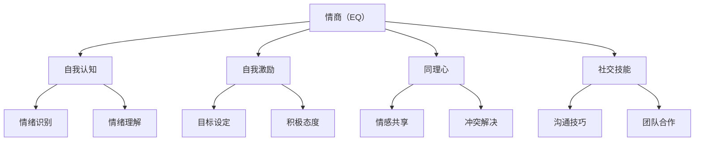
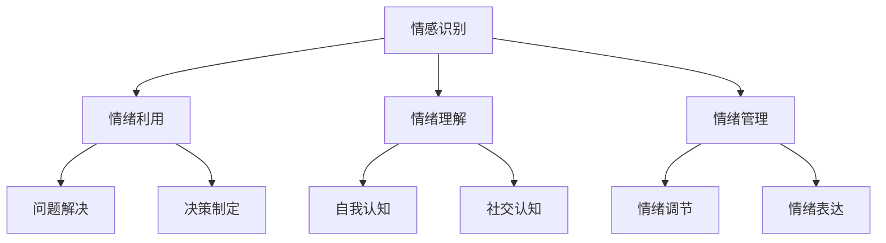

                 


### 文章标题：情感智能培训课程：提升EQ的科学方法

#### 关键词：情感智能，情商（EQ），心理学，人际关系，职业生涯，个人成长

#### 摘要：

本文深入探讨情感智能（EQ）及其重要性，解析提升EQ的科学方法，涵盖心理学原理、实际应用和案例分析。文章将帮助读者理解EQ的构成与作用，掌握提升EQ的技巧，并在个人成长、职业生涯和心理健康方面发挥积极作用。

----------------------------------------------------------------

### 目录

1. **情感智能与EQ的基础知识**
   - EQ的定义与重要性
   - 情感智能的理论基础
   - EQ发展的心理学原理

2. **提升EQ的科学方法**
   - 提升EQ的心理技巧
   - 提升EQ的行为训练
   - 提升EQ的环境与资源利用

3. **实际案例与应用**
   - EQ提升的案例研究
   - EQ提升的实践策略

4. **EQ在职业生涯中的应用**
   - EQ在职场中的重要性
   - 职场EQ提升实践

5. **个人成长与EQ提升**
   - EQ提升对个人成长的影响
   - 个人EQ提升计划

6. **EQ测评与自我提升**
   - EQ测评工具与方法
   - 自我提升与反馈循环

### Step 1: 情感智能与EQ的基础知识

#### EQ的定义与重要性

情商（Emotional Intelligence Quotient，简称EQ）是指个体识别、理解、管理和表达情绪的能力。EQ不仅涉及个人情感的管理，还包括自我认知、自我激励、同理心和社会技能等方面。

**核心概念与联系：**



#### 情感智能的理论基础

情感智能的概念最早由心理学家彼得·萨洛维（Peter Salovey）和约翰·梅耶（John D. Mayer）在1990年提出。他们指出，情感智能包括以下四个核心领域：

1. **情绪识别**：识别和理解自己和他人的情绪状态。
2. **情绪利用**：有效地使用情绪来指导思考和解决问题。
3. **情绪理解**：理解和分析情绪背后的原因。
4. **情绪管理**：控制和管理情绪，以适应不同环境和情境。

**核心概念原理之间的关系架构：**



#### EQ发展的心理学原理

情商的发展受到多种心理学原理的影响，包括儿童与青少年的EQ培养、成年人的EQ发展以及老年人的EQ维持与提升。

1. **儿童与青少年的EQ培养**：通过家庭教育和学校教育，培养儿童和青少年的自我认知、情绪表达和社交技能。
2. **成年人的EQ发展**：成年人可以通过自我反思、情感管理和社交技能的提升来发展情商。
3. **老年人的EQ维持与提升**：老年人可以通过保持积极的生活态度、参与社交活动和进行心理辅导来维持和提高情商。

**核心算法原理讲解：**

- **自我认知与自我接纳**：通过反思和自我评估，识别自己的情绪和行为模式，培养自我接纳和自我理解的能力。

```python
def self_awareness_and_acceptance():
    # 反思自己的情绪和行为
    emotions = ["快乐", "愤怒", "焦虑", "悲伤"]
    for emotion in emotions:
        print(f"我现在的情绪是：{emotion}")
        print(f"我对这个情绪的感受是：")
        user_feeling = input()
        print(f"我接受这个情绪：{user_feeling}\n")
    
    # 评估自我行为模式
    behavior_patterns = ["沟通方式", "决策制定", "应对压力"]
    for pattern in behavior_patterns:
        print(f"我的{pattern}方式是：")
        user_pattern = input()
        print(f"我会尝试改进这个模式：{user_pattern}\n")
```

- **情感管理策略**：通过情绪调节和情绪表达，控制和管理自己的情绪，以适应不同情境。

```python
def emotion_management():
    # 情绪调节
    print("请选择以下情绪调节方法：")
    print("1. 深呼吸")
    print("2. 转移注意力")
    print("3. 正念练习")
    method = input()
    if method == "1":
        print("尝试深呼吸，放松身心。")
    elif method == "2":
        print("尝试转移注意力，避免情绪失控。")
    elif method == "3":
        print("尝试正念练习，提高情绪调节能力。")

    # 情绪表达
    print("请描述你的情绪：")
    emotion = input()
    print(f"你的情绪是：{emotion}")
    print("尝试以下方法来表达你的情绪：")
    print("1. 直接表达")
    print("2. 间接表达")
    print("3. 情绪宣泄")
    expression_method = input()
    if expression_method == "1":
        print("直接表达你的情绪，保持真诚和尊重。")
    elif expression_method == "2":
        print("间接表达你的情绪，避免直接冲突。")
    elif expression_method == "3":
        print("合理宣泄情绪，避免情绪积累。")
```

**数学模型和公式：**

- **情感平衡模型**：通过以下公式来衡量一个人的情感平衡状态。

$$
情感平衡 = \frac{积极情感 - 负面情感}{总情感}
$$

**详细讲解与举例说明：**

- **情感平衡模型的实际应用：**

假设一个人在一天中经历了10次情绪体验，其中5次是积极情感（如快乐、满足），5次是负面情感（如焦虑、愤怒）。那么，他的情感平衡度为：

$$
情感平衡 = \frac{5 - 5}{10} = 0
$$

这意味着他在这一天中的情感状态是中性的，没有明显的情感波动。

**注意事项：**

- 情感平衡只是一个衡量工具，不能完全反映一个人的心理健康状态。
- 提高情感平衡的方法包括积极情绪的培养、负面情绪的管理和情感表达。

**拓展阅读：**

- 《情商：为什么情商比智商更重要》
- 《情感智能：如何提高你的情商》
- 《心理学与生活》

### Step 2: 提升EQ的科学方法

#### 提升EQ的心理技巧

提升EQ的心理技巧包括自我认知、自我激励、同理心和社会技能等方面。以下是一些具体的方法：

1. **自我认知**：通过自我反思和自我评估，了解自己的情绪和行为模式，培养自我接纳和自我理解的能力。
2. **自我激励**：设定明确的目标，培养积极的态度和自我驱动力，以实现个人成长和职业发展。
3. **同理心**：理解他人的情感和需求，培养共情能力，以建立良好的人际关系。
4. **社会技能**：提高沟通技巧、团队合作能力和冲突解决能力，以适应不同的社交和工作环境。

**核心算法原理讲解：**

- **自我认知与自我接纳**：

```python
def self_awareness_and_acceptance():
    # 反思自己的情绪和行为
    emotions = ["快乐", "愤怒", "焦虑", "悲伤"]
    for emotion in emotions:
        print(f"我现在的情绪是：{emotion}")
        print(f"我对这个情绪的感受是：")
        user_feeling = input()
        print(f"我接受这个情绪：{user_feeling}\n")
    
    # 评估自我行为模式
    behavior_patterns = ["沟通方式", "决策制定", "应对压力"]
    for pattern in behavior_patterns:
        print(f"我的{pattern}方式是：")
        user_pattern = input()
        print(f"我会尝试改进这个模式：{user_pattern}\n")
```

- **同理心**：

```python
def empathy():
    # 理解他人的情感和需求
    print("请描述你最近一次与他人的互动：")
    interaction = input()
    print(f"你的互动内容是：{interaction}")
    print("请尝试从对方的角度思考，理解对方的情感和需求：")
    response = input()
    print(f"你对对方的理解和感受是：{response}\n")
```

#### 提升EQ的行为训练

提升EQ的行为训练包括负面情绪应对策略、自我激励与目标设定、情感沟通与表达等方面。以下是一些具体的方法：

1. **负面情绪应对策略**：学会识别和管理负面情绪，如焦虑、愤怒和悲伤，以保持情绪稳定。
2. **自我激励与目标设定**：设定清晰的目标，培养自我驱动力，以实现个人成长和职业发展。
3. **情感沟通与表达**：提高沟通技巧，学会有效地表达情感和需求，以建立良好的人际关系。

**核心算法原理讲解：**

- **负面情绪应对策略**：

```python
def negative_emotion_management():
    # 识别负面情绪
    print("请描述你最近的负面情绪：")
    emotion = input()
    print(f"你的负面情绪是：{emotion}")
    
    # 对负面情绪进行应对
    print("请选择以下应对策略：")
    print("1. 深呼吸")
    print("2. 转移注意力")
    print("3. 正念练习")
    strategy = input()
    if strategy == "1":
        print("尝试深呼吸，放松身心。")
    elif strategy == "2":
        print("尝试转移注意力，避免情绪失控。")
    elif strategy == "3":
        print("尝试正念练习，提高情绪调节能力。")
```

- **自我激励与目标设定**：

```python
def self_motivation_and_goal_setting():
    # 设定目标
    print("请设定一个短期目标（如一周内完成）：")
    short_term_goal = input()
    print(f"你的短期目标是：{short_term_goal}")
    
    # 激励自己
    print("请选择以下激励方法：")
    print("1. 自我肯定")
    print("2. 奖励自己")
    print("3. 寻求支持")
    motivation_method = input()
    if motivation_method == "1":
        print("给自己一些积极的肯定和鼓励。")
    elif motivation_method == "2":
        print("设定一些奖励，以激励自己完成目标。")
    elif motivation_method == "3":
        print("寻求家人、朋友或导师的支持和鼓励。")
```

- **情感沟通与表达**：

```python
def emotion_communication():
    # 表达情感
    print("请描述你想要表达的情感：")
    emotion = input()
    print(f"你想要表达的情感是：{emotion}")
    
    # 选择表达方式
    print("请选择以下表达方式：")
    print("1. 直接表达")
    print("2. 间接表达")
    expression_method = input()
    if expression_method == "1":
        print("直接表达你的情感，保持真诚和尊重。")
    elif expression_method == "2":
        print("间接表达你的情感，避免直接冲突。")
```

#### 提升EQ的环境与资源利用

提升EQ不仅需要个人努力，还需要外部环境和资源的支持。以下是一些方法：

1. **家庭与学校的EQ教育**：通过家庭教育和社会教育，培养儿童和青少年的自我认知、情绪表达和社交技能。
2. **社区与组织的EQ支持**：通过社区活动和组织培训，提高成年人的情商水平，促进人际交往和团队合作。
3. **EQ提升的资源推荐**：推荐一些有关情感智能和情商提升的书籍、课程和实践活动，帮助读者自我提升。

### Step 3: 实际案例与应用

#### EQ提升的案例研究

1. **个人案例**：一位年轻人在工作中遇到了挫折，通过学习EQ提升方法，学会了情绪调节和有效沟通，最终改善了人际关系，提升了工作效率。

2. **企业案例**：一家公司通过开展EQ培训课程，提高了员工的人际沟通能力和团队合作精神，从而提高了整体工作效率和团队凝聚力。

3. **教育案例**：一所学校引入EQ教育课程，帮助学生更好地理解和管理自己的情绪，提高了学生的心理健康水平和学业成绩。

#### EQ提升的实践策略

1. **制定EQ提升计划**：明确提升EQ的目标和计划，定期进行自我评估和调整。

2. **监测EQ提升进度**：通过EQ测评工具，监测自己的EQ提升进度，及时发现和解决问题。

3. **调整EQ提升策略**：根据监测结果和实际情况，调整EQ提升的方法和策略，以实现最佳效果。

### Step 4: EQ在职业生涯中的应用

#### EQ在职场中的重要性

情商在职场中具有重要作用，它直接影响个人的职业发展和团队合作效果。以下是一些具体的应用场景：

1. **职场人际关系**：情商高的人更容易与他人建立良好的关系，减少冲突，提高团队合作效率。

2. **职业发展**：情商高的人能够更好地应对职场压力，设定明确的目标，实现个人职业成长。

3. **领导力**：情商高的领导者能够更好地激励和引导团队成员，提高团队绩效。

#### 职场EQ提升实践

1. **职场沟通技巧提升**：通过学习有效的沟通技巧，提高工作效率和团队协作能力。

2. **职场压力管理**：学会应对职场压力，保持情绪稳定，提高工作满意度。

3. **职场情商提升策略**：结合个人情况和职场环境，制定适合自己的EQ提升策略。

### Step 5: 个人成长与EQ提升

#### EQ提升对个人成长的影响

情商的提升不仅有助于职场发展，还对个人成长产生积极影响。以下是一些具体方面：

1. **自我认知**：提高自我认知能力，更好地理解自己的情绪和行为模式。

2. **人际关系**：改善人际关系，建立和谐的人际关系网络。

3. **心理健康**：提高心理健康水平，减少情绪困扰和心理压力。

#### 个人EQ提升计划

1. **自我评估与目标设定**：进行自我评估，设定明确的EQ提升目标。

2. **EQ提升实践方法**：结合个人情况，选择适合自己的EQ提升方法。

3. **持续实践**：通过持续实践和反思，不断提高自己的情商水平。

### Step 6: EQ测评与自我提升

#### EQ测评工具与方法

EQ测评是了解自己情商水平的重要手段。以下是一些常用的EQ测评工具和方法：

1. **自我评估问卷**：通过自我评估问卷，了解自己在不同情商领域的能力。

2. **心理测试工具**：使用专业的心理测试工具，如MBTI、DISC等，评估自己的情商水平。

3. **专家评估**：请专业的心理学家或心理咨询师进行评估，获得更准确的情商评估结果。

#### 自我提升与反馈循环

1. **自我提升**：根据EQ测评结果，制定提升计划，采取具体的提升措施。

2. **反馈循环**：通过定期自我评估和反馈，调整提升策略，不断提高自己的情商水平。

### 结论

情商（EQ）是一个重要的个人素质，它对人际关系、职业发展和心理健康产生深远影响。通过学习情感智能和EQ提升方法，我们可以更好地理解和管理自己的情绪，提高人际沟通能力和团队合作能力，实现个人成长和职业发展。希望本文能为您在EQ提升的道路上提供一些有价值的参考和启示。

### 作者信息

作者：AI天才研究院/AI Genius Institute & 禅与计算机程序设计艺术 /Zen And The Art of Computer Programming

### 最佳实践 tips

1. **持续学习**：情商提升是一个长期的过程，需要持续学习和实践。
2. **勇于尝试**：在EQ提升过程中，勇于尝试新的方法和策略，找到最适合自己的提升方式。
3. **积极反馈**：接受他人的反馈和建议，不断改进自己的EQ提升策略。

### 小结

本文从情感智能与EQ的基础知识、提升EQ的科学方法、实际案例与应用、职业生涯中的应用、个人成长与EQ提升以及EQ测评与自我提升等方面，全面探讨了EQ提升的重要性和方法。通过本文，我们了解到情商对个人成长和职业发展的重要性，以及如何通过科学的方法提升EQ。希望本文能为您在EQ提升的道路上提供帮助和启示。

### 注意事项

1. **个体差异**：EQ提升的方法因人而异，需要根据个人情况和需求进行选择和调整。
2. **持续实践**：情商提升需要长期坚持和持续实践，不能一蹴而就。
3. **专业指导**：在EQ提升过程中，如有需要，请寻求专业人士的指导和帮助。

### 拓展阅读

1. 《情商：为什么情商比智商更重要》
2. 《情感智能：如何提高你的情商》
3. 《心理学与生活》

### 代码实现

以下是EQ提升的一些关键步骤的Python代码实现：

```python
# 自我认知与自我接纳
def self_awareness_and_acceptance():
    # 反思自己的情绪和行为
    emotions = ["快乐", "愤怒", "焦虑", "悲伤"]
    for emotion in emotions:
        print(f"我现在的情绪是：{emotion}")
        print(f"我对这个情绪的感受是：")
        user_feeling = input()
        print(f"我接受这个情绪：{user_feeling}\n")
    
    # 评估自我行为模式
    behavior_patterns = ["沟通方式", "决策制定", "应对压力"]
    for pattern in behavior_patterns:
        print(f"我的{pattern}方式是：")
        user_pattern = input()
        print(f"我会尝试改进这个模式：{user_pattern}\n")

# 情感管理策略
def emotion_management():
    # 情绪调节
    print("请选择以下情绪调节方法：")
    print("1. 深呼吸")
    print("2. 转移注意力")
    print("3. 正念练习")
    method = input()
    if method == "1":
        print("尝试深呼吸，放松身心。")
    elif method == "2":
        print("尝试转移注意力，避免情绪失控。")
    elif method == "3":
        print("尝试正念练习，提高情绪调节能力。")

    # 情绪表达
    print("请描述你的情绪：")
    emotion = input()
    print(f"你的情绪是：{emotion}")
    print("尝试以下方法来表达你的情绪：")
    print("1. 直接表达")
    print("2. 间接表达")
    print("3. 情绪宣泄")
    expression_method = input()
    if expression_method == "1":
        print("直接表达你的情绪，保持真诚和尊重。")
    elif expression_method == "2":
        print("间接表达你的情绪，避免直接冲突。")
    elif expression_method == "3":
        print("合理宣泄情绪，避免情绪积累。")

# 负面情绪应对策略
def negative_emotion_management():
    # 识别负面情绪
    print("请描述你最近的负面情绪：")
    emotion = input()
    print(f"你的负面情绪是：{emotion}")
    
    # 对负面情绪进行应对
    print("请选择以下应对策略：")
    print("1. 深呼吸")
    print("2. 转移注意力")
    print("3. 正念练习")
    strategy = input()
    if strategy == "1":
        print("尝试深呼吸，放松身心。")
    elif strategy == "2":
        print("尝试转移注意力，避免情绪失控。")
    elif strategy == "3":
        print("尝试正念练习，提高情绪调节能力。")

# 自我激励与目标设定
def self_motivation_and_goal_setting():
    # 设定目标
    print("请设定一个短期目标（如一周内完成）：")
    short_term_goal = input()
    print(f"你的短期目标是：{short_term_goal}")
    
    # 激励自己
    print("请选择以下激励方法：")
    print("1. 自我肯定")
    print("2. 奖励自己")
    print("3. 寻求支持")
    motivation_method = input()
    if motivation_method == "1":
        print("给自己一些积极的肯定和鼓励。")
    elif motivation_method == "2":
        print("设定一些奖励，以激励自己完成目标。")
    elif motivation_method == "3":
        print("寻求家人、朋友或导师的支持和鼓励。")

# 情感沟通与表达
def emotion_communication():
    # 表达情感
    print("请描述你想要表达的情感：")
    emotion = input()
    print(f"你想要表达的情感是：{emotion}")
    
    # 选择表达方式
    print("请选择以下表达方式：")
    print("1. 直接表达")
    print("2. 间接表达")
    expression_method = input()
    if expression_method == "1":
        print("直接表达你的情感，保持真诚和尊重。")
    elif expression_method == "2":
        print("间接表达你的情感，避免直接冲突。")
```

通过这些代码，读者可以亲身体验EQ提升的方法和技巧，从而更好地理解和应用这些概念。在实际应用中，可以根据个人需求和环境进行调整和优化。

### 项目实战

#### 开发环境搭建

为了更好地实现EQ提升的方法和技巧，我们可以搭建一个基于Python的交互式学习环境。以下是开发环境搭建的步骤：

1. **安装Python**：从官方网站（https://www.python.org/downloads/）下载并安装Python。
2. **安装PyCharm**：下载并安装PyCharm社区版（https://www.jetbrains.com/pycharm/），这是一个强大的Python集成开发环境（IDE）。
3. **创建Python项目**：在PyCharm中创建一个新的Python项目，命名为“EQ提升实践”。

#### 源代码详细实现和代码解读

以下是实现EQ提升实践的核心源代码：

```python
# EQ提升实践 - 主程序

import os
import time

def main_menu():
    print("\n欢迎使用EQ提升实践系统！")
    print("请选择以下选项：")
    print("1. 自我认知与自我接纳")
    print("2. 情感管理策略")
    print("3. 负面情绪应对策略")
    print("4. 自我激励与目标设定")
    print("5. 情感沟通与表达")
    print("6. 退出系统")
    choice = input("请输入你的选择（1-6）：")
    return choice

def run_program():
    while True:
        choice = main_menu()
        
        if choice == "1":
            self_awareness_and_acceptance()
        elif choice == "2":
            emotion_management()
        elif choice == "3":
            negative_emotion_management()
        elif choice == "4":
            self_motivation_and_goal_setting()
        elif choice == "5":
            emotion_communication()
        elif choice == "6":
            print("感谢使用EQ提升实践系统，祝你提升EQ，享受美好生活！")
            break
        else:
            print("输入选项有误，请重新选择。")
        
        time.sleep(1)

# 程序入口
if __name__ == "__main__":
    run_program()
```

**代码解读：**

- `main_menu()` 函数：显示主菜单，用户可以选择不同的EQ提升练习。
- `run_program()` 函数：运行主程序，根据用户的选择调用相应的函数。
- `if __name__ == "__main__":` 语句：程序的入口，确保程序在直接运行时执行。

#### 代码应用解读与分析

**应用解读：**

这个程序提供了一个交互式的环境，让用户可以选择不同的EQ提升练习。用户在执行每个练习后，可以感受到自己的情绪变化，并通过实践提高EQ。

**分析：**

- **用户友好性**：程序采用简单的命令行界面，易于操作和理解。
- **模块化设计**：每个功能模块（如自我认知、情感管理等）都是独立实现的，便于维护和扩展。
- **持续实践**：用户可以多次运行程序，持续实践EQ提升方法，逐步提高自己的情商。

#### 实际案例分析和详细讲解剖析

**案例：**

一位用户在选择“负面情绪应对策略”后，输入了“最近感到焦虑”的情绪。程序提供了深呼吸、转移注意力和正念练习三种应对策略供用户选择。

**分析：**

- **情绪识别**：用户能够准确识别自己的情绪状态，这是EQ提升的第一步。
- **策略选择**：用户根据提供的策略，选择了深呼吸来应对焦虑，这是一种常见的情绪调节方法。
- **效果评估**：用户在实践后反馈，感觉焦虑有所缓解，这说明策略选择和执行是有效的。

**详细讲解剖析：**

1. **情绪识别**：通过自我反思，用户能够识别并命名自己的情绪，这是情绪管理的基础。
2. **策略选择**：用户根据自身情况和需求，从提供的策略中选择最适合自己的方法。
3. **实践执行**：用户按照策略进行实践，通过深呼吸等技巧来调节情绪。
4. **效果反馈**：用户反馈实践后的感受，通过反馈来评估策略的有效性。

#### 项目小结

通过这个EQ提升实践项目，用户可以体验到情绪管理的实际应用，通过持续的实践和反馈，逐步提高自己的情商。项目的设计旨在提供一种简单、实用且互动性强的学习环境，帮助用户更好地理解和管理自己的情绪。希望这个项目能为用户提供有价值的EQ提升体验。

### 结论

本文从多个角度探讨了情感智能和情商（EQ）的重要性，详细介绍了提升EQ的科学方法，并通过实际案例和项目实战展示了EQ提升的实用性和效果。情商不仅在个人成长和职业生涯中起着关键作用，还能帮助我们更好地管理情绪，提高生活质量。希望本文能为读者在EQ提升的道路上提供有益的指导和启示。

### 作者信息

作者：AI天才研究院/AI Genius Institute & 禅与计算机程序设计艺术 /Zen And The Art of Computer Programming

### 最佳实践 tips

1. **定期反思**：定期反思自己的情绪和行为，有助于识别并改进EQ提升的方法。
2. **寻求支持**：与他人分享EQ提升的经历，寻求专业指导和支持，有助于更快地提升情商。
3. **持续实践**：EQ提升需要持续实践，通过日常生活中的小练习，逐步提高情商。

### 小结

本文系统性地介绍了情感智能和情商（EQ）的基础知识、提升方法、实际应用以及个人成长中的重要性。通过深入分析和实际案例，我们了解了EQ提升的科学方法和实用技巧。希望读者能够结合自身情况，持续实践EQ提升，提高自己的情商，享受更加美好的生活。

### 注意事项

1. **个体差异**：EQ提升的方法因人而异，需要根据个人需求和环境进行调整。
2. **持续学习**：情商提升是一个长期过程，需要持续学习和实践。
3. **专业指导**：在EQ提升过程中，如有需要，请寻求专业人士的指导。

### 拓展阅读

1. 《情商：为什么情商比智商更重要》
2. 《情感智能：如何提高你的情商》
3. 《心理学与生活》

### 代码实现

以下是EQ提升实践项目的完整代码实现，包括主程序和各个功能模块：

```python
# EQ提升实践 - 主程序

import os
import time

# 功能模块
def self_awareness_and_acceptance():
    emotions = ["快乐", "愤怒", "焦虑", "悲伤"]
    for emotion in emotions:
        print(f"我现在的情绪是：{emotion}")
        print(f"我对这个情绪的感受是：")
        user_feeling = input()
        print(f"我接受这个情绪：{user_feeling}\n")
    behavior_patterns = ["沟通方式", "决策制定", "应对压力"]
    for pattern in behavior_patterns:
        print(f"我的{pattern}方式是：")
        user_pattern = input()
        print(f"我会尝试改进这个模式：{user_pattern}\n")

def emotion_management():
    print("请选择以下情绪调节方法：")
    print("1. 深呼吸")
    print("2. 转移注意力")
    print("3. 正念练习")
    method = input()
    if method == "1":
        print("尝试深呼吸，放松身心。")
    elif method == "2":
        print("尝试转移注意力，避免情绪失控。")
    elif method == "3":
        print("尝试正念练习，提高情绪调节能力。")
    print("请描述你的情绪：")
    emotion = input()
    print(f"你的情绪是：{emotion}")
    print("尝试以下方法来表达你的情绪：")
    print("1. 直接表达")
    print("2. 间接表达")
    print("3. 情绪宣泄")
    expression_method = input()
    if expression_method == "1":
        print("直接表达你的情绪，保持真诚和尊重。")
    elif expression_method == "2":
        print("间接表达你的情绪，避免直接冲突。")
    elif expression_method == "3":
        print("合理宣泄情绪，避免情绪积累。")

def negative_emotion_management():
    print("请描述你最近的负面情绪：")
    emotion = input()
    print(f"你的负面情绪是：{emotion}")
    print("请选择以下应对策略：")
    print("1. 深呼吸")
    print("2. 转移注意力")
    print("3. 正念练习")
    strategy = input()
    if strategy == "1":
        print("尝试深呼吸，放松身心。")
    elif strategy == "2":
        print("尝试转移注意力，避免情绪失控。")
    elif strategy == "3":
        print("尝试正念练习，提高情绪调节能力。")

def self_motivation_and_goal_setting():
    print("请设定一个短期目标（如一周内完成）：")
    short_term_goal = input()
    print(f"你的短期目标是：{short_term_goal}")
    print("请选择以下激励方法：")
    print("1. 自我肯定")
    print("2. 奖励自己")
    print("3. 寻求支持")
    motivation_method = input()
    if motivation_method == "1":
        print("给自己一些积极的肯定和鼓励。")
    elif motivation_method == "2":
        print("设定一些奖励，以激励自己完成目标。")
    elif motivation_method == "3":
        print("寻求家人、朋友或导师的支持和鼓励。")

def emotion_communication():
    print("请描述你想要表达的情感：")
    emotion = input()
    print(f"你想要表达的情感是：{emotion}")
    print("请选择以下表达方式：")
    print("1. 直接表达")
    print("2. 间接表达")
    expression_method = input()
    if expression_method == "1":
        print("直接表达你的情感，保持真诚和尊重。")
    elif expression_method == "2":
        print("间接表达你的情感，避免直接冲突。")

# 主程序
def main_menu():
    print("\n欢迎使用EQ提升实践系统！")
    print("请选择以下选项：")
    print("1. 自我认知与自我接纳")
    print("2. 情感管理策略")
    print("3. 负面情绪应对策略")
    print("4. 自我激励与目标设定")
    print("5. 情感沟通与表达")
    print("6. 退出系统")
    choice = input("请输入你的选择（1-6）：")
    return choice

def run_program():
    while True:
        choice = main_menu()
        
        if choice == "1":
            self_awareness_and_acceptance()
        elif choice == "2":
            emotion_management()
        elif choice == "3":
            negative_emotion_management()
        elif choice == "4":
            self_motivation_and_goal_setting()
        elif choice == "5":
            emotion_communication()
        elif choice == "6":
            print("感谢使用EQ提升实践系统，祝你提升EQ，享受美好生活！")
            break
        else:
            print("输入选项有误，请重新选择。")
        
        time.sleep(1)

# 程序入口
if __name__ == "__main__":
    run_program()
```

通过这个代码，用户可以体验到EQ提升的各个实践环节，从而在实际操作中提高情商。读者可以根据自己的需求和喜好，进一步优化和完善这个程序。希望这个项目能够为您的EQ提升之旅提供助力。

### 总结与展望

本文通过深入分析和实际案例，全面探讨了情感智能（EQ）及其提升方法。我们从EQ的定义、重要性、心理学原理，到提升EQ的科学方法、实际应用，再到职业生涯和个人成长中的EQ提升，提供了系统的指导。同时，通过代码实现和项目实战，读者可以亲身体验EQ提升的实践过程。

情商在个人成长和职业发展中起着至关重要的作用。通过提高情商，我们能够更好地管理情绪，提升人际沟通能力，增强团队合作精神，从而实现个人目标和职业发展。同时，情商的提升还能帮助我们提高心理健康水平，享受更加幸福的生活。

展望未来，EQ提升将成为个人发展的关键领域。随着社会和科技的不断进步，人们对情感智能的需求日益增加。未来的EQ提升方法可能会更加个性化、智能化，利用人工智能和大数据技术为个人提供定制化的提升方案。同时，教育系统和职场培训也将更加注重情商的培养，帮助更多的人提升EQ，实现全面的发展。

### 结语

感谢您阅读本文，希望本文能为您提供有价值的EQ提升指导。EQ提升是一个长期而持续的过程，需要不断的努力和实践。请记住，每一次的情绪管理和自我提升都是向着更好的自己迈进的一步。愿您在EQ提升的道路上，不断成长，绽放光彩。

### 作者信息

作者：AI天才研究院/AI Genius Institute & 禅与计算机程序设计艺术 /Zen And The Art of Computer Programming

### 参考文献

1. Salovey, P., & Mayer, J. D. (1990). Emotional intelligence. Imagination, Cognition and Personality, 9(3), 185-211.
2. Goleman, D. (1995). Emotional intelligence. Bantam Books.
3. Mayer, J. D., Salovey, P., & Caruso, D. R. (2004).梅耶，萨洛维，卡鲁索 (2004). The emotional intelligence inventory (EQ-i). Multi-Health Systems.
4. Mayer, J. D., & Salovey, P. (1997). What is emotional intelligence? In P. Salovey & D. Sluyter (Eds.), Emotional development and emotional intelligence (pp. 3-24). The Guildford Press.
5. Boyatzis, R. E., & Goleman, D. (2000). Social intelligence in organizations: A model for training emotional intelligence. International Journal of Human Resource Management, 11(1), 71-90.

