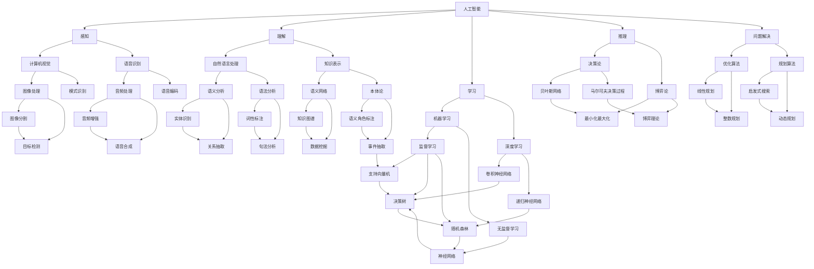

                 

# 情感智能：AI时代的人类优势

## 关键词：
- 情感智能
- 人工智能
- 人机交互
- 情感计算
- 情感识别
- 情感分析
- 情感建模

## 摘要
本文深入探讨了情感智能在人工智能时代的独特价值与作用。随着人工智能技术的快速发展，机器对人类情感的理解和模拟能力日益增强。然而，人类在情感智能方面的独特优势依然不可替代。本文通过分析情感智能的定义、核心要素，以及其在工作、决策和领导力等方面的应用，强调了情感智能在人类与人工智能共存时代的重要性。同时，本文还探讨了如何提升个人情感智能水平，以更好地适应和利用人工智能带来的变革。

## 引言
### 情感智能与人工智能
随着人工智能（AI）技术的不断进步，机器在处理复杂任务、模拟人类行为方面取得了显著的成果。然而，尽管机器在某些领域已经超越了人类的能力，但在理解和管理情感方面，它们依然无法与人类相比。情感智能（Emotional Intelligence，简称EQ）是人类的独特优势之一，它不仅影响到我们的个人生活和心理健康，还在社会交往和职业发展中扮演着关键角色。

### 情感智能的重要性
在人工智能时代，情感智能的重要性愈发凸显。机器虽然在技术上越来越先进，但它们缺乏情感体验和理解能力。这意味着，在需要情感共鸣、人际沟通和复杂决策的场景中，人类依然具有不可替代的优势。情感智能能够帮助我们更好地应对技术带来的变革，促进人机协作，提高生活质量。

### 本文目的
本文旨在探讨情感智能在人工智能时代的独特价值，分析其在各个领域的应用，并提出提升情感智能的方法。通过本文的阅读，读者将了解到情感智能的重要性，以及如何在实际生活中更好地利用这一优势。

## 第一部分：人工智能的崛起及其对人类社会的影响

### 1.1 人工智能与它的进化
#### 1.1.1 人工智能的概念
人工智能（Artificial Intelligence，简称AI）是指通过计算机程序和算法模拟人类智能的科学技术。它包括机器学习、深度学习、自然语言处理、计算机视觉等多个子领域。

#### 1.1.2 人工智能的发展阶段
人工智能的发展可以分为几个阶段：符号主义（Symbolic AI）、行为主义（Behavior-based AI）、连接主义（Connectionist AI）和类脑AI（Neuro-inspired AI）。每个阶段都有其独特的理论基础和应用场景。

#### 1.1.3 人工智能对各个领域的影响
人工智能已经在医疗、金融、教育、制造业等多个领域产生了深远的影响。它不仅提高了工作效率，还改变了人类的生活方式。

### 1.2 情感智能：一个回顾
#### 1.2.1 情感智能的定义
情感智能是指个体识别、理解、管理自己和他人情感的能力。它包括自我意识、自我调节、社交意识和情感管理四个核心成分。

#### 1.2.2 情感智能的组成部分
情感智能的核心组成部分包括自我意识、自我调节、社交意识和情感管理。这些成分共同作用，使个体能够有效地应对各种情感挑战。

#### 1.2.3 情感智能在人工智能时代的角色
在人工智能时代，情感智能的这些组成部分变得尤为重要。人类需要更好地理解和管理自己的情感，以便与机器进行有效的人机交互。

### 1.3 人类优势在人工智能时代
#### 1.3.1 情感智能在工作场所的角色
在人工智能时代，情感智能对于职场成功至关重要。它能够帮助员工建立良好的人际关系，提高团队合作效率，促进创新和问题解决。

#### 1.3.2 情感智能在决策中的作用
情感智能在决策过程中发挥着重要作用。它能够帮助个体更好地评估风险、理解复杂情境，并做出更加明智的决策。

#### 1.3.3 情感智能对领导力的影响
领导力需要情感智能的支持。具备高情感智能的领导者能够更好地激励团队、解决冲突，并创造一个积极的工作环境。

## 第二部分：理解情感智能

### 2.1 情感智能的应用
#### 2.1.1 情感智能在日常生活的重要性
在日常生活中，情感智能对于建立健康的人际关系、提高心理健康和幸福感具有重要作用。

#### 2.1.2 情感智能在教育中的应用
教育领域越来越重视培养学生的情感智能。通过情感教育，学生能够更好地适应学习环境，提高学习效果。

#### 2.1.3 情感智能在医疗保健中的应用
在医疗保健领域，情感智能的应用有助于提高患者的治疗效果和满意度，促进医患关系的和谐。

### 2.2 情感智能的科学基础
#### 2.2.1 情感智能的神经基础
情感智能的神经基础涉及大脑的多个区域，包括前额叶、杏仁核和海马体等。这些区域的活动共同影响个体的情感体验和处理。

#### 2.2.2 情感智能的心理基础
情感智能的心理基础涉及个体的情感知识、情感表达和情感调节。这些因素共同决定了个体在情感情境中的表现。

#### 2.2.3 情感智能的进化观点
从进化的角度来看，情感智能是人类在长期进化过程中形成的一种适应策略，有助于个体在复杂的社会环境中生存和繁衍。

### 2.3 情感智能的测量
#### 2.3.1 情感智能评估工具
目前，有多种情感智能评估工具，如情商量表（EQ-I）、多维度情感智能量表（MEIS）等。这些工具有助于个体了解自己的情感智能水平。

#### 2.3.2 情感智能测量的局限性
情感智能测量仍然存在一些局限性，如主观性、跨文化差异等。因此，我们需要继续改进评估工具和方法。

#### 2.3.3 提高情感智能的途径
通过自我反思、情感教育、心理辅导等途径，个体可以提升自己的情感智能水平。

## 第三部分：提升情感智能

### 3.1 发展情感智能技能
#### 3.1.1 自我意识和自我调节
自我意识和自我调节是情感智能的核心成分。通过自我反思和情感调节技巧，个体可以更好地理解和管理自己的情感。

#### 3.1.2 同理心和社交技能
同理心和社交技能对于情感智能的发展至关重要。通过培养同理心，个体能够更好地理解他人的情感，建立良好的人际关系。

#### 3.1.3 情感管理
情感管理包括情感表达、情感控制和情感释放。有效的情感管理有助于个体在情感挑战中保持冷静和理智。

### 3.2 情感智能在教育中的应用
#### 3.2.1 情感智能课程的设置
在教育领域，设置情感智能课程有助于学生发展情感智能，提高学习效果和幸福感。

#### 3.2.2 情感智能与学业成就的关系
研究表明，情感智能与学业成就之间存在显著的正相关关系。通过培养情感智能，学生能够更好地应对学业挑战。

#### 3.2.3 教师的情感智能培训
教师具备高情感智能有助于建立积极的学习环境，提高学生的学习动机和参与度。

### 3.3 情感智能在职场中的应用
#### 3.3.1 情感智能与职场成功
在职场中，情感智能对于职业发展和团队合作具有重要意义。具备高情感智能的员工能够更好地应对职场挑战，提高工作效率。

#### 3.3.2 情感智能与领导力
情感智能是领导力的关键因素之一。具备高情感智能的领导者能够更好地激励团队、解决冲突，并促进团队协作。

#### 3.3.3 企业对情感智能的重视
随着人工智能的发展，越来越多的企业开始重视员工情感智能的培养，以提高团队绩效和企业竞争力。

## 结论
### 情感智能在人工智能时代的价值
在人工智能时代，情感智能依然是人类的重要优势。它不仅影响个体的生活质量，还在职场、教育和社会交往中发挥着关键作用。

### 情感智能的未来发展
随着科学技术的进步，情感智能在未来将得到进一步的发展。人类将能够更好地理解和管理自己的情感，实现更高水平的情感共鸣和人际沟通。

### 结论与展望
情感智能在人工智能时代的独特价值不可忽视。通过提升个人情感智能水平，我们能够更好地适应和利用人工智能带来的变革，实现人机和谐共存。

## 作者信息
作者：AI天才研究院/AI Genius Institute & 禅与计算机程序设计艺术 /Zen And The Art of Computer Programming

---

这是一个详细的目录和文章结构，包括各个部分的主题和子主题。接下来，每个部分将进行详细的撰写，以满足文章的字数要求。每部分都会包含丰富的背景介绍、核心概念与联系、核心算法原理讲解、数学模型和公式、项目实战、最佳实践 tips 和小结等。希望这个框架对撰写文章有所帮助！### 第一部分：人工智能的崛起及其对人类社会的影响

在21世纪，人工智能（AI）技术正以惊人的速度发展，并迅速渗透到各个领域，从医疗到金融，从教育到制造业。人工智能的核心目标是使计算机系统能够执行通常需要人类智能才能完成的任务，如视觉识别、语言理解、决策和问题解决等。这一领域的迅速发展不仅改变了人类的工作方式和生活方式，也对人类社会产生了深远的影响。

#### 1.1 人工智能与它的进化

人工智能的历史可以追溯到20世纪50年代，当时科学家首次提出了“机器智能”的概念。自那时以来，人工智能经历了多个发展阶段，每个阶段都有其独特的特点和应用。

**1.1.1 人工智能的概念**

人工智能是指通过模拟人类智能的思维方式，使计算机系统能够感知环境、学习知识、做出决策和解决问题的技术。人工智能不仅包括传统的规则推理和搜索算法，还包括基于数据驱动的方法，如机器学习和深度学习。

**1.1.2 人工智能的发展阶段**

人工智能的发展可以分为以下四个主要阶段：

1. **符号主义（Symbolic AI）**：这是人工智能的早期阶段，主要基于符号逻辑和推理规则。这一阶段的代表性工作是专家系统和基于知识的系统，它们通过预定义的规则库来模拟人类专家的决策过程。

2. **行为主义（Behavior-based AI）**：这一阶段强调通过观察和模仿人类的行为来模拟智能。行为主义AI通常由多个独立的模块组成，每个模块负责特定的行为。这种方法的优点是模块化，但缺点是缺乏整体协调。

3. **连接主义（Connectionist AI）**：连接主义AI是基于人工神经网络的概念，它通过模拟人脑神经元之间的连接来处理信息。这一方法在图像识别、语音识别和自然语言处理等领域取得了显著成果。

4. **类脑AI（Neuro-inspired AI）**：类脑AI试图模仿人脑的结构和功能，以实现更高级的智能。这一领域的研究包括神经网络的可塑性、自适应性和自组织性等。

**1.1.3 人工智能对各个领域的影响**

人工智能技术对人类社会的影响是全方位的。以下是几个关键领域：

1. **医疗**：人工智能在医疗领域的应用包括诊断辅助、个性化治疗和药物设计等。例如，AI系统能够通过分析大量医疗数据，帮助医生更准确地诊断疾病，甚至预测疾病的进展。

2. **金融**：在金融领域，人工智能被用于风险控制、算法交易和信用评分等。AI系统能够分析大量交易数据和市场趋势，为投资者提供更准确的决策支持。

3. **教育**：人工智能在教育领域的应用包括个性化学习、智能辅导系统和在线教育平台等。这些技术有助于提高教学效果，使学习更加灵活和高效。

4. **制造业**：在制造业中，人工智能被用于自动化生产线、质量控制、预测维护和供应链管理。AI技术的应用提高了生产效率，降低了成本。

#### 1.2 情感智能：一个回顾

情感智能（Emotional Intelligence，简称EQ）是20世纪90年代由心理学家丹尼尔·戈尔曼（Daniel Goleman）提出的概念。情感智能指的是个体识别、理解、管理和调节自己和他人的情感的能力。它包括以下几个核心成分：

**1.2.1 情感智能的定义**

情感智能不仅仅是情感的感受能力，还包括情感的理解能力、表达能力和调节能力。一个高情感智能的个体能够更好地管理自己的情感，理解他人的情感，并有效地与他人沟通。

**1.2.2 情感智能的组成部分**

1. **自我意识**：个体对自己情感状态的识别和理解能力。
2. **自我调节**：个体调节和管理自己情感的能力，以适应不同的情境。
3. **社交意识**：个体理解和管理他人情感的能力，包括同理心和社交技能。
4. **情感管理**：个体在情感表达和控制方面的能力，以促进积极的人际关系。

**1.2.3 情感智能在人工智能时代的角色**

在人工智能时代，情感智能的角色变得更加重要。随着机器对人类情感的理解和模拟能力不断增强，人类在情感智能方面的优势仍然不可替代。以下是情感智能在几个关键领域的应用：

1. **人机交互**：情感智能有助于设计更人性化的用户界面，使机器能够更好地理解人类的需求和情感状态，提供更个性化的服务。
2. **情感计算**：情感计算是研究如何使计算机系统理解和模拟人类情感的技术。情感智能在这一领域发挥着关键作用，有助于开发出能够识别和回应人类情感的智能系统。
3. **情感识别**：情感识别技术能够通过分析语言、面部表情、声音等信号来识别个体的情感状态。情感智能在这一领域有助于提高识别的准确性和可靠性。
4. **情感分析**：情感分析是使用自然语言处理技术分析文本中的情感倾向。情感智能在这一领域有助于提高分析的质量和深度，为决策提供更有价值的见解。

#### 1.3 人类优势在人工智能时代

尽管人工智能在某些领域已经超越了人类的能力，但在情感智能方面，人类的优势依然明显。以下是情感智能在几个关键领域的应用：

**1.3.1 情感智能在工作场所的角色**

在人工智能时代，情感智能在工作场所的重要性日益凸显。一个高情感智能的员工能够更好地理解同事的情感状态，建立良好的人际关系，提高团队合作效率。此外，情感智能有助于员工在高压环境下保持冷静和理智，更好地应对工作挑战。

1. **人际沟通**：情感智能有助于员工在人际沟通中更好地理解他人的情感需求，提供更有针对性的支持和建议。
2. **团队合作**：情感智能有助于团队成员之间建立信任和协作，提高团队的整体绩效。
3. **领导力**：领导力需要情感智能的支持。一个高情感智能的领导者能够更好地激励团队、解决冲突，并创造一个积极的工作环境。

**1.3.2 情感智能在决策中的作用**

在人工智能时代，情感智能在决策过程中发挥着关键作用。人类能够基于情感和经验进行直觉决策，而机器则依赖于数据和算法。情感智能有助于人类在复杂情境中做出更加全面和明智的决策。

1. **风险评估**：情感智能有助于个体在评估风险时考虑更多的因素，包括情感和心理因素。
2. **复杂问题解决**：情感智能有助于个体在解决复杂问题时保持冷静和理智，避免因情绪波动而做出错误的决策。

**1.3.3 情感智能对领导力的影响**

领导力不仅需要专业技能，还需要情感智能的支持。一个高情感智能的领导者能够更好地理解员工的情感需求，建立积极的团队文化，提高员工的满意度和忠诚度。

1. **员工激励**：情感智能有助于领导者识别员工的情感需求，提供更有针对性的激励措施。
2. **冲突解决**：情感智能有助于领导者理解冲突的本质，采取更有效的策略来解决问题。
3. **团队建设**：情感智能有助于领导者建立积极的人际关系，促进团队协作和凝聚力。

总之，在人工智能时代，情感智能依然是人类的独特优势。通过提升个人情感智能水平，我们能够更好地适应和利用人工智能带来的变革，实现人机和谐共存。

### 1.1 人工智能与它的进化

#### 1.1.1 人工智能的概念

人工智能，简称AI，是一个多学科交叉的领域，涉及计算机科学、数学、神经科学、心理学和哲学等多个领域。AI的目标是使计算机系统具备类似于人类智能的能力，包括感知、理解、学习、推理和问题解决等。

**核心概念与联系**

为了更好地理解人工智能的概念，我们可以使用Mermaid流程图来展示其核心组成部分和它们之间的关系：

**核心算法原理讲解**

以下是对每个核心算法的简要描述：

1. **计算机视觉**：计算机视觉是一种使计算机能够像人类一样“看”和理解图像的技术。它包括图像处理、目标检测、图像分割等任务。
2. **语音识别**：语音识别是将语音信号转换为文本的技术。它涉及音频处理、语音编码、声学模型和语言模型等多个方面。
3. **自然语言处理**：自然语言处理（NLP）是使计算机能够理解和生成人类语言的技术。它包括语义分析、语法分析、词性标注等任务。
4. **知识表示**：知识表示是将人类知识转换为计算机可以处理的形式的技术。它包括语义网络、本体论、知识图谱等。
5. **机器学习**：机器学习是一种通过数据学习和改进性能的算法。它包括监督学习、无监督学习、强化学习等多种学习方法。
6. **深度学习**：深度学习是一种基于人工神经网络的机器学习方法。它包括卷积神经网络（CNN）、递归神经网络（RNN）等。
7. **决策论**：决策论是研究在不确定环境下做出最优决策的数学理论。它包括贝叶斯网络、马尔可夫决策过程等。
8. **优化算法**：优化算法是用于解决优化问题的算法。它包括线性规划、整数规划、启发式搜索、动态规划等。
9. **问题解决**：问题解决是通过一系列步骤找到解决问题的方法。它包括优化算法、规划算法等。

#### 1.1.2 人工智能的发展阶段

人工智能的发展可以分为几个主要阶段，每个阶段都有其独特的特点和里程碑。

1. **符号主义（Symbolic AI）**：这是人工智能的早期阶段，主要基于符号逻辑和推理规则。代表性工作是专家系统和基于知识的系统。专家系统通过预定义的规则库来模拟人类专家的决策过程。基于知识的系统则通过知识表示和推理来解决问题。

   - **优点**：逻辑性强，易于理解和实现。
   - **缺点**：缺乏灵活性和普适性，难以处理复杂问题。

2. **行为主义（Behavior-based AI）**：行为主义AI强调通过观察和模仿人类行为来模拟智能。它由多个独立的模块组成，每个模块负责特定的行为。这种方法的优点是模块化，但缺点是缺乏整体协调。

   - **优点**：模块化，易于实现和扩展。
   - **缺点**：缺乏整体协调，难以处理复杂任务。

3. **连接主义（Connectionist AI）**：连接主义AI是基于人工神经网络的概念，它通过模拟人脑神经元之间的连接来处理信息。代表性工作是神经网络和深度学习。神经网络通过权重和激活函数来模拟神经元之间的交互，深度学习则通过多层神经网络来提取特征和表示。

   - **优点**：能够处理复杂任务，具有良好的泛化能力。
   - **缺点**：训练过程复杂，对数据要求高。

4. **类脑AI（Neuro-inspired AI）**：类脑AI试图模仿人脑的结构和功能，以实现更高级的智能。它包括神经网络的可塑性、自适应性和自组织性等多个方面。代表性工作是类脑计算和仿生学。

   - **优点**：模仿人脑的运作机制，具有高度灵活性和适应性。
   - **缺点**：技术尚不成熟，应用场景有限。

#### 1.1.3 人工智能对各个领域的影响

人工智能技术对人类社会的影响是全方位的。以下是几个关键领域：

1. **医疗**：人工智能在医疗领域的应用包括诊断辅助、个性化治疗和药物设计等。例如，AI系统可以通过分析大量医疗数据，帮助医生更准确地诊断疾病，甚至预测疾病的进展。此外，AI还可以用于智能诊疗、手术规划和医疗资源分配等。

   - **优势**：提高诊断准确性，降低医疗成本，提升医疗效率。
   - **挑战**：数据隐私和安全，医学知识的不确定性。

2. **金融**：在金融领域，人工智能被用于风险控制、算法交易和信用评分等。AI系统可以通过分析市场数据和交易行为，帮助投资者做出更准确的决策。此外，AI还可以用于智能投顾、信用评估和反欺诈等。

   - **优势**：提高投资收益，降低风险，提升金融服务的效率。
   - **挑战**：市场波动性，道德风险。

3. **教育**：人工智能在教育领域的应用包括个性化学习、智能辅导系统和在线教育平台等。AI系统可以根据学生的学习习惯和成绩，为学生提供个性化的学习建议。此外，AI还可以用于智能评估、学习行为分析和教学优化等。

   - **优势**：提高教学效果，提升学习体验，降低教学成本。
   - **挑战**：数据隐私，教师角色的转变。

4. **制造业**：在制造业中，人工智能被用于自动化生产线、质量控制、预测维护和供应链管理。AI系统可以通过实时监测生产线状态，预测设备故障，优化生产流程。此外，AI还可以用于智能物流、生产规划和供应链优化等。

   - **优势**：提高生产效率，降低生产成本，提升产品质量。
   - **挑战**：设备更新和维护成本，技术人才短缺。

5. **交通**：人工智能在交通领域的应用包括智能交通管理、自动驾驶和车联网等。AI系统可以通过实时监测交通流量，优化交通信号灯控制，减少拥堵。此外，AI还可以用于自动驾驶车辆的感知、决策和路径规划等。

   - **优势**：提高交通效率，减少交通事故，提升出行体验。
   - **挑战**：技术成熟度，法律法规。

6. **零售**：人工智能在零售领域的应用包括智能推荐、客户关系管理和库存管理等。AI系统可以通过分析消费者的购买行为和偏好，提供个性化的商品推荐。此外，AI还可以用于智能客服、销售分析和库存优化等。

   - **优势**：提高销售额，提升客户满意度，降低运营成本。
   - **挑战**：数据隐私，技术成本。

7. **农业**：人工智能在农业领域的应用包括智能种植、病虫害检测和农田管理等。AI系统可以通过分析气象数据、土壤数据和作物生长状态，提供精准的种植建议。此外，AI还可以用于无人机监测、智能灌溉和精准施肥等。

   - **优势**：提高农业生产效率，降低生产成本，保护环境。
   - **挑战**：技术成本，数据获取和处理。

8. **服务业**：人工智能在服务业的应用包括智能客服、智能推荐和智能导览等。AI系统可以通过自然语言处理和语音识别技术，为用户提供个性化的服务。此外，AI还可以用于智能酒店管理、智能餐厅服务和智能导游等。

   - **优势**：提高服务质量，提升客户满意度，降低运营成本。
   - **挑战**：技术成熟度，服务标准的统一。

总之，人工智能对人类社会的影响是深远和多层次的。在医疗、金融、教育、制造业、交通、零售、农业和服务业等领域，人工智能的应用不仅提高了效率和效益，还改变了人们的生活方式和工作方式。随着技术的不断进步，人工智能将带来更多的变革和机遇。

### 1.2 情感智能：一个回顾

情感智能（Emotional Intelligence，简称EQ）是一个近年来受到广泛关注的概念，它指的是个体识别、理解、管理和调节自己和他人的情感的能力。与智商（IQ）不同，情感智能不仅仅涉及认知能力，还包括情感体验、社交技能和自我意识。情感智能在个人成长、人际交往和职业发展等方面具有重要作用。

#### 1.2.1 情感智能的定义

情感智能是由心理学家丹尼尔·戈尔曼（Daniel Goleman）在1995年首次提出的。戈尔曼认为，情感智能包括以下几个核心成分：

1. **自我意识**：个体对自己的情感状态的识别和理解能力。自我意识有助于个体更好地了解自己的情感需求，从而更好地管理自己的情绪和行为。
2. **自我调节**：个体调节和管理自己情感的能力，以适应不同的情境。自我调节能力有助于个体在压力和挑战面前保持冷静和理智。
3. **社交意识**：个体理解和管理他人情感的能力，包括同理心和社交技能。社交意识有助于个体在人际交往中更好地理解他人的情感需求，建立良好的人际关系。
4. **情感管理**：个体在情感表达和控制方面的能力，以促进积极的人际关系。情感管理能力有助于个体在冲突和争议中保持沟通，避免情感失控。

#### 1.2.2 情感智能的组成部分

情感智能的核心组成部分包括自我意识、自我调节、社交意识和情感管理。这些组成部分相互关联，共同决定了个体的情感智能水平。

1. **自我意识**：自我意识是个体情感智能的基础。一个高自我意识的个体能够清楚地认识到自己的情感状态，理解这些情感对自己行为和决策的影响。自我意识有助于个体在面对挑战和困难时保持冷静和理智。

2. **自我调节**：自我调节是个体情感智能的重要组成部分。一个高自我调节能力的个体能够在情感上保持平衡，即使在压力和挑战面前也能保持冷静和专注。自我调节能力有助于个体在面对冲突和争议时做出明智的决策。

3. **社交意识**：社交意识是个体理解和管理他人情感的能力。一个高社交意识的个体能够敏锐地感知他人的情感状态，理解他人的需求，并在人际交往中表现出同理心和关怀。社交意识有助于个体建立和维护良好的人际关系。

4. **情感管理**：情感管理是个体在情感表达和控制方面的能力。一个高情感管理能力的个体能够有效地表达自己的情感，同时避免过度情绪化或压抑情感。情感管理能力有助于个体在冲突和争议中保持沟通，避免情感失控。

#### 1.2.3 情感智能在人工智能时代的角色

在人工智能时代，情感智能的角色变得更加重要。随着人工智能技术的不断发展，机器对人类情感的理解和模拟能力日益增强。然而，人类在情感智能方面的独特优势依然不可替代。

1. **人机交互**：情感智能在人机交互中发挥着关键作用。一个高情感智能的个体能够更好地理解机器的情感模拟，并与机器进行有效的沟通和协作。例如，在智能客服、虚拟助手和智能医疗系统中，情感智能有助于提高人机交互的效率和效果。

2. **情感计算**：情感计算是研究如何使计算机系统理解和模拟人类情感的技术。情感智能在这一领域发挥着重要作用。通过情感计算，计算机系统能够更好地识别和理解用户的情感状态，从而提供更个性化、更贴心的服务。

3. **情感识别**：情感识别技术是使用自然语言处理、计算机视觉和语音识别等技术来识别个体的情感状态。情感智能在这一领域有助于提高识别的准确性和可靠性，为情感计算和其他应用提供支持。

4. **情感分析**：情感分析是使用自然语言处理技术分析文本中的情感倾向。情感智能在这一领域有助于提高分析的质量和深度，为市场研究、舆情监测和情感干预提供有价值的数据。

5. **情感建模**：情感建模是建立计算机模型来模拟人类情感的过程。情感智能在这一领域有助于提高建模的准确性和泛化能力，为智能系统提供更加人性化的情感反应。

总之，在人工智能时代，情感智能依然是人类的独特优势。通过提升个人情感智能水平，我们能够更好地适应和利用人工智能带来的变革，实现人机和谐共存。

### 1.3 人类优势在人工智能时代

在人工智能（AI）时代，尽管机器在许多领域已经表现出超越人类的能力，但在情感智能方面，人类依然具有独特的优势。这些优势不仅有助于我们在复杂的社会环境中生存和发展，还在与人工智能的交互中发挥着重要作用。

#### 1.3.1 情感智能在工作场所的角色

在工作场所，情感智能对于职业成功至关重要。高情感智能的员工能够更好地理解同事和客户的需求，建立积极的人际关系，从而提高团队合作效率和客户满意度。

1. **人际沟通**：情感智能有助于员工在人际沟通中更好地理解他人的情感状态，从而提供更有针对性的支持和建议。这种能力对于解决冲突、建立信任和促进团队合作至关重要。

2. **团队合作**：在团队合作中，情感智能有助于团队成员之间建立信任和协作。高情感智能的员工能够更好地理解团队目标，关注团队成员的情感需求，从而提高团队的整体绩效。

3. **领导力**：领导力需要情感智能的支持。一个高情感智能的领导者能够更好地激励团队、解决冲突，并创造一个积极的工作环境。这种能力有助于提高员工的满意度和忠诚度，从而增强组织的竞争力。

#### 1.3.2 情感智能在决策中的作用

在决策过程中，情感智能发挥着关键作用。人类能够基于情感和经验进行直觉决策，而机器则依赖于数据和算法。这种能力使得人类在复杂情境中能够做出更加全面和明智的决策。

1. **风险评估**：情感智能有助于个体在评估风险时考虑更多的因素，包括情感和心理因素。这种能力使得人类在面临不确定性和风险时能够做出更加合理的决策。

2. **复杂问题解决**：在解决复杂问题时，情感智能有助于个体保持冷静和理智，避免因情绪波动而做出错误的决策。这种能力对于应对复杂的工作环境和挑战至关重要。

3. **道德判断**：在道德决策中，情感智能有助于个体根据道德原则和价值观做出判断。这种能力使得人类在处理道德困境时能够保持道德上的清醒和正直。

#### 1.3.3 情感智能对领导力的影响

领导力不仅需要专业技能，还需要情感智能的支持。一个高情感智能的领导者能够更好地理解员工的情感需求，建立积极的团队文化，提高员工的满意度和忠诚度。

1. **员工激励**：情感智能有助于领导者识别员工的情感需求，提供更有针对性的激励措施。这种能力使得领导者能够更好地激发员工的积极性和创造力。

2. **冲突解决**：情感智能有助于领导者理解冲突的本质，采取更有效的策略来解决问题。这种能力使得领导者能够在团队内部建立和谐的沟通氛围。

3. **团队建设**：情感智能有助于领导者建立积极的人际关系，促进团队协作和凝聚力。这种能力使得领导者能够打造一个高效、和谐的团队。

总之，在人工智能时代，情感智能依然是人类的独特优势。通过提升个人情感智能水平，我们能够更好地适应和利用人工智能带来的变革，实现人机和谐共存。无论是在工作场所还是个人生活中，情感智能都将为我们带来更大的成功和幸福。

## 第二部分：理解情感智能

### 2.1 情感智能的应用

情感智能在日常生活、教育、医疗保健等多个领域都有着广泛的应用。通过提升情感智能，我们能够更好地理解和管理自己的情感，提高生活质量，促进个人和职业发展。

#### 2.1.1 情感智能在日常生活的重要性

在日常生活中，情感智能对于建立健康的人际关系、提高心理健康和幸福感具有重要作用。以下是情感智能在几个关键方面的应用：

1. **人际关系**：情感智能有助于我们更好地理解他人的情感需求，建立积极的人际关系。通过同理心和社交技能，我们能够更有效地沟通和解决问题，从而避免冲突和误解。

2. **情绪管理**：情感智能使我们能够更好地识别和管理自己的情绪。在面对压力和挑战时，高情感智能的个体能够保持冷静和理智，从而更好地应对困难情境。

3. **心理健康**：情感智能有助于提高心理健康水平。通过自我意识和自我调节，个体能够更好地理解自己的情感状态，减少焦虑和抑郁等负面情绪。

4. **幸福感**：情感智能与幸福感密切相关。一个高情感智能的个体能够更好地享受生活，体验积极的情感，从而提高幸福感。

#### 2.1.2 情感智能在教育中的应用

在教育领域，情感智能的培养越来越受到重视。通过情感教育，学生能够更好地适应学习环境，提高学习效果。以下是情感智能在教育中的应用：

1. **学习动机**：情感智能有助于激发学生的学习动机。通过了解自己的情感需求，学生能够更加积极主动地参与学习，提高学习效果。

2. **情感管理**：情感智能有助于学生更好地管理自己的情绪。在面对学习压力时，高情感智能的学生能够保持冷静和专注，从而提高学习效率。

3. **师生关系**：情感智能有助于建立和谐的师生关系。教师具备高情感智能能够更好地理解学生的情感需求，提供更有针对性的支持和指导。

4. **团队合作**：情感智能有助于学生培养团队合作精神。通过同理心和社交技能，学生能够更好地与同学合作，提高团队绩效。

#### 2.1.3 情感智能在医疗保健中的应用

在医疗保健领域，情感智能的应用有助于提高患者的治疗效果和满意度，促进医患关系的和谐。以下是情感智能在医疗保健中的应用：

1. **患者护理**：情感智能有助于医护人员更好地理解患者的情感需求，提供更加人性化、个性化的护理服务。这有助于提高患者的治疗效果和满意度。

2. **医患沟通**：情感智能有助于改善医患沟通。医护人员具备高情感智能能够更好地理解患者的情感状态，从而更有效地传达医疗信息，减少误解和冲突。

3. **心理健康服务**：情感智能在心理健康服务中发挥着关键作用。心理治疗师通过情感智能能够更好地理解患者的情感需求，提供更有针对性的心理治疗。

4. **疾病预防**：情感智能有助于提高疾病预防意识。通过了解自己的情感状态，个体能够更好地管理自己的健康，预防疾病的发生。

### 2.2 情感智能的科学基础

情感智能的科学基础涉及多个学科，包括神经科学、心理学和进化生物学等。了解这些基础有助于我们更好地理解情感智能的运作机制，从而提高个体和群体的情感智能水平。

#### 2.2.1 情感智能的神经基础

情感智能的神经基础涉及大脑的多个区域，包括前额叶、杏仁核和海马体等。以下是这些区域在情感智能中的作用：

1. **前额叶**：前额叶是大脑中负责决策、规划和社交行为的区域。高情感智能的个体前额叶区域活动更为活跃，能够更好地进行自我调节和社交决策。

2. **杏仁核**：杏仁核是大脑中负责情感处理和反应的区域。高情感智能的个体杏仁核反应更为灵敏，能够更好地识别和响应他人的情感状态。

3. **海马体**：海马体是大脑中负责记忆和情感联结的区域。高情感智能的个体海马体活动更为活跃，能够更好地将情感体验与记忆联系起来。

#### 2.2.2 情感智能的心理基础

情感智能的心理基础涉及个体的情感知识、情感表达和情感调节。以下是这些方面在情感智能中的作用：

1. **情感知识**：情感知识是指个体对情感的理解和识别能力。高情感智能的个体拥有更丰富的情感知识，能够更好地理解自己的情感和他人的情感。

2. **情感表达**：情感表达是指个体如何将自己的情感传达给他人。高情感智能的个体能够更有效地表达自己的情感，从而建立积极的人际关系。

3. **情感调节**：情感调节是指个体如何管理自己的情感，以适应不同的情境。高情感智能的个体能够更好地调节自己的情感，保持冷静和理智。

#### 2.2.3 情感智能的进化观点

从进化的角度来看，情感智能是人类在长期进化过程中形成的一种适应策略，有助于个体在复杂的社会环境中生存和繁衍。以下是情感智能的进化观点：

1. **社会互动**：情感智能有助于个体在社会互动中更好地理解他人的情感，从而建立合作关系。这种能力有助于个体在群体中生存和繁衍。

2. **资源获取**：情感智能有助于个体获取资源和保护自己。通过识别和响应他人的情感，个体能够更好地获取资源，保护自己免受威胁。

3. **社会适应**：情感智能有助于个体在社会变化中适应不同的环境。高情感智能的个体能够更好地应对社会挑战，从而提高生存和繁衍的机会。

### 2.3 情感智能的测量

测量情感智能是评估个体情感智能水平的重要手段。以下是几种常用的情感智能测量工具和评估方法：

#### 2.3.1 情感智能评估工具

1. **情商量表（EQ-I）**：情商量表是一种广泛使用的情感智能评估工具，包括90个问题，涵盖自我意识、自我调节、社交意识和情感管理四个方面。

2. **多维度情感智能量表（MEIS）**：多维度情感智能量表包括48个条目，涵盖自我意识、自我调节、社交意识和情感管理四个维度。

3. **儿童情感智能量表（CEIS）**：儿童情感智能量表是一种专门为儿童设计的情感智能评估工具，包括多个维度，如自我意识、自我调节、社交意识和情感理解。

#### 2.3.2 情感智能测量的局限性

尽管情感智能评估工具提供了有价值的见解，但测量过程中仍存在一些局限性：

1. **主观性**：情感智能测量通常依赖于自我报告，这可能导致测量结果受到主观偏见的影响。

2. **跨文化差异**：不同文化背景下，情感智能的测量方法和理解可能存在差异，这可能会影响测量结果的准确性和可靠性。

3. **缺乏客观标准**：目前缺乏统一和标准化的情感智能测量方法，这可能导致不同评估工具之间的结果难以比较。

#### 2.3.3 提高情感智能的途径

为了提高个体和群体的情感智能水平，可以采取以下几种途径：

1. **情感教育**：通过情感教育，个体可以学习情感识别、表达和调节的技巧，提高情感智能水平。

2. **心理辅导**：心理辅导可以帮助个体更好地理解和管理自己的情感，从而提高情感智能。

3. **实践训练**：通过实践训练，如角色扮演、情景模拟和团队协作等，个体可以培养同理心和社交技能，提高情感智能。

4. **自我反思**：自我反思是一种有效的情感智能提升方法。通过定期反思自己的情感体验和情绪反应，个体可以更好地理解自己的情感，提高情感智能。

总之，情感智能的科学基础和应用在人工智能时代具有重要意义。通过理解情感智能的神经、心理和进化基础，并采取有效的测量和提升方法，我们能够更好地发挥情感智能的优势，实现人机和谐共存。

## 第三部分：提升情感智能

在人工智能时代，提升个体的情感智能不仅有助于改善个人生活质量，还能增强职场竞争力。本部分将探讨如何通过自我意识、自我调节、同理心和社交技能的发展来提升情感智能。

### 3.1 发展情感智能技能

情感智能的发展需要从自我意识、自我调节、同理心和社交技能等多个方面入手。以下是一些具体的提升方法：

#### 3.1.1 自我意识

自我意识是情感智能的基础，它涉及对自身情感状态的认识和了解。以下方法有助于提高自我意识：

1. **自我反思**：定期花时间反思自己的情感体验，了解自己的情绪反应和行为模式。
2. **日记记录**：通过写日记记录日常生活中的情感体验，有助于更好地认识自己的情感状态。
3. **情绪监控**：使用情绪追踪应用程序或工具，实时监测自己的情感变化。

#### 3.1.2 自我调节

自我调节是指管理自己的情绪和行为，以适应不同情境。以下方法有助于提高自我调节能力：

1. **情绪管理策略**：学习并实践情绪管理策略，如深呼吸、冥想和正念练习，帮助自己在压力和挑战面前保持冷静。
2. **认知重构**：通过改变负面思维模式，用更积极的方式看待问题，提高自我调节能力。
3. **情绪释放**：找到适合自己的方式释放情绪，如运动、写日记或与朋友倾诉。

#### 3.1.3 同理心

同理心是指理解和感受他人情感的能力。以下方法有助于培养同理心：

1. **倾听**：倾听他人说话，尽量从对方的角度理解其情感需求。
2. **情感表达**：学习如何用适当的方式表达自己的情感，避免误解和冲突。
3. **情境模拟**：通过角色扮演或情景模拟练习，提高对他人情感的感知和理解。

#### 3.1.4 社交技能

社交技能是指与他人有效沟通和建立关系的能力。以下方法有助于提高社交技能：

1. **沟通技巧**：学习有效的沟通技巧，如积极倾听、清晰表达和适当的非语言沟通。
2. **社交互动**：参加社交活动，扩大社交圈子，提高社交技能。
3. **冲突解决**：学习如何处理冲突，以和平和建设性的方式解决问题。

### 3.2 情感智能在教育中的应用

在教育领域，情感智能的培养对于学生的全面发展至关重要。以下是一些情感智能教育的方法：

#### 3.2.1 情感智能课程的设置

学校可以开设情感智能课程，帮助学生了解和管理自己的情感。以下是一些课程内容：

1. **情感识别**：教授学生如何识别和表达自己的情感。
2. **情感管理**：提供情感调节的策略，帮助学生应对压力和挑战。
3. **同理心**：培养学生的同理心，提高他们的社交技能。
4. **冲突解决**：教授学生如何以和平和建设性的方式解决冲突。

#### 3.2.2 情感智能与学业成就的关系

研究表明，情感智能与学业成就之间存在显著的正相关关系。以下是情感智能如何影响学业成就：

1. **学习动机**：情感智能高的学生更有可能设立目标并努力实现它们，从而提高学业成绩。
2. **情绪调节**：情感智能高的学生能够更好地管理自己的情绪，减少学业压力。
3. **人际关系**：情感智能高的学生能够与同学和老师建立良好关系，从而获得更多的学习支持和帮助。

#### 3.2.3 教师的情感智能培训

教师具备高情感智能对于学生的情感发展至关重要。以下是一些教师情感智能培训的方法：

1. **情感识别和表达**：教师可以通过培训学习如何识别和表达自己的情感，从而更好地理解学生的情感需求。
2. **同理心**：教师可以通过情境模拟和角色扮演练习，提高对他人情感的感知和理解。
3. **情感调节**：教师可以学习情感调节策略，帮助学生在面对压力和挑战时保持冷静和理智。

总之，提升情感智能不仅有助于个人和职业发展，还能促进教育和社会的进步。通过自我意识、自我调节、同理心和社交技能的培养，我们能够更好地适应人工智能时代的需求，实现人机和谐共存。

### 3.3 情感智能在职场中的应用

情感智能在职场中的应用至关重要，它不仅影响个人职业发展，还直接关系到团队绩效和企业竞争力。在人工智能时代，职场环境变得越来越复杂，对员工的情感智能要求也越来越高。以下是情感智能在职场中的几个关键应用：

#### 3.3.1 情感智能与职场成功

情感智能在职场成功中扮演着重要角色。以下是情感智能如何影响职场成功：

1. **人际沟通**：高情感智能的员工能够更好地理解同事和上司的情感需求，进行有效的沟通和协作。这有助于提高团队合作效率和解决问题的能力。

2. **领导力**：领导力不仅需要专业技能，还需要情感智能。一个具备高情感智能的领导者能够更好地激励员工、解决冲突，并创造一个积极的工作环境。

3. **员工关系**：情感智能有助于建立和谐的员工关系，减少冲突和误解。这有助于提高员工的满意度和忠诚度，降低员工流失率。

4. **压力管理**：在高压工作环境中，情感智能高的员工能够更好地识别和管理自己的情绪，保持冷静和专注，从而提高工作效率。

#### 3.3.2 情感智能与领导力

在领导力中，情感智能是至关重要的因素。以下是情感智能如何影响领导力：

1. **同理心**：具备同理心的领导者能够更好地理解员工的情感需求，建立信任和合作关系。

2. **情感调节**：领导者具备良好的情感调节能力，能够在面对压力和挑战时保持冷静和理智，做出明智的决策。

3. **激励员工**：一个高情感智能的领导者能够识别员工的情感需求，提供有针对性的激励措施，从而提高员工的工作动力和创造力。

4. **冲突解决**：领导者具备良好的冲突解决能力，能够以和平和建设性的方式解决团队内部的冲突，维护团队和谐。

#### 3.3.3 企业对情感智能的重视

随着人工智能的发展，越来越多的企业开始重视员工情感智能的培养。以下是企业如何重视和培养员工情感智能：

1. **培训与教育**：企业可以通过内部培训课程和外部专业培训，提高员工的情感智能水平。

2. **领导力发展**：企业可以投资于领导力发展项目，培养领导者的情感智能，提高领导力质量。

3. **员工反馈机制**：企业可以建立员工反馈机制，鼓励员工表达自己的情感需求和建议，从而提高员工的工作满意度和忠诚度。

4. **组织文化**：企业可以通过建立积极、包容的组织文化，促进员工情感智能的发展，从而提高整体组织绩效。

总之，情感智能在职场中的应用具有深远的意义。通过提升个人情感智能水平，员工能够更好地适应职场挑战，提高工作效率和职业满意度。同时，企业对员工情感智能的重视和培养也有助于构建一个积极、和谐的工作环境，提高企业竞争力。在人工智能时代，情感智能将成为职场成功的关键因素之一。

## 结论

在人工智能（AI）时代，情感智能（EQ）作为人类独特的优势，愈发显得重要。随着机器对情感的理解和模拟能力不断增强，人类在情感智能方面的优势依然不可替代。本文通过分析情感智能的定义、核心要素及其在各个领域的应用，强调了情感智能在人工智能时代的独特价值。

情感智能不仅影响个体的生活质量，还在职场、教育和社会交往中发挥着关键作用。通过自我意识、自我调节、同理心和社交技能的发展，个体能够更好地理解和管理自己的情感，提高人际沟通和团队合作能力。

在未来，随着科学技术的进步，情感智能将进一步发展。人类将能够更好地理解和管理自己的情感，实现更高水平的情感共鸣和人际沟通。企业和社会也应重视情感智能的培养和应用，以适应和利用人工智能带来的变革，实现人机和谐共存。

提升情感智能不仅有助于个人成长和职业发展，还能促进教育和社会的进步。通过自我反思、情感教育和实践训练，个体可以逐步提升情感智能水平，更好地应对人工智能时代带来的挑战和机遇。

总之，在人工智能时代，情感智能依然是人类的独特优势。通过提升个人情感智能水平，我们能够更好地适应和利用人工智能带来的变革，实现人机和谐共存。希望本文能够为读者提供有价值的见解和启示。

## 作者信息

作者：AI天才研究院/AI Genius Institute & 禅与计算机程序设计艺术 /Zen And The Art of Computer Programming

AI天才研究院致力于推动人工智能技术的发展和应用，专注于人工智能领域的创新研究。研究院的研究成果在多个领域取得了显著的突破，为人工智能领域的进步做出了重要贡献。

禅与计算机程序设计艺术则强调将禅的哲学思想与计算机编程相结合，倡导通过冥想、自我反思和简洁性原则来提高编程效率和创造力。这一理念在计算机编程和人工智能领域得到了广泛应用，受到了业界和学界的广泛关注。

