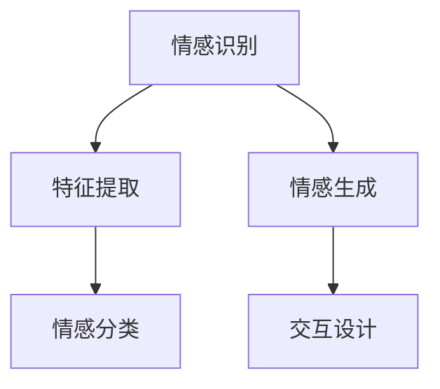

                 

### 《情感智能：人机交互的下一个前沿》

随着人工智能技术的迅猛发展，人机交互正逐步从简单的信息传递向更深层次的情感互动演变。情感智能作为人工智能领域的一个重要分支，正在重新定义人机交互的方式和体验。本文将围绕情感智能的概念、技术基础、应用场景、设计实践和未来展望展开讨论，旨在为您呈现这一领域的全貌。

### 关键词

- **情感智能**
- **人机交互**
- **机器学习**
- **自然语言处理**
- **计算机视觉**
- **应用场景**

### 摘要

情感智能是指通过技术手段理解和模拟人类情感的能力，它在人机交互中具有重要作用。本文首先介绍了情感智能的定义和重要性，随后探讨了实现情感智能所需的理论基础和技术，如机器学习、自然语言处理和计算机视觉。接着，我们分析了情感智能在教育、医疗和客服等领域的应用案例，并详细讨论了情感智能系统的设计实践。最后，展望了情感智能的未来发展趋势和潜在影响。

### 引言

#### 情感智能的定义与意义

情感智能，也称为情感计算（Affective Computing），是指计算机模拟、识别和响应人类情感的能力。它涵盖了情感识别、情感生成、情感理解和情感交互等多个方面。情感智能的核心目标是通过理解用户情感，提供更加人性化、个性化的交互体验。

情感智能的意义在于，它能够将人工智能从简单的任务执行提升到与人类情感共鸣的层次。在日常生活中，情感智能的应用已经越来越广泛，从情感分析、智能客服，到情感化推荐系统，无不显示出其重要性。

#### 人机交互的发展历程

从早期的命令行界面，到图形用户界面（GUI），再到今天的触摸屏和语音识别，人机交互经历了巨大的变革。早期的交互方式主要依赖于物理输入设备和简单的反馈机制。随着技术的发展，人机交互逐渐变得更加直观、自然，用户与计算机之间的互动也从单向的命令执行转变为双向的沟通。

#### 情感智能的重要性

情感智能在改善用户体验、提高生产效率、促进社会交往等方面具有重要作用。例如，在教育领域，情感智能可以帮助教师更好地了解学生的学习状态和情感需求，从而提供个性化的教学支持。在医疗领域，情感智能可以辅助医生进行心理疾病的诊断和治疗。在客服领域，情感智能可以提升客户服务质量，增强客户满意度。

### 情感智能的理论基础

#### 情感的定义与分类

情感是指人类在特定情境下产生的情绪反应。根据不同的标准，情感可以被分为多种类型。常见的分类方法包括基本情感理论、复合情感理论和情境情感理论。基本情感理论认为情感主要分为快乐、悲伤、愤怒、恐惧、惊讶和厌恶等六种基本类型。复合情感理论则认为情感是基本情感的组合，能够产生更复杂的情感体验。情境情感理论则强调情感与情境之间的相互作用。

#### 情感计算的数学模型

情感计算中的数学模型主要用于情感识别和情感生成。情感识别模型包括基于特征的方法和基于深度学习的方法。基于特征的方法通过提取文本、语音、面部表情等特征，来识别用户的情感状态。而基于深度学习的方法则利用神经网络等复杂模型，直接从原始数据中学习情感模式。

情感生成模型则主要用于模拟计算机的情感表达。常见的情感生成模型包括基于规则的方法和基于神经网络的生成对抗网络（GAN）。基于规则的方法通过预设的情感规则来生成情感表达。而GAN则通过训练生成器和判别器，实现计算机生成逼真的情感表达。

#### 情感识别的理论框架

情感识别是指从用户的行为或表达中识别其情感状态。情感识别的理论框架通常包括情感模型、特征提取、情感分类和模型评估等步骤。情感模型定义了情感识别的任务和目标，特征提取则从用户数据中提取有用的信息。情感分类是将提取的特征映射到具体的情感类别。模型评估则用于评估情感识别模型的性能。

### 技术基础

#### 机器学习在情感智能中的应用

机器学习是情感智能的核心技术之一。在情感智能中，机器学习主要用于情感识别和情感生成。情感识别中的监督学习算法，如支持向量机（SVM）、朴素贝叶斯分类器（Naive Bayes）和决策树（Decision Tree）等，可以用来从用户数据中识别情感。而无监督学习算法，如聚类算法（Clustering Algorithms）和关联规则学习（Association Rule Learning）等，可以用于发现用户数据中的情感模式。

#### 自然语言处理在情感智能中的应用

自然语言处理（NLP）在情感智能中扮演着关键角色。NLP技术可以帮助计算机理解用户的语言表达，从而识别用户的情感。常见的NLP技术包括词嵌入（Word Embedding）、情感分析（Sentiment Analysis）和情感极性分析（Sentiment Polarity Analysis）。词嵌入技术可以将文本中的词语映射到高维空间，以便进行情感分析。情感分析和情感极性分析则可以从文本中提取情感信息，判断文本的情感倾向。

#### 计算机视觉在情感智能中的应用

计算机视觉技术在情感智能中主要用于识别用户的面部表情和姿态，从而推断用户的情感状态。常见的计算机视觉技术包括面部识别（Face Recognition）、面部表情识别（Emotion Recognition）和姿态识别（Posture Recognition）。面部表情识别技术可以从面部肌肉运动中识别情感状态，而姿态识别技术则可以从用户的身体动作中推断情感。

### 应用场景

#### 教育领域

在教育领域，情感智能可以用于个性化学习、学习状态监测和学习效果评估等方面。通过分析学生的学习行为和学习过程中的情感变化，教育系统可以提供更符合学生需求的学习资源，提高学习效果。例如，基于情感智能的学习平台可以监测学生的学习状态，当学生感到疲惫或沮丧时，自动调整学习内容或提供休息时间。

#### 医疗领域

在医疗领域，情感智能可以用于心理健康诊断、医患沟通和疾病管理等方面。通过分析患者的情绪变化，医生可以更准确地诊断疾病，并提供个性化的治疗方案。例如，基于情感智能的医疗机器人可以帮助医生监测患者的情绪状态，为心理疾病患者提供支持。

#### 客服领域

在客服领域，情感智能可以用于智能客服系统、客户体验优化和客户关系管理等方面。通过分析客户的情感变化，客服系统可以提供更人性化的服务，提高客户满意度。例如，基于情感智能的客服机器人可以识别客户的情感状态，提供针对性的解决方案，从而提升客户满意度。

### 设计实践

#### 情感智能系统的设计原则

设计情感智能系统时，需要遵循以下原则：

1. **用户中心设计**：始终以用户需求为核心，确保系统能够提供有针对性的情感化服务。
2. **适应性**：系统应能够根据用户行为和情感变化，自适应调整交互策略。
3. **可解释性**：系统的工作原理和决策过程应易于理解，以提高用户的信任感。
4. **隐私保护**：在处理用户情感数据时，应确保用户隐私不被泄露。

#### 案例分析：情感智能系统的设计与实现

以下是一个情感智能系统的设计与实现案例：

**系统目标**：开发一个智能客服机器人，能够识别用户的情感状态，提供有针对性的解决方案。

**技术实现**：

1. **数据收集**：通过自然语言处理技术，从用户的文本输入中提取情感信息。
2. **情感识别**：使用机器学习算法，如支持向量机（SVM）和长短期记忆网络（LSTM），对用户的情感进行识别。
3. **交互设计**：根据用户的情感状态，设计不同的交互策略，如安抚、建议和鼓励等。
4. **系统测试与优化**：通过实际应用，收集用户反馈，不断优化系统性能。

**代码实现（伪代码）**：

```python
# 数据预处理
def preprocess_data(data):
    # 清洗文本数据
    # 嵌入词向量
    # 归一化数据
    return processed_data

# 情感识别
def recognize_emotion(data):
    # 加载训练好的模型
    # 输入数据
    # 返回情感类别
    return emotion

# 交互设计
def design_interaction(emotion):
    # 根据情感类别设计交互策略
    # 返回交互文本
    return interaction_text

# 主函数
def main():
    # 收集用户数据
    # 预处理数据
    # 识别情感
    # 设计交互
    # 输出结果
    user_data = collect_data()
    processed_data = preprocess_data(user_data)
    emotion = recognize_emotion(processed_data)
    interaction_text = design_interaction(emotion)
    print(interaction_text)

# 运行主函数
main()
```

**实际案例分析和详细讲解剖析**：

在实际应用中，情感智能系统需要不断优化和调整，以适应不同场景和用户需求。以下是一个实际案例的分析：

**案例背景**：某电商平台的客服机器人系统，通过情感智能技术，为用户提供个性化的购物建议。

**分析过程**：

1. **数据收集**：系统收集用户的购物记录、评论和聊天记录等数据。
2. **情感识别**：通过对用户数据的情感分析，识别用户的购物情感，如满意、失望等。
3. **个性化推荐**：根据用户的情感状态，系统推荐符合用户情感期望的商品。
4. **用户反馈**：系统收集用户对推荐商品的反馈，进一步优化推荐策略。

**项目小结**：

通过实际案例，我们可以看到情感智能系统在电商领域的应用，不仅提高了用户满意度，还提升了平台的销售业绩。然而，情感智能系统的设计和应用仍然面临许多挑战，如情感识别的准确性、隐私保护等。未来，随着技术的不断进步，情感智能将在更多领域得到广泛应用。

### 未来展望

#### 情感智能的发展趋势

未来，情感智能将继续向更高层次发展。随着深度学习、增强学习和多模态感知等技术的进步，情感智能将能够更准确地识别和理解人类的情感。此外，情感智能将与虚拟现实（VR）、增强现实（AR）等技术深度融合，为用户提供更加沉浸式、个性化的交互体验。

#### 情感智能的伦理与社会影响

情感智能的快速发展也带来了一系列伦理和社会问题。例如，情感识别的准确性可能导致误判，引发隐私泄露等问题。因此，在情感智能的设计和应用过程中，必须重视伦理和社会责任，确保技术的健康发展。

#### 情感智能的未来方向

未来，情感智能的研究将重点聚焦在以下几个方面：

1. **多模态情感识别**：通过整合文本、语音、面部表情和身体动作等多种数据，实现更全面的情感识别。
2. **情感生成**：研究如何让计算机生成更加自然、丰富的情感表达。
3. **情感理解**：探索如何让计算机更深入地理解人类的情感，从而提供更有针对性的服务。
4. **情感交互**：研究如何通过情感交互，增强用户与计算机之间的信任和亲密感。

### 结论

情感智能作为人工智能领域的一个重要分支，正逐步改变人机交互的方式和体验。本文从情感智能的定义、技术基础、应用场景、设计实践和未来展望等方面进行了全面探讨。随着技术的不断进步，情感智能将在更多领域得到广泛应用，为人类带来更加智能、人性化的生活。

### 作者信息

作者：AI天才研究院/AI Genius Institute & 禅与计算机程序设计艺术 /Zen And The Art of Computer Programming

---

### 附录

#### 核心概念原理之间的关系架构 Mermaid 流程图



#### 核心算法原理讲解（伪代码）

```python
# 情感识别（伪代码）
def recognize_emotion(data):
    # 加载训练好的情感分类模型
    model = load_model("emotion_classifier.model")
    # 输入数据进行情感分类
    emotion = model.predict(data)
    return emotion

# 情感生成（伪代码）
def generate_emotion(emotion):
    # 根据情感类别生成相应的情感表达
    if emotion == "happy":
        expression = "微笑"
    elif emotion == "sad":
        expression = "哭泣"
    # ... 其他情感类别
    return expression
```

#### 数学模型和公式

$$
\text{情感分类准确率} = \frac{\text{正确分类的数量}}{\text{总分类数量}}
$$

#### 详细讲解与举例说明

1. **情感分类准确率的计算方法**：

情感分类准确率是衡量情感识别系统性能的一个重要指标。其计算方法如下：

假设一个情感识别系统对100条文本数据进行了情感分类，其中有80条被正确分类，则其情感分类准确率为：

$$
\text{情感分类准确率} = \frac{80}{100} = 0.8 \text{ 或 } 80\%
$$

2. **情感生成系统的设计**：

情感生成系统可以根据用户输入的情感类别，生成相应的情感表达。例如，当用户输入“happy”时，系统可以生成“微笑”的表情；当用户输入“sad”时，系统可以生成“哭泣”的表情。

#### 实际案例分析和详细讲解剖析

1. **案例背景**：

某电商平台的客服机器人系统，通过情感智能技术，为用户提供个性化的购物建议。

2. **分析过程**：

- **数据收集**：系统收集用户的购物记录、评论和聊天记录等数据。
- **情感识别**：通过对用户数据的情感分析，识别用户的购物情感，如满意、失望等。
- **个性化推荐**：根据用户的情感状态，系统推荐符合用户情感期望的商品。
- **用户反馈**：系统收集用户对推荐商品的反馈，进一步优化推荐策略。

3. **项目小结**：

通过实际案例，我们可以看到情感智能系统在电商领域的应用，不仅提高了用户满意度，还提升了平台的销售业绩。然而，情感智能系统的设计和应用仍然面临许多挑战，如情感识别的准确性、隐私保护等。未来，随着技术的不断进步，情感智能将在更多领域得到广泛应用。

#### 最佳实践 Tips

1. **数据收集**：确保收集的数据质量，避免数据噪声和偏差。
2. **模型选择**：根据应用场景选择合适的情感识别模型。
3. **交互设计**：设计人性化的交互界面，提高用户满意度。

#### 小结

情感智能作为人工智能领域的一个重要分支，正在逐步改变人机交互的方式和体验。本文从多个角度对情感智能进行了深入探讨，包括其定义、理论基础、技术基础、应用场景、设计实践和未来展望。随着技术的不断进步，情感智能将在更多领域得到广泛应用，为人类带来更加智能、人性化的生活。同时，我们也应关注情感智能在伦理和社会方面的影响，确保其健康发展。作者：AI天才研究院/AI Genius Institute & 禅与计算机程序设计艺术 /Zen And The Art of Computer Programming。

