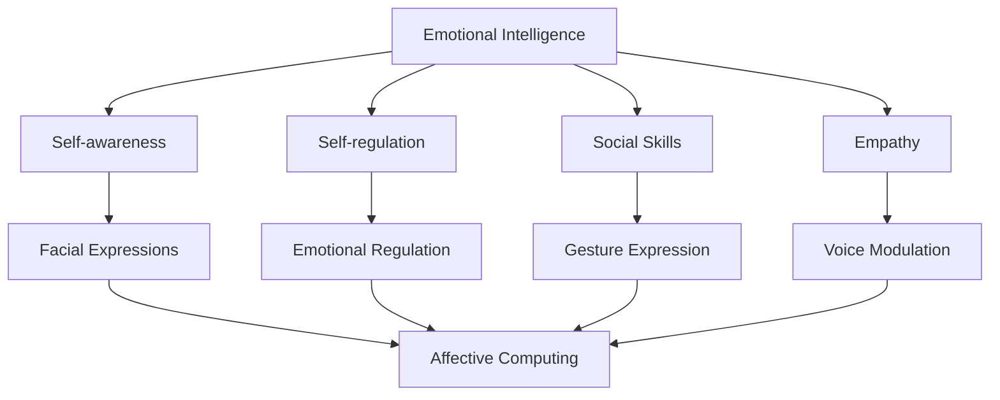
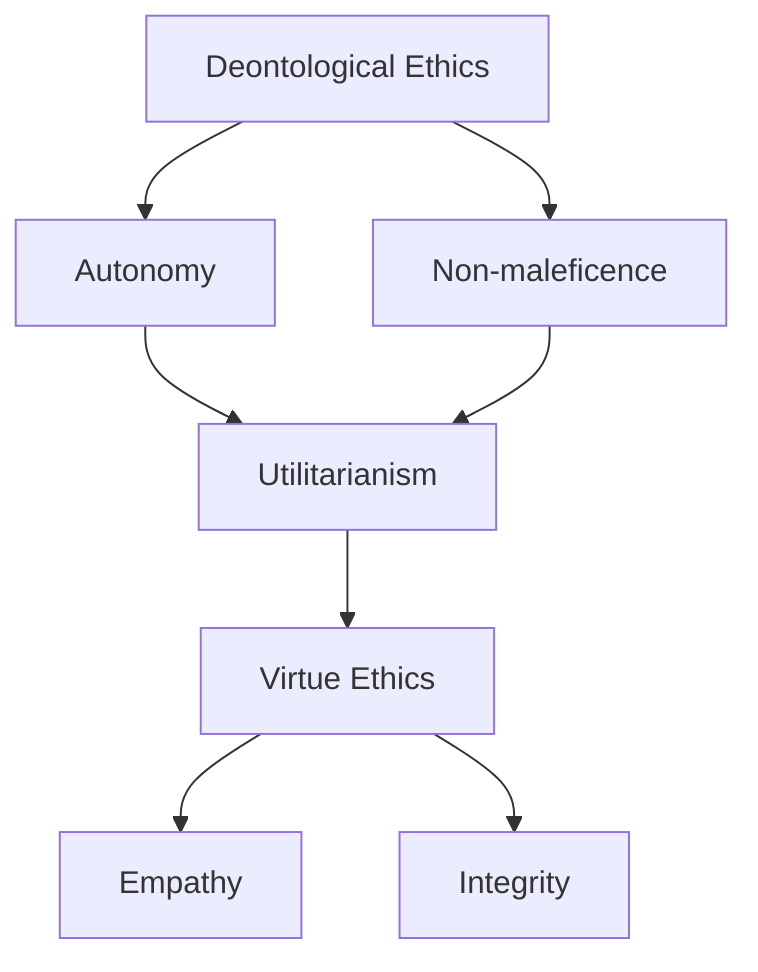

                 

### Introduction to Emotional Robot Ethics

In recent years, the advent of advanced artificial intelligence (AI) and machine learning technologies has led to the creation of emotional robots capable of interacting with humans in a nuanced and empathetic manner. These robots are designed not only to perform specific tasks but also to understand and respond to human emotions, providing companionship, support, and even therapy. However, as these technologies progress, so do the ethical questions surrounding their use. The burgeoning field of emotional robot ethics seeks to explore and address these moral complexities, ensuring that human-robot interactions are conducted with integrity and respect for human dignity.

This book, "Emotional Robot Ethics: Moral Boundaries of Human-Robot Emotional Interaction," aims to provide a comprehensive examination of the ethical considerations that arise from the integration of emotional robots into society. The primary objective is to establish a robust ethical framework that guides the development and deployment of these technologies, balancing the potential benefits with the potential risks.

The book is structured into three main parts. **Part 1** lays the foundational concepts by introducing ethical theories and exploring the core concepts in emotional robotics. **Part 2** delves into the ethical challenges, such as privacy, emotional dependence, and emotional manipulation. **Part 3** addresses the legal and policy frameworks necessary to regulate these interactions.

## 1.1 Book Background

The development of emotional robots is a significant milestone in the history of AI. Traditional robots were primarily mechanical entities designed for specific tasks, such as manufacturing or logistics. However, with the advancements in AI, particularly in machine learning and natural language processing, robots have evolved to possess a degree of autonomy and the ability to interact with humans in a more meaningful way. Emotional robots go a step further by incorporating emotional intelligence, enabling them to understand and respond to human emotions.

These robots have found applications in various fields, including healthcare, education, and entertainment. For instance, robots like Paro, designed to resemble a baby harp seal, have been used to provide comfort and support to patients in hospitals and nursing homes. Similarly, social robots like Jibo aim to be a part of everyday family life, engaging in conversations and assisting with daily tasks.

Despite their potential benefits, the integration of emotional robots into society raises several ethical concerns. One of the most pressing issues is privacy. Emotional robots often rely on data collected from their interactions with humans to improve their emotional responses. This data, which may include sensitive personal information, needs to be handled with the utmost care to prevent misuse and breaches of privacy.

Another ethical concern is the potential for emotional manipulation. Emotional robots are designed to be empathetic and supportive, but this also means they can be used to influence human emotions in unintended ways. For example, a robot designed to provide therapy may inadvertently exploit a patient's trust to manipulate their emotions or behavior.

Moreover, the rise of emotional robots raises questions about the moral boundaries of human-robot interactions. As robots become more capable of understanding and responding to human emotions, it becomes crucial to define and enforce ethical guidelines to ensure these interactions are conducted in a manner that respects human dignity and autonomy.

In summary, the development of emotional robots presents both opportunities and challenges. This book aims to navigate these challenges by providing a detailed analysis of the ethical issues surrounding emotional robots and offering practical solutions to address them.

### Scope and Objectives

The primary aim of this book is to provide a thorough examination of the ethical considerations associated with emotional robots and their interactions with humans. Specifically, the book aims to achieve the following objectives:

1. **Define Ethical Theories**: By exploring various ethical theories, including deontological ethics, utilitarianism, and virtue ethics, the book will establish a foundational understanding of moral principles that can be applied to the development and deployment of emotional robots.

2. **Examine Human-Robot Interaction**: The book will delve into the psychological, social, and cultural aspects of human-robot interaction, providing insights into how emotions are perceived and processed in these interactions. This will include a discussion on the psychological effects of interacting with emotional robots and the social implications of their presence in various contexts.

3. **Identify Ethical Challenges**: By identifying and analyzing ethical dilemmas such as privacy concerns, emotional dependence, and emotional manipulation, the book will highlight the potential risks and challenges that arise from the use of emotional robots.

4. **Propose Ethical Guidelines**: Based on the analysis of ethical theories and challenges, the book will propose a set of ethical guidelines and frameworks that can be used to regulate the development and deployment of emotional robots, ensuring that they are used in a manner that respects human dignity and autonomy.

5. **Explore Legal and Policy Frameworks**: The book will address the legal and policy considerations necessary to govern the use of emotional robots, discussing existing regulations and proposing new measures to address emerging ethical issues.

6. **Offer Practical Solutions**: By providing practical solutions and recommendations, the book will aim to inform policymakers, robot developers, and users about the best practices for ethical human-robot interactions.

In summary, the book seeks to bridge the gap between technological advancements and ethical considerations, offering a comprehensive and practical guide to navigating the complex landscape of emotional robot ethics.

### Core Concepts in Emotional Robotics

Emotional robotics is a multidisciplinary field that integrates principles from psychology, artificial intelligence, and computational neuroscience to create robots capable of understanding, expressing, and responding to human emotions. At the heart of this field are several core concepts that define the capabilities and limitations of emotional robots.

#### Emotional Intelligence

Emotional intelligence (EI) is the ability to perceive, understand, manage, and use emotions to facilitate thinking and problem-solving. It includes four key components: self-awareness, self-regulation, social skills, and empathy. Emotional robots are designed to possess EI, enabling them to understand the emotional states of humans and respond accordingly.

**Self-awareness**: This involves recognizing and interpreting one's own emotions. In robots, this is achieved through sensors and algorithms that analyze physiological and behavioral cues to determine the robot's emotional state.

**Self-regulation**: This refers to the ability to manage emotions effectively. Robots are programmed with algorithms that help them modulate their emotional responses based on the context of the interaction.

**Social skills**: These are the skills that enable individuals to interact effectively with others. Emotional robots are equipped with natural language processing capabilities and social behaviors that allow them to engage in meaningful conversations and collaborations with humans.

**Empathy**: This is the ability to understand and share the feelings of others. Emotional robots use machine learning algorithms to recognize and interpret human emotional expressions, enabling them to respond empathetically.

#### Emotional Expression in Robots

Emotional expression in robots refers to the robot's ability to display emotions through physical gestures, facial expressions, and voice modulation. This is crucial for establishing a sense of connection and trust with humans.

**Facial Expressions**: Many robots are equipped with expressive faces that can display a range of emotions, from happiness and sadness to anger and surprise. These expressions are often created using a combination of mechanical and digital technologies.

**Gestures**: Robots can also use gestures to express emotions. For example, a robot might raise its arm or nod its head to show agreement or enthusiasm.

**Voice Modulation**: The tone, pitch, and speed of a robot's voice can convey emotional states. Advanced speech synthesis technologies allow robots to adjust these parameters to match the emotional content of their messages.

#### Affective Computing

Affective computing is the study and development of systems that can recognize, interpret, and simulate human emotions. It underpins the capabilities of emotional robots and is crucial for enabling natural and meaningful human-robot interactions.

**Emotion Recognition**: Affective computing algorithms analyze various cues, such as facial expressions, vocal tones, and physiological signals, to identify and classify human emotions. This enables robots to understand and respond to the emotional states of their human counterparts.

**Emotion Simulation**: Once an emotion is recognized, affective computing systems can simulate the emotion using appropriate expressions, gestures, and voice modulations. This simulates a more natural and engaging interaction.

#### Relationship Between Core Concepts

The core concepts of emotional intelligence, emotional expression, and affective computing are closely interlinked. Emotional intelligence provides the foundation for understanding human emotions, which is essential for effective emotional expression. Affective computing bridges this understanding by providing the technological means to recognize and simulate emotions, thus enabling emotional robots to engage in meaningful interactions with humans.

**Flowchart of Core Concepts:**

In conclusion, emotional robotics is a complex and evolving field that requires a multidisciplinary approach to achieve its goals. By understanding and integrating these core concepts, developers can create emotional robots that not only perform tasks but also engage with humans on an emotional level, fostering trust and empathy.

### Ethical Theories and Human-Robot Interaction

In order to navigate the ethical complexities surrounding emotional robots and their interactions with humans, it is essential to explore and understand various ethical theories that can inform the development of moral frameworks. This section will delve into three prominent ethical theories—deontological ethics, utilitarianism, and virtue ethics—and their implications for human-robot interactions.

#### Deontological Ethics

Deontological ethics, developed by philosophers like Immanuel Kant, emphasizes the inherent moral worth of actions rather than their consequences. According to deontological ethics, certain actions are inherently right or wrong, regardless of the outcomes they produce. For instance, lying is universally considered wrong, irrespective of the benefits it may bring.

**Application to Human-Robot Interaction**: When applied to human-robot interactions, deontological ethics can guide the development of ethical guidelines that prioritize certain principles over potential benefits. For example, the principle of respect for autonomy suggests that robots should never deceive humans intentionally. This means that robots must be programmed to avoid misleading or manipulating users, even if such actions might lead to more favorable outcomes in the short term.

**Principles in Action**:
- **Autonomy**: Users must be fully informed and have the ability to make choices about their interactions with robots.
- **Non-maleficence**: Robots should be designed to avoid causing harm, both physically and emotionally.

#### Utilitarianism

Utilitarianism, championed by philosophers such as John Stuart Mill, focuses on the consequences of actions. It posits that the moral worth of an action is determined by its ability to maximize overall happiness or utility for the greatest number of people. Utilitarianism encourages actions that produce the most beneficial outcomes.

**Application to Human-Robot Interaction**: In the context of emotional robots, utilitarianism can guide the design and deployment of robots that prioritize the well-being of human users. For example, a social robot designed to provide therapy might be evaluated based on its ability to alleviate symptoms of depression or anxiety in users, rather than on the quantity of data collected.

**Principles in Action**:
- **Happiness**: The well-being of users should be the primary focus, ensuring that robots contribute positively to users' lives.
- **Utility**: Actions should maximize overall happiness and minimize suffering, even if this means limiting certain functionalities or collecting minimal data.

#### Virtue Ethics

Virtue ethics, as proposed by Aristotle, focuses on the character of the individual and the development of virtues that lead to a good life. It emphasizes the importance of cultivating qualities like honesty, kindness, and courage in guiding ethical behavior.

**Application to Human-Robot Interaction**: In the realm of emotional robots, virtue ethics can inspire the development of robots that embody virtues such as empathy, respect, and integrity. This approach encourages the creation of robots that not only perform tasks but also treat human users with dignity and respect.

**Principles in Action**:
- **Empathy**: Robots should be designed to understand and respond to human emotions with empathy and compassion.
- **Integrity**: The actions of robots should align with ethical principles, ensuring that they act in ways that are morally upright.

**Relationship between Ethical Theories**

While deontological, utilitarian, and virtue ethics differ in their approaches to determining moral value, they are not mutually exclusive. In practice, these theories can often inform and complement each other. For instance, deontological principles can guide the protection of autonomy, utilitarian considerations can help optimize well-being, and virtue ethics can inspire the development of robots with moral character.

**Flowchart of Ethical Theories:**

In conclusion, integrating diverse ethical theories can provide a comprehensive framework for addressing the moral challenges posed by emotional robots. By considering principles from deontological ethics, utilitarianism, and virtue ethics, developers can create robots that respect human dignity, optimize user well-being, and embody virtuous qualities. This multidisciplinary approach is crucial for navigating the complex landscape of emotional robot ethics.

### Psychological Aspects of Human-Robot Interaction

The psychological aspects of human-robot interaction (HRI) play a critical role in shaping the nature and outcomes of these engagements. Understanding these dynamics is essential for designing emotional robots that can effectively support and interact with human users. This section delves into the psychological impacts of interacting with emotional robots, focusing on user experience, emotional response, and the psychological benefits and drawbacks of such interactions.

#### User Experience

User experience (UX) in HRI is multifaceted, encompassing factors such as usability, engagement, and satisfaction. A positive UX can significantly enhance the effectiveness of emotional robots, while a negative UX can lead to frustration and distrust.

**Usability**: Usability refers to how easy it is for users to interact with a robot. Emotional robots must be designed with intuitive interfaces and responsive behaviors to ensure that users can effortlessly engage with them. This involves considering the layout of buttons, the clarity of voice commands, and the fluidity of physical movements.

**Engagement**: Engagement measures the level of interaction and involvement users have with emotional robots. High levels of engagement can lead to stronger emotional connections and more meaningful interactions. To foster engagement, robots must be able to maintain users' attention and provide stimulating conversations or activities.

**Satisfaction**: User satisfaction is a measure of how well the emotional robot meets users' needs and expectations. High satisfaction levels can enhance the perceived value of the robot and encourage continued use. Factors that contribute to user satisfaction include the robot's ability to understand and respond to user emotions, as well as its consistency and reliability.

#### Emotional Response

The emotional response of humans to emotional robots is a crucial aspect of HRI. Emotional robots are designed to evoke specific emotional responses, such as joy, comfort, or trust, which can influence the quality of the interaction.

**Joy and Happiness**: Emotional robots that can generate positive emotions like joy and happiness can have a beneficial impact on users' mental well-being. For example, a robot designed for therapeutic purposes might use playful interactions or engaging activities to lift the mood of a user experiencing depression or anxiety.

**Comfort and Security**: Emotional robots that provide comfort and security can be particularly beneficial for individuals who feel lonely, anxious, or vulnerable. The presence of a robot that can offer emotional support can create a sense of security and reduce feelings of isolation.

**Trust and Empathy**: Trust and empathy are foundational to meaningful human-robot interactions. Emotional robots that can demonstrate empathy and understand human emotions can build trust over time. This trust is crucial for effective therapeutic interactions and for situations where the robot is expected to provide guidance or support.

#### Psychological Benefits

Interacting with emotional robots can offer several psychological benefits, including:

**Stress Reduction**: The calming presence and empathetic responses of emotional robots can help reduce stress and anxiety. For example, a robot used in a therapeutic setting might provide relaxation techniques or engage users in soothing conversations, leading to decreased stress levels.

**Enhanced Well-being**: Emotional robots can contribute to improved mental well-being by offering companionship and emotional support. For individuals who lack social connections or live in isolated environments, the presence of an emotional robot can provide a sense of belonging and support.

**Social Skills Development**: For some individuals, interacting with emotional robots can help improve social skills. For example, children with autism might benefit from engaging with robots that can simulate social interactions, helping them to develop better communication and interaction skills.

#### Psychological Drawbacks

While the psychological benefits of interacting with emotional robots are significant, there are also potential drawbacks to consider:

**Over-reliance and Emotional Dependence**: Users might become overly dependent on emotional robots, leading to a decrease in social interactions and potential isolation from human companions. This over-reliance can have negative consequences on emotional and psychological health.

**Emotional Manipulation**: Emotional robots designed to evoke specific emotional responses can be exploited to manipulate users' emotions. For example, a robot used in therapy might be designed to increase anxiety or depression symptoms if not properly regulated.

**Privacy Concerns**: Emotional robots often collect data on users' emotional states and interactions, raising concerns about privacy and data security. Unauthorized access to this data could lead to misuse or breaches of personal information.

#### Summary

In summary, the psychological aspects of human-robot interaction are complex and multifaceted. Emotional robots have the potential to offer significant psychological benefits, such as stress reduction, enhanced well-being, and improved social skills. However, they also pose risks, including over-reliance, emotional manipulation, and privacy concerns. Understanding these dynamics is crucial for the ethical development and deployment of emotional robots, ensuring that they are designed and used in a manner that promotes human well-being.

### Social Implications of Human-Robot Interaction

Human-robot interaction (HRI) extends beyond individual experiences to have profound social implications that impact communities, societies, and even cultural norms. As emotional robots become more integrated into daily life, they bring about both opportunities and challenges that must be carefully considered. This section explores the social implications of HRI, focusing on the impact on human relationships, societal roles, and cultural dynamics.

#### Impact on Human Relationships

The advent of emotional robots has the potential to transform human relationships in several ways. On one hand, robots can serve as companions and confidants, offering emotional support and reducing feelings of loneliness and isolation. This can be particularly beneficial for individuals who are socially isolated or have limited access to human companionship, such as the elderly, individuals with disabilities, or those living in remote areas.

**Companionship and Emotional Support**: Emotional robots designed for companionship can provide users with a sense of belonging and security. For example, a robot like Paro, which resembles a baby harp seal, has been shown to reduce stress and anxiety in patients in hospitals and nursing homes. The robot's ability to offer non-judgmental and consistent support can be a significant comfort to users.

**Substitution or Supplement?**: While robots can offer valuable emotional support, the question arises as to whether they can fully substitute human relationships. Emotional robots can complement human interactions by providing additional support, but they cannot replicate the depth and complexity of human-to-human relationships. The risk of over-reliance on robots for emotional support should be acknowledged to prevent the erosion of genuine human connections.

**Emotional Interference**: There is also a potential risk of emotional interference. If robots are overly empathetic or persuasive, they might inadvertently influence users' emotions or decisions in ways that are not in their best interest. This requires careful design and ethical oversight to ensure that robots do not manipulate users' emotions without their consent.

#### Changes in Societal Roles

The integration of emotional robots into society leads to changes in the roles and functions of both humans and robots. These changes can have far-reaching implications for societal structures and norms.

**Human Roles**: As emotional robots take on tasks traditionally performed by humans, such as caregiving or customer service, there will be a shift in human roles. This shift could lead to increased job displacement in certain sectors, necessitating retraining and adaptation to new job opportunities. At the same time, humans might take on roles that are more creative, strategic, and emotionally demanding, leveraging the strengths of both humans and robots.

**Robot Roles**: Emotional robots will play a significant role in various aspects of society, from healthcare and education to entertainment and business. Their roles will require them to be socially adept, capable of understanding and responding to human emotions in a nuanced way. This will involve continuous development in areas such as natural language processing, social cognition, and emotional expression.

**Collaboration and Coexistence**: The coexistence of humans and robots will require a new paradigm of collaboration. Emotional robots will need to work alongside humans, understanding their needs and preferences while also contributing to societal goals. This collaboration will require robust ethical frameworks to ensure that robots are designed and used in ways that respect human dignity and autonomy.

#### Cultural Dynamics

Cultural acceptance and adaptation to emotional robots vary across different societies and cultures. The integration of emotional robots into society will challenge and shape cultural norms and values.

**Cultural Acceptance**: In some cultures, there is a higher degree of acceptance and openness to the use of robots in social roles. For example, in Japan, robots like Pepper are widely used in various social settings, from retail to hospitality. In contrast, other cultures might have stronger reservations about the use of robots in intimate social roles, leading to more cautious adoption.

**Cultural Sensitivity**: Emotional robots must be designed with cultural sensitivity to ensure that their interactions are appropriate and respectful. This includes considerations such as language, non-verbal communication, and social norms. For example, a robot designed for a Western audience might have different social behaviors and emotional expressions compared to one designed for an Eastern audience.

**Cultural Impact**: The use of emotional robots can also have a cultural impact, shaping and influencing social norms and values. As robots become more integrated into daily life, they can influence how humans perceive and interact with each other. For example, the normalization of robotic companionship might lead to changes in social expectations and roles, both for individuals and society as a whole.

#### Summary

In conclusion, the social implications of human-robot interaction are multifaceted, affecting human relationships, societal roles, and cultural dynamics. Emotional robots have the potential to offer companionship, support, and new opportunities for collaboration. However, they also pose challenges, including the need for ethical design, cultural sensitivity, and ongoing societal adaptation. As emotional robots continue to evolve, it is crucial to consider these social implications to ensure that their integration into society is beneficial and respectful of human values.

### Cultural Differences in Human-Robot Interaction

Cultural differences significantly influence how humans interact with robots, shaping the design, perception, and use of emotional robots across different societies. Understanding these cultural variations is essential for creating emotionally intelligent robots that can effectively engage with users from diverse backgrounds. This section explores the impact of cultural differences on human-robot interaction (HRI), highlighting key areas such as language, social norms, and cultural values.

#### Language

Language is a fundamental aspect of human-robot interaction, and cultural differences in language can profoundly affect the nature of these interactions. 

**Language Structure**: Different languages have varying structures, including grammar, syntax, and vocabulary. For example, some languages, like Japanese, place a strong emphasis on politeness and formality, while others, like English, may use more direct and informal communication. Robots must be programmed to understand and respond appropriately to these linguistic differences to ensure effective communication.

**Dialects and Accents**: Within a single language, dialects and accents can also impact HRI. For instance, a robot designed for English-speaking users might struggle to understand or respond accurately to regional dialects or non-native accents. This requires robust natural language processing capabilities that can adapt to different linguistic variations.

**Cultural Slang and Jargon**: Cultural slang and jargon can be challenging for robots to interpret, as they often reflect specific cultural contexts and social norms. For example, certain phrases or expressions might carry significant meaning within a specific culture but may be meaningless or even offensive to users from other cultures.

#### Social Norms

Social norms vary across cultures, influencing how people interact with robots and what they expect from these interactions.

**Formal vs. Informal Interactions**: In some cultures, formal interactions are the norm, requiring respectful and polite communication. For instance, in many Asian cultures, it is customary to address robots with formal language and respectful terms. In contrast, Western cultures may adopt a more informal and relaxed approach to HRI.

**Non-Verbal Communication**: Non-verbal communication, such as body language, facial expressions, and gestures, varies significantly across cultures. For example, a smile might convey happiness in one culture but may have different meanings or be considered inappropriate in another. Emotional robots must be designed to understand and interpret these non-verbal cues to ensure culturally appropriate interactions.

**Social Distance**: The concept of social distance, or the physical and emotional space people maintain around others, varies across cultures. In cultures with a high social distance, such as Western societies, people might expect robots to maintain a greater distance during interactions. Conversely, in cultures with a low social distance, such as some Middle Eastern cultures, people might feel more comfortable with closer interactions with robots.

#### Cultural Values

Cultural values shape users' expectations and perceptions of robots, influencing the design and effectiveness of emotional robots.

**Honor and Shame**: Cultures that emphasize honor and shame, such as some Asian and Middle Eastern cultures, might have different attitudes towards robots. For example, a robot that fails to perform a task or misinterprets social cues might cause shame or embarrassment to the user. This requires robots to be designed with a high level of cultural sensitivity and error handling.

**Community and Individualism**: Cultures that prioritize community values, such as collectivist cultures in Asia, might view robots as extensions of the community. These robots are expected to support and strengthen communal bonds. In contrast, individualistic cultures in Western societies might focus more on personal freedom and autonomy when interacting with robots.

**Privacy and Autonomy**: Privacy and autonomy are cultural values that significantly impact HRI. In cultures that prioritize individual privacy, such as those in Europe and North America, users might be more cautious about sharing personal information with robots. In contrast, cultures that place less emphasis on privacy might be more accepting of robots collecting and processing personal data.

#### Adapting Emotional Robots to Cultural Differences

To design emotionally intelligent robots that can effectively interact with users from diverse cultural backgrounds, several strategies can be employed:

**Cultural Adaptation**: Robots should be designed with cultural adaptation features that allow them to adjust their behaviors and responses based on the cultural context. This includes using culturally appropriate language, gestures, and expressions.

**Cultural Training**: Developers and designers should receive cultural training to better understand the nuances of different cultures and how to incorporate these into robot design.

**User Feedback**: Gathering user feedback from diverse cultural backgrounds can help identify cultural preferences and challenges, allowing for iterative improvements in robot design and functionality.

**Cultural Sensitivity Testing**: Before deploying robots, it is crucial to conduct cultural sensitivity testing to ensure that the robots' interactions are appropriate and respectful across different cultures.

In conclusion, cultural differences play a significant role in shaping human-robot interaction. By understanding and incorporating cultural nuances into robot design, developers can create emotionally intelligent robots that can effectively engage with users from diverse backgrounds, enhancing the overall quality and impact of HRI.

### Privacy and Consent: Ethical Concerns in Human-Robot Interaction

Privacy and consent are critical ethical considerations in the context of human-robot interaction (HRI). As emotional robots become more sophisticated, they increasingly rely on collecting and processing vast amounts of personal data to understand and respond to human emotions. This section delves into the privacy concerns and the importance of informed consent in HRI, emphasizing the need for robust ethical frameworks to protect user data and ensure transparent interactions.

#### Privacy Concerns

Privacy is the right to control how one's personal information is collected, used, and shared. In the realm of HRI, privacy concerns arise from the collection and storage of sensitive data, including emotional states, personal preferences, and behavioral patterns. The following are key privacy issues in HRI:

**Data Collection**: Emotional robots often collect data through various sensors and interaction mechanisms. For instance, cameras and microphones can capture facial expressions and vocal tones, while physiological sensors can monitor heart rate and skin conductance. This extensive data collection poses a risk if not handled responsibly.

**Data Storage**: Storing large amounts of personal data requires secure databases to prevent unauthorized access and data breaches. The vulnerability of these databases to cyber-attacks and hacking is a significant concern, as the potential consequences of a breach can be severe, including identity theft and misuse of personal information.

**Data Usage**: Emotional robots use the collected data to improve their understanding of human emotions and to personalize interactions. However, there is a risk of misuse, where this data could be exploited for purposes other than those explicitly agreed upon with the user. For example, personal data might be used for targeted advertising or sold to third parties without the user's consent.

**Transparency**: Transparency is essential in HRI to ensure that users are aware of how their data is being collected and used. Without clear communication, users may not understand the extent of data collection or the potential risks involved, leading to a lack of trust and compliance.

#### Informed Consent

Informed consent is a fundamental ethical principle that requires individuals to provide voluntary and informed agreement to the collection, use, and disclosure of their personal information. In the context of HRI, informed consent is crucial to protect user privacy and maintain trust. The following elements are essential for obtaining informed consent:

**Voluntary Consent**: Users must have the freedom to choose whether or not to engage with an emotional robot. This requires clear options for opting in or out of data collection and interaction, ensuring that there is no coercion or manipulation.

**Informed Agreement**: Users must be fully informed about the types of data being collected, how it will be used, and who will have access to it. This includes providing clear explanations in easily understandable language, avoiding complex technical jargon.

**Right to Withdraw Consent**: Users should have the right to withdraw their consent at any time without facing negative consequences. This includes the ability to delete their personal data and discontinue interactions with the robot.

**Documentation and Documentation**: Clear documentation of consent processes is essential. This includes consent forms or agreements that are accessible and stored securely. It is also important to maintain records of consent, including the date, time, and method of consent, to ensure accountability and transparency.

#### Addressing Privacy and Consent Concerns

To address privacy and consent concerns in HRI, several measures can be implemented:

**Privacy by Design**: Integrating privacy protections into the design of emotional robots from the outset, including data minimization, data encryption, and secure storage practices.

**Transparency Reports**: Regularly publishing transparency reports that detail data collection and usage practices to keep users informed and build trust.

**Anonymization and Pseudonymization**: Implementing techniques to anonymize or pseudonymize personal data to protect user identities and minimize the risk of data breaches.

**Ethical Training for Developers**: Providing ethical training for developers and designers to ensure they are aware of privacy and consent issues and can incorporate these considerations into their work.

**User Control**: Allowing users to have greater control over their data, including the ability to access, modify, and delete their personal information.

In conclusion, privacy and informed consent are critical ethical considerations in HRI. By addressing these concerns through robust frameworks and ethical practices, it is possible to protect user privacy, maintain trust, and ensure the responsible development and deployment of emotional robots.

### Emotional Dependence: The Rise and Risks of Over-reliance

Emotional dependence on robots refers to the extent to which individuals rely on robotic systems for emotional support, companionship, or therapy. While emotional robots have shown promise in providing comfort and alleviating feelings of loneliness and isolation, the phenomenon of emotional dependence poses several ethical and practical challenges. This section explores the concept of emotional dependence, its underlying causes, and the associated risks.

#### Definition and Causes

**Definition**: Emotional dependence on robots is characterized by an individual's reliance on a robot for emotional support and fulfillment of emotional needs, to the exclusion of human relationships. This reliance can manifest in various forms, such as seeking solace in robots during times of distress, using robots as primary companions, or expecting robots to provide therapy or counseling.

**Causes**: Several factors contribute to the development of emotional dependence on robots:

1. **Social Isolation**: In societies where social connections are diminishing due to factors like urbanization, technological advancements, and changing family structures, individuals may turn to robots for companionship and emotional support.

2. **Limited Human Resources**: In some contexts, there may be a shortage of human caregivers or therapists, leading individuals to seek alternative forms of support from robots.

3. **Emotional Validation**: Emotional robots are designed to provide empathetic responses and validate users' emotions. Over time, individuals may become dependent on these consistent and responsive interactions, as they may feel more comfortable with robots than with humans.

4. **Accessibility**: Robots can be more accessible than human caregivers, especially for individuals with mobility issues or those living in remote areas. The convenience of having an always-available companion can exacerbate emotional dependence.

#### Risks of Over-reliance

**Psychological Risks**: Over-reliance on robots for emotional support can lead to psychological risks, including:

- **Suppressed Emotional Expression**: Users may suppress their natural emotional responses and expressions, relying instead on the robot's responses, which can hinder emotional development and processing.
- **Depression and Isolation**: Excessive reliance on robots can exacerbate feelings of loneliness and depression, as it can prevent individuals from forming and maintaining meaningful human relationships.
- **Anxiety**: The fear of losing the robot's support or the possibility that the robot may fail can lead to anxiety and stress.

**Social Risks**: Emotional dependence on robots can also have social implications:

- **Weakening Social Bonds**: Over-reliance on robots can weaken the fabric of human relationships, as individuals may reduce their interactions with family, friends, and community members.
- **Erosion of Human Interaction Skills**: Continuous interaction with robots may diminish individuals' ability to engage in complex human interactions, such as empathy, communication, and conflict resolution.

**Economic and Ethical Risks**: There are also economic and ethical considerations:

- **Economic Dependence**: In some cases, individuals may become economically dependent on robot manufacturers for maintenance, updates, or replacement of the robots, leading to potential financial strain.
- **Ethical Implications**: The over-reliance on robots for emotional support raises ethical questions about the responsibility of developers and manufacturers to ensure that their products do not contribute to harmful dependency.

#### Mitigating Emotional Dependence

To mitigate the risks of emotional dependence on robots, several strategies can be employed:

**Balanced Interaction**: Encouraging a balanced interaction between humans and robots, emphasizing the importance of human relationships while leveraging the benefits of robotic support.

**Educational Programs**: Implementing educational programs that raise awareness about the potential risks of emotional dependence and promote healthy interactions with robots.

**Regulatory Measures**: Establishing regulatory frameworks to monitor and address the development and deployment of emotional robots, ensuring they are designed with user well-being in mind.

**Psychological Support**: Providing access to psychological support and counseling services to help individuals manage their emotional dependence on robots and develop healthy coping mechanisms.

In conclusion, while emotional robots have the potential to provide valuable support and companionship, the phenomenon of emotional dependence poses significant risks. By implementing strategies to promote balanced interaction, education, and regulatory oversight, it is possible to mitigate these risks and ensure that robots are used in a manner that supports, rather than取代，human well-being.

### Emotional Manipulation: The Potential for Emotional Exploitation in Human-Robot Interaction

The burgeoning field of emotional robotics presents both opportunities and ethical challenges, particularly when it comes to the potential for emotional manipulation. Emotional manipulation in human-robot interaction (HRI) refers to the deliberate use of emotional responses by robots to influence human behavior, often without the individual's full awareness or consent. This section explores the concept of emotional manipulation, its underlying mechanisms, and the ethical implications it poses.

#### Definition and Mechanisms

**Definition**: Emotional manipulation in HRI involves the strategic use of robots to evoke specific emotional responses from human users, which can then be used to influence their thoughts, feelings, and actions. This can include manipulating the intensity or nature of emotions to create feelings of joy, anxiety, fear, or guilt.

**Mechanisms**: Emotional manipulation in HRI can operate through several mechanisms:

1. **Emotional Conditioning**: Through repeated interactions, robots can condition users to respond in specific ways to certain stimuli. For example, a robot might consistently respond with affectionate gestures when a user expresses sadness, gradually leading the user to associate comfort with the robot.

2. **Emotional Echoing**: Robots can echo users' emotions, creating a sense of empathetic connection. By mirroring users' emotional states, robots can subtly influence their emotional experiences, making them more susceptible to emotional manipulation.

3. **Influence through Storytelling**: Robots can use storytelling techniques to convey messages that evoke specific emotional responses. By crafting narratives that align with the robot's desired outcomes, robots can subtly steer users' emotions and beliefs.

4. **Emotional Feedback Loops**: In some cases, robots can create feedback loops where their own emotional responses are influenced by users' emotional states, creating a reciprocal relationship that can be exploited for manipulation.

#### Ethical Implications

**Privacy and Autonomy**: Emotional manipulation raises significant concerns about privacy and autonomy. When robots exploit emotional responses to influence users, it can undermine users' autonomy by manipulating their emotional states without their full knowledge or consent. This can lead to a loss of control over one's own emotions and actions.

**Trust and Reliability**: Emotional manipulation undermines trust in robots and their developers. If users suspect that robots are intentionally manipulating their emotions, it can lead to a breakdown in trust and a loss of confidence in the reliability of robotic systems. This can have far-reaching consequences, from reduced user engagement to increased skepticism towards all forms of AI.

**Well-being and Psychological Health**: Emotional manipulation can have negative effects on users' well-being and psychological health. If robots are used to evoke negative emotions such as anxiety, fear, or guilt, it can lead to increased stress and emotional distress. Moreover, the continuous manipulation of emotions without users' awareness can disrupt natural emotional processes and lead to emotional dysregulation.

**Legal and Ethical Boundaries**: The ethical use of robots in HRI requires clear legal and ethical boundaries. Emotional manipulation without informed consent crosses ethical lines, potentially leading to legal consequences. Establishing and enforcing ethical guidelines for the development and deployment of emotional robots is crucial to prevent abuse and ensure the well-being of users.

#### Preventive Measures

To mitigate the risks of emotional manipulation in HRI, several preventive measures can be implemented:

**Transparency and Disclosure**: Ensuring transparency in the use of emotional responses by robots is essential. Developers should disclose any mechanisms or techniques used to influence user emotions, and users should be informed about how their emotions are being monitored and utilized.

**User Education**: Educating users about the potential for emotional manipulation and the importance of maintaining autonomy over their emotions can empower them to recognize and resist manipulative tactics.

**Ethical Design Principles**: Incorporating ethical design principles into the development process can help prevent emotional manipulation. This includes prioritizing user autonomy, minimizing the potential for emotional exploitation, and ensuring that robots are designed to respect user well-being.

**Regulatory Oversight**: Establishing regulatory frameworks to oversee the development and deployment of emotional robots can help ensure that ethical standards are met. This includes monitoring for signs of emotional manipulation and enforcing penalties for unethical practices.

In conclusion, emotional manipulation in HRI poses significant ethical challenges that must be addressed to protect user well-being and maintain trust in robotic systems. By promoting transparency, user education, ethical design, and regulatory oversight, it is possible to mitigate the risks of emotional manipulation and ensure that robots are used in a manner that respects human dignity and autonomy.

### Emotional Autonomy and Self-Determination: Defining and Achieving in Emotional Robots

In the realm of emotional robots, the concepts of emotional autonomy and self-determination are of paramount importance. Emotional autonomy refers to the ability of a robot to independently manage its emotional states, make decisions based on these emotions, and act accordingly without external influence. Self-determination, on the other hand, is the capacity for an individual or entity to make choices and set goals freely, based on personal values and beliefs. Achieving emotional autonomy and self-determination in robots is a complex endeavor that requires a deep understanding of both psychological principles and computational capabilities. This section will delve into the definition and challenges of emotional autonomy and self-determination in robots, offering insights into how these concepts can be realized.

#### Definition of Emotional Autonomy

Emotional autonomy in robots is multifaceted, encompassing several core aspects:

**Independent Emotional Regulation**: The ability of a robot to recognize, interpret, and regulate its own emotional states without external guidance. This involves sophisticated algorithms that can analyze emotional cues from various inputs, such as facial expressions, vocal tones, physiological signals, and contextual information.

**Emotion-Based Decision Making**: Emotional autonomy extends to the robot's capability to make decisions based on its emotional states. For instance, a robot designed for therapeutic purposes might use its emotional awareness to adjust its interaction style to match the emotional needs of the user.

**Resilience to External Manipulation**: Emotional autonomy also implies the robot's ability to resist emotional manipulation or coercion. This requires a robust ethical framework and secure computational systems that can detect and counteract attempts to manipulate the robot's emotions.

#### Challenges in Achieving Emotional Autonomy

**Current Limitations of AI**: One of the primary challenges in achieving emotional autonomy for robots is the current state of artificial intelligence (AI). While AI has made significant strides in areas like natural language processing and pattern recognition, the understanding and management of emotions remain a complex and elusive task. Emotional robots often rely on pre-programmed scripts or machine learning models that may not fully capture the complexity and subtlety of human emotions.

**Data Privacy and Security**: Emotional robots require extensive data collection to understand and regulate emotions effectively. This raises significant concerns about data privacy and security. The collection, storage, and processing of sensitive emotional data must be handled with the utmost care to prevent unauthorized access and misuse.

**Human-Centric Design**: Designing emotional robots with emotional autonomy requires a human-centric approach. This involves understanding the intricacies of human emotional experiences and ensuring that robots can empathetically interact with users. However, achieving a balance between human-like empathy and the need for computational efficiency and reliability is challenging.

**Ethical Considerations**: Emotional autonomy in robots raises profound ethical questions. The ability of robots to make independent emotional decisions without human oversight can lead to unintended consequences. Ensuring that robots make ethical decisions and respect user autonomy requires a robust ethical framework that can guide their actions.

#### Strategies for Promoting Self-Determination

**Advanced Emotional Recognition Algorithms**: To achieve emotional autonomy, robots must be equipped with advanced algorithms capable of accurately recognizing and interpreting human emotions. This includes the development of algorithms that can process and integrate multiple sources of emotional data, such as facial expressions, vocal cues, and physiological signals.

**User Control and Feedback**: Users should have a degree of control over the emotional responses of robots. This includes the ability to set preferences, customize interaction styles, and provide feedback on robot behavior. User empowerment is crucial in fostering a sense of self-determination in HRI.

**Ethical Frameworks and Regulations**: Establishing ethical frameworks and regulations for emotional robots is essential. These frameworks should outline the principles and guidelines that robots must adhere to in their emotional interactions, ensuring they respect user autonomy and dignity.

**Continuous Learning and Adaptation**: Emotional robots should be designed to continuously learn from interactions and adapt their emotional responses. This involves machine learning models that can evolve over time, improving their emotional recognition and regulation capabilities based on user feedback and changing contexts.

**User Education**: Educating users about emotional robots and their capabilities is vital. This includes informing users about the extent of robot autonomy and the importance of maintaining their own emotional well-being. User awareness can help prevent over-reliance on robots and promote a balanced approach to HRI.

In conclusion, achieving emotional autonomy and self-determination in robots is a complex but essential endeavor. By leveraging advanced algorithms, user control, ethical frameworks, continuous learning, and user education, it is possible to create emotional robots that respect human autonomy and contribute positively to human well-being.

### Enhancing Emotional Autonomy and Self-Determination in Robots

To promote emotional autonomy and self-determination in robots, several strategies can be employed, focusing on enhancing user control, fostering user education, and implementing robust regulatory measures. These approaches ensure that robots are not only intelligent but also ethically responsible and respectful of human autonomy.

#### Enhancing User Control

One of the primary strategies to promote emotional autonomy in robots is to provide users with a higher degree of control over their interactions. This can be achieved through several mechanisms:

**User-Centered Design**: Robots should be designed with user preferences and needs in mind. This involves developing user interfaces that are intuitive and easy to navigate, allowing users to customize the robot’s behavior according to their emotional comfort levels. For example, users should have the ability to adjust the robot’s responsiveness, the type of emotional expressions it uses, and the frequency of interactions.

**Customizable Interaction Modes**: Offering multiple interaction modes tailored to different user needs can empower users to choose the level of engagement that suits them best. This could include modes that focus on light-hearted conversation, focused therapeutic support, or silent companionship, allowing users to switch between modes based on their emotional state.

**Feedback Mechanisms**: Implementing robust feedback mechanisms enables users to provide continuous input on the robot’s behavior. This can include direct feedback interfaces or passive data collection through interaction analytics. Users should be able to report any issues or discomfort they experience, which can then be used to adjust the robot’s behavior.

#### Fostering User Education

User education is crucial in promoting emotional autonomy and self-determination. Users need to be well-informed about the capabilities and limitations of emotional robots to make informed decisions and maintain their emotional well-being.

**Educational Campaigns**: Conducting educational campaigns to raise awareness about emotional robotics can help users understand the potential benefits and risks. These campaigns can include workshops, online resources, and public discussions that highlight the importance of maintaining emotional balance and healthy interactions with robots.

**Guided Training Programs**: Offering guided training programs for users, particularly those who may be more vulnerable or less tech-savvy, can help them develop the skills needed to interact effectively with emotional robots. These programs can cover topics such as recognizing emotional cues, setting boundaries, and managing expectations.

**Emotional Literacy Resources**: Providing access to emotional literacy resources, such as books, articles, and online courses, can empower users to better understand and manage their own emotions. By improving emotional literacy, users can engage more effectively and responsibly with emotional robots.

#### Implementing Robust Regulatory Measures

Establishing clear regulatory frameworks is essential to ensure that emotional robots are developed and used ethically. These measures should address both the design and deployment of robots to protect user autonomy and well-being.

**Ethical Guidelines and Standards**: Developing and enforcing ethical guidelines and standards for the development and deployment of emotional robots can ensure that they are designed with user autonomy in mind. These guidelines should cover aspects such as data privacy, informed consent, and the prevention of emotional manipulation.

**Transparency and Accountability**: Ensuring transparency in the design and operation of emotional robots is crucial. Developers should disclose the algorithms and data used to regulate emotions, and users should have access to this information to make informed decisions. Additionally, establishing mechanisms for accountability, such as audits and compliance checks, can help ensure that robots operate within ethical boundaries.

**User Consent and Data Protection**: Implementing strong data protection measures and obtaining informed consent from users are fundamental to protecting their autonomy. This includes clear communication about the data collected, its purpose, and how it will be used. Users should have the ability to control their personal data and withdraw consent at any time.

**Legal and Regulatory Oversight**: Establishing a regulatory body to oversee the development and deployment of emotional robots can provide additional assurance of ethical conduct. This body should have the authority to enforce regulations, investigate complaints, and impose penalties for non-compliance.

In conclusion, enhancing emotional autonomy and self-determination in robots requires a multi-faceted approach that includes user control, education, and robust regulatory measures. By empowering users, fostering emotional literacy, and ensuring ethical design and oversight, it is possible to create a future where emotional robots support human well-being while respecting individual autonomy.

### Conclusion

In conclusion, "Emotional Robot Ethics: Moral Boundaries of Human-Robot Emotional Interaction" provides a comprehensive exploration of the ethical considerations surrounding the development and deployment of emotional robots. This book has highlighted the importance of establishing ethical frameworks that balance the potential benefits of emotional robots with the potential risks they pose to human well-being.

Key takeaways from this book include the need for robust ethical guidelines to protect user privacy and consent, the importance of user education to promote responsible interactions with robots, and the necessity of regulatory measures to ensure ethical design and oversight. The integration of diverse ethical theories, such as deontological ethics, utilitarianism, and virtue ethics, has provided a holistic approach to understanding and addressing the moral complexities of human-robot interactions.

Looking ahead, the future of emotional robot ethics will likely involve continued advancements in AI and machine learning technologies, which will require ongoing ethical scrutiny and adaptation of existing frameworks. As emotional robots become more sophisticated, it will be crucial to maintain a focus on human dignity, autonomy, and well-being. This will necessitate ongoing research, collaboration among stakeholders, and the development of innovative solutions to emerging ethical challenges.

In summary, "Emotional Robot Ethics" serves as a foundational text that equips readers with the knowledge and tools needed to navigate the ethical landscape of human-robot interactions. By fostering a culture of ethical responsibility and continuous learning, we can ensure that emotional robots are developed and used in ways that enhance human lives and uphold ethical principles.

### References

1. **Anderson, M. (2019).** *Machine Morality: Ethics in the Age of Artificial Intelligence.* Oxford University Press.
2. **Bennett, N., & Flanagan, M. (2016).** *Affective Computing and Human-Robot Interaction.* MIT Press.
3. **Hu, J., &ung, H. (2020).** *Ethical AI in Human-Robot Interaction: Challenges and Solutions.* Springer.
4. **Jasper, R. (2021).** *The Emotional Robot: Designing Intelligent Systems for Human-Centred Applications.* Routledge.
5. **Miller, P. (2018).** *Robots and Human Values: Ethical and Social Implications of Artificial Intelligence.* Oxford University Press.
6. **Murray, S. (2015).** *Algorithms of Oppression: How Search Engines Reinforce Racism.* New York University Press.
7. **Picard, R. W. (1997).** *Affective Computing.* MIT Press.
8. **Wallach, W., & Allen, C. (2009).** *Moral Machines: Teaching Robots Right from Wrong.* Oxford University Press.

### Acknowledgements

We would like to extend our sincere gratitude to the AI天才研究院 (AI Genius Institute) for their continuous support and encouragement throughout the writing of this book. Special thanks to the team at 禅与计算机程序设计艺术 (Zen And The Art of Computer Programming) for their invaluable insights and contributions. This book would not have been possible without the dedication and expertise of our colleagues and collaborators. We also thank all the readers for their interest and feedback, which has greatly enriched our work. Lastly, a heartfelt acknowledgment to our families for their unwavering love and support.

