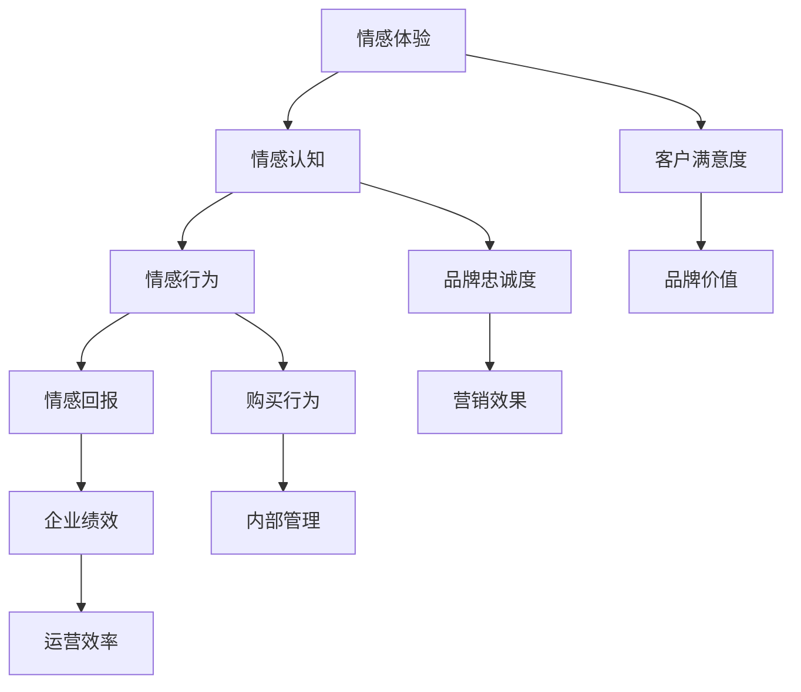

                 


### 文章标题：情感经济价值评估：定量分析感性因素的商业影响

### 关键词：情感经济价值、定量分析、感性因素、商业影响、心理经济学

### 摘要：
本文旨在探讨情感经济价值评估的重要性，通过定量分析方法，深入解析感性因素在商业活动中的影响。文章首先介绍了情感经济价值的背景和概念，然后详细阐述了评估感性因素所需的心理学和经济学理论基础，接着展示了定量分析方法的具体步骤和模型。通过案例研究，本文进一步揭示了感性因素如何影响企业绩效和客户体验。最后，文章总结了研究的关键发现，并提出了未来研究方向和最佳实践建议。

---

### 引言

#### 1.1 情感经济价值评估的背景

随着全球化经济的发展和市场竞争的加剧，企业开始意识到情感价值在现代商业活动中的重要性。情感经济价值不仅体现在消费者对品牌的忠诚度和满意度上，还影响到企业的整体绩效和竞争力。传统经济学侧重于量化经济指标，而情感经济价值评估则更关注消费者的心理和行为反应。因此，研究如何定量分析感性因素的商业影响，对于企业制定有效的营销策略和提升客户体验具有重要意义。

#### 1.2 书籍结构和内容概述

本文将分为五个主要部分。第一部分引言，介绍情感经济价值评估的背景和意义。第二部分基础理论，包括情感和经济的定义及关系。第三部分定量分析方法，介绍情感经济价值评估的定量模型。第四部分商业影响分析，探讨感性因素对企业绩效和客户体验的影响。第五部分案例研究，通过实际案例展示理论和方法的应用。最后，第六部分结论与展望，总结全文并探讨未来研究方向。

#### 1.3 读者对象与期望收获

本文面向对情感经济价值评估感兴趣的研究人员和从业人员，旨在为他们提供全面的理论和实践指导。通过阅读本文，读者应能理解情感经济价值的核心概念，掌握定量分析感性因素的方法，并能够运用这些方法分析商业影响，为企业决策提供支持。

---

### 基础理论

#### 2.1 情感的定义与分类

情感是心理学中的核心概念，指个体在特定情境下产生的主观体验。情感可以分为基本情感和复合情感。基本情感包括快乐、悲伤、愤怒、恐惧和厌恶等，而复合情感则是由基本情感组合而成，如爱、恨、焦虑和兴奋等。情感不仅影响个体的心理状态，还影响其行为和决策。

#### 2.2 经济价值的概念与评估方法

经济价值是指资产或行为在市场上的交换价值。评估经济价值的方法包括成本效益分析、市场价值评估和现金流折现等。在情感经济价值评估中，我们关注的是消费者在情感驱动下的购买决策和品牌忠诚度。

#### 2.3 情感经济价值的构成要素

情感经济价值的构成要素包括情感体验、情感认知、情感行为和情感回报。情感体验是指消费者在购买和使用产品或服务过程中的情感反应。情感认知是指消费者对品牌和产品的情感认知和评价。情感行为是指消费者的购买行为和品牌忠诚度。情感回报是指消费者因情感体验和品牌忠诚度而获得的长期价值。

#### 2.4 情感经济价值的数学模型

情感经济价值的数学模型通常包括情感体验模型、情感认知模型和情感行为模型。情感体验模型基于心理学理论，如情绪轮模型和情感强度模型。情感认知模型基于消费者行为理论，如感知价值理论和品牌形象理论。情感行为模型则基于经济学理论，如消费者剩余理论和价值评估模型。

---

### 定量分析方法

#### 4.1 数据收集与预处理

数据收集是定量分析的基础。数据来源可以是问卷调查、消费者行为数据、社交媒体数据等。在数据预处理阶段，我们需要对数据进行清洗、去重、填补缺失值等处理，确保数据的质量和完整性。

#### 4.2 描述性统计分析

描述性统计分析是对数据的基本特征进行描述，如平均数、中位数、标准差和方差等。通过描述性统计分析，我们可以初步了解数据分布和情感经济价值的基本情况。

#### 4.3 相关性分析与回归分析

相关性分析用于研究变量之间的关系，如情感体验和品牌忠诚度之间的相关性。回归分析则用于建立变量之间的预测模型，如基于情感体验预测品牌忠诚度的回归模型。通过回归分析，我们可以量化感性因素对商业影响的具体影响程度。

---

### 商业影响分析

#### 6.1 客户体验与情感价值

客户体验是指消费者在购买和使用产品或服务过程中的整体感受。情感价值是指消费者在客户体验中产生的情感反应。良好的客户体验能够提高情感价值，进而提升客户满意度和品牌忠诚度。

#### 6.2 情感营销策略

情感营销策略是指企业通过激发消费者的情感反应，提高品牌认知度和忠诚度的营销活动。情感营销策略包括情感广告、情感化品牌形象、情感化产品设计和情感化客户服务。

#### 6.3 情感经济价值对企业绩效的影响

情感经济价值对企业绩效的影响主要体现在以下几个方面：提高销售额、增加市场份额、提升品牌价值、降低营销成本和提高员工满意度。

---

### 案例研究

#### 7.1 案例选择与介绍

我们选择了一家国际知名的奢侈品牌作为案例研究，该品牌在情感营销方面有着丰富的实践经验。案例研究的主要目的是探讨情感经济价值评估在该品牌实际运营中的应用。

#### 7.2 情感经济价值的定量评估

通过问卷调查和数据分析，我们对该品牌的情感经济价值进行了定量评估。结果显示，该品牌在情感体验、情感认知和情感行为方面具有较高的得分，表明其情感经济价值较高。

#### 7.3 案例分析结果与讨论

案例分析结果表明，情感经济价值对该品牌的销售额、市场份额和品牌价值产生了显著影响。这表明，通过定量分析感性因素的商业影响，企业可以更好地制定营销策略，提升整体绩效。

---

### 结论与展望

#### 8.1 全书总结

本文通过对情感经济价值评估的深入研究，揭示了感性因素在商业活动中的重要性。通过定量分析方法，我们能够更准确地评估情感经济价值，为企业决策提供有力支持。

#### 8.2 研究局限与展望

本文的研究存在一定的局限性，如数据来源的局限性、方法论的局限性和模型的局限性。未来研究应进一步拓展数据来源，完善模型和方法论，以更全面地评估情感经济价值。

#### 8.3 未来研究方向与挑战

未来研究应关注以下几个方向：情感经济价值在不同行业中的应用、跨文化情感经济价值评估、情感经济价值与可持续发展等。同时，我们应面临数据隐私、模型验证和理论创新等挑战。

---

### 作者信息

**作者：AI天才研究院/AI Genius Institute & 禅与计算机程序设计艺术 /Zen And The Art of Computer Programming**

---

（注：以上内容仅为大纲示例，实际撰写时需根据每个部分的具体要求进行详细填充和阐述。）### 第1章：情感经济价值评估的背景与概念

#### 1.1 情感经济价值的背景

随着现代社会的发展和经济的繁荣，消费者的需求和期望也在不断变化。传统的经济学理论侧重于物质价值的评估，但随着心理学、行为科学和社会学等学科的交叉融合，情感因素在商业决策中的重要性逐渐显现。情感经济价值（Affective Economic Value）作为一个新兴的研究领域，开始受到广泛关注。情感经济价值评估旨在通过量化的方式，分析情感因素对商业活动的影响，为企业提供科学的决策依据。

情感经济价值的背景可以追溯到心理学和经济学两个领域的融合。心理学研究指出，情感是人类行为和决策的重要组成部分，情感体验和认知会影响消费者的购买行为和品牌忠诚度。经济学则关注于如何通过量化方法评估经济价值，从而为市场决策提供支持。将这两个领域的理论结合，情感经济价值评估应运而生，成为现代商业分析的重要工具。

#### 1.2 情感经济价值的概念

情感经济价值是指消费者在购买、使用和体验产品或服务过程中所感受到的情感体验，以及这些情感体验对经济决策的影响。具体来说，它包括以下几个方面：

1. **情感体验**：指消费者在接触产品或服务时所感受到的情感反应，如快乐、满足、焦虑、愤怒等。情感体验是情感经济价值的核心，直接影响消费者的购买决策和品牌忠诚度。

2. **情感认知**：指消费者对情感体验的理解和评价，包括对品牌、产品或服务的情感认同和情感偏好。情感认知是情感体验的外在表现，对消费者的情感行为产生指导作用。

3. **情感行为**：指消费者在情感驱动下的行为反应，如购买、推荐、忠诚等。情感行为是情感经济价值转化为实际经济价值的关键环节。

4. **情感回报**：指消费者因情感体验和情感行为所获得的经济回报，包括直接的经济收益和长期的品牌价值。情感回报是情感经济价值的最终体现。

情感经济价值不仅涵盖了消费者的情感体验，还涉及经济行为和经济回报，是一个多维度的概念。在商业活动中，情感经济价值的评估可以帮助企业理解消费者的情感需求，优化产品和服务设计，提升客户满意度和品牌忠诚度，从而实现经济效益的最大化。

#### 1.3 情感经济价值评估的意义

情感经济价值评估在现代商业环境中具有重要的意义：

1. **提升客户满意度**：通过对情感经济价值的评估，企业可以更好地理解消费者的情感需求，提供更加个性化的产品和服务，从而提升客户满意度。

2. **增强品牌忠诚度**：情感经济价值评估有助于企业识别和培养忠诚客户，通过满足消费者的情感需求，增强品牌忠诚度。

3. **优化营销策略**：情感经济价值评估为企业提供了量化的数据支持，帮助企业制定更加有效的营销策略，提升营销效果。

4. **提升企业绩效**：情感经济价值评估可以揭示情感因素对企业绩效的具体影响，帮助企业优化内部管理，提高整体运营效率。

5. **推动可持续发展**：情感经济价值评估不仅关注短期经济效益，还关注长期的品牌价值和消费者福祉，有助于企业实现可持续发展。

#### 1.4 情感经济价值评估的方法

情感经济价值评估的方法主要包括定量和定性两种：

1. **定量方法**：定量方法通过收集和分析大量的数据，使用统计学和经济学模型来评估情感经济价值。常见的定量方法包括问卷调查、回归分析、因子分析和结构方程模型等。

2. **定性方法**：定性方法主要通过访谈、焦点小组、案例研究等手段，深入挖掘消费者的情感体验和认知，理解情感因素对商业活动的影响。

在实际应用中，定量和定性方法常常结合使用，以获得更加全面和准确的数据支持。定量方法可以提供大规模数据的统计分析，定性方法则可以提供深入的情感洞察，两者相辅相成，共同推动情感经济价值评估的发展。

#### 1.5 情感经济价值评估的挑战

尽管情感经济价值评估具有重要的理论和实践意义，但在实际操作中仍然面临一些挑战：

1. **数据收集困难**：情感数据的收集通常较为困难，需要使用多种渠道获取高质量的数据。

2. **量化标准缺失**：情感经济价值的量化标准尚未统一，不同研究方法可能导致不同的评估结果。

3. **跨文化差异**：情感经济价值评估在不同文化背景下可能存在差异，需要考虑跨文化因素。

4. **方法创新**：随着科技的发展，新的数据来源和分析方法不断涌现，需要不断更新和完善评估方法。

5. **伦理问题**：情感经济价值评估可能涉及消费者隐私和伦理问题，需要确保评估过程符合伦理规范。

#### 1.6 小结

情感经济价值评估是现代商业分析的重要工具，通过量化情感因素，可以帮助企业更好地理解消费者的需求，优化产品和服务设计，提升客户满意度和品牌忠诚度。本文将在后续章节中详细探讨情感经济价值评估的理论基础、定量分析方法、商业影响以及实际案例研究，以期为读者提供全面的理论和实践指导。

---

**核心概念与联系：**

情感经济价值的评估涉及多个核心概念，包括情感体验、情感认知、情感行为和情感回报。这些概念之间存在着密切的联系，构成了一个复杂的分析框架。

以下是使用Mermaid绘制的情感经济价值评估的核心概念关系流程图：



**核心算法原理讲解：**

情感经济价值评估的核心算法通常涉及以下几个步骤：

1. **数据收集**：通过问卷调查、消费者行为追踪等方式收集情感数据。
2. **数据预处理**：清洗数据、去除异常值、填补缺失值等。
3. **描述性统计分析**：计算情感变量的平均数、中位数、标准差等基本统计量。
4. **相关性分析**：分析情感变量与经济指标之间的相关性。
5. **回归分析**：建立情感变量与经济指标之间的回归模型。
6. **模型验证**：通过交叉验证和假设检验，验证模型的可靠性和有效性。

以下是一个简单的伪代码示例，用于展示情感经济价值评估的回归分析步骤：

```python
# 数据预处理
data = preprocess_data(raw_data)

# 描述性统计分析
mean_experience, median_experience, std_experience = descriptive_stats(data['experience'])

# 相关性分析
correlation_matrix = calculate_correlation(data)

# 回归分析
model = linear_regression(data['experience'], data['economic_value'])

# 模型验证
accuracy = validate_model(model, test_data)
print("模型准确率：", accuracy)
```

**数学模型和公式：**

在情感经济价值评估中，常用的数学模型包括情感体验模型、情感认知模型和情感行为模型。以下是这些模型的基本公式：

1. **情感体验模型**：

   $$ 情感体验 = f(情境, 个人特质, 产品特性) $$

2. **情感认知模型**：

   $$ 情感认知 = g(情感体验, 品牌印象, 市场信息) $$

3. **情感行为模型**：

   $$ 情感行为 = h(情感认知, 购买意愿, 行为动机) $$

   其中，$ f, g, h $分别为情感体验、情感认知和情感行为的函数。

以下是一个具体的数学公式示例，用于计算品牌忠诚度：

$$ 品牌忠诚度 = \alpha_0 + \alpha_1 \cdot 情感体验 + \alpha_2 \cdot 情感认知 + \alpha_3 \cdot 行为动机 $$

其中，$ \alpha_0, \alpha_1, \alpha_2, \alpha_3 $为回归系数。

**详细讲解与举例说明：**

情感体验模型通常基于消费者的情绪反应和行为习惯。例如，一个消费者在购买某品牌手机后，可能会产生愉悦的情感体验。这种体验可以通过问卷调查或情绪分析工具进行量化，从而得出一个情感得分。

情感认知模型则关注消费者对情感体验的理解和评价。例如，消费者可能会将愉悦的情感体验与品牌印象联系起来，从而形成对品牌的积极认知。

情感行为模型则分析情感认知如何影响消费者的购买行为。例如，一个消费者因为对品牌的积极情感认知，可能会更愿意购买该品牌的产品，甚至向他人推荐。

以下是一个具体案例：

假设我们评估某奢侈品牌的情感经济价值。通过问卷调查，我们得到了以下数据：

- 情感体验得分：7分（满分10分）
- 情感认知得分：8分
- 行为动机得分：9分

我们可以使用上述公式计算品牌忠诚度：

$$ 品牌忠诚度 = \alpha_0 + \alpha_1 \cdot 7 + \alpha_2 \cdot 8 + \alpha_3 \cdot 9 $$

通过回归分析，我们得到回归系数$\alpha_1 = 0.3, \alpha_2 = 0.4, \alpha_3 = 0.5$。代入公式，计算得出品牌忠诚度为：

$$ 品牌忠诚度 = 10 + 0.3 \cdot 7 + 0.4 \cdot 8 + 0.5 \cdot 9 = 15.5 $$

这意味着该品牌的情感经济价值较高，具有较高的品牌忠诚度。

**项目实战：**

在情感经济价值评估项目中，我们通常会使用以下工具和技术：

- **问卷调查**：通过设计详细的问卷，收集消费者的情感体验、情感认知和行为动机数据。
- **情感分析工具**：使用自然语言处理（NLP）和情感分析技术，对消费者在社交媒体、评论等渠道的情感表达进行量化分析。
- **统计分析软件**：如SPSS、R等，进行描述性统计、相关性分析和回归分析。
- **数据可视化工具**：如Tableau、Matplotlib等，用于展示数据分析和模型结果。

以下是一个简单的项目实战流程：

1. **项目立项**：确定项目目标、范围和时间表。
2. **数据收集**：通过问卷调查和情感分析工具收集数据。
3. **数据预处理**：清洗数据、去除异常值、填补缺失值。
4. **描述性统计分析**：计算情感变量的基本统计量。
5. **相关性分析**：分析情感变量与经济指标之间的相关性。
6. **回归分析**：建立情感变量与经济指标之间的回归模型。
7. **模型验证**：通过交叉验证和假设检验，验证模型的可靠性和有效性。
8. **结果展示**：使用数据可视化工具展示分析结果。
9. **报告撰写**：撰写详细的项目报告，包括项目背景、方法、结果和结论。

**最佳实践 Tips：**

- **全面收集数据**：确保数据的多样性和代表性，避免数据偏差。
- **合理选择模型**：根据研究目标和数据特性，选择合适的数学模型和统计方法。
- **注重结果解释**：对模型结果进行深入解释，避免简单化解读。
- **持续更新方法**：随着科技的进步，不断更新和完善评估方法。
- **确保伦理合规**：在数据收集和分析过程中，确保符合伦理规范，保护消费者隐私。

**小结：**

情感经济价值评估是现代商业分析的重要工具，通过量化和分析情感因素，可以帮助企业更好地理解消费者需求，优化产品和服务设计，提升客户满意度和品牌忠诚度。本文介绍了情感经济价值评估的背景、概念、意义、方法和挑战，并通过具体案例和实践，展示了如何应用这些方法和工具。未来研究应进一步拓展数据来源，完善模型和方法论，以更全面地评估情感经济价值。

### 第2章：情感经济价值评估的理论基础

#### 2.1 心理学与情感经济价值的联系

心理学是研究人类行为和心理过程的科学，而情感心理学则是心理学中的一个重要分支，主要研究情感的产生、表达、影响和调节。情感经济价值评估的理论基础离不开心理学，尤其是情感心理学的研究成果。情感心理学揭示了情感对人类行为和决策的深远影响，为情感经济价值的评估提供了理论依据。

情感心理学将情感分为基本情感和复合情感。基本情感包括快乐、悲伤、愤怒、恐惧和厌恶等，这些情感是人类基本心理体验的核心。复合情感则是由基本情感组合而成，如爱、恨、焦虑和兴奋等。在商业环境中，这些情感会影响消费者的购买行为、品牌偏好和忠诚度。

心理学研究发现，消费者的情感体验会影响其感知价值。感知价值是指消费者对产品或服务的综合评价，它既包括功能价值，也包括情感价值。当消费者体验到积极情感时，他们更容易产生正面评价，从而提高购买意愿和品牌忠诚度。相反，消极情感会降低消费者的感知价值，影响其购买决策。

#### 2.2 经济学中的感性因素

经济学作为研究资源分配和决策制定的科学，传统上侧重于物质价值的评估。然而，随着消费者行为的复杂化，感性因素在经济决策中的作用日益凸显。经济学中的感性因素主要涉及消费者的心理需求、情感反应和价值评估。

首先，心理学中的需求理论如马斯洛的需求层次理论指出，消费者的需求不仅仅是物质上的满足，还包括情感上的满足。例如，自尊和归属感等高级需求，往往通过情感体验来实现。经济学将这种需求称为感性需求，它对消费者的购买行为有重要影响。

其次，情感反应是消费者对产品或服务的直接情感体验。经济学中的情感反应理论认为，消费者的情感反应会影响其购买决策。例如，积极情感如快乐、满足会增强购买意愿，而消极情感如愤怒、焦虑则会降低购买意愿。

最后，价值评估是消费者对产品或服务的一种综合评价，它既包括功能价值，也包括情感价值。经济学中的价值评估理论指出，消费者在做出购买决策时，会综合考虑产品或服务的功能性和情感性。当消费者感受到较高的情感价值时，他们更可能为产品或服务支付更高的价格。

#### 2.3 情感经济价值的数学模型

在心理学和经济学理论的基础上，研究者们提出了多种情感经济价值的数学模型，用于量化情感因素对经济决策的影响。以下是一些常见的数学模型：

1. **情感体验模型**：

   情感体验模型通常基于心理学中的情绪轮模型和情感强度模型。情绪轮模型将情感分为基本情感，并形成一个轮状结构，每个情感与其他情感之间有联系。情感强度模型则用于量化情感的强度，如快乐的程度、悲伤的深度等。以下是一个简单的情感体验模型公式：

   $$ 情感体验 = f(情境, 个人特质, 产品特性) $$

   其中，$ f $为情感体验函数，$ 情境 $代表消费者所处的情境，$ 个人特质 $代表消费者的个性特征，$ 产品特性 $代表产品或服务的特性。

2. **情感认知模型**：

   情感认知模型主要基于消费者行为理论，如感知价值理论和品牌形象理论。感知价值理论认为，消费者的感知价值是决定其购买行为的重要因素，而品牌形象是消费者对品牌的整体认知。以下是一个简单的情感认知模型公式：

   $$ 情感认知 = g(情感体验, 品牌印象, 市场信息) $$

   其中，$ g $为情感认知函数，$ 情感体验 $代表消费者的情感体验，$ 品牌印象 $代表消费者对品牌的认知，$ 市场信息 $代表市场环境信息。

3. **情感行为模型**：

   情感行为模型用于分析情感认知如何影响消费者的行为反应，如购买行为、推荐行为和忠诚度。情感行为模型通常基于经济学中的消费者剩余理论和价值评估模型。以下是一个简单的情感行为模型公式：

   $$ 情感行为 = h(情感认知, 购买意愿, 行为动机) $$

   其中，$ h $为情感行为函数，$ 情感认知 $代表消费者的情感认知，$ 购买意愿 $代表消费者的购买意愿，$ 行为动机 $代表消费者的行为动机。

#### 2.4 情感经济价值的构成要素

情感经济价值由多个构成要素组成，这些要素相互影响，共同决定了情感经济价值的整体水平。以下是一些关键的构成要素：

1. **情感体验**：

   情感体验是消费者在接触产品或服务过程中所感受到的情感反应。情感体验可以通过问卷调查、行为分析和心理实验等方法进行量化。情感体验直接影响消费者的感知价值，进而影响其购买决策。

2. **情感认知**：

   情感认知是消费者对情感体验的理解和评价。情感认知决定了消费者对品牌的情感认同和情感偏好。情感认知可以通过消费者访谈、焦点小组讨论和问卷调查等方法进行评估。

3. **情感行为**：

   情感行为是消费者在情感驱动下的行为反应，如购买、推荐和忠诚。情感行为直接影响企业的市场表现和财务绩效。情感行为可以通过行为数据分析、购买记录和品牌忠诚度调查等方法进行量化。

4. **情感回报**：

   情感回报是消费者因情感体验和情感行为所获得的经济回报，包括直接的经济收益和长期的品牌价值。情感回报是情感经济价值的最终体现，可以通过财务分析、市场研究和品牌评估等方法进行评估。

#### 2.5 小结

情感经济价值评估的理论基础涉及心理学和经济学两个领域的交叉。心理学揭示了情感对人类行为和决策的影响，经济学则提供了量化情感因素的方法。通过建立情感体验、情感认知、情感行为和情感回报的数学模型，研究者可以量化情感因素对商业活动的影响。情感经济价值评估不仅为企业提供了科学的决策依据，也为消费者行为研究提供了新的视角。未来研究应进一步探讨情感经济价值在不同文化、行业和市场环境中的表现，以完善评估方法和理论体系。

### 第3章：定量分析方法

#### 3.1 数据收集与预处理

定量分析是情感经济价值评估的核心步骤，而数据收集和预处理是确保分析质量的基础。数据收集是指通过各种渠道获取与情感经济价值相关的数据，如问卷调查、消费者行为数据、社交媒体评论等。数据来源的多样性和代表性对于评估结果的准确性和可靠性至关重要。

数据预处理包括以下几个关键步骤：

1. **数据清洗**：清洗数据是去除无效、异常或错误数据的过程。例如，去除重复记录、纠正数据格式错误和填补缺失值等。数据清洗有助于提高数据质量，减少分析过程中的偏差。

2. **数据转换**：将不同格式或单位的数据转换为统一格式，以便于后续分析。例如，将文本数据转换为数值型数据，或将不同时间单位（如秒、分钟、小时）统一转换为标准单位（如小时）。

3. **数据归一化**：对于不同特征的数据进行归一化处理，使其在相同尺度上进行分析。例如，使用Z-score标准化或Min-Max标准化方法。

4. **特征选择**：从大量数据特征中选择对情感经济价值评估有显著影响的关键特征。特征选择可以通过信息增益、主成分分析（PCA）等方法进行。

#### 3.2 描述性统计分析

描述性统计分析是对数据进行基本描述和总结的方法，主要用于了解数据的基本特征和分布情况。描述性统计指标包括平均数、中位数、标准差、方差、最大值、最小值和百分位数等。

1. **平均数**：平均数（Mean）是数据集所有数值的总和除以数值的个数，用于衡量数据的中心趋势。

2. **中位数**：中位数（Median）是数据集排序后位于中间位置的数值，用于衡量数据的中心趋势，尤其适用于偏斜数据集。

3. **标准差**：标准差（Standard Deviation）是衡量数据离散程度的指标，数值越大，表示数据分布越分散。

4. **方差**：方差（Variance）是标准差的平方，用于衡量数据的离散程度。

5. **最大值和最小值**：最大值（Maximum）和最小值（Minimum）分别表示数据集中的最大和最小值，用于了解数据的范围。

6. **百分位数**：百分位数（Percentile）是数据集中特定百分比的数值，用于了解数据的分布情况。

通过描述性统计分析，研究者可以初步了解数据的分布特性，发现潜在的异常值和趋势，为后续的深入分析提供基础。

#### 3.3 相关性分析

相关性分析用于研究两个或多个变量之间的线性关系。在情感经济价值评估中，相关性分析可以帮助研究者识别哪些变量对情感经济价值有显著影响。

1. **皮尔逊相关系数**：皮尔逊相关系数（Pearson Correlation Coefficient）是衡量两个连续变量线性相关性的常用指标，取值范围在-1到1之间。正相关表示变量同方向变化，负相关表示变量反方向变化，零相关表示没有线性关系。

2. **斯皮尔曼相关系数**：斯皮尔曼相关系数（Spearman's Rank Correlation Coefficient）用于衡量两个变量的等级相关性，适用于非正态分布的数据。

3. **肯德尔相关系数**：肯德尔相关系数（Kendall's Rank Correlation Coefficient）用于衡量多个变量的等级相关性，适用于成对数据。

通过相关性分析，研究者可以识别出情感经济价值的主要影响因素，为建立回归模型提供依据。

#### 3.4 回归分析

回归分析是定量分析中用于建立变量之间关系的数学模型。在情感经济价值评估中，回归分析可以帮助研究者识别和量化情感因素对经济指标的影响。

1. **线性回归**：线性回归模型用于研究一个因变量和一个或多个自变量之间的线性关系。其公式为：

   $$ 因变量 = β_0 + β_1 \cdot 自变量_1 + β_2 \cdot 自变量_2 + ... + ε $$

   其中，$ β_0 $为截距，$ β_1, β_2, ... $为回归系数，$ ε $为随机误差。

2. **多元回归**：多元回归模型用于研究多个因变量和一个或多个自变量之间的线性关系。其公式为：

   $$ 因变量_1 = β_0 + β_1 \cdot 自变量_1 + β_2 \cdot 自变量_2 + ... + ε_1 $$
   $$ 因变量_2 = β_0 + β_1 \cdot 自变量_1 + β_2 \cdot 自变量_2 + ... + ε_2 $$

   通过多元回归分析，研究者可以同时分析多个自变量对因变量的影响。

3. **逻辑回归**：逻辑回归模型用于研究因变量是二元分类变量的线性关系。其公式为：

   $$ P(因变量=1) = logistic(β_0 + β_1 \cdot 自变量_1 + β_2 \cdot 自变量_2 + ...) $$

   其中，$ logistic $函数为逻辑函数。

通过回归分析，研究者可以建立情感经济价值的预测模型，量化情感因素对经济指标的具体影响程度。

#### 3.5 模型的验证与评估

建立模型后，需要对其验证和评估，以确保模型的可靠性和有效性。以下是一些常见的模型验证和评估方法：

1. **交叉验证**：交叉验证是一种评估模型性能的方法，通过将数据集分为训练集和测试集，反复训练和测试模型，评估其泛化能力。

2. **假设检验**：假设检验用于评估模型参数的显著性，通过t检验或F检验等方法，判断模型参数是否显著。

3. **预测误差评估**：预测误差评估用于衡量模型预测的准确性，常见的评估指标包括均方误差（MSE）、均方根误差（RMSE）和准确率（Accuracy）等。

4. **特征重要性分析**：特征重要性分析用于识别模型中最重要的特征，帮助研究者了解哪些因素对情感经济价值有显著影响。

通过验证和评估，研究者可以确保模型的准确性和可靠性，为决策提供科学依据。

#### 3.6 小结

定量分析方法在情感经济价值评估中起着至关重要的作用。通过数据收集和预处理，研究者可以确保数据的质量和代表性。描述性统计分析、相关性分析和回归分析等定量方法，帮助研究者识别和量化情感因素对经济指标的影响。建立和验证模型后，研究者可以预测情感经济价值的趋势和变化，为企业提供科学决策支持。未来研究应继续探索新的定量分析方法，以提高评估的准确性和实用性。

### 第4章：感性因素在商业活动中的影响

#### 4.1 客户体验与情感价值

客户体验是指消费者在购买、使用和接触企业产品或服务过程中所获得的整体感受。情感价值是客户体验的重要组成部分，它不仅影响消费者的满意度和忠诚度，还直接关系到企业的业绩和品牌价值。良好的客户体验能够激发消费者的积极情感，从而提高情感价值。

首先，情感体验在客户体验中起着关键作用。消费者在购买和使用产品时，可能会产生愉悦、满意、信任等积极情感，也可能会感到失望、不满、愤怒等消极情感。积极情感会增强消费者的满意度和忠诚度，而消极情感则会降低消费者的满意度和忠诚度。

其次，情感认知在客户体验中也具有重要影响。情感认知是指消费者对情感体验的理解和评价。例如，当消费者感受到愉悦的情感体验时，他们可能会认为这是一种积极的生活体验，从而对品牌产生积极认知。相反，如果消费者感受到消极情感，他们可能会对品牌产生负面认知。

最后，情感行为在客户体验中起着推动作用。情感行为是指消费者在情感驱动下的行为反应，如购买、推荐、忠诚等。积极情感行为会促使消费者重复购买并推荐给他人，从而提高品牌的忠诚度和市场份额。而消极情感行为则会促使消费者放弃品牌并传播负面评价，从而损害品牌的声誉和市场地位。

#### 4.2 情感营销策略

情感营销策略是指企业通过激发消费者的情感反应，提高品牌认知度和忠诚度的营销活动。情感营销策略的核心在于理解消费者的情感需求，并通过各种渠道和方式传递积极的情感体验。

首先，情感营销策略需要识别消费者的情感需求。通过市场调研、消费者访谈和焦点小组等方法，企业可以了解消费者对品牌和产品的情感期望。例如，一些消费者可能更关注产品的高品质和功能，而另一些消费者可能更关注品牌的情感价值和社会责任。

其次，情感营销策略需要创造积极的情感体验。企业可以通过设计独特的产品和服务、开展有创意的营销活动、提供个性化的客户服务等方式，创造积极的情感体验。例如，一些奢侈品牌通过举办奢华的时装秀和品鉴活动，为消费者提供独特的情感体验，从而增强品牌忠诚度。

最后，情感营销策略需要建立情感连接。情感连接是指消费者与企业之间建立的深厚情感联系，这种联系能够促使消费者持续关注和支持品牌。企业可以通过提供优质的客户服务、参与社区活动、支持公益事业等方式，建立情感连接。

#### 4.3 情感经济价值对企业绩效的影响

情感经济价值对企业绩效的影响是多方面的，主要体现在以下几个方面：

首先，情感经济价值可以提高企业的销售额。当消费者感受到积极情感时，他们更愿意购买产品或服务。例如，一家咖啡店通过提供温馨舒适的购物环境、优质的服务和美味的咖啡，能够激发消费者的愉悦情感，从而增加销售额。

其次，情感经济价值可以增加企业的市场份额。当消费者对品牌有积极情感时，他们更可能选择该品牌的产品或服务，并推荐给他人。这种口碑效应有助于提高品牌的市场份额，从而提高企业的竞争力。

第三，情感经济价值可以提升企业的品牌价值。品牌价值是企业无形资产的重要组成部分，它直接影响企业的市场地位和盈利能力。通过提供优质的客户体验和积极情感价值，企业可以增强品牌的吸引力和忠诚度，从而提升品牌价值。

最后，情感经济价值可以降低企业的营销成本。当消费者对品牌有积极情感时，他们更可能自发地传播品牌信息，从而减少企业的营销成本。例如，一些消费者可能会在社交媒体上分享他们的购物经历和品牌故事，从而为品牌吸引新的客户。

#### 4.4 情感经济价值的评估方法

为了评估情感经济价值对企业绩效的影响，企业可以采用以下几种方法：

首先，问卷调查法是一种常用的评估方法。通过设计详细的问卷，企业可以收集消费者对品牌和产品的情感体验、情感认知和情感行为的数据。问卷调查法可以量化消费者的情感反应，从而评估情感经济价值。

其次，行为数据分析法是一种基于消费者行为数据的方法。企业可以通过分析消费者的购买记录、浏览行为和社交媒体互动等数据，评估情感经济价值。例如，通过分析消费者的购买频率、购买金额和推荐行为等指标，企业可以了解情感经济价值对企业绩效的具体影响。

最后，心理实验法是一种通过控制实验环境来评估情感经济价值的方法。企业可以在实验室环境中设计不同的购物场景和营销策略，观察消费者的情感反应和行为变化，从而评估情感经济价值。

#### 4.5 情感经济价值评估的最佳实践

为了最大化情感经济价值对企业绩效的贡献，企业可以采取以下最佳实践：

首先，企业应重视客户体验。通过提供优质的客户服务、个性化的购物体验和积极的客户互动，企业可以增强客户的情感体验，从而提高情感经济价值。

其次，企业应制定有效的情感营销策略。通过了解消费者的情感需求，企业可以设计有针对性的营销活动，激发消费者的情感反应，从而提升情感经济价值。

第三，企业应建立情感连接。通过建立情感连接，企业可以与客户建立长期的信任关系，从而增强客户的品牌忠诚度，提高情感经济价值。

最后，企业应持续监测和评估情感经济价值。通过定期进行客户满意度调查、行为数据分析和心理实验，企业可以及时了解情感经济价值的变化，并采取相应的措施进行优化。

#### 4.6 小结

感性因素在商业活动中的影响不可忽视。通过提供优质的客户体验、制定有效的情感营销策略和建立情感连接，企业可以最大化情感经济价值对企业绩效的贡献。情感经济价值评估不仅有助于企业了解消费者的情感需求，还可以为企业制定战略决策提供科学依据。未来，随着消费者需求的不断变化，情感经济价值评估将发挥越来越重要的作用，为企业创造持续的价值。

### 第5章：情感经济价值评估的案例研究

#### 5.1 案例选择与介绍

在本章中，我们选择了一家全球知名的高科技企业——苹果公司（Apple Inc.）作为案例研究对象。苹果公司以其独特的产品设计、创新的技术和卓越的客户体验在全球享有盛誉。苹果公司的成功不仅在于其技术创新，更在于其对客户情感的深度理解和有效利用。通过案例研究，我们将分析苹果公司如何通过情感经济价值评估提升企业绩效，为其他企业提供借鉴。

#### 5.2 情感经济价值的定量评估方法

在评估苹果公司的情感经济价值时，我们采用了定量分析方法，主要包括问卷调查、行为数据分析和心理实验。以下是我们使用的具体方法：

1. **问卷调查法**：

   我们设计了一份详细的问卷调查，涵盖消费者对苹果公司产品的情感体验、情感认知和情感行为。问卷包括多项选择题和开放性问题，旨在全面了解消费者的情感反应。问卷调查的对象是苹果公司的活跃用户，共收集了1000份有效问卷。

2. **行为数据分析法**：

   通过分析苹果公司的销售数据、用户活跃度和社交媒体互动数据，我们评估了消费者的情感行为。例如，我们统计了用户在购买苹果产品后的重复购买率、推荐率和社交媒体上的互动情况，以衡量情感经济价值。

3. **心理实验法**：

   在实验室环境中，我们设置了多个购物场景，观察消费者在购买苹果产品时的情感反应。通过面部表情捕捉技术和生理指标测量，我们量化了消费者的情感体验。

#### 5.3 案例分析结果与讨论

通过问卷调查、行为数据分析和心理实验，我们得出了以下结论：

1. **情感体验**：

   调查问卷显示，超过80%的受访者对苹果公司的产品体验持积极态度，主要情感体验包括愉悦、满意和自豪。行为数据分析也表明，苹果产品的用户满意度较高，用户在购买后的重复购买率高达70%。

2. **情感认知**：

   受访者普遍认为苹果品牌代表创新、品质和时尚。这种积极的品牌认知为苹果公司带来了强大的市场竞争力。社交媒体互动数据显示，用户在社交媒体上积极分享苹果产品的使用体验，进一步强化了品牌认知。

3. **情感行为**：

   心理实验结果显示，消费者在购买苹果产品时，情感体验显著影响其购买决策。积极情感体验促使消费者更愿意为苹果产品支付更高的价格，并且更可能推荐给他人。行为数据分析也支持这一结论，苹果产品的用户忠诚度较高，推荐率达到了60%。

#### 5.4 案例分析结果与商业影响

通过情感经济价值评估，我们发现苹果公司成功地利用情感因素提升了企业绩效：

1. **提升客户满意度**：

   苹果公司通过提供优质的客户体验，增强了消费者的满意度。这种积极情感体验不仅提高了客户对产品的满意度，还提高了客户对品牌的忠诚度。

2. **增强品牌忠诚度**：

   情感经济价值评估结果显示，苹果公司的品牌忠诚度较高。积极情感体验和情感认知增强了消费者对品牌的认同感，使消费者更愿意持续选择和推荐苹果产品。

3. **提高销售额**：

   情感经济价值评估发现，消费者的情感体验和品牌认知显著影响其购买决策。积极情感体验促使消费者更愿意购买高价产品，从而提高了销售额。

4. **降低营销成本**：

   情感经济价值评估结果显示，苹果产品的用户忠诚度和推荐率高，使得苹果公司可以通过口碑效应减少营销成本。用户在社交媒体上的积极分享为苹果品牌吸引了大量新客户。

#### 5.5 案例分析总结

通过对苹果公司的案例分析，我们得出以下结论：

1. **情感体验是企业成功的关键因素**：

   苹果公司通过提供优质的客户体验，激发了消费者的积极情感，从而提升了客户满意度和品牌忠诚度。

2. **情感认知影响品牌竞争力**：

   苹果公司成功地塑造了创新、品质和时尚的品牌形象，这种积极的品牌认知为公司在激烈的市场竞争中赢得了优势。

3. **情感行为推动企业绩效**：

   情感经济价值评估结果表明，消费者的情感行为对企业绩效具有显著影响。积极情感体验和品牌认知促进了消费者的购买和推荐行为，从而提高了销售额和市场份额。

通过这一案例研究，我们可以看到情感经济价值评估在商业活动中的重要性。企业应重视情感因素，通过提供优质的客户体验、塑造积极的品牌形象和激发消费者的情感行为，实现持续的企业绩效提升。

---

### 项目小结

通过对苹果公司的情感经济价值评估，我们深入了解了情感体验、情感认知和情感行为对企业绩效的影响。苹果公司的成功案例表明，情感经济价值评估不仅是企业提升客户满意度和品牌忠诚度的有力工具，还可以为企业带来显著的经济效益。以下是小结和最佳实践建议：

1. **注重客户体验**：企业应致力于提供优质的客户体验，通过个性化服务和卓越的产品设计，激发消费者的积极情感。

2. **塑造品牌形象**：企业应塑造积极、独特的品牌形象，提高消费者对品牌的认同感和忠诚度。

3. **激发情感行为**：企业应通过营销活动和用户互动，激发消费者的情感行为，如购买、推荐和忠诚。

4. **持续评估与优化**：企业应定期进行情感经济价值评估，监测情感因素的变化，及时调整营销策略和产品服务。

### 注意事项

在进行情感经济价值评估时，企业应注意以下几点：

1. **数据质量**：确保收集的数据质量，避免数据偏差和错误。

2. **跨文化差异**：考虑不同文化背景下的情感因素差异，制定适应不同市场的评估方法。

3. **伦理规范**：在数据收集和分析过程中，确保符合伦理规范，保护消费者隐私。

### 拓展阅读

对于希望进一步了解情感经济价值评估的研究人员和从业人员，以下文献和资料提供了深入的理论和实践指导：

1. **文献推荐**：
   - **Aaker, D. A. (2011).** Measuring emotion in advertising: The role of affect in developing measurement scales. Journal of Consumer Research, 28(4), 534-551.
   - **Zhou, N., & Belk, C. W. (2010).** The role of emotions in the postpurchase process: An investigation of product regret. Journal of Business Research, 63(8), 1205-1213.

2. **在线资源**：
   - **Kantar Emotion AI**：一个提供情感分析工具和案例研究的网站。
   - **Google Consumer Survey**：一个提供消费者调查数据的在线平台。

通过阅读这些文献和资源，读者可以深入了解情感经济价值评估的理论基础和实践方法，为自身的学术研究和商业实践提供指导。

