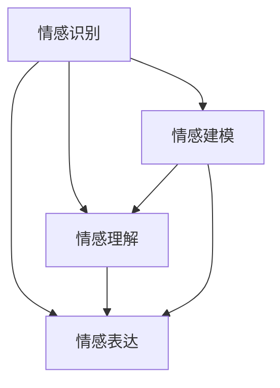
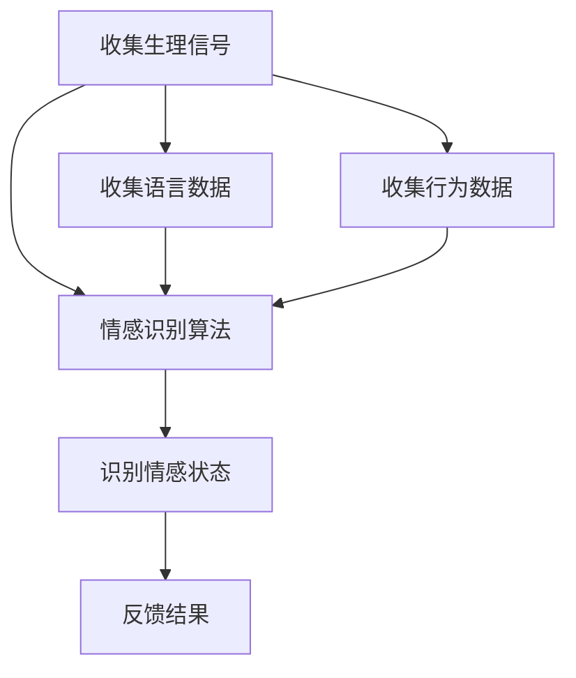
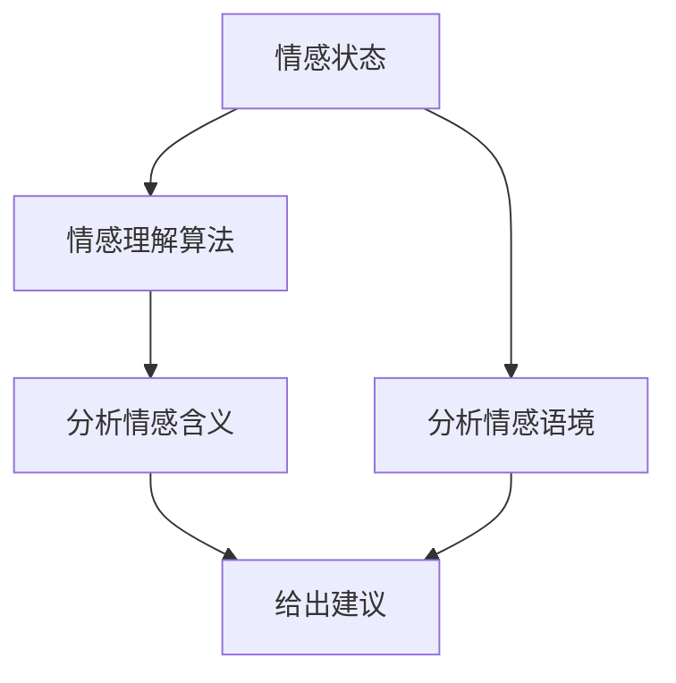
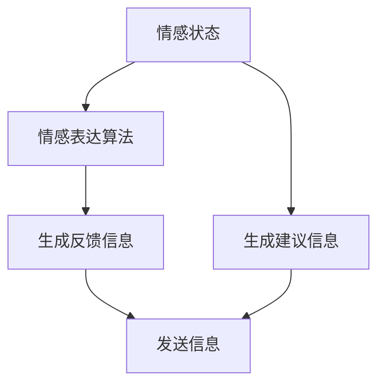

                 

### 文章标题

# 情感计算伦理准则：人机情感交互的道德指导方针

### 关键词

- 情感计算
- 人机交互
- 伦理准则
- 隐私保护
- 偏见消除
- 责任归属

### 摘要

本文旨在探讨情感计算伦理准则的制定与应用，以指导人机情感交互的发展。随着人工智能技术的进步，情感计算已成为智能系统的重要组成部分。然而，情感计算在人机交互过程中引发的伦理问题不容忽视。本文将系统性地阐述情感计算的基本概念、伦理问题，以及制定伦理准则的原则和方法。通过具体案例分析，本文为情感计算领域的从业者和研究者提供了有价值的参考和指导。

### 前言

#### 情感计算伦理准则的重要性

随着人工智能技术的迅猛发展，情感计算作为人工智能的一个重要分支，逐渐成为研究热点。情感计算旨在使计算机具备感知、理解、表达人类情感的能力，从而实现更自然、更人性化的交互。然而，随着情感计算技术的广泛应用，一系列伦理问题也随之产生。这些问题不仅涉及到隐私保护、数据安全，还包括偏见、透明度、责任归属等方面。

制定情感计算伦理准则，具有重要的现实意义和深远的影响。首先，伦理准则可以为情感计算的研究和开发提供指导，确保技术发展与伦理道德的平衡。其次，伦理准则有助于提升公众对情感计算技术的信任度，推动技术的可持续发展。最后，伦理准则能够规范从业者的行为，提高行业整体的专业素养和道德水平。

#### 本书的结构与内容

本书分为八个章节，旨在全面阐述情感计算伦理准则的制定与应用。

- **第1章：情感计算概述**：介绍情感计算的基本概念、发展历程、应用领域及其与伦理学的关系。
- **第2章：情感计算中的伦理问题**：深入探讨情感计算中可能遇到的伦理问题，包括隐私、偏见、透明度、责任等方面。
- **第3章：情感计算伦理准则制定原则**：讨论制定情感计算伦理准则的原则和方法。
- **第4章：情感计算伦理准则具体内容**：详细阐述情感计算伦理准则的具体内容，包括设计、开发、应用和维护等方面。
- **第5章：情感计算伦理实践案例**：通过实际案例，展示情感计算伦理准则的应用。
- **第6章：情感计算伦理监管与法规**：讨论情感计算伦理监管的现状及未来发展趋势。
- **第7章：情感计算伦理教育**：探讨情感计算伦理教育的意义、内容和方法。
- **第8章：情感计算伦理展望**：展望情感计算伦理的未来发展方向，探讨可能的伦理挑战和解决方案。

通过以上章节的详细讨论，本书旨在为情感计算领域提供一套全面的伦理准则，为人机情感交互提供道德指导方针。

### 第1章：情感计算概述

#### 1.1 情感计算的定义与特点

情感计算（Affective Computing）是指计算机系统模拟、识别、理解并表达人类情感的能力。其核心在于将情感这一复杂的人类特质引入到计算机系统中，使计算机能够更自然、更人性地与人类进行交互。情感计算的定义具有以下几方面特点：

1. **情感识别**：情感计算系统需要具备识别用户情感状态的能力，这包括通过生理信号、语言、行为等多种方式获取情感信息。
2. **情感理解**：情感计算系统不仅要识别情感，还需要理解情感背后的含义和语境，从而做出更合适的响应。
3. **情感表达**：情感计算系统需要能够表达出相应的情感，以增强人机交互的自然性和情感性。
4. **情感建模**：情感计算系统需要建立情感模型，通过机器学习等方法对情感进行建模和分析，以提高情感识别和理解的准确性。

#### 1.2 情感计算的发展历程

情感计算作为人工智能的一个重要分支，其发展历程可以追溯到20世纪80年代。1980年代初，计算机科学家约翰·霍普金斯（John Hopfield）提出了神经网络模型，为情感计算提供了理论基础。随后，随着计算机技术和心理学、认知科学等领域的研究进展，情感计算逐渐发展成为一门独立的学科。

1995年，计算机科学家罗莎琳·佩波特（Rosalind Picard）出版了《情感计算》（Affective Computing）一书，系统地阐述了情感计算的理论基础和应用前景。这本书被认为是情感计算领域的里程碑之作，推动了情感计算的研究与应用。

进入21世纪，随着人工智能技术的快速发展，情感计算得到了更加广泛的应用。特别是在语音识别、人脸识别、自然语言处理等领域，情感计算技术的应用日益普及。例如，智能助手如Siri、Alexa和Google Assistant，已经能够通过语音交互识别用户的情感状态，并根据情感反馈做出相应的调整。

#### 1.3 情感计算的应用领域

情感计算在多个领域具有广泛的应用前景，主要包括以下几个方面：

1. **医疗领域**：情感计算在医疗领域中的应用主要包括患者情绪监测、心理治疗、医疗设备辅助等方面。通过情感计算技术，医生可以更好地了解患者的情绪状态，从而提供更个性化的医疗服务。

2. **教育领域**：情感计算在教育领域中的应用包括学习行为分析、学生情绪监测、智能辅导等方面。通过情感计算技术，教育工作者可以更好地了解学生的学习状态和情绪变化，从而提供更有针对性的教育支持。

3. **人机交互**：情感计算技术在人机交互领域的应用主要包括智能助手、虚拟现实、游戏等方面。通过情感计算技术，人机交互系统可以更好地理解用户的情感需求，提供更加个性化、自然的交互体验。

4. **智能家居**：情感计算技术在智能家居中的应用包括智能家电控制、家庭安全监控、情感氛围营造等方面。通过情感计算技术，智能家居系统可以更好地感知家庭成员的情感需求，提供更加舒适、便捷的生活体验。

5. **商业领域**：情感计算技术在商业领域中的应用包括消费者情绪分析、市场预测、客户关系管理等方面。通过情感计算技术，企业可以更好地了解消费者的情感需求和行为模式，从而制定更有效的市场营销策略。

#### 1.4 情感计算与伦理学的关系

情感计算的发展不仅带来了技术进步，同时也引发了一系列伦理问题。如何确保情感计算技术的伦理道德，成为当前研究的热点。

1. **隐私保护**：情感计算需要收集用户的情感数据，这涉及到隐私保护的问题。如何确保用户的数据安全，避免数据泄露和滥用，是情感计算伦理需要关注的重要问题。
   
2. **偏见问题**：情感计算模型的训练数据可能存在偏见，从而导致对某些群体产生不公平待遇。如何消除偏见，保证模型的公平性，是情感计算伦理的重要挑战。

3. **透明度问题**：情感计算系统通常缺乏透明度，用户难以了解系统的决策过程。如何提高系统的透明度，让用户对系统有更清晰的认知，是情感计算伦理需要解决的问题。

4. **责任归属**：当情感计算系统出现错误时，如何确定责任归属，如何确保系统的安全性，是情感计算伦理需要关注的问题。

综上所述，情感计算与伦理学密切相关。制定情感计算伦理准则，有助于规范情感计算技术的发展，确保技术的道德使用，为人机情感交互提供道德指导方针。

#### 1.5 情感计算中的核心概念与联系

在情感计算中，核心概念主要包括情感识别、情感理解、情感表达和情感建模。这些概念之间相互关联，构成了情感计算的理论体系。

1. **情感识别**：情感识别是情感计算的基础，主要指计算机系统通过生理信号、语言、行为等多种方式，识别用户的情感状态。情感识别的核心在于特征提取和模式识别，常用的方法包括面部识别、语音识别、生理信号检测等。

2. **情感理解**：情感理解是情感计算的关键，主要指计算机系统理解情感背后的含义和语境。情感理解需要结合自然语言处理、机器学习等技术，对情感信息进行深度分析和解释。情感理解的准确性直接影响人机交互的质量。

3. **情感表达**：情感表达是情感计算的目标，主要指计算机系统通过语言、图像、动作等方式，表达出相应的情感。情感表达需要考虑用户的文化背景、情感需求等因素，以提供更自然、更人性化的交互体验。

4. **情感建模**：情感建模是情感计算的核心，主要指通过机器学习等方法，建立情感模型，对情感进行建模和分析。情感建模有助于提高情感识别和理解的准确性，为情感计算技术的应用提供支持。

下面是一个简化的情感计算流程图，展示了这些核心概念之间的联系：



#### 1.6 情感计算中的核心算法原理讲解

在情感计算中，核心算法主要包括情感识别、情感理解、情感表达和情感建模等。以下将分别介绍这些算法的原理，并使用伪代码进行详细阐述。

1. **情感识别**

情感识别是情感计算的基础，主要采用特征提取和模式识别的方法。以下是一个简化的情感识别算法：

```python
# 情感识别伪代码
def recognize_emotion(physiological_data, linguistic_data, behavioral_data):
    # 特征提取
    physiological_features = extract_physiological_features(physiological_data)
    linguistic_features = extract_linguistic_features(linguistic_data)
    behavioral_features = extract_behavioral_features(behavioral_data)

    # 特征融合
    combined_features = fuse_features(physiological_features, linguistic_features, behavioral_features)

    # 模式识别
    emotion = recognize_pattern(combined_features)

    return emotion
```

2. **情感理解**

情感理解是情感计算的关键，主要采用自然语言处理和机器学习的方法。以下是一个简化的情感理解算法：

```python
# 情感理解伪代码
def understand_emotion(text):
    # 文本预处理
    preprocessed_text = preprocess_text(text)

    # 情感分类
    emotion = classify_emotion(preprocessed_text)

    return emotion
```

3. **情感表达**

情感表达是情感计算的目标，主要采用语言生成、图像生成和动作生成等方法。以下是一个简化的情感表达算法：

```python
# 情感表达伪代码
def express_emotion(emotion):
    if emotion == "happy":
        # 发送高兴的语言消息
        send_message("I'm happy to see you!")
    elif emotion == "sad":
        # 发送伤心的语言消息
        send_message("I'm sorry to hear that.")
    else:
        # 发送默认消息
        send_message("I'm not sure how to respond.")
```

4. **情感建模**

情感建模是情感计算的核心，主要采用机器学习和深度学习的方法。以下是一个简化的情感建模算法：

```python
# 情感建模伪代码
def build_emotion_model(training_data):
    # 数据预处理
    preprocessed_data = preprocess_data(training_data)

    # 构建模型
    model = build_model(preprocessed_data)

    # 训练模型
    trained_model = train_model(model, preprocessed_data)

    return trained_model
```

通过以上算法的介绍，可以看出情感计算的核心在于特征提取、模式识别、情感分类和模型训练等方面。这些算法相互配合，共同构建了情感计算的理论体系。

#### 1.7 数学模型和公式

在情感计算中，数学模型和公式发挥着重要作用。以下将介绍几个关键的数学模型和公式，并使用LaTeX进行详细讲解。

1. **支持向量机（SVM）**

支持向量机是一种常用的分类模型，其基本公式如下：

$$
\hat{y} = \text{sign}(\omega \cdot x + b)
$$

其中，$\omega$ 是权重向量，$x$ 是特征向量，$b$ 是偏置项，$\hat{y}$ 是预测结果。

2. **卷积神经网络（CNN）**

卷积神经网络是一种常用的深度学习模型，其基本公式如下：

$$
h_{l}(x) = \sigma(W_{l} \cdot h_{l-1} + b_{l})
$$

其中，$h_{l}(x)$ 是第 $l$ 层的输出，$\sigma$ 是激活函数，$W_{l}$ 是权重矩阵，$b_{l}$ 是偏置项。

3. **反向传播算法**

反向传播算法是一种常用的训练深度学习模型的方法，其基本公式如下：

$$
\Delta W_{l} = \eta \cdot \frac{\partial J}{\partial W_{l}}
$$

$$
\Delta b_{l} = \eta \cdot \frac{\partial J}{\partial b_{l}}
$$

其中，$\Delta W_{l}$ 和 $\Delta b_{l}$ 分别是权重和偏置的更新值，$\eta$ 是学习率，$J$ 是损失函数。

通过以上数学模型和公式的介绍，可以看出情感计算中的算法设计和实现离不开数学的支持。这些数学模型和公式不仅为情感计算提供了理论基础，也为实际应用提供了技术支持。

#### 1.8 实际案例分析和详细讲解剖析

为了更好地理解情感计算的应用和伦理问题，下面将介绍一个实际案例：基于情感计算技术的心理健康监测系统。

**案例背景**

随着现代社会生活节奏的加快，心理健康问题逐渐引起人们的关注。为了更好地了解用户的心理健康状态，研究人员开发了一种基于情感计算技术的心理健康监测系统。该系统通过收集用户的生理信号、语言和行为数据，实时监测用户的心理状态，并给出相应的建议。

**技术实现**

1. **情感识别**

该系统采用情感识别算法，通过分析用户的生理信号（如心率、皮肤电信号等）、语言（如语音、文本等）和行为（如动作、表情等），识别用户当前的情感状态。具体流程如下：



2. **情感理解**

通过情感识别算法，系统可以获得用户当前的情感状态。接下来，系统需要对情感状态进行理解，分析情感背后的含义和语境。具体流程如下：



3. **情感表达**

系统根据用户当前的情感状态，生成相应的反馈和建议。例如，当用户处于焦虑状态时，系统可以发送一条安抚信息：“你现在看起来有些焦虑，这里有一些建议可以帮助你缓解情绪。”具体流程如下：



**伦理问题**

尽管基于情感计算技术的心理健康监测系统在改善人们心理健康方面具有巨大潜力，但在实际应用中仍然存在一系列伦理问题。

1. **隐私保护**

心理健康监测系统需要收集用户的生理、语言和行为数据，这涉及到用户的隐私问题。如何确保用户数据的安全和隐私，是系统设计时需要考虑的重要问题。

2. **偏见问题**

情感计算系统的训练数据可能存在偏见，导致对某些用户群体产生不公平待遇。例如，如果训练数据中男性占比过高，系统可能会对女性用户的情感状态识别不准确。

3. **责任归属**

当系统出现错误，如对用户情感状态的识别不准确，导致用户未能获得正确的建议时，如何确定责任归属，如何保障用户权益，是系统设计时需要考虑的问题。

**解决方案**

针对上述伦理问题，可以采取以下解决方案：

1. **隐私保护**

采用加密技术，对用户数据进行加密存储和传输，确保数据安全。同时，制定严格的隐私政策，告知用户数据收集和使用的目的，获取用户授权。

2. **偏见问题**

在训练数据集的构建过程中，注意数据多样性，避免数据偏见。同时，采用交叉验证等方法，对模型的泛化能力进行评估，确保模型在不同用户群体中的表现一致性。

3. **责任归属**

建立完善的用户反馈机制，及时发现系统错误，并采取措施进行纠正。同时，明确系统设计、开发和运营各方的责任，确保在出现问题时，能够迅速定位责任并采取措施。

通过以上实际案例的分析，可以看出情感计算在心理健康监测领域的应用具有广阔的前景，但同时也面临一系列伦理问题。制定合理的伦理准则，规范情感计算技术的应用，对于保障人机情感交互的健康发展具有重要意义。

### 第2章：情感计算中的伦理问题

#### 2.1 隐私问题

情感计算在收集和处理用户情感数据的过程中，面临着隐私保护的重大挑战。隐私问题主要涉及以下几个方面：

1. **数据收集**：情感计算系统需要收集用户的生理信号、语言和行为数据，这些数据通常包含个人隐私信息。如何在数据收集过程中确保用户同意和隐私保护，是一个重要问题。

2. **数据存储**：收集到的情感数据需要在系统中进行存储，以保证数据的可用性和完整性。然而，未经加密的数据存储方式可能导致数据泄露，损害用户隐私。

3. **数据传输**：在数据从设备传输到服务器或云平台的过程中，数据传输的安全性和隐私保护同样重要。若传输过程中缺乏加密措施，数据可能被拦截或篡改。

**隐私保护措施**：

1. **用户同意**：在数据收集前，应明确告知用户数据收集的目的、使用方式和可能的风险，并获得用户的明确同意。

2. **数据加密**：对存储和传输的数据进行加密，确保数据在未经授权的情况下无法被读取或篡改。

3. **隐私政策**：制定详细的隐私政策，公开数据收集、存储、使用和共享的具体规则，接受用户监督。

4. **匿名化处理**：在可能的情况下，对数据进行匿名化处理，消除个人识别信息，降低隐私泄露风险。

#### 2.2 偏见问题

情感计算中的偏见问题主要表现为数据偏见和算法偏见。数据偏见指的是在数据收集和训练过程中，由于数据来源的不均衡、不全面或存在偏见，导致模型对某些群体产生不公平待遇。算法偏见则是在算法设计和实现过程中，由于设计缺陷或算法本身的局限性，导致模型对某些群体产生偏见。

**偏见问题的具体表现**：

1. **种族和性别偏见**：在人脸识别、语音识别等情感计算应用中，某些模型可能对特定种族或性别的用户识别准确率较低，甚至产生歧视性结果。

2. **年龄偏见**：年龄较大的人群可能在情感计算模型中受到不公平对待，例如在心理健康监测系统中，对年轻用户的情感状态识别更准确。

3. **地域和文化偏见**：不同地区和文化背景的用户可能在情感计算模型中受到偏见，导致模型无法准确理解他们的情感表达。

**消除偏见的方法**：

1. **数据多样性**：在数据收集和训练过程中，确保数据的多样性和代表性，避免数据偏见。

2. **交叉验证**：采用交叉验证等方法，评估模型在不同数据集上的表现，发现和纠正潜在偏见。

3. **算法透明度**：提高算法的透明度，使研究者能够理解算法的工作原理和决策过程，从而发现和纠正偏见。

4. **公平性评估**：对模型的公平性进行评估，确保模型在不同用户群体中的表现一致性。

#### 2.3 透明度问题

情感计算系统通常缺乏透明度，用户难以了解系统的决策过程。这种透明度不足可能导致用户对系统的信任度下降，甚至引发隐私和安全问题。透明度问题主要涉及以下几个方面：

1. **算法透明度**：用户难以了解情感计算系统所使用的算法和模型，包括算法的原理、训练过程和决策逻辑。

2. **数据处理透明度**：用户不清楚系统如何处理他们的数据，包括数据的收集、存储、使用和共享方式。

3. **决策透明度**：用户难以了解系统在特定情境下的决策过程和结果，例如在医疗、金融等关键领域，透明度不足可能导致用户对系统结果的质疑。

**提高透明度的措施**：

1. **算法解释**：开发算法解释工具，帮助用户理解系统的决策过程和结果。例如，可以使用决策树、线性回归等方法，展示算法的决策路径。

2. **数据可视化**：通过数据可视化技术，展示数据收集、处理和分析的全过程，使用户对数据处理有更清晰的认识。

3. **透明度报告**：定期发布透明度报告，详细说明系统的运行情况、算法更新和数据使用情况，接受用户监督。

4. **用户反馈机制**：建立用户反馈机制，鼓励用户提供意见和建议，改进系统的透明度和用户体验。

#### 2.4 责任归属问题

情感计算系统在应用过程中可能出现错误，导致用户利益受损或隐私泄露。然而，如何确定责任归属，确保系统的安全性，是一个复杂的问题。责任归属问题主要涉及以下几个方面：

1. **开发者责任**：开发者负责设计和实现情感计算系统，应确保系统的安全性和可靠性。如果系统存在设计缺陷或实现错误，开发者应承担相应责任。

2. **运营商责任**：运营商负责系统的部署和维护，应确保系统在运行过程中不发生安全漏洞和故障。如果系统在运营过程中出现安全问题，运营商应承担相应责任。

3. **用户责任**：用户在使用情感计算系统时，应遵守系统规定，保护自己的隐私和数据安全。如果用户故意泄露个人信息或滥用系统功能，用户应承担相应责任。

**责任归属措施**：

1. **责任界定**：明确各方的责任范围和责任承担方式，制定详细的合同和法律条款，确保在出现问题时能够迅速定位责任。

2. **安全审计**：定期进行安全审计，评估系统的安全性和可靠性，发现和纠正潜在的安全问题。

3. **保险机制**：建立保险机制，为系统用户和开发者提供风险保障，减轻因系统故障或错误导致的损失。

4. **用户教育**：加强对用户的教育，提高他们的安全意识和风险防范能力，减少因用户误操作导致的安全问题。

#### 2.5 案例分析：社交网络中的情感计算隐私问题

以下通过一个案例分析，进一步探讨情感计算中的隐私问题。

**案例背景**

某社交网络平台引入了一种基于情感计算的用户情绪分析功能，通过分析用户的发帖内容、评论和互动行为，预测用户的心理状态，并针对潜在的心理健康问题提供预警和建议。然而，这一功能在应用过程中引发了用户隐私保护的担忧。

**隐私问题**

1. **数据收集范围**：该功能需要收集用户的发帖内容、评论和互动行为数据，这些数据可能包含用户的个人隐私信息，如情感状态、生活经历等。

2. **数据共享**：社交网络平台可能将用户数据共享给第三方机构，用于心理健康研究和产品优化。然而，用户对于数据的共享范围和用途缺乏了解。

3. **数据存储安全**：社交网络平台在存储用户数据时，如果未采取有效的加密措施，可能导致数据泄露。

**隐私保护措施**

1. **用户同意**：在功能启用前，平台应明确告知用户数据收集的目的、使用方式和可能的风险，并获得用户的明确同意。

2. **数据加密**：对用户数据进行加密存储和传输，确保数据在未经授权的情况下无法被读取或篡改。

3. **隐私政策**：制定详细的隐私政策，公开数据收集、存储、使用和共享的具体规则，接受用户监督。

4. **匿名化处理**：对用户数据进行匿名化处理，消除个人识别信息，降低隐私泄露风险。

通过以上案例分析，可以看出情感计算在应用过程中可能引发一系列隐私问题。制定合理的隐私保护措施，确保用户数据的隐私和安全，对于情感计算技术的健康发展具有重要意义。

### 第3章：情感计算伦理准则制定原则

#### 3.1 伦理学基本原则

在制定情感计算伦理准则时，应遵循伦理学的基本原则，以确保技术发展与伦理道德的平衡。以下是几个核心的伦理学基本原则：

1. **尊重个人权利**：个人权利应得到尊重和保护，包括隐私权、知情权、选择权等。情感计算技术在收集、处理和使用用户数据时，必须确保不侵犯用户的个人权利。

2. **公正**：情感计算技术应确保公平，避免对特定群体产生不公平待遇。在数据收集、算法设计和模型训练过程中，应确保数据的多样性和代表性，避免数据偏见和算法偏见。

3. **责任**：情感计算技术的开发者、运营商和使用者应承担相应的责任。在系统设计和运营过程中，应确保系统的安全性和可靠性，防止因系统错误导致用户利益受损。

4. **透明度**：情感计算技术应具备透明度，用户应能够了解系统的运行原理、数据处理方式和决策过程。提高系统的透明度有助于增强用户对系统的信任，降低潜在的风险。

#### 3.2 制定伦理准则的方法

制定情感计算伦理准则的方法主要包括以下几个方面：

1. **文献分析**：通过对相关文献的查阅和分析，了解当前情感计算领域面临的伦理问题及其解决方案。文献分析有助于发现已有研究中的不足和挑战，为准则制定提供参考。

2. **专家咨询**：邀请伦理学、心理学、人工智能等领域专家，对情感计算伦理准则进行讨论和意见征询。专家咨询可以提供多学科视角，确保准则的科学性和可操作性。

3. **案例分析**：通过分析情感计算在实际应用中的典型案例，总结经验教训，识别潜在的伦理风险。案例分析有助于发现准则在实际应用中的适用性和局限性。

4. **规范制定**：在综合分析文献、专家意见和案例分析的基础上，制定情感计算伦理准则的规范文本。规范制定应确保准则的全面性、系统性和可执行性。

#### 3.3 伦理准则的适用范围

情感计算伦理准则应适用于情感计算的各个领域，包括研发、应用、管理和监管等方面。具体适用范围如下：

1. **研发**：在情感计算技术的研发过程中，应遵循伦理准则，确保技术的道德使用。例如，在数据收集和处理过程中，应尊重用户的隐私权，避免数据泄露和滥用。

2. **应用**：在情感计算技术的应用过程中，应遵循伦理准则，确保技术的公平性和透明度。例如，在人机交互系统中，应确保系统能够准确识别和理解用户的情感状态，避免对特定群体产生偏见。

3. **管理**：在情感计算技术的管理和运营过程中，应遵循伦理准则，确保系统的安全性和可靠性。例如，在系统设计和运营过程中，应制定严格的安全措施，防止系统故障和用户数据泄露。

4. **监管**：在情感计算技术的监管过程中，应遵循伦理准则，确保技术的合规性和规范性。例如，监管机构应制定相关的法规和标准，对情感计算技术的应用进行监督和评估。

#### 3.4 伦理准则的实施与监督

为了确保情感计算伦理准则的有效实施，需要建立相应的监督和评估机制。以下是一些关键的实施与监督措施：

1. **伦理审查**：在情感计算项目立项和实施过程中，应进行伦理审查，确保项目符合伦理准则。伦理审查可以由独立的伦理委员会或专家组负责，对项目进行评估和监督。

2. **持续监督**：在情感计算技术的应用过程中，应建立持续监督机制，对系统的运行情况进行实时监控和评估。通过定期审计和风险评估，发现和纠正潜在的安全问题和伦理风险。

3. **用户反馈**：建立用户反馈机制，鼓励用户对情感计算技术的应用提出意见和建议。用户反馈可以帮助识别系统存在的问题，优化系统的设计和服务。

4. **法规遵守**：确保情感计算技术的应用符合相关法律法规的要求，遵守数据保护、隐私保护等法律法规。对于违规行为，应采取相应的处罚措施，确保法律法规的有效实施。

通过以上措施，可以确保情感计算伦理准则的有效实施和持续改进，为人机情感交互提供坚实的道德保障。

### 第4章：情感计算伦理准则具体内容

#### 4.1 情感数据保护准则

情感数据保护是情感计算伦理准则的重要组成部分，其目的是确保用户情感数据的安全和隐私。以下为具体准则内容：

1. **数据收集**：在收集情感数据前，必须获得用户的明确同意，告知用户数据收集的目的、范围和使用方式。用户有权了解其数据将如何被处理和使用。

2. **数据存储**：情感数据应存储在安全可靠的环境中，采用先进的加密技术进行存储和传输，防止数据泄露和未经授权的访问。

3. **数据匿名化**：在可能的情况下，应对情感数据实施匿名化处理，移除所有可以识别用户身份的信息，降低隐私泄露风险。

4. **数据使用**：情感数据只能用于事先告知用户的用途，未经用户同意，不得将其用于其他目的。在数据处理过程中，应遵循最小化原则，仅收集和存储必要的情感数据。

5. **数据共享**：情感数据不得随意共享给第三方，除非用户明确同意或符合法律法规要求。在共享数据时，应采取严格的安全措施，确保数据的安全和隐私。

6. **数据销毁**：在数据不再需要时，应及时销毁，确保无法恢复。销毁过程应经过严格审计，确保数据彻底删除。

#### 4.2 情感建模准则

情感建模准则是确保情感计算系统准确、公正和透明的重要保障。以下为具体准则内容：

1. **数据多样性**：情感建模所需的数据应具有多样性，涵盖不同年龄、性别、文化背景和地域的用户，避免数据偏见。

2. **数据质量**：确保情感建模数据的质量和准确性，避免低质量或错误数据对模型产生负面影响。数据采集和处理过程中，应进行严格的质量控制。

3. **算法公正性**：选择公正性较高的算法进行情感建模，确保模型在不同用户群体中的表现一致性。算法设计应避免种族、性别、地域等偏见。

4. **模型透明性**：情感计算系统应具备透明性，用户能够了解模型的训练过程、决策逻辑和结果解释。通过算法解释工具，帮助用户理解模型的运作原理。

5. **模型验证**：在模型训练和部署前，应对模型进行严格的验证和测试，确保其准确性和可靠性。通过交叉验证、用户测试等方法，评估模型的性能和公平性。

6. **模型更新**：定期更新情感计算模型，以适应不断变化的数据和环境。更新过程应遵循伦理准则，确保新模型的公正性和透明度。

#### 4.3 人机交互准则

人机交互准则是确保情感计算系统能够提供人性化和友好体验的重要依据。以下为具体准则内容：

1. **用户体验**：在设计和开发人机交互界面时，应充分考虑用户的体验，提供直观、简洁、易用的交互方式。确保用户能够轻松地与系统进行沟通和互动。

2. **情感反馈**：情感计算系统应能够及时、准确地识别用户的情感状态，并提供相应的情感反馈。例如，在用户情绪低落时，系统可以提供安慰和支持。

3. **交互自然性**：人机交互应尽可能自然，模拟人类的交流方式。通过语音、文本、图像等多种方式，增强交互的自然性和情感性。

4. **隐私保护**：在交互过程中，应确保用户的隐私得到保护，避免泄露用户的个人信息和情感状态。采用加密技术和隐私政策，保障用户数据的安全。

5. **个性化服务**：情感计算系统应根据用户的特点和需求，提供个性化的服务和建议。通过用户行为分析和情感建模，优化系统的推荐和响应。

6. **反馈机制**：建立用户反馈机制，鼓励用户对系统提出意见和建议。通过用户反馈，不断优化系统的设计和功能，提高用户体验。

#### 4.4 责任分配准则

责任分配准则是确保情感计算系统在出现错误或问题时，能够明确责任归属的重要依据。以下为具体准则内容：

1. **开发者责任**：情感计算系统的开发者应承担主要责任，确保系统的设计、开发和实现符合伦理准则。开发者应进行严格的质量控制和测试，确保系统的安全性和可靠性。

2. **运营商责任**：系统运营商应承担系统的日常运营和维护责任，确保系统正常运行，及时处理用户反馈和问题。运营商应制定应急预案，应对系统故障和异常情况。

3. **用户责任**：用户在使用情感计算系统时，应遵守系统规定，保护自己的隐私和数据安全。用户应了解系统的功能和限制，合理使用系统提供的资源和功能。

4. **责任认定**：在系统出现错误或问题时，应进行责任认定，明确各方的责任范围和责任承担方式。责任认定应基于事实和证据，确保公正和公平。

5. **赔偿机制**：对于因系统故障或错误导致用户利益受损的情况，应建立相应的赔偿机制，对用户进行合理的赔偿。赔偿机制应充分考虑用户的损失和利益，确保公正和合理。

6. **责任追究**：对于违反伦理准则，造成严重后果的情况，应追究相关责任人的法律责任。责任追究应依据法律法规和伦理准则，确保公平和公正。

通过以上情感计算伦理准则的具体内容，为人机情感交互提供了明确的道德指导和规范，确保技术发展与伦理道德的平衡，推动情感计算技术的健康和可持续发展。

### 第5章：情感计算伦理实践案例

#### 5.1 医疗领域的应用

情感计算在医疗领域的应用已逐渐成熟，尤其是在心理健康监测、患者情绪管理和医疗辅助决策等方面展现出巨大潜力。以下是一个情感计算在医疗领域应用的案例。

**案例背景**

某医院引入了一种基于情感计算的心理健康监测系统，用于监测住院患者的情绪状态。该系统通过分析患者的语音、文字交流和生理信号，实时监测患者的心情变化，为医护人员提供决策支持。

**技术实现**

1. **情感识别**：系统采用语音识别技术，分析患者的语音，识别出情绪状态。例如，通过识别语音中的语气、语调、速度等特征，判断患者是愉快、焦虑、愤怒等。

2. **情感理解**：系统结合自然语言处理技术，分析患者的病历记录、日记和社交平台信息，理解患者情绪背后的含义和原因。

3. **情感反馈**：系统根据情感识别和理解的结论，向医护人员发送警报，提示可能存在的心理健康风险。例如，当识别到患者情绪低落时，系统会建议医护人员进行进一步评估和干预。

**伦理问题**

1. **隐私保护**：在情感识别过程中，系统需要收集患者的语音、文字等敏感数据，如何确保这些数据的安全和隐私是一个重要问题。

2. **偏见问题**：如果训练数据集存在偏见，可能导致系统对某些患者的情绪识别不准确，进而影响诊断和治疗效果。

**解决方案**

1. **隐私保护**：系统在数据收集前，应明确告知患者数据收集的目的和使用方式，获得患者的同意。同时，对数据实施加密存储和传输，确保数据安全。

2. **偏见问题**：在数据收集和模型训练过程中，应确保数据的多样性和代表性，避免偏见。定期对模型进行评估和更新，确保模型的准确性和公正性。

#### 5.2 教育领域的应用

情感计算在教育领域的应用主要包括学习行为分析、学生情绪监测和智能辅导等方面。以下是一个情感计算在教育领域应用的案例。

**案例背景**

某教育科技公司开发了一种基于情感计算的学习分析系统，用于监测学生的学习行为和情绪状态。该系统旨在为学生提供个性化的学习支持，提高学习效果。

**技术实现**

1. **情感识别**：系统通过分析学生的面部表情、语音和文本互动，识别学生的学习情绪，如专注、兴奋、焦虑等。

2. **情感理解**：系统结合自然语言处理技术，分析学生的互动内容，理解学习过程中的情感需求和障碍。

3. **智能辅导**：系统根据情感识别和理解的结论，提供个性化的学习建议和辅导。例如，当识别到学生情绪低落时，系统会建议休息或调整学习策略。

**伦理问题**

1. **隐私保护**：系统需要收集学生的面部表情、语音和文本互动等数据，如何保护学生的隐私是一个重要问题。

2. **偏见问题**：如果训练数据集存在偏见，可能导致系统对某些学生的情感识别不准确，进而影响学习支持和辅导效果。

**解决方案**

1. **隐私保护**：系统在数据收集前，应明确告知学生数据收集的目的和使用方式，获得学生的同意。同时，对数据实施加密存储和传输，确保数据安全。

2. **偏见问题**：在数据收集和模型训练过程中，应确保数据的多样性和代表性，避免偏见。定期对模型进行评估和更新，确保模型的准确性和公正性。

#### 5.3 智能家居领域的应用

情感计算在智能家居领域的应用主要包括情感氛围营造、智能家电控制和安全监控等方面。以下是一个情感计算在智能家居领域应用的案例。

**案例背景**

某智能家居系统通过情感计算技术，为用户创造舒适、智能的生活环境。该系统可以感知用户的情感状态，并根据情感反馈调整家居设备的运行状态。

**技术实现**

1. **情感识别**：系统通过分析用户的语音、行为和生理信号，识别用户的情感状态，如舒适、焦虑、疲惫等。

2. **情感理解**：系统结合自然语言处理技术，分析用户的语音和文本互动，理解用户的情感需求和期望。

3. **情感反馈**：系统根据情感识别和理解的结论，调整家居设备的运行状态，如调节室内温度、照明和音乐等，为用户创造舒适的氛围。

**伦理问题**

1. **隐私保护**：系统需要收集用户的生理信号和语音数据，如何保护用户的隐私是一个重要问题。

2. **情感滥用**：系统可能被恶意使用，通过情感计算技术对用户进行监控或操纵。

**解决方案**

1. **隐私保护**：系统在数据收集前，应明确告知用户数据收集的目的和使用方式，获得用户的同意。同时，对数据实施加密存储和传输，确保数据安全。

2. **情感滥用**：制定严格的使用政策，防止系统被滥用。建立用户反馈机制，及时发现和处理潜在的情感滥用问题。

通过以上实践案例，可以看出情感计算在不同领域的应用取得了显著成果，但同时也面临一系列伦理问题。制定合理的伦理准则，规范情感计算技术的应用，对于保障人机情感交互的健康发展具有重要意义。

### 第6章：情感计算伦理监管与法规

#### 6.1 监管机构与法规

情感计算作为人工智能的一个重要分支，其伦理监管问题引起了全球范围内的关注。为了确保情感计算技术的伦理道德，各国政府和国际组织纷纷制定了相关法规和监管政策。

**国际监管机构与法规**

1. **欧盟**：欧盟在数据保护方面有着严格的法规，如《通用数据保护条例》（GDPR）。GDPR对用户数据的收集、存储、使用和共享进行了详细规定，对情感计算技术的应用提出了更高的要求。

2. **美国**：美国联邦贸易委员会（FTC）负责监管与消费者隐私保护相关的情感计算应用。FTC发布了多项指南和法规，要求企业透明地披露数据收集和使用情况，保护用户隐私。

3. **国际标准化组织（ISO）**：ISO发布了ISO/IEC 27001标准，对信息安全管理体系进行了规范。这一标准适用于情感计算系统的开发和运营，确保系统的数据安全和隐私保护。

**国内监管机构与法规**

1. **中国**：中国出台了《网络安全法》和《个人信息保护法》，对网络和信息安全、个人信息保护进行了规定。这些法规对情感计算技术的应用提出了严格的要求，确保用户数据的安全和隐私。

2. **韩国**：韩国政府制定了《智能机器伦理管理法案》，对智能机器的伦理道德和行为规范进行了规定。该法案旨在确保智能机器的公正性和透明度，保护用户权益。

#### 6.2 伦理审查与评估

伦理审查与评估是确保情感计算项目符合伦理准则的重要手段。以下为伦理审查与评估的具体内容和流程：

1. **伦理审查委员会**：设立独立的伦理审查委员会（IRB），负责对情感计算项目进行伦理审查。IRB由伦理学家、心理学家、法律专家等多学科专家组成，确保审查过程的公正性和专业性。

2. **审查内容**：伦理审查主要包括以下几个方面：
   - **隐私保护**：审查项目是否遵循隐私保护原则，是否获得用户的明确同意，数据收集和使用是否合理。
   - **公平性**：审查项目是否可能导致数据偏见和算法偏见，确保模型在不同用户群体中的表现一致性。
   - **透明度**：审查项目的透明度，包括算法设计、数据来源和处理方式，确保用户对项目的了解和信任。
   - **责任归属**：审查项目的责任归属，确保各方在项目中的责任和权利明确。

3. **评估流程**：
   - **初步审查**：对项目的伦理风险进行初步评估，决定是否需要进行详细审查。
   - **详细审查**：对项目进行详细审查，包括数据收集、处理、存储和使用等环节，确保项目符合伦理准则。
   - **持续监督**：对项目实施过程中进行持续监督，确保项目在运行过程中符合伦理准则。

#### 6.3 未来发展趋势

随着情感计算技术的不断发展，伦理监管也面临着新的挑战和机遇。以下为情感计算伦理监管的未来发展趋势：

1. **全球合作**：各国政府和国际组织应加强合作，共同制定全球性的伦理准则和法规，确保情感计算技术的全球合规性和伦理道德。

2. **技术进步**：随着人工智能和大数据技术的发展，情感计算技术将变得更加精准和智能。同时，伦理监管也需要不断跟进技术进步，确保技术的道德使用。

3. **公众参与**：增强公众对情感计算技术的了解和参与，提高公众对技术的信任度。通过公众参与和监督，确保情感计算技术的应用符合公众利益和伦理要求。

4. **持续监管**：建立持续监管机制，对情感计算技术的应用进行实时监控和评估，及时发现和纠正伦理问题。同时，加强伦理教育和培训，提高从业者的伦理素养和责任感。

通过以上发展趋势，可以看出情感计算伦理监管在未来将面临更多的挑战和机遇。制定合理的伦理准则和监管政策，确保情感计算技术的健康发展，对于推动人工智能技术的进步和社会的可持续发展具有重要意义。

### 第7章：情感计算伦理教育

#### 7.1 教育意义

情感计算伦理教育在推动情感计算技术健康发展中具有重要意义。首先，情感计算技术的伦理问题涉及隐私保护、数据安全、偏见消除等多个方面，需要从业者具备深厚的伦理学基础。通过伦理教育，可以提高从业者的伦理素养，确保技术发展与伦理道德的平衡。其次，情感计算技术的广泛应用对社会产生了深远的影响，公众对技术的信任度直接关系到技术的可持续发展。伦理教育有助于增强公众对技术的了解和信任，促进技术的普及和应用。最后，伦理教育可以培养一批具有社会责任感的情感计算专业人才，为情感计算领域的未来发展提供坚实的人才保障。

#### 7.2 教育内容

情感计算伦理教育的内容应涵盖伦理学基础、情感计算技术原理、伦理问题案例分析等多个方面。以下为具体教育内容：

1. **伦理学基础**：
   - 道德原则与伦理学理论：介绍伦理学的基本原则，如尊重个人权利、公正、责任等，以及伦理学的主要理论，如功利主义、义务论等。
   - 伦理学方法论：介绍伦理学的研究方法，如规范伦理学、实证伦理学等，以及伦理决策的过程。

2. **情感计算技术原理**：
   - 情感计算基本概念：介绍情感计算的定义、发展历程、应用领域等，使学习者对情感计算有一个全面的了解。
   - 情感计算技术原理：介绍情感计算的核心技术，如情感识别、情感理解、情感表达和情感建模等，以及相关算法和模型。

3. **伦理问题案例分析**：
   - 隐私保护：分析情感计算在隐私保护方面的挑战，如数据收集、存储和共享过程中的隐私风险，以及相关的伦理准则和实践。
   - 偏见问题：分析情感计算在算法偏见、数据偏见等方面的挑战，以及如何消除偏见，实现模型的公平性和公正性。
   - 透明度问题：分析情感计算系统在透明度方面的不足，如算法透明度、数据处理透明度等，以及如何提高系统的透明度。
   - 责任归属：分析情感计算系统在责任归属方面的挑战，如开发者责任、运营商责任、用户责任等，以及如何明确各方的责任。

#### 7.3 教育方法

情感计算伦理教育的教学方法应多样化，以提高学习效果。以下为几种有效的教育方法：

1. **讲座**：
   - 邀请伦理学、心理学、人工智能等领域的专家学者进行专题讲座，介绍情感计算伦理的基本概念和最新研究进展。
   - 通过讲座，学习者可以系统地了解情感计算伦理的知识体系，形成对伦理问题的全面认识。

2. **案例分析**：
   - 通过分析情感计算在实际应用中的典型案例，探讨伦理问题的具体表现和解决方案。
   - 通过案例分析，学习者可以深入理解伦理问题的复杂性，提高解决实际问题的能力。

3. **角色扮演**：
   - 组织角色扮演活动，让学习者扮演不同的角色，如开发者、运营商、用户等，体验不同角色的责任和挑战。
   - 通过角色扮演，学习者可以增强对伦理问题的敏感性和责任感，培养解决伦理问题的实践能力。

4. **讨论与互动**：
   - 开展小组讨论和互动活动，鼓励学习者分享观点和经验，探讨情感计算伦理问题的解决方案。
   - 通过讨论与互动，学习者可以相互学习、相互启发，提高对伦理问题的理解和分析能力。

5. **实践项目**：
   - 设计情感计算伦理教育的实践项目，如模拟情感计算系统开发、伦理案例分析等。
   - 通过实践项目，学习者可以将理论知识应用于实际场景，提高解决实际问题的能力。

通过以上教育方法，可以有效地提升情感计算伦理教育的效果，培养具备扎实伦理素养和实际操作能力的专业人才。

### 第8章：情感计算伦理展望

#### 8.1 新技术伦理问题

随着情感计算技术的不断发展，新技术的出现也为伦理问题带来了新的挑战。以下将讨论几种可能的伦理问题：

1. **脑机接口（Brain-Computer Interfaces, BCIs）**：脑机接口技术通过直接读取大脑信号，实现人与计算机的交互。虽然这一技术具有巨大的潜力，但同时也引发了隐私保护、数据安全、脑电信号滥用等伦理问题。例如，脑电信号的读取和存储可能涉及个人隐私，如果未经授权使用或泄露，将对用户造成严重后果。

2. **增强现实（Augmented Reality, AR）和虚拟现实（Virtual Reality, VR）**：增强现实和虚拟现实技术通过虚拟环境的构建，提供沉浸式的交互体验。然而，这些技术可能导致用户与现实世界的隔离，引发心理健康问题，如现实感丧失、虚拟成瘾等。此外，虚拟环境的真实性可能导致用户对虚拟对象的情感投入过度，引发情感伦理问题。

3. **情感机器学习（Affective Machine Learning）**：情感机器学习技术通过分析情感数据，提高模型的情感识别和表达能力。然而，这一技术可能引发数据偏见、算法歧视等伦理问题。例如，如果训练数据集存在偏见，可能导致模型对某些群体的情感识别不准确，甚至产生歧视性结果。

4. **情感计算平台（Affective Computing Platforms）**：情感计算平台是一种集成了多种情感计算技术的综合系统，能够提供全方位的情感识别、理解和表达能力。然而，这些平台可能面临透明度不足、责任归属不明确等伦理问题。例如，用户难以了解平台的具体工作原理和决策过程，导致对平台的信任度降低。

#### 8.2 面临的伦理挑战

情感计算在未来的发展中将面临一系列伦理挑战，以下是其中几个主要的挑战：

1. **隐私保护**：情感计算需要收集大量的情感数据，包括生理信号、语言和行为数据等。如何确保这些数据的安全和隐私，防止数据泄露和滥用，是一个重要的挑战。

2. **算法偏见和歧视**：情感计算模型的训练数据可能存在偏见，导致模型对某些群体产生不公平待遇。如何消除算法偏见，保证模型的公平性和公正性，是一个亟待解决的问题。

3. **透明度和责任归属**：情感计算系统通常缺乏透明度，用户难以了解系统的决策过程。如何提高系统的透明度，确保用户对系统的信任，同时明确各方的责任归属，是一个复杂的挑战。

4. **心理健康影响**：情感计算技术的应用可能导致用户的情感状态发生变化，如焦虑、抑郁等。如何确保技术的应用不会对用户的心理健康产生负面影响，是一个重要的伦理问题。

5. **法律和法规合规**：随着情感计算技术的广泛应用，各国政府和国际组织纷纷制定相关法规和监管政策。如何确保情感计算技术的应用符合法律法规要求，是一个重要的挑战。

#### 8.3 解决方案与未来发展方向

针对情感计算面临的伦理挑战，以下提出一些可能的解决方案和未来发展方向：

1. **隐私保护**：
   - **数据匿名化**：在数据收集和存储过程中，采用匿名化处理，移除所有可以识别用户身份的信息。
   - **加密技术**：对情感数据进行加密存储和传输，确保数据在未经授权的情况下无法被读取或篡改。
   - **隐私政策**：制定详细的隐私政策，告知用户数据收集、使用和共享的具体规则，接受用户监督。

2. **消除算法偏见和歧视**：
   - **数据多样性**：在数据收集和训练过程中，确保数据的多样性和代表性，避免数据偏见。
   - **交叉验证**：采用交叉验证等方法，评估模型在不同数据集上的表现，发现和纠正潜在偏见。
   - **公平性评估**：对模型的公平性进行评估，确保模型在不同用户群体中的表现一致性。

3. **提高透明度和责任归属**：
   - **算法解释**：开发算法解释工具，帮助用户了解系统的决策过程和结果。
   - **用户反馈**：建立用户反馈机制，鼓励用户对系统提出意见和建议，提高系统的透明度和用户信任。
   - **责任界定**：明确各方的责任范围和责任承担方式，确保在出现问题时能够迅速定位责任并采取措施。

4. **心理健康影响**：
   - **风险评估**：在技术应用过程中，进行心理健康风险评估，确保技术的应用不会对用户的心理健康产生负面影响。
   - **心理健康支持**：提供心理健康支持和咨询服务，帮助用户应对可能出现的心理问题。
   - **伦理培训**：加强从业者的伦理培训，提高他们的伦理素养和责任感，确保技术的道德使用。

5. **法律和法规合规**：
   - **国际合作**：加强各国政府和国际组织的合作，共同制定全球性的伦理准则和法规。
   - **持续监管**：建立持续监管机制，对情感计算技术的应用进行实时监控和评估，确保技术的合规性和安全性。
   - **公众参与**：增强公众对情感计算技术的了解和参与，提高公众对技术的信任度，促进技术的可持续发展。

通过以上解决方案和未来发展方向，可以有效地应对情感计算面临的伦理挑战，推动技术的健康发展，确保人机情感交互的道德性和可持续性。

### 总结

情感计算伦理准则的制定和实施对于保障人机情感交互的健康发展具有重要意义。本文系统地阐述了情感计算的基本概念、伦理问题，以及制定伦理准则的原则和方法。通过具体案例分析，本文展示了情感计算在实际应用中的伦理挑战和解决方案。在未来，随着情感计算技术的不断进步，伦理监管和教育的需求也将日益增加。通过加强伦理教育、完善伦理准则和监管政策，我们可以确保情感计算技术的道德使用，推动人工智能技术的可持续发展，为社会创造更大的价值。

### 作者信息

作者：AI天才研究院/AI Genius Institute & 禅与计算机程序设计艺术 /Zen And The Art of Computer Programming

以上，感谢您的阅读，期待与您在人工智能与情感计算领域的更多交流与探讨。希望本文能为您在相关领域的研究和实践提供有价值的参考。如果您有任何疑问或建议，欢迎随时联系作者。再次感谢您的关注与支持！

