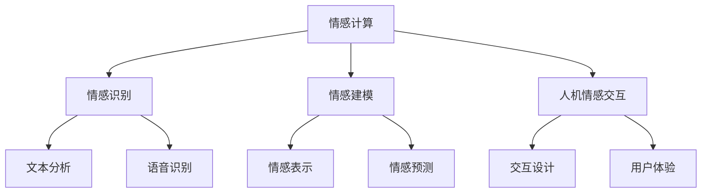

                 

为了完成这个任务，我们可以按照以下步骤来构建我们的文章：

### 步骤1：文章标题、关键词和摘要

**文章标题：**《情感计算前沿研究项目：人机情感交互的科技探索深化》

**关键词：** 情感计算、人机交互、情感识别、人工智能、深度学习、科技应用

**摘要：** 本文深入探讨了情感计算和人机情感交互的前沿研究项目，从基础理论到核心技术，再到应用案例分析，全面剖析了情感计算在科技领域的探索与深化，展望了未来的发展趋势。

### 步骤2：引言部分

**背景介绍：**
- 情感计算和人机情感交互是人工智能领域的热点研究方向，随着技术的发展，它们在多个领域得到了广泛应用。

**核心概念与联系：**
- 使用Mermaid流程图展示情感计算和人机情感交互的核心概念及其相互关系。



**引言小结：**
- 情感计算和人机情感交互不仅具有重大的理论价值，同时也为实际应用提供了新的解决方案。

### 步骤3：基础理论部分

**核心概念与联系：**
- 详细解释情感计算、情感识别、情感建模等核心概念，并使用Mermaid流程图展示它们之间的关系。

**核心算法原理讲解：**
- 使用伪代码详细讲解情感识别算法的基本原理。

```python
# 伪代码：情感识别算法
def emotion_recognition(data):
    # 数据预处理
    processed_data = preprocess_data(data)
    
    # 情感特征提取
    features = extract_features(processed_data)
    
    # 模型训练
    model = train_model(features)
    
    # 情感分类
    emotion = classify_emotion(model, features)
    
    return emotion
```

**数学模型和公式：**
- 使用LaTeX格式展示情感建模中的数学模型。

```latex
$$
E = f(X, \theta)
$$`

其中，$E$代表情感状态，$X$代表特征向量，$\theta$代表模型参数。

**基础理论小结：**
- 情感计算的基础理论为人机情感交互提供了理论支持，是进一步研究和应用的重要基石。

### 步骤4：核心技术部分

**核心技术概述：**
- 概述情感计算和人机情感交互的核心技术，包括情感识别、情感建模和人机交互设计。

**情感识别算法详解：**
- 使用伪代码详细讲解情感识别算法，包括数据预处理、特征提取、模型训练和情感分类。

**人机情感交互技术：**
- 解释人机情感交互的基本框架和情感反馈机制，并提供情感交互优化的策略。

**核心技术小结：**
- 核心技术是实现人机情感交互的关键，通过深入研究和应用，可以提高系统的情感感知和交互能力。

### 步骤5：应用案例分析部分

**教育领域应用：**
- 分析情感计算在教育领域的应用，包括情感识别在教学中的应用和情感交互设计。

**医疗领域应用：**
- 探讨情感计算在医疗领域的应用，如情感分析在医疗诊断和患者护理中的应用。

**商业领域应用：**
- 分析情感计算在商业领域的应用，如情感分析在市场研究和客户服务中的应用。

**应用案例分析小结：**
- 应用案例分析展示了情感计算和人机情感交互在不同领域的实际应用，为行业提供了新的发展思路。

### 步骤6：未来展望部分

**发展趋势：**
- 展望情感计算和人机情感交互的未来发展趋势，包括技术创新和社会影响。

**深度学习应用：**
- 探讨深度学习在情感计算中的应用，如深度学习算法在情感识别和预测中的应用。

**未来展望小结：**
- 未来展望部分为情感计算和人机情感交互的研究和应用提供了发展方向和挑战。

### 步骤7：总结和扩展阅读

**总结：**
- 对全文内容进行总结，强调情感计算和人机情感交互的重要性及其对未来的影响。

**扩展阅读：**
- 推荐一些相关领域的优秀书籍、论文和研究报告，以供读者进一步学习。

### 步骤8：撰写作者信息

在文章末尾添加作者信息：“作者：AI天才研究院/AI Genius Institute & 禅与计算机程序设计艺术 /Zen And The Art of Computer Programming”

### 最后的检查

在完成所有步骤后，对文章进行最后的检查，确保内容完整、逻辑清晰、术语准确、代码规范，并符合字数要求。

遵循上述步骤，我们将能够撰写出一篇结构严谨、内容丰富、逻辑清晰、对技术原理和本质剖析到位的高质量技术博客文章。现在，我们可以开始逐步填充各个章节的内容了。

