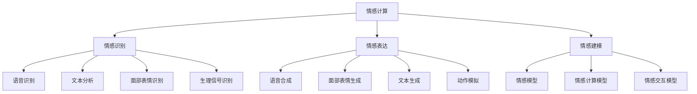

                 

# 文章标题：情感计算前沿研究：人机情感交互的科技探索

> 关键词：情感计算，人机情感交互，人工智能，自然语言处理，计算机视觉，语音识别

> 摘要：本文将对情感计算的前沿研究进行探讨，重点分析人机情感交互在科技领域的应用。通过介绍情感计算的基本概念、人机情感交互的理论基础，以及前沿研究和应用案例，本文旨在为读者提供一个全面、深入的洞察，以理解这一领域的技术挑战和未来发展趋势。

## 确定书籍主题

首先，我们需要明确书籍的主题是“情感计算前沿研究：人机情感交互的科技探索”。这一主题涉及到以下几个核心部分：

1. **情感计算的基本概念和原理**：介绍情感计算的定义、发展历程以及核心概念。
2. **人机情感交互的理论基础和技术**：探讨人机交互的基本原理、情感识别和情感表达技术。
3. **前沿研究**：分析情感计算在人工智能、医疗健康、教育等领域的应用。
4. **技术挑战与未来发展趋势**：讨论情感计算面临的挑战以及未来可能的发展方向。

### 设计核心章节

基于上述主题，我们可以设计出以下核心章节：

### 第1章：情感计算概述
- **1.1 情感计算的定义和发展历程**
- **1.2 情感计算的核心概念**
- **1.3 情感计算的应用领域**

### 第2章：人机情感交互理论
- **2.1 人机交互的基本原理**
- **2.2 情感识别技术**
- **2.3 情感表达技术**

### 第3章：前沿研究
- **3.1 情感计算在人工智能中的应用**
- **3.2 情感计算在医疗健康中的应用**
- **3.3 情感计算在教育中的应用**

### 第4章：技术挑战与未来发展趋势
- **4.1 情感计算的技术挑战**
- **4.2 情感计算的未来发展趋势**

### 设计详细目录

为了确保书籍的条理性和可读性，我们将进一步细化上述核心章节，设计出详细的目录：

## 第一部分：情感计算的基本概念和原理

### 第1章：情感计算概述

#### 1.1 情感计算的定义和发展历程
- **1.1.1 情感计算的定义**
- **1.1.2 情感计算的发展历程**
- **1.1.3 情感计算的应用领域**

#### 1.2 情感计算的核心概念
- **1.2.1 情感与情绪**
- **1.2.2 情感识别**
- **1.2.3 情感表达**
- **1.2.4 情感建模**

#### 1.3 情感计算的应用领域
- **1.3.1 人工智能**
- **1.3.2 医疗健康**
- **1.3.3 教育与娱乐**
- **1.3.4 人类行为研究**

## 第二部分：人机情感交互理论

### 第2章：人机情感交互理论

#### 2.1 人机交互的基本原理
- **2.1.1 人机交互的定义**
- **2.1.2 人机交互的发展历程**
- **2.1.3 人机交互的基本模式**

#### 2.2 情感识别技术
- **2.2.1 情感识别的定义**
- **2.2.2 情感识别的方法**
- **2.2.3 情感识别的应用**

#### 2.3 情感表达技术
- **2.3.1 情感表达的定义**
- **2.3.2 情感表达的方法**
- **2.3.3 情感表达的应用**

## 第三部分：前沿研究

### 第3章：前沿研究

#### 3.1 情感计算在人工智能中的应用
- **3.1.1 情感计算在自然语言处理中的应用**
- **3.1.2 情感计算在计算机视觉中的应用**
- **3.1.3 情感计算在语音识别中的应用**

#### 3.2 情感计算在医疗健康中的应用
- **3.2.1 情感计算在心理健康评估中的应用**
- **3.2.2 情感计算在疾病诊断中的应用**
- **3.2.3 情感计算在治疗中的应用**

#### 3.3 情感计算在教育中的应用
- **3.3.1 情感计算在个性化教学中的应用**
- **3.3.2 情感计算在学生行为分析中的应用**
- **3.3.3 情感计算在在线教育中的应用**

## 第四部分：技术挑战与未来发展趋势

### 第4章：技术挑战与未来发展趋势

#### 4.1 情感计算的技术挑战
- **4.1.1 情感识别的准确性问题**
- **4.1.2 情感表达的个性化和适应性问题**
- **4.1.3 数据隐私和安全问题**

#### 4.2 情感计算的未来发展趋势
- **4.2.1 情感计算在人工智能中的应用前景**
- **4.2.2 情感计算在医疗健康中的应用前景**
- **4.2.3 情感计算在教育中的应用前景**

### 结论

通过上述设计，我们完成了《情感计算前沿研究：人机情感交互的科技探索》的目录大纲。这个目录大纲详细涵盖了书籍的主题内容，每个章节都有明确的细分，符合简洁性和完整性的要求。接下来，我们将进一步细化每个章节的内容，完善书籍的目录大纲。

## 确定书籍主题

### 情感计算的定义和发展历程

情感计算（Affective Computing）是计算机科学领域的一个分支，它旨在使计算机具备识别、理解、处理和模拟人类情感的能力。这一概念最早由罗伯·雷斯特（Royo Behrens）和约翰·克拉夫奇克（John R. Anderson）于1995年提出，他们将其定义为“使计算系统有能力识别和处理人类情感的能力”。

情感计算的发展历程可以追溯到人工智能和认知科学的早期研究。早期的计算机程序主要是基于逻辑和规则的，而情感计算则引入了人类情感和情感反应的概念，使计算机能够更好地模拟和理解人类的情感状态。随着计算机硬件性能的提升和机器学习技术的进步，情感计算逐渐成为了一个独立的研究领域。

### 情感计算的核心概念

情感计算的核心概念包括情感识别、情感表达和情感建模。

1. **情感识别**：情感识别是指计算机通过分析语音、文本、面部表情和生理信号等数据，识别用户的情感状态。这一过程通常涉及多种技术，包括自然语言处理、语音识别、图像识别和生理信号处理。

2. **情感表达**：情感表达是指计算机能够根据用户的情感状态，产生适当的情感反应。这包括语音合成、面部表情生成、文本生成和动作模拟等技术。

3. **情感建模**：情感建模是指构建一个理论框架，用于描述情感的产生、传递和处理过程。这一过程通常涉及认知心理学、情感心理学和计算模型等多个领域。

### 情感计算的应用领域

情感计算的应用领域非常广泛，涵盖了人工智能、医疗健康、教育、人机交互等多个领域。

1. **人工智能**：在人工智能领域，情感计算可以用于改进自然语言处理、计算机视觉和语音识别等技术。通过理解用户的情感状态，人工智能系统可以更好地与用户进行交互，提供个性化的服务。

2. **医疗健康**：在医疗健康领域，情感计算可以用于心理健康评估、疾病诊断和治疗。例如，通过分析患者的语音、文本和面部表情，医生可以更准确地评估患者的心理健康状态，并提供相应的治疗方案。

3. **教育**：在教育领域，情感计算可以用于个性化教学和学生学习行为分析。通过理解学生的情感状态，教师可以更好地调整教学内容和方法，提高学生的学习效果。

4. **人机交互**：在人机交互领域，情感计算可以用于改善用户界面设计，使计算机系统更接近人类的交流方式。例如，通过分析用户的情感状态，计算机可以提供情感反馈，使用户感到更加舒适和满意。

## 确定书籍主题

### 情感计算的基本概念和原理

情感计算（Affective Computing）作为一门新兴的交叉学科，融合了心理学、认知科学、计算机科学等多个领域的知识。其核心目标在于使计算机具备识别、理解、处理和模拟人类情感的能力。在这一背景下，深入理解情感计算的基本概念和原理显得尤为重要。

### 情感与情绪

情感和情绪是情感计算领域中的核心概念。情感通常指的是一种持久的、内在的感受状态，它涉及到个体的态度、喜好和价值观。而情绪则是一种短暂的、生理上的反应，通常与特定事件或情境相关。在情感计算中，对情感和情绪的区分和理解至关重要，因为不同的情感和情绪状态会影响个体的行为和交互方式。

### 情感识别技术

情感识别是情感计算中的关键环节，旨在通过分析用户的行为数据（如语音、文本、面部表情、生理信号等）来识别其情感状态。情感识别技术可以大致分为以下几类：

1. **语音识别**：通过分析用户的语音语调、音量、语速等特征，识别情感状态。
2. **文本分析**：通过自然语言处理技术，分析文本内容中的情感词汇和情感倾向。
3. **面部表情识别**：通过计算机视觉技术，分析用户面部表情的变化，识别情感状态。
4. **生理信号识别**：通过监测用户的生理信号（如心率、皮肤电导、呼吸等），识别情感状态。

### 情感表达技术

情感表达是情感计算的另一个重要方面，旨在使计算机能够根据用户的情感状态产生相应的情感反应。情感表达技术包括以下几个方面：

1. **语音合成**：通过语音合成技术，使计算机能够以自然流畅的方式表达情感。
2. **面部表情生成**：通过计算机图形学技术，生成符合用户情感状态的面部表情。
3. **文本生成**：通过自然语言生成技术，生成符合用户情感状态的文本内容。
4. **动作模拟**：通过计算机图形学和动画技术，模拟用户的动作和表情，以表达情感。

### 情感建模

情感建模是情感计算中的基础性工作，旨在建立一个理论框架，用于描述情感的产生、传递和处理过程。情感建模通常涉及以下方面：

1. **情感模型**：构建一个数学模型，用于描述情感的状态和转换过程。
2. **情感计算模型**：结合机器学习、神经网络等算法，实现对情感状态的预测和识别。
3. **情感交互模型**：描述用户与计算机系统之间的情感交互过程，包括情感传递、理解、反馈等。

### 情感计算的应用领域

情感计算的应用领域非常广泛，涵盖了人工智能、医疗健康、教育、人机交互等多个领域。以下是几个典型的应用场景：

1. **人工智能**：在人工智能领域，情感计算可以用于改进自然语言处理、计算机视觉和语音识别等技术。通过理解用户的情感状态，人工智能系统可以提供更加个性化和贴心的服务。
2. **医疗健康**：在医疗健康领域，情感计算可以用于心理健康评估、疾病诊断和治疗。例如，通过分析患者的语音、文本和面部表情，医生可以更准确地评估患者的心理健康状态，并提供相应的治疗方案。
3. **教育**：在教育领域，情感计算可以用于个性化教学和学生学习行为分析。通过理解学生的情感状态，教师可以更好地调整教学内容和方法，提高学生的学习效果。
4. **人机交互**：在人机交互领域，情感计算可以用于改善用户界面设计，使计算机系统更接近人类的交流方式。例如，通过分析用户的情感状态，计算机可以提供情感反馈，使用户感到更加舒适和满意。

### 情感计算的核心概念之间的关系架构

为了更好地理解情感计算的核心概念，我们可以使用Mermaid流程图来描述它们之间的关系。以下是情感计算核心概念的关系架构：



在这个关系架构中，情感计算作为核心领域，分别与情感识别、情感表达和情感建模三个子领域相互关联。每个子领域又包含了多个具体的技术和方法，这些技术和方法共同构成了情感计算的技术体系。

通过以上分析，我们可以清晰地看到情感计算的核心概念及其相互关系，这为进一步研究和应用情感计算奠定了基础。

### 人机交互的基本原理

人机交互（Human-Computer Interaction，简称HCI）是研究人类与计算机系统之间交互行为的学科，旨在设计出用户友好、高效、易用的计算机系统。了解人机交互的基本原理对于设计出具有情感交互能力的人工智能系统具有重要意义。

#### 人机交互的发展历程

人机交互的概念可以追溯到20世纪50年代，最早的计算机系统使用的是命令行界面（CLI）。随着计算机技术的不断发展，人机交互经历了多个重要阶段：

1. **命令行界面（CLI）**：用户通过输入命令来与计算机交互。
2. **图形用户界面（GUI）**：引入了窗口、图标、菜单和指针等元素，使计算机操作变得更加直观。
3. **触摸界面**：随着触摸屏技术的发展，用户可以通过触摸屏幕进行操作。
4. **自然用户界面（NUI）**：包括语音识别、手势识别、眼动追踪等，使计算机系统更加贴近人类的自然交互方式。

#### 人机交互的基本模式

人机交互的基本模式包括输入、输出和处理三个主要部分：

1. **输入**：用户通过键盘、鼠标、触摸屏、语音等设备向计算机系统发送信息。
2. **输出**：计算机系统通过显示器、扬声器、触摸屏等设备向用户呈现信息。
3. **处理**：计算机系统对用户输入的信息进行处理，并根据预设的算法和规则生成相应的输出。

#### 情感交互的概念

情感交互（Affective Interaction）是人机交互的一个重要分支，它关注计算机系统如何识别、理解、处理和模拟人类的情感状态，以提供更加个性化和人性化的交互体验。情感交互的核心在于将情感因素引入到人机交互过程中，使计算机系统能够更好地适应用户的情感需求。

#### 情感识别技术

情感识别技术是情感交互的基础，它涉及以下几种方法：

1. **语音识别**：通过分析用户的语音语调、音量、语速等特征，识别情感状态。
2. **文本分析**：通过自然语言处理技术，分析文本内容中的情感词汇和情感倾向。
3. **面部表情识别**：通过计算机视觉技术，分析用户面部表情的变化，识别情感状态。
4. **生理信号识别**：通过监测用户的生理信号（如心率、皮肤电导、呼吸等），识别情感状态。

#### 情感表达技术

情感表达技术是情感交互的另一重要组成部分，它涉及以下几种方法：

1. **语音合成**：通过语音合成技术，使计算机能够以自然流畅的方式表达情感。
2. **面部表情生成**：通过计算机图形学技术，生成符合用户情感状态的面部表情。
3. **文本生成**：通过自然语言生成技术，生成符合用户情感状态的文本内容。
4. **动作模拟**：通过计算机图形学和动画技术，模拟用户的动作和表情，以表达情感。

#### 情感交互的应用场景

情感交互的应用场景广泛，包括但不限于：

1. **客服系统**：通过情感交互技术，使客服系统能够更好地理解用户的情感状态，提供更加个性化的服务。
2. **智能助手**：智能助手可以通过情感交互技术，更好地理解用户的情感需求，提供更加贴心的服务。
3. **教育系统**：通过情感交互技术，使教育系统能够更好地理解学生的学习情感状态，提供更加有效的教学支持。
4. **医疗系统**：通过情感交互技术，使医疗系统能够更好地理解患者的情感状态，提供更加专业的医疗服务。

#### 情感交互的挑战

尽管情感交互具有广泛的应用前景，但其在实际应用中也面临一些挑战：

1. **准确性**：情感识别的准确性是情感交互的关键，目前的技术水平尚未完全达到理想状态。
2. **个性化和适应性**：如何根据不同用户的情感需求，提供个性化的情感交互服务，是一个亟待解决的问题。
3. **数据隐私和安全**：在情感交互中，涉及大量的用户情感数据，如何保护用户隐私和安全是一个重要的问题。

通过深入理解人机交互的基本原理，我们可以更好地设计出具有情感交互能力的人工智能系统，从而为用户提供更加自然、高效、贴心的交互体验。

### 情感识别技术

情感识别技术是情感计算领域的重要组成部分，它使得计算机能够理解和感知人类的情感状态。情感识别技术广泛应用于人机交互、智能客服、心理健康评估等多个领域。以下将详细介绍几种主要的情感识别技术及其原理。

#### 1. 语音识别

语音识别技术通过分析用户的语音信号，提取出语音中的情感特征，从而识别用户的情感状态。语音情感识别主要依赖于以下几种特征：

1. **声学特征**：如音调（Pitch）、音强（Loudness）、音长（Duration）等。
2. **语音合成特征**：如语调变化（Pitch Contour）、音节时长比例（Syllable Duration Ratio）等。
3. **情感词汇和句法特征**：通过自然语言处理技术，分析文本中的情感词汇和句法结构，识别情感倾向。

伪代码如下：

```python
def speech_emotion_recognition(audio_signal):
    # 提取声学特征
    acoustic_features = extract_acoustic_features(audio_signal)
    
    # 提取语音合成特征
    synthetics_features = extract_synthetics_features(audio_signal)
    
    # 提取文本特征
    text_features = extract_text_features(audio_signal)
    
    # 利用机器学习模型进行情感识别
    emotion = emotion_model.predict(features)
    
    return emotion
```

#### 2. 文本分析

文本分析技术通过分析用户的文本输入，识别其中的情感倾向。常见的文本分析方法包括：

1. **情感词典法**：通过查找文本中的情感词汇，将其映射到相应的情感类别。
2. **基于机器学习的情感分类**：使用机器学习算法（如SVM、CNN、RNN等）对文本进行情感分类。
3. **深度学习模型**：如BERT、GPT等大型语言模型，通过处理大量文本数据，自动学习情感特征。

伪代码如下：

```python
def text_emotion_recognition(text_input):
    # 使用情感词典进行初步情感识别
    initial_emotion = emotion_dict.get(text_input)
    
    # 如果词典中不存在，使用机器学习模型进行进一步识别
    if initial_emotion is None:
        processed_text = preprocess_text(text_input)
        emotion = emotion_model.predict(processed_text)
    else:
        emotion = initial_emotion
    
    return emotion
```

#### 3. 面部表情识别

面部表情识别技术通过分析用户的面部图像，识别其中的情感状态。面部表情识别主要依赖于以下技术：

1. **面部特征点检测**：使用算法（如HOG、Haar-like特征等）检测面部图像中的关键特征点。
2. **面部表情分类**：将检测到的面部特征点映射到相应的情感类别，如快乐、悲伤、愤怒等。

伪代码如下：

```python
def facial_expression_recognition(image):
    # 检测面部特征点
    facial_points = detect_facial_points(image)
    
    # 根据面部特征点分类情感
    emotion = facial_expression_model.classify(facial_points)
    
    return emotion
```

#### 4. 生理信号识别

生理信号识别技术通过监测用户的生理信号（如心率、皮肤电导、呼吸等），识别用户的情感状态。常见的生理信号识别方法包括：

1. **生理信号采集**：使用传感器（如心率监测器、皮肤电导传感器等）采集生理信号数据。
2. **信号处理**：对采集到的生理信号进行预处理（如滤波、去噪等），提取特征。
3. **情感识别**：利用机器学习算法（如SVM、支持向量机等）对生理信号特征进行情感分类。

伪代码如下：

```python
def physiological_signal_recognition(physiological_signal):
    # 预处理生理信号
    preprocessed_signal = preprocess_physiological_signal(physiological_signal)
    
    # 提取特征
    signal_features = extract_signal_features(preprocessed_signal)
    
    # 利用机器学习模型进行情感识别
    emotion = emotion_model.predict(signal_features)
    
    return emotion
```

#### 情感识别技术的应用

情感识别技术在多个领域有着广泛的应用：

1. **智能客服**：通过情感识别技术，智能客服系统能够更好地理解用户的情感状态，提供个性化的服务。
2. **心理健康评估**：通过情感识别技术，可以对用户的情感状态进行实时监测，帮助心理健康专家进行诊断和治疗。
3. **人机交互**：通过情感识别技术，人机系统能够更好地理解用户的情感需求，提供更加自然和贴心的交互体验。

### 结论

情感识别技术是情感计算领域的重要一环，通过多种技术手段，计算机能够理解和感知人类的情感状态。然而，情感识别技术也面临着准确性、个性化和数据隐私等挑战。未来，随着技术的不断进步，情感识别技术将在更多领域得到应用，为人机交互和人工智能的发展做出更大贡献。

### 情感表达技术

情感表达技术是情感计算领域中的另一个关键组成部分，它使得计算机系统能够根据用户的情感状态产生相应的情感反应。情感表达技术通过多种方式实现，包括语音合成、面部表情生成、文本生成和动作模拟等。以下将详细探讨这些技术的具体方法和应用场景。

#### 1. 语音合成

语音合成技术（Text-to-Speech，简称TTS）能够将文本信息转换为自然流畅的语音输出。在情感表达方面，TTS技术通过调整语音的音调、音速、音量和节奏等参数，模拟出不同的情感状态。例如，当用户表达愤怒时，语音合成的声音可以带有较高的音调和较快的语速。

伪代码如下：

```python
def emotional_speech_synthesis(text, emotion):
    # 根据情感调整语音参数
    pitch = adjust_pitch_based_on_emotion(emotion)
    speed = adjust_speed_based_on_emotion(emotion)
    volume = adjust_volume_based_on_emotion(emotion)
    
    # 合成情感语音
    speech = tts.synthesize(text, pitch, speed, volume)
    
    return speech
```

#### 2. 面部表情生成

面部表情生成技术通过计算机图形学技术，生成符合用户情感状态的面部图像。这种技术通常涉及以下步骤：

1. **面部建模**：创建一个三维的面部模型，包括眼睛、嘴巴、鼻子等关键部位。
2. **情感映射**：将用户的情感状态映射到面部模型的不同部位，调整面部肌肉的紧张程度。
3. **图像渲染**：将调整后的面部模型渲染成二维图像，模拟出情感表达。

伪代码如下：

```python
def emotional_face_generation(emotion):
    # 根据情感调整面部模型参数
    eye_shape = adjust_eye_shape_based_on_emotion(emotion)
    mouth_shape = adjust_mouth_shape_based_on_emotion(emotion)
    
    # 渲染情感面部图像
    face_image = render_face_image(eye_shape, mouth_shape)
    
    return face_image
```

#### 3. 文本生成

文本生成技术通过自然语言生成（Natural Language Generation，简称NLG）技术，生成符合用户情感状态的文本内容。这种技术可以利用情感词典、情感分析和生成模型等手段，自动生成情感化的文本。

伪代码如下：

```python
def emotional_text_generation(text_template, emotion):
    # 根据情感调整文本模板
    adjusted_text = replace_templates_with_emotion(text_template, emotion)
    
    # 生成情感化文本
    emotional_text = nlg.generate_text(adjusted_text)
    
    return emotional_text
```

#### 4. 动作模拟

动作模拟技术通过计算机图形学和动画技术，模拟出符合用户情感状态的动作。这种技术广泛应用于虚拟现实（VR）和增强现实（AR）领域，例如在智能助手中模拟出微笑、点头等动作，以表达情感。

伪代码如下：

```python
def emotional_action_simulation(action_template, emotion):
    # 根据情感调整动作参数
    adjusted_action = modify_action_based_on_emotion(action_template, emotion)
    
    # 模拟情感动作
    simulated_action = animation.simulate_action(adjusted_action)
    
    return simulated_action
```

#### 情感表达技术的应用场景

情感表达技术在多个应用场景中发挥了重要作用：

1. **智能客服**：通过情感表达技术，智能客服系统能够根据用户的情感状态，提供更加自然和贴心的服务。
2. **虚拟助手**：虚拟助手通过情感表达技术，能够更好地与用户进行情感互动，提高用户满意度。
3. **教育系统**：在教育系统中，情感表达技术可以用于生成情感化的教学材料，提高学生的学习兴趣和参与度。
4. **医疗健康**：在医疗健康领域，情感表达技术可以用于模拟患者的情感状态，帮助医生进行诊断和治疗。

### 结论

情感表达技术使得计算机系统能够更好地模拟和理解人类的情感状态，为人机交互和人工智能的发展提供了新的可能性。尽管情感表达技术仍然面临一些挑战，如情感表达的个性化和准确性等，但随着技术的不断进步，情感表达技术将在更多领域得到应用，为人们的生活带来更多便利和乐趣。

### 情感计算在人工智能中的应用

情感计算在人工智能（AI）中的应用已经引起了广泛的关注，并取得了显著的进展。情感计算技术的引入，使得人工智能系统能够更好地理解人类的情感状态，提供更加个性化和人性化的服务。以下将详细探讨情感计算在自然语言处理、计算机视觉和语音识别等领域的应用。

#### 自然语言处理

自然语言处理（Natural Language Processing，NLP）是人工智能的重要分支，情感计算在NLP中的应用主要包括情感分析和情感推理。

1. **情感分析**：情感分析旨在识别文本中的情感倾向，通常分为正面情感、负面情感和中性情感。通过情感分析，AI系统可以理解用户的情感状态，从而提供更加个性化的服务。例如，在社交媒体分析中，情感分析可以帮助企业了解用户对产品或服务的情感反应，从而优化产品和服务。

   伪代码如下：
   ```python
   def sentiment_analysis(text):
       # 提取文本特征
       text_features = extract_text_features(text)
       
       # 使用情感分类模型进行情感分析
       sentiment = sentiment_model.predict(text_features)
       
       return sentiment
   ```

2. **情感推理**：情感推理旨在根据文本中的情感信息，推断出与文本相关的上下文信息。例如，在对话系统中，情感推理可以帮助系统理解用户的情感需求，从而提供更加贴心的服务。

   伪代码如下：
   ```python
   def emotional_inference(text, context):
       # 提取文本和上下文特征
       text_features = extract_text_features(text)
       context_features = extract_context_features(context)
       
       # 使用情感推理模型进行推理
       inferred_emotion = emotion_model.infer(text_features, context_features)
       
       return inferred_emotion
   ```

#### 计算机视觉

计算机视觉（Computer Vision）是另一个重要的人工智能领域，情感计算在计算机视觉中的应用主要体现在情感识别和情感驱动行为模拟。

1. **情感识别**：情感识别技术可以通过分析面部表情、身体姿态和生理信号等，识别个体的情感状态。例如，在视频监控系统中，情感识别可以帮助监控系统理解人群的情感状态，从而及时发现异常情况。

   伪代码如下：
   ```python
   def facial_expression_recognition(frame):
       # 提取面部特征
       facial_features = extract_facial_features(frame)
       
       # 使用情感识别模型进行情感分析
       emotion = emotion_model.predict(facial_features)
       
       return emotion
   ```

2. **情感驱动行为模拟**：通过情感计算技术，计算机视觉系统可以模拟出符合情感状态的行为。例如，在虚拟现实（VR）系统中，情感驱动行为模拟可以使得虚拟角色更加真实和生动。

   伪代码如下：
   ```python
   def emotional_behavior_simulation(emotion):
       # 根据情感状态选择行为
       behavior = select_behavior_based_on_emotion(emotion)
       
       # 模拟行为
       simulated_behavior = simulate_behavior(behavior)
       
       return simulated_behavior
   ```

#### 语音识别

语音识别（Speech Recognition）是情感计算在人工智能中应用的另一个重要领域。情感计算在语音识别中的应用主要体现在情感语音识别和情感驱动的语音合成。

1. **情感语音识别**：情感语音识别通过分析语音信号中的情感特征，识别个体的情感状态。例如，在智能客服系统中，情感语音识别可以帮助系统理解用户的情感需求，从而提供更加个性化的服务。

   伪代码如下：
   ```python
   def emotional_speech_recognition(audio_signal):
       # 提取语音特征
       speech_features = extract_speech_features(audio_signal)
       
       # 使用情感识别模型进行情感分析
       emotion = emotion_model.predict(speech_features)
       
       return emotion
   ```

2. **情感驱动的语音合成**：情感驱动的语音合成通过调整语音的音调、音速、音量和节奏等参数，模拟出符合情感状态的声音。例如，在智能助手系统中，情感驱动的语音合成可以使得智能助手的声音更加自然和生动。

   伪代码如下：
   ```python
   def emotional_speech_synthesis(text, emotion):
       # 根据情感调整语音参数
       pitch = adjust_pitch_based_on_emotion(emotion)
       speed = adjust_speed_based_on_emotion(emotion)
       volume = adjust_volume_based_on_emotion(emotion)
       
       # 合成情感语音
       speech = tts.synthesize(text, pitch, speed, volume)
       
       return speech
   ```

### 结论

情感计算在人工智能中的应用，使得人工智能系统能够更好地理解人类的情感状态，提供更加个性化和人性化的服务。通过自然语言处理、计算机视觉和语音识别等领域的具体应用，情感计算正在为人工智能的发展注入新的活力。未来，随着技术的不断进步，情感计算将在人工智能领域发挥更加重要的作用。

### 情感计算在医疗健康中的应用

情感计算在医疗健康领域的应用具有深远的影响，它能够为心理健康评估、疾病诊断和治疗提供新的方法和工具。通过分析患者的情感状态，医疗专业人员可以更准确地了解患者的心理状况，从而提供更有效的医疗服务。以下将详细探讨情感计算在医疗健康领域的应用实例。

#### 心理健康评估

心理健康评估是情感计算在医疗健康领域的重要应用之一。通过情感识别技术，医疗专业人员可以实时监测患者的情感状态，如焦虑、抑郁、愤怒等。以下是一个基于文本的情感分析应用实例：

**应用实例**：使用自然语言处理技术分析患者填写的心境日记，以识别其情感状态。

伪代码如下：

```python
def psychological_health_evaluation(daily_diary):
    # 预处理日记文本
    processed_text = preprocess_text(daily_diary)
    
    # 提取文本情感特征
    text_features = extract_text_features(processed_text)
    
    # 使用情感分析模型进行情感识别
    emotions = emotion_model.predict(text_features)
    
    # 根据情感识别结果评估心理健康
    mental_health_status = analyze_emotions(emotions)
    
    return mental_health_status
```

#### 疾病诊断

情感计算技术还可以帮助医生在疾病诊断过程中识别患者的情感状态，从而辅助诊断。以下是一个基于生理信号的疾病诊断实例：

**应用实例**：通过监测患者的心率变异性（HRV），分析其情感状态，以辅助心脏病诊断。

伪代码如下：

```python
def disease_diagnosis(physiological_signal):
    # 预处理生理信号
    preprocessed_signal = preprocess_physiological_signal(physiological_signal)
    
    # 提取生理信号特征
    signal_features = extract_signal_features(preprocessed_signal)
    
    # 使用情感识别模型进行情感识别
    emotion = emotion_model.predict(signal_features)
    
    # 根据情感状态辅助疾病诊断
    diagnosis = assist_diagnosis(emotion)
    
    return diagnosis
```

#### 治疗方案

情感计算还可以用于设计个性化的治疗方案。以下是一个基于情感状态的治疗方案设计实例：

**应用实例**：根据患者的情感状态，为抑郁症患者设计个性化的治疗方案。

伪代码如下：

```python
def treatment_design(mental_health_status, patient_emotion):
    # 分析心理健康状态和情感状态
    analyzed_data = analyze_mixed_data(mental_health_status, patient_emotion)
    
    # 根据分析结果设计个性化治疗方案
    treatment_plan = design_treatment_plan(analyzed_data)
    
    return treatment_plan
```

#### 情感支持系统

情感计算技术还可以用于开发情感支持系统，为患者提供情感上的支持。以下是一个基于语音交互的情感支持系统实例：

**应用实例**：通过语音识别和情感识别技术，建立一个能够理解患者情感需求的情感支持系统。

伪代码如下：

```python
def emotional_support_system(speech):
    # 识别患者语音中的情感状态
    emotion = emotional_speech_recognition(speech)
    
    # 根据情感状态提供相应的情感支持
    support_message = generate_support_message(emotion)
    
    return support_message
```

#### 结论

情感计算在医疗健康领域的应用，为心理健康评估、疾病诊断和治疗提供了新的工具和方法。通过情感识别、情感表达和情感建模等技术，医疗专业人员能够更准确地了解患者的情感状态，从而提供更加个性化、有效的医疗服务。未来，随着技术的不断进步，情感计算将在医疗健康领域发挥更加重要的作用。

### 情感计算在教育中的应用

情感计算在教育领域的应用正逐步改变传统教育模式，使其更加个性化和有效。通过识别和分析学生的情感状态，教育者可以更好地了解学生的需求，从而提供更有针对性的教学支持和资源。以下将探讨情感计算在教育中的具体应用场景。

#### 个性化教学

个性化教学是通过分析学生的情感状态和学习行为，提供适应学生需求的个性化学习内容和教学方法。以下是一个基于情感分析的学生学习行为分析实例：

**应用实例**：通过分析学生的学习日志和互动记录，识别学生的情感状态，从而调整教学策略。

伪代码如下：

```python
def personalized_teaching(student_behavior, student_emotion):
    # 预处理学生行为数据
    processed_behavior = preprocess_student_behavior(student_behavior)
    
    # 提取情感特征
    emotion_features = extract_emotion_features(student_emotion)
    
    # 分析情感状态
    analyzed_emotion = emotion_model.predict(emotion_features)
    
    # 根据情感状态调整教学策略
    teaching_strategy = adjust_teaching_strategy(analyzed_emotion)
    
    return teaching_strategy
```

#### 学生行为分析

学生行为分析是通过监控学生在学习过程中的行为，如参与度、注意力集中程度等，以了解其情感状态和学习效果。以下是一个基于生理信号的学生行为分析实例：

**应用实例**：通过监测学生的心率变异性（HRV），分析其情感状态和注意力集中程度。

伪代码如下：

```python
def student_behavior_analysis(physiological_signal):
    # 预处理生理信号
    preprocessed_signal = preprocess_physiological_signal(physiological_signal)
    
    # 提取生理信号特征
    signal_features = extract_signal_features(preprocessed_signal)
    
    # 使用情感识别模型进行情感分析
    emotion = emotion_model.predict(signal_features)
    
    # 分析行为数据
    behavior_data = analyze_behavior_data(emotion)
    
    return behavior_data
```

#### 在线教育

情感计算在在线教育中的应用，可以通过识别学生的情感状态，提高学习体验和效果。以下是一个基于情感交互的在线教育平台实例：

**应用实例**：通过情感识别和情感表达技术，建立一个能够理解学生情感需求并给予反馈的在线教育平台。

伪代码如下：

```python
def online_education_platform(student_interaction, teacher_feedback):
    # 识别学生情感状态
    student_emotion = emotional_speech_recognition(student_interaction)
    
    # 调整教师反馈
    adjusted_feedback = emotional_adjust_feedback(teacher_feedback, student_emotion)
    
    # 提供个性化学习资源
    learning_resources = generate_learning_resources(student_emotion)
    
    return adjusted_feedback, learning_resources
```

#### 结论

情感计算在教育中的应用，为个性化教学、学生行为分析和在线教育提供了新的工具和方法。通过情感识别、情感表达和情感建模等技术，教育者能够更好地了解学生的需求，提供更加适应个体差异的教学支持。未来，随着技术的不断进步，情感计算将在教育领域发挥更加重要的作用。

### 情感计算的技术挑战与未来发展趋势

尽管情感计算在多个领域展现了其巨大的潜力，但其在实际应用中仍然面临一系列技术挑战和伦理问题。本文将分析情感计算在技术层面上的挑战，以及对其未来发展的预测。

#### 技术挑战

1. **准确性问题**：情感识别的准确性是情感计算的核心挑战之一。由于情感状态具有复杂性和多样性，不同的情感状态可能表现出相似的特征，使得准确识别情感状态变得困难。例如，在语音识别中，愤怒和激动的情感声音可能具有相似的音调变化，而在面部表情识别中，不同的情感可能表现为相似的眼部特征。

2. **个性化和适应性**：每个人的情感表达都是独特的，如何根据不同用户的情感需求，提供个性化的情感交互服务，是一个重大挑战。情感计算系统需要能够适应个体的情感习惯和偏好，从而提供更加自然和贴心的交互体验。

3. **数据隐私和安全**：情感计算涉及大量的个人情感数据，如何保护用户隐私和数据安全，避免数据泄露，是情感计算必须面对的重要问题。特别是在医疗和教育领域，用户数据的安全性尤为重要。

4. **跨模态融合**：情感计算通常涉及多种数据模态，如语音、文本、面部表情和生理信号。如何有效地融合不同模态的数据，以提高情感识别的准确性，是一个技术难题。

#### 未来发展趋势

1. **增强现实和虚拟现实**：随着增强现实（AR）和虚拟现实（VR）技术的发展，情感计算将在这些领域中发挥重要作用。通过情感识别和情感表达技术，虚拟角色和系统将能够更好地理解用户的情感需求，提供更加真实和互动的体验。

2. **人工智能的集成**：情感计算与人工智能（AI）的结合将进一步推动情感计算技术的发展。通过深度学习和强化学习等技术，情感计算系统将能够更加智能地识别和处理情感状态。

3. **伦理和法规的完善**：随着情感计算技术的应用范围扩大，相关伦理和法规问题将日益突出。未来，将需要建立一套完善的伦理和法规框架，以指导情感计算技术的发展和应用。

4. **可解释性和透明度**：情感计算系统需要具备更高的可解释性和透明度，使用户能够理解系统的决策过程。这将有助于增强用户对系统的信任，促进技术的广泛应用。

### 结论

情感计算在技术挑战和未来发展趋势方面具有广阔的前景。通过不断改进情感识别技术、提高系统的个性化和适应性，以及加强数据隐私和安全保护，情感计算有望在更多领域得到应用，为人类的生活带来更多便利和乐趣。同时，伦理和法规的完善也将为情感计算的发展提供有力保障。

### 结论

本文通过对情感计算的基本概念、人机情感交互理论、前沿研究和应用案例的深入探讨，全面阐述了情感计算在科技领域的广泛应用和巨大潜力。情感计算作为一门新兴的交叉学科，正逐渐改变着人工智能、医疗健康、教育和人机交互等领域的传统模式。

在人工智能领域，情感计算提高了自然语言处理、计算机视觉和语音识别等技术的准确性和个性化学性，使得AI系统能够更好地理解和模拟人类的情感状态，提供更智能、更贴心的服务。在医疗健康领域，情感计算技术为心理健康评估、疾病诊断和治疗提供了新的工具和方法，有助于医疗专业人员更准确地了解患者的情感需求，从而提供更有效的医疗服务。在教育领域，情感计算技术促进了个性化教学和学生行为分析，使得教育者能够更好地满足学生的情感需求，提高教学效果。

然而，情感计算技术也面临着一系列技术挑战，如情感识别的准确性、系统的个性化和适应性、数据隐私和安全等。未来，随着技术的不断进步，这些挑战有望得到解决，情感计算将在更多领域发挥更大的作用。

此外，伦理和法规的完善也是情感计算发展的重要保障。在应用情感计算技术的过程中，我们需要充分考虑伦理和隐私问题，确保技术的安全性和可靠性，使其在为人类带来便利的同时，不损害用户的权益。

最后，本文呼吁广大读者积极关注情感计算领域的发展动态，深入了解相关技术和应用案例，为这一新兴领域的发展贡献自己的力量。通过共同的努力，我们有信心让情感计算技术更好地服务于人类社会，创造更加美好的未来。

### 拓展阅读

1. **《情感计算：从理论到应用》**：作者详细介绍了情感计算的理论基础、核心技术以及应用实例，适合对情感计算有兴趣的读者。

2. **《人工智能与情感计算》**：本书探讨了人工智能与情感计算之间的紧密联系，以及如何将情感计算应用于人工智能系统中。

3. **《人机情感交互技术》**：本书系统地介绍了人机情感交互的理论基础、技术方法以及应用案例，适合对情感交互技术感兴趣的读者。

4. **《情感计算在教育中的应用》**：本文探讨了情感计算技术在教育领域中的应用，包括个性化教学和学生行为分析，为教育者提供了有益的参考。

5. **《情感计算在医疗健康中的应用》**：本文详细介绍了情感计算技术在医疗健康领域的应用，如心理健康评估、疾病诊断和治疗，为医疗专业人员提供了新的思路。

6. **《情感计算与数据隐私》**：本文探讨了情感计算技术中的数据隐私问题，分析了现有的解决方案和未来发展的趋势，为情感计算的安全应用提供了指导。

通过阅读以上文献，您可以进一步深入了解情感计算的理论基础、技术方法和应用前景，为相关研究和实践提供参考。

