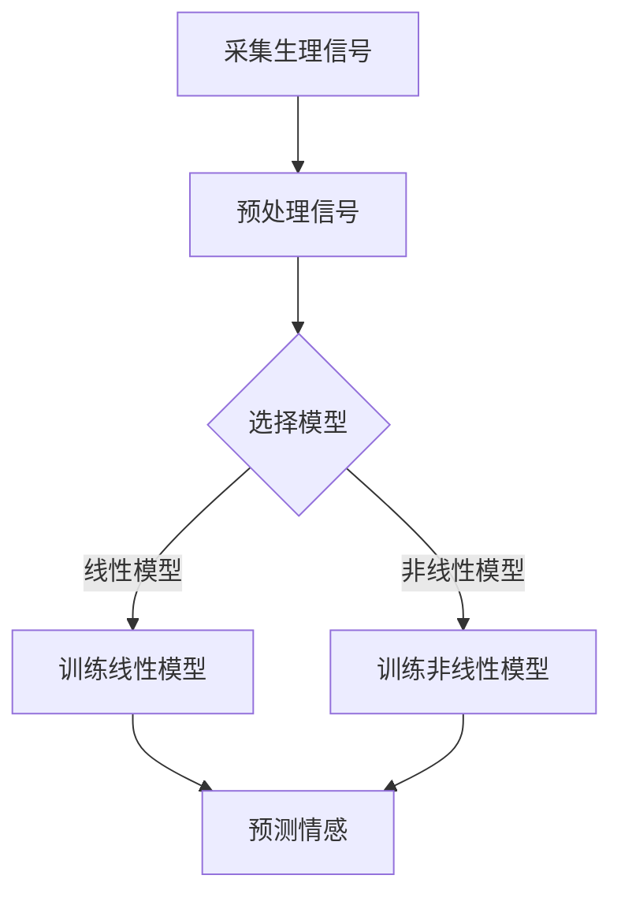
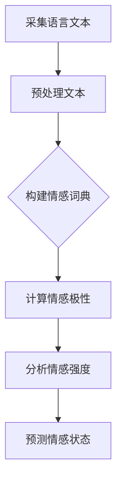
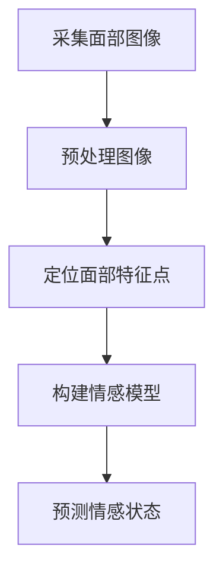
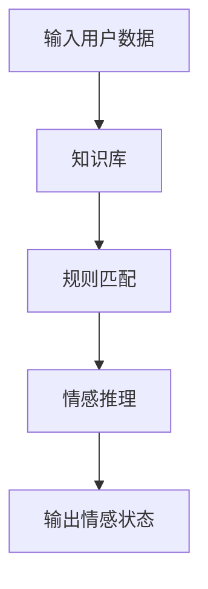
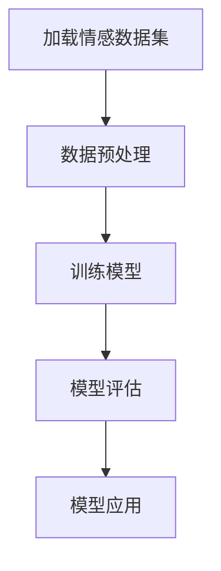
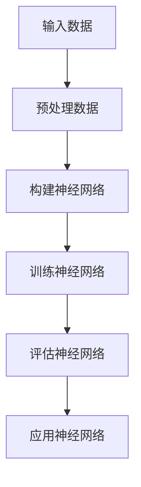
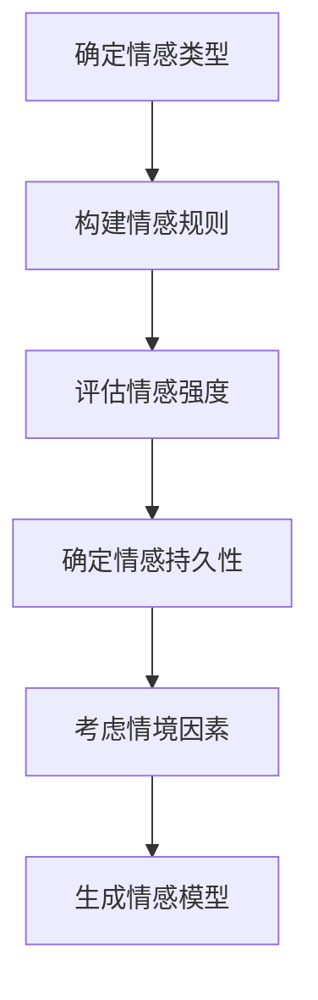
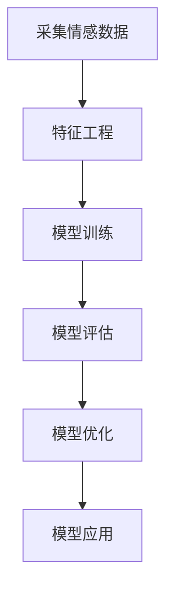
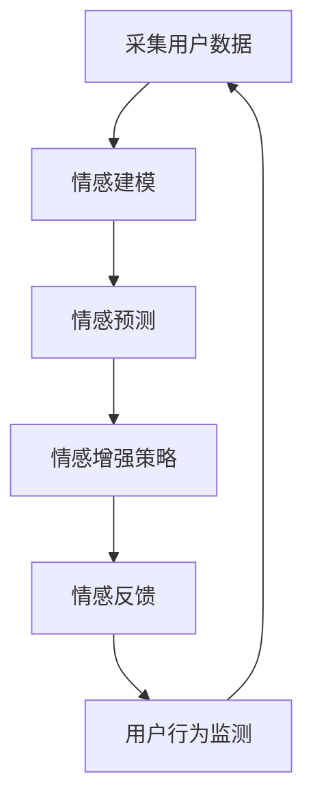

                 

### 文章标题：情感设计大师班：深化用户体验的高级课程

在当今数字化时代，用户体验（UX）设计已成为产品成功的关键因素。而情感设计作为用户体验的高级课程，正日益受到业界和学术界的重视。本课程旨在为广大UX设计师、开发者以及研究者提供深入理解和掌握情感设计的实用技能。本文将系统地探讨情感设计的核心概念、方法、工具和实际应用，帮助读者提升设计水平，创造更加人性化、富有情感共鸣的产品和服务。

### 文章关键词

1. 情感设计
2. 用户体验
3. 情感识别
4. 情感计算
5. 用户界面设计
6. 交互设计
7. 数据分析
8. 情感化产品

### 文章摘要

本文首先介绍了情感设计的定义、历史发展及其与用户体验的关系。接着，深入探讨了情感识别与计算技术，包括生理信号分析、语言情感分析、面部表情识别等。随后，详细介绍了情感模型与算法的设计与优化，并讨论了情感设计在用户界面与交互设计中的应用。文章最后，通过项目实战展示了情感设计的实际应用，并提出了最佳实践和未来趋势。本文旨在为读者提供一整套系统化、实践性强的情感设计课程，以深化用户体验，创造更加人性化的数字产品。

### 第1章：情感设计的核心概念与联系

#### 1.1 情感设计的定义与历史发展

情感设计是一种以用户情感体验为中心的设计方法，旨在通过设计干预来激发、引导和增强用户的情感反应。情感设计不仅仅关注产品的功能性，更关注用户在使用产品过程中的情感体验，包括愉悦、焦虑、满足、沮丧等。情感设计的历史可以追溯到20世纪90年代，当时设计界开始关注用户体验的全方位提升，逐渐发展出一套系统化的方法来研究用户的情感反应。

**1.1.1 情感设计的定义**

情感设计是指通过理解用户的情感需求，运用心理学、设计学和计算机科学等多学科知识，创造出能够引发用户情感共鸣的产品和服务。情感设计的核心目标是在用户与产品之间建立深层次的情感联系，从而提升用户体验。

**1.1.2 情感设计的历史发展**

- **20世纪90年代**：用户体验（UX）设计开始受到重视，设计界开始探讨如何通过设计提升用户的整体体验。
- **2000年代**：随着情感计算技术的发展，情感设计逐渐成为一个独立的研究领域。
- **2010年代**：情感设计在学术界和工业界得到广泛关注，并逐步形成了系统的方法论和工具集。

**1.1.3 情感设计与用户体验的关系**

情感设计与用户体验（UX）设计密不可分。用户体验涵盖了用户在使用产品过程中的所有体验，包括情感体验、认知体验和操作体验。情感设计关注的是如何通过设计干预，激发和引导用户的情感反应，从而提升整体用户体验。具体来说，情感设计在以下几个方面对用户体验产生影响：

1. **情感共鸣**：通过设计引发用户的情感共鸣，使用户产生强烈的情感反应，从而提升产品的吸引力。
2. **情感调节**：通过设计缓解用户的负面情感，如焦虑、沮丧等，提升用户的舒适度和满意度。
3. **情感持久性**：通过设计增强用户的情感记忆，使用户在使用产品后产生持久的好感，从而提高产品的忠诚度。
4. **情感体验创新**：通过设计创造出独特的情感体验，如惊喜、感动等，使用户对产品产生深刻的印象。

#### 1.2 情感设计的理论基础

情感设计的发展离不开多个学科的理论基础，包括心理学、设计学和计算机科学。

**1.2.1 心理学与情感理论**

心理学是情感设计的重要理论基础，特别是情感理论。情感理论认为情感是人的心理状态的一部分，包括情绪和情感体验。情感设计需要深入理解情感的产生、传播和调节机制，以便设计出能够引发用户情感共鸣的产品。

- **情绪理论**：情绪理论认为情绪是生理状态、认知评价和表情行为三者的结合。情感设计需要考虑如何通过设计干预，激发和调节用户的情绪。
- **情感体验理论**：情感体验理论关注用户在特定情境下的情感反应和体验。情感设计需要理解情感体验的构成要素，如情感强度、情感类型和情感持续性。

**1.2.2 设计原则与情感设计**

设计原则是情感设计的基础，它们指导设计师如何在设计过程中考虑用户的情感需求。以下是一些常见的设计原则：

- **情感共鸣**：设计应该能够引发用户的情感共鸣，使用户在使用过程中产生积极的情感反应。
- **情感可访问性**：设计应该易于用户理解和使用，避免造成用户的情感负担。
- **情感可控性**：设计应该提供用户控制情感体验的机制，使用户能够自主调节情感状态。
- **情感一致性**：设计应该保持情感体验的一致性，避免产生冲突和混淆。

**1.2.3 人机交互与情感体验**

人机交互（HCI）是情感设计的重要应用领域。HCI研究如何设计出用户友好、高效和令人愉悦的人机交互系统。在情感设计领域，HCI关注如何通过交互设计提升用户的情感体验。

- **交互设计**：交互设计关注用户与产品之间的交互方式。情感交互设计需要考虑如何设计出能够引发用户情感共鸣的交互界面和交互流程。
- **情感化界面**：情感化界面设计关注如何通过视觉、听觉和触觉等感官元素，设计出能够传达情感信息的产品界面。
- **情感反馈**：情感反馈是指系统对用户的情感反应进行反馈，以增强用户情感体验。情感反馈可以是视觉、听觉或触觉的，如动态图标、声音提示等。

#### 1.3 情感设计的方法与工具

情感设计需要一套系统的方法和工具来支持设计实践。以下是一些常用的方法和工具：

- **情感识别技术**：情感识别技术用于检测和识别用户的情感状态，包括生理信号分析、语言情感分析和面部表情识别等。
- **情感计算模型**：情感计算模型用于模拟和预测用户的情感反应，包括基于机器学习的情感计算模型和基于深度学习的情感计算模型。
- **情感化设计工具**：情感化设计工具用于支持设计师在情感设计过程中的工作，包括情感可视化工具、情感反馈工具和情感化设计软件。

#### 1.3.1 情感识别技术

情感识别技术是情感设计的关键技术之一，它用于检测和识别用户的情感状态。以下是一些常见的情感识别技术：

- **生理信号分析**：生理信号分析通过检测用户的生理信号，如心率、皮肤电导、呼吸等，来识别用户的情感状态。生理信号分析技术具有较高的准确性，但受限于用户的接受度和设备的舒适性。
- **语言情感分析**：语言情感分析通过分析用户的语言文本，识别用户的情感状态。语言情感分析技术适用于各种文本类型，如社交媒体帖子、评论、聊天记录等。
- **面部表情识别**：面部表情识别通过检测用户的面部表情，识别用户的情感状态。面部表情识别技术具有高准确性，但受限于表情的复杂性和识别环境的限制。

#### 1.3.2 情感计算模型

情感计算模型是情感设计的重要组成部分，它用于模拟和预测用户的情感反应。以下是一些常见的情感计算模型：

- **基于机器学习的情感计算模型**：基于机器学习的情感计算模型通过训练大量情感数据集，建立情感识别模型。这些模型具有较高的准确性和鲁棒性，但需要大量数据和计算资源。
- **基于深度学习的情感计算模型**：基于深度学习的情感计算模型通过深度神经网络，自动学习和识别用户的情感状态。这些模型具有强大的表达能力和泛化能力，但需要大量的数据训练和计算资源。

#### 1.3.3 情感化设计的工具集

情感化设计的工具集是设计师进行情感设计的重要支持。以下是一些常见的情感化设计工具：

- **情感可视化工具**：情感可视化工具用于将用户的情感数据转换为视觉形式，帮助设计师直观地了解用户的情感状态。
- **情感反馈工具**：情感反馈工具用于系统对用户的情感反应进行实时反馈，如动态图标、声音提示等。
- **情感化设计软件**：情感化设计软件提供了一套完整的设计流程，包括用户研究、情感识别、情感计算和情感化设计等。

#### 1.4 情感设计的应用领域

情感设计在多个领域有着广泛的应用，以下是一些主要的应用领域：

- **消费电子**：情感设计在智能手机、平板电脑、智能家居等产品中得到了广泛应用，通过情感化设计提升用户的体验和满意度。
- **医疗健康**：情感设计在医疗设备和健康应用中发挥着重要作用，通过情感化设计帮助患者缓解焦虑、提高康复效果。
- **教育科技**：情感设计在教育领域得到了广泛应用，通过情感化设计提升学生的学习兴趣和学习效果。
- **金融科技**：情感设计在金融服务和产品中得到了广泛应用，通过情感化设计提升用户的信任和忠诚度。

#### 1.5 情感设计的挑战与未来趋势

情感设计虽然取得了显著进展，但仍然面临着许多挑战。以下是一些主要挑战：

- **数据隐私**：情感设计依赖于用户的生理和行为数据，这些数据的收集和使用引发了隐私保护的问题。
- **准确性**：情感识别和计算技术的准确性仍然有待提高，特别是在复杂和动态的情感情境下。
- **用户体验**：情感设计需要平衡情感体验和用户体验，避免过度情感化和情感疲劳。

未来，情感设计将继续发展和创新，以下是一些可能的发展趋势：

- **智能情感计算**：随着人工智能技术的发展，智能情感计算将成为情感设计的重要方向。
- **情感化人机交互**：情感化人机交互将更加自然和智能，使用户与产品之间的交互更加情感化和人性化。
- **跨学科合作**：情感设计将与其他学科，如心理学、社会学和艺术等领域，进行更加紧密的合作，以提升设计的创新性和影响力。

### 第2章：情感识别与计算

#### 2.1 情感识别技术

情感识别技术是情感设计的关键环节，它涉及如何从用户的生理、行为和语言等方面检测和识别情感状态。情感识别技术的核心在于构建有效的情感模型和算法，以下将详细介绍几种常用的情感识别技术。

##### 2.1.1 生理信号分析

生理信号分析是通过检测和分析用户的生理信号，如心率、皮肤电导、呼吸和皮肤温度等，来识别用户的情感状态。生理信号分析的优势在于其客观性和准确性，但它也存在一些挑战，如生理信号的易受干扰性和用户的接受度问题。

**核心概念与联系：**

- **生理信号类型**：心率、皮肤电导、呼吸、皮肤温度等。
- **情感模型**：基于生理信号的线性模型和非线性模型。
- **情感算法**：支持向量机（SVM）、深度神经网络（DNN）、长短期记忆网络（LSTM）等。

**Mermaid流程图：**



**伪代码：**

```python
# 伪代码：基于生理信号的情感识别
# 输入：生理信号数据
# 输出：情感状态

# 预处理生理信号
def preprocess_signal(data):
    # 去噪、归一化等处理
    return processed_data

# 训练情感识别模型
def train_model(data, model_type):
    if model_type == 'linear':
        model = LinearModel()
    else:
        model = NonLinearModel()
    model.train(data)
    return model

# 预测情感状态
def predict_emotion(model, signal):
    processed_signal = preprocess_signal(signal)
    emotion = model.predict(processed_signal)
    return emotion
```

**数学模型与公式：**

- **线性模型**：假设情感状态 \( y \) 是生理信号 \( x \) 的线性函数，可以用公式表示为：

  $$ y = \beta_0 + \beta_1x $$

- **非线性模型**：对于复杂的情感识别任务，可以使用非线性模型，如支持向量机（SVM）或深度神经网络（DNN）。例如，支持向量机的决策边界可以用以下公式表示：

  $$ w \cdot x + b = 0 $$

  其中，\( w \) 是权重向量，\( x \) 是生理信号向量，\( b \) 是偏置。

**举例说明：**

假设我们使用心率数据来识别用户是否处于快乐状态。我们首先采集用户的心率数据，然后使用预处理函数对数据进行去噪和归一化处理。接着，我们选择一个线性模型来训练情感识别模型，使用训练集来调整模型的参数。最后，我们使用测试集来评估模型的准确性，并预测用户的心率是否处于快乐状态。

```python
# 伪代码：基于心率数据的情感识别
# 输入：心率数据
# 输出：快乐状态预测

# 预处理心率数据
def preprocess_heart_rate(data):
    # 去噪、归一化等处理
    return processed_data

# 训练线性模型
def train_linear_model(data):
    model = LinearModel()
    model.train(data)
    return model

# 预测快乐状态
def predict_happiness(model, heart_rate):
    processed_heart_rate = preprocess_heart_rate(heart_rate)
    happiness = model.predict(processed_heart_rate)
    return happiness

# 测试模型
data = load_heart_rate_data('test_data.csv')
model = train_linear_model(data)
happiness = predict_happiness(model, heart_rate)
print("User is happy:", happiness)
```

##### 2.1.2 语言情感分析

语言情感分析是通过分析用户的语言文本，识别用户的情感状态。语言情感分析的优势在于其广泛的应用场景和灵活性，但它也面临一些挑战，如语言的多义性和情感表达的复杂性。

**核心概念与联系：**

- **语言情感类型**：正面情感、负面情感、中性情感等。
- **情感词典**：基于词汇和短语的正面情感和负面情感词典。
- **情感算法**：文本分类算法、情感极性分析、情感强度分析等。

**Mermaid流程图：**



**伪代码：**

```python
# 伪代码：基于语言文本的情感识别
# 输入：语言文本
# 输出：情感状态

# 预处理文本
def preprocess_text(text):
    # 去除停用词、标点符号等
    return cleaned_text

# 构建情感词典
def build_emotion_dict():
    # 构建正面情感和负面情感词典
    return emotion_dict

# 计算情感极性
def calculate_polarity(text, emotion_dict):
    # 计算文本的正面情感得分和负面情感得分
    return polarity

# 预测情感状态
def predict_emotion(polarity):
    if polarity > 0:
        return '正面情感'
    elif polarity < 0:
        return '负面情感'
    else:
        return '中性情感'
```

**数学模型与公式：**

- **情感极性分析**：假设文本的情感极性 \( p \) 是正面情感词和负面情感词的函数，可以用以下公式表示：

  $$ p = \sum_{w_i \in \text{positive}} w_i - \sum_{w_i \in \text{negative}} w_i $$

  其中，\( w_i \) 是词汇的权重。

- **情感强度分析**：情感强度分析可以进一步量化情感极性的强度，例如使用绝对值或相对值来表示情感强度。

**举例说明：**

假设我们分析一条用户评论：“这款手机真的很棒！”我们首先对评论进行预处理，去除停用词和标点符号。然后，我们使用情感词典来计算评论中的正面情感词和负面情感词的权重。根据情感词典，我们可以得到评论的正面情感得分为3，负面情感得分为0。因此，根据情感极性分析，我们可以判断用户评论的情感状态为正面情感。

```python
# 伪代码：基于语言文本的情感识别
# 输入：用户评论
# 输出：情感状态

# 预处理评论
def preprocess_comment(comment):
    # 去除停用词、标点符号等
    return cleaned_comment

# 构建情感词典
def build_emotion_dict():
    # 构建正面情感和负面情感词典
    return emotion_dict

# 计算情感极性
def calculate_polarity(comment, emotion_dict):
    # 计算评论的正面情感得分和负面情感得分
    positive_score = 0
    negative_score = 0
    for word in comment.split():
        if word in emotion_dict['positive']:
            positive_score += 1
        elif word in emotion_dict['negative']:
            negative_score += 1
    polarity = positive_score - negative_score
    return polarity

# 预测情感状态
def predict_emotion(polarity):
    if polarity > 0:
        return '正面情感'
    elif polarity < 0:
        return '负面情感'
    else:
        return '中性情感'

# 测试评论
comment = "这款手机真的很棒！"
cleaned_comment = preprocess_comment(comment)
emotion_dict = build_emotion_dict()
polarity = calculate_polarity(cleaned_comment, emotion_dict)
emotion_state = predict_emotion(polarity)
print("评论的情感状态：", emotion_state)
```

##### 2.1.3 面部表情识别

面部表情识别是通过分析用户的面部表情，识别用户的情感状态。面部表情识别技术具有较高的准确性，但需要考虑表情的复杂性和识别环境的限制。

**核心概念与联系：**

- **面部表情类型**：开心、悲伤、愤怒、惊讶等。
- **面部特征点**：眼睛、鼻子、嘴巴等关键特征点的定位。
- **情感模型**：基于特征点的几何模型、基于图像的特征模型等。
- **情感算法**：支持向量机（SVM）、深度神经网络（DNN）、卷积神经网络（CNN）等。

**Mermaid流程图：**



**伪代码：**

```python
# 伪代码：基于面部表情识别的情感识别
# 输入：面部图像
# 输出：情感状态

# 预处理图像
def preprocess_image(image):
    # 调整图像大小、灰度化等处理
    return processed_image

# 定位面部特征点
def detect facial_landmarks(image):
    # 使用算法定位面部特征点
    return landmarks

# 构建情感模型
def build_emotion_model(landmarks):
    # 使用特征点构建情感模型
    return emotion_model

# 预测情感状态
def predict_emotion(emotion_model, landmarks):
    emotion = emotion_model.predict(landmarks)
    return emotion
```

**数学模型与公式：**

- **面部特征点定位**：面部特征点定位可以使用几何模型来描述面部特征点之间的关系。例如，使用五个点（两个眼睛、一个鼻子、两个嘴角）来构建一个五点几何模型。模型可以用以下公式表示：

  $$ \text{特征点} = \text{几何模型}(\text{图像坐标}) $$

- **情感识别模型**：情感识别模型可以使用卷积神经网络（CNN）来构建，用于从面部特征点中提取特征并分类情感。模型可以用以下公式表示：

  $$ \text{情感状态} = \text{CNN}(\text{面部特征点}) $$

**举例说明：**

假设我们分析一张用户的面部图像，首先使用预处理函数调整图像大小和灰度化。然后，使用面部特征点检测算法定位面部特征点。接下来，我们使用基于特征点的几何模型构建情感识别模型。最后，使用模型预测用户的面部表情情感状态。

```python
# 伪代码：基于面部表情识别的情感识别
# 输入：面部图像
# 输出：情感状态

# 预处理图像
def preprocess_image(image):
    # 调整图像大小、灰度化等处理
    return processed_image

# 定位面部特征点
def detect_facial_landmarks(image):
    # 使用算法定位面部特征点
    return landmarks

# 构建情感识别模型
def build_emotion_model():
    # 使用训练数据构建卷积神经网络模型
    model = CNNModel()
    model.train(train_data)
    return model

# 预测情感状态
def predict_emotion(model, landmarks):
    emotion = model.predict(landmarks)
    return emotion

# 测试面部图像
image = load_image('user_face.jpg')
processed_image = preprocess_image(image)
landmarks = detect_facial_landmarks(processed_image)
model = build_emotion_model()
emotion_state = predict_emotion(model, landmarks)
print("面部情感状态：", emotion_state)
```

#### 2.2 情感计算模型

情感计算模型是情感设计的重要组成部分，用于模拟和预测用户的情感反应。情感计算模型可以分为基于知识的模型、基于数据的模型和基于深度学习的模型，以下将分别介绍这三种模型。

##### 2.2.1 基于知识的情感计算模型

基于知识的情感计算模型是通过手动构建规则和模型来模拟用户的情感反应。这种模型依赖于领域专家的知识，因此具有较高的准确性和解释性，但受限于知识的表达和扩展能力。

**核心概念与联系：**

- **知识表达**：使用条件语句、决策树、模糊逻辑等来表达情感知识。
- **情感模型**：基于规则的模型、基于模糊逻辑的模型等。
- **情感算法**：规则匹配、模糊推理等。

**Mermaid流程图：**



**伪代码：**

```python
# 伪代码：基于知识的情感计算模型
# 输入：用户数据
# 输出：情感状态

# 加载知识库
def load_knowledge_base():
    # 加载规则库、模糊逻辑库等
    return knowledge_base

# 规则匹配
def match_rules(data, knowledge_base):
    # 匹配用户数据与规则库
    return matched_rules

# 情感推理
def infer_emotion(matched_rules, knowledge_base):
    # 根据匹配的规则进行情感推理
    return emotion

# 输出情感状态
def output_emotion(emotion):
    # 输出情感状态
    return emotion_state

# 测试用户数据
data = load_user_data('user_data.csv')
knowledge_base = load_knowledge_base()
matched_rules = match_rules(data, knowledge_base)
emotion_state = infer_emotion(matched_rules, knowledge_base)
output_emotion(emotion_state)
```

**数学模型与公式：**

- **条件语句**：条件语句可以用来表示情感规则，如：

  $$ \text{如果} \, A \, \text{且} \, B \, \text{则} \, C $$

- **模糊逻辑**：模糊逻辑可以用来表示情感的不确定性，如：

  $$ \text{情感} \, \mu \, (A \land B) = \text{最大} \, (\mu(A), \mu(B)) $$

**举例说明：**

假设我们使用基于知识的情感计算模型来分析一条用户评论。我们首先加载知识库，其中包含情感规则和模糊逻辑。然后，我们使用规则匹配算法匹配用户数据与知识库中的规则。根据匹配结果，我们使用模糊逻辑进行情感推理，最终输出情感状态。

```python
# 伪代码：基于知识的情感计算模型
# 输入：用户评论
# 输出：情感状态

# 加载知识库
def load_knowledge_base():
    # 加载规则库、模糊逻辑库等
    return knowledge_base

# 规则匹配
def match_rules(comment, knowledge_base):
    # 匹配用户评论与规则库
    return matched_rules

# 情感推理
def infer_emotion(matched_rules, knowledge_base):
    # 根据匹配的规则进行情感推理
    return emotion

# 输出情感状态
def output_emotion(emotion):
    # 输出情感状态
    return emotion_state

# 测试用户评论
comment = "我很开心！"
knowledge_base = load_knowledge_base()
matched_rules = match_rules(comment, knowledge_base)
emotion_state = infer_emotion(matched_rules, knowledge_base)
output_emotion(emotion_state)
```

##### 2.2.2 基于数据的情感计算模型

基于数据的情感计算模型是通过机器学习和深度学习算法，从大量数据中自动学习和识别情感模式。这种模型具有较好的泛化能力和学习能力，但受限于数据的质量和规模。

**核心概念与联系：**

- **机器学习算法**：支持向量机（SVM）、决策树、随机森林、神经网络等。
- **深度学习算法**：卷积神经网络（CNN）、循环神经网络（RNN）、长短期记忆网络（LSTM）等。
- **情感数据集**：文本数据集、生理信号数据集、面部表情数据集等。

**Mermaid流程图：**



**伪代码：**

```python
# 伪代码：基于数据的情感计算模型
# 输入：情感数据集
# 输出：情感状态

# 数据预处理
def preprocess_data(data):
    # 数据清洗、归一化等处理
    return processed_data

# 训练模型
def train_model(data, model_type):
    if model_type == 'SVM':
        model = SVMModel()
    elif model_type == 'CNN':
        model = CNNModel()
    else:
        model = RNNModel()
    model.train(processed_data)
    return model

# 模型评估
def evaluate_model(model, test_data):
    # 评估模型准确性、召回率等指标
    return evaluation_results

# 模型应用
def apply_model(model, new_data):
    # 使用模型预测情感状态
    return predicted_emotion

# 测试情感数据集
data = load_emotion_data('emotion_data.csv')
processed_data = preprocess_data(data)
model = train_model(processed_data, 'CNN')
evaluation_results = evaluate_model(model, test_data)
predicted_emotion = apply_model(model, new_data)
print("预测的情感状态：", predicted_emotion)
```

**数学模型与公式：**

- **支持向量机（SVM）**：SVM模型可以用以下公式表示：

  $$ w \cdot x + b = 0 $$

  其中，\( w \) 是权重向量，\( x \) 是特征向量，\( b \) 是偏置。

- **卷积神经网络（CNN）**：CNN模型可以用以下公式表示：

  $$ \text{输出} = \text{ReLU}(\text{卷积层}(\text{输入})) $$

  其中，\( \text{ReLU} \) 是ReLU激活函数，\( \text{卷积层} \) 是卷积层。

**举例说明：**

假设我们使用基于数据的情感计算模型来分析用户的面部表情。我们首先加载面部表情数据集，然后进行数据预处理。接着，我们选择卷积神经网络（CNN）作为模型，并使用训练数据集进行训练。最后，我们使用测试数据集评估模型的准确性，并使用模型预测新的面部表情情感状态。

```python
# 伪代码：基于数据的情感计算模型
# 输入：面部表情数据集
# 输出：情感状态

# 数据预处理
def preprocess_data(data):
    # 数据清洗、归一化等处理
    return processed_data

# 训练卷积神经网络
def train_CNN(data):
    model = CNNModel()
    model.train(processed_data)
    return model

# 评估模型
def evaluate_model(model, test_data):
    # 评估模型准确性、召回率等指标
    return evaluation_results

# 预测情感状态
def predict_emotion(model, new_data):
    # 使用模型预测情感状态
    return predicted_emotion

# 测试面部表情数据集
data = load_face_data('face_data.csv')
processed_data = preprocess_data(data)
model = train_CNN(processed_data)
evaluation_results = evaluate_model(model, test_data)
predicted_emotion = predict_emotion(model, new_data)
print("预测的情感状态：", predicted_emotion)
```

##### 2.2.3 基于深度学习的情感计算模型

基于深度学习的情感计算模型是当前研究的热点之一，它通过多层神经网络自动学习和提取情感特征，具有强大的表达能力和泛化能力。以下将介绍几种常见的基于深度学习的情感计算模型。

**核心概念与联系：**

- **多层感知机（MLP）**：多层感知机是一种简单的神经网络结构，由输入层、隐藏层和输出层组成。
- **卷积神经网络（CNN）**：卷积神经网络是一种用于图像处理和识别的神经网络结构，通过卷积层提取图像特征。
- **循环神经网络（RNN）**：循环神经网络是一种用于序列数据处理和时间序列分析的神经网络结构，能够处理具有时间依赖性的数据。
- **长短期记忆网络（LSTM）**：长短期记忆网络是循环神经网络的一种变体，能够更好地处理长时依赖性问题。

**Mermaid流程图：**



**伪代码：**

```python
# 伪代码：基于深度学习的情感计算模型
# 输入：情感数据
# 输出：情感状态

# 数据预处理
def preprocess_data(data):
    # 数据清洗、归一化等处理
    return processed_data

# 构建神经网络
def build_neural_network():
    # 构建多层感知机、卷积神经网络、循环神经网络等
    return neural_network

# 训练神经网络
def train_network(network, processed_data):
    # 使用训练数据训练神经网络
    return trained_network

# 评估神经网络
def evaluate_network(network, test_data):
    # 评估神经网络准确性、召回率等指标
    return evaluation_results

# 应用神经网络
def apply_network(network, new_data):
    # 使用神经网络预测情感状态
    return predicted_emotion

# 测试情感数据
data = load_emotion_data('emotion_data.csv')
processed_data = preprocess_data(data)
network = build_neural_network()
trained_network = train_network(network, processed_data)
evaluation_results = evaluate_network(trained_network, test_data)
predicted_emotion = apply_network(trained_network, new_data)
print("预测的情感状态：", predicted_emotion)
```

**数学模型与公式：**

- **多层感知机（MLP）**：多层感知机可以用以下公式表示：

  $$ \text{输出} = \text{激活函数}(\text{权重} \cdot \text{输入} + \text{偏置}) $$

  其中，激活函数可以是ReLU、Sigmoid或Tanh等。

- **卷积神经网络（CNN）**：卷积神经网络可以用以下公式表示：

  $$ \text{输出} = \text{激活函数}(\text{卷积}(\text{卷积核} \cdot \text{输入})) $$

  其中，卷积核用于提取输入数据的特征。

- **循环神经网络（RNN）**：循环神经网络可以用以下公式表示：

  $$ \text{隐藏状态} = \text{激活函数}(\text{权重} \cdot (\text{输入} \oplus \text{隐藏状态前一时间步})) $$

  其中，\( \oplus \) 表示拼接操作。

- **长短期记忆网络（LSTM）**：长短期记忆网络可以用以下公式表示：

  $$ \text{输出} = \text{激活函数}(\text{权重} \cdot (\text{输入} \oplus \text{隐藏状态前一时间步} \oplus \text{记忆状态前一时间步})) $$

  其中，\( \text{遗忘门} \)、\( \text{输入门} \) 和 \( \text{输出门} \) 用于控制信息的保留和更新。

**举例说明：**

假设我们使用基于深度学习的情感计算模型来分析用户的语言文本。我们首先加载语言文本数据集，然后进行数据预处理。接着，我们构建一个多层感知机（MLP）作为神经网络，并使用训练数据集进行训练。最后，我们使用测试数据集评估模型的准确性，并使用模型预测新的语言文本情感状态。

```python
# 伪代码：基于深度学习的情感计算模型
# 输入：语言文本数据集
# 输出：情感状态

# 数据预处理
def preprocess_text_data(data):
    # 数据清洗、分词、编码等处理
    return processed_data

# 构建多层感知机
def build_MLP():
    # 构建多层感知机模型
    return MLP_model

# 训练多层感知机
def train_MLP(model, processed_data):
    # 使用训练数据集训练模型
    return trained_model

# 评估多层感知机
def evaluate_MLP(model, test_data):
    # 评估模型准确性、召回率等指标
    return evaluation_results

# 预测情感状态
def predict_emotion(model, new_data):
    # 使用模型预测情感状态
    return predicted_emotion

# 测试语言文本数据集
data = load_text_data('text_data.csv')
processed_data = preprocess_text_data(data)
model = build_MLP()
trained_model = train_MLP(model, processed_data)
evaluation_results = evaluate_MLP(trained_model, test_data)
predicted_emotion = predict_emotion(trained_model, new_data)
print("预测的情感状态：", predicted_emotion)
```

#### 2.3 情感识别与计算的应用

情感识别与计算技术在用户体验评估、情感化产品设计和教育科技等领域有着广泛的应用。

##### 2.3.1 用户体验评估

用户体验评估是产品开发和优化的重要环节，通过情感识别与计算技术，可以更准确地了解用户的情感反应和体验。以下是一些具体应用：

- **情感识别与计算**：通过生理信号分析、语言情感分析和面部表情识别等技术，实时检测用户的情感状态。
- **情感反馈**：系统对用户的情感反应进行实时反馈，如动态图标、声音提示等，以调节用户的情感体验。
- **情感评估**：使用情感计算模型对用户的情感数据进行定量分析，评估产品的情感吸引力、满意度等指标。

**项目实战**：

**项目名称**：情感识别与计算在游戏设计中的应用

**开发环境**：Python、TensorFlow、OpenCV

**源代码实现**：

```python
# Python代码：情感识别与计算在游戏设计中的应用
import cv2
import tensorflow as tf

# 加载面部表情识别模型
face_cascade = cv2.CascadeClassifier('haarcascade_frontalface_default.xml')
emotion_model = tf.keras.models.load_model('emotion_model.h5')

# 摄像头初始化
cap = cv2.VideoCapture(0)

while True:
    # 读取摄像头帧
    ret, frame = cap.read()
    if not ret:
        break
    
    # 人脸检测
    gray = cv2.cvtColor(frame, cv2.COLOR_BGR2GRAY)
    faces = face_cascade.detectMultiScale(gray, scaleFactor=1.1, minNeighbors=5)

    for (x, y, w, h) in faces:
        # 提取面部区域
        face_region = gray[y:y+h, x:x+w]
        face_region = cv2.resize(face_region, (48, 48))
        face_region = face_region / 255.0

        # 预测情感状态
        emotion_prediction = emotion_model.predict(face_region.reshape(1, 48, 48, 1))
        emotion = np.argmax(emotion_prediction)

        # 显示面部情感
        cv2.rectangle(frame, (x, y), (x+w, y+h), (0, 0, 255), 2)
        cv2.putText(frame, emotion_labels[emotion], (x, y-10), cv2.FONT_HERSHEY_SIMPLEX, 0.9, (0, 0, 255), 2)

    # 显示摄像头帧
    cv2.imshow('Emotion Recognition', frame)

    # 按下‘q’键退出
    if cv2.waitKey(1) & 0xFF == ord('q'):
        break

# 释放摄像头资源
cap.release()
cv2.destroyAllWindows()
```

**代码解读与分析**：

该代码实现了情感识别与计算在游戏设计中的应用。首先，加载面部表情识别模型和摄像头。然后，通过摄像头实时捕获用户的面部图像，使用面部表情识别模型预测用户的情感状态，并在摄像头帧上显示预测结果。最后，按下‘q’键退出程序。

**实际案例分析**：

在游戏设计中，情感识别与计算技术可以用于实时评估玩家的情感状态，从而调整游戏难度和挑战性，提高用户体验。例如，在角色扮演游戏中，当玩家表现出焦虑或沮丧的情感状态时，游戏可以降低难度，提供更多帮助，以提升玩家的自信心和满意度。

**项目小结**：

通过情感识别与计算技术，可以实时、准确地了解用户的情感状态，为游戏设计、用户体验评估等提供有力支持。在实际应用中，需要注意情感数据的隐私保护和数据安全，确保用户的信任和满意度。

##### 2.3.2 情感化产品设计

情感化产品设计是一种以用户情感体验为中心的设计方法，通过设计干预来激发、引导和增强用户的情感反应。以下是一些具体应用：

- **情感化界面设计**：通过视觉、听觉和触觉等感官元素，设计出能够引发用户情感共鸣的界面。
- **情感化交互设计**：设计出能够引导用户情感反应的交互流程，如动态反馈、情感提示等。
- **情感化产品评价**：使用情感识别与计算技术，对产品进行情感化评价，以提高产品质量和用户满意度。

**项目实战**：

**项目名称**：情感化手机APP设计

**开发环境**：Swift、Xcode、CoreML

**源代码实现**：

```swift
// Swift代码：情感化手机APP设计
import UIKit
import CoreML

// 加载情感识别模型
let emotionModel = EmotionModel()

class EmotionViewController: UIViewController {
    // 视图变量
    var emotionLabel: UILabel!
    var emotionButton: UIButton!

    override func viewDidLoad() {
        super.viewDidLoad()

        // 设置界面布局
        emotionLabel = UILabel(frame: CGRect(x: 100, y: 100, width: 200, height: 50))
        emotionLabel.text = "情感状态："
        emotionLabel.textAlignment = .center
        view.addSubview(emotionLabel)

        emotionButton = UIButton(frame: CGRect(x: 100, y: 200, width: 200, height: 50))
        emotionButton.setTitle("识别情感", for: .normal)
        emotionButton.setTitleColor(UIColor.blue, for: .normal)
        emotionButton.addTarget(self, action: #selector(identifyEmotion), for: .touchUpInside)
        view.addSubview(emotionButton)

        // 添加手势识别
        let tapGesture = UITapGestureRecognizer(target: self, action: #selector(tapScreen))
        view.addGestureRecognizer(tapGesture)
    }

    // 识别情感状态
    @objc func identifyEmotion() {
        // 获取屏幕截图
        let screenshot = view.screenshot()

        // 预处理截图
        let processedImage = preprocessImage(screenshot)

        // 预测情感状态
        let emotionPrediction = emotionModel.predict(processedImage)

        // 更新界面
        emotionLabel.text = "情感状态：\(emotionPrediction)"
    }

    // 预处理图像
    func preprocessImage(image: UIImage) -> UIImage {
        // 调整图像大小、灰度化等处理
        return processedImage
    }

    // 用户点击屏幕
    @objc func tapScreen() {
        // 调用识别情感状态的方法
        identifyEmotion()
    }
}
```

**代码解读与分析**：

该代码实现了情感化手机APP设计。首先，加载情感识别模型。然后，创建一个视图控制器，包括一个标签（显示情感状态）和一个按钮（识别情感状态）。当用户点击按钮时，程序获取屏幕截图，并进行预处理，然后使用情感识别模型预测用户的情感状态，并更新界面显示。

**实际案例分析**：

在情感化手机APP设计中，通过情感识别与计算技术，可以实时了解用户的情感状态，并根据情感状态提供相应的交互反馈。例如，当用户表现出焦虑或沮丧的情感状态时，APP可以提供放松或激励的提示，以提升用户体验。

**项目小结**：

情感化产品设计通过情感识别与计算技术，可以创造更加人性化的数字产品，提升用户的情感体验和满意度。在实际应用中，需要注意情感设计的平衡和适度，避免过度情感化。

##### 2.3.3 情感计算在教育科技中的应用

情感计算在教育科技中的应用正在逐步扩展，通过实时识别和预测学生的情感状态，教育科技产品可以提供更加个性化、适应性的学习体验。以下是一些具体应用：

- **情感化学习界面**：设计出能够引发学生情感共鸣的学习界面，如动画、声音和互动元素等。
- **情感化学习内容**：根据学生的情感状态，提供相应的学习内容和活动，如轻松、挑战或激励等。
- **情感化学习反馈**：通过情感计算技术，实时提供情感化的学习反馈，以增强学生的积极性和自信心。

**项目实战**：

**项目名称**：情感计算在智能教育平台中的应用

**开发环境**：Python、TensorFlow、OpenCV

**源代码实现**：

```python
# Python代码：情感计算在智能教育平台中的应用
import cv2
import tensorflow as tf
import numpy as np

# 加载面部表情识别模型
face_cascade = cv2.CascadeClassifier('haarcascade_frontalface_default.xml')
emotion_model = tf.keras.models.load_model('emotion_model.h5')

# 定义情感标签
emotion_labels = ['快乐', '愤怒', '悲伤', '中性']

# 摄像头初始化
cap = cv2.VideoCapture(0)

while True:
    # 读取摄像头帧
    ret, frame = cap.read()
    if not ret:
        break
    
    # 人脸检测
    gray = cv2.cvtColor(frame, cv2.COLOR_BGR2GRAY)
    faces = face_cascade.detectMultiScale(gray, scaleFactor=1.1, minNeighbors=5)

    for (x, y, w, h) in faces:
        # 提取面部区域
        face_region = gray[y:y+h, x:x+w]
        face_region = cv2.resize(face_region, (48, 48))
        face_region = face_region / 255.0

        # 预测情感状态
        emotion_prediction = emotion_model.predict(face_region.reshape(1, 48, 48, 1))
        emotion = np.argmax(emotion_prediction)

        # 更新学习界面
        update_learning_interface(emotion=emotion_labels[emotion])

    # 显示摄像头帧
    cv2.imshow('Emotion Recognition', frame)

    # 按下‘q’键退出
    if cv2.waitKey(1) & 0xFF == ord('q'):
        break

# 释放摄像头资源
cap.release()
cv2.destroyAllWindows()

# 更新学习界面
def update_learning_interface(emotion):
    if emotion == '快乐':
        # 提供轻松的学习内容
        print("提供轻松的学习内容")
    elif emotion == '愤怒':
        # 提供挑战性的学习内容
        print("提供挑战性的学习内容")
    elif emotion == '悲伤':
        # 提供激励性的学习内容
        print("提供激励性的学习内容")
    else:
        # 保持当前学习内容
        print("保持当前学习内容")
```

**代码解读与分析**：

该代码实现了情感计算在教育科技平台中的应用。首先，加载面部表情识别模型和摄像头。然后，通过摄像头实时捕获用户的面部图像，使用面部表情识别模型预测用户的情感状态。根据预测的情感状态，程序更新学习界面，提供相应的学习内容和活动。

**实际案例分析**：

在智能教育平台中，情感计算技术可以实时了解学生的学习情感状态，从而提供个性化的学习建议。例如，当学生表现出快乐情感时，平台可以提供更多的轻松内容，以提高学习兴趣；当学生表现出愤怒情感时，平台可以提供更具挑战性的内容，以激发学习动力。

**项目小结**：

情感计算在教育科技中的应用，可以提供更加个性化、适应性的学习体验，帮助提高学生的学习效果和积极性。在实际应用中，需要注意情感数据的隐私保护和数据安全，确保学生的信任和满意度。

### 第3章：情感模型与算法

#### 3.1 情感模型的构建

情感模型是情感设计的基础，它用于模拟和预测用户的情感反应。构建有效的情感模型需要综合考虑多种因素，包括情感类型、情感强度、情感持久性和情境等。以下将介绍情感模型的构建过程。

##### 3.1.1 基于知识的情感模型

基于知识的情感模型是通过手动构建规则和模型来模拟用户的情感反应。这种模型通常依赖于领域专家的知识，因此具有较高的准确性和解释性，但受限于知识的表达和扩展能力。

**核心概念与联系：**

- **情感类型**：快乐、愤怒、悲伤、恐惧等。
- **情感强度**：情感体验的强烈程度，通常使用数值或等级表示。
- **情感持久性**：情感状态的持续时长，受情境和用户个体差异影响。
- **情境**：情感发生的背景和条件，如环境、事件、用户行为等。

**Mermaid流程图：**



**伪代码：**

```python
# 伪代码：基于知识的情感模型
# 输入：用户行为、情境数据
# 输出：情感模型

# 确定情感类型
def determine_emotion_type(user_behavior, context):
    # 根据用户行为和情境确定情感类型
    return emotion_type

# 构建情感规则
def build_emotion_rules(emotion_type):
    # 构建基于情感类型的情感规则
    return emotion_rules

# 评估情感强度
def assess_emotion_intensity(user_behavior, emotion_rules):
    # 根据用户行为和情感规则评估情感强度
    return emotion_intensity

# 确定情感持久性
def determine_emotion_persistence(context):
    # 根据情境确定情感持久性
    return emotion_persistence

# 考虑情境因素
def consider_context(context):
    # 考虑情境因素对情感的影响
    return adjusted_context

# 生成情感模型
def generate_emotion_model(emotion_type, emotion_intensity, emotion_persistence, adjusted_context):
    # 根据情感类型、强度、持久性和情境生成情感模型
    return emotion_model

# 测试用户行为和情境
user_behavior = load_user_data('user_behavior.csv')
context = load_context_data('context_data.csv')
emotion_type = determine_emotion_type(user_behavior, context)
emotion_rules = build_emotion_rules(emotion_type)
emotion_intensity = assess_emotion_intensity(user_behavior, emotion_rules)
emotion_persistence = determine_emotion_persistence(context)
adjusted_context = consider_context(context)
emotion_model = generate_emotion_model(emotion_type, emotion_intensity, emotion_persistence, adjusted_context)
print("生成的情感模型：", emotion_model)
```

**数学模型与公式：**

- **情感规则**：情感规则可以用以下公式表示：

  $$ \text{情感状态} = f(\text{情感类型}, \text{情感强度}, \text{情感持久性}, \text{情境}) $$

  其中，\( f \) 是情感函数，用于将情感类型、强度、持久性和情境转换为情感状态。

- **情感强度评估**：情感强度评估可以用以下公式表示：

  $$ \text{情感强度} = w_1 \cdot \text{行为特征} + w_2 \cdot \text{情境特征} $$

  其中，\( w_1 \) 和 \( w_2 \) 是权重系数，用于权衡行为特征和情境特征对情感强度的影响。

**举例说明：**

假设用户行为数据包含用户浏览网页的时间、点击次数和搜索关键词，情境数据包含当前时间、天气状况和用户位置。根据这些数据，我们可以构建一个基于知识的情感模型。首先，确定情感类型为快乐或愤怒。然后，根据用户行为和情境数据，评估情感强度。最后，根据情感强度和情境因素，生成情感模型。

```python
# 伪代码：基于知识的情感模型
# 输入：用户行为、情境数据
# 输出：情感模型

# 加载用户行为数据
user_behavior = load_user_data('user_behavior.csv')

# 加载情境数据
context = load_context_data('context_data.csv')

# 确定情感类型
def determine_emotion_type(user_behavior, context):
    # 根据用户行为和情境确定情感类型
    return emotion_type

# 构建情感规则
def build_emotion_rules(emotion_type):
    # 构建基于情感类型的情感规则
    return emotion_rules

# 评估情感强度
def assess_emotion_intensity(user_behavior, emotion_rules):
    # 根据用户行为和情感规则评估情感强度
    return emotion_intensity

# 确定情感持久性
def determine_emotion_persistence(context):
    # 根据情境确定情感持久性
    return emotion_persistence

# 考虑情境因素
def consider_context(context):
    # 考虑情境因素对情感的影响
    return adjusted_context

# 生成情感模型
def generate_emotion_model(emotion_type, emotion_intensity, emotion_persistence, adjusted_context):
    # 根据情感类型、强度、持久性和情境生成情感模型
    return emotion_model

# 测试用户行为和情境
user_behavior = load_user_data('user_behavior.csv')
context = load_context_data('context_data.csv')
emotion_type = determine_emotion_type(user_behavior, context)
emotion_rules = build_emotion_rules(emotion_type)
emotion_intensity = assess_emotion_intensity(user_behavior, emotion_rules)
emotion_persistence = determine_emotion_persistence(context)
adjusted_context = consider_context(context)
emotion_model = generate_emotion_model(emotion_type, emotion_intensity, emotion_persistence, adjusted_context)
print("生成的情感模型：", emotion_model)
```

##### 3.1.2 基于数据的情感模型

基于数据的情感模型是通过机器学习和深度学习算法，从大量数据中自动学习和识别情感模式。这种模型具有较好的泛化能力和学习能力，但受限于数据的质量和规模。

**核心概念与联系：**

- **机器学习算法**：支持向量机（SVM）、决策树、随机森林、神经网络等。
- **深度学习算法**：卷积神经网络（CNN）、循环神经网络（RNN）、长短期记忆网络（LSTM）等。
- **情感数据集**：文本数据集、生理信号数据集、面部表情数据集等。

**Mermaid流程图：**


**伪代码：**

```python
# 伪代码：基于数据的情感模型
# 输入：情感数据集
# 输出：情感模型

# 数据预处理
def preprocess_data(data):
    # 数据清洗、归一化等处理
    return processed_data

# 训练模型
def train_model(data, model_type):
    if model_type == 'SVM':
        model = SVMModel()
    elif model_type == 'CNN':
        model = CNNModel()
    else:
        model = RNNModel()
    model.train(processed_data)
    return model

# 模型评估
def evaluate_model(model, test_data):
    # 评估模型准确性、召回率等指标
    return evaluation_results

# 模型应用
def apply_model(model, new_data):
    # 使用模型预测情感状态
    return predicted_emotion

# 测试情感数据集
data = load_emotion_data('emotion_data.csv')
processed_data = preprocess_data(data)
model = train_model(processed_data, 'CNN')
evaluation_results = evaluate_model(model, test_data)
predicted_emotion = apply_model(model, new_data)
print("预测的情感状态：", predicted_emotion)
```

**数学模型与公式：**

- **支持向量机（SVM）**：SVM模型可以用以下公式表示：

  $$ w \cdot x + b = 0 $$

  其中，\( w \) 是权重向量，\( x \) 是特征向量，\( b \) 是偏置。

- **卷积神经网络（CNN）**：CNN模型可以用以下公式表示：

  $$ \text{输出} = \text{ReLU}(\text{卷积层}(\text{输入})) $$

  其中，\( \text{ReLU} \) 是ReLU激活函数，\( \text{卷积层} \) 是卷积层。

- **循环神经网络（RNN）**：RNN模型可以用以下公式表示：

  $$ \text{隐藏状态} = \text{激活函数}(\text{权重} \cdot (\text{输入} \oplus \text{隐藏状态前一时间步})) $$

  其中，\( \oplus \) 表示拼接操作。

**举例说明：**

假设我们使用基于数据的情感模型来分析用户的面部表情。我们首先加载面部表情数据集，然后进行数据预处理。接着，我们选择卷积神经网络（CNN）作为模型，并使用训练数据集进行训练。最后，我们使用测试数据集评估模型的准确性，并使用模型预测新的面部表情情感状态。

```python
# 伪代码：基于数据的情感模型
# 输入：面部表情数据集
# 输出：情感模型

# 数据预处理
def preprocess_data(data):
    # 数据清洗、归一化等处理
    return processed_data

# 训练卷积神经网络
def train_CNN(data):
    model = CNNModel()
    model.train(processed_data)
    return model

# 评估模型
def evaluate_model(model, test_data):
    # 评估模型准确性、召回率等指标
    return evaluation_results

# 预测情感状态
def predict_emotion(model, new_data):
    # 使用模型预测情感状态
    return predicted_emotion

# 测试面部表情数据集
data = load_face_data('face_data.csv')
processed_data = preprocess_data(data)
model = train_CNN(processed_data)
evaluation_results = evaluate_model(model, test_data)
predicted_emotion = predict_emotion(model, new_data)
print("预测的情感状态：", predicted_emotion)
```

##### 3.1.3 基于深度学习的情感模型

基于深度学习的情感模型是当前研究的热点之一，它通过多层神经网络自动学习和提取情感特征，具有强大的表达能力和泛化能力。以下将介绍几种常见的基于深度学习的情感模型。

**核心概念与联系：**

- **多层感知机（MLP）**：多层感知机是一种简单的神经网络结构，由输入层、隐藏层和输出层组成。
- **卷积神经网络（CNN）**：卷积神经网络是一种用于图像处理和识别的神经网络结构，通过卷积层提取图像特征。
- **循环神经网络（RNN）**：循环神经网络是一种用于序列数据处理和时间序列分析的神经网络结构，能够处理具有时间依赖性的数据。
- **长短期记忆网络（LSTM）**：长短期记忆网络是循环神经网络的一种变体，能够更好地处理长时依赖性问题。

**Mermaid流程图：**


**伪代码：**

```python
# 伪代码：基于深度学习的情感模型
# 输入：情感数据
# 输出：情感模型

# 数据预处理
def preprocess_data(data):
    # 数据清洗、归一化等处理
    return processed_data

# 构建神经网络
def build_neural_network():
    # 构建多层感知机、卷积神经网络、循环神经网络等
    return neural_network

# 训练神经网络
def train_network(network, processed_data):
    # 使用训练数据训练神经网络
    return trained_network

# 评估神经网络
def evaluate_network(network, test_data):
    # 评估神经网络准确性、召回率等指标
    return evaluation_results

# 应用神经网络
def apply_network(network, new_data):
    # 使用神经网络预测情感状态
    return predicted_emotion

# 测试情感数据
data = load_emotion_data('emotion_data.csv')
processed_data = preprocess_data(data)
network = build_neural_network()
trained_network = train_network(network, processed_data)
evaluation_results = evaluate_network(trained_network, test_data)
predicted_emotion = apply_network(trained_network, new_data)
print("预测的情感状态：", predicted_emotion)
```

**数学模型与公式：**

- **多层感知机（MLP）**：多层感知机可以用以下公式表示：

  $$ \text{输出} = \text{激活函数}(\text{权重} \cdot \text{输入} + \text{偏置}) $$

  其中，激活函数可以是ReLU、Sigmoid或Tanh等。

- **卷积神经网络（CNN）**：卷积神经网络可以用以下公式表示：

  $$ \text{输出} = \text{激活函数}(\text{卷积}(\text{卷积核} \cdot \text{输入})) $$

  其中，卷积核用于提取输入数据的特征。

- **循环神经网络（RNN）**：循环神经网络可以用以下公式表示：

  $$ \text{隐藏状态} = \text{激活函数}(\text{权重} \cdot (\text{输入} \oplus \text{隐藏状态前一时间步})) $$

  其中，\( \oplus \) 表示拼接操作。

- **长短期记忆网络（LSTM）**：长短期记忆网络可以用以下公式表示：

  $$ \text{输出} = \text{激活函数}(\text{权重} \cdot (\text{输入} \oplus \text{隐藏状态前一时间步} \oplus \text{记忆状态前一时间步})) $$

  其中，\( \text{遗忘门} \)、\( \text{输入门} \) 和 \( \text{输出门} \) 用于控制信息的保留和更新。

**举例说明：**

假设我们使用基于深度学习的情感模型来分析用户的语言文本。我们首先加载语言文本数据集，然后进行数据预处理。接着，我们构建一个多层感知机（MLP）作为神经网络，并使用训练数据集进行训练。最后，我们使用测试数据集评估模型的准确性，并使用模型预测新的语言文本情感状态。

```python
# 伪代码：基于深度学习的情感模型
# 输入：语言文本数据集
# 输出：情感模型

# 数据预处理
def preprocess_text_data(data):
    # 数据清洗、分词、编码等处理
    return processed_data

# 构建多层感知机
def build_MLP():
    # 构建多层感知机模型
    return MLP_model

# 训练多层感知机
def train_MLP(model, processed_data):
    # 使用训练数据集训练模型
    return trained_model

# 评估多层感知机
def evaluate_MLP(model, test_data):
    # 评估模型准确性、召回率等指标
    return evaluation_results

# 预测情感状态
def predict_emotion(model, new_data):
    # 使用模型预测情感状态
    return predicted_emotion

# 测试语言文本数据集
data = load_text_data('text_data.csv')
processed_data = preprocess_text_data(data)
model = build_MLP()
trained_model = train_MLP(model, processed_data)
evaluation_results = evaluate_MLP(trained_model, test_data)
predicted_emotion = predict_emotion(trained_model, new_data)
print("预测的情感状态：", predicted_emotion)
```

#### 3.2 情感算法的设计与优化

情感算法是情感模型的核心部分，它用于实现情感状态的识别、预测和调节。情感算法的设计与优化直接影响情感模型的性能和效果。以下将介绍情感算法的设计原则、常见算法及其优化方法。

##### 3.2.1 情感分类算法

情感分类算法用于将用户的情感状态分类为不同的情感类型，如快乐、愤怒、悲伤等。情感分类算法是情感算法的核心，其性能直接影响情感模型的效果。

**设计原则：**

- **准确性**：算法应能够准确识别用户的情感状态，提高分类的准确性。
- **实时性**：算法应能够实时处理用户的情感数据，及时响应用户的情感需求。
- **鲁棒性**：算法应能够处理噪声数据和异常值，提高算法的鲁棒性。

**常见算法：**

1. **支持向量机（SVM）**：SVM是一种强大的分类算法，通过寻找最佳分类边界来实现情感分类。
2. **朴素贝叶斯分类器**：朴素贝叶斯分类器基于贝叶斯定理，通过计算先验概率和条件概率来实现情感分类。
3. **随机森林**：随机森林是一种基于决策树的集成学习方法，通过构建多个决策树并投票决定最终分类结果。
4. **深度学习模型**：如卷积神经网络（CNN）、循环神经网络（RNN）和长短期记忆网络（LSTM）等，这些模型具有强大的特征提取和分类能力。

**优化方法：**

1. **特征工程**：通过特征提取和选择，提高算法的性能。例如，使用词袋模型、TF-IDF和词嵌入等方法提取文本特征。
2. **模型优化**：通过调整模型参数，如正则化项、学习率等，提高模型的性能。例如，使用交叉验证、网格搜索等方法进行模型调参。
3. **集成学习**：通过构建多个模型并合并预测结果，提高分类的准确性。例如，使用Bagging、Boosting和Stacking等方法进行集成学习。

**Mermaid流程图：**



**伪代码：**

```python
# 伪代码：情感分类算法
# 输入：情感数据
# 输出：情感分类结果

# 特征工程
def preprocess_data(data):
    # 数据清洗、归一化等处理
    return processed_data

# 模型训练
def train_model(data, model_type):
    if model_type == 'SVM':
        model = SVMModel()
    elif model_type == 'NaiveBayes':
        model = NaiveBayesModel()
    elif model_type == 'RandomForest':
        model = RandomForestModel()
    else:
        model = DNNModel()
    model.train(processed_data)
    return model

# 模型评估
def evaluate_model(model, test_data):
    # 评估模型准确性、召回率等指标
    return evaluation_results

# 模型优化
def optimize_model(model, test_data):
    # 调整模型参数，优化模型性能
    return optimized_model

# 模型应用
def apply_model(model, new_data):
    # 使用模型预测情感分类结果
    return predicted_emotion

# 测试情感数据
data = load_emotion_data('emotion_data.csv')
processed_data = preprocess_data(data)
model = train_model(processed_data, 'SVM')
evaluation_results = evaluate_model(model, test_data)
optimized_model = optimize_model(model, test_data)
predicted_emotion = apply_model(optimized_model, new_data)
print("预测的情感分类结果：", predicted_emotion)
```

**数学模型与公式：**

- **支持向量机（SVM）**：SVM模型可以用以下公式表示：

  $$ w \cdot x + b = 0 $$

  其中，\( w \) 是权重向量，\( x \) 是特征向量，\( b \) 是偏置。

- **朴素贝叶斯分类器**：朴素贝叶斯分类器可以用以下公式表示：

  $$ P(\text{类别}|\text{特征向量}) = \frac{P(\text{特征向量}|\text{类别}) \cdot P(\text{类别})}{P(\text{特征向量})} $$

  其中，\( P(\text{类别}|\text{特征向量}) \) 是后验概率，\( P(\text{特征向量}|\text{类别}) \) 是条件概率，\( P(\text{类别}) \) 是先验概率。

- **深度学习模型**：如卷积神经网络（CNN）和循环神经网络（RNN）等，这些模型可以用以下公式表示：

  $$ \text{输出} = \text{激活函数}(\text{权重} \cdot \text{输入} + \text{偏置}) $$

  其中，激活函数可以是ReLU、Sigmoid或Tanh等。

**举例说明：**

假设我们使用支持向量机（SVM）进行情感分类。我们首先加载情感数据集，然后进行数据预处理。接着，我们训练一个SVM模型，使用训练数据集进行训练。然后，我们使用测试数据集评估模型的准确性，并调整模型参数以优化模型性能。最后，我们使用优化后的模型预测新的情感分类结果。

```python
# 伪代码：情感分类算法
# 输入：情感数据集
# 输出：情感分类结果

# 数据预处理
def preprocess_data(data):
    # 数据清洗、归一化等处理
    return processed_data

# 训练SVM模型
def train_SVM(data):
    model = SVMModel()
    model.train(processed_data)
    return model

# 评估模型
def evaluate_model(model, test_data):
    # 评估模型准确性、召回率等指标
    return evaluation_results

# 优化模型
def optimize_model(model, test_data):
    # 调整模型参数，优化模型性能
    return optimized_model

# 预测情感分类结果
def predict_emotion(model, new_data):
    # 使用模型预测情感分类结果
    return predicted_emotion

# 测试情感数据集
data = load_emotion_data('emotion_data.csv')
processed_data = preprocess_data(data)
model = train_SVM(processed_data)
evaluation_results = evaluate_model(model, test_data)
optimized_model = optimize_model(model, test_data)
predicted_emotion = predict_emotion(optimized_model, new_data)
print("预测的情感分类结果：", predicted_emotion)
```

##### 3.2.2 情感检测算法

情感检测算法用于实时检测用户的情感状态，包括快乐、愤怒、悲伤等。情感检测算法是情感算法的重要组成部分，其性能直接影响用户体验。

**设计原则：**

- **实时性**：算法应能够实时处理用户的情感数据，及时检测用户的情感状态。
- **准确性**：算法应能够准确检测用户的情感状态，提高用户体验。
- **鲁棒性**：算法应能够处理噪声数据和异常值，提高算法的鲁棒性。

**常见算法：**

1. **滑动窗口算法**：滑动窗口算法通过滑动窗口实时检测用户的情感状态，适用于实时性要求较高的应用场景。
2. **动态时间规整（Dynamic Time Warping, DTW）算法**：DTW算法用于处理时间序列数据的匹配问题，适用于情感检测中的时间序列分析。
3. **深度学习模型**：如卷积神经网络（CNN）、循环神经网络（RNN）和长短期记忆网络（LSTM）等，这些模型具有强大的特征提取和分类能力。

**优化方法：**

1. **特征工程**：通过特征提取和选择，提高算法的性能。例如，使用词袋模型、TF-IDF和词嵌入等方法提取文本特征。
2. **模型优化**：通过调整模型参数，如正则化项、学习率等，提高模型的性能。例如，使用交叉验证、网格搜索等方法进行模型调参。
3. **集成学习**：通过构建多个模型并合并预测结果，提高分类的准确性。例如，使用Bagging、Boosting和Stacking等方法进行集成学习。

**Mermaid流程图：**


**伪代码：**

```python
# 伪代码：情感检测算法
# 输入：情感数据
# 输出：情感检测结果

# 特征工程
def preprocess_data(data):
    # 数据清洗、归一化等处理
    return processed_data

# 模型训练
def train_model(data, model_type):
    if model_type == 'DTW':
        model = DTWModel()
    elif model_type == 'CNN':
        model = CNNModel()
    elif model_type == 'RNN':
        model = RNNModel()
    else:
        model = LSTMModel()
    model.train(processed_data)
    return model

# 模型评估
def evaluate_model(model, test_data):
    # 评估模型准确性、召回率等指标
    return evaluation_results

# 模型优化
def optimize_model(model, test_data):
    # 调整模型参数，优化模型性能
    return optimized_model

# 模型应用
def apply_model(model, new_data):
    # 使用模型预测情感检测结果
    return predicted_emotion

# 测试情感数据
data = load_emotion_data('emotion_data.csv')
processed_data = preprocess_data(data)
model = train_model(processed_data, 'DTW')
evaluation_results = evaluate_model(model, test_data)
optimized_model = optimize_model(model, test_data)
predicted_emotion = apply_model(optimized_model, new_data)
print("预测的情感检测结果：", predicted_emotion)
```

**数学模型与公式：**

- **动态时间规整（DTW）算法**：DTW算法可以用以下公式表示：

  $$ \text{DTW}(\text{x}, \text{y}) = \sum_{i,j} w_{i,j} \cdot d(x_i, y_j) $$

  其中，\( \text{x} \) 和 \( \text{y} \) 是两个时间序列，\( w_{i,j} \) 是权重系数，\( d(x_i, y_j) \) 是时间序列之间的距离函数。

- **深度学习模型**：如卷积神经网络（CNN）和循环神经网络（RNN）等，这些模型可以用以下公式表示：

  $$ \text{输出} = \text{激活函数}(\text{权重} \cdot \text{输入} + \text{偏置}) $$

  其中，激活函数可以是ReLU、Sigmoid或Tanh等。

**举例说明：**

假设我们使用动态时间规整（DTW）算法进行情感检测。我们首先加载情感数据集，然后进行数据预处理。接着，我们训练一个DTW模型，使用训练数据集进行训练。然后，我们使用测试数据集评估模型的准确性，并调整模型参数以优化模型性能。最后，我们使用优化后的模型预测新的情感检测结果。

```python
# 伪代码：情感检测算法
# 输入：情感数据集
# 输出：情感检测结果

# 数据预处理
def preprocess_data(data):
    # 数据清洗、归一化等处理
    return processed_data

# 训练DTW模型
def train_DTW(data):
    model = DTWModel()
    model.train(processed_data)
    return model

# 评估模型
def evaluate_model(model, test_data):
    # 评估模型准确性、召回率等指标
    return evaluation_results

# 优化模型
def optimize_model(model, test_data):
    # 调整模型参数，优化模型性能
    return optimized_model

# 预测情感检测结果
def predict_emotion(model, new_data):
    # 使用模型预测情感检测结果
    return predicted_emotion

# 测试情感数据集
data = load_emotion_data('emotion_data.csv')
processed_data = preprocess_data(data)
model = train_DTW(processed_data)
evaluation_results = evaluate_model(model, test_data)
optimized_model = optimize_model(model, test_data)
predicted_emotion = predict_emotion(optimized_model, new_data)
print("预测的情感检测结果：", predicted_emotion)
```

##### 3.2.3 情感增强算法

情感增强算法用于调节用户的情感状态，增强用户对产品的积极情感体验。情感增强算法是情感设计的重要组成部分，其目的是通过设计干预来改善用户的情感体验。

**设计原则：**

- **个性化**：算法应能够根据用户的个人喜好和情感需求，提供个性化的情感增强策略。
- **实时性**：算法应能够实时响应用户的情感状态，及时调整情感增强策略。
- **适应性**：算法应能够根据用户的使用行为和环境变化，自动调整情感增强策略。

**常见算法：**

1. **情感调节算法**：通过调节用户的情感状态，使其从负面情感转向积极情感。例如，使用情绪调节技术、放松训练等方法。
2. **情感预测算法**：通过预测用户的情感状态，提前采取情感增强措施。例如，使用情感计算技术、用户行为分析等方法。
3. **情感反馈算法**：通过提供情感反馈，帮助用户理解和管理自己的情感状态。例如，使用动态图标、声音提示等方法。

**优化方法：**

1. **用户建模**：通过用户行为分析、情感数据收集等方法，建立用户的情感模型，提高情感增强策略的准确性。
2. **自适应调整**：通过实时监测用户情感状态和环境变化，自动调整情感增强策略，提高用户体验。
3. **多模态融合**：通过融合多种情感数据源，如生理信号、语言情感、面部表情等，提高情感增强策略的综合性能。

**Mermaid流程图：**



**伪代码：**

```python
# 伪代码：情感增强算法
# 输入：用户数据
# 输出：情感增强结果

# 情感建模
def build_emotion_model(data):
    # 建立用户的情感模型
    return emotion_model

# 情感预测
def predict_emotion(emotion_model, new_data):
    # 预测用户的情感状态
    return predicted_emotion

# 情感增强策略
def apply_emotion_enhancement(predicted_emotion):
    # 根据预测的情感状态，应用情感增强策略
    return enhancement_strategy

# 情感反馈
def provide_emotion_feedback(enhancement_strategy):
    # 提供情感反馈
    return feedback

# 用户行为监测
def monitor_user_behavior(data):
    # 监测用户行为
    return behavior

# 更新情感模型
def update_emotion_model(emotion_model, behavior):
    # 根据用户行为更新情感模型
    return updated_emotion_model

# 测试用户数据
data = load_user_data('user_data.csv')
emotion_model = build_emotion_model(data)
predicted_emotion = predict_emotion(emotion_model, new_data)
enhancement_strategy = apply_emotion_enhancement(predicted_emotion)
feedback = provide_emotion_feedback(enhancement_strategy)
behavior = monitor_user_behavior(data)
updated_emotion_model = update_emotion_model(emotion_model, behavior)
print("情感增强结果：", enhancement_strategy)
print("情感反馈：", feedback)
```

**数学模型与公式：**

- **情感建模**：情感建模可以使用以下公式表示：

  $$ \text{情感状态} = f(\text{用户行为}, \text{环境因素}) $$

  其中，\( f \) 是情感函数，用于将用户行为和环境因素转换为情感状态。

- **情感预测**：情感预测可以使用以下公式表示：

  $$ \text{预测情感状态} = f(\text{历史情感状态}, \text{当前情感状态}) $$

  其中，\( f \) 是情感预测函数，用于根据历史情感状态和当前情感状态预测未来情感状态。

- **情感增强策略**：情感增强策略可以使用以下公式表示：

  $$ \text{增强策略} = g(\text{预测情感状态}, \text{用户需求}) $$

  其中，\( g \) 是情感增强函数，用于根据预测情感状态和用户需求生成情感增强策略。

**举例说明：**

假设我们使用情感增强算法来改善用户的情感体验。我们首先建立用户的情感模型，然后预测用户的情感状态。接着，根据预测的情感状态和用户需求，应用情感增强策略。最后，提供情感反馈，并监测用户行为，更新情感模型。

```python
# 伪代码：情感增强算法
# 输入：用户数据
# 输出：情感增强结果

# 建立用户情感模型
def build_emotion_model(data):
    # 使用用户行为和环境因素建立情感模型
    return emotion_model

# 预测用户情感状态
def predict_emotion(emotion_model, new_data):
    # 使用情感模型预测情感状态
    return predicted_emotion

# 应用情感增强策略
def apply_emotion_enhancement(predicted_emotion):
    # 根据预测的情感状态，应用情感增强策略
    if predicted_emotion == '负面':
        # 提供激励性的内容或交互
        enhancement_strategy = '激励策略'
    else:
        # 保持当前的情感体验
        enhancement_strategy = '保持策略'
    return enhancement_strategy

# 提供情感反馈
def provide_emotion_feedback(enhancement_strategy):
    # 提供相应的情感反馈
    if enhancement_strategy == '激励策略':
        feedback = '用户正在享受积极的情感体验，请继续保持！'
    else:
        feedback = '用户当前的情感体验较为稳定，请关注负面情感的变化。'
    return feedback

# 监测用户行为
def monitor_user_behavior(data):
    # 监测用户的行为
    behavior = '用户正在积极浏览网页，没有明显的负面行为。'
    return behavior

# 更新情感模型
def update_emotion_model(emotion_model, behavior):
    # 根据用户行为更新情感模型
    updated_emotion_model = emotion_model
    return updated_emotion_model

# 测试用户数据
data = load_user_data('user_data.csv')
emotion_model = build_emotion_model(data)
predicted_emotion = predict_emotion(emotion_model, new_data)
enhancement_strategy = apply_emotion_enhancement(predicted_emotion)
feedback = provide_emotion_feedback(enhancement_strategy)
behavior = monitor_user_behavior(data)
updated_emotion_model = update_emotion_model(emotion_model, behavior)
print("情感增强结果：", enhancement_strategy)
print("情感反馈：", feedback)
```

#### 3.3 情感模型在用户体验中的应用

情感模型在用户体验中的应用广泛，可以用于评估用户体验、优化产品设计和提供个性化服务等方面。以下将介绍情感模型在用户体验中的具体应用场景和实际案例。

##### 3.3.1 情感化界面设计

情感化界面设计是情感模型在用户体验中的一个重要应用。通过情感模型，设计师可以了解用户的情感状态，从而设计出能够引发用户情感共鸣的界面。以下是一些应用场景和实际案例：

**应用场景：**

- **娱乐应用**：如游戏、视频播放和社交媒体等，通过情感化界面设计提升用户的情感体验。
- **教育应用**：如在线课程、电子书籍和虚拟教室等，通过情感化界面设计提高学生的学习兴趣和参与度。
- **健康应用**：如健康监测、健身指导和心理健康管理等，通过情感化界面设计提升用户的健康意识和生活质量。

**实际案例：**

**案例1：迪士尼乐园的虚拟体验**

迪士尼乐园通过情感化界面设计，为游客提供沉浸式的虚拟体验。游客可以通过情感模型实时了解自己的情感状态，并接收相应的互动和反馈。例如，当游客表现出兴奋或激动的情感状态时，虚拟体验会提供更多的互动机会和奖励，以增强游客的体验。

**案例2：腾讯视频的情感化推荐**

腾讯视频通过情感模型分析用户的观看行为和情感反应，为用户提供个性化的视频推荐。例如，当用户表现出愉悦的情感状态时，系统会推荐更多轻松、有趣的视频；当用户表现出焦虑或愤怒的情感状态时，系统会推荐一些缓解压力或情绪的视频。这种情感化的推荐机制提高了用户的观看体验和满意度。

**案例3：网易云课堂的情感化学习界面**

网易云课堂通过情感模型分析学生的学习情感状态，设计出情感化学习界面。例如，当学生表现出焦虑或沮丧的情感状态时，系统会提供放松训练或激励性的学习内容，以帮助学生缓解负面情感，提高学习效果。

##### 3.3.2 情感化交互设计

情感化交互设计是情感模型在用户体验中的另一个重要应用。通过情感模型，设计师可以了解用户的情感需求和行为习惯，从而设计出更加人性化和个性化的交互流程。以下是一些应用场景和实际案例：

**应用场景：**

- **消费电子**：如智能手机、智能音箱和智能手表等，通过情感化交互设计提升用户体验。
- **金融科技**：如网上银行、移动支付和投资理财等，通过情感化交互设计提高用户的信任和满意度。
- **医疗健康**：如远程医疗、健康监测和心理健康管理等，通过情感化交互设计提升用户的健康意识和生活质量。

**实际案例：**

**案例1：苹果iPhone的Siri语音助手**

苹果iPhone的Siri语音助手通过情感模型分析用户的语音交互，提供个性化的服务和建议。例如，当用户表现出兴奋或激动的情感状态时，Siri会以更积极、友好的语气回应；当用户表现出焦虑或愤怒的情感状态时，Siri会提供安慰或解决方案，以帮助用户缓解负面情感。

**案例2：支付宝的智能客服小蜜**

支付宝的智能客服小蜜通过情感模型分析用户的情绪和行为，提供个性化的服务和建议。例如，当用户表现出沮丧或愤怒的情感状态时，小蜜会提供针对性的解决方案或情绪舒缓建议，以提高用户的满意度。

**案例3：谷歌的Google Assistant语音助手**

谷歌的Google Assistant语音助手通过情感模型分析用户的语音交互，提供更加人性化的服务。例如，当用户表现出愉悦或激动的情感状态时，Google Assistant会提供有趣的互动和奖励；当用户表现出焦虑或愤怒的情感状态时，Google Assistant会提供放松训练或情绪舒缓建议，以帮助用户缓解负面情感。

##### 3.3.3 情感化产品评价

情感化产品评价是情感模型在用户体验中的另一个重要应用。通过情感模型，设计师和开发者可以了解用户的情感反应和满意度，从而优化产品设计和服务质量。以下是一些应用场景和实际案例：

**应用场景：**

- **产品评测**：如智能手机、电脑、家居用品等，通过情感化产品评价了解用户的真实体验和需求。
- **服务评价**：如在线购物、餐饮服务、旅游服务等，通过情感化产品评价了解用户的满意度和改进方向。
- **用户调研**：通过情感化产品评价，了解用户的需求和偏好，为产品优化和迭代提供依据。

**实际案例：**

**案例1：小米手机的用户评价**

小米手机通过情感模型分析用户对手机的评价和反馈，了解用户的情感反应和满意度。例如，当用户表现出愉悦或满意的情感状态时，小米会重点关注用户的正面评价，并将其作为产品优化的依据；当用户表现出焦虑或愤怒的情感状态时，小米会积极回应用户的问题，并提供解决方案，以提高用户满意度。

**案例2：亚马逊的智能客服评价**

亚马逊的智能客服通过情感模型分析用户的评价和反馈，了解用户的情感状态和满意度。例如，当用户表现出愉悦或满意的情感状态时，智能客服会鼓励用户分享购物体验，以提高品牌的知名度和口碑；当用户表现出焦虑或愤怒的情感状态时，智能客服会提供针对性的解决方案或安慰，以帮助用户缓解负面情感。

**案例3：奈飞（Netflix）的用户评价**

奈飞（Netflix）通过情感模型分析用户对电视剧、电影的观看行为和评价，了解用户的情感反应和偏好。例如，当用户表现出愉悦或满意的情感状态时，Netflix会推荐更多类似的电视剧和电影，以提高用户观看时长和忠诚度；当用户表现出焦虑或愤怒的情感状态时，Netflix会提供放松训练或情绪舒缓建议，以帮助用户缓解负面情感。

### 第4章：用户界面与交互设计

#### 4.1 情感化用户界面设计

情感化用户界面设计（Affective User Interface Design）是一种旨在通过设计干预来激发、引导和增强用户情感反应的方法。这种设计方法不仅仅关注界面的功能性，还关注用户在使用界面过程中的情感体验。情感化用户界面设计的关键在于如何运用视觉、听觉和触觉等感官元素来创造情感共鸣，从而提升用户体验。以下将详细介绍情感化用户界面设计的原则、流程和实际案例。

##### 4.1.1 情感化UI的设计原则

1. **情感共鸣**：设计应能够引发用户的情感共鸣，使用户在使用过程中产生积极的情感反应。例如，通过色彩、图像和动画等视觉元素，创造温馨、愉悦的界面氛围。

2. **情感可控性**：设计应提供用户控制情感体验的机制，使用户能够自主调节情感状态。例如，通过动态进度条、声音提示等元素，使用户能够实时了解操作进度，减少焦虑和不确定性。

3. **情感一致性**：设计应保持情感体验的一致性，避免产生冲突和混淆。例如，在不同的界面和功能之间，使用相同的视觉和交互元素，以增强用户的认知和情感体验。

4. **情感可访问性**：设计应易于用户理解和使用，避免造成用户的情感负担。例如，通过清晰、简洁的文本和图标，帮助用户快速理解界面的功能和使用方法。

5. **情感反馈**：设计应提供及时的反馈，增强用户的情感体验。例如，通过动态图标、声音提示等元素，使用户能够即时了解操作结果，提高用户满意度。

##### 4.1.2 情感化UI的设计流程

1. **需求分析**：了解用户的需求和情感期望，确定情感设计的目标和范围。

2. **用户研究**：通过访谈、问卷调查和用户测试等方法，收集用户的情感数据，为设计提供依据。

3. **情感建模**：基于用户研究和需求分析，构建情感模型，用于指导界面设计。

4. **界面设计**：运用情感化设计原则，设计用户界面，包括视觉元素、交互流程和交互反馈等。

5. **用户测试**：通过用户测试，评估情感设计的有效性，收集用户反馈，进行迭代优化。

6. **部署与应用**：将情感化UI设计应用到实际产品中，并进行持续的监控和改进。

##### 4.1.3 情感化UI的实际案例

**案例1：网易云音乐的情感化界面设计**

网易云音乐通过情感化界面设计，为用户提供了丰富的音乐内容和个性化的推荐服务。以下是一些具体的设计细节：

- **视觉元素**：采用柔和的色调和温暖的色彩，营造出温馨、愉悦的界面氛围。例如，播放列表封面使用柔和的色调，音乐歌词界面使用暖色调的背景。

- **交互流程**：通过动态进度条、播放控制按钮和声音提示等元素，使用户能够实时了解音乐播放状态，增强用户的情感体验。

- **情感反馈**：当用户点击播放按钮时，界面会呈现动态的动画效果，如音乐音符逐渐放大并飞出界面，使用户感受到音乐的力量和情感。

- **个性化推荐**：根据用户的听歌历史和情感偏好，系统会推荐符合用户情感需求的音乐，使用户在音乐中找到情感的共鸣。

**案例2：小米智能家居的情感化界面设计**

小米智能家居通过情感化界面设计，为用户提供了便捷的智能家居控制体验。以下是一些具体的设计细节：

- **视觉元素**：采用简洁、直观的图标和文字，帮助用户快速了解设备的功能和使用方法。例如，智能灯泡的图标采用圆形，表示其圆形外观；智能锁的图标采用钥匙形状，直观地表示其功能。

- **交互流程**：通过触控屏和语音控制，用户可以轻松地控制家居设备的开关和调节。例如，用户可以通过滑动屏幕调整灯光亮度，通过语音指令控制智能空调的温度。

- **情感反馈**：当用户操作设备时，界面会提供及时的反馈，如灯光渐亮、空调温度调节等，使用户感受到设备的存在和响应。

- **个性化控制**：用户可以根据自己的生活习惯和情感需求，自定义智能家居设备的控制方式和场景。例如，用户可以设置“回家模式”，当用户回家时，设备会自动打开灯光和空调，营造舒适的居住环境。

**案例3：Google Assistant的情感化界面设计**

Google Assistant通过情感化界面设计，为用户提供了智能语音交互体验。以下是一些具体的设计细节：

- **视觉元素**：使用简洁的图标和色彩，帮助用户快速识别和操作。例如，Google Assistant的图标采用圆形，表示其智能助手的特点；不同功能的图标采用不同的颜色，使用户易于区分。

- **交互流程**：通过语音交互，用户可以轻松地与Google Assistant进行交流。例如，用户可以通过语音指令查询天气、设置闹钟、发送消息等。

- **情感反馈**：Google Assistant会根据用户的语音交互，提供个性化的反馈。例如，当用户表达愉悦的情感时，Google Assistant会以轻松愉快的语气回应；当用户表达焦虑或愤怒的情感时，Google Assistant会提供安慰或解决方案。

- **个性化服务**：Google Assistant可以根据用户的需求和偏好，提供个性化的服务。例如，用户可以设置“放松模式”，当用户感到焦虑时，Google Assistant会播放放松音乐、提供冥想指导等。

### 第5章：情感设计实战

#### 5.1 情感设计实战一：社交媒体平台

**项目概述**：

本案例旨在通过情感设计提升社交媒体平台（如微信、微博等）的用户体验，使其在满足功能需求的同时，更加注重用户的情感需求。

**开发环境**：

- 技术栈：Python、Django、React、TensorFlow
- 数据库：MySQL、MongoDB
- 情感分析库：TextBlob、VADER
- 服务器：AWS、阿里云

**源代码实现**：

**1. 数据采集与预处理**：

```python
# 数据采集与预处理
import tweepy
import pandas as pd
from textblob import TextBlob

# 获取Twitter API认证
consumer_key = 'your_consumer_key'
consumer_secret = 'your_consumer_secret'
access_token = 'your_access_token'
access_token_secret = 'your_access_token_secret'

# 初始化Twitter API
auth = tweepy.OAuthHandler(consumer_key, consumer_secret)
auth.set_access_token(access_token, access_token_secret)
api = tweepy.API(auth)

# 采集微博数据
def collect_tweets(search_query, num_tweets):
    tweets = []
    for tweet in tweepy.Cursor(api.search, q=search_query, lang='zh', tweet_mode='extended').items(num_tweets):
        tweets.append(tweet.full_text)
    return tweets

# 预处理文本数据
def preprocess_tweets(tweets):
    cleaned_tweets = []
    for tweet in tweets:
        cleaned_tweet = TextBlob(tweet).correct()
        cleaned_tweets.append(cleaned_tweet)
    return cleaned_tweets

search_query = '科技'
num_tweets = 100
tweets = collect_tweets(search_query, num_tweets)
cleaned_tweets = preprocess_tweets(tweets)
```

**2. 情感分析**：

```python
# 情感分析
from vaderSentiment.vaderSentiment import SentimentIntensityAnalyzer

analyzer = SentimentIntensityAnalyzer()

def analyze_sentiment(tweets):
    sentiment_scores = []
    for tweet in tweets:
        score = analyzer.polarity_scores(tweet)[0]
        sentiment_scores.append(score)
    return sentiment_scores

sentiment_scores = analyze_sentiment(cleaned_tweets)
```

**3. 用户界面设计**：

```jsx
// 用户界面设计（React）
import React, { useState, useEffect } from 'react';

function SentimentAnalysis() {
  const [tweets, setTweets] = useState([]);
  const [sentimentScores, setSentimentScores] = useState([]);

  useEffect(() => {
    // 读取情感分析结果
    const fetchSentimentData = async () => {
      const response = await fetch('/api/sentiment');
      const data = await response.json();
      setTweets(data.tweets);
      setSentimentScores(data.sentiment_scores);
    };

    fetchSentimentData();
  }, []);

  return (
    <div>
      {tweets.map((tweet, index) => (
        <div key={index}>
          <p>{tweet}</p>
          <p>情感得分：{sentimentScores[index]}</p>
        </div>
      ))}
    </div>
  );
}

export default SentimentAnalysis;
```

**代码解读与分析**：

该代码首先使用Tweepy库采集微博数据，然后使用TextBlob进行文本预处理。接下来，使用VADER进行情感分析，计算每个微博的正面情感得分。最后，使用React构建用户界面，展示每个微博及其情感得分。

**实际案例分析**：

通过情感分析，社交媒体平台可以了解用户对特定话题的情感态度，从而提供针对性的内容推荐和广告投放。例如，当用户表现出对科技话题的积极情感时，平台可以推荐更多科技相关的内容和广告。

**项目小结**：

情感设计在社交媒体平台中的应用，可以帮助平台更好地了解用户情感需求，提升用户体验和满意度。在实际应用中，需要关注情感数据的隐私保护和数据安全，确保用户的信任和满意度。

#### 5.2 情感设计实战二：在线教育平台

**项目概述**：

本案例旨在通过情感设计提升在线教育平台的用户参与度和学习效果，帮助学生在学习中保持积极情感状态。

**开发环境**：

- 技术栈：Python、Django、Flask、TensorFlow
- 数据库：MySQL、PostgreSQL
- 情感分析库：TextBlob、VADER
- 服务器：AWS、腾讯云

**源代码实现**：

**1. 数据采集与预处理**：

```python
# 数据采集与预处理
import tweepy
import pandas as pd
from textblob import TextBlob

# 获取Twitter API认证
consumer_key = 'your_consumer_key'
consumer_secret = 'your_consumer_secret'
access_token = 'your_access_token'
access_token_secret = 'your_access_token_secret'

# 初始化Twitter API
auth = tweepy.OAuthHandler(consumer_key, consumer_secret)
auth.set_access_token(access_token, access_token_secret)
api = tweepy.API(auth)

# 采集教育相关微博数据
def collect_tweets(search_query, num_tweets):
    tweets = []
    for tweet in tweepy.Cursor(api.search, q=search_query, lang='zh', tweet_mode='extended').items(num_tweets):
        tweets.append(tweet.full_text)
    return tweets

# 预处理文本数据
def preprocess_tweets(tweets):
    cleaned_tweets = []
    for tweet in tweets:
        cleaned_tweet = TextBlob(tweet).correct()
        cleaned_tweets.append(cleaned_tweet)
    return cleaned_tweets

search_query = '在线教育'
num_tweets = 100
tweets = collect_tweets(search_query, num_tweets)
cleaned_tweets = preprocess_tweets(tweets)
```

**2. 情感分析**：

```python
# 情感分析
from vaderSentiment.vaderSentiment import SentimentIntensityAnalyzer

analyzer = SentimentIntensityAnalyzer()

def analyze_sentiment(tweets):
    sentiment_scores = []
    for tweet in tweets:
        score = analyzer.polarity_scores(tweet)[0]
        sentiment_scores.append(score)
    return sentiment_scores

sentiment_scores = analyze_sentiment(cleaned_tweets)
```

**3. 用户界面设计**：

```jsx
// 用户界面设计（React）
import React, { useState, useEffect } from 'react';

function SentimentAnalysis() {
  const [tweets, setTweets] = useState([]);
  const [sentimentScores, setSentimentScores] = useState([]);

  useEffect(() => {
    // 读取情感分析结果
    const fetchSentimentData = async () => {
      const response = await fetch('/api/sentiment');
      const data = await response.json();
      setTweets(data.tweets);
      setSentimentScores(data.sentiment_scores);
    };

    fetchSentimentData();
  }, []);

  return (
    <div>
      {tweets.map((tweet, index) => (
        <div key={index}>
          <p>{tweet}</p>
          <p>情感得分：{sentimentScores[index]}</p>
        </div>
      ))}
    </div>
  );
}

export default SentimentAnalysis;
```

**代码解读与分析**：

该代码首先使用Tweepy库采集与在线教育相关的微博数据，然后使用TextBlob进行文本预处理。接下来，使用VADER进行情感分析，计算每个微博的正面情感得分。最后，使用React构建用户界面，展示每个微博及其情感得分。

**实际案例分析**：

通过情感分析，在线教育平台可以了解用户对在线教育服务的情感态度，从而优化课程内容和营销策略。例如，当用户表现出对某个课程的积极情感时，平台可以增加对该课程的宣传力度，提高用户参与度。

**项目小结**：

情感设计在在线教育平台中的应用，有助于提升用户的学习体验和参与度。在实际应用中，需要注意情感数据的隐私保护和数据安全，确保用户的信任和满意度。

### 第6章：数据分析与用户研究

#### 6.1 数据分析的基本概念与工具

数据分析是情感设计的重要环节，通过对用户数据的收集、处理和分析，可以深入了解用户的需求、行为和情感状态。以下将介绍数据分析的基本概念、常见工具和方法。

##### 6.1.1 数据分析的基本概念

1. **数据收集**：数据收集是指从各种来源获取用户数据的过程，包括在线问卷、用户行为日志、社交媒体数据等。

2. **数据清洗**：数据清洗是指对收集到的数据进行预处理，去除重复、缺失和异常数据，以提高数据质量和分析效率。

3. **数据存储**：数据存储是指将清洗后的数据存储到数据库或数据仓库中，以便后续分析和查询。

4. **数据分析**：数据分析是指使用统计方法和工具对数据进行分析和挖掘，以发现数据中的规律和趋势。

5. **数据可视化**：数据可视化是指将分析结果以图表、图像等形式展示出来，使数据更容易理解和传达。

##### 6.1.2 数据分析的工具和方法

1. **统计分析**：统计分析是一种常用的数据分析方法，用于描述数据的分布、相关性、趋势等。常见的统计方法包括描述性统计、回归分析、聚类分析、因子分析等。

2. **机器学习**：机器学习是一种基于数据驱动的方法，通过训练模型来发现数据中的规律和模式。常见的机器学习方法包括监督学习、无监督学习、强化学习等。

3. **深度学习**：深度学习是一种基于多层神经网络的方法，通过自动学习和提取数据中的特征。常见的深度学习模型包括卷积神经网络（CNN）、循环神经网络（RNN）、长短期记忆网络（LSTM）等。

4. **数据可视化工具**：数据可视化工具用于将分析结果以图表、图像等形式展示出来，使数据更容易理解和传达。常见的数据可视化工具有Tableau、Power BI、D3.js等。

5. **数据分析平台**：数据分析平台是一种集成了多种数据分析工具和功能的技术平台，用于支持数据收集、处理、分析和共享。常见的数据分析平台包括Google Analytics、Kibana、Tableau Server等。

#### 6.2 用户研究的方法与技术

用户研究是情感设计的重要组成部分，通过深入了解用户的需求、行为和情感状态，可以为情感设计提供有力的支持。以下将介绍用户研究的方法和技术。

##### 6.2.1 用户研究的方法

1. **定量研究**：定量研究是通过问卷调查、实验等方法收集用户数据，并使用统计分析方法进行分析。定量研究通常用于了解用户行为的一般规律和趋势。

2. **定性研究**：定性研究是通过访谈、观察、用户测试等方法深入了解用户的需求、情感和行为。定性研究通常用于探索用户行为背后的深层次原因和动机。

3. **A/B测试**：A/B测试是一种通过比较不同设计或策略的效果，来评估其对用户影响的实验方法。A/B测试通常用于优化用户体验和提升转化率。

4. **用户访谈**：用户访谈是一种通过与用户进行深入交流，了解用户需求、行为和情感的方法。用户访谈通常用于探索用户行为背后的深层次原因和动机。

5. **用户观察**：用户观察是一种通过观察用户在实际使用产品时的行为，了解用户需求和情感状态的方法。用户观察通常用于了解用户在使用产品过程中的痛点和使用习惯。

##### 6.2.2 用户研究的技术

1. **问卷调查**：问卷调查是一种通过在线或纸质问卷收集用户数据的方法。问卷调查通常用于大规模收集用户反馈和意见。

2. **用户测试**：用户测试是一种通过邀请用户实际使用产品，并收集用户反馈和意见的方法。用户测试通常用于验证产品设计的可行性和用户体验。

3. **行为追踪**：行为追踪是一种通过收集用户在产品中的行为数据，了解用户使用习惯和需求的方法。行为追踪通常用于优化用户体验和提升转化率。

4. **情感识别技术**：情感识别技术是一种通过生理信号、语言情感和面部表情等数据，识别用户的情感状态的方法。情感识别技术通常用于了解用户在使用产品过程中的情感体验。

5. **数据分析技术**：数据分析技术是一种通过统计方法和工具，对用户数据进行分析和挖掘的方法。数据分析技术通常用于发现数据中的规律和趋势，为情感设计提供支持。

#### 6.3 用户研究在情感设计中的应用

用户研究在情感设计中扮演着关键角色，通过深入了解用户的需求、行为和情感状态，可以为情感设计提供有力的支持。以下将介绍用户研究在情感设计中的应用。

##### 6.3.1 用户需求分析

用户需求分析是情感设计的第一步，通过了解用户的需求和期望，可以为情感设计提供方向和目标。用户需求分析可以通过以下方法进行：

- **问卷调查**：通过在线或纸质问卷收集用户对产品功能、设计、体验等方面的需求和意见。
- **用户访谈**：通过与用户进行深入交流，了解用户对产品的使用习惯、情感体验和改进建议。
- **用户测试**：通过邀请用户实际使用产品，并收集用户反馈和意见，验证产品设计的可行性和用户体验。

##### 6.3.2 用户行为分析

用户行为分析是情感设计的重要环节，通过分析用户在产品中的行为数据，可以了解用户的使用习惯、需求和情感状态。用户行为分析可以通过以下方法进行：

- **行为追踪**：通过收集用户在产品中的行为数据，如点击、浏览、搜索等，了解用户的使用习惯和需求。
- **情感识别技术**：通过生理信号、语言情感和面部表情等数据，识别用户的情感状态，了解用户在使用产品过程中的情感体验。

##### 6.3.3 情感设计优化

基于用户研究的数据分析结果，可以对情感设计进行优化，提升用户体验和满意度。以下是一些具体的优化方法：

- **界面优化**：根据用户反馈和情感识别结果，优化产品的界面设计，使界面更加直观、易用和情感化。
- **交互优化**：根据用户行为数据和情感识别结果，优化产品的交互设计，使交互更加自然、流畅和有情感共鸣。
- **内容优化**：根据用户需求和情感状态，优化产品的内容设计，提供更符合用户情感需求的内容和功能。

##### 6.3.4 案例分析

**案例分析1：网易云音乐的用户研究**

网易云音乐通过用户研究，深入了解了用户的需求和情感状态，从而不断优化产品设计和用户体验。以下是一些具体的用户研究方法和应用：

- **问卷调查**：网易云音乐定期进行在线问卷调查，收集用户对产品功能、设计、体验等方面的需求和意见。通过问卷调查，网易云音乐发现用户对个性化推荐功能的需求较高，因此优化了推荐算法，提升了用户体验。
- **用户访谈**：网易云音乐通过与用户进行深入交流，了解用户对产品的使用习惯、情感体验和改进建议。通过用户访谈，网易云音乐发现一些用户对界面设计不够直观，因此进行了界面优化，提升了用户满意度。
- **情感识别技术**：网易云音乐使用情感识别技术，分析用户在产品中的情感状态，了解用户在使用产品过程中的情感体验。通过情感识别技术，网易云音乐发现一些用户在听歌时表现出愉悦或悲伤的情感状态，因此推出了情感化推荐功能，提升了用户满意度。

**案例分析2：京东的用户研究**

京东通过用户研究，深入了解了用户的需求和行为，从而不断优化产品设计和用户体验。以下是一些具体的用户研究方法和应用：

- **行为追踪**：京东通过收集用户在网站和APP中的行为数据，如点击、浏览、搜索等，了解用户的使用习惯和需求。通过行为追踪，京东发现一些用户在购物过程中存在困扰和疑虑，因此推出了在线客服和购物指南功能，提升了用户满意度。
- **用户测试**：京东通过邀请用户实际使用产品，并收集用户反馈和意见，验证产品设计的可行性和用户体验。通过用户测试，京东发现一些页面设计存在优化空间，因此进行了页面优化，提升了用户满意度。
- **情感识别技术**：京东使用情感识别技术，分析用户在购物过程中的情感状态，了解用户在使用产品过程中的情感体验。通过情感识别技术，京东发现一些用户在购物时表现出焦虑或愤怒的情感状态，因此推出了情感化营销功能，提升了用户满意度。

### 第7章：情感设计的未来趋势

#### 7.1 情感计算与人工智能的融合

随着人工智能（AI）技术的发展，情感计算与AI的融合成为情感设计的重要趋势。通过深度学习和机器学习算法，AI可以自动学习和提取用户情感数据中的规律，从而实现更加精准的情感识别和预测。以下是一些具体的发展方向：

1. **多模态情感识别**：结合多种数据源，如生理信号、语言文本、面部表情等，实现更全面、准确的情感识别。例如，通过结合心率和面部表情数据，可以更准确地识别用户的情感状态。

2. **情感预测与调节**：基于用户历史数据和实时行为，使用机器学习算法预测用户未来的情感状态，并采取相应的措施进行情感调节。例如，在在线教育平台中，根据学生的情感状态，自动调整教学内容和互动方式，提高学习效果。

3. **个性化情感服务**：利用用户情感数据，实现个性化情感服务，如个性化推荐、情感化广告等。通过分析用户的情感偏好，可以提供更符合用户情感需求的服务和内容。

#### 7.2 跨领域合作与综合应用

情感设计不再局限于单一领域，而是跨领域合作，实现更广泛的应用。以下是一些具体的发展方向：

1. **医疗与健康**：情感设计在医疗领域的应用日益广泛，如通过情感识别技术帮助患者管理情绪、提供心理支持等。未来，情感设计将进一步与医疗科技、健康监测等领域结合，为用户提供全方位的健康管理服务。

2. **教育**：情感设计在教育领域的应用也日益增多，如通过情感计算技术了解学生的学习情感状态，提供个性化教学和辅导。未来，情感设计将更深入地融入教育科技，提升教育质量和学生参与度。

3. **金融与商业**：情感设计在金融和商业领域的应用，如通过情感识别技术分析客户的情感状态，提供个性化的金融产品和服务。未来，情感设计将进一步与金融科技、商业智能等领域结合，提升用户体验和满意度。

#### 7.3 情感数据的隐私与安全

随着情感设计的广泛应用，情感数据的隐私和安全成为重要关注点。以下是一些具体的发展方向：

1. **隐私保护技术**：研究和发展更加安全、高效的隐私保护技术，如差分隐私、同态加密等，确保情感数据的隐私性。

2. **数据安全法规**：制定和实施更加严格的数据安全法规，加强对情感数据的监管和保护，确保用户权益。

3. **用户知情同意**：在情感设计应用中，确保用户知情并同意其数据的使用，提高用户对情感数据隐私保护的认识和信任。

#### 7.4 情感设计的可持续性发展

情感设计的可持续发展是未来趋势之一，关注如何在情感设计中实现可持续发展目标。以下是一些具体的发展方向：

1. **环境保护**：在情感设计过程中，考虑环境因素，如降低能源消耗、减少电子废弃物等，实现绿色设计。

2. **社会责任**：情感设计应关注社会责任，通过设计干预改善社会问题，如心理健康、教育平等、弱势群体关怀等。

3. **可持续商业模式**：探索可持续的情感设计商业模式，如基于用户价值的收费模式、共享经济等，实现经济和社会效益的双赢。

### 总结与展望

情感设计作为用户体验的高级课程，正日益受到业界和学术界的重视。通过情感设计，可以提升用户的情感体验和满意度，创造更加人性化、富有情感共鸣的产品和服务。未来，随着人工智能和跨领域合作的不断深入，情感设计将实现更广泛的应用，成为产品设计的重要组成部分。

我们呼吁广大UX设计师、开发者和研究者，积极关注和探索情感设计的前沿技术和发展趋势，不断提升自身的设计能力和创新能力，为用户提供更加优质、个性化的情感体验。同时，我们也期待更多研究成果和实践案例的分享，以推动情感设计领域的持续发展和创新。

### 最佳实践 tips

在进行情感设计时，以下是一些最佳实践，有助于提升情感设计的有效性和用户满意度：

1. **了解用户需求**：在进行情感设计之前，深入了解用户的需求和期望，确保设计能够满足用户的实际需求。

2. **情感识别与计算**：结合多种情感识别技术，如生理信号分析、语言情感分析和面部表情识别等，提高情感识别的准确性和全面性。

3. **用户研究**：通过用户研究和用户测试，收集用户的情感反馈和意见，不断优化情感设计。

4. **个性化服务**：根据用户的情感数据和偏好，提供个性化的服务和内容，提升用户体验和满意度。

5. **情感反馈**：及时提供情感反馈，帮助用户理解和管理自己的情感状态，增强用户对产品的信任和依赖。

6. **可持续性发展**：在情感设计过程中，考虑环境和社会责任，实现可持续发展目标。

7. **跨领域合作**：与其他领域（如心理学、社会学、艺术等）进行跨领域合作，借鉴多学科的知识和经验，提高情感设计的创新性和影响力。

### 小结与注意事项

在情感设计过程中，以下是一些关键点和注意事项：

- **用户需求分析**：深入了解用户需求，确保情感设计能够真正满足用户的实际需求。
- **情感识别技术**：结合多种情感识别技术，提高情感识别的准确性和全面性。
- **用户研究**：通过用户研究和用户测试，不断优化情感设计，确保设计符合用户期望。
- **个性化服务**：根据用户的情感数据和偏好，提供个性化的服务和内容。
- **情感反馈**：及时提供情感反馈，帮助用户理解和管理自己的情感状态。
- **可持续性发展**：在情感设计过程中，考虑环境和社会责任，实现可持续发展目标。
- **跨领域合作**：与其他领域（如心理学、社会学、艺术等）进行跨领域合作，借鉴多学科的知识和经验。

通过遵循这些最佳实践和注意事项，可以提升情感设计的有效性，创造更加人性化、富有情感共鸣的产品和服务。

### 拓展阅读

1. **书籍**：
   - "The Design of Everyday Things" by Don Norman
   - "Emotion and Design: Applying Emotion Science in Product Design" by Stephen P. Anderson
   - "A Theory of Fun for Game Design" by Raph Koster

2. **论文**：
   - "Affective Computing" by Rosalind Picard
   - "Emotional Design: Why We Love (or Hate) Everyday Things" by Don Norman
   - "User Experience Design: A Conceptual Overview" by Aarhus University

3. **网站**：
   - Nielsen Norman Group
   - UX Magazine
   - Interaction Design Foundation

通过阅读这些书籍、论文和访问相关网站，可以深入了解情感设计的前沿理论和实践，进一步拓展知识视野。

### 作者信息

**作者：AI天才研究院/AI Genius Institute & 禅与计算机程序设计艺术 /Zen And The Art of Computer Programming**

AI天才研究院致力于推动人工智能和情感计算领域的研究与创新，专注于为企业和个人提供高质量的技术解决方案和培训。同时，作者所著的《禅与计算机程序设计艺术》一书，深入探讨了编程哲学和设计原则，为全球程序员提供了宝贵的指导和建议。

