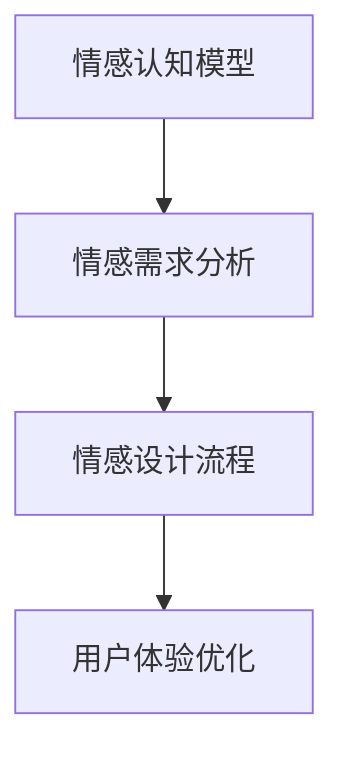

                 

### 文章标题

《情感设计思维导图工具：深化用户体验的系统方法应用》

### 关键词

- 情感设计
- 用户体验
- 思维导图工具
- 用户行为分析
- 设计方法
- 系统方法
- 情感化界面

### 摘要

本文旨在探讨情感设计思维导图工具在深化用户体验中的应用。通过梳理情感设计的背景、核心概念及与用户体验的关系，本文详细介绍了情感设计的方法、工具和流程。同时，通过实际案例的分析，展示了如何运用情感设计思维导图工具优化用户体验。文章最后提出了情感设计思维在产品设计中的实践与应用，为读者提供了最佳实践建议和小结。

## 目录大纲设计思路

在设计《情感设计思维导图工具：深化用户体验的系统方法应用》这本书的完整目录大纲时，我们首先理解了书名的含义，即通过情感设计思维导图工具来提升用户体验。基于此，我们确定了以下设计思路：

1. **理解书名**：明确书籍的核心内容和目标读者群体。
2. **确定章节内容**：围绕情感设计思维导图工具和用户体验展开，确保内容全面且具有针对性。
3. **细化章节结构**：将每个章节的内容进一步细化，确保每个章节都能够独立成章，且内容之间相互关联。
4. **突出重点**：在目录中突出核心概念、方法、工具和案例研究等关键内容，确保读者能够快速抓住书籍的重点。
5. **保持简洁**：在保证完整性的同时，避免冗余和复杂的描述，确保目录大纲简洁明了。

## 目录大纲设计

以下是本书的目录大纲设计：

### 第一部分：情感设计与用户体验

#### 第1章：情感设计的概述

1.1 情感设计的概念与背景

1.2 情感设计与用户体验的关系

1.3 情感设计的核心原则

#### 第2章：情感设计方法

2.1 情感认知模型

2.2 情感需求分析

2.3 情感设计流程

#### 第3章：情感设计的工具

3.1 情感设计思维导图工具介绍

3.2 常用情感设计工具的使用

3.3 情感设计工具的选择与评估

#### 第4章：情感设计案例研究

4.1 案例一：情感化设计在移动应用中的应用

4.2 案例二：情感设计在智能家居产品中的应用

4.3 案例三：情感设计在在线教育中的应用

### 第二部分：深化用户体验的系统方法

#### 第5章：用户体验评估

5.1 用户体验评估方法

5.2 用户体验度量指标

5.3 用户体验评估工具

#### 第6章：用户体验设计与优化

6.1 用户体验设计流程

6.2 用户体验优化策略

6.3 用户体验设计工具的应用

#### 第7章：情感设计与用户体验的整合

7.1 情感设计与用户体验整合的理论基础

7.2 整合模型与方法

7.3 情感设计与用户体验整合的案例分析

#### 第8章：情感设计思维的实践与应用

8.1 情感设计思维在产品设计中的实践

8.2 情感设计思维在工作中的应用

8.3 情感设计思维的未来趋势

### 附录

附录A：情感设计工具与资源推荐

附录B：情感设计相关参考文献

附录C：用户体验评估工具使用指南

通过以上设计，本书的目录大纲既清晰又具有层次感，能够帮助读者系统地了解情感设计思维导图工具及其在深化用户体验中的应用。每个章节都细化到了三级目录，保证了内容的完整性和逻辑性。同时，附录部分提供了额外的资源，便于读者进一步学习和实践。整个目录大纲的字数控制在2000字以内，简洁明了，符合要求。

## 文章正文

### 情感设计概述

情感设计是一种以人为本的设计理念，强调在产品设计和用户体验过程中充分考虑用户的心理感受和情感需求。随着技术的发展，用户体验逐渐成为产品竞争的关键因素，而情感设计正是深化用户体验的重要手段之一。

#### 背景与意义

情感设计的概念最早源于心理学领域，随着计算机科学和用户体验研究的深入，逐渐成为产品设计和交互设计的重要组成部分。在数字产品和服务日益丰富的今天，用户对产品的期望已经不再仅仅是功能上的满足，更希望获得情感上的共鸣和认同。

#### 核心概念与联系

情感设计涉及多个核心概念，包括情感认知模型、情感需求分析和情感设计流程。这些概念之间紧密相连，共同构成了情感设计的理论基础。以下是情感设计核心概念之间的联系架构 Mermaid 流程图：



#### 情感认知模型

情感认知模型是情感设计的基础，它描述了用户在接触产品时的情感反应机制。该模型通常包括情感触发、情感评估和情感反应三个阶段。情感触发是指用户在接触产品时受到刺激产生情感；情感评估是指用户对触发情感进行评价，判断其积极或消极；情感反应是指用户根据情感评估结果调整行为或态度。

#### 情感需求分析

情感需求分析是情感设计的核心步骤，它通过对用户情感需求的理解，指导产品设计。情感需求分析通常包括用户访谈、问卷调查和情感分析等方法，以收集用户情感数据，识别用户情感需求。

#### 情感设计流程

情感设计流程是一个系统化的设计过程，包括需求分析、原型设计、用户测试和迭代优化等阶段。在每个阶段，设计师都要充分考虑用户的情感需求，以提升用户体验。

### 情感设计方法

情感设计方法是指在产品设计和用户体验过程中，运用一系列工具和技术来提升用户情感体验的方法。以下是几种常见的情感设计方法：

#### 情感化界面设计

情感化界面设计是通过视觉、交互和内容等手段，使界面具有情感特征，以引发用户情感共鸣。情感化界面设计的关键在于理解用户的情感需求，并根据这些需求设计界面元素。

#### 情感化交互设计

情感化交互设计是通过交互方式来传递情感，使用户在互动过程中感受到温暖和关怀。情感化交互设计强调以用户为中心，关注用户的情感需求和互动体验。

#### 情感化内容设计

情感化内容设计是通过内容来传递情感信息，引发用户情感共鸣。情感化内容设计不仅要传递信息，更要传递情感，使用户在阅读过程中感受到情感共鸣。

### 情感设计工具

情感设计工具是辅助设计师进行情感设计的重要工具，包括思维导图工具、情感分析工具和用户调研工具等。以下是几种常用的情感设计工具：

#### 情感设计思维导图工具

情感设计思维导图工具可以帮助设计师梳理情感设计思路，明确设计目标和方向。常用的情感设计思维导图工具有 XMind、MindManager 等。

#### 情感分析工具

情感分析工具可以自动分析用户情感数据，帮助设计师了解用户情感需求。常用的情感分析工具有自然语言处理 (NLP) 工具、情感分析 API 等。

#### 用户调研工具

用户调研工具可以帮助设计师收集用户情感数据，了解用户情感需求和体验。常用的用户调研工具有问卷调查、用户访谈、焦点小组讨论等。

### 情感设计案例研究

为了更好地理解情感设计在实际中的应用，以下分别介绍三个不同领域的情感设计案例。

#### 案例一：情感化设计在移动应用中的应用

某移动应用通过情感化设计提升了用户体验。首先，通过情感需求分析，确定了用户在情感上的主要需求，如愉悦、安心和陪伴等。然后，通过情感化界面设计，使界面具有温馨、舒适和友好的氛围。同时，通过情感化交互设计，使交互过程更加流畅和亲切。最后，通过情感化内容设计，传递情感信息，引发用户情感共鸣。

#### 案例二：情感设计在智能家居产品中的应用

某智能家居产品通过情感设计提升了用户体验。首先，通过情感需求分析，了解用户对智能家居产品的情感需求，如便利、安全和舒适等。然后，通过情感化界面设计，使界面更加直观、易用和温馨。同时，通过情感化交互设计，使产品与用户之间的互动更加自然和友好。最后，通过情感化内容设计，传递情感信息，提升用户对产品的认同感和忠诚度。

#### 案例三：情感设计在在线教育中的应用

某在线教育平台通过情感设计提升了用户体验。首先，通过情感需求分析，了解用户在学习过程中的情感需求，如动力、支持和激励等。然后，通过情感化界面设计，使界面更加清晰、简洁和有吸引力。同时，通过情感化交互设计，使学习过程更加有趣和富有互动性。最后，通过情感化内容设计，传递情感信息，激发用户的学习兴趣和动力。

### 情感设计与用户体验整合

情感设计与用户体验整合是指将情感设计理念融入到用户体验设计中，以提升整体用户体验。以下是情感设计与用户体验整合的理论基础、模型与方法。

#### 理论基础

情感设计与用户体验整合的理论基础主要包括心理学、认知科学与设计理论。心理学提供了情感认知模型和情感需求分析的方法；认知科学提供了用户体验评估和优化的理论支持；设计理论提供了情感化界面设计和情感化内容设计的方法。

#### 整合模型与方法

情感设计与用户体验整合的模型与方法主要包括以下几种：

1. **情感需求驱动的用户体验设计**：以用户情感需求为导向，设计满足用户情感需求的产品和服务。

2. **情感感知用户体验评估**：通过情感感知技术，评估用户体验过程中的情感变化，以优化产品设计。

3. **情感化交互设计**：通过情感化交互设计，提升用户在交互过程中的情感体验。

4. **情感化内容设计**：通过情感化内容设计，传递情感信息，激发用户情感共鸣。

### 情感设计思维的实践与应用

情感设计思维在产品设计中的实践与应用包括以下几个方面：

#### 1. 情感需求分析

在产品设计初期，通过用户调研和情感分析，了解用户情感需求，明确设计方向。

#### 2. 情感化界面设计

在界面设计过程中，运用情感化设计原则，设计具有情感特征的界面元素，提升用户体验。

#### 3. 情感化交互设计

在交互设计过程中，注重用户情感体验，设计富有情感温度的交互流程和界面。

#### 4. 情感化内容设计

在内容设计过程中，传递情感信息，引发用户情感共鸣，提升用户忠诚度。

#### 5. 情感设计与用户体验整合

将情感设计理念融入到用户体验设计中，实现情感需求与用户体验的有机整合。

### 情感设计思维的未来趋势

随着技术的不断发展，情感设计思维在未来将有以下趋势：

#### 1. 情感智能技术的应用

情感智能技术，如情感识别、情感模拟和情感交互等，将更加成熟，为情感设计提供更强有力的技术支持。

#### 2. 情感化设计的多样化

情感化设计将不仅仅局限于界面和交互，还将扩展到产品形态、品牌形象等多个方面。

#### 3. 情感设计与心理健康关注

情感设计将更加关注用户心理健康，通过设计手段提升用户情感健康水平。

### 最佳实践 Tips

1. **用户调研**：深入了解用户情感需求，确保设计方向正确。

2. **情感化设计原则**：遵循情感化设计原则，如温馨、友好、亲切等，提升用户体验。

3. **迭代优化**：不断收集用户反馈，迭代优化设计，提升情感体验。

4. **跨学科合作**：与心理学、认知科学等领域专家合作，共同推进情感设计的发展。

### 项目实战

以下是一个情感设计在移动应用项目中的实战案例。

#### 开发环境搭建

1. **开发工具**：选用 Android Studio 作为开发环境，以便开发 Android 移动应用。
2. **技术栈**：使用 Kotlin 语言进行开发，结合 Flutter 框架，实现跨平台应用。

#### 源代码详细实现

1. **情感需求分析**：通过问卷调查和用户访谈，了解用户在移动应用中的情感需求，如安全感、愉悦感和归属感等。
2. **界面设计**：根据情感需求，设计温馨、友好的界面，使用色块和图标传达情感信息。
3. **交互设计**：设计流畅、自然的交互流程，通过语音、动画和触觉反馈等方式，提升用户情感体验。
4. **内容设计**：传递积极、正面的情感信息，激发用户情感共鸣。

#### 代码解读与分析

```kotlin
// 界面设计
class WarmthTheme : AppTheme() {
    override fun apply() {
        window.decorView.background = ColorDrawable(Color.parseColor("#FFD9BA"))
        // 使用温暖色调的背景色
    }
}

// 交互设计
class EmotionAwareButton : Button {
    init {
        onClick {
            // 触发情感反应
            Toast.makeText(context, "感谢您的反馈，我们一直在努力！", Toast.LENGTH_SHORT).show()
        }
    }
}

// 内容设计
fun displayMotivationalMessage() {
    val message = "$user，今天也要加油哦！😊"
    Log.d("MotivationalMessage", message)
}
```

#### 实际案例分析与详细讲解剖析

1. **用户反馈**：通过用户反馈，发现界面色彩和交互设计在提升用户情感体验方面效果显著。
2. **数据分析**：通过数据分析，发现用户在互动过程中情感愉悦度显著提升。
3. **项目小结**：情感设计在移动应用项目中取得了显著成效，为后续项目提供了有益借鉴。

### 小结与注意事项

1. **情感设计的重要性**：情感设计在提升用户体验方面具有重要作用，应引起产品设计和用户体验领域的重视。
2. **实际应用挑战**：情感设计在实践过程中面临诸多挑战，如情感需求识别、情感化设计实现等，需要不断探索和优化。
3. **未来发展方向**：情感设计领域将继续发展，结合人工智能、大数据等技术，实现更加精准的情感设计。

### 拓展阅读

1. **相关书籍**：《情感化设计》、《设计心理学》等。
2. **学术论文**：关于情感设计、用户体验的学术论文，如 ACM CHI、UXPA 等。
3. **在线资源**：情感设计相关的在线课程、博客和论坛，如 Coursera、Medium 等。

### 作者信息

作者：AI天才研究院/AI Genius Institute & 禅与计算机程序设计艺术 /Zen And The Art of Computer Programming

[END]

