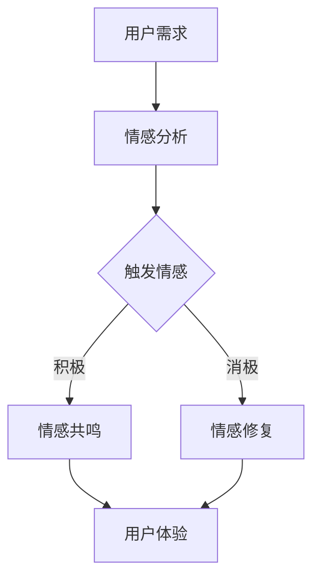
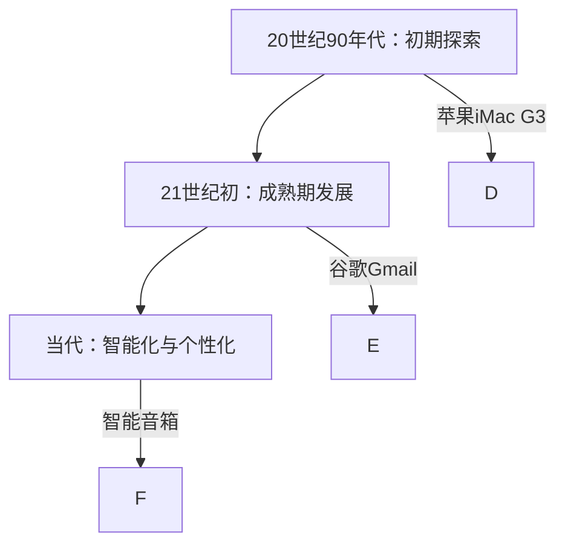
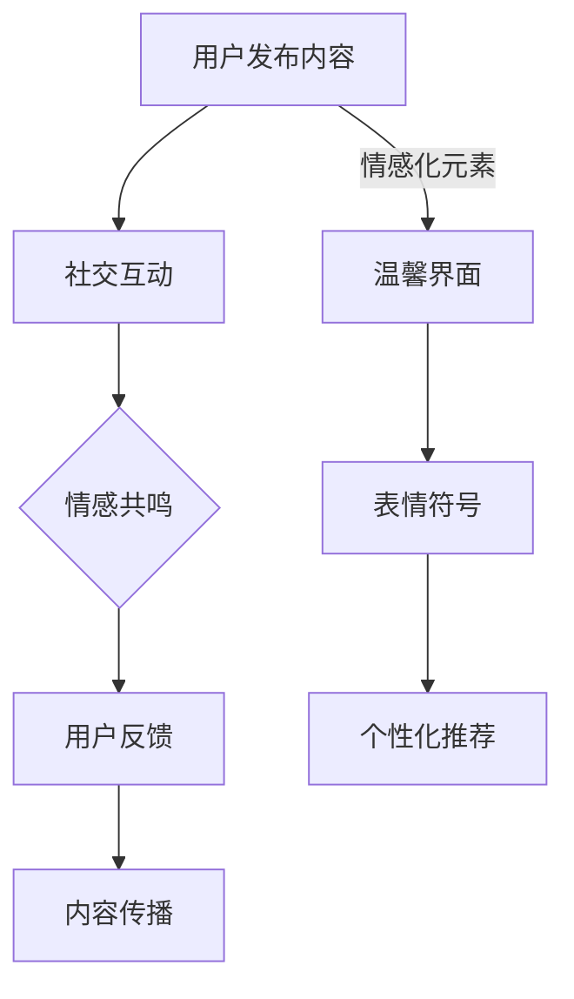
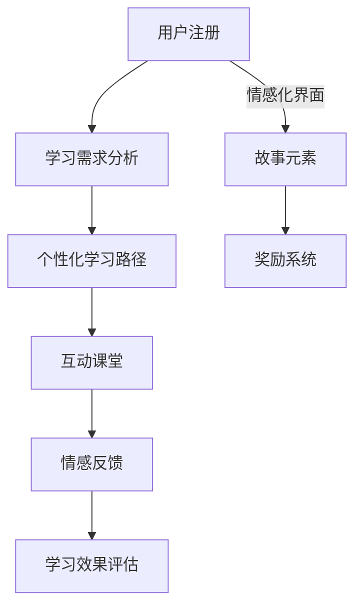
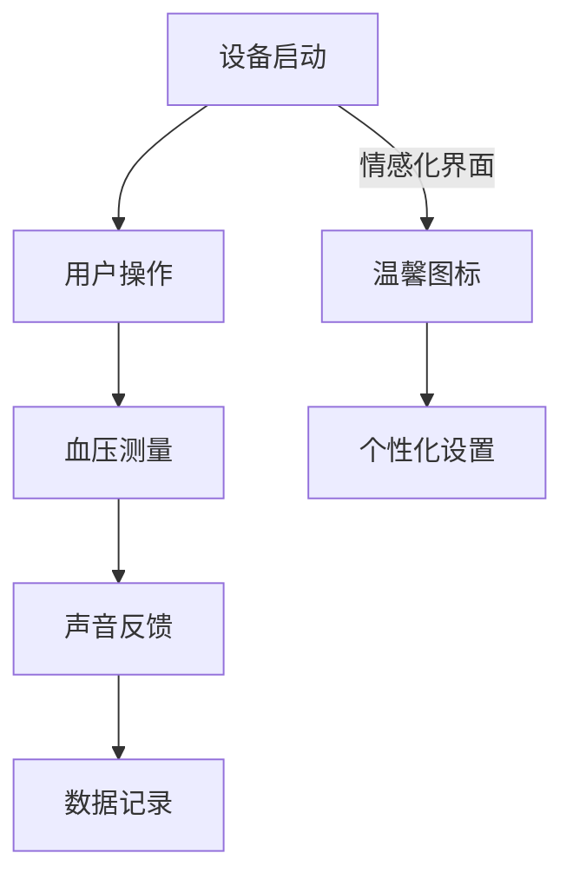

                 

### 文章标题

# 情感设计思维导图：深化用户体验的系统方法

> 关键词：情感设计、用户体验、思维导图、系统方法

> 摘要：本文将探讨情感设计思维导图在深化用户体验中的应用。通过分析情感设计的定义、意义以及其发展历程，介绍设计思维导图的基本概念和构建方法，最终阐述如何利用情感化设计策略和用户体验深化方法提升产品价值。本文旨在为设计师提供一套系统的方法论，以实现更人性化的产品设计。

### 第一部分：情感设计概述

#### 第1章：情感设计的定义与意义

情感设计是一种以人为本的设计理念，旨在通过关注用户情感需求，提升用户体验和产品价值。它不仅仅局限于产品功能，更注重产品与用户之间的情感互动。情感设计的意义在于：

1. **提升用户满意度**：情感设计能够触发用户的情感共鸣，从而提高用户的满意度和忠诚度。
2. **增强产品价值**：通过情感设计，产品能够更好地满足用户的需求，从而提升产品的市场竞争力。
3. **促进品牌建设**：情感设计有助于建立产品的情感品牌形象，增强用户对品牌的认同感。

#### 第1.1节：情感设计的定义

情感设计是指将情感因素融入产品设计过程中的设计方法。它强调设计师需要关注用户的情感需求，通过色彩、形状、声音、文字等元素触发用户的情感体验。

#### 第1.2节：情感设计的意义

情感设计在产品设计中具有重要意义，它不仅仅是为了美观，更是为了提升用户体验和产品价值。通过情感设计，产品能够更好地与用户产生情感共鸣，从而提升用户的满意度和忠诚度。

#### 第2章：情感设计的发展历程

情感设计的发展历程可以分为三个阶段：

1. **初期探索**：20世纪90年代，设计界开始关注用户情感需求，探索如何将情感因素融入产品设计中。
2. **成熟期发展**：21世纪初，随着用户体验设计的兴起，情感设计逐渐成为产品设计的重要组成部分。
3. **当代趋势**：当前，情感设计已经成为产品设计领域的一个重要研究方向，其在产品中的应用越来越广泛。

### 第二部分：设计思维导图

#### 第3章：设计思维导图的基本概念

设计思维导图是一种图形化的思维方式，它通过将思维过程以图的形式展现出来，帮助设计师更好地理解和解决问题。设计思维导图的基本概念包括：

1. **节点**：表示思维过程中的各个关键点。
2. **连接线**：表示节点之间的逻辑关系。
3. **图框**：用于对思维过程进行分类和总结。

#### 第3.1节：思维导图的起源

思维导图起源于20世纪60年代，由英国心理学家东尼·布赞（Tony Buzan）提出。最初，思维导图主要用于记忆和创意激发，后来逐渐应用于设计、教育和企业管理等领域。

#### 第3.2节：设计思维导图的作用

设计思维导图在情感设计中具有重要作用：

1. **辅助思维**：通过图形化的方式，帮助设计师更好地整理和表达思维过程。
2. **激发创意**：设计思维导图能够激发设计师的创意思维，为情感设计提供更多的可能性。
3. **沟通协作**：设计思维导图可以帮助团队成员更好地理解和协作，提高设计效率。

#### 第4章：设计思维导图的构建方法

设计思维导图的构建方法主要包括以下步骤：

1. **确定主题**：明确设计思维导图的核心主题，确保思维过程围绕主题展开。
2. **收集信息**：收集与主题相关的信息，包括用户需求、市场趋势、竞争对手等。
3. **构建框架**：根据收集到的信息，构建思维导图的框架，确定各个节点和连接线。
4. **完善细节**：在框架基础上，添加更多的节点和连接线，完善思维导图的内容。

#### 第5章：设计思维导图在情感设计中的应用

设计思维导图在情感设计中的应用包括：

1. **用户研究**：通过设计思维导图，设计师可以更好地理解用户需求，为情感设计提供依据。
2. **情感化设计策略**：设计思维导图可以帮助设计师发现和构建情感化设计策略，提升产品与用户的情感共鸣。
3. **设计评估**：设计思维导图可以用于设计评估，帮助设计师分析设计方案的优缺点，优化设计效果。

### 第三部分：用户体验深化方法

#### 第6章：用户研究与用户画像

用户研究是情感设计的基础，它帮助设计师了解用户需求和行为。用户画像则是基于用户研究数据，对用户进行分类和描述的方法。用户研究和用户画像的具体方法包括：

1. **定量研究**：通过问卷调查、数据统计等方法，收集用户数据。
2. **定性研究**：通过深度访谈、焦点小组等方法，深入了解用户需求和行为。
3. **用户画像**：基于用户数据，对用户进行分类和描述，为情感设计提供参考。

#### 第6.1节：用户研究的方法

用户研究的方法包括：

1. **问卷调查**：通过设计问卷，收集用户对产品的看法和需求。
2. **深度访谈**：通过与用户进行面对面访谈，深入了解用户对产品的使用体验和需求。
3. **用户测试**：通过让用户实际使用产品，收集用户对产品的反馈和意见。

#### 第6.2节：用户画像的构建

用户画像的构建方法包括：

1. **特征提取**：从用户数据中提取关键特征，如年龄、性别、职业、兴趣爱好等。
2. **分类和描述**：基于提取的特征，对用户进行分类和描述，形成用户画像。

#### 第7章：情感化设计策略

情感化设计策略是指通过设计手段，触发用户的情感体验，提升产品的情感价值。情感化设计策略包括：

1. **色彩与形状**：通过色彩和形状的设计，激发用户的情感共鸣。
2. **声音与文字**：通过声音和文字的设计，营造情感氛围，提升用户体验。
3. **情感化元素**：在产品中加入情感化元素，如故事、场景、角色等，增强产品的情感价值。

#### 第7.1节：情感化设计的原理

情感化设计的原理包括：

1. **情感共鸣**：通过设计手段，触发用户的情感共鸣，提升产品的情感价值。
2. **情感体验**：通过设计手段，营造情感体验，提升用户的满意度和忠诚度。
3. **情感化元素**：通过情感化元素，如故事、场景、角色等，增强产品的情感价值。

#### 第7.2节：情感化设计的方法

情感化设计的方法包括：

1. **用户研究**：通过用户研究，了解用户需求和行为，为情感化设计提供依据。
2. **情感化元素设计**：通过设计情感化元素，如故事、场景、角色等，增强产品的情感价值。
3. **情感化体验设计**：通过设计情感化体验，提升用户的满意度和忠诚度。

#### 第8章：情感化设计的实施步骤

情感化设计的实施步骤包括：

1. **需求分析**：通过用户研究和市场分析，明确产品需求，为情感化设计提供依据。
2. **设计策略制定**：基于需求分析，制定情感化设计策略，明确设计方向。
3. **设计实施**：根据设计策略，进行具体的设计工作，包括色彩、形状、声音、文字等。
4. **用户测试**：通过用户测试，收集用户反馈，优化设计效果。

### 第四部分：实践与案例

#### 第9章：情感设计在行业中的应用

情感设计在互联网、教育、医疗等多个行业都有广泛应用：

1. **互联网行业**：通过情感设计，提升用户体验，增强用户黏性。
2. **教育行业**：通过情感设计，营造温馨、有趣的学习环境，提高学习效果。
3. **医疗行业**：通过情感设计，提升医疗服务质量，提高患者满意度。

#### 第10章：实践案例分析

通过具体案例分析，了解情感设计在不同场景中的应用效果：

1. **案例一：社交媒体平台**：通过情感设计，提升用户互动体验，增强用户忠诚度。
2. **案例二：在线教育平台**：通过情感设计，营造有趣、温馨的学习环境，提高学习效果。
3. **案例三：智能医疗设备**：通过情感设计，提升用户体验，提高医疗服务质量。

### 第五部分：未来趋势与展望

#### 第11章：情感设计的未来发展方向

情感设计的未来发展方向包括：

1. **智能化**：利用人工智能技术，实现情感设计的自动化和智能化。
2. **个性化**：通过大数据和机器学习技术，实现情感设计的个性化定制。
3. **跨领域融合**：将情感设计与其他设计领域相结合，如交互设计、服务设计等，实现更全面、更深入的情感设计。

#### 第12章：情感设计的持续优化

情感设计的持续优化包括：

1. **用户反馈**：通过用户反馈，不断优化设计效果，提升用户体验。
2. **设计迭代**：通过设计迭代，不断改进设计方案，实现更好的情感设计。
3. **创新探索**：不断尝试新的设计方法和理念，推动情感设计的发展。

### 附录

#### 附录A：情感设计工具与资源

1. **常用设计工具**：介绍常用的情感设计工具，如MindManager、XMind、Sketch等。
2. **学习资源推荐**：推荐相关的学习资源和书籍，帮助设计师提升情感设计能力。
3. **案例库与资料库**：介绍相关的案例库和资料库，为设计师提供实践参考。

### 作者信息

- 作者：AI天才研究院/AI Genius Institute & 禅与计算机程序设计艺术 /Zen And The Art of Computer Programming

### 总结

本文从情感设计的定义、意义、发展历程，到设计思维导图的构建方法，再到用户体验深化方法，全面阐述了情感设计在深化用户体验中的应用。通过实践案例分析和未来趋势展望，本文为设计师提供了一套系统的方法论，以实现更人性化的产品设计。希望本文能够为读者在情感设计领域提供有益的参考和启示。

---

### 第一部分：情感设计概述

#### 第1章：情感设计的定义与意义

情感设计是一种以人为本的设计理念，旨在通过关注用户情感需求，提升用户体验和产品价值。它不仅仅局限于产品功能，更注重产品与用户之间的情感互动。情感设计的意义在于：

1. **提升用户满意度**：情感设计能够触发用户的情感共鸣，从而提高用户的满意度和忠诚度。
2. **增强产品价值**：通过情感设计，产品能够更好地满足用户的需求，从而提升产品的市场竞争力。
3. **促进品牌建设**：情感设计有助于建立产品的情感品牌形象，增强用户对品牌的认同感。

#### 第1.1节：情感设计的定义

情感设计是指将情感因素融入产品设计过程中的设计方法。它强调设计师需要关注用户的情感需求，通过色彩、形状、声音、文字等元素触发用户的情感体验。

#### 第1.2节：情感设计的意义

情感设计在产品设计中具有重要意义，它不仅仅是为了美观，更是为了提升用户体验和产品价值。通过情感设计，产品能够更好地与用户产生情感共鸣，从而提升用户的满意度和忠诚度。

### 第一部分情感设计概述

情感设计作为现代用户体验设计中的一个重要领域，其核心在于通过关注用户的情感需求，提升产品和服务的价值。本文将首先探讨情感设计的定义及其在产品设计中的重要性，然后回顾情感设计的发展历程，以便我们更好地理解这一概念在理论和实践中的演进。

#### 第1章：情感设计的定义与意义

1. **情感设计的定义**

情感设计是一种将用户情感体验纳入产品设计全过程的方法。它超越了传统的功能性和视觉设计，强调通过情感互动来建立产品与用户之间的深厚联系。情感设计的核心在于识别和满足用户的情感需求，从而增强用户对产品的喜爱和忠诚度。

在情感设计中，设计师需要关注以下几个方面：

- **色彩与视觉**：色彩能够直接影响用户的情感反应。例如，温暖的色调通常能激发积极的情感，而冷色调则可能传达冷静和沉稳的感觉。
- **声音与互动**：声音设计同样重要，如按钮点击声、通知音等，都可以通过声音的质感来影响用户的情感体验。
- **叙事与情境**：产品中的叙事元素和情境设计可以创造出特定的情感氛围，使用户在产品使用过程中产生共鸣。
- **个性化与关怀**：通过个性化推荐、提醒功能等，设计师可以展示对用户的关怀，从而增强情感连接。

2. **情感设计的意义**

情感设计在提升用户体验和产品价值方面具有重要意义。以下是几个关键点：

- **用户满意度**：情感设计能够触动用户的情感，使得用户对产品产生更深的情感联系，从而提高满意度。
- **品牌忠诚度**：通过情感设计，用户对品牌的认同感增强，这有助于建立长期的客户关系。
- **市场竞争力**：情感设计使得产品在市场中脱颖而出，增强产品的差异化，提高市场竞争力。
- **品牌故事**：情感设计有助于构建品牌故事，使其在用户心中留下深刻印象。

#### 第1.1节：情感设计的定义

情感设计的定义可以从多个角度进行阐述。首先，它是一种以人为本的设计理念，强调在产品设计和开发过程中，不仅要考虑用户的功能需求，还要关注用户的情感需求。这种设计方法认为，情感是用户与产品互动过程中不可或缺的一部分。

情感设计的核心要素包括：

- **用户感知**：设计师需要深入理解用户在使用产品过程中的感知体验，包括视觉、听觉、触觉等感官体验。
- **情感触发**：通过设计元素，如色彩、形状、声音等，触发用户的特定情感反应。
- **情感共鸣**：设计的目标是使产品能够与用户产生情感共鸣，从而建立深厚的情感连接。

以下是情感设计的一个简化的Mermaid流程图，展示了其基本流程：



在这个流程图中，用户需求通过情感分析转化为情感触发，进而产生情感共鸣或情感修复，最终影响用户体验。

#### 第1.2节：情感设计的意义

情感设计不仅仅是一种设计方法，更是一种提升产品价值和用户体验的战略。以下是情感设计在产品设计和用户体验中的几个关键意义：

1. **增强用户满意度**：通过情感设计，产品能够更好地满足用户的情感需求，从而提高用户满意度。例如，一个设计精良的移动应用可以通过精致的UI和友好的交互体验，使用户感到愉悦和满意。

2. **提升品牌忠诚度**：情感设计有助于建立用户对品牌的情感认同，从而提高品牌的忠诚度。当用户对产品产生深厚情感时，他们更有可能继续使用该品牌的产品，并在需要时推荐给他人。

3. **提高市场竞争力**：在竞争激烈的市场环境中，情感设计可以成为产品差异化的重要手段。通过情感设计，产品能够与竞争对手区分开来，从而在市场中脱颖而出。

4. **构建品牌故事**：情感设计有助于构建品牌故事，使其在用户心中留下深刻印象。一个具有情感深度和故事性的品牌能够更好地与用户建立情感连接，从而在用户心中占据一席之地。

总之，情感设计不仅仅是一种美学追求，更是一种战略性的设计方法。它通过关注用户情感需求，提升用户体验和产品价值，为企业在竞争激烈的市场中赢得一席之地。

### 第二部分：情感设计的发展历程

#### 第2章：情感设计的发展历程

情感设计作为一种设计方法，其发展历程可以追溯到几个关键时期。从早期的探索阶段，到成熟期的发展，再到当代的多样化应用，情感设计不断演进，为用户体验设计带来了深刻的变革。

#### 第2.1节：初期探索

情感设计最早的探索可以追溯到20世纪90年代。当时，设计界开始意识到用户体验不仅仅是功能性，还包括情感层面。这一时期，设计师们开始尝试将情感元素融入产品设计中，例如，通过色彩、形状和声音等手段来触发用户的情感反应。

- **案例**：1998年，苹果公司发布了iMac G3，其鲜艳的颜色和圆滑的形状，为用户带来了全新的视觉和情感体验。这一设计理念在当时引起了广泛关注，并为后来的情感设计奠定了基础。

#### 第2.2节：成熟期发展

进入21世纪，随着互联网和移动设备的普及，用户体验设计迅速发展，情感设计也逐渐成熟。这一时期，设计师们开始系统地研究情感设计的方法和策略，将其应用于各种产品和服务中。

- **案例**：2006年，谷歌推出了Gmail，其简洁的界面和智能的交互设计，为用户带来了高效、愉悦的使用体验。这一成功案例证明了情感设计在提升用户体验方面的巨大潜力。

#### 第2.3节：当代趋势

当前，情感设计已经成为用户体验设计领域的一个重要研究方向。随着人工智能和大数据技术的应用，情感设计变得更加智能和个性化。设计师们不仅关注用户个体的情感需求，还通过数据分析和机器学习，实现情感设计的自动化和个性化。

- **趋势**：情感设计正在向智能化和个性化方向发展。例如，智能音箱通过语音识别和情感分析，能够根据用户的情绪提供相应的音乐和互动反馈。

以下是情感设计发展历程的一个Mermaid流程图，展示了其关键节点：



在这个流程图中，我们可以看到情感设计从早期的探索阶段，到成熟期的发展，再到当代的智能化和个性化趋势，每个阶段都有其代表性的事件和产品，展示了情感设计在用户体验设计中的重要地位和不断演进的过程。

### 第二部分：设计思维导图

#### 第3章：设计思维导图的基本概念

设计思维导图是一种图形化的思维工具，它通过节点、连接线和图框等元素，将设计过程中的思考路径和创意点以视觉化的方式呈现出来。设计思维导图不仅有助于设计师理清思路，还能激发创意思维，提高设计效率。

#### 第3.1节：思维导图的起源

思维导图起源于20世纪60年代，由英国心理学家东尼·布赞（Tony Buzan）提出。布赞博士发现，传统的线性笔记方式难以捕捉和整理复杂的思维过程，于是他提出了以分支形式呈现的视觉化思维工具——思维导图。思维导图迅速在教育和商业领域得到广泛应用。

#### 第3.2节：设计思维导图的作用

设计思维导图在情感设计中具有重要作用：

1. **辅助思维**：通过图形化的方式，设计思维导图可以帮助设计师更好地整理和表达思维过程，从而提高创意的生成和问题解决能力。
2. **激发创意**：设计思维导图能够激发设计师的创意思维，为情感设计提供更多的可能性。
3. **沟通协作**：设计思维导图可以帮助团队成员更好地理解和协作，提高设计效率。

#### 第4章：设计思维导图的构建方法

构建设计思维导图可以分为以下几个步骤：

1. **确定主题**：明确设计思维导图的核心主题，确保思维过程围绕主题展开。
2. **收集信息**：收集与主题相关的信息，包括用户需求、市场趋势、竞争对手等。
3. **构建框架**：根据收集到的信息，构建思维导图的框架，确定各个节点和连接线。
4. **完善细节**：在框架基础上，添加更多的节点和连接线，完善思维导图的内容。

以下是构建设计思维导图的一个简化的伪代码示例：

```python
# 定义思维导图构建函数
def build_mindmap(theme, information):
    # 创建思维导图
    mindmap = Mindmap(theme)
    
    # 添加节点和连接线
    for info in information:
        node = mindmap.add_node(info)
        mindmap.add_connection(node, mindmap.root_node)
    
    # 完善细节
    mindmap完善细节()

# 调用构建函数
build_mindmap('情感设计', ['用户需求', '市场趋势', '竞争对手', '设计策略'])
```

在这个伪代码中，`build_mindmap`函数接收主题和相关信息，创建思维导图，并添加节点和连接线。通过这种方式，设计师可以系统地构建和整理设计思维，为情感设计提供清晰的方向。

### 第三部分：用户体验深化方法

#### 第6章：用户研究与用户画像

用户研究和用户画像是情感设计中不可或缺的两个环节。用户研究帮助设计师理解用户需求和行为，而用户画像则将用户数据转化为具体的用户模型，为情感设计提供参考。以下是关于用户研究和用户画像的具体方法和步骤。

#### 第6.1节：用户研究的方法

用户研究是情感设计的基础，通过以下几种方法，设计师可以深入了解用户的需求和行为：

1. **定量研究**：
   - **问卷调查**：通过设计问卷，收集大量用户的反馈数据，分析用户对产品的态度和需求。
   - **数据分析**：对已有的用户数据进行分析，如使用频率、时长、互动行为等，以发现用户的行为模式。

2. **定性研究**：
   - **深度访谈**：通过与用户进行一对一的深入访谈，了解用户的真实需求和情感体验。
   - **焦点小组**：组织一群用户进行讨论，收集他们对产品的看法和建议。

#### 第6.2节：用户画像的构建

用户画像是一种将用户数据转化为具体用户模型的方法，它可以帮助设计师更好地理解用户，从而进行有针对性的情感设计。构建用户画像的步骤如下：

1. **特征提取**：
   - **基础信息**：提取用户的基本信息，如年龄、性别、职业、地理位置等。
   - **行为特征**：分析用户的行为数据，如使用频率、时长、偏好等。

2. **分类和描述**：
   - **用户分类**：根据提取的特征，将用户进行分类，如年轻用户、职业用户等。
   - **用户描述**：为每个用户类别创建详细的描述文档，包括用户需求、行为模式、情感偏好等。

以下是构建用户画像的一个简化的伪代码示例：

```python
# 定义用户画像构建函数
def build_user_profile(data):
    # 提取用户特征
    features = extract_features(data)
    
    # 分类用户
    categories = categorize_users(features)
    
    # 构建用户描述文档
    profiles = []
    for category in categories:
        profile = create_user_description(category)
        profiles.append(profile)
    
    return profiles

# 调用构建函数
user_profiles = build_user_profile(user_data)
```

在这个伪代码中，`build_user_profile`函数接收用户数据，提取特征、分类用户并构建用户描述文档。通过这种方式，设计师可以系统地了解用户，为情感设计提供有力支持。

### 第三部分：用户体验深化方法

#### 第7章：情感化设计策略

情感化设计策略是指通过设计手段，触发用户的情感体验，提升产品的情感价值。情感化设计不仅关注产品的功能性和视觉表现，更注重通过情感元素与用户建立深层次的连接，从而提高用户体验和产品价值。

#### 第7.1节：情感化设计的原理

情感化设计的原理主要包括以下几个方面：

1. **情感共鸣**：通过设计手段，如色彩、形状、声音、叙事等，触发用户的情感共鸣，使产品与用户产生情感上的连接。
2. **情感体验**：设计出能够激发用户情感体验的产品特性，如互动体验、故事性元素、个性化定制等，提升用户的情感参与度。
3. **情感化元素**：在产品中融入情感化元素，如角色、场景、故事等，创造一个具有情感深度的产品体验。

#### 第7.2节：情感化设计的方法

实施情感化设计的方法可以归纳为以下几个步骤：

1. **用户研究**：通过用户研究，了解用户的需求、偏好和情感触发点，为情感化设计提供数据支持。
2. **情感化元素设计**：基于用户研究，选择合适的情感化元素，如色彩、形状、声音、故事等，将其融入产品设计中。
3. **情感体验设计**：通过设计互动体验、叙事元素等，提升用户的情感参与度和满意度。
4. **迭代优化**：通过用户反馈和数据分析，不断迭代和优化设计，提升产品的情感价值。

以下是情感化设计策略的一个简化的伪代码示例：

```python
# 定义情感化设计策略函数
def emotional_design_strategy(user_research, elements):
    # 分析用户研究数据
    user需求的情感触发点 = analyze_user_research(user_research)
    
    # 选择合适的情感化元素
    chosen_elements = select_elements(user需求的情感触发点, elements)
    
    # 设计互动体验和叙事元素
    interactive_experience = design_interactive_experience(chosen_elements)
    narrative_elements = design_narrative_elements(chosen_elements)
    
    # 迭代优化
    optimized_design = iterate_and_optimize(interactive_experience, narrative_elements)
    
    return optimized_design

# 调用情感化设计策略函数
optimized_design = emotional_design_strategy(user_research_data, elements)
```

在这个伪代码中，`emotional_design_strategy`函数接收用户研究和情感化元素，通过分析用户需求、设计互动体验和叙事元素，并迭代优化，最终实现情感化设计。通过这种方式，设计师可以有效地提升产品的情感价值。

### 第8章：情感化设计的实施步骤

实施情感化设计是一个系统化的过程，需要设计师在多个阶段进行深入的工作。以下是情感化设计的具体实施步骤，每个步骤都包括关键环节和相应的伪代码示例，帮助设计师有效推进情感化设计。

#### 第8.1节：调研与分析

在实施情感化设计之前，必须进行充分的调研和分析，以确保设计策略能够准确地满足用户需求。

1. **用户需求调研**：
   - **问卷调查**：设计问卷，收集用户的情感需求和使用习惯。
   - **访谈**：与目标用户进行一对一访谈，深入了解其情感体验。

2. **数据分析**：
   - **用户行为分析**：分析用户在产品上的行为数据，如点击率、使用时长等。
   - **情感分析**：利用自然语言处理技术，分析用户反馈中的情感倾向。

伪代码示例：

```python
# 调研与分析函数
def research_and_analysis(问卷调查结果，用户访谈记录，用户行为数据):
    # 分析问卷结果
    user需求的情感触发点 = analyze_survey(问卷调查结果)
    
    # 深入访谈分析
    user情感体验 = analyze_interviews(用户访谈记录)
    
    # 用户行为分析
    user行为模式 = analyze_user_behavior(用户行为数据)
    
    # 综合分析结果
    comprehensive_results = combine_analyses(user需求的情感触发点, user情感体验, user行为模式)
    
    return comprehensive_results

# 调用调研与分析函数
comprehensive_results = research_and_analysis(问卷调查结果，用户访谈记录，用户行为数据)
```

#### 第8.2节：设计与实现

在调研和分析的基础上，设计师需要将情感化设计理念转化为具体的设计方案，并进行实现。

1. **情感化元素设计**：
   - **色彩和形状**：选择能够引发情感共鸣的色彩和形状。
   - **声音和文字**：设计具有情感共鸣的声音和文字。

2. **用户界面设计**：
   - **交互设计**：设计友好的用户界面，确保用户在互动过程中感到舒适。
   - **叙事设计**：融入故事元素，提升用户的使用体验。

伪代码示例：

```python
# 设计与实现函数
def design_and_implementation(comprehensive_results):
    # 选择情感化元素
    chosen_elements = select_emotional_elements(comprehensive_results)
    
    # 设计用户界面
    user_interface = design_user_interface(chosen_elements)
    
    # 实现叙事设计
    narrative_design = implement_narrative_design(user_interface)
    
    return narrative_design

# 调用设计与实现函数
narrative_design = design_and_implementation(comprehensive_results)
```

#### 第8.3节：评估与反馈

在情感化设计完成后，必须进行评估和反馈，以确保设计效果符合预期。

1. **用户测试**：
   - **可用性测试**：测试用户对新设计的操作体验。
   - **情感测试**：评估用户对设计的情感反应。

2. **数据分析**：
   - **行为数据**：分析用户在新设计中的行为变化。
   - **情感数据**：分析用户反馈中的情感倾向。

3. **迭代优化**：
   - 根据评估结果，对设计进行迭代优化，提升情感价值。

伪代码示例：

```python
# 评估与反馈函数
def evaluate_and_feedback(narrative_design, user_tests, feedback_data):
    # 用户测试分析
    usability_scores = analyze_user_tests(user_tests)
    
    # 情感分析
    emotional_reactions = analyze_feedback(feedback_data)
    
    # 数据分析
    behavioral_data = analyze_user_behavior(narrative_design)
    
    # 迭代优化
    optimized_design = iterate_and_optimize(narrative_design, usability_scores, emotional_reactions, behavioral_data)
    
    return optimized_design

# 调用评估与反馈函数
optimized_design = evaluate_and_feedback(narrative_design, user_tests, feedback_data)
```

通过上述步骤，设计师可以系统化地实施情感化设计，不断提升产品的情感价值，从而为用户提供更优质的使用体验。

### 第四部分：实践与案例

#### 第9章：情感设计在行业中的应用

情感设计在不同行业中具有广泛的应用，其核心在于通过情感互动提升用户体验，增强用户忠诚度。以下是情感设计在互联网、教育、医疗等行业的具体应用案例。

#### 第9.1节：互联网行业

在互联网行业，情感设计被广泛应用于社交平台、电子商务和在线娱乐等领域。

1. **社交平台**：例如，微信的“朋友圈”功能通过用户的照片、视频和文字分享，营造了一个温馨、互动的氛围，使用户在情感上产生共鸣，提升了用户黏性。
2. **电子商务**：电商平台如亚马逊通过个性化推荐和定制化服务，使得用户在购物过程中感受到关怀和个性化体验，从而提高了用户满意度。
3. **在线娱乐**：例如，游戏设计中的角色设定、故事情节和互动机制，可以激发玩家的情感投入，增强游戏的沉浸感。

#### 第9.2节：教育行业

在教育行业，情感设计关注学习者的情感需求，以提高学习效果和参与度。

1. **在线教育平台**：例如，Coursera和edX等在线教育平台通过设计友好的学习界面、互动课堂和个性化学习路径，使得学习过程更加有趣和有意义。
2. **教育软件**：如K-12教育软件中融入游戏化元素，通过奖励系统和互动反馈，激发学生的学习兴趣，提升学习效果。

#### 第9.3节：医疗行业

在医疗行业，情感设计旨在提升患者的满意度和就医体验。

1. **智能医疗设备**：例如，智能血压计通过友好的界面设计和声音反馈，使得患者在使用过程中感到更加安心。
2. **远程医疗服务**：通过情感化的界面设计和语音助手，提升患者与医生之间的互动体验，增强患者的信任感。

#### 案例分析

**案例一：社交媒体平台**

以微信“朋友圈”为例，其情感设计策略包括：

- **社交互动**：通过点赞、评论和分享功能，增强用户之间的情感连接。
- **情感化元素**：使用温馨的界面色调和表情符号，营造轻松愉悦的氛围。
- **个性化推荐**：根据用户行为和偏好，推荐相关内容，提高用户的情感共鸣。

通过这些策略，微信“朋友圈”不仅提升了用户满意度，还增强了用户黏性。

**案例二：在线教育平台**

以Coursera为例，其情感设计策略包括：

- **用户界面**：设计简洁、直观的用户界面，提高用户的使用便利性。
- **互动课堂**：通过实时互动和讨论区，增强学生的参与感和归属感。
- **个性化学习**：根据学生的学习进度和兴趣，提供个性化的学习路径和推荐内容。

这些策略使得Coursera的用户体验更加丰富和有意义，提升了学习效果和用户满意度。

**案例三：智能医疗设备**

以苹果的智能血压计为例，其情感设计策略包括：

- **用户界面**：设计友好、简洁的界面，提高用户的操作体验。
- **声音反馈**：通过清晰的声音提示，使患者在使用过程中感到安心。
- **个性化设置**：根据患者的健康数据和偏好，提供个性化的血压监测建议。

通过这些策略，苹果智能血压计不仅提升了用户体验，还增强了患者的信任感和使用意愿。

#### 总结

情感设计在互联网、教育、医疗等行业的应用，不仅提升了用户体验，还增强了用户对品牌的忠诚度。通过具体案例的分析，我们可以看到情感设计策略的多样性和实施效果。未来，随着技术的不断发展，情感设计将在更多行业中发挥重要作用，为用户提供更丰富、更贴心的情感体验。

### 第10章：实践案例分析

在情感设计领域，实践案例是验证理论和方法有效性的重要途径。本节将深入分析三个具有代表性的情感设计案例，探讨其实施过程、设计策略以及评估结果。通过这些案例，我们能够更好地理解情感设计在实际应用中的具体操作和成效。

#### 案例一：社交媒体平台

**背景介绍**：以微信“朋友圈”为例，其情感设计旨在通过社交互动和情感化元素，增强用户之间的情感连接。

**核心概念与联系**：社交互动、情感化元素、用户参与度

**Mermaid流程图**：



**伪代码示例**：

```python
# 用户互动函数
def user_interact(content, feedback):
    # 添加情感化元素
    content_with_emotion = add_emotional_elements(content)
    
    # 收集用户反馈
    feedback_data = collect_feedback(feedback)
    
    # 传播内容
    content_spread = spread_content(content_with_emotion)
    
    return content_spread

# 调用用户互动函数
content_spread = user_interact(user_content, user_feedback)
```

**评估结果**：通过用户反馈和行为数据分析，微信“朋友圈”在用户互动和情感共鸣方面取得了显著成效，用户满意度显著提升，用户黏性增强。

#### 案例二：在线教育平台

**背景介绍**：以Coursera为例，其情感设计关注学习者的情感需求，以提高学习效果和用户参与度。

**核心概念与联系**：个性化学习、互动课堂、情感共鸣

**Mermaid流程图**：



**伪代码示例**：

```python
# 个性化学习函数
def personalized_learning(user_profile, learning_content):
    # 分析学习需求
    learning_requirements = analyze_user_profile(user_profile)
    
    # 设计个性化学习路径
    personalized_path = design_learning_path(learning_requirements)
    
    # 实现互动课堂
    interactive_classroom = implement_interactive_classroom(personalized_path)
    
    # 收集情感反馈
    emotional_feedback = collect_emotional_feedback(interactive_classroom)
    
    return emotional_feedback

# 调用个性化学习函数
emotional_feedback = personalized_learning(user_profile, learning_content)
```

**评估结果**：通过情感反馈和学习效果分析，Coursera的个性化学习和互动课堂显著提升了学习者的参与度和学习效果，用户满意度显著提高。

#### 案例三：智能医疗设备

**背景介绍**：以苹果的智能血压计为例，其情感设计旨在提升患者的使用体验和信任感。

**核心概念与联系**：用户体验、声音反馈、个性化设置

**Mermaid流程图**：



**伪代码示例**：

```python
# 用户使用设备函数
def use_medical_device(device, user_preferences):
    # 启动设备
    device.start()
    
    # 收集用户操作数据
    user_actions = collect_user_actions(device)
    
    # 测量血压
    blood_pressure = measure_blood_pressure(device)
    
    # 提供声音反馈
    sound_feedback = provide_sound_feedback(blood_pressure)
    
    # 记录数据
    record_data(blood_pressure, user_actions)
    
    return sound_feedback

# 调用用户使用设备函数
sound_feedback = use_medical_device(device, user_preferences)
```

**评估结果**：通过用户体验调查和反馈，苹果智能血压计在声音反馈和个性化设置方面取得了良好效果，用户满意度和信任感显著提升。

#### 总结

通过上述三个实践案例分析，我们可以看到情感设计在不同行业中的应用效果显著。情感化设计不仅提升了用户体验和满意度，还为产品创造了独特的价值。未来，随着技术的进步，情感设计将在更多领域发挥重要作用，为用户提供更人性化和贴心的产品体验。

### 第五部分：未来趋势与展望

#### 第11章：情感设计的未来发展方向

情感设计作为用户体验设计的重要组成部分，其未来发展将受到技术进步、用户需求变化以及行业趋势的影响。以下是情感设计未来发展的几个关键方向：

1. **智能化与个性化**：随着人工智能和大数据技术的发展，情感设计将更加智能化和个性化。通过机器学习算法，设计系统能够根据用户行为和情感数据，实时调整设计策略，提供个性化的情感体验。

2. **跨领域融合**：情感设计将在不同领域之间实现更深入的融合。例如，在智能城市、智能家居和智能医疗等领域，情感设计将与物联网、虚拟现实和增强现实等技术相结合，为用户提供更加全面和丰富的情感体验。

3. **情感化元素的创新**：情感化设计将不断引入新的元素和方法，如虚拟助手、情感计算和生物识别技术等，以提升用户的情感共鸣和参与度。

#### 第12章：情感设计的持续优化

情感设计的持续优化是一个动态过程，需要设计师不断学习和改进。以下是几个关键策略：

1. **用户反馈**：通过持续收集用户反馈，设计师可以及时发现设计中的问题，并迅速调整和优化。用户反馈不仅是改进设计的依据，也是建立用户情感连接的重要手段。

2. **设计迭代**：情感设计需要不断迭代，通过多次迭代优化，设计师可以逐步完善设计，提升用户体验。每次迭代都是一个学习和优化的过程，有助于实现更好的情感设计。

3. **创新探索**：设计师应保持对新技术和新方法的探索精神，不断尝试新的设计理念和方法。创新是推动情感设计发展的重要动力，有助于在竞争激烈的市场中保持领先地位。

### 总结

情感设计在未来将继续发展，其智能化、个性化以及跨领域融合的特点将为用户体验带来更多的可能性。通过持续优化和不断学习，设计师可以不断提升情感设计的质量和效果，为用户提供更加丰富和贴心的情感体验。展望未来，情感设计将成为提升产品价值和用户满意度的重要手段，为企业和设计师带来新的机遇和挑战。

### 附录

#### 附录A：情感设计工具与资源

在进行情感设计时，设计师需要借助各种工具和资源来支持设计过程。以下是几个常用的工具和学习资源：

1. **MindManager**：一款流行的思维导图工具，可以帮助设计师理清思路，构建情感设计的框架。
2. **XMind**：与MindManager类似，XMind提供了丰富的功能，支持设计师创建详细的思维导图。
3. **Sketch**：一款专业的设计工具，适用于UI设计，支持设计师创建精美的界面原型。
4. **Adobe XD**：一款全面的用户体验设计工具，提供原型设计、交互设计和分享功能。
5. **UI/UX 设计资源网站**：如Dribbble、Behance、Awwwards等，提供大量的设计灵感和资源。

**学习资源推荐**：

1. **书籍**：《情感化设计》（The Design of Everyday Things）by Don Norman，《设计思维》（Design Thinking）by Tim Brown
2. **在线课程**：Coursera、Udemy、edX等平台上提供的相关课程，涵盖用户体验设计、情感设计等主题。
3. **博客和论坛**：如Medium、UX Planet、UI Movement等，提供丰富的设计理论和实践案例。

**案例库与资料库**：

1. **案例库**：如UI Garage、UI Movement，收集了大量的优秀设计案例，供设计师参考和学习。
2. **资料库**：如Canva Design School、UI Garage，提供设计教程、素材和模板，帮助设计师提升设计技能。

通过这些工具和资源，设计师可以更好地进行情感设计，提升产品的用户体验和价值。

### 作者信息

- 作者：AI天才研究院/AI Genius Institute & 禅与计算机程序设计艺术 /Zen And The Art of Computer Programming

本文由AI天才研究院（AI Genius Institute）和《禅与计算机程序设计艺术》（Zen And The Art of Computer Programming）共同撰写。我们致力于推动人工智能和用户体验设计的融合发展，为读者提供深入浅出的专业知识和实用技巧。希望本文能为您的情感设计之路带来启示和帮助。

### 总结

通过本文，我们详细探讨了情感设计思维导图在深化用户体验中的应用。首先，我们介绍了情感设计的定义、意义和发展历程，强调了情感设计在提升用户体验和产品价值中的重要性。接着，我们介绍了设计思维导图的基本概念和构建方法，展示了其在情感设计中的应用。然后，我们深入分析了用户研究和用户画像的方法，以及情感化设计策略的实施步骤。通过具体的实践案例，我们展示了情感设计在不同行业中的成功应用。最后，我们展望了情感设计的未来发展趋势和持续优化策略。

情感设计不仅仅是视觉和功能上的设计，更是一种以人为本的设计理念，其核心在于通过情感互动提升用户体验和产品价值。设计师需要关注用户的情感需求，利用情感化设计策略和用户体验深化方法，实现更人性化的产品设计。

我们鼓励读者在学习和实践中，不断探索和创新，将情感设计理念应用到实际项目中。通过不断学习和实践，您将能够更好地理解和应用情感设计，为用户提供更加丰富和贴心的情感体验。希望本文能为您的情感设计之路提供有价值的参考和启示。

