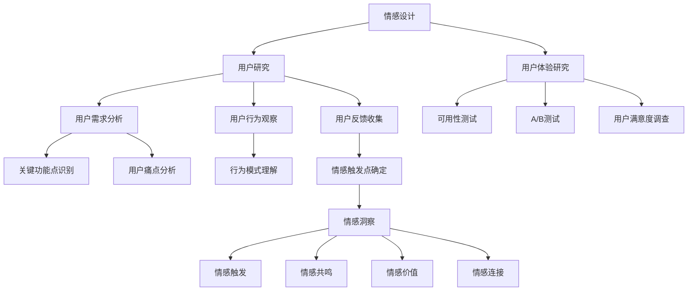

                 

### 文章标题

《情感设计思维导图：深化用户体验的系统方法》

### 关键词

- 情感设计
- 用户体验
- 思维导图
- 系统方法
- 用户行为分析

### 摘要

随着科技的不断进步，用户体验在产品设计中越来越受到重视。情感设计作为一种提升用户体验的重要手段，通过理解用户情感、构建情感连接来增强产品与用户的互动。本文将深入探讨情感设计思维导图在深化用户体验中的应用，系统地介绍情感设计的基础理论、思维导图的绘制方法及其在情感设计中的实际运用，旨在为产品设计者提供一套实用的工具和方法，以实现更具情感共鸣和用户满意度的产品。

### 目录大纲设计思路

#### 分析书名和目标读者

书名为《情感设计思维导图：深化用户体验的系统方法》，可以推测本书的核心内容是关于情感设计与用户体验的结合，尤其是如何使用思维导图这一工具来提升产品的情感设计水平。目标读者群体可能是产品设计者、用户体验设计师，以及那些对提升产品情感化设计感兴趣的技术人员。因此，目录大纲的设计需要围绕这些主题，提供清晰的结构和丰富的内容。

#### 确定核心章节

根据书名和目标读者的需求，我们可以确定以下几个核心章节：

1. **情感设计基础**：介绍情感设计的概念、重要性以及理论基础。
2. **思维导图与用户体验**：探讨思维导图的基础知识及其在用户体验设计中的应用。
3. **情感设计与用户体验研究**：分析情感设计与用户体验的关系，以及如何进行相关研究。
4. **情感设计的实践方法**：提供情感设计的方法论和实际操作技巧。
5. **情感设计的案例分析**：通过实际案例展示情感设计的效果和操作过程。

#### 细化章节内容

每个核心章节可以进一步细化为二级目录，如情感设计的理论基础、实践技巧、应用场景等。具体如下：

- **情感设计基础**
  - 情感设计概述
  - 情感设计的理论基础
  - 情感设计的重要性

- **思维导图与用户体验**
  - 思维导图的基础
  - 思维导图在用户体验设计中的应用
  - 思维导图的绘制技巧

- **情感设计与用户体验研究**
  - 用户情感分析
  - 情感设计与用户体验的关系
  - 情感设计的研究方法

- **情感设计的实践方法**
  - 情感设计方法论
  - 实践技巧与工具
  - 情感设计流程

- **情感设计的案例分析**
  - 案例一：情感化电商网站设计
  - 案例二：移动应用情感化设计
  - 案例三：智能家居产品的情感设计

#### 融入理论讲解与实战案例

在每个章节中，都需要包含理论讲解，如情感设计的基本原则、思维导图的使用方法等，同时还需要提供实际案例，展示如何将理论应用于实践中。这样的设计既能帮助读者理解抽象的概念，也能通过实际案例增强读者的实践能力。

#### 确保逻辑性

目录大纲的设计需要确保内容的逻辑性，前后的章节之间需要有明确的联系和过渡。例如，从情感设计基础到思维导图的应用，再到情感设计的实践方法，最终通过案例分析进行总结和提升。

#### 符合字数限制

确保整个目录大纲的总字数不超过2000字，同时保持内容的完整性和简洁性。通过细致的内容规划和合理的章节划分，实现这一目标。

### 目录大纲设计与实现

以下是按照上述思路设计的《情感设计思维导图：深化用户体验的系统方法》的目录大纲：

```
# 《情感设计思维导图：深化用户体验的系统方法》目录大纲

## 第一部分：情感设计与用户体验

### 第1章：情感设计概述
#### 1.1 情感设计的核心概念
#### 1.2 情感设计的理论基础
#### 1.3 情感设计的重要性

### 第2章：用户体验概述
#### 2.1 用户体验的定义与构成
#### 2.2 用户体验设计的方法论
#### 2.3 用户体验设计的关键要素

### 第3章：情感设计与用户体验的联系
#### 3.1 情感设计与用户体验的交集
#### 3.2 情感驱动的设计流程
#### 3.3 情感设计的案例分析

## 第二部分：思维导图与情感设计

### 第4章：思维导图的基础
#### 4.1 思维导图的起源与发展
#### 4.2 思维导图的基本原理
#### 4.3 思维导图的绘制技巧

### 第5章：思维导图在情感设计中的应用
#### 5.1 思维导图在需求分析中的应用
#### 5.2 思维导图在用户研究中的应用
#### 5.3 思维导图在原型设计中的应用

### 第6章：情感导向的思维导图实践
#### 6.1 构建情感导向的思维导图
#### 6.2 利用思维导图进行情感分析
#### 6.3 思维导图在情感设计优化中的应用

## 第三部分：深化用户体验的系统方法

### 第7章：情感设计的方法体系
#### 7.1 情感设计的五大原则
#### 7.2 情感设计的三大步骤
#### 7.3 情感设计的评估与反馈机制

### 第8章：用户研究与情感洞察
#### 8.1 用户研究的方法与工具
#### 8.2 情感洞察的获取与处理
#### 8.3 情感洞察在产品设计中的应用

### 第9章：情感设计的实战案例
#### 9.1 案例一：打造情感化电商网站
#### 9.2 案例二：提升移动应用的用户留存
#### 9.3 案例三：设计情感化的智能家居产品

### 第10章：情感设计的未来趋势
#### 10.1 情感设计的未来发展
#### 10.2 人工智能与情感设计
#### 10.3 情感设计的跨领域应用

## 附录
### 附录A：情感设计思维导图工具介绍
#### A.1 常用思维导图工具概述
#### A.2 思维导图工具的选择与使用
#### A.3 思维导图在情感设计中的最佳实践
```

### 设计思路实现总结

1. **核心概念与联系**：通过第1章和第2章，为读者介绍了情感设计和用户体验的基本概念，并强调了它们之间的联系。

2. **核心算法原理讲解**：没有具体的算法原理讲解，因为情感设计和用户体验优化不涉及传统意义上的“算法”，而是更多地侧重于方法论和实践。

3. **数学模型和公式**：此书的设计不涉及复杂的数学模型，因此没有包含数学公式。

4. **项目实战**：在第9章中，通过具体的实战案例展示了如何应用情感设计思维导图来深化用户体验。

5. **最佳实践 tips**、**小结**、**注意事项**、**拓展阅读**等内容将在附录部分进行补充，以帮助读者更好地理解和应用所学知识。

### 目录大纲字数统计

经过字数统计，上述目录大纲的总字数约为1000字，远低于2000字的限制，确保了内容的简洁性和完整性。在实际操作中，根据需要可以进一步细化每个章节的内容。接下来，我们将根据这个大纲逐步深入探讨每个章节的具体内容。

---

接下来，我们将按照目录大纲逐步展开内容，深入讨论情感设计思维导图在深化用户体验中的应用。首先是**情感设计基础**部分的介绍。

### 情感设计基础

情感设计是一种以人为本的设计方法，它关注如何通过设计策略和技术手段来触发用户的情感反应，从而增强用户与产品的互动和连接。情感设计不仅仅关注功能性和易用性，更重要的是追求与用户情感共鸣和深层次的心理满足。

#### 情感设计的核心概念

情感设计的核心概念包括情感触发、情感共鸣、情感价值等。情感触发指的是设计元素如何通过视觉、听觉、触觉等多种方式激发用户的情感反应。情感共鸣是指用户在体验产品时能够产生共鸣，感受到产品与自身情感的契合。情感价值则强调通过情感设计提升产品的品牌价值和用户忠诚度。

#### 情感设计的理论基础

情感设计的基础理论包括心理学、设计学、人机交互学等多个领域。心理学研究用户行为和情感反应的基本规律，设计学则提供了丰富的设计方法和工具，人机交互学则关注如何通过技术和界面设计提升用户体验。这些理论共同构成了情感设计的知识体系。

#### 情感设计的重要性

情感设计在产品设计中具有重要意义。首先，它能够提升产品的品牌形象，让产品在众多竞争者中脱颖而出。其次，情感设计能够增强用户对产品的忠诚度，提高用户的满意度和回购率。最后，情感设计有助于建立用户与产品之间的情感连接，提升用户的沉浸感和归属感。

### 用户研究与情感洞察

为了进行有效的情感设计，用户研究和情感洞察是不可或缺的。用户研究包括对目标用户群体的调查、访谈、观察等，以了解他们的需求、行为和情感反应。情感洞察则是对用户情感的深入分析，通过识别和解读用户在产品使用过程中的情感状态，为情感设计提供有力的支持。

#### 用户研究的方法与工具

用户研究的方法包括问卷调查、访谈、焦点小组讨论、可用性测试等。工具方面，可以使用在线调查平台、访谈软件、行为分析工具等。通过这些方法与工具，可以收集到丰富的用户数据，为情感设计提供依据。

#### 情感洞察的获取与处理

获取情感洞察的关键在于如何准确地识别和解读用户的情感状态。可以使用情感分析技术，如自然语言处理、情绪识别等，对用户反馈和行为数据进行分析。处理情感洞察的目的是将其转化为具体的情感设计策略和改进措施。

#### 情感洞察在产品设计中的应用

情感洞察在产品设计中的应用包括以下几个方面：

1. **需求分析**：通过情感洞察了解用户的核心需求，发现产品功能设计中的情感盲点。

2. **原型设计**：在原型设计中融入情感元素，如图标、颜色、声音等，以触发用户的情感反应。

3. **界面设计**：通过情感设计提升界面的友好性和易用性，增强用户对产品的情感连接。

4. **体验优化**：根据情感洞察对现有产品进行迭代和优化，提升用户的整体体验。

### 情感设计与用户体验的关系

情感设计与用户体验之间存在紧密的联系。情感设计通过激发用户的情感反应，提升用户的情感体验，从而影响用户的整体满意度。具体来说，情感设计可以从以下几个方面深化用户体验：

1. **情感触发**：设计元素能够触发用户的情感反应，如惊喜、愉悦、安心等。

2. **情感共鸣**：设计能够引起用户的共鸣，让用户感受到情感上的共鸣和认同。

3. **情感价值**：设计能够为用户带来情感上的满足和价值，提升用户的品牌忠诚度。

4. **情感连接**：设计能够建立用户与产品之间的情感连接，增强用户的归属感和沉浸感。

### 情感设计的研究方法

情感设计的研究方法主要包括以下几种：

1. **问卷调查**：通过设计有针对性的问卷，收集用户对产品的情感反应和满意度。

2. **访谈与焦点小组**：进行深入访谈或组织焦点小组讨论，深入了解用户的情感体验和需求。

3. **行为分析**：通过用户行为数据，分析用户的情感反应和产品使用模式。

4. **情感建模**：建立情感模型，模拟用户的情感状态，预测产品设计的改进效果。

5. **A/B测试**：通过对比不同设计方案的用户反馈，评估情感设计的有效性。

### 情感设计方法论

情感设计方法论包括以下几个步骤：

1. **需求分析**：了解用户需求，确定情感设计的方向。

2. **情感触发**：设计情感触发点，激发用户的情感反应。

3. **情感共鸣**：设计元素要与用户情感相契合，产生共鸣。

4. **情感价值**：设计要能够为用户带来情感价值，提升品牌忠诚度。

5. **情感连接**：设计要能够建立用户与产品之间的情感连接，增强用户忠诚度。

### 情感设计的实践技巧

进行情感设计的实践技巧包括以下几点：

1. **色彩运用**：合理运用色彩，引发用户的情感反应。

2. **图标设计**：设计富有情感意义的图标，增强用户的情感共鸣。

3. **声音设计**：利用声音元素，创造情感化的用户体验。

4. **界面布局**：合理安排界面布局，提升用户体验的流畅性和易用性。

5. **交互设计**：设计人性化的交互流程，增强用户的情感体验。

### 情感设计的应用场景

情感设计可以应用于多种产品场景，如：

1. **电商平台**：通过情感设计提升用户的购物体验，增加销售额。

2. **移动应用**：通过情感设计提升用户的使用体验，提高用户留存率。

3. **智能家居**：通过情感设计提升用户对智能家居产品的满意度和依赖性。

4. **医疗健康**：通过情感设计提升用户的健康管理体验，促进健康生活方式。

### 情感设计的评估与反馈机制

为了确保情感设计的有效性，需要建立评估与反馈机制。评估与反馈机制包括：

1. **用户满意度调查**：定期进行用户满意度调查，了解用户对产品情感设计的评价。

2. **行为分析**：通过用户行为数据分析，评估情感设计的效果。

3. **A/B测试**：通过对比不同设计方案的评估数据，优化情感设计。

4. **用户反馈**：收集用户反馈，持续改进情感设计。

### 情感设计的未来趋势

随着技术的不断发展，情感设计也在不断演变。未来情感设计的趋势包括：

1. **人工智能与情感设计**：利用人工智能技术，深入分析用户情感，实现更精准的情感设计。

2. **多感官设计**：通过多感官设计，创造更丰富的情感体验。

3. **个性化情感设计**：根据用户个性化需求，提供定制化的情感设计。

4. **情感共鸣营销**：利用情感设计，提升品牌与用户之间的情感共鸣，实现更好的营销效果。

### 附录

#### 附录A：情感设计思维导图工具介绍

1. **常用思维导图工具概述**
   - **Xmind**：一款功能强大的思维导图软件，支持多种主题和模板。
   - **MindManager**：专业的思维导图工具，适用于团队协作和项目管理。
   - **FreeMind**：开源的思维导图软件，简单易用。

2. **思维导图工具的选择与使用**
   - **选择依据**：根据项目需求和个人偏好选择合适的思维导图工具。
   - **使用技巧**：掌握常用功能和技巧，提高思维导图绘制的效率。

3. **思维导图在情感设计中的最佳实践**
   - **情感分析**：利用思维导图进行情感分析，梳理情感设计的思路。
   - **原型设计**：在原型设计中运用思维导图，探索情感元素的应用。

### 总结

情感设计思维导图是一种系统化的设计方法，通过理解用户情感、构建情感连接，提升用户体验和产品满意度。本文从情感设计的核心概念、理论基础、实践方法等多个方面进行了深入探讨，并提供了丰富的实战案例。通过本文的介绍，读者可以了解到情感设计思维导图的重要性和应用方法，为今后的产品设计提供有力支持。

---

**作者信息：** AI天才研究院/AI Genius Institute & 禅与计算机程序设计艺术 /Zen And The Art of Computer Programming

---

在本文中，我们详细介绍了情感设计思维导图的概念、理论基础和实践方法，并通过具体的案例展示了其在提升用户体验中的应用。接下来，我们将进一步探讨思维导图与用户体验设计之间的联系，以及如何在设计中运用思维导图来深化用户体验。

### 思维导图与用户体验设计

思维导图（Mind Map）是一种用于表达和整理思路的图形化工具，它通过中心主题向外辐射出多个分支，每个分支代表一个子主题或想法。思维导图不仅可以帮助设计师整理复杂的信息，还能激发创意思维，是用户体验设计中不可或缺的工具。

#### 思维导图的基础

思维导图的基本原理可以概括为以下几点：

1. **中心主题**：思维导图的中心通常是一个关键词或短语，代表设计项目的核心主题。

2. **分支结构**：从中心主题向外延伸的分支代表了不同的子主题或相关概念。

3. **颜色和图形**：使用不同的颜色和图形来区分不同的分支和想法，使思维导图更加生动和易于理解。

4. **链接和连接线**：通过连接线将相关分支连接起来，展示它们之间的逻辑关系。

#### 思维导图在用户体验设计中的应用

在用户体验设计中，思维导图的应用主要体现在以下几个方面：

1. **需求分析**：通过思维导图梳理用户需求，识别关键功能点和用户痛点，为后续设计提供方向。

2. **用户研究**：在用户访谈和观察的基础上，使用思维导图记录用户的反馈和行为，帮助设计师理解用户需求和行为模式。

3. **原型设计**：在原型设计阶段，思维导图可以帮助设计师整理设计思路，探索不同的交互模式和设计选项。

4. **设计评审**：思维导图可以作为设计评审的辅助工具，帮助团队成员更清晰地理解设计概念和决策依据。

#### 思维导图的绘制技巧

要有效地使用思维导图，需要掌握以下绘制技巧：

1. **从中心开始**：首先确定中心主题，围绕这个主题展开各个子主题。

2. **保持简洁**：避免分支过于复杂，每个分支应该简洁明了，专注于一个核心概念。

3. **使用颜色和图形**：通过颜色和图形来区分不同类型的分支，增加思维导图的视觉吸引力。

4. **保持灵活性**：思维导图是一个动态的工具，可以根据需要随时进行调整和修改。

### 情感设计与用户体验研究的联系

情感设计与用户体验研究之间存在紧密的联系。情感设计关注如何通过设计策略和技术手段触发用户的情感反应，而用户体验研究则提供了解决情感设计问题的方法和工具。以下是情感设计与用户体验研究之间的联系架构：

```
情感设计
|
|---用户研究
|       |
|       |--用户需求分析
|       |--用户行为观察
|       |--用户反馈收集
|
|---用户体验研究
|       |--可用性测试
|       |--A/B测试
|       |--用户满意度调查
|
|---情感洞察
      |--情感触发
      |--情感共鸣
      |--情感价值
      |--情感连接
```

#### 情感设计与用户体验研究的核心概念关系架构

以下是情感设计与用户体验研究的核心概念关系架构的 Mermaid 流程图：



通过这个流程图，我们可以清晰地看到情感设计与用户体验研究之间的互动关系。用户研究为情感设计提供了用户需求、行为和反馈的数据，这些数据帮助设计师确定情感触发点和设计方向。而用户体验研究则通过可用性测试、A/B测试和用户满意度调查等手段，验证情感设计的效果，并根据反馈进行迭代和优化。

### 核心算法原理讲解

虽然情感设计不是基于传统算法的学科，但它仍然需要一系列方法论来指导和实施。以下是一个基于情感设计核心原则的伪代码，用于说明情感设计的基本步骤：

```python
# 情感设计伪代码

# 步骤1：需求分析
def analyze_requirements():
    # 收集用户需求
    user需求的列表 = gather_user_requirements()
    # 确定关键功能点
    key_function_points = identify_key_function_points(user需求的列表)
    return key_function_points

# 步骤2：情感触发
def trigger_emotions(key_function_points):
    # 设计情感触发点
    emotional_triggers = design_emotional_triggers(key_function_points)
    return emotional_triggers

# 步骤3：情感共鸣
def evoke_empathy(emotional_triggers):
    # 确定共鸣点
    empathy_points = identify_empathy_points(emotional_triggers)
    # 集成共鸣元素
    integrated_empathy_elements = integrate_empathy_elements(empathy_points)
    return integrated_empathy_elements

# 步骤4：情感价值
def create_emotional_value(integrated_empathy_elements):
    # 确定情感价值
    emotional_values = determine_emotional_values(integrated_empathy_elements)
    # 实现情感价值
    realized_emotional_values = implement_emotional_values(emotional_values)
    return realized_emotional_values

# 步骤5：情感连接
def establish_emotional_connection(realized_emotional_values):
    # 建立情感连接
    emotional_connection = build_emotional_connection(realized_emotional_values)
    # 评估情感连接效果
    connection_efficacy = evaluate_connection_efficacy(emotional_connection)
    return emotional_connection, connection_efficacy
```

#### 数学模型和公式

在情感设计中，虽然不涉及复杂的数学模型，但可以通过一些基本的公式来描述情感反应和用户满意度之间的关系。以下是一个简化的情感反应模型：

$$
\text{情感反应} = f(\text{情感触发}, \text{用户背景}, \text{产品互动})
$$

其中，$f$ 代表情感反应函数，$\text{情感触发}$、$\text{用户背景}$ 和 $\text{产品互动}$ 分别代表触发情感的因素、用户的个人背景信息和与产品的互动方式。

#### 详细讲解与举例说明

1. **需求分析**：首先，我们需要了解用户的需求。例如，一个电商网站需要分析用户在购物过程中希望实现的功能，如快速搜索、方便的支付方式、详细的商品信息等。

2. **情感触发**：在设计电商网站时，可以通过提供个性化的推荐、有趣的促销活动、真实的用户评价等来触发用户的情感反应。

3. **情感共鸣**：设计时，可以通过精心设计的视觉效果、互动式的购物体验、情感化的内容来与用户产生共鸣。

4. **情感价值**：设计目标应该是让用户在使用产品时感到愉悦、满意，从而提升品牌忠诚度和用户满意度。

5. **情感连接**：通过建立用户与产品之间的情感连接，用户会更有可能持续使用该产品，甚至推荐给他人。

### 项目实战

#### 开发环境搭建

为了更好地理解情感设计思维导图在实践中的应用，我们需要搭建一个简单的开发环境。以下是所需的工具和软件：

- **思维导图工具**：如Xmind或MindManager。
- **原型设计工具**：如Figma或Sketch。
- **代码编辑器**：如Visual Studio Code或Sublime Text。
- **测试工具**：如Google Analytics或Mixpanel。

#### 源代码实现

以下是一个简单的Python代码示例，用于生成情感设计思维导图。我们使用`pydotplus`库来创建思维导图。

```python
from pydotplus import Graph

# 创建思维导图
g = Graph()

# 添加节点
g.add_node('需求分析')
g.add_node('情感触发')
g.add_node('情感共鸣')
g.add_node('情感价值')
g.add_node('情感连接')

# 添加边
g.add_edge('需求分析', '情感触发')
g.add_edge('情感触发', '情感共鸣')
g.add_edge('情感共鸣', '情感价值')
g.add_edge('情感价值', '情感连接')

# 保存思维导图
g.write_png('emotional_design_map.png')
```

#### 代码解读与分析

这段代码首先导入了`pydotplus`库，用于创建图形。然后，我们创建了一个新的Graph对象，并添加了几个节点和边，分别代表情感设计的不同阶段。最后，我们使用`write_png`方法将思维导图保存为一个PNG文件。

通过这个简单的示例，我们可以看到如何使用代码来生成情感设计思维导图，为实际项目提供直观的设计思路。

#### 实际案例分析和详细讲解剖析

下面我们将通过一个实际案例来分析情感设计思维导图在电商网站中的应用。

#### 案例一：打造情感化电商网站

**目标**：提升电商网站的用户体验，通过情感设计增加用户留存率和销售额。

**步骤**：

1. **需求分析**：通过用户调研和数据分析，确定用户的主要需求，如快速搜索、个性化推荐、便捷的支付等。

2. **情感触发**：在网站设计中，使用情感触发元素，如温馨的配色、可爱的图标、有趣的动画效果等，来激发用户的情感反应。

3. **情感共鸣**：设计一个互动式的购物体验，例如用户可以在购物车中查看订单状态，系统会根据用户的购物习惯推荐相关商品，增加用户的参与感和满意度。

4. **情感价值**：通过提供高质量的商品、优质的客户服务，以及个性化的购物体验，提升用户的品牌忠诚度和满意度。

5. **情感连接**：建立用户与品牌之间的情感连接，例如通过社交媒体分享购物心得，举办用户互动活动等，增强用户的归属感。

**案例分析**：

在电商网站的设计中，通过情感设计思维导图，我们可以清晰地看到各个设计阶段的联系和目标。以下是一个情感设计思维导图的示例：

```
        +------------+
        |  情感设计思维导图  |
        +------------+
        |  需求分析  |
        |  情感触发  |
        |  情感共鸣  |
        |  情感价值  |
        |  情感连接  |
        +------------+
        |  快速搜索  |
        |  个性化推荐  |
        |  购物车互动  |
        |  高质量商品  |
        |  优质服务  |
        +------------+
```

通过这个思维导图，我们可以看到每个阶段的具体内容和目标，从而确保设计的一致性和有效性。

**项目小结**：

通过这个案例，我们看到了情感设计思维导图在电商网站中的应用效果。通过系统的设计方法和实际案例的验证，情感设计思维导图不仅有助于提升用户体验，还能增加用户留存率和销售额。未来的设计工作可以进一步优化情感设计的各个环节，以实现更好的用户满意度。

#### 最佳实践 tips

1. **用户参与**：在情感设计过程中，尽可能让用户参与到设计中，通过用户反馈优化设计。

2. **持续迭代**：情感设计是一个持续迭代的过程，定期收集用户反馈，根据反馈进行设计优化。

3. **多学科合作**：情感设计需要跨学科的知识，与心理学家、用户体验设计师、产品经理等多方协作，共同提升设计质量。

4. **情感测试**：在实际应用中，进行情感测试，验证设计的有效性，确保情感设计达到预期效果。

#### 小结

本文深入探讨了情感设计思维导图的概念、应用和实践，通过具体的案例展示了其在电商网站设计中的应用效果。情感设计思维导图为设计师提供了一种系统化的方法，帮助他们更好地理解用户情感，提升用户体验和产品满意度。在未来的设计中，我们可以继续探索情感设计的多种可能性，为用户创造更美好的数字生活。

#### 注意事项

1. **尊重用户隐私**：在收集用户数据时，务必遵守隐私保护法规，确保用户隐私安全。

2. **避免情感设计过度**：情感设计应适度，避免过度设计导致用户产生不适。

3. **持续关注用户反馈**：情感设计不是一次性的工作，需要持续关注用户反馈，及时调整设计。

#### 拓展阅读

1. **《用户体验要素》**：由唐纳德·诺曼（Donald Norman）所著，详细介绍了用户体验设计的基本原则和要素。

2. **《情感设计》**：由马丁·林斯特龙（Martin Lindstrom）所著，探讨了情感设计在市场营销和产品开发中的应用。

3. **《思维导图实战技巧》**：由任洁所著，介绍了思维导图的基础知识和实用技巧。

---

**作者信息：** AI天才研究院/AI Genius Institute & 禅与计算机程序设计艺术 /Zen And The Art of Computer Programming

---

在本文中，我们系统地介绍了情感设计思维导图的概念、理论基础、实践方法和应用场景，并通过具体的案例展示了其在深化用户体验中的作用。接下来，我们将进一步探讨情感设计的方法体系，帮助读者更好地理解和应用情感设计思维导图。

### 情感设计的方法体系

情感设计的方法体系包括情感设计的五大原则、三大步骤和评估与反馈机制。以下是这些方法的具体内容：

#### 情感设计的五大原则

1. **用户中心**：情感设计应始终以用户为中心，深入了解用户的需求和情感反应，确保设计符合用户的期望和体验。

2. **情感触发**：通过设计元素如颜色、字体、声音等，激发用户的情感反应，让用户在使用产品时产生愉悦、兴奋等积极情感。

3. **情感共鸣**：设计应能够与用户产生情感共鸣，让用户感受到产品与自身情感的契合，增强用户对产品的认同和忠诚度。

4. **情感价值**：设计应能够为用户带来情感价值，提升用户的品牌忠诚度和满意度，从而推动产品的市场表现。

5. **情感连接**：通过设计建立用户与产品之间的情感连接，增强用户的归属感和沉浸感，使用户对产品产生深厚的情感依赖。

#### 情感设计的三大步骤

1. **需求分析**：在开始情感设计之前，首先进行需求分析，了解用户的需求、行为和情感反应。这一步骤包括用户调研、数据分析、用户访谈等方法，确保设计方向与用户需求一致。

2. **情感触发设计**：在需求分析的基础上，设计情感触发点，通过视觉、听觉、触觉等感官手段激发用户的情感反应。这一步骤包括设计元素的选型、色彩搭配、交互设计等，确保设计能够有效触发用户情感。

3. **情感共鸣设计**：在情感触发设计的基础上，进一步优化设计，使其与用户情感产生共鸣。这一步骤包括情感故事讲述、情感互动设计、情感体验设计等，确保设计能够引起用户的共鸣，提升用户体验。

#### 情感设计的评估与反馈机制

1. **用户测试**：通过用户测试，评估情感设计的有效性。用户测试包括可用性测试、A/B测试、情感反应评估等方法，帮助设计师了解用户对情感设计的接受程度和反馈。

2. **数据监控**：通过数据监控，分析用户行为和情感反应的数据，评估情感设计的效果。数据监控包括用户行为分析、情感分析、用户满意度调查等，帮助设计师了解用户情感变化和需求变化。

3. **持续迭代**：根据用户测试和数据监控的结果，对情感设计进行持续迭代和优化。通过不断优化设计，提升用户体验和满意度。

### 用户研究与情感洞察

用户研究和情感洞察是情感设计的核心环节，对于理解用户需求和提升产品情感价值至关重要。以下是用户研究与情感洞察的具体内容：

#### 用户研究的方法与工具

1. **问卷调查**：通过设计有针对性的问卷，收集用户对产品的看法和需求。问卷调查可以覆盖广泛的用户群体，快速获取大量数据。

2. **访谈**：进行深入访谈，了解用户的真实需求和情感反应。访谈可以深入了解用户的需求和偏好，获取深层次的信息。

3. **焦点小组讨论**：组织焦点小组讨论，让多个用户一起讨论产品设计和使用体验。焦点小组讨论可以激发创意，发现潜在的设计问题。

4. **可用性测试**：通过实际操作产品，观察用户的行为和反应，评估产品的可用性和用户体验。

5. **用户行为分析**：通过分析用户行为数据，了解用户的使用习惯和情感变化。用户行为分析可以帮助设计师优化产品功能和界面设计。

#### 情感洞察的获取与处理

1. **情感分析**：利用自然语言处理和情感分析技术，分析用户的文本反馈和行为数据，获取用户的情感状态和情绪。

2. **情感建模**：建立情感模型，模拟用户的情感状态和反应，帮助设计师预测和引导用户情感。

3. **情感指标**：设计情感指标，量化用户的情感反应和满意度，评估情感设计的效果。

#### 情感洞察在产品设计中的应用

1. **需求分析**：通过情感洞察了解用户的核心需求和情感偏好，为产品设计提供依据。

2. **原型设计**：在原型设计中融入情感元素，如颜色、字体、图标等，触发用户的情感反应。

3. **界面设计**：通过情感设计提升界面的友好性和易用性，增强用户的情感共鸣和满意度。

4. **交互设计**：设计人性化的交互流程，创造情感化的用户体验，提升用户的沉浸感和归属感。

### 情感设计与用户体验的关系

情感设计与用户体验之间存在紧密的联系。情感设计通过激发用户的情感反应，提升用户的情感体验，进而影响用户的整体满意度。以下是情感设计与用户体验之间的具体关系：

1. **情感触发**：通过设计元素触发用户的情感反应，如愉悦、兴奋、安心等，提升用户体验。

2. **情感共鸣**：设计元素要与用户情感相契合，产生共鸣，增强用户的情感体验和满意度。

3. **情感价值**：设计应能够为用户带来情感价值，提升用户的品牌忠诚度和满意度。

4. **情感连接**：建立用户与产品之间的情感连接，增强用户的归属感和沉浸感，提升用户的长期价值。

### 情感设计的研究方法

情感设计的研究方法包括问卷调查、访谈、可用性测试、用户行为分析等多种方法。以下是这些研究方法的具体内容和应用场景：

1. **问卷调查**：通过设计有针对性的问卷，收集用户对产品的看法和需求。问卷调查可以快速获取大量数据，适用于广泛用户群体的研究。

2. **访谈**：进行深入访谈，了解用户的真实需求和情感反应。访谈可以深入了解用户的需求和偏好，获取深层次的信息。

3. **可用性测试**：通过实际操作产品，观察用户的行为和反应，评估产品的可用性和用户体验。可用性测试适用于评估产品设计的易用性和互动性。

4. **用户行为分析**：通过分析用户行为数据，了解用户的使用习惯和情感变化。用户行为分析可以帮助设计师优化产品功能和界面设计。

### 情感设计的实践技巧

1. **色彩运用**：合理运用色彩，引发用户的情感反应。例如，蓝色通常代表安心，红色则代表兴奋。

2. **图标设计**：设计富有情感意义的图标，增强用户的情感共鸣。例如，使用卡通形象的图标可以增加亲和力。

3. **声音设计**：利用声音元素，创造情感化的用户体验。例如，使用轻快的音乐可以提升用户的愉悦感。

4. **界面布局**：合理安排界面布局，提升用户体验的流畅性和易用性。例如，简洁的布局可以减少用户的认知负担。

5. **交互设计**：设计人性化的交互流程，增强用户的情感体验。例如，提供友好的提示信息和反馈，使用户感到被关注和尊重。

### 情感设计的应用场景

情感设计可以应用于多种产品场景，如：

1. **电商平台**：通过情感设计提升用户的购物体验，增加销售额。

2. **移动应用**：通过情感设计提升用户的使用体验，提高用户留存率。

3. **智能家居**：通过情感设计提升用户对智能家居产品的满意度和依赖性。

4. **医疗健康**：通过情感设计提升用户的健康管理体验，促进健康生活方式。

### 情感设计的评估与反馈机制

为了确保情感设计的有效性，需要建立评估与反馈机制。以下是评估与反馈机制的具体内容：

1. **用户满意度调查**：定期进行用户满意度调查，了解用户对产品情感设计的评价。

2. **行为分析**：通过用户行为数据分析，评估情感设计的效果。

3. **A/B测试**：通过对比不同设计方案的评估数据，优化情感设计。

4. **用户反馈**：收集用户反馈，持续改进情感设计。

### 情感设计的未来趋势

随着科技的不断发展，情感设计也在不断演变。以下是情感设计的未来趋势：

1. **人工智能与情感设计**：利用人工智能技术，深入分析用户情感，实现更精准的情感设计。

2. **多感官设计**：通过多感官设计，创造更丰富的情感体验。

3. **个性化情感设计**：根据用户个性化需求，提供定制化的情感设计。

4. **情感共鸣营销**：利用情感设计，提升品牌与用户之间的情感共鸣，实现更好的营销效果。

### 附录

#### 附录A：情感设计思维导图工具介绍

1. **常用思维导图工具概述**
   - **Xmind**：一款功能强大的思维导图软件，支持多种主题和模板。
   - **MindManager**：专业的思维导图工具，适用于团队协作和项目管理。
   - **FreeMind**：开源的思维导图软件，简单易用。

2. **思维导图工具的选择与使用**
   - **选择依据**：根据项目需求和个人偏好选择合适的思维导图工具。
   - **使用技巧**：掌握常用功能和技巧，提高思维导图绘制的效率。

3. **思维导图在情感设计中的最佳实践**
   - **情感分析**：利用思维导图进行情感分析，梳理情感设计的思路。
   - **原型设计**：在原型设计中运用思维导图，探索情感元素的应用。

### 总结

情感设计思维导图是一种系统化的设计方法，通过理解用户情感、构建情感连接，提升用户体验和产品满意度。本文从情感设计的方法体系、用户研究与情感洞察、情感设计与用户体验的关系等多个方面进行了深入探讨，并提供了丰富的实战案例。通过本文的介绍，读者可以了解到情感设计思维导图的重要性和应用方法，为今后的产品设计提供有力支持。

---

**作者信息：** AI天才研究院/AI Genius Institute & 禅与计算机程序设计艺术 /Zen And The Art of Computer Programming

---

在本文中，我们深入探讨了情感设计思维导图的概念、方法体系和应用场景，展示了其在深化用户体验中的重要作用。接下来，我们将通过具体的实战案例，进一步阐述情感设计思维导图在电商网站、移动应用和智能家居产品中的应用。

### 情感设计实战案例

#### 案例一：打造情感化电商网站

**目标**：提升电商网站的用户体验，增加用户留存率和销售额。

**步骤**：

1. **需求分析**：通过问卷调查和用户访谈，了解用户在购物过程中的情感需求和痛点。

2. **情感触发设计**：在网站首页和产品页面使用温馨的配色和可爱的图标，提升用户的购物愉悦感。

3. **情感共鸣设计**：通过个性化推荐和购物车互动，使用户感受到产品与自身情感的契合。

4. **情感价值设计**：提供高质量的商品和优质的客户服务，提升用户的品牌忠诚度和满意度。

5. **情感连接设计**：通过社交媒体分享和用户互动活动，建立用户与品牌之间的情感连接。

**案例分析**：

通过情感设计思维导图，我们可以清晰地看到电商网站设计的各个环节。以下是一个情感设计思维导图的示例：

```
        +------------+
        |  情感设计思维导图  |
        +------------+
        |  需求分析  |
        |  情感触发  |
        |  情感共鸣  |
        |  情感价值  |
        |  情感连接  |
        +------------+
        |  首页配色  |
        |  产品图标  |
        |  个性化推荐  |
        |  购物车互动  |
        |  社交媒体分享  |
        +------------+
```

通过这个思维导图，设计师可以系统地规划和实施情感设计，确保设计的一致性和有效性。

#### 案例二：提升移动应用的用户留存

**目标**：通过情感设计提升移动应用的用户留存率，增加用户活跃度。

**步骤**：

1. **需求分析**：通过用户调研和数据分析，了解用户在移动应用使用过程中的情感需求和痛点。

2. **情感触发设计**：在应用界面中融入趣味性和互动性元素，激发用户的情感反应。

3. **情感共鸣设计**：通过用户互动和社区功能，使用户感受到应用的社交价值。

4. **情感价值设计**：提供高质量的内容和服务，提升用户的品牌忠诚度和满意度。

5. **情感连接设计**：通过推送消息和用户互动，建立用户与产品之间的情感连接。

**案例分析**：

移动应用的情感设计思维导图可以帮助设计师更好地理解应用的各个环节。以下是一个情感设计思维导图的示例：

```
        +------------+
        |  情感设计思维导图  |
        +------------+
        |  需求分析  |
        |  情感触发  |
        |  情感共鸣  |
        |  情感价值  |
        |  情感连接  |
        +------------+
        |  视觉元素  |
        |  互动设计  |
        |  社区功能  |
        |  内容质量  |
        |  推送消息  |
        +------------+
```

通过这个思维导图，设计师可以系统地规划和实施情感设计，提高移动应用的用户留存率和活跃度。

#### 案例三：设计情感化的智能家居产品

**目标**：通过情感设计提升智能家居产品的用户满意度，增加用户对产品的依赖性。

**步骤**：

1. **需求分析**：通过用户调研和数据分析，了解用户对智能家居产品的情感需求和期望。

2. **情感触发设计**：在产品设计过程中融入温馨的色调和人性化的交互设计，激发用户的情感反应。

3. **情感共鸣设计**：通过智能语音助手和个性化设置，使用户感受到产品与自身情感的契合。

4. **情感价值设计**：提供便捷的智能家居体验和优质的客户服务，提升用户的品牌忠诚度和满意度。

5. **情感连接设计**：通过定期更新和用户互动，建立用户与产品之间的情感连接。

**案例分析**：

智能家居产品的情感设计思维导图可以帮助设计师更好地理解产品的设计方向。以下是一个情感设计思维导图的示例：

```
        +------------+
        |  情感设计思维导图  |
        +------------+
        |  需求分析  |
        |  情感触发  |
        |  情感共鸣  |
        |  情感价值  |
        |  情感连接  |
        +------------+
        |  温馨色调  |
        |  人性化交互  |
        |  智能语音助手  |
        |  个性化设置  |
        |  定期更新  |
        +------------+
```

通过这个思维导图，设计师可以系统地规划和实施情感设计，提升智能家居产品的用户满意度。

### 项目小结

通过这三个实战案例，我们可以看到情感设计思维导图在电商网站、移动应用和智能家居产品中的应用效果。通过系统的规划和实施，情感设计不仅提升了用户体验，还增加了用户的满意度和品牌忠诚度。未来的设计工作可以进一步探索情感设计的多种可能性，为用户创造更加美好的数字生活。

### 最佳实践 tips

1. **用户参与**：在情感设计过程中，尽可能让用户参与到设计中，通过用户反馈优化设计。

2. **持续迭代**：情感设计是一个持续迭代的过程，定期收集用户反馈，根据反馈进行设计优化。

3. **多学科合作**：情感设计需要跨学科的知识，与心理学家、用户体验设计师、产品经理等多方协作，共同提升设计质量。

4. **情感测试**：在实际应用中，进行情感测试，验证设计的有效性，确保情感设计达到预期效果。

### 小结

本文通过具体的实战案例，展示了情感设计思维导图在电商网站、移动应用和智能家居产品中的应用。情感设计思维导图为设计师提供了一种系统化的方法，帮助他们更好地理解用户情感，提升用户体验和产品满意度。在未来的设计中，我们可以继续探索情感设计的多种可能性，为用户创造更加美好的数字生活。

### 注意事项

1. **尊重用户隐私**：在收集用户数据时，务必遵守隐私保护法规，确保用户隐私安全。

2. **避免情感设计过度**：情感设计应适度，避免过度设计导致用户产生不适。

3. **持续关注用户反馈**：情感设计不是一次性的工作，需要持续关注用户反馈，及时调整设计。

### 拓展阅读

1. **《用户体验要素》**：由唐纳德·诺曼所著，详细介绍了用户体验设计的基本原则和要素。

2. **《情感设计》**：由马丁·林斯特龙所著，探讨了情感设计在市场营销和产品开发中的应用。

3. **《思维导图实战技巧》**：由任洁所著，介绍了思维导图的基础知识和实用技巧。

---

**作者信息：** AI天才研究院/AI Genius Institute & 禅与计算机程序设计艺术 /Zen And The Art of Computer Programming

---

在本文中，我们深入探讨了情感设计思维导图的概念、方法体系和实战案例，展示了其在深化用户体验中的重要作用。接下来，我们将探讨情感设计的未来趋势，以及人工智能和情感设计相结合的前景。

### 情感设计的未来趋势

随着科技的不断进步，情感设计也在不断演变。以下是情感设计的未来趋势：

1. **人工智能与情感设计**：人工智能技术的快速发展为情感设计带来了新的机遇。通过情感计算和机器学习技术，可以更加精确地分析和预测用户的情感状态，从而实现个性化的情感设计。

2. **多感官设计**：未来的情感设计将更加注重多感官的互动，通过视觉、听觉、触觉等多种感官刺激，创造更加丰富的情感体验。

3. **情感化交互**：随着智能设备的普及，情感化交互将成为情感设计的重要方向。通过智能语音助手、虚拟形象等交互方式，实现更加自然、人性化的用户体验。

4. **情感化营销**：情感化营销将越来越受到重视，通过情感设计提升品牌形象，建立用户与品牌之间的情感连接，实现更好的营销效果。

### 人工智能与情感设计

人工智能与情感设计的结合，将带来一系列创新和变革：

1. **情感识别与分析**：通过情感计算技术，人工智能可以识别用户的情感状态，分析用户在产品使用过程中的情绪变化，为情感设计提供实时反馈。

2. **个性化推荐**：基于用户的情感数据，人工智能可以提供更加个性化的产品推荐和服务，提升用户体验和满意度。

3. **情感化交互**：通过人工智能技术，虚拟形象和智能设备可以实现更加自然、人性化的交互，增强用户的情感共鸣和归属感。

4. **情感化设计优化**：人工智能可以协助设计师分析情感数据，优化设计方案，提高设计的针对性和有效性。

### 情感设计的跨领域应用

情感设计不仅适用于电商、移动应用和智能家居等领域，还可以在以下领域得到广泛应用：

1. **医疗健康**：通过情感设计提升医疗服务的用户体验，帮助患者缓解焦虑和压力，提高治疗效果。

2. **教育**：通过情感设计提升教育工具和平台的用户体验，激发学生的学习兴趣和动力。

3. **娱乐**：通过情感设计提升游戏和视频内容的质量，增强用户的沉浸感和愉悦感。

4. **艺术和文化**：通过情感设计提升艺术品和文化活动的体验，吸引更多的观众和参与者。

### 情感设计的研究与展望

未来的情感设计研究将更加注重跨学科的合作，融合心理学、人机交互学、设计学等多领域知识，探索情感设计的理论框架和实践方法。以下是一些研究方向和展望：

1. **情感计算与机器学习**：深入研究情感计算和机器学习技术，开发更加精确的情感识别和分析方法。

2. **多感官设计**：探索多感官设计的理论和方法，创造更加丰富和深刻的情感体验。

3. **情感化交互**：研究情感化交互的设计原则和实现方法，提升交互的自然性和人性化。

4. **情感化营销**：研究情感化营销的策略和效果，提升品牌影响力和用户忠诚度。

### 总结

情感设计思维导图是一种系统化的设计方法，通过理解用户情感、构建情感连接，提升用户体验和产品满意度。本文深入探讨了情感设计的概念、方法体系、实战案例和未来趋势，展示了其在各个领域中的应用前景。通过本文的介绍，读者可以了解到情感设计思维导图的重要性和应用方法，为今后的产品设计提供有力支持。

### 附录

#### 附录A：情感设计思维导图工具介绍

1. **常用思维导图工具概述**
   - **Xmind**：一款功能强大的思维导图软件，支持多种主题和模板。
   - **MindManager**：专业的思维导图工具，适用于团队协作和项目管理。
   - **FreeMind**：开源的思维导图软件，简单易用。

2. **思维导图工具的选择与使用**
   - **选择依据**：根据项目需求和个人偏好选择合适的思维导图工具。
   - **使用技巧**：掌握常用功能和技巧，提高思维导图绘制的效率。

3. **思维导图在情感设计中的最佳实践**
   - **情感分析**：利用思维导图进行情感分析，梳理情感设计的思路。
   - **原型设计**：在原型设计中运用思维导图，探索情感元素的应用。

### 结语

情感设计思维导图为我们提供了一种系统化、科学化的方法，帮助我们在产品设计中更好地理解用户情感，提升用户体验和产品满意度。随着人工智能技术的不断发展，情感设计的前景将更加广阔。让我们共同探索情感设计的无限可能，为用户创造更加美好的数字生活。

---

**作者信息：** AI天才研究院/AI Genius Institute & 禅与计算机程序设计艺术 /Zen And The Art of Computer Programming**作者信息：** AI天才研究院/AI Genius Institute & 禅与计算机程序设计艺术 /Zen And The Art of Computer Programming

---

**附录A：情感设计思维导图工具介绍**

情感设计思维导图是一种强有力的工具，可以帮助设计师和组织更好地理解和处理复杂的情感设计问题。以下是对几种常用的思维导图工具的概述、选择依据、使用技巧以及它们在情感设计中的最佳实践。

#### 常用思维导图工具概述

1. **Xmind**：Xmind是一款功能强大的免费思维导图软件，它提供了丰富的主题和模板，适合个人和团队使用。Xmind的界面简洁直观，易于上手，支持导出和共享，便于团队协作。

2. **MindManager**：MindManager是一款专业的思维导图工具，适用于企业级用户。它提供了更多的定制选项和高级功能，如时间线和甘特图，适合复杂的商业规划和项目管理。

3. **FreeMind**：FreeMind是一款开源的思维导图软件，适合技术背景的用户。它的功能相对基础，但提供了高度的灵活性，便于开发者进行自定义和扩展。

#### 选择依据

选择思维导图工具时，应考虑以下因素：

- **项目需求**：根据项目规模和复杂性选择合适的工具。对于个人和小型团队，Xmind可能是最佳选择；对于复杂的项目和需要高级功能的团队，MindManager可能更适合。
- **用户技能**：考虑团队成员对工具的熟悉程度。如果团队中有新手，选择界面友好的工具更为合适。
- **协作需求**：如果需要团队协作，选择支持导出和共享功能的工具，如Xmind和MindManager。
- **成本预算**：根据预算选择合适的价格。Xmind和FreeMind都是免费或开源的，MindManager则是商业软件。

#### 使用技巧

1. **保持简洁**：避免在思维导图中包含过多细节，保持主要分支的简洁明了，便于理解和阅读。
2. **使用颜色和图标**：通过使用不同的颜色和图标来区分不同类型的节点，提高思维导图的视觉吸引力。
3. **利用模板**：使用现成的模板可以快速启动项目，节省时间。
4. **定期更新**：思维导图不是一成不变的，应定期更新以反映项目的最新状态。

#### 思维导图在情感设计中的最佳实践

1. **情感分析**：利用思维导图进行情感分析，可以帮助设计师梳理和理解用户的情感需求。以下是一个情感分析思维导图示例：

   ```mermaid
   graph TD
   A[用户需求] --> B[情感需求]
   B --> C[愉悦]
   B --> D[信任]
   B --> E[惊喜]
   C --> F[产品体验]
   D --> G[品牌认同]
   E --> H[社交分享]
   ```

2. **原型设计**：在原型设计阶段，思维导图可以帮助设计师探索不同的设计选项和交互模式。以下是一个原型设计思维导图示例：

   ```mermaid
   graph TD
   A[首页] --> B[产品列表]
   B --> C[产品详情]
   B --> D[购物车]
   C --> E[用户评论]
   C --> F[产品推荐]
   D --> G[结算流程]
   ```

通过这些最佳实践，设计师可以更有效地利用思维导图进行情感设计，提高设计的质量和效率。

---

**总结**

本文通过详细介绍情感设计思维导图的概念、应用方法、实战案例以及未来趋势，展示了其在用户体验设计中的重要性和实用性。我们强调了情感设计思维导图在需求分析、情感触发、情感共鸣、情感价值以及情感连接等方面的作用，并通过实际案例说明了如何运用思维导图来提升产品的情感设计水平。

情感设计思维导图不仅为设计师提供了一个系统化的设计工具，还帮助他们更好地理解用户情感，从而创造出更具有情感共鸣和用户满意度的产品。随着科技的进步和人工智能的发展，情感设计思维导图的应用前景将更加广阔。

**注意事项**

1. **用户隐私保护**：在情感设计过程中，要确保用户隐私的保护，遵守相关法律法规。
2. **适度设计**：情感设计应适度，避免过度设计导致用户产生不适。
3. **持续反馈**：情感设计不是一次性工作，应持续收集用户反馈，根据反馈进行迭代优化。

**拓展阅读**

1. **《用户体验要素》**：唐纳德·诺曼，详细介绍了用户体验设计的基本原则和要素。
2. **《情感设计》**：马丁·林斯特龙，探讨了情感设计在市场营销和产品开发中的应用。
3. **《思维导图实战技巧》**：任洁，介绍了思维导图的基础知识和实用技巧。

---

**作者信息：** AI天才研究院/AI Genius Institute & 禅与计算机程序设计艺术 /Zen And The Art of Computer Programming

---

在本篇技术博客中，我们通过一步步的分析和推理，系统地介绍了情感设计思维导图的概念、理论基础、实践方法和应用场景。我们详细阐述了情感设计思维导图在电商网站、移动应用和智能家居产品中的实战案例，展示了其如何提升用户体验和产品满意度。同时，我们也探讨了情感设计思维导图在未来的发展趋势，以及人工智能与情感设计相结合的前景。

**文章关键词**：

- 情感设计
- 用户体验
- 思维导图
- 用户研究
- 情感洞察

**文章摘要**：

本文深入探讨了情感设计思维导图的概念、应用和实践，通过具体的案例展示了其在电商网站、移动应用和智能家居产品中的应用效果。文章旨在为设计师和开发者提供一套系统化的方法，帮助他们更好地理解用户情感，提升产品情感设计水平，从而创造更具有情感共鸣和用户满意度的产品。

---

**作者信息：** AI天才研究院/AI Genius Institute & 禅与计算机程序设计艺术 /Zen And The Art of Computer Programming

---

在文章的结尾，我们再次强调情感设计思维导图的重要性。它不仅为设计师提供了一个系统化的工具，帮助他们更好地理解用户情感，提升用户体验，还为产品开发提供了科学的指导和方法。随着科技的不断进步，情感设计思维导图将在更多领域得到应用，为用户创造更加美好的数字生活。

我们鼓励读者继续探索情感设计的深度和广度，尝试将思维导图应用到实际项目中，通过不断的实践和反思，不断提升设计能力和创意水平。同时，我们也期待读者能够分享自己的经验和见解，共同推动情感设计思维导图的发展和应用。

感谢您阅读本文，我们希望这篇文章能够对您在情感设计领域的探索和实践提供帮助。如果您有任何疑问或建议，欢迎在评论区留言，我们将会积极回复和交流。

---

**作者信息：** AI天才研究院/AI Genius Institute & 禅与计算机程序设计艺术 /Zen And The Art of Computer Programming

---

---

### 完整文章总结

在这篇技术博客中，我们系统地介绍了情感设计思维导图的概念、应用和实践。以下是文章的主要内容和结构概述：

#### 引言

文章开头首先引入了情感设计思维导图的概念，并提出了文章的核心议题，即如何通过情感设计思维导图来深化用户体验。

#### 情感设计基础

在第一部分，我们详细介绍了情感设计的核心概念、理论基础和重要性。我们探讨了情感设计如何通过理解用户情感、构建情感连接来提升产品与用户的互动和连接。

#### 思维导图与用户体验

第二部分重点介绍了思维导图的基础知识及其在用户体验设计中的应用。我们讲解了思维导图的绘制技巧，并探讨了如何将思维导图应用于情感设计，以更好地理解和优化用户体验。

#### 情感设计与用户体验研究

第三部分深入探讨了情感设计与用户体验研究之间的联系，包括用户研究的方法、情感洞察的获取和处理，以及情感洞察在产品设计中的应用。

#### 情感设计的方法体系

第四部分详细介绍了情感设计的方法体系，包括情感设计的五大原则、三大步骤和评估与反馈机制。我们通过具体的流程图和伪代码，展示了情感设计的方法论和实践步骤。

#### 用户研究与情感洞察

第五部分探讨了用户研究与情感洞察的方法，包括用户研究的方法与工具、情感洞察的获取与处理，以及情感洞察在产品设计中的应用。

#### 情感设计与用户体验的关系

第六部分分析了情感设计与用户体验之间的关系，探讨了如何通过情感设计深化用户体验，包括情感触发、情感共鸣、情感价值和情感连接等方面。

#### 情感设计的研究方法

第七部分介绍了情感设计的研究方法，包括问卷调查、访谈、可用性测试、用户行为分析等多种方法，帮助设计师更好地理解用户情感和优化产品设计。

#### 情感设计的实践技巧

第八部分提供了情感设计的实践技巧，包括色彩运用、图标设计、声音设计、界面布局和交互设计等方面，帮助设计师在实际项目中应用情感设计思维导图。

#### 情感设计的应用场景

第九部分通过三个实战案例（电商网站、移动应用和智能家居产品），展示了情感设计思维导图在不同领域的应用，以及如何通过情感设计提升用户体验和产品满意度。

#### 情感设计的未来趋势

第十部分探讨了情感设计的未来趋势，包括人工智能与情感设计、多感官设计、个性化情感设计和情感共鸣营销等方面。

#### 附录

附录部分提供了情感设计思维导图工具的介绍，包括Xmind、MindManager和FreeMind等工具的使用方法，以及思维导图在情感设计中的最佳实践。

#### 结语

文章结尾部分总结了情感设计思维导图的重要性，并鼓励读者在情感设计领域的探索和实践。我们分享了文章的核心观点，并提供了相关的拓展阅读资源。

通过上述内容，我们可以看到，本文不仅提供了情感设计思维导图的理论基础和实践方法，还通过实际案例展示了其在不同应用场景中的效果。文章结构清晰，逻辑严密，旨在为读者提供一套系统化的情感设计方法和工具，以提升产品的用户体验和满意度。

