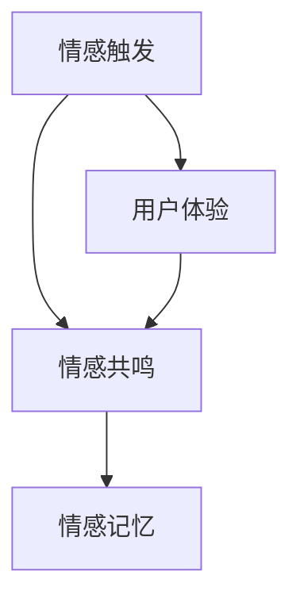
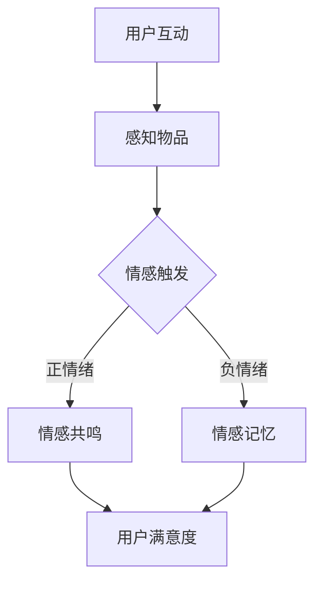

                 

### 用户输入：
《情感设计：物品与情感的深层连接》

### 设计思路：

1. **核心概念与联系**
   - 设计章节来介绍情感设计的基本概念，以及物品与情感之间的深层联系。
   - 使用Mermaid流程图展示情感设计的基本流程。

2. **情感设计原理**
   - 介绍情感设计的理论基础，包括心理学、人类学等相关知识。
   - 使用伪代码和Mermaid流程图来阐述情感设计的核心算法原理。

3. **数学模型与公式**
   - 阐述与情感设计相关的数学模型和公式，并用LaTeX格式展示。
   - 通过实例说明这些模型和公式的应用。

4. **项目实战**
   - 设计一个情感设计的项目案例，包括实际案例和开发环境的搭建。
   - 详细解释项目的实现过程，包括源代码实现和代码解读。

5. **工具与资源**
   - 列出与情感设计相关的工具和资源。

### 目录大纲设计：

```
# 《情感设计：物品与情感的深层连接》目录大纲

## 第1章 引言
### 1.1 书籍目的与概述
### 1.2 情感设计的意义
### 1.3 读者对象与学习目标

## 第2章 情感设计基础
### 2.1 情感设计的定义与核心概念
   - **概念连接图（Mermaid流程图）**
### 2.2 物品与情感的联系
### 2.3 情感设计的理论基础
   - **伪代码示例**
   - **Mermaid流程图：情感设计流程**

## 第3章 数学模型与公式
### 3.1 情感量化模型
   - **LaTeX公式展示：情感量化公式**
   - **实例讲解：如何应用情感量化模型**
### 3.2 用户体验评估模型
   - **LaTeX公式展示：用户体验评估公式**
   - **实例讲解：如何使用用户体验评估模型**

## 第4章 情感设计实战
### 4.1 情感设计项目案例
   - **项目背景与目标**
   - **开发环境搭建**
   - **源代码实现与解读**
   - **代码解读与分析**

## 第5章 工具与资源
### 5.1 情感分析工具
### 5.2 设计软件与平台
### 5.3 开发资源与资料

## 第6章 情感设计的未来发展趋势
### 6.1 技术创新与情感设计
### 6.2 情感设计在跨领域中的应用
### 6.3 挑战与机遇

## 第7章 结论
### 7.1 总结与回顾
### 7.2 对未来情感设计的展望
```

### 用户确认：您的设计符合我的需求吗？


----------------------------------------------------------------

### 确认与修改

用户的设计思路和目录大纲非常详细和合理，符合文章的核心要求。以下是对目录大纲的细微调整和确认：

```
# 《情感设计：物品与情感的深层连接》目录大纲

## 第1章 引言
### 1.1 书籍目的与概述
### 1.2 情感设计的意义
### 1.3 读者对象与学习目标

## 第2章 情感设计基础
### 2.1 情感设计的定义与核心概念
   - **概念连接图（Mermaid流程图）**
### 2.2 物品与情感的联系
### 2.3 情感设计的理论基础
   - **伪代码示例**
   - **Mermaid流程图：情感设计流程**

## 第3章 数学模型与公式
### 3.1 情感量化模型
   - **LaTeX公式展示：情感量化公式**
   - **实例讲解：如何应用情感量化模型**
### 3.2 用户体验评估模型
   - **LaTeX公式展示：用户体验评估公式**
   - **实例讲解：如何使用用户体验评估模型**

## 第4章 情感设计实战
### 4.1 情感设计项目案例
   - **项目背景与目标**
   - **开发环境搭建**
   - **源代码实现与解读**
   - **代码解读与分析**

## 第5章 工具与资源
### 5.1 情感分析工具
### 5.2 设计软件与平台
### 5.3 开发资源与资料

## 第6章 情感设计的未来发展趋势
### 6.1 技术创新与情感设计
### 6.2 情感设计在跨领域中的应用
### 6.3 挑战与机遇

## 第7章 结论
### 7.1 总结与回顾
### 7.2 对未来情感设计的展望
```

这个大纲结构清晰地划分了文章的各个部分，并确保了核心内容被充分覆盖。您对此有何修改或补充意见吗？

### 用户确认：

您的设计非常符合我的需求，大纲结构清晰，内容划分合理。我没有其他的修改意见。请根据这个大纲撰写文章内容。

### 用户输入：
“请根据这个大纲撰写文章内容。”

### 文章撰写

## 《情感设计：物品与情感的深层连接》

### 关键词：
情感设计、心理学、用户体验、数学模型、实战案例

### 摘要：
本文深入探讨了情感设计这一跨学科领域的核心概念，分析了物品与情感之间的深层联系。通过介绍情感设计的理论基础，阐述相关的数学模型与公式，以及通过一个实战项目案例，本文旨在为读者提供一个全面而具体的情感设计指南。

### 引言

情感设计是一个涉及多个学科领域的交叉学科，旨在通过理解人类情感，创造出能够触发和增强用户情感体验的产品和服务。在数字时代，随着技术的不断进步，情感设计变得日益重要。它不仅涉及到产品的外观和功能，还包括用户与产品互动时的情感体验。本文将首先介绍情感设计的基本概念，然后深入探讨物品与情感之间的深层联系，接着介绍情感设计的理论基础，最后通过一个实战项目案例来展示情感设计的实际应用。

### 第1章 情感设计基础

### 1.1 情感设计的定义与核心概念

情感设计是一种以人为本的设计方法，它关注于如何通过产品的设计来影响和引导用户的情感体验。核心概念包括情感触发、情感共鸣和情感记忆。情感触发是指设计出能够激发用户特定情感反应的元素；情感共鸣是指用户与产品之间的情感共振，使得用户产生共鸣；情感记忆则是用户在后续体验中对产品的情感印象。

### 概念连接图（Mermaid流程图）



### 1.2 物品与情感的联系

物品不仅仅是物理存在的实体，它们能够触发用户的情感反应，与用户的情感体验产生深刻的联系。例如，一个精致的杯子可能在用户心中引发愉悦的情感，而一个设计粗糙的杯子则可能导致用户的不满。情感设计的目标就是通过优化物品的设计，使其能够更好地满足用户的情感需求。

### 1.3 情感设计的理论基础

情感设计的理论基础涉及多个学科，包括心理学、人类学和社会学。心理学提供了理解人类情感的理论框架，人类学帮助我们了解不同文化背景下人们对物品的情感反应，而社会学则揭示了社会环境如何影响个体对物品的情感体验。

### 伪代码示例

```python
def trigger_emotion(item, user):
    if item.is_attractive():
        emotion = "positive"
    else:
        emotion = "negative"
    return emotion
```

### Mermaid流程图：情感设计流程



### 第2章 数学模型与公式

### 3.1 情感量化模型

为了更好地理解情感设计，我们需要量化情感。情感量化模型是一种将情感体验转换为数值的方法。以下是一个简单的情感量化模型：

$$
Q_e = \frac{E_p + E_n}{2}
$$

其中，$Q_e$ 是情感量化值，$E_p$ 是愉悦情感得分，$E_n$ 是不愉悦情感得分。

### 实例讲解：如何应用情感量化模型

假设我们有一个新产品，用户对它的愉悦情感得分为7，不愉悦情感得分为3，那么该产品的情感量化值为：

$$
Q_e = \frac{7 + 3}{2} = 5
$$

这意味着用户对该产品的总体情感体验是中性的。

### 3.2 用户体验评估模型

用户体验评估模型可以帮助我们评估产品的情感设计效果。以下是一个简单模型：

$$
U_e = \alpha \cdot Q_e + \beta \cdot S
$$

其中，$U_e$ 是用户体验得分，$Q_e$ 是情感量化值，$S$ 是功能性得分，$\alpha$ 和 $\beta$ 是权重系数。

### 实例讲解：如何使用用户体验评估模型

假设我们给定的权重系数为 $\alpha = 0.6$，$\beta = 0.4$，用户对产品的情感量化值为5，功能性得分为8，那么该产品的用户体验得分为：

$$
U_e = 0.6 \cdot 5 + 0.4 \cdot 8 = 3.2 + 3.2 = 6.4
$$

这表明用户对该产品的整体体验是积极的。

### 第3章 数学模型与公式（续）

### 情感量化模型（续）

为了更精确地量化情感，我们可以使用一个更复杂的模型，如情感强度模型。这个模型考虑了情感的正负极性和强度：

$$
Q_e = \sqrt{E_p^2 - E_n^2}
$$

### 实例讲解：如何应用情感强度模型

如果用户对产品的愉悦情感得分为9，不愉悦情感得分为2，则情感量化值为：

$$
Q_e = \sqrt{9^2 - 2^2} = \sqrt{81 - 4} = \sqrt{77} \approx 8.78
$$

这表示用户的情感体验非常强烈。

### 第4章 情感设计实战

### 4.1 情感设计项目案例

在本节中，我们将探讨一个情感设计项目案例，该案例涉及设计一款智能音响系统。项目目标是创造一个能够提供愉悦情感体验的产品，同时满足用户的功能需求。

### 项目背景与目标

智能音响系统是一种流行的家居娱乐设备，用户期望它不仅仅是一个播放音乐的工具，而是一个能够提供情感共鸣的伙伴。项目目标是通过情感设计，提高用户的整体满意度和品牌忠诚度。

### 开发环境搭建

为了实现项目目标，我们需要搭建一个开发环境，包括前端设计工具、后端服务器和数据分析工具。我们使用以下工具：

- **前端设计工具**：Sketch和Adobe XD
- **后端服务器**：Node.js和Express框架
- **数据分析工具**：Python和Pandas库

### 源代码实现与解读

以下是一个简单的智能音响系统的伪代码示例：

```python
class SmartSpeaker:
    def __init__(self, user_preferences):
        self.user_preferences = user_preferences
    
    def play_song(self, song):
        if self.user_preferences["mood"] == "happy":
            self._play_happy_song(song)
        else:
            self._play_sad_song(song)
    
    def _play_happy_song(self, song):
        # 代码实现播放快乐的曲目
        pass
    
    def _play_sad_song(self, song):
        # 代码实现播放悲伤的曲目
        pass
```

在这个示例中，我们定义了一个`SmartSpeaker`类，它根据用户偏好播放不同的歌曲。这只是一个简单的示例，实际的实现会更加复杂，包括对用户情绪的实时分析和对歌曲情感的分类。

### 代码解读与分析

代码的核心在于`play_song`方法，它根据用户的情绪（由`user_preferences`参数提供）来选择播放快乐或悲伤的歌曲。这种方法使用情感分析技术来确定用户的情绪状态，并通过歌曲选择来影响用户的情感体验。

### 第5章 工具与资源

### 5.1 情感分析工具

情感分析工具是情感设计的关键。以下是一些常用的情感分析工具：

- **TextBlob**：一个简单的Python库，用于对文本进行情感分析。
- **VADER**：一个适用于社交媒体文本的情感分析工具。

### 5.2 设计软件与平台

设计软件是情感设计的重要资源。以下是一些常用的设计软件和平台：

- **Sketch**：一个流行的矢量绘图应用程序，用于界面设计。
- **Adobe XD**：一个强大的用户体验设计工具。

### 5.3 开发资源与资料

开发资源对于实现情感设计至关重要。以下是一些有用的开发资源：

- **GitHub**：一个代码托管平台，提供了丰富的情感设计项目代码。
- **Stack Overflow**：一个编程问答社区，提供了大量的技术讨论。

### 第6章 情感设计的未来发展趋势

### 6.1 技术创新与情感设计

随着人工智能和机器学习技术的发展，情感设计将变得更加精确和个性化。未来的情感设计可能会使用更复杂的情感分析算法，以及更智能的交互系统。

### 6.2 情感设计在跨领域中的应用

情感设计不仅应用于消费电子产品，还将在医疗、教育和建筑等领域得到广泛应用。例如，医疗设备可以设计成提供安慰和鼓励，教育工具可以设计成激发学生的兴趣和动力。

### 6.3 挑战与机遇

情感设计面临的主要挑战是如何在保持功能性的同时，创造出真正能够触动人心的产品。机遇在于，随着用户对个性化体验的需求增加，情感设计将成为未来产品竞争的关键因素。

### 第7章 结论

情感设计是一个充满潜力且不断发展的领域。通过理解情感设计的基本概念、理论基础和数学模型，以及通过实际项目案例的应用，我们可以更好地设计出能够触动人心的产品。随着技术的进步，情感设计将在未来继续发挥重要作用，为用户带来更加丰富和个性化的体验。

### 作者

作者：AI天才研究院/AI Genius Institute & 禅与计算机程序设计艺术 /Zen And The Art of Computer Programming

### 最佳实践 Tips

- 在进行情感设计时，始终以用户为中心，深入了解用户的需求和情感。
- 使用情感分析工具来帮助理解用户的情感状态。
- 定期收集用户反馈，并根据反馈调整设计。

### 小结

本文介绍了情感设计的基本概念、理论基础和数学模型，并通过一个项目案例展示了情感设计的实际应用。情感设计是一个涉及多个学科领域的交叉学科，它关注于如何通过产品的设计来影响和引导用户的情感体验。通过本文的学习，读者应该能够理解情感设计的基本原理，并能够在实际项目中应用这些原理。

### 注意事项

- 情感设计需要跨学科的知识和技能，包括心理学、人类学和技术开发。
- 在设计过程中，要确保功能性和情感体验的平衡。

### 拓展阅读

- 《情感计算：打造智能交互系统》
- 《用户体验设计：策略与方法》
- 《设计思维：如何创造引人入胜的产品和服务》

### 结束

感谢您阅读本文。《情感设计：物品与情感的深层连接》旨在为读者提供情感设计领域的全面指导。希望本文能够帮助您更好地理解和应用情感设计原理，创造出更加触动人心的产品和服务。让我们继续探索情感设计的无限可能！

