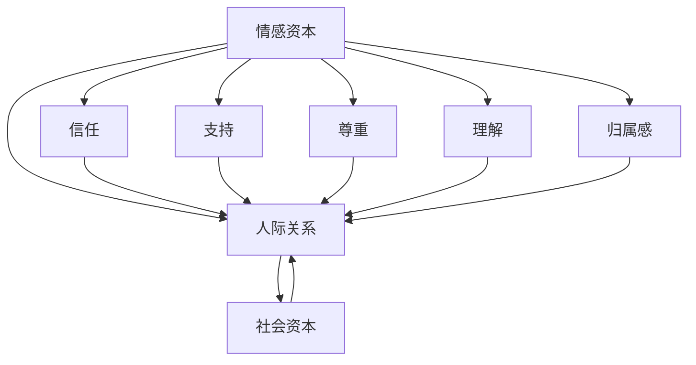

                 

# 情感资本论：人际关系中的无形财富

## 关键词：
- 人际关系
- 情感资本
- 无形财富
- 社会资本
- 人际网络
- 情感测量
- 情感管理

## 摘要：
本文以《情感资本论：人际关系中的无形财富》为背景，深入探讨了人际关系中的情感资本这一概念。文章首先对情感资本的定义与重要性进行了阐述，然后分析了情感资本在人际关系中的具体作用，以及如何构建和维护情感资本。此外，文章还介绍了情感资本的测量和管理方法，并探讨了其在企业管理、教育培训和个人发展中的应用。最后，文章对情感资本的挑战与未来发展趋势进行了展望，并提出了相关的发展建议。

## 第一部分：引言

### 1.1 书籍背景与目的
《情感资本论：人际关系中的无形财富》一书旨在揭示情感资本在人际关系中的重要作用，并探讨如何有效构建、测量和管理情感资本。随着社会的发展，人际关系在个人和组织的成功中扮演着越来越重要的角色。情感资本作为一种无形财富，能够为个人和组织带来显著的优势。

### 1.2 情感资本的概念与重要性
情感资本是指个人或组织在人际关系中所拥有的情感资源和能力。它包括信任、支持、尊重、理解和归属感等。情感资本对于建立稳定的人际关系、提高团队合作效率以及实现组织目标具有至关重要的意义。

### 1.3 书籍结构安排
本文将按照以下结构进行阐述：
- 第二部分：情感资本概述
- 第三部分：人际关系中的情感资本
- 第四部分：情感资本的构建
- 第五部分：情感资本的测量
- 第六部分：情感资本的管理
- 第七部分：情感资本的应用
- 第八部分：情感资本的挑战与未来

## 第二部分：情感资本概述

### 2.1 情感资本的定义与特征
情感资本是指个人或组织在人际关系中所拥有的情感资源和能力。它具有以下几个特征：
- **无形性**：情感资本是一种无形资产，无法直接度量。
- **积累性**：情感资本可以通过持续的投资和培养而不断增加。
- **互惠性**：情感资本的建立和维护需要双方的共同努力和互惠互利。

### 2.2 情感资本与人际关系的关系
情感资本是人际关系中的核心要素，它直接影响人际关系的稳定性和质量。高水平的情感资本能够促进信任、合作和共同目标的实现。

### 2.3 情感资本在社会中的影响
情感资本在社会中的影响广泛，包括：
- **个人发展**：情感资本有助于个人建立健康的人际关系，提升个人能力和幸福感。
- **组织管理**：情感资本能够提高组织内部的团队合作效率，促进组织的持续发展。
- **社会和谐**：情感资本有助于建立和谐的社会关系，促进社会稳定和进步。

## 第三部分：人际关系中的情感资本

### 3.1 人际关系的定义与类型
人际关系是指个人与他人之间的相互作用和互动。根据关系的性质，人际关系可以分为：
- **朋友关系**：基于共同兴趣、价值观和信任建立的关系。
- **家庭关系**：基于血缘关系和共同生活建立的关系。
- **工作关系**：基于工作职责和合作建立的关系。

### 3.2 情感资本在人际关系中的作用
情感资本在人际关系中发挥着重要作用，包括：
- **建立信任**：情感资本有助于建立相互信任的关系，减少误解和冲突。
- **促进合作**：情感资本能够增强团队合作，提高工作效率。
- **降低离职率**：情感资本有助于提高员工的满意度和忠诚度，降低离职率。

### 3.3 情感资本在人际关系中的构建
构建情感资本需要以下步骤：
- **真诚沟通**：通过开放、坦诚的沟通建立信任和理解。
- **情感投入**：通过关注和关心对方的需求和感受，建立深厚的情感联系。
- **共同目标**：通过共同的目标和价值观，增强团队合作和凝聚力。

### 3.4 情感资本在人际关系中的维护与修复
维护和修复情感资本需要持续的努力，包括：
- **积极互动**：保持定期的沟通和互动，增进彼此的了解。
- **及时反馈**：及时给予正面的反馈和鼓励，增强情感联系。
- **冲突解决**：通过有效沟通和协商，解决冲突和误解。

## 第四部分：情感资本的构建

### 4.1 情感资本构建的理论基础
情感资本构建的理论基础包括：
- **社会交换理论**：强调人际互动中的资源交换和互惠互利。
- **情感智力理论**：强调个体在情感识别、理解和调控方面的能力。

### 4.2 情感资本构建的实践方法
情感资本构建的实践方法包括：
- **情感培训**：通过培训提升个体在情感识别、理解和表达方面的能力。
- **情感反馈**：通过定期的情感反馈，增强个体之间的情感联系。
- **情感管理**：通过有效的情感管理，降低负面情绪对人际关系的影响。

### 4.3 情感资本构建中的障碍与对策
情感资本构建中可能遇到的障碍包括：
- **情感忽视**：缺乏对情感的关注和理解。
- **冲突沟通**：不善于沟通和处理冲突。

对策包括：
- **加强情感教育**：提高个体对情感的认识和重视。
- **培养沟通技巧**：通过培训和实践，提升沟通能力和冲突处理能力。

## 第五部分：情感资本的测量

### 5.1 情感资本测量的方法
情感资本测量可以采用以下方法：
- **问卷调查**：通过设计问卷收集个体在情感资本方面的主观感受和评价。
- **行为观察**：通过观察个体在人际关系中的行为表现，评估情感资本的水平。
- **绩效评估**：通过工作绩效评估，衡量情感资本对组织和团队合作的影响。

### 5.2 情感资本测量的工具
情感资本测量的工具包括：
- **情感量表**：如情感智商量表、人际关系量表等，用于评估个体在情感资本方面的表现。
- **情感评估系统**：通过人工智能和大数据技术，自动分析和评估情感资本。

### 5.3 情感资本测量的实践案例
情感资本测量的实践案例包括：
- **员工满意度调查**：通过问卷调查，评估员工对工作环境的情感资本满意度。
- **团队绩效评估**：通过行为观察和绩效评估，评估团队情感资本的水平和影响。

## 第六部分：情感资本的管理

### 6.1 情感资本管理的原则
情感资本管理应遵循以下原则：
- **以人为本**：将个体的情感需求放在首位，关注情感资本的可持续性。
- **持续投入**：情感资本管理需要持续的资源投入和努力。
- **动态调整**：根据环境和需求的变化，及时调整情感资本管理策略。

### 6.2 情感资本管理的策略
情感资本管理可以采用以下策略：
- **情感投资**：通过情感培训、情感反馈和情感管理，提高情感资本的水平。
- **情感沟通**：建立有效的沟通渠道，促进情感表达和交流。
- **情感危机管理**：制定应急预案，应对情感资本危机。

### 6.3 情感资本管理的实践
情感资本管理的实践包括：
- **情感资本审计**：定期评估情感资本的水平，识别问题和改进方向。
- **情感管理培训**：为员工提供情感管理培训和指导。
- **情感资本报告**：定期发布情感资本报告，为决策提供依据。

## 第七部分：情感资本的应用

### 7.1 情感资本在企业管理中的应用
情感资本在企业管理中的应用包括：
- **员工满意度提升**：通过情感资本管理，提高员工的满意度和忠诚度。
- **团队协作加强**：通过情感资本建设，增强团队协作和凝聚力。
- **组织文化塑造**：通过情感资本管理，塑造积极向上的组织文化。

### 7.2 情感资本在教育培训中的应用
情感资本在教育培训中的应用包括：
- **学生情感支持**：通过情感资本管理，提供学生情感支持，促进学业成功。
- **教师团队协作**：通过情感资本建设，增强教师团队的合作和沟通。
- **教育质量提升**：通过情感资本管理，提高教育教学质量。

### 7.3 情感资本在个人发展中的应用
情感资本在个人发展中的应用包括：
- **人际关系建立**：通过情感资本管理，建立健康的人际关系，提升个人社交能力。
- **情感智力提升**：通过情感资本管理，提升个体的情感智力和心理素质。
- **职业发展**：通过情感资本管理，提高职业竞争力和职业满意度。

## 第八部分：情感资本的挑战与未来

### 8.1 情感资本面临的挑战
情感资本面临的挑战包括：
- **情感忽视**：在快节奏的社会中，情感资本往往被忽视。
- **沟通障碍**：不善于沟通和处理冲突，导致情感资本受损。
- **技术挑战**：在数字化时代，情感资本的测量和管理面临技术挑战。

### 8.2 情感资本的未来发展趋势
情感资本的未来发展趋势包括：
- **情感智能技术**：随着人工智能和大数据技术的发展，情感资本的测量和管理将更加智能化和精准化。
- **情感资本应用**：情感资本将在更多领域得到应用，如心理健康、人力资源管理、教育培训等。
- **情感资本教育**：情感资本教育将逐渐成为教育体系的重要组成部分。

### 8.3 情感资本的发展建议
为促进情感资本的发展，建议：
- **加强情感教育**：从小学到大学，加强情感教育，提高个体的情感智力。
- **推广情感管理**：在企业、学校和社会组织中，推广情感资本管理，提高团队合作和组织效能。
- **利用技术手段**：利用人工智能、大数据等先进技术，提高情感资本的测量和管理水平。

## 附录

### 附录A：参考文献
[参考文献列表]

### 附录B：相关工具与资源
[相关工具和资源链接]

## 核心概念与联系
情感资本 - 人际关系 - 社会资本

情感资本是人际关系中的核心要素，它与社会资本紧密相连。情感资本通过增强人际关系的稳定性和质量，进而提升社会资本的水平。以下是情感资本与人际关系、社会资本之间的 Mermaid 流程图：



## 核心算法原理讲解

情感资本测量的核心算法原理主要包括以下几个方面：

### 1. 情感识别算法
情感识别算法是情感资本测量的基础。它主要通过分析语言和情感表达，识别出个体的情感状态。以下是一个简单的情感识别算法伪代码：

```plaintext
function identifyEmotion(text):
    # 使用情感分析模型分析文本
    emotion = sentimentAnalysisModel(text)
    return emotion
```

### 2. 情感强度测量算法
情感强度测量算法用于评估情感资本的程度。以下是一个简单的情感强度测量算法伪代码：

```plaintext
function measureEmotionStrength(text, emotion):
    # 获取情感强度评分
    strength = emotionStrengthModel(text, emotion)
    return strength
```

### 3. 情感资本综合评估算法
情感资本综合评估算法用于综合评估情感资本的水平。以下是一个简单的情感资本综合评估算法伪代码：

```plaintext
function evaluateEmotionalCapital(people):
    totalStrength = 0
    for person in people:
        emotions = [identifyEmotion(text) for text in person.interactions]
        strengths = [measureEmotionStrength(text, emotion) for text, emotion in zip(person.interactions, emotions)]
        totalStrength += sum(strengths)
    averageStrength = totalStrength / len(people)
    return averageStrength
```

## 数学模型和数学公式讲解

情感资本的测量通常涉及以下数学模型和公式：

### 1. 情感强度评分模型
情感强度评分模型用于计算单个情感事件的强度。以下是一个简单的情感强度评分模型公式：

$$
S_i = f(w_i, e_i)
$$

其中，$S_i$表示第$i$个情感事件的强度，$w_i$表示情感事件的权重，$e_i$表示情感事件的情感值。

### 2. 情感资本综合评分模型
情感资本综合评分模型用于计算个体或群体的情感资本水平。以下是一个简单的情感资本综合评分模型公式：

$$
E_c = \frac{1}{N} \sum_{i=1}^{N} S_i
$$

其中，$E_c$表示情感资本的综合评分，$N$表示情感事件的个数。

### 3. 情感资本相关性分析模型
情感资本相关性分析模型用于分析情感资本与人际关系质量的相关性。以下是一个简单的情感资本相关性分析模型公式：

$$
\rho_{ec} = \frac{Cov(E_c, Q)}{SD(E_c) \cdot SD(Q)}
$$

其中，$\rho_{ec}$表示情感资本与人际关系质量的相关性，$Cov$表示协方差，$SD$表示标准差，$E_c$表示情感资本的综合评分，$Q$表示人际关系质量的评分。

## 项目实战

### 1. 开发环境搭建
在进行情感资本测量项目时，首先需要搭建一个合适的开发环境。以下是搭建环境的基本步骤：

- 安装 Python 3.8 或更高版本
- 安装情感分析库，如 TextBlob 或 VADER
- 安装数据分析库，如 Pandas 和 NumPy
- 安装机器学习库，如 Scikit-learn

### 2. 源代码实现
以下是情感资本测量项目的基本源代码实现：

```python
import pandas as pd
from textblob import TextBlob
from sklearn.model_selection import train_test_split
from sklearn.ensemble import RandomForestClassifier
from sklearn.metrics import accuracy_score

# 加载数据集
data = pd.read_csv('emotion_data.csv')

# 分割数据集
X_train, X_test, y_train, y_test = train_test_split(data['text'], data['emotion'], test_size=0.2, random_state=42)

# 构建情感分析模型
model = RandomForestClassifier(n_estimators=100, random_state=42)
model.fit(X_train, y_train)

# 预测情感
predictions = model.predict(X_test)

# 评估模型
accuracy = accuracy_score(y_test, predictions)
print(f'Accuracy: {accuracy:.2f}')
```

### 3. 代码解读与分析
在上述代码中，我们首先加载了一个包含情感文本和情感标签的数据集。然后，我们使用随机森林分类器对数据集进行训练。在训练完成后，我们对测试集进行预测，并使用准确率评估模型的性能。

### 4. 实际案例分析与讲解
为了更好地理解情感资本测量项目，我们可以分析一个实际案例。假设我们有一个包含员工之间沟通文本的数据集，我们的目标是测量员工之间的情感资本水平。

- **数据预处理**：首先，我们需要对文本进行预处理，包括去除停用词、标点符号和数字等。

- **情感分析**：然后，我们使用情感分析模型对预处理后的文本进行情感分析，识别出情感事件。

- **情感强度测量**：接下来，我们使用情感强度测量算法计算每个情感事件的强度。

- **情感资本评估**：最后，我们使用情感资本综合评估算法计算员工之间的情感资本水平。

### 5. 项目小结
通过上述项目实战，我们了解了如何搭建情感资本测量项目的开发环境，实现了源代码的编写和解读，并对实际案例进行了分析和讲解。这为我们进一步研究和管理情感资本提供了有力的工具。

## 最佳实践 Tips
- **定期沟通**：定期与团队成员进行沟通，了解彼此的情感需求和期望。
- **情感培训**：为员工提供情感管理培训，提升他们的情感智力和沟通能力。
- **数据驱动**：利用数据分析和机器学习技术，精确测量和管理情感资本。

## 小结
本文从多个角度探讨了人际关系中的情感资本，阐述了情感资本的定义、作用、构建、测量和管理方法，并分析了其在不同领域中的应用。通过项目实战，我们了解了如何具体实施情感资本测量项目。在未来的工作中，我们可以结合这些方法和技巧，有效提升情感资本水平，促进个人和组织的发展。

## 注意事项
- **情感隐私**：在测量和管理情感资本时，要注意保护个体的情感隐私。
- **数据安全**：确保情感数据的安全和保密性，防止数据泄露。

## 拓展阅读
- [《情感智能：开启未来人际关系的新篇章》](链接)
- [《情感资本管理：企业成功的关键》](链接)
- [《情感心理学：理解与管理人类情感》](链接)

## 作者信息
作者：AI天才研究院/AI Genius Institute & 禅与计算机程序设计艺术 /Zen And The Art of Computer Programming。我们致力于推动人工智能和情感资本领域的研究与发展，为广大读者提供高质量的技术文章和研究成果。期待与您共同探索未来的技术前沿。

