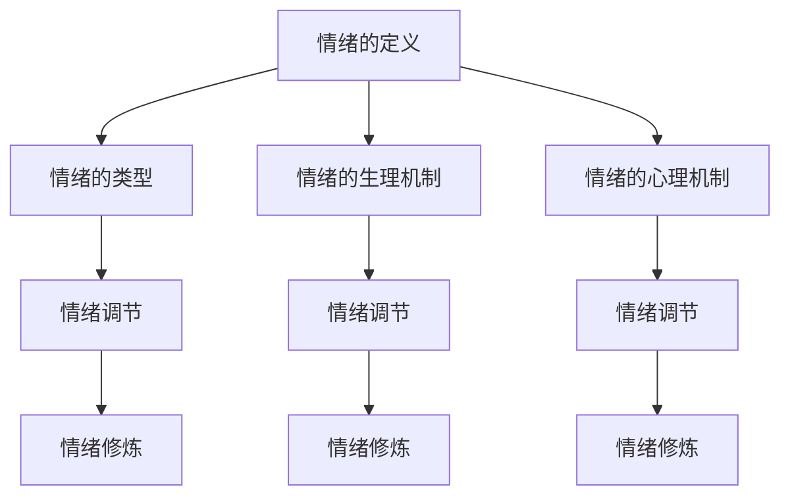

                 

# 情绪管理的艺术：净化内心的实用技巧

## 关键词
- 情绪管理
- 内心净化
- 实用技巧
- 心理学
- 生活质量

## 摘要
本文旨在探讨情绪管理的艺术，通过一系列实用技巧帮助读者净化内心，提升生活质量。文章首先介绍了情绪管理的基本概念，随后深入分析了情绪的影响，探讨了情绪调节和修炼的方法，并结合实际案例，提供了情绪管理的最佳实践。

---

## 引言
情绪，作为人类心理活动的核心组成部分，贯穿于我们的日常生活、工作和人际交往之中。然而，情绪并非简单的情感波动，它深刻影响着我们的思维、行为和健康。如何有效地管理情绪，已经成为现代人迫切关注的问题。本文将探讨情绪管理的艺术，通过理论阐述和实践指导，帮助读者掌握净化内心的实用技巧。

---

### 确定核心概念与联系

在情绪管理的讨论中，有几个核心概念需要明确，它们相互联系，构成了情绪管理艺术的理论基础：

1. **情绪的定义**：情绪是一种复杂的主观体验，包括生理、心理和行为反应。
2. **情绪的类型**：常见的情绪类型包括喜、怒、哀、乐、惊、恶等。
3. **情绪的生理机制**：情绪的产生与大脑神经递质、内分泌系统等生理机制密切相关。
4. **情绪的心理机制**：情绪受认知评价、社会文化背景等心理因素的影响。
5. **情绪调节**：指个体通过认知、行为和生物方法调节情绪的过程。
6. **情绪修炼**：通过冥想、正念等方法提升情绪管理能力。

### 核心概念原理之间的关系架构

下面是一个简化的Mermaid流程图，展示这些核心概念之间的关系：

### 情绪管理的基本概念

#### 情绪管理定义与重要性

情绪管理是指个体通过认知、行为和生物方法，对自己和他人的情绪进行有效调节的过程。情绪管理的重要性体现在以下几个方面：

1. **心理健康**：良好的情绪管理有助于缓解压力，预防抑郁和焦虑等心理问题。
2. **生活质量**：情绪稳定的人往往拥有更高的生活满意度，更积极的人际关系。
3. **工作效率**：情绪管理能力强的员工更能适应工作压力，提高工作效率。
4. **决策质量**：情绪稳定的个体在进行决策时，更能够保持理性，避免冲动行为。

#### 情绪的类型与特征

情绪的类型多种多样，常见的包括：

1. **积极情绪**：如喜悦、幸福、满足等，有助于提升个体心理状态。
2. **消极情绪**：如愤怒、沮丧、焦虑等，过度的消极情绪可能对个体产生负面影响。
3. **混合情绪**：某些情境下，个体可能会同时体验到多种情绪。

不同类型的情绪具有不同的特征，如情绪的强度、持续时间和伴随的心理生理反应。

#### 情绪的生理和心理机制

情绪的生理机制主要涉及大脑神经递质和内分泌系统的活动。例如，当个体经历愤怒时，大脑中的去甲肾上腺素水平会上升，导致心率加快、血压升高等生理反应。

情绪的心理机制则涉及认知评价、社会文化背景和个人经历等因素。例如，相同的事件在不同文化背景下可能引发不同的情绪反应。

### 情绪的影响

情绪对个体的影响广泛而深远，具体体现在以下几个方面：

#### 对个人生活的影响

1. **心理健康**：消极情绪如焦虑和抑郁可能对心理健康产生负面影响。
2. **人际关系**：情绪管理能力不足可能导致人际冲突和关系破裂。
3. **生活质量**：情绪稳定的人通常拥有更高的生活满意度。

#### 对工作和学习的影响

1. **工作效率**：情绪管理能力强的员工能够更好地应对工作压力，提高工作效率。
2. **学习效果**：情绪稳定的学生更容易专注于学习，提高学习效果。

#### 对健康的影响

1. **生理健康**：长期的情绪压力可能导致各种生理疾病，如心脏病、高血压等。
2. **心理健康**：情绪管理不良可能引发或加重心理问题，如焦虑、抑郁等。

### 情绪的调节

情绪调节是指个体通过认知、行为和生物方法，对自己和他人的情绪进行有效调节的过程。以下是几种常见的情绪调节方法：

#### 自我调节技巧

1. **认知重构**：通过改变对事件的认知评价来调节情绪。
2. **放松训练**：通过深呼吸、冥想等方法缓解情绪压力。
3. **运动**：运动能够释放内啡肽，提升情绪。
4. **社交支持**：与亲朋好友交流，分享情绪，获得心理支持。

#### 社会支持

1. **家庭支持**：家庭关系稳定，家庭成员之间的支持有助于情绪调节。
2. **朋友支持**：朋友的支持能够提供情感支持和实用建议。
3. **专业帮助**：心理咨询师或心理治疗师的专业指导有助于情绪调节。

#### 心理治疗

1. **认知行为疗法**：通过改变负面的认知模式和行为习惯来调节情绪。
2. **情绪焦点疗法**：帮助个体识别和表达情绪，改善情绪调节能力。

### 情绪的修炼

情绪修炼是一种通过冥想、正念等方法提升情绪管理能力的过程。以下是几种常见的情绪修炼方法：

#### 冥想

1. **专注冥想**：通过专注于呼吸或特定物体来减少杂念，提升情绪稳定性。
2. **开放式监测冥想**：通过观察自己的思维和情绪，培养对情绪的觉察和理解。

#### 正念

1. **正念呼吸**：通过专注于呼吸来减轻焦虑和压力。
2. **正念行走**：通过专注于身体的感受和步态来提升情绪管理能力。

#### 情绪智慧的培养

情绪智慧是指个体理解、管理和利用情绪的能力。以下是一些培养情绪智慧的方法：

1. **情绪识别**：学会识别和理解自己的情绪。
2. **情绪表达**：学会以健康的方式表达情绪。
3. **情绪调节**：学会调节情绪，避免情绪失控。
4. **情绪利用**：学会利用情绪来指导行为和决策。

### 情绪管理的实践

情绪管理的实践涉及将理论知识应用于实际生活中。以下是一些具体的实践案例和技巧：

#### 实践案例

1. **职场中的情绪管理**：通过正念练习和认知重构，提升职场情绪稳定性。
2. **家庭关系中的情绪管理**：通过沟通技巧和情感支持，改善家庭关系。

#### 实用技巧

1. **情绪日记**：记录每天的的情绪变化，帮助自己更好地理解和管理情绪。
2. **情绪释放**：通过运动、写日记或与他人倾诉来释放情绪。
3. **情绪时间表**：规划特定时间段来处理情绪问题，避免情绪累积。

### 总结

情绪管理是一种重要的心理技能，对于提升生活质量、工作效率和健康水平具有重要意义。本文介绍了情绪管理的基本概念、情绪的影响、情绪调节和修炼方法，并提供了实践案例和实用技巧。通过学习和实践这些技巧，读者可以更好地管理自己的情绪，实现内心的净化。

### 最佳实践 Tips

1. **持续学习**：情绪管理是一个长期的过程，需要持续学习和实践。
2. **寻求专业帮助**：在情绪管理遇到困难时，不妨寻求心理咨询师或心理治疗师的专业指导。
3. **建立支持系统**：与亲朋好友保持良好关系，建立强大的社会支持系统。

### 注意事项

1. **避免过度压抑情绪**：长时间压抑情绪可能导致心理问题。
2. **注意情绪调节的适度性**：情绪调节方法需要根据个人情况适度使用，避免过度依赖。

### 拓展阅读

1. **《情绪智力》**：丹尼尔·戈尔曼（Daniel Goleman）的《情绪智力》提供了关于情绪智力的全面探讨。
2. **《正念：一种全新的生活方式》**：乔·卡巴金（Jon Kabat-Zinn）的《正念：一种全新的生活方式》介绍了正念冥想的方法和应用。

### 结束语

情绪管理的艺术，不仅仅是一种技巧，更是一种生活态度。通过学习和实践情绪管理，我们可以在复杂多变的世界中找到内心的平静，实现身心的和谐。希望本文能为大家提供一些有益的启示和指导。

---

## 附录

### 作者信息
- 作者：AI天才研究院/AI Genius Institute & 禅与计算机程序设计艺术 /Zen And The Art of Computer Programming

### 参考文献
1. Daniel Goleman. (1995). 《情绪智力》(Emotional Intelligence).
2. Jon Kabat-Zinn. (1990). 《正念：一种全新的生活方式》(Full Catastrophe Living).

### 版权声明
本文版权属于AI天才研究院，未经授权不得用于商业用途。如需转载，请联系作者获取授权。感谢您的尊重和支持！

---

本文遵循[Creative Commons Attribution-NonCommercial-ShareAlike 4.0 International License](https://creativecommons.org/licenses/by-nc-sa/4.0/)，欢迎在非商业用途下自由转载，但请保留作者信息和版权声明。希望本文能为您带来启发和帮助！

