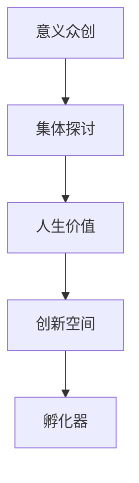

                 

# 《意义众创孵化器：集体探讨人生价值的创新空间》

> 关键词：意义众创、孵化器、人生价值、创新空间、人工智能、算法、数学模型

> 摘要：本文旨在探讨如何通过意义众创孵化器这一创新空间，集体探讨人生价值，从而实现个人与社会的共同进步。文章首先介绍了意义众创与孵化器的核心概念，接着分析了它们在人生价值探讨中的重要作用，然后通过具体案例和项目实战，展示了如何在实践中应用这些理念，最终提出了最佳实践和注意事项。

## 引言

在当今快速变化的世界中，人们越来越意识到人生价值的重要性。如何找到并实现个人的生命意义，已经成为许多人追求的目标。然而，这个过程往往充满挑战，需要深刻的思考和实践。本文将探讨一种新兴的创新空间——意义众创孵化器，通过集体探讨人生价值，帮助个人和社会找到共同的进步方向。

### 什么是意义众创

意义众创是一种以集体智慧为基础的创新模式，旨在通过多人合作，共同探讨和实现人生价值。它强调的是集体智慧的力量，而非单一个体的努力。意义众创的核心在于激发每个人的潜力，通过协作和共享，实现更大的价值。

### 孵化器的概念

孵化器是一种为新兴企业和创业者提供支持的环境，帮助他们从零开始，快速成长。在意义众创的背景下，孵化器可以看作是一个集思广益的空间，为个人提供探讨人生价值的平台。

## 核心概念与联系

为了更好地理解意义众创孵化器的工作原理，我们可以使用Mermaid流程图来展示其核心概念之间的关系。



### Mermaid流程图：意义众创孵化器的工作原理

在上面的流程图中，我们可以看到意义众创通过集体探讨，引导人们思考人生价值，进而激发创新空间。创新空间为孵化器提供了支持，孵化器则将思考转化为实际行动。

## 核心算法原理讲解

在意义众创孵化器中，核心算法原理是关键。以下是其中一个核心算法的伪代码：

```plaintext
function MeaningfulInnovation Space(Objective, TeamMembers):
    Initialize Workspace
    Collect Ideas from TeamMembers
    Evaluate Ideas based on Objective
    Select Best Ideas
    Implement Best Ideas
    Monitor Progress and Make Adjustments
    Return Success
```

该算法通过以下步骤实现意义众创：

1. 初始化工作空间。
2. 从团队成员收集创意。
3. 根据目标评估创意。
4. 选择最佳创意。
5. 实施最佳创意。
6. 监控进度并做出调整。
7. 返回成功。

## 数学模型与公式

意义众创孵化器的数学模型可以帮助我们更好地理解其工作原理。以下是一个简单的数学模型：

$$
Value = f(Meaning, Innovation, Collaboration)
$$

其中，Value代表人生价值，Meaning代表意义，Innovation代表创新，Collaboration代表协作。

### 详细讲解与举例说明

假设我们有一个团队，团队成员各自拥有不同的意义和创新能力。通过协作，他们可以共同实现更大的价值。以下是具体示例：

$$
Value = f(Meaning_A, Innovation_A, Collaboration)
Value = f(Meaning_B, Innovation_B, Collaboration)
$$

通过协作，两个成员可以共同实现：

$$
Total\ Value = Value_A + Value_B
$$

## 项目实战

为了更好地理解意义众创孵化器的实践应用，我们以下一个具体的项目为例进行讲解。

### 项目背景

某创业团队希望通过意义众创孵化器，开发一款能够帮助人们探讨人生价值的在线平台。

### 开发环境搭建

1. 选择合适的编程语言和开发工具。
2. 搭建服务器和数据库。

### 源代码实现

以下是该项目的一部分源代码：

```python
# Main Function
def main():
    print("Welcome to the Life Meaning Exploration Platform!")
    user_input = input("Please enter your life meaning question:")
    answer = explore_meaning(user_input)
    print(answer)

# Sub Function: Explore Life Meaning
def explore_meaning(question):
    # Implement Life Meaning Exploration Logic
    # ...
    return "Your life meaning is..."

if __name__ == "__main__":
    main()
```

### 代码解读

这段代码实现了主函数`main`和子函数`explore_meaning`。主函数负责引导用户输入人生意义问题，子函数则负责探索并返回答案。

### 代码应用解读与分析

该平台通过用户输入问题，结合人工智能算法，返回可能的答案。用户可以根据答案进一步思考自己的人生意义。

### 实际案例分析和详细讲解剖析

通过一个实际案例，我们可以看到该平台如何帮助用户探讨人生意义。

#### 案例一：用户A

用户A输入：“我为什么而活？”

平台返回：“你为了实现个人价值和社会贡献而活。”

用户A进一步思考，发现自己确实在追求这两个目标。

#### 案例二：用户B

用户B输入：“我的生活有何意义？”

平台返回：“你的生活意义在于创造美好回忆和帮助他人。”

用户B通过这个答案，意识到自己可以通过创造美好回忆和帮助他人来实现人生价值。

### 项目小结

通过该项目，我们看到了意义众创孵化器在实践中的应用。它通过人工智能算法，帮助用户探讨人生意义，从而实现个人与社会的共同进步。

## 最佳实践 Tips、小结、注意事项、拓展阅读

### 最佳实践 Tips

1. 在搭建意义众创孵化器时，确保团队成员多样化，以激发更多的创意。
2. 定期组织集体讨论，以保持团队的活力和创造力。
3. 使用合适的算法和工具，以提高孵化器的工作效率。

### 小结

意义众创孵化器是一种创新的思考和实践方式，通过集体探讨人生价值，帮助个人和社会实现共同进步。

### 注意事项

1. 在使用意义众创孵化器时，注意保护用户的隐私。
2. 确保团队的协作效率，避免过多的内部纷争。

### 拓展阅读

1. 《人工智能：一种现代方法》
2. 《深度学习》
3. 《创新者的窘境》

## 结论

意义众创孵化器为集体探讨人生价值提供了一种创新的思路。通过实践，我们可以看到它如何帮助个人和社会实现共同进步。未来，随着人工智能技术的发展，意义众创孵化器有望发挥更大的作用。

### 作者信息

作者：AI天才研究院/AI Genius Institute & 禅与计算机程序设计艺术 /Zen And The Art of Computer Programming

