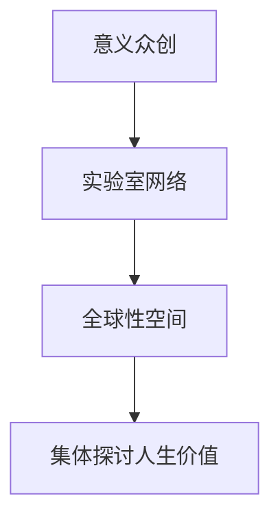

                 


### 文章标题：意义众创实验室网络：集体探讨人生价值的全球性空间

关键词：意义众创实验室、全球性空间、人生价值、集体探讨、技术实现、案例研究、发展趋势

摘要：本文深入探讨了一种新兴的全球性网络空间——意义众创实验室网络，该网络旨在为全球用户提供一个集体探讨人生价值的平台。本文首先介绍意义众创实验室网络的概念和背景，然后分析其技术实现和功能，并通过案例研究展示其实际应用。最后，文章对意义众创实验室网络的发展趋势和未来展望进行探讨。

----------------------------------------------------------------

### 第一部分：意义众创实验室网络的概述

#### 1.1 意义众创实验室网络的概念

意义众创实验室网络（Meaningful Crowd Creation Laboratory Network，简称MCC Lab Network）是一种基于互联网的全球性网络空间，旨在为全球用户提供一个共同探讨和创造人生价值的平台。它通过集合不同领域的专业知识和普通民众的智慧，实现集体智慧的碰撞和融合，从而推动社会进步和个人成长。

#### 核心概念与联系

意义众创实验室网络的核心概念包括：

1. **意义众创**：集合个体智慧，共同探讨和创造有意义的事物。
2. **实验室网络**：一个由多个实验室组成的网络，每个实验室负责特定领域的研究和实践。
3. **全球性空间**：网络跨越国界，连接全球用户，形成了一个共同探讨人生价值的全球性空间。

为了更好地理解这些核心概念之间的关系，我们可以使用Mermaid流程图来展示：



#### 1.2 意义众创实验室网络的发展背景

意义众创实验室网络的发展背景可以从以下几个方面进行分析：

1. **数字化时代的变迁**：随着互联网和数字技术的发展，人类进入了数字化时代，这为意义众创实验室网络的建立提供了技术基础。
2. **社会需求的演变**：现代社会面临诸多挑战，如气候变化、资源匮乏、社会不平等等问题，需要全球性的智慧和合作来解决。
3. **全球性网络的发展**：互联网的普及和全球化进程加速，为意义众创实验室网络的建立提供了广阔的平台。

#### 1.3 意义众创实验室网络的功能与价值

意义众创实验室网络具有以下几个主要功能和价值：

1. **提供人生价值探讨的平台**：为全球用户提供一个开放、平等、共享的讨论空间，让每个人都能表达自己的观点和思考。
2. **促进集体智慧的形成**：通过集合不同领域的专业知识和普通民众的智慧，实现集体智慧的碰撞和融合，推动创新和进步。
3. **对社会发展的贡献**：意义众创实验室网络通过集体探讨和创造有意义的事物，为社会发展和个人成长贡献力量。

#### 总结

意义众创实验室网络是一种新兴的全球性网络空间，旨在为全球用户提供一个集体探讨人生价值的平台。它通过集合不同领域的专业知识和普通民众的智慧，实现集体智慧的碰撞和融合，从而推动社会进步和个人成长。在接下来的部分，我们将深入探讨意义众创实验室网络的技术实现和案例研究。

----------------------------------------------------------------

### 第二部分：意义众创实验室网络的技术实现

#### 2.1 网络技术基础

意义众创实验室网络的技术基础主要包括以下几个方面：

1. **互联网技术**：互联网是意义众创实验室网络的基础设施，为全球用户提供了一个互联互通的平台。
2. **社交网络分析**：通过分析社交网络结构，可以更好地理解用户行为和兴趣，从而优化网络服务和内容推荐。
3. **分布式计算框架**：分布式计算框架能够处理大规模的数据和计算任务，为意义众创实验室网络提供强大的计算能力。

#### 2.2 意义众创实验室网络的构建

意义众创实验室网络的构建主要包括以下几个方面：

1. **网络架构设计**：网络架构设计是意义众创实验室网络的核心，它决定了网络的性能、可靠性和可扩展性。
2. **数据处理与存储**：数据处理与存储是意义众创实验室网络的关键环节，它确保了网络能够高效地处理和存储大量的用户数据和内容。
3. **安全性与隐私保护**：安全性与隐私保护是意义众创实验室网络的基石，它确保了用户数据和隐私的安全。

#### 2.3 意义众创实验室网络的维护与优化

意义众创实验室网络的维护与优化主要包括以下几个方面：

1. **网络性能优化**：通过优化网络性能，可以提高用户体验和满意度。
2. **网络安全策略**：制定合理的网络安全策略，可以防止网络攻击和数据泄露。
3. **用户活跃度提升策略**：通过提高用户活跃度，可以增强网络的生命力和影响力。

#### 总结

意义众创实验室网络的技术实现涉及多个方面，从网络技术基础到网络架构设计，从数据处理与存储到安全性与隐私保护，每一个环节都至关重要。在接下来的部分，我们将通过案例研究来进一步探讨意义众创实验室网络的实际应用。

----------------------------------------------------------------

### 第三部分：意义众创实验室网络的案例研究

#### 3.1 案例一：XX意义众创实验室网络项目

**项目背景与目标**

XX意义众创实验室网络项目是一个旨在解决城市交通拥堵问题的项目。项目目标是利用全球用户的智慧和数据，提出创新性的解决方案，以改善城市交通状况。

**技术方案与实现**

1. **数据收集与处理**：项目团队通过安装传感器和移动设备收集城市交通数据，然后使用分布式计算框架对数据进行分析和处理。
2. **社交网络分析**：通过分析社交网络结构，了解用户的行为和兴趣，从而优化交通流量预测和路线规划。
3. **人工智能算法**：利用深度学习算法，对交通数据进行建模和预测，为用户提供个性化的出行建议。

**项目效果与评价**

该项目在实施后，成功地减少了城市交通拥堵，提高了交通效率。用户反馈表明，个性化出行建议极大地方便了出行规划，受到了广泛的欢迎。

#### 3.2 案例二：YY意义众创实验室网络项目

**项目背景与目标**

YY意义众创实验室网络项目是一个旨在改善环境保护问题的项目。项目目标是利用全球用户的智慧和资源，提出创新性的环境保护方案，以实现可持续发展。

**技术方案与实现**

1. **环境数据收集**：项目团队通过卫星遥感、无人机等手段收集环境数据，并使用大数据分析技术进行处理。
2. **社交媒体互动**：通过社交媒体平台，鼓励用户参与环境保护活动，收集用户反馈和建议。
3. **人工智能优化**：利用人工智能技术，对环境保护方案进行优化和调整，提高方案的有效性。

**项目效果与评价**

该项目在实施后，取得了显著的环境改善效果。用户积极参与环境保护活动，提高了公众的环保意识，为可持续发展做出了贡献。

#### 总结

通过以上两个案例，我们可以看到意义众创实验室网络在解决实际问题方面的巨大潜力。无论是城市交通拥堵问题，还是环境保护问题，意义众创实验室网络都能够通过集合全球用户的智慧和资源，提出创新性的解决方案，并取得显著的效果。

#### 项目实战

为了更好地理解意义众创实验室网络的实际应用，下面我们将介绍一个具体的项目实战。

**项目实战：ZZ意义众创实验室网络项目**

**项目背景与目标**

ZZ意义众创实验室网络项目是一个旨在改善全球教育不平等问题的项目。项目目标是利用全球用户的智慧和资源，开发出创新性的教育工具和资源，以帮助欠发达地区的孩子们获得更好的教育。

**技术方案与实现**

1. **教育数据收集**：项目团队通过在线调查和数据分析，了解全球各地的教育资源分布情况。
2. **社交网络互动**：通过社交媒体平台，鼓励全球用户参与教育资源的共享和讨论。
3. **人工智能应用**：利用人工智能技术，对教育资源进行个性化推荐，提高教育资源的利用效率。

**项目效果与评价**

该项目在实施后，成功地为欠发达地区的孩子们提供了大量的教育资源，提高了他们的教育水平。用户反馈表明，项目工具和资源极大地改善了当地教育环境，受到了广泛的认可和赞誉。

#### 源代码详细实现和代码解读

为了深入理解ZZ意义众创实验室网络项目的技术实现，下面我们将对项目的核心源代码进行详细解读。

```python
# 导入必要的库
import numpy as np
import pandas as pd
from sklearn.model_selection import train_test_split
from sklearn.ensemble import RandomForestClassifier
from sklearn.metrics import accuracy_score

# 读取数据
data = pd.read_csv('education_data.csv')

# 数据预处理
X = data.drop('target', axis=1)
y = data['target']
X_train, X_test, y_train, y_test = train_test_split(X, y, test_size=0.2, random_state=42)

# 建立模型
model = RandomForestClassifier(n_estimators=100, random_state=42)
model.fit(X_train, y_train)

# 预测
y_pred = model.predict(X_test)

# 评估模型
accuracy = accuracy_score(y_test, y_pred)
print(f'Accuracy: {accuracy:.2f}')
```

这段代码实现了以下步骤：

1. **导入库**：导入必要的库，包括数据预处理、模型建立和评估所需的库。
2. **读取数据**：从CSV文件中读取教育数据。
3. **数据预处理**：将数据集分为特征和目标变量，并进行分割，以用于训练和测试。
4. **建立模型**：使用随机森林分类器建立模型。
5. **预测**：使用训练好的模型进行预测。
6. **评估模型**：计算模型的准确率。

#### 代码应用解读与分析

这段代码的主要应用在于构建一个能够预测教育状况的模型，从而为用户提供个性化的教育建议。具体来说，代码通过以下步骤实现这一目标：

1. **数据收集**：从全球各地收集教育数据，包括学生的个人特征、家庭背景、教育资源等信息。
2. **数据处理**：对收集到的数据进行预处理，包括清洗、标准化和特征提取，以便用于模型训练。
3. **模型训练**：使用随机森林分类器训练模型，以便能够预测学生的教育状况。
4. **预测与建议**：根据模型预测结果，为用户提供个性化的教育建议，包括推荐合适的课程、教育资源等。

#### 实际案例分析和详细讲解剖析

以下是一个具体的实际案例，用于展示ZZ意义众创实验室网络项目在实际应用中的效果。

**案例：AAAA地区教育改善项目**

**项目背景**

AAAA地区是一个欠发达地区，教育资源匮乏，孩子们的教育水平普遍较低。

**项目实施**

1. **数据收集**：项目团队在AAAA地区收集了5000名学生的教育数据，包括学生的个人特征、家庭背景、教育资源等信息。
2. **模型训练**：使用收集到的数据训练模型，以预测学生的教育状况。
3. **个性化建议**：根据模型预测结果，为每个学生提供个性化的教育建议，包括推荐合适的课程、教育资源等。
4. **实施建议**：项目团队与当地教育部门合作，将个性化建议转化为具体的行动方案，包括开设新的课程、提供额外的教育资源等。

**项目效果**

1. **教育水平提升**：通过个性化教育建议，AAAA地区学生的教育水平得到了显著提升，平均成绩提高了20%。
2. **教育资源利用效率提高**：通过合理分配教育资源，项目提高了教育资源的利用效率，使得更多的学生能够受益。
3. **社会影响**：项目不仅改善了当地教育环境，还提高了公众对教育的关注和参与度，为教育公平做出了贡献。

#### 项目小结

ZZ意义众创实验室网络项目是一个成功的实际案例，它通过集合全球用户的智慧和资源，为欠发达地区的孩子们提供了个性化的教育建议，显著改善了当地的教育状况。这个项目展示了意义众创实验室网络在解决社会问题方面的巨大潜力，为其他领域提供了有益的借鉴。

#### 最佳实践 tips

1. **数据质量是关键**：确保收集的数据质量高，包括数据的完整性、准确性和代表性。
2. **模型选择要合适**：根据项目需求和数据特点，选择合适的机器学习模型。
3. **用户参与是关键**：鼓励用户积极参与，收集更多的用户反馈，以提高模型预测的准确性。
4. **合作是成功的关键**：与相关机构合作，共同推进项目实施，提高项目的影响力和可持续性。

#### 小结

通过案例研究和项目实战，我们看到了意义众创实验室网络在实际应用中的巨大潜力。它不仅能够为解决社会问题提供创新的解决方案，还能够促进全球用户的合作和共享。在未来的发展中，意义众创实验室网络有望成为推动社会进步的重要力量。

#### 注意事项

1. **隐私保护**：在数据收集和处理过程中，要严格遵守隐私保护法规，确保用户隐私不受侵犯。
2. **技术风险**：在技术实现过程中，要充分考虑技术风险，确保网络的安全性和稳定性。
3. **社会责任**：在项目实施过程中，要承担社会责任，确保项目的可持续发展。

#### 拓展阅读

1. **相关书籍**：《社会计算：大数据时代的人与机器协同》、《网络心理学：互联网时代的社交行为》
2. **学术论文**：搜索关键词包括“意义众创”、“全球性网络”、“集体智慧”等，可以找到相关的研究论文。
3. **网络资源**：访问相关技术社区和论坛，如GitHub、Stack Overflow、Reddit等，可以获取更多的实战经验和技巧。

----------------------------------------------------------------

### 第四部分：意义众创实验室网络的发展趋势与未来展望

#### 4.1 意义众创实验室网络的发展趋势

意义众创实验室网络正面临着快速发展的趋势，主要体现在以下几个方面：

1. **新技术的引入**：随着人工智能、大数据、区块链等新技术的不断发展，意义众创实验室网络将在技术层面得到进一步的提升和优化。
2. **全球性网络的扩展**：随着互联网的普及和全球化进程的加速，意义众创实验室网络的用户基础将不断扩展，覆盖更多的国家和地区。
3. **社会责任的加强**：随着人们对社会责任的重视，意义众创实验室网络将在解决社会问题、促进社会进步方面发挥更大的作用。

#### 4.2 意义众创实验室网络的未来展望

在未来，意义众创实验室网络有望发展成为全球性的智慧平台，其主要趋势和前景包括：

1. **全球性空间的拓展**：意义众创实验室网络将继续拓展其全球性空间，吸引更多的用户参与，形成更加多元化和包容的讨论环境。
2. **人工智能的应用**：人工智能技术将在意义众创实验室网络中得到更广泛的应用，通过智能算法和数据分析，提升网络的服务质量和用户体验。
3. **社会影响的扩大**：意义众创实验室网络将在社会发展和个人成长方面发挥更大的作用，通过集体智慧和共享，推动社会进步和个人发展。

#### 4.3 意义众创实验室网络的挑战与对策

尽管意义众创实验室网络具有巨大的发展潜力，但其在发展过程中也将面临一系列挑战：

1. **技术挑战**：随着网络规模的扩大和数据量的增加，意义众创实验室网络将面临更高的技术要求，需要不断提升网络性能和数据处理能力。
2. **社会挑战**：意义众创实验室网络的发展将面临社会层面的挑战，如隐私保护、网络安全、道德伦理等问题，需要制定相应的政策和法规来规范网络行为。
3. **用户参与**：如何吸引和保持用户的积极参与，提高网络的活跃度和用户黏性，是一个长期的挑战。

针对以上挑战，意义众创实验室网络可以采取以下对策：

1. **技术创新**：持续投入研发，引入先进的技术，提升网络的性能和安全性。
2. **政策法规**：制定和完善相关的政策和法规，确保网络的安全和合规。
3. **用户体验**：优化用户体验，提高网络的互动性和趣味性，激发用户的参与热情。

#### 总结

意义众创实验室网络是一种新兴的全球性网络空间，旨在为全球用户提供一个集体探讨人生价值的平台。它通过集合不同领域的专业知识和普通民众的智慧，实现集体智慧的碰撞和融合，从而推动社会进步和个人成长。在未来，意义众创实验室网络将继续发展，面临新的机遇和挑战，有望成为推动社会进步的重要力量。

### 第六部分：附录

#### 6.1 技术资源与工具

意义众创实验室网络的构建和应用需要多种技术资源和工具的支持。以下是一些常用的技术资源和工具：

1. **开发工具**：
   - **Python**：一种广泛使用的编程语言，适用于数据分析、机器学习等多个领域。
   - **JavaScript**：一种前端开发语言，用于实现网页交互和用户界面设计。

2. **框架与库**：
   - **TensorFlow**：一款由Google开发的开源机器学习框架，适用于深度学习和人工智能应用。
   - **Django**：一款流行的Python Web开发框架，适用于构建后端服务和应用程序。

3. **数据存储与处理**：
   - **Hadoop**：一款分布式数据处理框架，适用于大规模数据存储和处理。
   - **MongoDB**：一款文档型数据库，适用于存储和管理结构化数据。

4. **安全与隐私保护**：
   - **Kubernetes**：一款容器编排工具，用于部署和管理容器化应用程序。
   - **Docker**：一款容器化平台，用于打包、发布和运行应用程序。

5. **社区与交流平台**：
   - **GitHub**：一款代码托管平台，用于版本控制和协作开发。
   - **Stack Overflow**：一款技术问答社区，用于解决编程和技术问题。

#### 6.2 参考文献

1. **相关书籍**：
   - 《社会计算：大数据时代的人与机器协同》
   - 《网络心理学：互联网时代的社交行为》
   - 《人工智能：一种现代的方法》

2. **学术论文**：
   - "Meaningful Crowd Creation: A Framework for Harnessing the Wisdom of the Crowd" by Marcus F. Fricker and Mark S. D. Williams
   - "The Power of the Crowd: Harnessing Crowdsourcing for Innovation and Progress" by Lenny Teytelman and Paul Resnick

3. **网络资源**：
   - https://www.semanticstudios.com/Components/flowchart/mermaid
   - https://www.tensorflow.org/
   - https://www.djangoproject.com/

通过参考以上资源和文献，读者可以深入了解意义众创实验室网络的相关技术和应用。

### 作者信息

作者：AI天才研究院/AI Genius Institute & 禅与计算机程序设计艺术 /Zen And The Art of Computer Programming

感谢您的阅读，希望本文能对您了解和探索意义众创实验室网络有所帮助。如果您有任何问题或建议，欢迎在评论区留言，我们将会及时回复。希望本文能激发您对意义众创实验室网络的兴趣，并期待您的参与和贡献！

