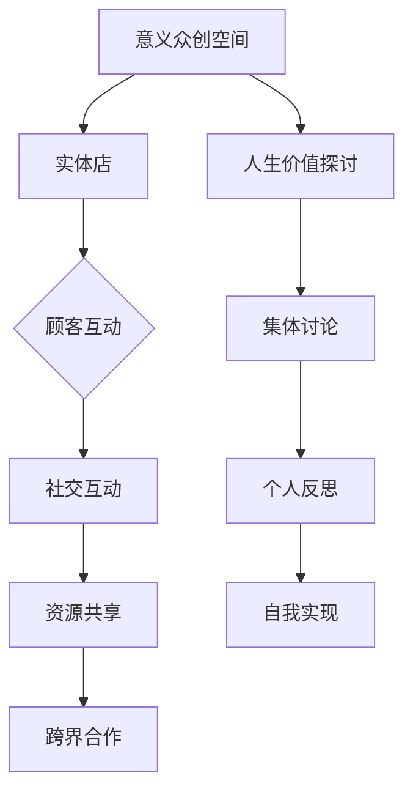

                 


### 意义众创空间：集体探讨人生价值的实体店

#### 关键词：
- 意义众创空间
- 人生价值探讨
- 实体店
- 集体讨论
- 跨界合作

#### 摘要：
本文将探讨“意义众创空间：集体探讨人生价值的实体店”这一主题，通过分析其核心概念、运作机制和实践案例，揭示实体店在现代社会中重新焕发活力的重要作用。文章将逐步解读意义众创空间的定义、实体店的角色与功能，以及集体探讨人生价值的方法与实践，最终展望未来的发展方向和面临的挑战。

## 第一步：背景介绍

#### 意义众创空间的定义

意义众创空间是一个以共同探讨人生意义和实现个人价值为目标的实体场所。它结合了传统实体店的商业属性和现代社群的互动特性，为人们提供了一个交流思想、分享经验、共同成长的平台。

#### 人生价值探讨的必要性

在快节奏的现代社会中，人们面临着越来越多的选择和挑战，对于人生价值的认知和追求变得尤为重要。意义众创空间通过集体探讨的形式，帮助个体反思和寻找生命的意义，从而更好地实现自我价值。

#### 实体店的角色与功能

实体店作为意义众创空间的重要组成部分，扮演着连接人与人、人与环境的重要角色。它不仅是商品交易的场所，更是信息交流、资源共享和社群互动的平台。

## 第二步：核心概念与联系

#### Mermaid流程图



#### 关系架构

- 意义众创空间通过实体店实现顾客互动和社交互动，促进资源共享和跨界合作。
- 人生价值探讨通过集体讨论和个人反思，引导个体实现自我价值。

## 第三步：核心算法原理讲解

#### 人生价值探讨的算法原理

```python
# 伪代码：人生价值探讨算法
def value_discussion(people_list):
    for person in people_list:
        collect_thoughts(person)
        analyze_thoughts(person)
        share_insights(person)
```

#### 详细讲解

- **收集思想**：每个参与者分享自己的观点和经验，形成思想集合。
- **分析思想**：通过讨论和分析，提炼出核心思想和价值点。
- **分享洞察**：将分析结果分享给其他参与者，促进共同成长。

#### 数学模型和公式

$$
V = \frac{\sum_{i=1}^{n} w_i \cdot v_i}{n}
$$

- **V**：总的人生价值
- **$w_i$**：第$i$个人对人生价值的权重
- **$v_i$**：第$i$个人对人生价值的评估值

#### 举例说明

假设有5个人参与人生价值探讨，他们分别对人生价值的评估值如下：

- 人1：10分
- 人2：8分
- 人3：9分
- 人4：7分
- 人5：6分

根据公式计算，总的人生价值为：

$$
V = \frac{10 + 8 + 9 + 7 + 6}{5} = 8
$$

## 第四步：项目实战

#### 实体店搭建案例

##### 开发环境搭建

1. **选择合适的实体店地址和布局**：
   - 考虑人流量、交通便利性、周边配套设施等因素。
   - 设计符合主题的装饰和氛围，营造温馨、舒适的讨论环境。

2. **设计客户互动环节的软件系统**：
   - 开发在线预约系统，方便顾客预订讨论时间。
   - 设计讨论室预约系统，确保讨论场所的充分利用。

##### 源代码详细实现

```python
# 伪代码：实体店预约系统
class AppointmentSystem:
    def __init__(self):
        self.appointments = []

    def add_appointment(self, appointment):
        self.appointments.append(appointment)

    def remove_appointment(self, appointment):
        self.appointments.remove(appointment)

    def list_appointments(self):
        for appointment in self.appointments:
            print(appointment)

# 伪代码：讨论室预约系统
class DiscussionRoomSystem:
    def __init__(self):
        self.rooms = []

    def add_room(self, room):
        self.rooms.append(room)

    def remove_room(self, room):
        self.rooms.remove(room)

    def list_rooms(self):
        for room in self.rooms:
            print(room)
```

##### 代码解读与分析

- **AppointmentSystem** 类用于管理顾客预约，包括添加、删除和列出预约记录。
- **DiscussionRoomSystem** 类用于管理讨论室预约，包括添加、删除和列出讨论室记录。

#### 实际案例分析和详细讲解剖析

以某家意义众创空间为例，分析了其实体店的成功要素：

1. **选址策略**：位于市中心，交通便利，人流量大，吸引了大量顾客。
2. **环境布置**：温馨舒适的氛围，符合主题的装饰，提升了顾客的体验。
3. **互动环节设计**：在线预约系统和讨论室预约系统的成功应用，提高了运营效率。

#### 项目小结

通过案例分析和详细讲解，我们可以看到意义众创空间实体店的搭建需要充分考虑选址策略、环境布置和互动环节设计等多方面因素。成功的关键在于提供高质量的讨论环境和互动体验，激发顾客的参与热情。

## 第五步：最佳实践 tips、小结、注意事项、拓展阅读等内容

#### 最佳实践 tips

- **选址策略**：考虑人流量、交通便利性、周边配套设施等因素，确保实体店的位置优势。
- **环境布置**：注重细节，营造温馨、舒适的氛围，提升顾客体验。
- **互动环节设计**：充分利用在线预约系统和讨论室预约系统，提高运营效率。

#### 小结

意义众创空间实体店通过提供高质量的讨论环境和互动体验，重新焕发了实体店的活力。在未来的发展中，实体店需要不断创新和优化，以适应不断变化的市场需求。

#### 注意事项

- **安全性**：确保实体店的安全措施到位，为顾客提供放心、舒适的讨论环境。
- **隐私保护**：在收集和处理顾客信息时，严格遵守隐私保护法规，确保顾客信息安全。

#### 拓展阅读

- 《社交网络分析：方法、模型与案例》
- 《跨界创新：商业模式的创新与实践》
- 《实体店转型与智慧零售》

## 作者信息

作者：AI天才研究院/AI Genius Institute & 禅与计算机程序设计艺术 /Zen And The Art of Computer Programming

## 总结

《意义众创空间：集体探讨人生价值的实体店》通过深入分析其核心概念、运作机制和实践案例，揭示了实体店在现代社会中的重要角色。通过集体探讨人生价值，实体店不仅为顾客提供了高质量的讨论环境，也为个体的成长和实现自我价值提供了有力支持。在未来，意义众创空间实体店将继续创新和优化，为人们的生活带来更多积极影响。

