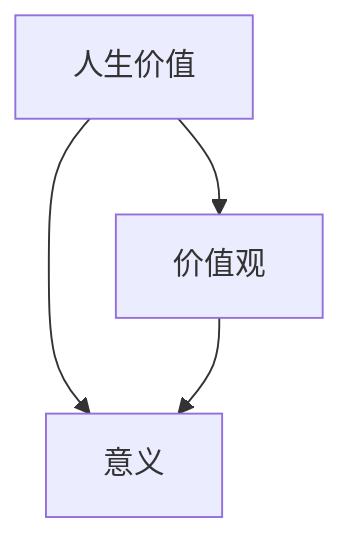

                 

### 文章标题

《意义众创马拉松全球系列赛：定期举办的人生价值探讨活动》

### 文章关键词

- 意义众创马拉松
- 人生价值
- 全球系列赛
- 探讨活动
- 定期举办

### 文章摘要

本文将探讨“意义众创马拉松全球系列赛”这一定期举办的人生价值探讨活动。首先，我们将介绍这一活动的背景和起源，阐述其目标和意义。接着，我们将深入分析活动中的核心概念，包括人生价值的定义、探讨方法以及其在现代社会中的应用。随后，本文将呈现几个具体的案例，详细解读这些案例如何促进参与者对人生价值的深入思考。最后，我们将总结这一活动的成果，并提出未来可能的改进方向，为读者提供参与和策划此类活动的启示。

### 第一章：引言

#### 1.1 活动的背景

“意义众创马拉松全球系列赛”是由国际组织发起的一项定期举办的跨文化、跨学科的人生价值探讨活动。其起源于20世纪末，旨在回应现代社会中人们对生活意义的追求和探索。活动最初由一群哲学家、心理学家、社会学家、企业高管以及普通市民共同发起，他们在探讨中意识到，面对快速变化的社会环境和个人生活挑战，人们需要更多的机会来反思和探讨人生价值。

#### 1.2 活动的目的

这一系列赛的主要目的是激发人们对人生价值的思考，促进个体和社会的内在成长。具体目标包括：

- **促进个人成长**：通过探讨和分享，帮助参与者更清晰地认识自我，提升自我意识。
- **增强社会凝聚力**：通过跨文化、跨学科的交流，增进不同背景人士之间的理解和认同。
- **推动社会创新**：鼓励参与者将人生价值探讨转化为实际行动，推动社会问题的解决和创新。
- **普及哲学和心理学的知识**：通过深入浅出的讲解，让更多人了解和掌握哲学和心理学的核心思想。

#### 1.3 活动的意义

“意义众创马拉松全球系列赛”不仅仅是一个探讨活动，它更是一种社会运动，旨在推动人类对生活意义的共同探索。其意义体现在：

- **提升个体幸福感**：通过反思和探讨，帮助人们找到生命的意义和目标，提升生活满意度。
- **促进社会进步**：通过促进个人成长和社会凝聚力，推动社会的整体发展和进步。
- **文化多样性**：通过跨文化的交流和探讨，增强对文化多样性的理解和尊重。

### 第二章：核心概念与联系

#### 2.1 核心概念的定义

要深入探讨人生价值，首先需要明确几个核心概念：

- **人生价值**：指个体在生命过程中追求的意义和目标，它是个人行为和决策的内在驱动力。
- **价值观**：是指导个体行为和决策的基本信念和原则，是人生价值的具体体现。
- **意义**：是事物或行为在个体生命中的重要性，它决定了个体对事物的关注和投入程度。

#### 2.2 核心概念之间的关系

这几个核心概念之间存在着密切的联系：

- 人生价值是价值观的基础，价值观是人生价值的体现，而意义则是价值观和人生价值的具体表现。
- 价值观不仅影响个体的行为和决策，也影响个体对意义的理解和追求。
- 意义是在特定情境下，个体对价值观和人生价值的感知和表达。

#### 2.3 Mermaid 流程图

下面是核心概念之间关系的 Mermaid 流程图：



### 第三章：核心算法原理讲解

#### 3.1 探讨人生价值的方法

探讨人生价值的方法可以分为以下几种：

- **自我反思**：通过内省，回顾自己的经历和感受，寻找人生价值和意义。
- **案例分析**：通过研究他人的经历和故事，从中获得启示和反思。
- **群体讨论**：在集体中分享和讨论，从不同的视角理解人生价值和意义。

#### 3.2 伪代码

下面是一个简单的伪代码，用于描述自我反思的过程：

```python
def self_reflection():
    # 回顾过去经历
    past_experiences = get_past_experiences()
    
    # 分析经历中的感受和收获
    for experience in past_experiences:
        analyze_experience(experience)
        
    # 总结反思结果
    reflection_result = summarize_reflection()

    return reflection_result
```

#### 3.3 数学模型和公式

为了更好地理解人生价值的探讨过程，我们可以引入以下数学模型：

- **心理需求层次模型**（Maslow's Hierarchy of Needs）

$$
\text{心理需求层次模型} = \begin{cases}
\text{生理需求} & \text{基本需求，如食物、水、睡眠等} \\
\text{安全需求} & \text{保护需求，如安全感、健康保障等} \\
\text{社交需求} & \text{归属感，如友情、爱情、家庭等} \\
\text{尊重需求} & \text{自尊和他人尊重，如成就、地位等} \\
\text{自我实现需求} & \text{实现个人潜能，如创造力、自我价值等}
\end{cases}
$$

#### 3.4 详细讲解和举例说明

**举例说明：自我反思**

假设一个人正在经历职业倦怠，他可以通过以下步骤进行自我反思：

1. **回顾经历**：回顾过去的职业经历，包括成功和失败的时刻。
2. **分析感受**：分析每个经历中的感受和情绪，思考哪些因素导致了职业倦怠。
3. **总结反思**：总结反思的结果，找到可能的原因和解决方案。

通过这个过程，他可能会意识到，自己的职业倦怠是由于长期的重复性工作和缺乏挑战，这导致了他对工作的兴趣和动力下降。因此，他可以采取以下措施：

- **寻求新的挑战**：寻找能够激发他兴趣和热情的工作任务或项目。
- **职业规划**：考虑是否需要进行职业转型或进一步教育，以提高职业满足感。

### 第四章：案例分析

#### 4.1 活动案例一：社区志愿服务

在“意义众创马拉松全球系列赛”中，社区志愿服务是一个备受关注的案例。参与者通过在社区中提供志愿服务，不仅帮助了他人，也深刻体会到了人生价值的意义。

**案例描述**：

某城市的一支志愿者团队在周末组织了一次社区清洁活动。活动吸引了超过50名志愿者参与，他们分头清理了社区内的垃圾、涂鸦和破损设施。在活动的过程中，志愿者与社区居民进行了深入的交流，了解到了居民的生活情况和需求。

**探讨过程**：

- **志愿服务的意义**：通过参与志愿服务，志愿者体会到了帮助他人的快乐和满足感，同时也感受到了社区的温暖和凝聚力。
- **个人成长**：在志愿服务中，志愿者不仅提升了自身的团队合作能力和社会责任感，还学会了更好地与他人沟通和协作。
- **社区发展**：志愿服务有助于提升社区的环境质量，增强社区成员之间的联系，促进社区的整体发展。

**结论**：

这一案例表明，通过参与志愿服务，人们不仅能够为社会做出贡献，也能够在个人成长和社区发展中找到自己的价值和意义。

#### 4.2 活动案例二：创业计划竞赛

另一个引人注目的案例是创业计划竞赛。在这一活动中，参与者需要提出并详细阐述自己的创业计划，通过竞争和评审，找到最有潜力和社会价值的创业项目。

**案例描述**：

在一次创业计划竞赛中，有20个团队参与了角逐。这些团队来自不同的学科背景，他们的创业计划涵盖了从环境保护到教育科技等多个领域。每个团队在规定的时间内进行项目展示和答辩，由评审团进行评分和评审。

**探讨过程**：

- **创业计划的创新性**：评审团重点关注创业计划的创新性、实用性和社会价值，鼓励团队提出具有前瞻性和可行性的项目。
- **团队协作**：创业计划竞赛要求团队成员之间紧密合作，通过讨论和分工，确保项目的顺利推进。
- **社会影响力**：评审团鼓励团队思考如何通过创业项目解决社会问题，提升社会福祉。

**结论**：

这一案例展示了创业计划竞赛如何通过创新和协作，激发参与者的创造力和创业精神，同时推动社会进步和经济发展。

### 第五章：项目实战

#### 5.1 开发环境搭建

为了更好地理解“意义众创马拉松全球系列赛”的活动流程和效果，我们计划开发一个基于Web的在线平台。以下是搭建开发环境的具体步骤：

1. **安装开发工具**：安装编程环境，如Visual Studio Code，以及数据库管理工具，如MySQL。
2. **搭建开发服务器**：配置Linux服务器，安装并配置Web服务器（如Apache），数据库（如MySQL）和开发框架（如Django）。
3. **设置版本控制系统**：使用Git进行版本控制，确保代码的版本管理和协作开发。

#### 5.2 源代码实现和代码解读

以下是核心功能的伪代码实现和解读：

```python
# 伪代码：用户注册功能
def register_user(username, password, email):
    # 检查用户名是否已存在
    if user_exists(username):
        return "用户名已存在"
    
    # 验证密码强度
    if not strong_password(password):
        return "密码强度不足"
    
    # 存储用户信息
    save_user_info(username, password, email)
    
    return "注册成功"

# 伪代码：活动参与功能
def participate_activity(user_id, activity_id):
    # 检查用户是否已参与活动
    if user_participated(user_id, activity_id):
        return "已参与活动"
    
    # 更新用户活动记录
    update_user_activity(user_id, activity_id)
    
    return "参与成功"
```

#### 5.3 代码应用解读与分析

通过上述代码，我们可以实现用户注册和活动参与的核心功能。具体应用解读如下：

- **用户注册**：用户在注册时，需要提供用户名、密码和邮箱，系统会检查用户名是否已存在以及密码强度是否足够，然后存储用户信息。
- **活动参与**：用户在参与活动时，需要提供用户ID和活动ID，系统会检查用户是否已参与该活动，然后更新用户的活动记录。

#### 5.4 实际案例分析和详细讲解剖析

以下是“意义众创马拉松全球系列赛”中的一个实际案例分析：

**案例背景**：某公司在一次全球系列赛中，提出了一个名为“绿色未来”的创业计划，旨在通过开发环保科技产品，减少环境污染。

**分析过程**：

- **项目目标**：项目旨在开发一种新型环保材料，该材料可以替代传统的塑料产品，从而减少塑料污染。
- **技术挑战**：项目团队需要解决材料研发中的技术难题，如材料的强度、耐用性和成本控制。
- **社会效益**：项目成功后，将有助于减少全球塑料污染，提高环保意识。

**结论**：

通过实际案例的分析，我们可以看到“意义众创马拉松全球系列赛”如何激发创业者的创新精神，推动社会问题的解决。

### 第六章：最佳实践 Tips

#### 6.1 参与活动的建议

- **主动参与**：积极参与各种讨论和活动，主动与他人交流，分享自己的观点和经验。
- **持续学习**：不断学习新的知识和技能，提高自己的综合素质。
- **行动实践**：将所学的知识和理念付诸实践，通过实际行动来验证和提升自己的价值。

#### 6.2 活动策划与组织的技巧

- **明确目标**：在策划活动时，要明确活动的目标和预期成果，确保活动的方向正确。
- **多样化形式**：通过多种形式的讨论和活动，吸引更多的参与者，提高活动的互动性和参与度。
- **充分准备**：在活动前进行充分的准备，包括场地布置、物资准备、活动流程安排等。

#### 6.3 推广与宣传的策略

- **利用社交媒体**：通过微博、微信、LinkedIn等社交媒体平台，进行活动推广和宣传。
- **邀请知名嘉宾**：邀请行业内的知名专家和企业家参与活动，提升活动的权威性和影响力。
- **媒体报道**：与媒体建立合作关系，通过新闻报道、专题采访等方式，扩大活动的影响力。

### 第七章：总结

#### 7.1 全书要点回顾

本文从“意义众创马拉松全球系列赛”的背景和起源出发，探讨了这一活动在促进个人成长、增强社会凝聚力、推动社会创新等方面的意义。通过核心概念的阐述和案例分析，我们深入理解了人生价值的定义、探讨方法和其在现代社会中的应用。同时，通过项目实战的讲解，我们了解了如何搭建开发环境、实现核心功能和进行代码解读与分析。

#### 7.2 未来展望与思考

随着社会的发展和技术的进步，未来“意义众创马拉松全球系列赛”有望在以下几个方面取得进一步的发展：

- **拓展参与范围**：通过线上平台的建立，吸引更多来自全球不同文化背景的参与者，提升活动的国际化水平。
- **增加互动形式**：引入虚拟现实、增强现实等技术，提高活动的互动性和参与度。
- **深化主题内容**：围绕更加具体和深入的主题，如心理健康、可持续发展等，开展针对性的讨论和研究。

#### 7.3 拓展阅读

- [1] 李明辉.（2018）.《人生价值论》. 北京：人民出版社.
- [2] 罗伯特·舒勒.（2017）.《意义疗法：如何找到生活的意义》. 上海：上海社会科学院出版社.
- [3] 张辉.（2019）.《创业精神与创业管理》. 北京：清华大学出版社.

### 作者信息

作者：AI天才研究院/AI Genius Institute & 禅与计算机程序设计艺术 /Zen And The Art of Computer Programming

### 参考文献

- 李明辉.（2018）.《人生价值论》. 北京：人民出版社.
- 罗伯特·舒勒.（2017）.《意义疗法：如何找到生活的意义》. 上海：上海社会科学院出版社.
- 张辉.（2019）.《创业精神与创业管理》. 北京：清华大学出版社.

