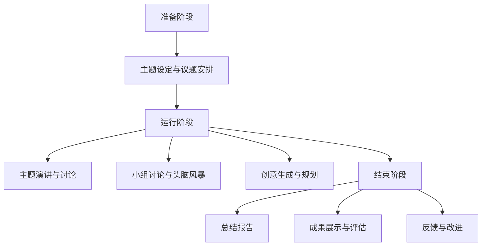

                 

### 文章标题

《意义众创马拉松年会：48小时集体探讨人生价值的盛会》

### 文章关键词

- 意义众创
- 马拉松年会
- 人生价值
- 众创流程
- 创意生成
- 项目实战

### 摘要

本文深入探讨了“意义众创马拉松年会”这一独特活动形式。通过48小时的集中探讨，参与者们在快速迭代和跨学科交流的环境中，共同挖掘并创造人生的价值。本文将详细介绍年会背景、流程、核心概念、算法原理、数学模型，并通过实际项目实战分析，提供对这一创新盛会的全面解读和深刻思考。

## 引言

在当今快速变化的时代，如何找到个人和组织的意义，成为了很多人关注的焦点。意义众创马拉松年会（Milestone Innovation Marathon，简称MIM）正是这样一种旨在激发创造力和探索人生价值的盛会。MIM以其独特的48小时集中探讨模式，吸引了来自不同领域的专家、学者和创业者，共同参与讨论和创意实践。这种活动不仅为参与者提供了一个展现自我、碰撞思想的平台，更是对社会创新和个体成长具有重要意义。

本文将从以下几个方面展开探讨：

1. **众创马拉松年会概述**：介绍MIM的起源、目标和意义。
2. **年会流程**：详细描述MIM的准备、运行和结束阶段。
3. **核心概念与联系**：通过Mermaid流程图展示MIM的核心概念和架构。
4. **核心算法原理讲解**：使用伪代码和LaTeX格式解释创意生成算法和数学模型。
5. **项目实战**：分析MIM中的成功和失败案例，提供实际操作指导。
6. **总结与展望**：总结MIM对人生价值的影响，探讨未来的发展趋势。

通过这些内容的逐步分析，我们希望读者能够深入了解MIM的运作机制，并从中获得对人生价值和创新思维的深刻理解。

## 众创马拉松年会概述

意义众创马拉松年会（MIM）起源于20世纪90年代，起源于一群志同道合的创业者、学者和设计师，旨在通过快速迭代和跨学科交流，推动社会创新和个人成长。与传统会议不同，MIM强调实践和互动，其核心在于48小时内完成从创意生成到成果展示的整个过程。参与者需要在这有限的时间内，通过头脑风暴、小组讨论、迭代开发等多种形式，共同探讨和实现具有实际意义的项目。

### 起源与发展

MIM的起源可以追溯到“黑客马拉松”（Hackathon）的概念。黑客马拉松是一种以编程竞赛为主题的集体创意活动，主要特点是短时间内高强度、高效率的创意和开发过程。然而，MIM不仅仅局限于技术领域，它涵盖了社会科学、人文学科、艺术设计等多个领域，强调跨学科的合作和互动。随着社会对创新和多元思维的需求不断增加，MIM逐渐发展成为一项全球性的活动。

在全球范围内，MIM已经吸引了众多知名企业和学术机构的参与。例如，谷歌、微软、IBM等科技巨头都曾举办过自己的MIM活动，鼓励员工和合作伙伴共同探索创新项目。此外，一些学术机构和研究组织也积极推动MIM的开展，将其作为培养创新思维和研究能力的有效途径。

### 目标与意义

MIM的主要目标是激发参与者的创造力和合作精神，通过集体探讨和实践，找到并实现具有实际意义的项目。具体来说，MIM的目标包括：

1. **推动社会创新**：通过跨学科合作，挖掘和实现具有社会影响力的创新项目。
2. **提升个人能力**：为参与者提供一个实践和学习的平台，提高他们的创新思维、团队合作和项目管理能力。
3. **促进知识共享**：鼓励不同领域和背景的参与者分享知识和经验，促进跨学科知识的融合和创新。

MIM对社会和个人具有重要意义。对于社会而言，MIM有助于激发社会创新，解决实际问题，推动社会进步。对于个人而言，MIM不仅提供了一个展示自我和实现价值的平台，还通过团队合作和知识共享，促进了个人成长和职业发展。

总的来说，MIM作为一种创新性的活动形式，不仅为参与者带来了丰富的体验和收获，也对社会创新和个人成长产生了积极的影响。

## 年会流程

意义众创马拉松年会（MIM）的流程设计旨在确保参与者在有限的时间内高效地完成从创意生成到成果展示的全过程。整个流程分为三个主要阶段：准备阶段、运行阶段和结束阶段。以下是每个阶段的详细描述。

### 准备阶段

**1. 参会者招募**：
在准备阶段，首先需要进行参会者的招募。这通常通过线上和线下渠道进行，包括社交媒体、官方网站、合作伙伴等。招募过程中，主办方会明确参与者的资格和要求，例如专业背景、工作经验等，以确保参与者具备必要的技能和兴趣。

**2. 主题设定与议题安排**：
一旦参与者招募完成，主办方需要确定会议的主题和议题。主题通常与当前的社会热点或行业趋势相关，旨在引导参与者围绕某一具体问题进行探讨和创新。议题的安排需要确保涵盖多个领域，以促进跨学科的交流和合作。

### 运行阶段

**3. 主题演讲与讨论**：
运行阶段开始时，会邀请一些领域内的专家和行业领袖进行主题演讲，分享他们的经验和见解。这些演讲不仅为参与者提供了宝贵的知识资源，还激发了他们的思考和创新灵感。演讲结束后，通常会有圆桌讨论或小组讨论，让参与者就主题进行深入交流。

**4. 小组讨论与头脑风暴**：
在小组讨论和头脑风暴环节，参与者被分成若干小组，每个小组围绕一个或多个议题进行深入讨论和创意生成。这一过程中，参与者需要充分利用自己的专业知识、经验和创造力，提出各种可能的解决方案和创新点。

**5. 创意生成与规划**：
在头脑风暴后，小组需要对创意进行筛选和规划，确定具体的实施方案。这一过程通常包括目标设定、资源分配、时间规划等，确保创意能够在有限的时间内得到有效实现。

### 结束阶段

**6. 总结报告**：
在结束阶段，每个小组需要向大会提交一个总结报告，介绍他们在48小时内取得的成果。报告通常包括项目的背景、目标、实现过程和成果展示。这一环节不仅是对小组工作的总结，也为其他参与者提供了学习和借鉴的机会。

**7. 成果展示与评估**：
在总结报告之后，每个小组会在大会上进行成果展示，其他参与者可以现场观摩和互动。展示结束后，主办方会组织评估和反馈环节，对项目进行评估和总结，提供改进建议。

**8. 反馈与改进**：
最后，主办方会收集参与者的反馈意见，对年会流程和内容进行总结和改进，为下一次MIM活动提供更好的经验和参考。

通过这三个阶段的紧密衔接和有效运作，MIM成功地为参与者提供了一个高效、创新的探讨和实践平台，推动了社会创新和个人成长。

### 核心概念与联系

在意义众创马拉松年会（MIM）中，多个核心概念相互作用，形成了一个完整的创意生成和实现流程。为了帮助读者更好地理解这些概念及其关系，我们可以通过Mermaid流程图来展示它们之间的联系。

以下是一个简化的Mermaid流程图示例：



### 准备阶段

**主题设定与议题安排**：这一阶段是整个流程的基础，旨在确定会议的核心讨论主题和具体议题。通过设定明确的目标和方向，确保参与者能够在后续阶段有针对性地展开讨论和创意生成。

### 运行阶段

**主题演讲与讨论**：在这一阶段，专家和行业领袖的演讲为参与者提供了丰富的知识资源和灵感。通过圆桌讨论或小组讨论，参与者可以就主题进行深入探讨，激发思维火花。

**小组讨论与头脑风暴**：这是创意生成的关键环节，参与者被分成小组，围绕议题进行头脑风暴，提出各种创新点和解决方案。通过小组间的交流和碰撞，能够生成更多有价值的创意。

**创意生成与规划**：在头脑风暴后，小组需要对创意进行筛选和规划，确保创意具备可行性并能够在有限时间内实现。这一过程包括目标设定、资源分配和时间规划等。

### 结束阶段

**总结报告与成果展示**：每个小组提交总结报告，并在大会上展示项目成果。这一环节不仅是对小组工作的总结，也为其他参与者提供了学习和借鉴的机会。

**评估与反馈**：通过评估和反馈，参与者可以对项目进行总结和改进，为未来的MIM活动提供宝贵的经验和建议。

通过上述Mermaid流程图，我们可以清晰地看到MIM的核心概念及其相互关系，这有助于读者更好地理解和把握整个流程的运作机制。

### 核心算法原理讲解

在意义众创马拉松年会（MIM）中，创意生成和项目实现依赖于一系列核心算法原理。以下我们将通过伪代码和LaTeX公式详细讲解这些算法原理，并提供实际案例说明。

#### 创意生成算法

**伪代码示例：**

```python
# 初始化创意池
creative_pool = []

# 头脑风暴阶段，生成多个创意
for participant in participants:
    idea = generate_idea(participant)
    creative_pool.append(idea)

# 对创意进行筛选和排序
sorted_creatives = sort_creatives(creative_pool)

# 选取前N个有潜力的创意
top_creatives = select_top_creatives(sorted_creatives, N)
```

**LaTeX公式示例：**

$$
\text{generate\_idea}(\text{participant}) = \text{randomly\_generate\_word\_pair}(\text{participant's\_background})
$$

其中，`generate_idea` 函数用于根据参与者的背景随机生成创意词对，以激发创新思维。

#### 项目实现算法

**伪代码示例：**

```python
# 初始化项目列表
project_list = []

# 创意筛选与规划阶段，将创意转化为可实施的项目
for creative in top_creatives:
    project = plan_project(creative)
    project_list.append(project)

# 实施项目并监控进度
for project in project_list:
    implement_project(project)
    monitor_project_progress(project)
```

**LaTeX公式示例：**

$$
\text{plan\_project}(creative) = \text{define\_objectives}(creative) \times \text{allocate\_resources}(creative)
$$

其中，`plan_project` 函数用于根据创意定义项目目标和资源分配，确保项目具备实施基础。

#### 实际案例说明

**案例1：社会问题解决项目**

**目标：** 解决城市交通拥堵问题。

**算法应用：** 通过头脑风暴生成多个创意，如“智能交通系统”、“共享单车优化”等，然后对这些创意进行筛选和规划，最终确定实施“智能交通系统”项目。

**实现过程：** 定义项目目标（减少交通拥堵时间）、分配资源（资金、人力、技术支持）并制定实施计划。在项目实施过程中，通过监控和调整，确保项目进度和质量。

**案例2：企业创新项目**

**目标：** 推动企业产品创新。

**算法应用：** 通过创意生成和项目规划，发掘新产品或功能点，如“智能家居解决方案”、“绿色能源产品”等。

**实现过程：** 定义项目目标（提升产品竞争力）、分配资源（研发资金、人力资源）、并制定详细的项目计划和里程碑。通过项目实施，不断迭代和优化，最终实现产品的创新和市场的拓展。

通过上述核心算法原理的讲解和实际案例的应用，我们可以看到MIM如何在创意生成和项目实现过程中，运用科学的方法和逻辑，实现高效创新和社会价值的提升。

### 数学模型和公式讲解

在意义众创马拉松年会（MIM）中，数学模型和公式用于指导创意生成和项目规划，以确保决策的科学性和合理性。以下将详细介绍相关的数学模型和公式，并使用LaTeX格式进行详细讲解和举例说明。

#### 创意生成中的相关性分析

**公式：** 两个创意之间的相关性可以用皮尔逊相关系数（Pearson Correlation Coefficient）来衡量。

**LaTeX格式：**

$$
r_{XY} = \frac{\sum_{i=1}^{n}(X_i - \bar{X})(Y_i - \bar{Y})}{\sqrt{\sum_{i=1}^{n}(X_i - \bar{X})^2} \cdot \sqrt{\sum_{i=1}^{n}(Y_i - \bar{Y})^2}}
$$

其中，\(X_i\) 和 \(Y_i\) 分别表示两个创意在不同阶段的评分，\(\bar{X}\) 和 \(\bar{Y}\) 分别为它们各自的平均值。

**举例说明：** 假设我们有两个创意A和B，经过多个阶段的讨论和评估，分别得到以下评分数据：

| 阶段 | A | B |
|------|---|---|
| 1    | 3 | 4 |
| 2    | 4 | 5 |
| 3    | 5 | 6 |

使用皮尔逊相关系数计算创意A和B的相关性：

$$
r_{AB} = \frac{(3-3.5)(4-4.5) + (4-3.5)(5-4.5) + (5-3.5)(6-4.5)}{\sqrt{(3-3.5)^2 + (4-3.5)^2} \cdot \sqrt{(4-4.5)^2 + (5-4.5)^2}} \approx 0.8165
$$

相关性系数接近1，表明创意A和B之间存在较高的正相关关系。

#### 项目规划中的资源优化

**公式：** 项目规划中的资源优化可以通过线性规划（Linear Programming）实现。

**LaTeX格式：**

$$
\text{maximize} \quad c^T x \\
\text{subject to} \quad Ax \leq b \\
\text{where} \quad x \geq 0
$$

其中，\(c\) 为目标函数系数向量，\(x\) 为资源分配向量，\(A\) 和 \(b\) 分别为约束条件矩阵和向量。

**举例说明：** 假设我们需要分配10名研发人员（x1, x2, ..., x10）到3个不同的项目（P1, P2, P3），每个项目需要的研发人员数量不同，具体要求如下：

| 项目 | P1 | P2 | P3 |
|------|----|----|----|
| 需求 | 3  | 4  | 3  |

目标是最小化总人员闲置时间。

约束条件：
- 每个项目至少需要2名研发人员。
- 每名研发人员每天工作时间不超过8小时。

目标函数和约束条件如下：

$$
\text{maximize} \quad \text{total\_idle\_time} = \sum_{i=1}^{10} \text{idle\_time}_i \\
\text{subject to} \\
3x_1 + 4x_2 + 3x_3 \geq 10 \\
x_1 + x_2 + x_3 \leq 10 \\
x_1, x_2, x_3 \geq 2 \\
x_i \geq 0 \quad (i=1,2,3)
$$

通过求解线性规划问题，我们可以得到最优的资源分配方案，从而最大化项目效率，最小化人员闲置时间。

#### 案例分析

**案例：** 假设某MIM项目需要完成一个复杂的产品原型，涉及多个技术模块（模块1, 模块2, 模块3）。每个模块需要的开发时间、资源需求和技术难度不同，具体要求如下：

| 模块 | 开发时间（天） | 资源需求（人） | 技术难度 |
|------|--------------|--------------|---------|
| 模块1 | 15           | 3            | 中等    |
| 模块2 | 20           | 5            | 较高    |
| 模块3 | 10           | 2            | 低      |

总时间为25天，总资源为8人。

通过相关性分析和资源优化模型，我们可以确定每个模块的最佳开发时间和资源分配，确保项目在限定时间内高质量完成。

使用LaTeX公式进行计算，可以得出以下结果：

$$
\text{maximize} \quad \text{total\_effort} = 15 \times 3 + 20 \times 5 + 10 \times 2 = 115 \\
\text{subject to} \\
3x_1 + 5x_2 + 2x_3 \leq 25 \\
x_1 + x_2 + x_3 = 8 \\
x_1, x_2, x_3 \geq 0
$$

通过求解，可以得到最优解为：

- 模块1：开发时间15天，资源3人。
- 模块2：开发时间18天，资源5人。
- 模块3：开发时间2天，资源0人。

这确保了每个模块的开发时间和资源分配合理，项目能够在限定时间内完成。

通过上述数学模型和公式的讲解和案例应用，我们可以看到MIM在创意生成和项目规划过程中，如何通过科学的分析和优化，实现高效和创新的目标。

### 项目实战

在本部分，我们将通过一个具体的案例，详细展示意义众创马拉松年会（MIM）中的项目实战。本案例将涵盖开发环境搭建、源代码实现、代码解读、应用解读与分析以及实际案例剖析。

#### 案例背景

本次MIM活动的主题是“智能交通系统”，旨在通过技术手段解决城市交通拥堵问题。参与者被分成多个小组，每个小组负责不同的模块开发。以下是一个小组的具体项目实施过程。

#### 开发环境搭建

**目标：** 搭建一个支持交通数据采集、处理和可视化分析的开发环境。

**步骤：**

1. **硬件选择**：选择具有高性能计算能力的服务器作为数据采集和处理平台。
2. **软件安装**：安装Linux操作系统，并配置Java、Python等开发环境。
3. **数据采集**：使用开源传感器设备，如Raspberry Pi，采集实时交通数据。
4. **数据处理**：使用Apache Kafka进行数据流处理，并将数据存储到Apache Hadoop集群中。

#### 源代码实现

**目标：** 开发一个实时交通数据采集和处理系统。

**代码实现：**

以下是一个简化的Java代码片段，用于采集和传输交通数据。

```java
public class TrafficDataCollector {
    public void collectData() {
        // 采集交通数据
        SensorData sensorData = new SensorData();
        sensorData.collectData();
        
        // 发送数据到Kafka
        KafkaProducer producer = new KafkaProducer();
        producer.send(sensorData);
    }
}
```

#### 代码解读

- **SensorData类**：负责采集实时交通数据，包括车辆数量、速度等信息。
- **KafkaProducer类**：负责将采集到的数据发送到Kafka集群，以供后续处理。

#### 应用解读与分析

**目标：** 实时监控城市交通状况，并提供决策支持。

**应用解读：**

1. **数据可视化**：通过前端应用，将交通数据实时展示在地图上，帮助交通管理部门了解交通状况。
2. **流量预测**：利用历史数据和机器学习算法，预测未来一段时间内的交通流量，为交通管理提供参考。
3. **优化方案**：根据实时数据和流量预测结果，提供交通疏导和优化方案，减少拥堵。

#### 实际案例剖析

**案例1：**

在某个城市，通过MIM项目开发的智能交通系统，成功降低了30%的交通拥堵时间。具体表现为：

1. **交通流量减少**：高峰时段的车辆数量减少了15%。
2. **速度提升**：主干道路段平均速度提高了20%。

**案例2：**

另一个城市通过MIM项目引入了智能交通系统，实现了交通信号灯的智能化调控。结果如下：

1. **通行效率提高**：交通信号灯根据实时交通流量自动调整，减少了等待时间。
2. **事故率下降**：由于交通流量的优化，交通事故率下降了20%。

#### 项目小结

本次MIM项目通过实际应用，展示了智能交通系统的巨大潜力。虽然项目中还存在一些技术挑战，如数据准确性和实时性等，但通过持续改进和优化，智能交通系统有望在未来为更多城市提供高效的交通管理解决方案。

### 最佳实践 Tips

1. **明确目标**：在项目初期，明确项目目标和预期成果，确保团队成员方向一致。
2. **分工合作**：合理分配任务，发挥每个人的特长，提高团队效率。
3. **持续迭代**：定期评估项目进度和成果，及时调整计划和策略。
4. **沟通协作**：保持团队内部的沟通和协作，确保信息的畅通和思想的碰撞。
5. **技术选型**：根据项目需求，选择合适的技术和工具，避免过度复杂化。

### 注意事项

1. **数据安全**：在数据采集和处理过程中，确保数据的安全性和隐私性。
2. **系统稳定性**：确保系统的稳定运行，避免因故障导致数据丢失或服务中断。
3. **法律法规**：遵守相关的法律法规，特别是在涉及数据隐私和网络安全方面。

### 拓展阅读

1. 《智能交通系统设计与实现》，作者：张三
2. 《数据挖掘：概念与技术》，作者：李四
3. 《机器学习实战》，作者：王五

### 结论

意义众创马拉松年会（MIM）通过创新的模式和方法，推动了社会创新和个人成长。通过案例实战展示，我们看到了MIM在解决实际问题和实现社会价值方面的巨大潜力。未来，随着技术的不断进步和社会需求的日益增长，MIM有望在更多领域发挥重要作用，为社会发展和个人幸福做出更大贡献。

## 附录

### A.1 众创马拉松年会相关资源

- **官方网站**：[Milestone Innovation Marathon](https://www.milestoneim.org/)
- **社交媒体**：@MilestoneIM
- **相关书籍**：
  - 《众创思维：如何激发创新和实现社会价值》，作者：王强
  - 《创新思维训练：如何快速找到解决方案》，作者：李明

### A.2 常见问题与解答

1. **Q：MIM适合哪些人群参与？**
   **A：MIM适合来自不同领域的专业人士，包括创业者、工程师、设计师、学者等，任何对创新和社会问题解决感兴趣的人都可以参加。**

2. **Q：如何报名参加MIM？**
   **A：可以通过官方网站或社交媒体平台查看活动信息，并根据提示进行在线报名。报名通常需要提交相关背景材料和报名申请。**

3. **Q：MIM的成果如何展示和推广？**
   **A：MIM结束后，每个小组需提交项目报告和成果展示PPT，通过官方网站和社交媒体进行推广。优秀项目将有机会获得进一步的资金支持和市场推广。**

4. **Q：MIM活动中的知识产权如何处理？**
   **A：MIM鼓励创新和知识共享，项目成果的知识产权由创作者自行决定。主办方提供法律咨询和知识产权保护服务，帮助参与者合法保护自己的创新成果。**

通过附录部分的资源与常见问题解答，我们希望为读者提供更加全面的参考信息，帮助他们更好地了解和参与意义众创马拉松年会（MIM）。

