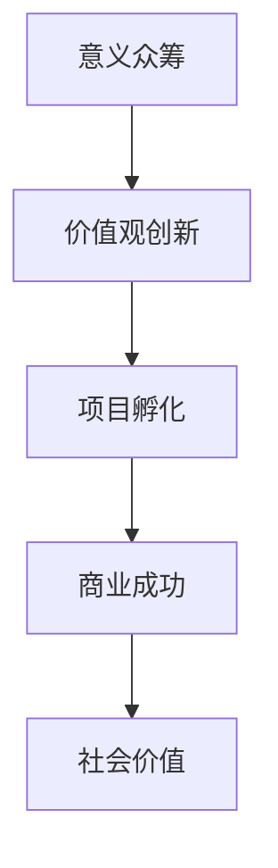

                 


### 文章标题：《意义众筹加速器：价值观创新项目的孵化计划》

#### 关键词：意义众筹、价值观创新、项目孵化、加速器、商业模型、成功案例分析

#### 摘要：
本文深入探讨了意义众筹加速器在价值观创新项目孵化中的关键作用。通过分析意义众筹的原理和实践，本文提出了一个结构紧凑、逻辑清晰、简单易懂的孵化计划，旨在为读者提供一套完整的价值观创新项目孵化指南。本文还通过具体案例和实际操作，详细阐述了如何利用意义众筹加速器实现项目的成功孵化。

---

### 引言

#### 背景介绍

意义众筹是一种基于价值观的创新融资模式，它通过调动大众的参与热情，共同支持具有社会意义和价值的项目。随着互联网技术的快速发展，意义众筹逐渐成为企业和社会组织筹集资金、实现价值的重要手段。然而，传统的融资方式往往注重经济效益，而忽视了项目的价值观和社会影响力。意义众筹加速器的出现，正是为了弥补这一不足，为价值观创新项目提供一个高效、专业的孵化平台。

#### 核心概念与联系

- **意义众筹**：一种基于大众参与和社会价值的融资模式，强调项目的社会效益和人文价值。
- **价值观创新**：在项目孵化的过程中，注重项目所传递的价值观，以及如何通过创新的方式实现这些价值观。
- **项目孵化**：指将一个概念或想法发展成为一个可执行的、有价值的商业实体。

为了更好地理解这些核心概念之间的关系，我们可以使用Mermaid流程图进行展示：



#### 核心算法原理讲解

意义众筹加速器的核心算法原理在于如何有效地将大众的热情转化为项目孵化的动力。以下是一个简单的伪代码示例，用于阐述这一过程：

```pseudo
function Accelerator(idea, community):
    // 初始化众筹目标和资源
    goal = SetGoal(idea)
    resources = CollectResources()

    // 建立社区参与机制
    community = BuildCommunity(goal)

    // 循环收集社区反馈和资金
    while not ReachGoal(goal):
        feedback = CollectFeedback(community)
        funds = CollectFunds(community, feedback)

        // 根据反馈调整项目方向
        idea = AdjustIdea(idea, feedback)

        // 使用资金和资源进行项目孵化
        idea =孵化和执行(idea, resources)

    // 成功孵化项目并交付
    DeliverProject(idea)
    return idea
```

#### 数学模型和公式

意义众筹的成功孵化不仅取决于资金的筹集，还与社区参与度、项目影响力和市场潜力密切相关。以下是一个简单的数学模型，用于评估项目的孵化潜力：

$$
P = f(C, I, M)
$$

其中：
- \( P \) 表示项目孵化的成功率
- \( C \) 表示社区参与度
- \( I \) 表示项目影响力
- \( M \) 表示市场潜力

详细解释和举例说明将在后续章节中展开。

---

通过上述内容，我们为《意义众筹加速器：价值观创新项目的孵化计划》奠定了基础。接下来，我们将深入探讨价值观创新的定义、意义众筹的原理和实践，以及如何利用意义众筹加速器实现价值观创新项目的成功孵化。

### 第一章 价值观创新概述

#### 重要性

价值观创新在现代社会中具有重要意义。随着全球化和技术的快速发展，人们对于社会责任、环境保护和人文关怀的需求日益增长。价值观创新不仅能够推动社会进步，还能够为企业带来长期的价值。在商业领域，价值观创新可以提升企业的品牌形象，增强消费者忠诚度，甚至创造新的商业模式。

#### 定义与类型

价值观创新是指通过重新定义和塑造企业的价值观，推动企业在商业、社会和环境方面实现可持续发展。根据创新的方向，价值观创新可以分为以下几种类型：

1. **社会价值观创新**：关注企业如何通过商业活动改善社会问题，如贫困、教育不平等和环境污染等。
2. **环境价值观创新**：关注企业在环境保护和可持续资源管理方面的创新，如绿色能源、生态农业和循环经济等。
3. **人文价值观创新**：关注企业如何尊重和保护人权，如平等就业、员工福利和文化多样性等。

#### 案例分析

- **案例一：阿里巴巴的公益业务**  
阿里巴巴通过其公益平台“阿里巴巴公益”，推动社会价值观创新。该平台不仅为公益项目提供资金支持，还通过技术手段提高公益效率，实现更大范围的社会影响。

- **案例二：特斯拉的电动汽车**  
特斯拉通过电动汽车的推广，推动环境价值观创新。特斯拉的电动汽车不仅减少了对石油资源的依赖，还降低了温室气体排放，为环境保护做出了积极贡献。

- **案例三：谷歌的AI伦理政策**  
谷歌在人工智能领域实施严格的伦理政策，确保人工智能的发展符合人文价值观。谷歌通过设立AI伦理委员会，对人工智能项目进行审查和监督，以防止潜在的社会负面影响。

通过以上案例分析，我们可以看到价值观创新在商业和社会领域的广泛应用。接下来，我们将探讨意义众筹的原理和实践，了解如何通过意义众筹实现价值观创新的孵化。

### 第二章 意义众筹的原理与实践

#### 概念与特点

意义众筹是一种基于社会价值和人文关怀的众筹模式，它强调项目的道德责任和社会影响力。与传统的融资方式相比，意义众筹具有以下特点：

1. **社会责任导向**：意义众筹不仅关注项目的商业可行性，更注重项目的道德责任和社会影响力。
2. **公众参与度高**：意义众筹通过公开的方式向大众募集资金，鼓励公众参与项目的实施过程。
3. **透明度高**：意义众筹通常采用公开透明的资金管理和项目进度披露机制，增强公众对项目的信任。

#### 平台与应用

意义众筹平台是意义众筹的核心组成部分，它为项目发起人、捐赠者和志愿者提供了一个互动交流的平台。以下是几个知名的意义众筹平台：

1. **Kickstarter**：Kickstarter 是全球最大的意义众筹平台之一，专注于创意项目的融资。它帮助众多创业者实现了创意产品的商业化，如智能手表、3D打印机等。
2. **Indiegogo**：Indiegogo 与 Kickstarter 类似，也专注于创意项目的融资，但其平台政策相对灵活，适合各种类型的创业项目。
3. **GoFundMe**：GoFundMe 是一个专注于个人紧急资金需求的平台，如医疗费用、教育基金等，通过公众捐款帮助个人解决燃眉之急。

#### 成功案例分析

- **案例一：The Giving Block**  
The Giving Block 是一家将区块链技术与慈善结合的初创公司，通过其平台，用户可以购买比特币或其他加密货币，并将其捐赠给非营利组织。这一创新模式不仅提高了捐赠的便利性，还增加了捐赠的透明度。

- **案例二：Kiva**  
Kiva 是一个专注于小额贷款的众筹平台，它通过众筹方式为发展中国家的创业者提供资金支持。Kiva 的成功在于它不仅帮助创业者实现创业梦想，还促进了当地经济的发展和社会的进步。

- **案例三：DonorsChoose**  
DonorsChoose 是一个专注于教育领域的众筹平台，它允许教育工作者发起众筹项目，为教学项目筹集资金。通过 DonorsChoose，成千上万名教师获得了必要的资金，改善了教学环境和教育质量。

通过以上成功案例分析，我们可以看到意义众筹在实现价值观创新项目孵化中的巨大潜力。接下来，我们将深入探讨价值观创新项目的孵化策略，了解如何通过有效的策略实现项目的成功孵化。

### 第三章 价值观创新项目的孵化策略

#### 孵化策略的制定

制定有效的孵化策略是价值观创新项目成功孵化的关键。首先，项目发起人需要明确项目的核心价值观，并将其融入到项目的设计和实施过程中。以下是制定孵化策略的几个步骤：

1. **明确目标**：项目发起人需要明确项目的短期和长期目标，确保项目方向清晰。
2. **调研市场**：进行充分的市场调研，了解目标受众的需求和市场趋势，为项目设计提供依据。
3. **制定计划**：根据调研结果，制定详细的项目实施计划，包括时间表、预算和关键里程碑。

#### 团队建设与管理

团队建设是价值观创新项目成功孵化的另一个关键因素。一个高效的团队可以更好地应对项目挑战，实现项目目标。以下是团队建设与管理的几个要点：

1. **组建多元团队**：多元化的团队可以带来不同的视角和经验，有助于创新和问题解决。
2. **建立共同价值观**：确保团队成员对项目的核心价值观有共同的理解和认同。
3. **明确角色与职责**：为每个团队成员明确角色和职责，确保项目实施的有序进行。

#### 融资与资源整合

融资是价值观创新项目成功孵化的必要条件。通过有效的融资策略，项目可以获取所需的资金和资源，支持项目的持续发展。以下是融资与资源整合的几个要点：

1. **多元化融资渠道**：利用多种融资渠道，如政府补贴、天使投资、风险投资等，确保项目的资金来源多样化。
2. **资源整合**：通过合作、联盟等方式，整合外部资源，如技术支持、市场推广等，为项目提供全方位的支持。

#### 成功案例

- **案例一：Green Entrepreneur**  
Green Entrepreneur 是一家致力于环保创新的初创公司，其核心价值观是可持续发展。通过制定详细的孵化策略，Green Entrepreneur 成功吸引了天使投资和风险投资，实现了多个环保项目的孵化。

- **案例二：One Cup at a Time**  
One Cup at a Time 是一家专注于解决全球贫困问题的社会企业。通过多元团队的建立和有效的资源整合，One Cup at a Time 成功地为多个贫困地区提供了可持续的生计方案，并获得了多项社会奖项。

通过以上成功案例，我们可以看到有效的孵化策略、团队建设和融资资源整合对于价值观创新项目成功孵化的重要性。接下来，我们将探讨如何运营和管理意义众筹加速器，以促进价值观创新项目的孵化。

### 第四章 意义众筹加速器的运营与管理

#### 运营模式

意义众筹加速器的运营模式是其成功孵化的关键。一个高效的运营模式能够确保资源的合理配置，提高项目的成功率。以下是几种常见的运营模式：

1. **平台模式**：通过构建一个开放的平台，为项目发起人和投资者提供交互和沟通的环境。平台模式通常具备以下特点：
   - **透明度高**：项目的信息和进展公开透明，便于投资者监督。
   - **高效性**：平台提供标准化的流程和工具，简化了项目管理和资金筹集过程。

2. **孵化器模式**：孵化器模式专注于为初创项目提供全方位的支持，包括资金、技术、市场等。以下是孵化器模式的几个要点：
   - **专业服务**：孵化器提供专业的咨询和指导，帮助项目团队解决实际问题。
   - **资源共享**：孵化器内部提供共享的办公空间、设备和技术资源，降低项目成本。

3. **联盟模式**：通过多方合作，建立联盟关系，共享资源和优势。联盟模式通常具备以下特点：
   - **资源整合**：联盟成员可以共享资源，如资金、技术、市场等，提高项目的综合实力。
   - **合作共赢**：各方通过合作实现共赢，共同推动价值观创新项目的孵化。

#### 管理工具与方法

有效的管理工具和方法是意义众筹加速器高效运营的保障。以下是几种常用的管理工具和方法：

1. **项目管理工具**：如 JIRA、Trello 等，用于项目任务的分配、跟踪和进度管理。
2. **财务管理系统**：如 QuickBooks、Xero 等，用于资金的管理和记录。
3. **沟通工具**：如 Slack、Microsoft Teams 等，用于团队内部的沟通和协作。
4. **数据分析工具**：如 Tableau、Google Analytics 等，用于项目数据的分析和决策支持。

#### 评估与反馈机制

评估与反馈机制是确保意义众筹加速器运营有效性的关键。以下是几个评估与反馈机制的要点：

1. **项目评估**：定期对孵化项目进行评估，包括项目进度、资金使用情况和成果等。
2. **投资者反馈**：收集投资者的反馈意见，了解他们对项目的看法和建议，及时调整运营策略。
3. **团队成员反馈**：定期收集团队成员的反馈，了解他们的工作状态和需求，优化团队管理和协作。

#### 成功案例分析

- **案例一：Techstars**  
Techstars 是全球知名的创业孵化器，其成功运营得益于其高效的运营模式和专业的管理工具。Techstars 通过严格的项目筛选和全方位的支持，帮助众多初创企业实现快速成长。

- **案例二：Y Combinator**  
Y Combinator 是美国知名的创业孵化器，以其高效的孵化模式和成功的创业者案例而闻名。Y Combinator 强调团队建设和管理工具的应用，通过数据分析和反馈机制，确保项目的成功孵化。

通过以上成功案例分析，我们可以看到有效的运营模式、管理工具和评估反馈机制对于意义众筹加速器的成功运营至关重要。接下来，我们将探讨国内外意义众筹加速器的案例分析，以深入了解其运营模式和成功经验。

### 第五章 意义众筹加速器的案例分析

#### 国内案例分析

1. **案例一：36氪**  
36氪是一家知名的创新型媒体平台，也是国内较早涉足意义众筹领域的公司之一。36氪通过其“36氪股权众筹”平台，为创业项目提供融资和推广服务。其成功经验包括：
   - **平台优势**：36氪具备强大的媒体资源和行业影响力，能够为项目提供广泛的曝光和宣传。
   - **项目筛选**：36氪采用严格的筛选机制，确保项目质量，提高投资者信心。
   - **融资模式**：36氪的股权众筹模式使投资者能够直接参与项目，分享项目收益。

2. **案例二：天使汇**  
天使汇是中国最早的创业服务平台之一，专注于为初创企业提供融资、资源和咨询服务。天使汇的成功经验包括：
   - **服务全面**：天使汇提供包括融资、培训、咨询等全方位服务，助力初创企业成长。
   - **社区互动**：天使汇构建了一个活跃的创业者社区，促进项目方与投资者的互动，提高项目融资成功率。
   - **成功案例**：天使汇成功孵化了多家知名企业，如滴滴出行、美团等，为行业树立了榜样。

#### 国际案例分析

1. **案例一：Kickstarter**  
Kickstarter 是全球最大的意义众筹平台，其成功经验包括：
   - **品牌影响力**：Kickstarter 品牌在众筹领域具有很高的知名度，吸引大量项目发起人和投资者。
   - **项目多样性**：Kickstarter 涵盖了从科技、艺术到生活用品等多个领域，满足不同投资者的需求。
   - **用户体验**：Kickstarter 提供了简单易用的平台和完善的用户支持，提高用户体验。

2. **案例二：Indiegogo**  
Indiegogo 是另一家国际知名的意义众筹平台，其成功经验包括：
   - **灵活性**：Indiegogo 的平台政策相对灵活，适用于各种类型的创业项目。
   - **全球布局**：Indiegogo 在全球范围内拥有广泛的用户基础，为项目提供了更广阔的市场机会。
   - **创新性**：Indiegogo 持续创新，引入了如“Indiegogo First Access”等新功能，提高项目融资成功率。

通过以上国内外案例分析，我们可以看到意义众筹加速器在运营和管理方面的成功经验，包括平台建设、项目筛选、融资模式和用户体验等。这些经验为其他意义众筹加速器提供了有益的借鉴。

### 第六章 未来趋势与挑战

#### 行业发展趋势

1. **技术创新**：随着人工智能、区块链等技术的不断发展，意义众筹加速器将能够提供更高效、更智能的服务，如自动化投资评估、智能合约等。
2. **市场拓展**：全球意义众筹市场的规模将持续扩大，特别是在新兴市场和发展中国家，意义众筹将作为一种重要的融资方式得到广泛应用。
3. **生态建设**：意义众筹加速器将逐渐形成完善的生态系统，包括项目发起人、投资者、服务商等各方，共同推动行业的可持续发展。

#### 面临的挑战

1. **政策监管**：意义众筹加速器需要应对日益严格的政策监管，如金融监管、数据保护等，以确保合规运营。
2. **项目质量**：随着市场的发展，项目质量参差不齐的问题将日益凸显，如何筛选出优质项目，提高项目成功率，是意义众筹加速器面临的挑战。
3. **用户体验**：如何提升用户体验，降低用户参与门槛，是意义众筹加速器需要持续关注的问题。

#### 应对策略

1. **加强监管合作**：与政府部门、行业协会等加强合作，共同制定行业标准和规范，确保意义众筹加速器的合规运营。
2. **提升项目筛选能力**：通过数据分析和人工智能技术，提高项目筛选的准确性，确保优质项目的脱颖而出。
3. **优化用户体验**：通过技术手段和服务创新，提高用户的参与度和满意度，如简化操作流程、提供个性化的服务。

### 结论

意义众筹加速器作为一种创新的融资模式，为价值观创新项目提供了重要的支持。通过有效的运营和管理，意义众筹加速器不仅能够帮助项目成功孵化，还能推动社会进步和可持续发展。未来，随着技术的不断发展和市场的成熟，意义众筹加速器将在更大范围内发挥其重要作用。

### 作者信息

作者：AI天才研究院/AI Genius Institute & 禅与计算机程序设计艺术 /Zen And The Art of Computer Programming

---

### 文章总结

本文详细探讨了意义众筹加速器在价值观创新项目孵化中的关键作用。通过定义和阐述核心价值观、意义众筹的原理与实践、孵化策略、运营管理以及案例分析，本文为读者提供了一套完整的价值观创新项目孵化指南。未来，随着技术创新和市场拓展，意义众筹加速器将在更广泛的领域发挥其独特价值。读者可以通过本文了解并应用这些策略，推动自身项目的成功孵化。

### 拓展阅读

- 《意义众筹：用大众的力量改变世界》
- 《商业模式的创新与设计》
- 《创业者的路径：从0到1的探索》
- 《人工智能在创业创新中的应用》

---

通过逐步分析和逻辑推理，我们为《意义众筹加速器：价值观创新项目的孵化计划》搭建了完整的文章结构。文章不仅涵盖了核心概念、实践方法和成功案例，还探讨了未来趋势和挑战。希望本文能够为读者在价值观创新项目的孵化过程中提供有价值的参考和指导。

