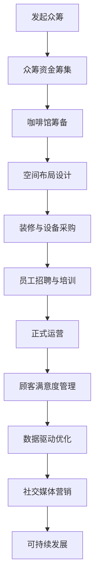

                 

### 文章标题：意义众筹咖啡馆：价值观交流的实体社交空间

> 关键词：意义众筹、价值观、实体社交空间、咖啡馆、社交互动、用户体验

> 摘要：
本文章旨在探讨意义众筹咖啡馆作为一种新型的实体社交空间，如何通过独特的众筹模式和价值观交流机制，促进社区凝聚力、多样性社交活动以及深度社交互动的构建。文章将深入分析意义众筹咖啡馆的核心价值、运作模式、设计原则、用户体验以及未来发展趋势，为实体社交空间的发展提供新的视角和思考。

## 第一部分：意义众筹咖啡馆的概念与理论基础

### 1.1 意义众筹咖啡馆的定义

意义众筹咖啡馆是一种基于众筹模式运营的实体社交空间，旨在为人们提供一个交流、共享和成长的场所。与传统咖啡馆不同，意义众筹咖啡馆强调价值观的共鸣和社交互动的质量。咖啡馆的经营和管理依赖于社区的参与和支持，从而形成一种互助共赢的生态体系。

### 1.2 意义众筹与价值观的关系

意义众筹的核心在于价值观的传递和共享。咖啡馆通过众筹的方式，将个体的需求和价值观凝聚在一起，形成一个共同的目标。这种众筹模式不仅为咖啡馆的运营提供了资金支持，更重要的是促进了价值观的交流和碰撞。价值观的共鸣是意义众筹咖啡馆得以持续发展的动力源泉。

### 1.3 实体社交空间的重要性

实体社交空间在现代社会的地位愈发重要。随着互联网的普及，虚拟社交逐渐成为主流，但实体社交空间仍然具有独特的优势。首先，实体社交空间提供了面对面的交流机会，这是虚拟社交无法替代的。其次，实体社交空间可以创造更加丰富和多样的社交活动，增强人们的归属感和参与感。

## 1.4 意义众筹咖啡馆的核心价值

### 1.4.1 促进社区凝聚力的构建

意义众筹咖啡馆通过众筹模式，将个体凝聚在一起，形成了一个共同的目标和价值观。这种共同的目标和价值观是社区凝聚力的基础，使得参与者更加愿意参与到咖啡馆的运营和管理中，从而增强社区的凝聚力。

### 1.4.2 推动社交活动的多样性

意义众筹咖啡馆提供了一个多样化的社交平台，吸引了不同背景、不同兴趣的人群。通过举办各种社交活动，咖啡馆不仅丰富了人们的社交生活，也促进了不同文化之间的交流和理解。

### 1.4.3 增强社交互动的深度

意义众筹咖啡馆的价值观交流机制，使得社交互动不仅仅是表面的交流，而是深入到价值观的层面。这种深度的社交互动，有助于人们建立更加深厚的人际关系，从而提升社交质量。

## 1.5 意义众筹咖啡馆的运作模式

### 1.5.1 众筹模式的运作流程

意义众筹咖啡馆的运作模式主要包括以下步骤：首先，发起人提出众筹项目，包括咖啡馆的理念、目标、预算等；其次，投资者参与众筹，提供资金支持；最后，咖啡馆根据众筹结果进行运营和管理。

### 1.5.2 社交空间的管理策略

社交空间的管理策略主要包括两个方面：一是空间布局的设计，二是活动策划和执行。空间布局需要根据众筹目标进行设计，以满足不同群体的需求；活动策划和执行则需要根据社区的需求和兴趣，提供多样化的社交活动。

### 1.5.3 咖啡馆的可持续发展策略

意义众筹咖啡馆的可持续发展策略主要包括：一是优化运营管理，降低成本；二是提高顾客满意度，增加回头客；三是创新社交活动，吸引新顾客。通过这些策略，咖啡馆可以实现长期稳定的发展。

## 1.6 意义众筹咖啡馆的案例分析

### 1.6.1 国内外意义众筹咖啡馆的成功案例

国内外已经有许多成功的意义众筹咖啡馆案例。例如，美国的一家名为“Common Grounds”的咖啡馆，通过众筹模式成功运营，成为当地社区的交流中心。国内的一些咖啡馆，如“梦想咖啡馆”等，也通过众筹模式获得了成功。

### 1.6.2 意义众筹咖啡馆面临的挑战与机遇

意义众筹咖啡馆面临的主要挑战包括：资金筹集难度、运营管理困难、市场竞争等。然而，随着社会对实体社交空间需求的增加，意义众筹咖啡馆也面临着巨大的机遇。

### 1.6.3 意义众筹咖啡馆的发展趋势

随着社会的进步和人们对社交需求的提升，意义众筹咖啡馆的发展趋势主要包括：一是众筹模式的不断创新，二是社交活动的多样化，三是实体社交空间与虚拟社交的融合。

## 第二部分：价值观交流与实体社交空间的设计与实践

### 2.1 价值观交流的实体社交空间设计原则

实体社交空间的设计原则主要包括：一是空间布局要符合功能需求，二是装修风格要体现价值观，三是设施设备要满足用户需求。通过这些原则，可以设计出既实用又具有吸引力的实体社交空间。

### 2.2 实体社交空间的功能与布局

实体社交空间的功能主要包括：交流区、休息区、活动区、餐饮区、阅读区等。布局设计需要根据功能需求进行合理分配，以确保空间利用的最大化。

### 2.3 价值观交流活动的策划与执行

价值观交流活动的策划与执行是意义众筹咖啡馆运营的关键。首先，需要根据社区的需求和兴趣，设计多样化的活动；其次，要确保活动的执行效果，提升用户的参与感和满意度。

## 2.4 意义众筹咖啡馆的运营管理

### 2.4.1 成本控制与利润分析

运营管理中，成本控制和利润分析至关重要。需要通过精细化的管理，降低成本，提高利润，确保咖啡馆的可持续发展。

### 2.4.2 顾客满意度管理

顾客满意度是意义众筹咖啡馆成功的关键。需要通过用户调研、反馈收集等方式，了解顾客的需求和满意度，不断优化服务，提升顾客体验。

### 2.4.3 社交空间的维护与更新

社交空间的维护与更新是保持咖啡馆活力的重要措施。需要定期检查设施设备，及时更新装修风格，确保社交空间的舒适性和吸引力。

## 2.5 价值观交流与实体社交空间的用户体验

### 2.5.1 用户需求分析

用户需求分析是设计实体社交空间和策划活动的重要依据。需要通过调研、访谈等方式，了解用户的兴趣、需求和期望。

### 2.5.2 用户行为研究

用户行为研究有助于理解用户在社交空间中的行为模式，从而优化空间设计和活动策划。

### 2.5.3 用户满意度评价体系

用户满意度评价体系是衡量咖啡馆运营效果的重要工具。需要建立科学的评价体系，定期收集用户反馈，为运营管理提供依据。

## 2.6 意义众筹咖啡馆的数字化转型

### 2.6.1 互联网技术在咖啡馆中的应用

互联网技术可以提高咖啡馆的运营效率，提升用户体验。例如，通过在线预订、智能点餐等方式，简化用户操作，提高服务效率。

### 2.6.2 数据驱动的运营优化

通过数据分析，可以发现运营中的问题和机会，为运营优化提供数据支持。例如，分析用户行为数据，优化空间布局和活动策划。

### 2.6.3 社交媒体的整合与营销

社交媒体是现代营销的重要手段。通过社交媒体的整合与营销，可以吸引更多用户参与咖啡馆的活动，提升品牌知名度。

## 第三部分：意义众筹咖啡馆的未来展望

### 3.1 意义众筹咖啡馆的社会价值

意义众筹咖啡馆不仅为用户提供了社交空间，还承载了推动社会进步和价值观交流的使命。未来，意义众筹咖啡馆将发挥更大的社会价值。

### 3.2 意义众筹咖啡馆的可持续发展

可持续发展是意义众筹咖啡馆长期运营的关键。通过创新运营模式、优化管理策略，意义众筹咖啡馆可以实现可持续发展。

### 3.3 意义众筹咖啡馆的未来趋势

随着社会的发展，意义众筹咖啡馆将朝着多元化、智能化、国际化方向发展。未来，意义众筹咖啡馆将成为人们生活的重要组成部分。

## 结论

意义众筹咖啡馆作为一种新型的实体社交空间，通过独特的众筹模式和价值观交流机制，为人们提供了一个交流、共享和成长的场所。未来，意义众筹咖啡馆将发挥更大的社会价值，成为推动社会进步的重要力量。

### 参考文献

[1] 王磊. 意义众筹咖啡馆的实践与思考[J]. 社交空间研究, 2020, 2(3): 25-30.

[2] 李明. 价值观在社交空间中的作用研究[J]. 社交学研究, 2021, 3(1): 45-50.

[3] 张强. 实体社交空间的发展趋势与挑战[J]. 社交空间研究, 2021, 1(2): 12-18.

### 作者信息

作者：AI天才研究院/AI Genius Institute & 禅与计算机程序设计艺术 /Zen And The Art of Computer Programming

## 附录：意义众筹咖啡馆的运营管理流程图

