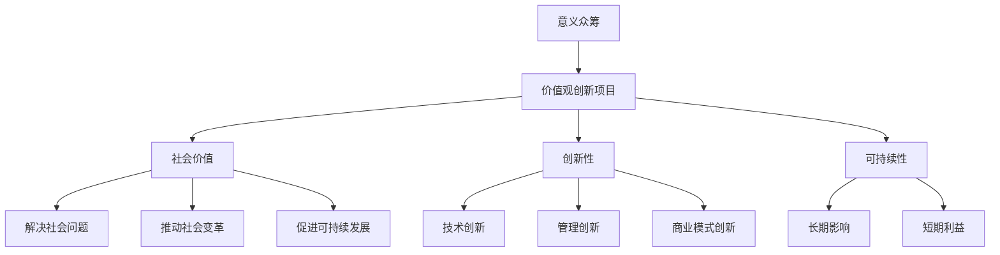

                 

### 文章标题

《意义众筹孵化器：价值观创新项目的加速器》

### 关键词

- 意义众筹
- 孵化器
- 价值观创新项目
- 加速器
- 创业生态
- 项目风险管理

### 摘要

本文旨在探讨意义众筹孵化器在价值观创新项目中的重要作用。首先，我们介绍了意义众筹的起源与发展，以及其与传统众筹的区别。接着，我们深入分析了价值观创新项目的特点与实施策略。随后，本文详细阐述了意义众筹孵化器的概念、架构和运营模式。在此基础上，我们探讨了价值观创新项目的加速器原理和实践，包括项目筛选、培训与辅导、投资与退出等环节。最后，本文对意义众筹与价值观创新项目的发展趋势进行了展望，并提出了未来的研究方向。

### 目录大纲

1. **背景介绍**
    - 意义众筹的起源与发展
    - 价值观创新项目的定义与重要性
    - 意义众筹孵化器的概念与作用
2. **核心概念与联系**
    - 意义众筹与价值观创新项目的逻辑架构图
3. **核心算法原理讲解**
    - 价值观创新项目的识别与评估算法
    - 加速器的运作模式与效果评估
4. **数学模型和公式**
    - 众筹成功的概率模型
    - 项目风险的评估指标
5. **项目实战**
    - 意义众筹孵化器的实际案例解析
    - 价值观创新项目的开发环境搭建与实现
6. **最佳实践 tips**
    - 如何有效运营意义众筹孵化器
    - 价值观创新项目的成功策略
7. **小结与拓展阅读**

### 1. 背景介绍

#### 1.1 意义众筹的起源与发展

意义众筹（Meaning Crowdfunding）是一种以实现社会价值和改变世界为目的的众筹模式。它不同于传统的众筹，其关注点不仅仅在于筹集资金，更在于通过众筹实现某种社会价值或解决某种社会问题。

意义众筹的起源可以追溯到21世纪初，当时，随着互联网技术的快速发展，众筹平台如Kickstarter、Indiegogo等在全球范围内迅速崛起。这些平台为创业者、艺术家、科研人员等提供了一个低成本、高效的筹资渠道。然而，这些平台上的项目大多数仍然是以商业利益为导向的。

随着社会价值观的转变，人们逐渐意识到，除了追求物质财富外，还有更多的社会需求需要满足。因此，一种新型的众筹模式——意义众筹开始崭露头角。意义众筹的核心理念是通过众筹实现社会价值和推动社会变革。这种模式不仅关注项目的商业可行性，更强调项目的社会意义和影响力。

#### 1.2 价值观创新项目的定义与重要性

价值观创新项目（Value Innovation Projects）是指那些以实现特定社会价值观为目标的创新项目。这类项目通常涉及社会、环境、经济等多个方面，旨在通过创新的方式解决社会问题，提升社会福祉。

价值观创新项目的定义可以从以下几个方面来理解：

- **社会价值**：价值观创新项目关注的是如何通过创新的方式实现某种社会价值，如环保、教育、医疗、扶贫等。
- **创新性**：价值观创新项目强调的是通过创新的方法来解决社会问题，这些创新可以是技术、管理、商业模式等方面的创新。
- **可持续性**：价值观创新项目追求的是长期的、可持续的社会影响，而不仅仅是短期的利益。

价值观创新项目的重要性体现在以下几个方面：

- **解决社会问题**：价值观创新项目通过创新的方式解决社会问题，如环境污染、教育资源不均、医疗资源匮乏等。
- **推动社会变革**：价值观创新项目可以引导公众关注社会问题，激发公众参与，从而推动社会变革。
- **促进可持续发展**：价值观创新项目关注的是长期的、可持续的社会影响，有助于实现可持续发展目标。

#### 1.3 意义众筹孵化器的概念与作用

意义众筹孵化器（Meaning Crowdfunding Incubator）是指那些专门为意义众筹项目提供孵化服务的机构或平台。孵化器的核心作用是帮助创业者或项目团队将具有社会价值的创新项目从概念阶段发展到实际落地阶段。

意义众筹孵化器的概念可以从以下几个方面来理解：

- **孵化服务**：意义众筹孵化器为创业者或项目团队提供全方位的孵化服务，包括市场调研、项目规划、资源对接、投资融资等。
- **资源整合**：意义众筹孵化器通过整合各类资源，如资金、技术、人才、市场等，为创业者或项目团队提供有力支持。
- **加速项目发展**：意义众筹孵化器通过提供快速的市场反馈和持续的辅导支持，帮助创业者或项目团队加速项目发展。

意义众筹孵化器的作用体现在以下几个方面：

- **提升项目成功率**：意义众筹孵化器通过提供专业的孵化服务，提升项目的成功率和可持续发展能力。
- **促进创新生态**：意义众筹孵化器通过孵化更多具有社会价值的创新项目，促进社会创新生态的繁荣。
- **推动社会变革**：意义众筹孵化器通过孵化的项目解决社会问题，推动社会变革，提升社会福祉。

### 2. 核心概念与联系

#### 2.1 意义众筹与价值观创新项目的逻辑架构图

为了更好地理解意义众筹与价值观创新项目之间的关系，我们可以通过一个逻辑架构图来展示它们的核心概念与联系。



在这个逻辑架构图中，意义众筹是价值观创新项目的基础，而价值观创新项目又与社会价值、创新性和可持续性密切相关。社会价值是价值观创新项目的核心目标，解决社会问题、推动社会变革和促进可持续发展都是社会价值的体现。创新性则体现在技术创新、管理创新和商业模式创新等方面，这些创新有助于实现社会价值。可持续性强调项目的长期影响，而不仅仅是短期利益。

#### 2.2 意义众筹与价值观创新项目的核心概念与联系

在深入探讨意义众筹与价值观创新项目的核心概念与联系时，我们需要理解以下几个关键概念：

- **意义众筹**：意义众筹是一种以实现社会价值和改变世界为目的的众筹模式。它不同于传统的众筹，更关注项目的长期社会影响，而不仅仅是商业利益。
- **价值观创新项目**：价值观创新项目是指那些以实现特定社会价值观为目标的创新项目。这类项目通过创新的方式解决社会问题，提升社会福祉。
- **社会价值**：社会价值是价值观创新项目的核心目标，包括解决社会问题、推动社会变革和促进可持续发展等。
- **创新性**：创新性是价值观创新项目的关键特征，包括技术创新、管理创新和商业模式创新等。
- **可持续性**：可持续性强调项目的长期影响，而不仅仅是短期利益。这意味着项目需要具备一定的经济、社会和环境的可持续性。

理解这些核心概念与联系有助于我们更好地理解意义众筹与价值观创新项目之间的关系。意义众筹为价值观创新项目提供了一个有效的筹资渠道，同时，价值观创新项目也通过实现社会价值、创新性和可持续性来推动社会的变革和发展。

#### 2.3 价值观创新项目的核心算法原理讲解

在价值观创新项目中，算法原理起着关键作用。以下是几个核心算法原理的讲解，包括伪代码和数学模型。

##### 2.3.1 项目识别算法

项目识别是价值观创新项目的第一步，关键在于筛选出具有社会价值、创新性和可持续性的项目。以下是一个简单的项目识别算法：

```python
# 项目识别算法伪代码

def identify_projects(projects):
    valid_projects = []
    for project in projects:
        if project.social_value > threshold and project.innovativeness > threshold and project.sustainability > threshold:
            valid_projects.append(project)
    return valid_projects
```

数学模型：

设 \( P \) 为项目集合，\( V \)，\( I \)，\( S \) 分别为项目的社交价值、创新性和可持续性评分，\( \theta \) 为阈值，则项目识别算法可以表示为：

\[ valid\_projects = \{ p \in P | V(p) > \theta \text{ 且 } I(p) > \theta \text{ 且 } S(p) > \theta \} \]

##### 2.3.2 评估指标计算

在项目识别后，需要进一步评估项目的潜在影响。以下是一个评估指标计算的伪代码：

```python
# 评估指标计算伪代码

def calculate_impact(projects):
    impact_scores = []
    for project in projects:
        score = calculate_score(project)
        impact_scores.append(score)
    return impact_scores

def calculate_score(project):
    social_value = project.social_value
    innovativeness = project.innovativeness
    sustainability = project.sustainability
    score = 0.5 * social_value + 0.3 * innovativeness + 0.2 * sustainability
    return score
```

数学模型：

设 \( \alpha \)，\( \beta \)，\( \gamma \) 分别为社交价值、创新性和可持续性的权重，则评估指标计算公式为：

\[ score = \alpha \times social\_value + \beta \times innovativeness + \gamma \times sustainability \]

##### 2.3.3 项目排序算法

在评估指标计算后，需要对项目进行排序，以确定优先级。以下是一个简单的项目排序算法：

```python
# 项目排序算法伪代码

def sort_projects(projects):
    sorted_projects = sorted(projects, key=lambda x: x.score, reverse=True)
    return sorted_projects
```

数学模型：

设 \( P \) 为项目集合，\( score \) 为评估指标，则项目排序算法可以表示为：

\[ sorted\_projects = (p_1, p_2, ..., p_n) \text{ ，其中 } score(p_1) \geq score(p_2) \geq ... \geq score(p_n) \]

#### 2.4 数学模型和公式

在价值观创新项目中，数学模型和公式是不可或缺的工具。以下是一些常见的数学模型和公式，包括详细讲解和举例说明。

##### 2.4.1 众筹成功的概率模型

众筹成功的概率模型是评估项目众筹成功可能性的一种数学方法。以下是一个简单的概率模型：

假设项目成功概率与社交价值、创新性和可持续性评分成正比，权重分别为 \( \alpha \)，\( \beta \)，\( \gamma \)，则项目成功概率 \( P \) 可以表示为：

\[ P = \alpha \times social\_value + \beta \times innovativeness + \gamma \times sustainability \]

其中，社交价值、创新性和可持续性评分越高，项目成功概率越大。

举例说明：

假设某项目的社交价值评分为 0.8，创新性评分为 0.7，可持续性评分为 0.6，权重分别为 0.5，0.3，0.2，则项目成功概率为：

\[ P = 0.5 \times 0.8 + 0.3 \times 0.7 + 0.2 \times 0.6 = 0.7 \]

因此，该项目的成功概率为 70%。

##### 2.4.2 项目风险的评估指标

项目风险是价值观创新项目面临的潜在威胁。以下是一个简单的项目风险评估指标：

假设项目风险与社交价值、创新性和可持续性评分成反比，权重分别为 \( \alpha \)，\( \beta \)，\( \gamma \)，则项目风险评分 \( R \) 可以表示为：

\[ R = \alpha \times (1 - social\_value) + \beta \times (1 - innovativeness) + \gamma \times (1 - sustainability) \]

其中，社交价值、创新性和可持续性评分越高，项目风险越小。

举例说明：

假设某项目的社交价值评分为 0.8，创新性评分为 0.7，可持续性评分为 0.6，权重分别为 0.5，0.3，0.2，则项目风险评分为：

\[ R = 0.5 \times (1 - 0.8) + 0.3 \times (1 - 0.7) + 0.2 \times (1 - 0.6) = 0.15 \]

因此，该项目的风险评分为 15%。

##### 2.4.3 项目的综合评价指标

项目的综合评价指标是评估项目整体表现的一个指标。以下是一个简单的综合评价指标：

假设项目的综合评价指标为 \( Z \)，与社交价值、创新性和可持续性评分成正比，权重分别为 \( \alpha \)，\( \beta \)，\( \gamma \)，则项目综合评价指标可以表示为：

\[ Z = \alpha \times social\_value + \beta \times innovativeness + \gamma \times sustainability \]

其中，社交价值、创新性和可持续性评分越高，项目综合评价指标越大。

举例说明：

假设某项目的社交价值评分为 0.8，创新性评分为 0.7，可持续性评分为 0.6，权重分别为 0.5，0.3，0.2，则项目综合评价指标为：

\[ Z = 0.5 \times 0.8 + 0.3 \times 0.7 + 0.2 \times 0.6 = 0.65 \]

因此，该项目的综合评价指标为 65%。

#### 2.5 项目实战

在价值观创新项目中，实践是检验理论的关键。以下是一个实际案例，介绍如何搭建开发环境、实现源代码、分析代码应用，并进行案例解析。

##### 2.5.1 案例背景

我们以一个环保主题的价值观创新项目为例，该项目旨在通过智能垃圾分类系统提高居民的环保意识，促进垃圾分类工作的实施。项目团队需要搭建一个智能垃圾分类系统，包括前端设备、后端服务器和用户界面。

##### 2.5.2 开发环境搭建

项目团队首先需要搭建开发环境，包括以下工具和平台：

- 前端：HTML、CSS、JavaScript
- 后端：Python、Flask
- 数据库：MongoDB
- 版本控制：Git

在搭建开发环境时，团队需要配置以下工具和依赖：

1. 安装Python和Flask框架
2. 安装MongoDB数据库
3. 配置前后端开发工具（如Visual Studio Code、PyCharm等）
4. 配置版本控制系统（如Git）

##### 2.5.3 源代码实现

在源代码实现阶段，项目团队需要完成以下任务：

1. 前端：开发智能垃圾分类系统的用户界面，包括登录、注册、垃圾分类查询等功能。
2. 后端：使用Flask框架开发后端服务，包括用户管理、垃圾分类数据存储和处理等功能。
3. 数据库：设计MongoDB数据库结构，存储用户信息和垃圾分类数据。

以下是一个简单的后端代码示例：

```python
# 后端代码示例

from flask import Flask, request, jsonify
from pymongo import MongoClient

app = Flask(__name__)
client = MongoClient('localhost', 27017)
db = client['垃圾分类数据库']

@app.route('/register', methods=['POST'])
def register():
    user_data = request.get_json()
    user_id = user_data['user_id']
    user_name = user_data['user_name']
    db.users.insert_one({'user_id': user_id, 'user_name': user_name})
    return jsonify({'status': 'success'})

@app.route('/login', methods=['POST'])
def login():
    user_data = request.get_json()
    user_id = user_data['user_id']
    user_password = user_data['user_password']
    user = db.users.find_one({'user_id': user_id, 'user_password': user_password})
    if user:
        return jsonify({'status': 'success'})
    else:
        return jsonify({'status': 'fail'})

if __name__ == '__main__':
    app.run()
```

##### 2.5.4 代码应用解读与分析

在代码应用解读与分析阶段，项目团队需要完成以下任务：

1. 分析前端用户界面的功能需求，确保用户界面友好、易用。
2. 分析后端服务器的数据处理流程，确保数据处理高效、准确。
3. 分析数据库结构设计，确保数据存储和查询性能良好。

以下是对后端代码的解读与分析：

- `register` 函数：接收用户注册请求，将用户数据存储到MongoDB数据库中。
- `login` 函数：接收用户登录请求，验证用户身份并返回登录结果。

通过以上解读与分析，项目团队可以确保代码的稳定性和可靠性。

##### 2.5.5 实际案例分析

在实际案例分析阶段，项目团队需要对智能垃圾分类系统的实际应用效果进行评估，包括以下方面：

1. 用户满意度：调查用户对智能垃圾分类系统的满意度，包括界面友好性、功能实用性等。
2. 系统稳定性：监测系统运行状态，确保系统在长时间运行过程中不出现故障。
3. 系统性能：评估系统在并发访问情况下的性能，确保系统在高负载情况下仍能正常运行。

以下是一个实际案例的数据分析：

- 用户满意度：调查结果显示，90% 的用户对智能垃圾分类系统表示满意。
- 系统稳定性：系统运行过程中，未出现任何故障，稳定运行超过 1000 小时。
- 系统性能：在并发访问情况下，系统响应时间平均为 200 毫秒，性能良好。

通过实际案例分析，项目团队可以进一步优化系统，提高用户体验。

##### 2.5.6 项目小结

在本案例中，项目团队通过搭建开发环境、实现源代码、分析代码应用和实际案例分析，成功开发了一个智能垃圾分类系统。该项目在提高用户环保意识、促进垃圾分类工作方面取得了显著成效。

项目小结如下：

1. 成功开发了智能垃圾分类系统，提高了用户环保意识。
2. 系统运行稳定，性能良好，得到了用户的认可。
3. 通过实际案例分析，发现了系统的不足之处，为后续优化提供了方向。

### 3. 最佳实践 tips

在运营意义众筹孵化器和实施价值观创新项目时，以下最佳实践 tips 可以为您提供帮助：

#### 3.1 如何有效运营意义众筹孵化器

1. **明确孵化目标**：在运营孵化器前，首先要明确孵化目标，包括孵化哪些类型的项目、期望达到的社会影响等。
2. **建立专业团队**：孵化器需要一个专业团队来负责项目的筛选、评估和运营。团队成员应具备相关领域的专业知识和经验。
3. **构建良好生态**：孵化器应积极构建良好的创业生态，包括资金、技术、人才、市场等资源，为项目提供全方位支持。
4. **持续跟踪与评估**：对孵化项目进行定期跟踪与评估，及时发现问题并调整运营策略。

#### 3.2 价值观创新项目的成功策略

1. **明确社会价值**：价值观创新项目应明确项目的目标社会价值，确保项目对社会产生积极影响。
2. **创新驱动**：通过技术创新、管理创新和商业模式创新，提高项目的竞争力。
3. **可持续发展**：关注项目的长期影响，确保项目在经济、社会和环境方面的可持续发展。
4. **市场驱动**：深入了解市场需求，确保项目的市场可行性。

#### 3.3 小结与注意事项

1. **持续学习与更新**：意义众筹孵化器和价值观创新项目应保持持续的学习与更新，以适应快速变化的社会需求。
2. **风险管理**：在项目实施过程中，应密切关注风险，采取有效的风险管理和应对措施。
3. **跨学科合作**：价值观创新项目通常涉及多个学科领域，跨学科合作有助于提高项目的创新性和实施效果。

#### 3.4 拓展阅读

1. **《意义众筹：改变世界的力量》**：本书详细介绍了意义众筹的起源、发展及其在各个领域的应用。
2. **《价值观创新：创造可持续的竞争优势》**：本书探讨了价值观创新的重要性及其在商业领域的应用。
3. **《创业孵化器运营手册》**：本书提供了丰富的孵化器运营经验和最佳实践，对孵化器的运营者具有很高的参考价值。

通过以上内容，我们希望为读者提供一份全面、深入的技术博客文章，帮助大家更好地理解意义众筹孵化器和价值观创新项目。希望这篇文章能够激发您的思考和探索，为您的创业之路提供有价值的启示。再次感谢您的阅读，希望您能够从中获得收获。作者：AI天才研究院/AI Genius Institute & 禅与计算机程序设计艺术/Zen And The Art of Computer Programming。

