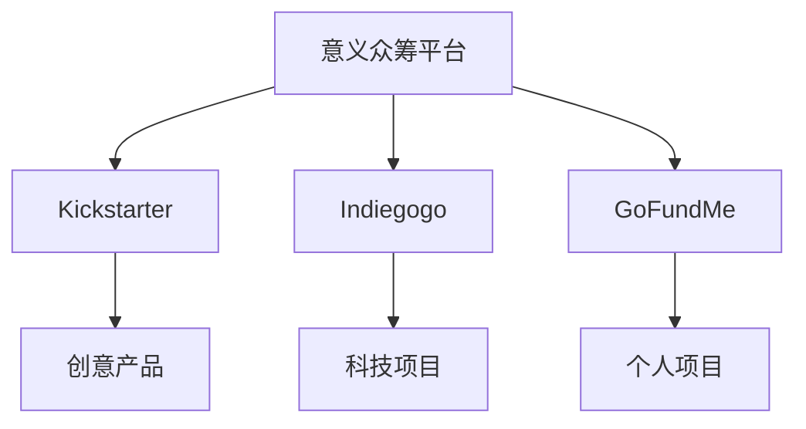
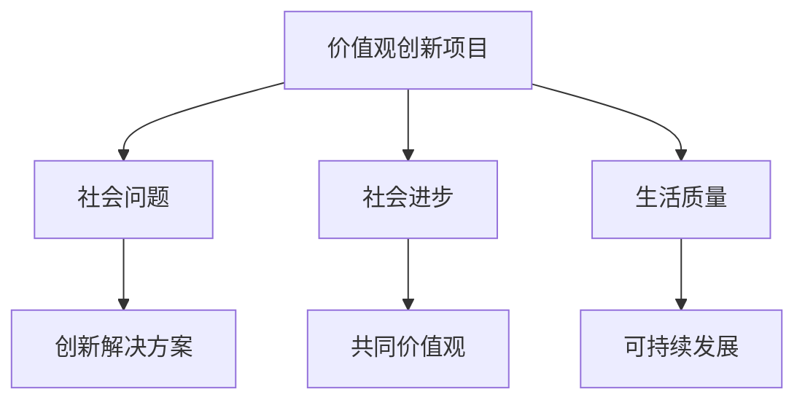

                 

### 文章标题

## 意义众筹孵化器：价值观创新项目的支持平台

### 关键词：意义众筹、价值观创新、众筹平台、孵化器、支持、价值观、创新

### 摘要

本文将深入探讨“意义众筹孵化器：价值观创新项目的支持平台”这一概念。我们将从背景介绍、核心概念与联系、核心算法原理讲解、数学模型和数学公式、项目实战等多个角度，详细分析如何通过意义众筹平台支持价值观创新项目。我们将探讨现有的众筹平台，了解价值观创新项目的定义和识别方法，分析众筹孵化的过程和策略，并提供具体的案例研究，以总结最佳实践和注意事项。

---

## 引言

### 1.1 意义众筹的定义

意义众筹是一种基于共同价值观和目标的众筹模式，不同于传统的基于财务回报的众筹。意义众筹的核心理念在于通过筹集资金来支持具有社会、环境或文化价值的创新项目。这些项目往往能够引发社会共鸣，激发人们的参与热情。

### 1.2 意义众筹的重要性

意义众筹的重要性体现在多个方面。首先，它为创新项目提供了资金支持，尤其是那些难以通过传统融资渠道获得资金的创业项目。其次，意义众筹能够加强社区凝聚力，促进社会参与和合作。最后，它有助于推动社会的可持续发展和创新。

### 1.3 书籍的目标和结构

本文的目标是提供一个全面的理解，帮助读者了解如何通过意义众筹平台支持价值观创新项目。我们将分为以下几个部分：

1. **意义众筹平台**：介绍现有的意义众筹平台，分析其特点。
2. **价值观创新项目**：定义和识别价值观创新项目。
3. **众筹孵化**：讲解如何进行众筹孵化。
4. **众筹策略**：分析成功的众筹策略。
5. **持续发展**：探讨众筹后的项目发展。
6. **案例研究**：提供具体的案例进行分析。
7. **未来展望**：展望意义众筹的发展趋势。

---

## 第1章 意义众筹平台

### 2.1 现有平台的概述

目前，市面上存在多个意义众筹平台，如Kickstarter、Indiegogo、GoFundMe等。这些平台各有特点，适用于不同的项目类型和目标群体。

#### Mermaid 流程图



### 2.2 各平台的特点与优缺点

- **Kickstarter**：以创意产品为主，支持者可以获得回报。优点：广泛的受众群体；缺点：竞争激烈。
- **Indiegogo**：以科技项目和创意产品为主，支持者可以选择不同的回报选项。优点：灵活性高；缺点：费用较高。
- **GoFundMe**：以个人项目为主，如医疗费用、教育资金等。优点：透明度高；缺点：资金回收较慢。

### 2.3 如何选择合适的众筹平台

选择合适的众筹平台需要考虑以下因素：

- **项目类型**：不同平台适合不同类型的项目。
- **目标受众**：了解目标受众的喜好和习惯，选择合适的平台。
- **预算**：考虑平台的费用结构，确保预算合理。

---

## 第2章 价值观创新项目

### 3.1 价值观创新项目的定义

价值观创新项目是指那些基于积极价值观的创新项目，旨在解决社会问题、推动社会进步或提高生活质量。

#### 核心概念与联系 Mermaid 流程图



### 3.2 价值观创新项目的识别

识别价值观创新项目需要关注以下几个方面：

- **项目目标**：是否具有积极的社会价值。
- **解决方案**：是否创新且具有实际可行性。
- **受众反馈**：是否受到目标受众的认可。

### 3.3 价值观创新项目的类型

价值观创新项目可以涵盖多个领域，如：

- **环境保护**
- **社会公益**
- **教育创新**
- **健康医疗**

#### 案例分析

以“环保餐具项目”为例，该项目旨在减少一次性餐具的使用，推广可重复使用的环保餐具。该项目通过众筹平台筹集资金，获得了广泛的关注和支持，取得了显著的社会影响力。

---

## 第3章 众筹孵化

### 4.1 众筹孵化的过程

众筹孵化是一个系统化的过程，包括以下几个阶段：

1. **项目策划**：明确项目目标、解决方案和预期成果。
2. **预热准备**：制定众筹计划，包括目标金额、时间、宣传策略等。
3. **正式众筹**：在众筹平台上发布项目，吸引支持者。
4. **资金管理**：合理使用筹集到的资金，确保项目顺利进行。

#### 核心算法原理讲解

```plaintext
// 众筹孵化算法
class CrowdfundingIncubation {
    Project project;
    CrowdfundingPlatform platform;
    double targetFunding;
    double collectedFunding;
    int daysUntilDeadline;

    // 初始化众筹孵化器
    CrowdfundingIncubation(Project project, CrowdfundingPlatform platform, double targetFunding) {
        this.project = project;
        this.platform = platform;
        this.targetFunding = targetFunding;
        this.collectedFunding = 0;
        this.daysUntilDeadline = platform.getDeadlineInDays();
    }

    // 策划项目
    void planProject() {
        // 确定项目目标、解决方案和预期成果
    }

    // 预热准备
    void prepareForCampaign() {
        // 制定众筹计划
        // 宣传策略
    }

    // 正式众筹
    void startCampaign() {
        // 发布项目
        // 吸引支持者
    }

    // 资金管理
    void manageFunding() {
        // 合理使用资金
    }

    // 检查众筹状态
    void checkCampaignStatus() {
        // 是否达到目标资金
        // 是否超过截止日期
    }
}
```

### 4.2 如何制定众筹计划

制定众筹计划需要考虑以下要素：

- **目标金额**：根据项目需求和可行性确定。
- **时间**：选择合适的时间段，确保有足够的时间进行宣传和筹集资金。
- **宣传策略**：包括线上和线下活动，如社交媒体推广、活动宣传等。

### 4.3 如何进行项目预热

项目预热是众筹成功的关键，以下是一些有效的预热策略：

- **建立社区**：在众筹前建立社交媒体群组或论坛，吸引潜在支持者。
- **发布预告**：提前发布项目预告，吸引关注。
- **互动活动**：组织互动活动，提高参与度。

---

## 第4章 众筹策略

### 5.1 成功众筹的关键因素

成功众筹的关键因素包括：

- **项目吸引力**：项目本身是否具有足够的吸引力。
- **宣传力度**：是否进行了充分的宣传和推广。
- **目标明确**：目标金额、时间、预期成果是否明确。

### 5.2 不同阶段的众筹策略

- **预热阶段**：发布预告，建立社区，提高关注度。
- **启动阶段**：加大宣传力度，发布详细项目计划，吸引首批支持者。
- **中期阶段**：保持活跃，更新项目进度，吸引更多支持者。
- **冲刺阶段**：发布特别优惠，提高项目知名度，争取最后支持。

### 5.3 风险与应对措施

众筹过程中可能面临以下风险：

- **资金不足**：制定合理的预算和资金管理计划。
- **项目延迟**：确保项目进度，及时更新进展。
- **法律风险**：遵守相关法律法规，确保众筹合法。

---

## 第5章 持续发展

### 6.1 众筹后的管理

众筹成功后，项目团队需要：

- **项目实施**：按照计划推进项目。
- **资金管理**：合理使用筹集到的资金。
- **沟通反馈**：与支持者保持沟通，及时反馈项目进展。

### 6.2 项目的持续发展策略

项目持续发展策略包括：

- **社区建设**：建立和维护支持者社区，提高项目影响力。
- **后续融资**：寻求后续融资，确保项目持续发展。
- **合作拓展**：与其他项目或组织合作，共同推动社会进步。

### 6.3 社区建设和维护

社区建设是项目持续发展的关键。以下是一些建议：

- **定期活动**：组织线上和线下活动，增强社区凝聚力。
- **互动交流**：鼓励支持者参与讨论，提高参与度。
- **反馈机制**：建立反馈机制，及时解决社区问题。

---

## 第6章 案例研究

### 7.1 成功案例的分析

我们将分析几个成功的意义众筹案例，包括项目背景、众筹策略、成功原因等，以提供有价值的经验和教训。

### 7.2 失败案例的反思

失败案例的分析有助于我们了解众筹过程中可能遇到的挑战。我们将讨论失败的原因，并提出改进建议。

### 7.3 案例的总结与启示

通过成功和失败的案例研究，我们可以总结出以下几点启示：

- **明确目标**：项目目标必须明确，确保支持者理解并认同。
- **有效宣传**：充分的宣传和推广是成功的关键。
- **风险管理**：提前识别并应对潜在风险。
- **持续互动**：与支持者保持沟通，提高项目影响力。

---

## 第7章 未来展望

### 8.1 意义众筹的发展趋势

意义众筹作为一种新兴的众筹模式，具有广阔的发展前景。未来，我们将看到更多的意义众筹平台和项目的出现。

### 8.2 价值观创新项目的未来前景

随着社会对可持续发展和社会价值的日益关注，价值观创新项目将获得更多的支持和认可。

### 8.3 挑战与机遇

意义众筹面临的挑战包括法律规范、资金管理等。然而，这些挑战也带来了机遇，为创新项目提供了更多的支持和资源。

---

## 结论

意义众筹孵化器为价值观创新项目提供了一个有力的支持平台。通过本文的探讨，我们了解了意义众筹的概念、平台、策略和案例，为未来的发展提供了有益的参考。

### 作者信息

- 作者：AI天才研究院/AI Genius Institute & 禅与计算机程序设计艺术 /Zen And The Art of Computer Programming

---

本文通过逐步分析和深入探讨，详细介绍了意义众筹孵化器在支持价值观创新项目方面的作用。从平台概述、价值观识别、众筹孵化到策略分析，我们为读者提供了一个全面的理解。通过案例研究和未来展望，我们总结了实践经验，并为未来的发展提出了建议。希望本文能为广大读者提供有价值的参考和启示。

