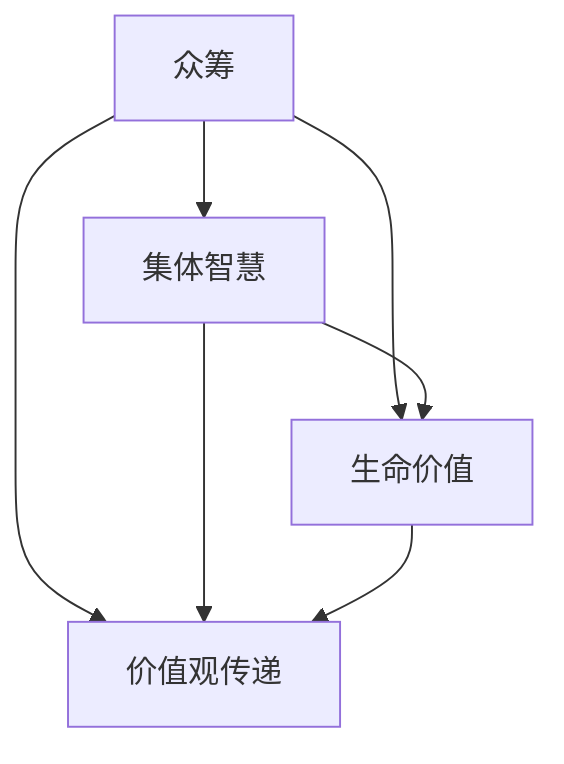

                 

### 文章标题：《意义众筹实验室：集体探索生命价值的空间》

#### 文章关键词：意义众筹、生命价值、集体探索、实验、人工智能、技术实现

#### 文章摘要：

本文深入探讨了意义众筹这一新兴概念，并揭示了其在集体探索生命价值中的重要作用。通过解析意义众筹的基本概念、运作模式以及成功案例，本文旨在为读者提供一个全面、深入的理解。此外，文章还将探讨意义众筹在面临挑战时的解决方案，并展望其未来发展趋势。通过结合实际项目案例和详细的代码实现，本文旨在为读者提供一个理论与实践相结合的参考框架，从而更好地理解并应用意义众筹这一创新理念。

---

### 引言

意义众筹，作为一个近年来逐渐兴起的概念，吸引了众多学者和实践者的关注。其核心理念在于通过集体的智慧和力量，共同探索和实现生命的价值。在这个数字化、网络化的时代，意义众筹不仅为个人提供了实现自我价值的新途径，也为社会提供了新的治理模式。然而，要真正理解意义众筹的内涵，首先需要对它的基本概念、运作模式和理论基础有一个清晰的认识。

本文旨在系统地探讨意义众筹这一主题。首先，我们将介绍意义众筹的基本概念，包括其定义、起源以及与其他众筹模式的关系。接着，我们将深入探讨集体探索生命价值的理论基础，分析其可行性和潜在影响。随后，本文将重点介绍意义众筹实验室的运作模式，通过具体的案例研究，展示其成功经验和运作机制。在此基础上，我们将探讨意义众筹面临的各种挑战，并提出相应的解决方案。最后，本文将展望意义众筹的未来发展趋势，探讨其对社会和个人的潜在影响。通过这一系列的分析和探讨，我们希望能够为读者提供一个全面、深入的理解，并激发更多的思考和讨论。

### 意义众筹的基本概念

#### 定义与起源

意义众筹（Meaningful Crowdsourcing）是一种新型的众筹模式，旨在通过集体的力量共同探索和实现生命的价值。与传统的众筹模式不同，意义众筹不仅仅关注资金筹集，更强调参与者的体验和价值观的传递。其核心理念是“众智共创”，即通过广泛的参与和协作，激发集体的智慧和创造力，实现更大的社会价值和个人的成长。

意义众筹的起源可以追溯到20世纪末和21世纪初。随着互联网技术的发展和普及，众筹平台逐渐兴起，为个人和团体提供了新的筹资渠道。然而，随着众筹项目的增多，人们开始关注到众筹活动中存在的不足，如项目的质量参差不齐、参与者的体验不佳等。在这种背景下，意义众筹应运而生，它不仅注重项目的实际效果，更强调参与者的参与感和价值观的传递。

#### 核心概念与联系

为了更好地理解意义众筹，我们需要明确其核心概念，并探讨这些概念之间的联系。

1. **众筹**：众筹是指通过互联网平台，向广泛的公众筹集资金，以实现某个项目或目标的筹资方式。意义众筹继承了这一基本概念，但更加注重参与者的体验和价值观。

2. **集体智慧**：集体智慧（Collective Wisdom）是指通过集体的协作和互动，产生的比个体智慧更优越的解决问题的能力。在意义众筹中，集体智慧被视为实现生命价值的关键。

3. **生命价值**：生命价值是指个体存在的意义和价值。意义众筹通过集体探索和实现生命价值，帮助参与者找到自己的定位和意义。

4. **价值观传递**：价值观传递是指通过参与众筹活动，传递和弘扬某种价值观。在意义众筹中，价值观传递是实现生命价值的重要途径。

这些核心概念之间存在着紧密的联系。众筹为意义众筹提供了平台和机制；集体智慧是实现目标的关键；生命价值和价值观传递则赋予了意义众筹更深层次的意义。下面是一个Mermaid流程图，展示了这些概念之间的关系：

#### 与其他众筹模式的比较

意义众筹与传统众筹、慈善众筹等模式有着显著的区别。

1. **传统众筹**：传统众筹主要关注资金筹集，目标往往是实现一个具体的项目或产品。参与者主要是资金提供者，对项目的实际影响有限。

2. **慈善众筹**：慈善众筹侧重于筹集资金用于慈善事业，如捐赠给弱势群体或支持社会公益项目。参与者通常有明确的慈善目的，但参与感和互动性相对较低。

相比之下，意义众筹具有以下几个独特特点：

1. **参与深度**：意义众筹不仅关注资金筹集，更注重参与者的参与感和价值观的传递。参与者不仅提供资金，还积极参与项目的实施和决策，共同探索和实现生命的价值。

2. **目标多样性**：意义众筹的目标不仅仅是实现一个具体的项目，而是通过集体探索，帮助参与者找到自己的生命价值和意义。这种目标多样性使得意义众筹具有更广泛的应用场景。

3. **互动性**：意义众筹强调参与者的互动和协作，通过线上和线下的活动，增强参与者的归属感和认同感。

总之，意义众筹在传统众筹和慈善众筹的基础上，注入了新的理念和模式，为集体探索生命价值提供了新的途径。

### 集体探索生命价值的理论基础

#### 生命价值的概念

生命价值是指个体存在的意义和价值。它不仅关乎个体的自我实现，也关系到社会的进步和发展。在探讨生命价值时，我们需要理解以下几个关键概念：

1. **个体价值**：个体价值是指每个人独特的内在品质和才能。个体价值是生命价值的基础，每个人的存在都有其独特的价值和意义。

2. **社会价值**：社会价值是指个体对社会做出的贡献和影响。个体的生命价值不仅体现在个人层面，也体现在对社会的影响和贡献上。

3. **精神价值**：精神价值是指个体追求的道德、文化和精神层面的成就。精神价值是实现生命价值的重要维度，它帮助个体超越物质层面，追求更深层次的意义。

#### 集体探索的可能性

集体探索生命价值是一种通过集体的智慧和力量，共同寻找和实现个体生命价值的方式。其可能性主要体现在以下几个方面：

1. **集体智慧**：集体智慧是集体探索生命价值的关键。通过集体的协作和互动，可以产生比个体智慧更优越的解决问题的能力。集体智慧不仅可以帮助个体更好地理解自己的生命价值，还可以提供更多的资源和视角，促进个体成长。

2. **共享经验**：集体探索生命价值的过程中，参与者可以分享自己的经验和见解，相互启发和激励。这种共享经验有助于个体更全面地认识自己的生命价值，并在实践中不断完善。

3. **互助合作**：集体探索生命价值需要参与者之间的互助合作。通过共同面对挑战和解决问题，参与者可以建立深厚的情感联系，增强团队的凝聚力和信任感。

4. **社会影响**：集体探索生命价值不仅可以实现个体价值，还可以对社会产生积极影响。通过集体行动，可以推动社会的进步和发展，实现更大的社会价值。

#### 集体探索的理论基础

集体探索生命价值的理论基础主要包括以下几个部分：

1. **社会交换理论**：社会交换理论认为，个体的行为是基于对利益和成本的理性计算。在集体探索生命价值的过程中，参与者通过相互交换资源、知识和经验，实现共同的目标和利益。

2. **社会认同理论**：社会认同理论指出，个体的自我认同受到社会和文化因素的影响。在集体探索生命价值的过程中，参与者通过共同的价值观和目标，建立社会认同，增强个体的归属感和使命感。

3. **社会协作理论**：社会协作理论强调，个体之间的协作和互动是实现共同目标的关键。在集体探索生命价值的过程中，参与者通过协作和互动，共同解决问题，实现个人和社会的价值。

4. **创新理论**：创新理论认为，创新是通过集体的智慧和努力实现的。在集体探索生命价值的过程中，参与者通过不断的创新和实践，推动社会的进步和发展。

#### 集体智慧的潜力

集体智慧具有巨大的潜力，可以通过以下几个方面体现：

1. **问题解决**：集体智慧可以解决个体难以单独解决的问题，特别是在复杂和不确定的情况下。通过集体的协作和互动，可以产生更多的解决方案和创意。

2. **决策优化**：集体智慧可以提高决策的质量和效率。通过集体的讨论和反馈，可以减少决策的盲点和偏差，提高决策的科学性和可行性。

3. **知识创新**：集体智慧可以促进知识的创新和传播。通过集体的协作和交流，可以产生新的知识和见解，推动知识的进步和发展。

4. **社会变革**：集体智慧可以推动社会的变革和发展。通过集体的力量和影响力，可以推动社会的进步，实现更大的社会价值和公共利益。

总之，集体探索生命价值具有深远的理论和实践意义。通过集体智慧和互助合作，我们可以更好地理解自己的生命价值，实现个人和社会的共同进步。

### 意义众筹实验室的运作模式

#### 实验室的构成

意义众筹实验室是一个由多个角色组成的团队，每个角色在实验中扮演着不同的职责和功能。以下是实验室的主要角色及其职责：

1. **发起人**：发起人是意义众筹实验的创始人，负责提出实验的创意和目标，设计实验方案，并招募参与者。发起人需要对实验的核心理念和目标有深刻的理解，并能够有效地传达给参与者。

2. **项目经理**：项目经理是实验的组织者和协调者，负责实验的规划、实施和监督。项目经理需要确保实验按照既定方案顺利进行，协调各个参与者的工作，处理实验过程中出现的各种问题。

3. **技术专家**：技术专家是实验的技术支持者，负责开发和维护实验所需的技术平台和工具。技术专家需要具备相关的技术知识和经验，确保实验的技术可行性和稳定性。

4. **参与者**：参与者是实验的主体，他们通过自己的智慧和努力，共同实现实验的目标。参与者可以是个人，也可以是团体。他们需要积极参与实验的各个环节，提供创意、解决方案和反馈。

5. **监督员**：监督员是实验的质量和效果监管者，负责评估实验的过程和结果，确保实验的公正性和科学性。监督员可以是内部人员，也可以是外部专家。

#### 工作流程

意义众筹实验室的工作流程可以分为以下几个阶段：

1. **实验设计**：在实验设计阶段，发起人根据实验的目标和理念，制定详细的实验方案，包括实验的目标、方法、步骤和预期结果。实验方案需要经过团队成员的讨论和修改，确保方案的可行性和科学性。

2. **招募参与者**：在实验设计完成后，发起人通过多种渠道（如社交媒体、众筹平台等）招募参与者。招募过程中，需要明确参与者的角色和职责，确保他们理解实验的目标和流程。

3. **实验实施**：在实验实施阶段，项目经理负责组织实验的各个环节，包括技术平台的搭建、实验数据的收集和分析等。参与者根据实验方案的要求，积极参与实验，提供创意和解决方案。

4. **数据收集与分析**：在实验过程中，技术专家负责收集和分析实验数据，形成实验报告。数据收集和分析需要采用科学的方法和工具，确保数据的准确性和可靠性。

5. **结果反馈与改进**：在实验结束后，监督员对实验的结果进行评估，并提供反馈和建议。团队成员根据反馈进行改进，为后续的实验提供经验和参考。

#### 实验设计原则

为了确保意义众筹实验的有效性和科学性，需要遵循以下几个设计原则：

1. **目标明确**：实验的目标应明确、具体，便于衡量和评估。

2. **方法科学**：实验的方法应科学合理，符合实验目标的要求。

3. **参与广泛**：参与者应具有多样性和广泛性，以保证实验结果的普适性和代表性。

4. **数据可靠**：实验数据的收集和分析应采用科学的方法和工具，确保数据的准确性和可靠性。

5. **反馈及时**：实验过程中应建立有效的反馈机制，及时收集和反馈信息，以便进行及时的调整和改进。

#### 成功要素

意义众筹实验室的成功要素主要包括以下几个方面：

1. **团队协作**：团队成员之间的协作和配合是实验成功的关键。团队成员需要相互信任、尊重，共同为实现实验目标而努力。

2. **技术创新**：实验的技术实现需要不断创新和改进，以提高实验的效率和效果。

3. **参与热情**：参与者的参与热情和积极性是实验成功的重要保障。需要通过多种方式激发参与者的兴趣和参与度。

4. **科学管理**：实验的过程需要科学的管理和监督，以确保实验的顺利进行和结果的有效评估。

5. **持续改进**：实验结束后，需要根据反馈进行持续改进，为后续的实验提供经验和参考。

通过以上运作模式的设计和实施，意义众筹实验室可以为集体探索生命价值提供有效的平台和机制，促进个人和社会的共同进步。

### 案例研究：成功的意义众筹实验

在本节中，我们将通过分析几个成功的意义众筹实验案例，深入了解这些实验的设计、实施过程以及其成功的关键要素。这些案例不仅展示了意义众筹的多样性和创新性，还揭示了在集体探索生命价值过程中可能遇到的挑战和解决方案。

#### 案例一：探索环境保护的意义

**案例背景**：某生态保护组织发起了“绿色未来”项目，旨在通过众筹方式，筹集资金用于保护某地区的自然保护区。项目的目标是建立生态监测站，实时监测生态环境变化，并向公众传播环保知识。

**实验设计**：项目通过众筹平台发布了详细的实验方案，包括项目目标、所需资金、监测站的建设计划以及预期的环境影响。参与者可以通过捐赠资金或提供专业知识的方式参与项目。

**实施过程**：在项目启动初期，发起人通过社交媒体和环保组织渠道广泛宣传，吸引参与者。项目吸引了来自世界各地的一千多名捐赠者，筹得了超过预期的资金。同时，多名环保专家和志愿者加入了项目团队，提供了技术支持和实地协助。

**结果与启示**：项目成功建立了生态监测站，并持续监测了数年的生态环境变化。通过监测数据，项目团队发现了一些重要的生态问题，并向相关部门提出了政策建议。项目的成功展示了意义众筹在环保领域的潜力，同时也证明了集体智慧在解决环境问题中的作用。

**成功要素**：
1. **明确的目标**：项目目标明确，易于参与者理解和参与。
2. **广泛的参与**：吸引了来自不同背景和领域的参与者，增强了项目的多样性和创新性。
3. **有效的沟通**：发起人与参与者之间的有效沟通，确保了项目的顺利进行和参与者的满意度。

#### 案例二：社区参与的艺术项目

**案例背景**：某艺术机构发起了“艺术社区”项目，旨在通过众筹方式，筹集资金用于社区艺术活动，提高社区居民的艺术素养和生活质量。

**实验设计**：项目通过众筹平台发布了详细的方案，包括艺术活动的种类、时间安排、参与方式以及预期的社区影响。项目设置了多种参与方式，如捐赠资金、提供技术支持、参与艺术创作等。

**实施过程**：项目启动后，艺术机构与社区居民建立了紧密的合作关系。通过社区宣传和互动活动，项目吸引了大量居民的参与。项目期间，举办了多场艺术展览、讲座和互动活动，居民不仅参与创作，还积极参与展览的组织和宣传。

**结果与启示**：项目成功提升了社区居民的艺术素养，增强了社区的凝聚力。居民们通过参与项目，不仅学到了艺术知识，还增强了社区归属感和参与感。项目的成功展示了意义众筹在社区建设和文化发展中的重要作用。

**成功要素**：
1. **社区的参与**：居民是项目的核心，他们的积极参与和投入是项目成功的关键。
2. **多样化的参与方式**：提供了多种参与方式，满足了不同居民的需求和兴趣。
3. **互动性和体验性**：项目注重互动性和体验性，提升了参与者的参与感和满意度。

#### 案例三：教育公平的众筹项目

**案例背景**：某教育公益组织发起了“智慧教育”项目，旨在通过众筹方式，筹集资金用于支持偏远地区学校的教育设备更新和师资培训。

**实验设计**：项目通过众筹平台发布了详细的计划，包括所需资金、设备清单、培训内容和预期教育成果。项目特别关注贫困地区学生的教育需求，通过捐赠资金或提供技术支持的方式，帮助这些学生获得更好的教育资源。

**实施过程**：项目启动后，组织团队前往贫困地区进行实地考察，与当地学校建立联系。通过线上和线下活动，项目成功筹集了超过目标金额的资金，并采购了大量的教育设备。同时，组织了多场师资培训，提升了当地教师的教学能力。

**结果与启示**：项目成功改善了贫困地区学校的教育条件，提高了学生的学习效果和教师的教学水平。通过项目的实施，当地学生的成绩显著提升，进一步缩小了城乡教育差距。项目的成功展示了意义众筹在教育公平和公益事业发展中的潜力。

**成功要素**：
1. **精准的需求识别**：准确识别贫困地区学校的实际需求，确保资源的高效利用。
2. **有效的合作与协调**：与当地政府和教育机构建立紧密的合作关系，确保项目的顺利实施。
3. **持续的跟踪与反馈**：项目结束后，持续跟踪和反馈项目的成果，为后续项目提供经验和参考。

通过以上案例研究，我们可以看到，成功的意义众筹实验不仅需要明确的目标和科学的设计，还需要广泛的参与和有效的执行。在集体探索生命价值的过程中，参与者通过共同的努力和创新，实现了个人和社会的共同进步。这些案例为我们提供了宝贵的经验和启示，激励我们进一步探索意义众筹的潜力，为更广泛的社会问题提供解决方案。

### 挑战与解决方案

尽管意义众筹展示了巨大的潜力和成功案例，但在其实施过程中仍面临着诸多挑战。以下将分析这些挑战，并提出相应的解决方案。

#### 挑战一：集体参与的挑战

集体参与是意义众筹的核心，但实现广泛的集体参与并不容易。首先，参与者的动机和兴趣各不相同，如何激发和维持他们的参与热情是一个重要问题。其次，集体决策的复杂性可能导致决策效率低下，甚至出现意见分歧。

**解决方案**：
1. **明确目标与激励**：确保项目的目标清晰、具体，并能够激发参与者的兴趣。通过设立奖励机制，如荣誉证书、荣誉称号等，激励参与者持续参与。
2. **透明沟通与反馈**：建立透明、高效的沟通渠道，及时向参与者反馈项目的进展和结果，增强他们的参与感和归属感。
3. **分阶段参与**：将项目分为多个阶段，每个阶段设定具体的目标和任务，让参与者可以根据自己的兴趣和条件选择参与。

#### 挑战二：项目管理与协调

意义众筹项目的成功依赖于有效的项目管理和协调。项目团队需要确保项目按照既定方案顺利实施，处理各种突发问题，并协调各个参与者的工作。然而，项目管理与协调往往面临资源不足、沟通不畅、协作困难等问题。

**解决方案**：
1. **明确职责与分工**：在项目启动前，明确每个成员的职责和分工，确保每个人知道自己需要完成的工作和责任。
2. **高效沟通机制**：建立高效、便捷的沟通机制，如定期的团队会议、即时通讯工具等，确保信息及时传达和问题快速解决。
3. **灵活调整方案**：项目实施过程中，可能会遇到各种意外情况，需要灵活调整方案以应对。通过建立应急预案和灵活的调整机制，确保项目的顺利实施。

#### 挑战三：数据隐私与安全

在意义众筹项目中，数据隐私和安全是一个不可忽视的问题。参与者可能会提交敏感信息，如个人身份信息、财务信息等。如果这些数据被泄露或滥用，将严重损害参与者的利益和项目的公信力。

**解决方案**：
1. **数据加密与保护**：对参与者的数据进行加密处理，确保数据在传输和存储过程中不被窃取或篡改。
2. **严格权限管理**：对数据的访问权限进行严格管理，确保只有授权人员才能访问和处理数据。
3. **安全审计与监控**：定期进行安全审计，监控数据的使用情况，及时发现并解决潜在的安全问题。

#### 挑战四：项目评估与反馈

项目评估与反馈是意义众筹中重要的环节，但也是一个复杂的过程。如何科学、公正地评估项目的效果，并从中获取有价值的反馈，是一个需要解决的问题。

**解决方案**：
1. **设立评估指标**：在项目设计阶段，设定明确的评估指标，确保评估有据可依。
2. **多元化的评估方法**：采用多种评估方法，如定量评估、定性评估等，确保评估结果的全面性和准确性。
3. **及时的反馈与调整**：及时收集和反馈评估结果，并根据反馈进行项目调整和改进。

通过以上解决方案，我们可以更好地应对意义众筹中的各种挑战，确保项目的顺利进行和目标的实现。

### 意义众筹的未来趋势

随着社会的发展和技术的进步，意义众筹正逐渐展现出其独特的价值和潜力。未来，意义众筹有望在多个领域发挥重要作用，并面临新的发展趋势。

#### 发展方向

1. **技术融合**：未来，意义众筹将更加注重与人工智能、区块链等新兴技术的融合。人工智能可以帮助分析和处理大量的众筹数据，提供个性化的参与建议和评估。区块链技术可以确保众筹过程的透明性和安全性，增强参与者的信任。

2. **平台创新**：意义众筹平台将不断创新，提供更加便捷、高效的参与和协作方式。例如，利用虚拟现实（VR）和增强现实（AR）技术，创建沉浸式的众筹体验，提升参与者的参与感和体验。

3. **社区化发展**：意义众筹将更加注重社区化运营，通过建立紧密的社区关系，增强参与者的归属感和认同感。社区化发展可以促进更多的交流和合作，激发集体智慧和创造力。

4. **跨界合作**：未来，意义众筹将与其他领域（如教育、医疗、环保等）展开跨界合作，共同探索和实现更广泛的社会价值。跨界合作可以整合各方资源，实现更大的社会影响力。

#### 潜在影响

1. **社会层面**：意义众筹有助于推动社会进步，提高社会的整体幸福感。通过集体探索和实现生命价值，意义众筹可以激发社会的创新力和创造力，促进社会的可持续发展。

2. **个人层面**：意义众筹为个人提供了实现自我价值的新途径，帮助个体找到自己的定位和意义。通过参与众筹项目，个人可以提升自己的技能和经验，增强自信心和成就感。

3. **经济层面**：意义众筹可以促进经济的发展，通过集体的智慧和努力，实现更大的社会价值和经济收益。例如，通过众筹方式，企业可以快速筹集资金，加速创新和研发。

#### 社会价值

1. **社会责任**：意义众筹强调参与者的社会责任感，通过共同探索和实现生命价值，促进社会的责任感和公民意识的提升。

2. **社会创新**：意义众筹鼓励创新思维和合作精神，通过集体智慧和协作，推动社会问题的解决和社会进步。

3. **文化传承**：意义众筹可以促进文化的传承和创新，通过众筹项目，保护和传承传统文化，同时推动文化创新和发展。

总之，意义众筹作为一种新兴的众筹模式，具有广阔的发展前景和巨大的社会价值。通过技术创新和跨界合作，意义众筹有望在未来实现更大的社会影响，为个人和社会的共同进步做出贡献。

### 结论

本文系统地探讨了意义众筹的基本概念、运作模式、理论基础以及面临的挑战和未来趋势。我们通过具体的案例研究，展示了意义众筹在集体探索生命价值中的重要作用。意义众筹不仅为个人提供了实现自我价值的新途径，也为社会带来了新的治理模式和社会价值。在未来的发展中，意义众筹有望通过技术创新和跨界合作，实现更大的社会影响。

我们呼吁读者进一步思考意义众筹的潜力，并在实践中探索其应用。通过集体智慧和合作，我们可以共同实现更大的社会价值和个人的成长。

### 附录

#### 进一步阅读资源

1. **《众筹：互联网时代的融资革命》** - 作者：艾伦·麦克卢尔（Alan McLeish）
   - 本书详细介绍了众筹的概念、模式和应用，为理解意义众筹提供了重要参考。

2. **《集体智慧：互联网时代的合作与创新》** - 作者：詹姆斯·苏兹克（James Surowiecki）
   - 本书探讨了集体智慧的原理和实践，对理解意义众筹的集体智慧基础有重要启示。

3. **《生命价值：探寻人类存在的意义》** - 作者：约翰·波普尔（John Polkinghorne）
   - 本书深入探讨了生命价值的哲学和科学基础，为理解意义众筹提供了深刻的思考。

#### 意义众筹实验室的工具和资源

1. **众筹平台**：如Kickstarter、Indiegogo等，提供意义众筹项目发起和管理的平台。

2. **协作工具**：如Trello、Asana等，帮助项目团队进行任务管理和协作。

3. **数据分析工具**：如Tableau、Google Analytics等，用于收集和分析实验数据。

4. **区块链技术**：利用区块链技术确保众筹过程的透明性和安全性。

5. **在线课程和社区**：如Coursera、edX等平台上的相关课程，提供学习和交流的机会。

通过以上资源，读者可以进一步深入了解意义众筹的相关理论和实践，并在实际操作中应用这些工具和资源，推动意义众筹项目的成功实施。

