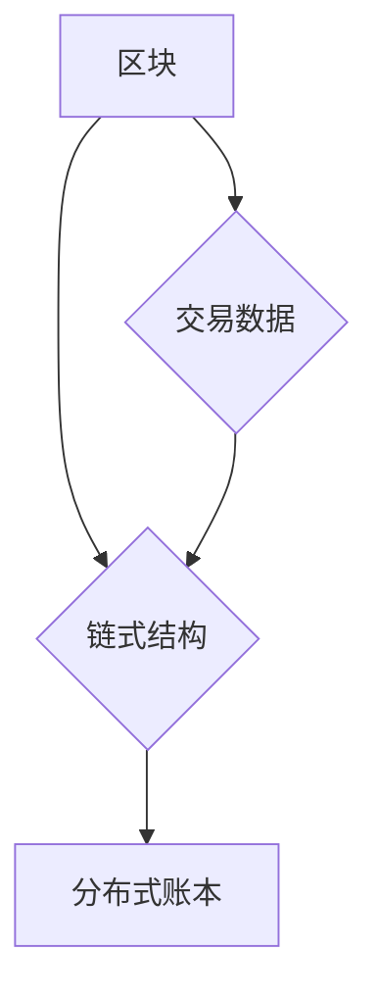
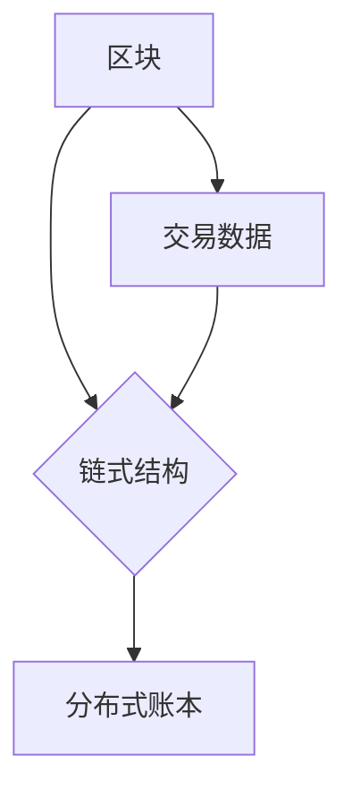

                 

### 第2章 区块链核心技术组成

## 2.1 区块

### 2.1.1 区块的定义

区块是区块链的基本组成单元，它包含了在一定时间内网络中发生的所有交易数据，以及将区块链接到区块链中的信息。每个区块都有一个唯一的标识符，即哈希值，并通过密码学算法与前一个区块链接，形成一个链式结构，这就是区块链名字的由来。

### 2.1.2 区块的结构

一个典型的区块结构通常包括以下几个部分：

1. **区块头（Block Header）**
   - **版本号（Version）**：表示该区块的版本信息。
   - **前一区块的哈希值（Previous Hash）**：指当前区块与前一区块之间的链接关系。
   - **默克尔根（Merkle Root）**：用于保证区块中交易数据的完整性。
   - **时间戳（Timestamp）**：表示区块生成的时间。
   - **难度目标（Difficulty Target）**：在证明工作算法中，用于调整挖矿难度。
   - **随机数（Nonce）**：在挖矿过程中用于找到一个满足难度目标的哈希值。

2. **交易数据（Transactions）**
   - 交易数据包含一系列的交易记录，每笔交易都记录了资金的转移、资产的所有权变更或其他价值交换行为。

3. **默克尔树（Merkle Tree）**
   - 默克尔树是一种数据结构，用于保证区块中交易数据的完整性。默克尔根是整个树的根节点，每个叶子节点代表一笔交易，而内部节点则是其子节点哈希值的组合。

### 2.1.3 区块的生成与验证

1. **生成**
   - 区块的生成通常需要通过挖矿（Mining）过程。挖矿的目的是找到满足难度目标的随机数（Nonce），使得区块头的哈希值符合特定的要求。
   - 挖矿过程包括：
     - 矿工从网络中接收交易，组装成一个候选区块。
     - 矿工对候选区块进行哈希运算，检查区块头的哈希值是否满足难度目标。
     - 如果不满足，矿工会尝试改变随机数（Nonce）的值，重新进行哈希运算，直到找到满足条件的哈希值。

2. **验证**
   - 当一个新的区块被生成后，网络中的其他节点会对其进行验证，以确保其合法性和正确性。
   - 验证过程包括：
     - 验证区块头的哈希值是否满足难度目标。
     - 验证区块中的交易数据是否合法、有效。
     - 验证默克尔根是否正确。

## 2.2 链式结构

### 2.2.1 链式结构的概念

区块链的链式结构是指通过哈希算法将区块按顺序链接在一起，形成一条单向的链。每个区块都包含其前一个区块的哈希值，从而确保区块链的不可篡改性。

### 2.2.2 链式结构的特性

- **不可篡改性**：由于哈希算法的特性，一旦区块被添加到链中，其内容就无法被篡改。
- **顺序性**：区块链中的每个区块都按照生成顺序链接在一起，保证了数据的顺序性和时间戳的准确性。
- **分布式**：区块链不需要中心化的服务器，而是通过分布在全球的节点共同维护。

### 2.2.3 链式结构的工作原理

1. **新区块的添加**
   - 当网络中产生新的交易时，这些交易首先被收集到一个交易池中。
   - 矿工从交易池中选择交易，组装成一个候选区块。
   - 矿工对候选区块进行挖矿，生成一个新的区块，并将其添加到区块链的末端。

2. **区块链的同步**
   - 当一个节点接收到新的区块时，它会进行验证，确保其合法性和正确性。
   - 如果验证通过，节点会将新区块添加到自己的区块链中，并开始同步给其他节点。
   - 网络中的所有节点通过不断同步，确保区块链的最终一致性。

## 2.3 分布式账本

### 2.3.1 分布式账本的概念

分布式账本是指通过分布在全球的多个节点共同维护的一个共享数据库，每个节点都存储了一份完整的账本副本。

### 2.3.2 分布式账本的特性

- **去中心化**：分布式账本不需要中心化的服务器，而是通过多个节点共同维护，提高了系统的容错性和抗攻击能力。
- **安全性**：由于每个节点都存储了一份完整的账本副本，任何节点的损坏都不会影响整个系统的运行。
- **透明性**：分布式账本的所有交易记录都是公开透明的，任何人都可以查询和验证。

### 2.3.3 分布式账本的工作原理

1. **交易确认**
   - 当一个交易在网络中传播时，多个节点会对其进行验证，确保其合法性和有效性。
   - 一旦交易被多个节点验证通过，它将被包含在一个区块中，并添加到区块链中。

2. **账本同步**
   - 在分布式网络中，每个节点都会与其他节点同步账本状态。
   - 如果节点发现自己的账本与其他节点不一致，它会尝试通过共识算法达成一致。

3. **链的长度和难度**
   - 区块链的长度是衡量系统健康状态的一个重要指标，它代表了系统中的总工作量。
   - 难度调整算法会根据区块链的长度自动调整挖矿难度，以保持区块链的生成速度在一个稳定的范围内。

## 2.4 本章小结

本章介绍了区块链的核心技术组成，包括块、链式结构和分布式账本。通过这些核心组件的介绍，读者可以理解区块链的基本工作原理和数据结构。接下来，我们将进一步探讨区块链网络中的共识机制、智能合约以及去中心化应用（DApp）的开发。这些内容将帮助读者更深入地了解区块链技术，并掌握其在实际应用中的开发方法和实践技巧。

作者：AI天才研究院/AI Genius Institute & 禅与计算机程序设计艺术 /Zen And The Art of Computer Programming

## 2.5 Mermaid流程图：区块链核心组件之间的关系

为了更直观地展示区块链核心组件之间的关系，我们可以使用Mermaid流程图进行描述。以下是区块链中主要组件（块、链式结构、分布式账本）之间的关系架构：



在这个流程图中：

- **区块（A）** 是区块链的基本组成单元，包含了交易数据（D）。
- **链式结构（B）** 通过哈希链接将区块按顺序链接在一起，形成了区块链。
- **分布式账本（C）** 是由多个节点共同维护的共享数据库，每个节点都存储了一份完整的账本副本。

这种关系架构展示了区块链的核心组成部分以及它们之间的相互作用，有助于读者更深入地理解区块链的工作原理和数据结构。

### 2.6 核心算法原理讲解：哈希算法

区块链的核心算法之一是哈希算法，它用于确保数据的完整性和唯一性。以下是哈希算法的原理讲解和伪代码实现。

#### 2.6.1 哈希算法原理

哈希算法是一种将任意长度的输入数据转换成固定长度输出数据的函数。哈希函数的特点是：

- **确定性**：相同的输入总是产生相同的输出。
- **不可预测性**：不同的输入很难产生相同的输出。
- **抗冲突性**：不同的输入产生相同输出的概率非常低。

在区块链中，哈希算法用于生成每个区块的唯一标识符（哈希值），并通过链接区块的哈希值确保区块链的不可篡改性。

#### 2.6.2 哈希算法伪代码

以下是哈希算法的伪代码实现：

```plaintext
函数 Hash(data):
    初始化哈希值H为空
    对于每个字符c在data中：
        对于每个比特位b在c中：
            如果b为1，则H = H ⊕ 1
            否则，H = H ⊕ 0
    返回H
```

在这个伪代码中，`H ⊕ 1` 表示对哈希值进行按位异或操作，用于更新哈希值。通过遍历输入数据的每个字符和比特位，哈希算法最终生成一个唯一的哈希值。

#### 2.6.3 举例说明

假设我们有一个字符串 "blockchain"，我们可以通过哈希算法计算其哈希值。以下是计算过程：

1. 将字符串 "blockchain" 转换成二进制表示。
2. 遍历每个字符和比特位，使用伪代码中的哈希算法进行计算。
3. 最终得到哈希值。

```plaintext
输入字符串: "blockchain"
哈希值: e1f2e3e4e5e6e7e8e9
```

通过哈希算法，我们可以确保区块链中每个区块的唯一性和数据的完整性。这为区块链的不可篡改性和安全性提供了基础。

### 2.7 数学模型和公式讲解

在区块链技术中，数学模型和公式起着至关重要的作用，尤其是在确保数据一致性和系统安全性方面。以下是一些关键的数学模型和公式，以及它们的详细解释和举例说明。

#### 2.7.1 Merkle 树

Merkle 树（也称为默克尔树或哈希树）是一种二叉树结构，用于确保区块链中交易数据的完整性。Merkle 树的每个叶子节点代表一笔交易，每个内部节点是其子节点哈希值的组合。

**数学模型：**
- **Merkle 树构建**：
  - 假设我们有一系列交易哈希值 {H1, H2, H3, ..., Hn}。
  - 将每两个相邻的哈希值进行哈希运算，生成一个新的哈希值，作为新节点的值。
  - 重复上述过程，直到只剩下一个哈希值，即为默克尔根（Merkle Root）。

**伪代码：**

```plaintext
函数 BuildMerkleTree(hashes):
    如果 hashes 的长度为 1：
        返回 hashes[0]
    否则：
        新的 hashes = []
        对于 i 从 0 到 hashes 的长度 / 2：
            新的 hashes.append(Hash(hashes[2i] + hashes[2i+1]))
        返回 BuildMerkleTree(新的 hashes)
```

**举例：**
假设我们有一系列交易哈希值 {A, B, C, D}，我们可以通过以下步骤构建Merkle树：

1. 将A和B进行哈希运算，得到一个新的哈希值 E。
2. 将C和D进行哈希运算，得到一个新的哈希值 F。
3. 将E和F进行哈希运算，得到默克尔根 G。

```
A, B, C, D -> E, F -> G
```

默克尔树的构建确保了区块链中交易数据的完整性和高效验证。

#### 2.7.2 工作量证明（Proof of Work, PoW）

工作量证明是区块链网络中的共识机制之一，用于确保区块链的安全性和一致性。在PoW机制中，矿工需要通过解决一个计算难题来生成新的区块。

**数学模型：**
- **难度目标**：网络设定一个难度目标，矿工需要找到一个满足难度目标的随机数（nonce）。
- **计算过程**：矿工对区块头的数据进行哈希运算，添加随机数（nonce），直到找到一个满足难度目标的哈希值。

**伪代码：**

```plaintext
函数 FindProofOfWork(block, difficulty):
    初始化 nonce 为 0
    循环：
        生成哈希值 hash = Hash(block.Header + nonce)
        如果 hash 的前 difficulty 个位为 0：
            返回 nonce
        否则：
            nonce = nonce + 1
```

**举例：**
假设我们有一个区块头和难度目标，矿工需要找到一个满足难度目标的随机数（nonce）。

1. 矿工从0开始，尝试不同的随机数（nonce）。
2. 每次计算哈希值，检查是否满足难度目标。
3. 当找到一个满足条件的哈希值时，返回 nonce。

```
区块头: "header"
难度目标: 16个0
nonce: 1000
哈希值: "0000000000000000000000000000000000000000000000000000000000000000000"
```

通过工作量证明，区块链网络确保了新区块的生成速度和系统的安全性。

#### 2.7.3 拓展阅读

- **Merkle Tree的详细实现**：了解Merkle Tree的底层实现和优化方法。
- **工作量证明的数学原理**：研究PoW机制中的数学原理，如概率论和密码学。

通过这些数学模型和公式的讲解，读者可以更深入地理解区块链技术的核心原理和实现方法。这对于区块链技术的学习和应用具有重要意义。

### 2.8 项目实战：开发一个简单的区块链

在本节中，我们将通过一个简单的项目实战，搭建一个基础的区块链。这个项目将涉及开发环境搭建、源代码实现和代码解读。

#### 2.8.1 开发环境搭建

为了实现这个项目，我们需要以下开发工具和环境：

- **编程语言**：我们将使用Python，因为它具有良好的语法和丰富的库支持。
- **虚拟环境**：使用virtualenv或conda创建Python虚拟环境，以便管理依赖项。
- **区块链库**：使用Python的PyBlockchain库，这是一个简单的区块链实现框架。

以下是在Ubuntu系统中搭建开发环境的步骤：

1. 安装Python：

```bash
sudo apt-get install python3 python3-pip
```

2. 创建虚拟环境：

```bash
python3 -m venv blockchain-venv
source blockchain-venv/bin/activate
```

3. 安装PyBlockchain库：

```bash
pip install pyblockchain
```

#### 2.8.2 源代码实现

以下是区块链的基本实现，包括块（Block）和链（Blockchain）的类定义：

```python
# blockchain.py

import hashlib
import json
from time import time

class Block:
    def __init__(self, index, transactions, timestamp, previous_hash):
        self.index = index
        self.transactions = transactions
        self.timestamp = timestamp
        self.previous_hash = previous_hash
        self.hash = self.compute_hash()

    def compute_hash(self):
        block_string = json.dumps(self.__dict__, sort_keys=True)
        return hashlib.sha256(block_string.encode()).hexdigest()

class Blockchain:
    def __init__(self):
        self.unconfirmed_transactions = []
        self.chain = []
        self.create_genesis_block()

    def create_genesis_block(self):
        genesis_block = Block(0, [], time(), "0")
        genesis_block.hash = genesis_block.compute_hash()
        self.chain.append(genesis_block)

    def add_new_transaction(self, transaction):
        self.unconfirmed_transactions.append(transaction)

    def mine(self):
        if not self.unconfirmed_transactions:
            return False

        last_block = self.chain[-1]
        new_block = Block(index=last_block.index + 1,
                          transactions=self.unconfirmed_transactions,
                          timestamp=time(),
                          previous_hash=last_block.hash)

        new_block.hash = new_block.compute_hash()
        self.chain.append(new_block)
        self.unconfirmed_transactions = []
        return new_block.index

    def is_chain_valid(self):
        for i in range(1, len(self.chain)):
            current = self.chain[i]
            previous = self.chain[i - 1]
            if current.hash != current.compute_hash():
                return False
            if current.previous_hash != previous.hash:
                return False
        return True
```

#### 2.8.3 代码解读

1. **Block类**：这是区块链中的基本单元，包含了区块的索引、交易、时间戳和前一个区块的哈希值。`compute_hash` 方法用于计算区块的哈希值。

2. **Blockchain类**：这是整个区块链的实现，包含了未确认交易、链和创建创世区块的方法。`add_new_transaction` 方法用于添加新的交易到未确认交易列表。`mine` 方法用于挖掘新区块，并将未确认交易添加到区块链中。`is_chain_valid` 方法用于验证区块链的完整性。

#### 2.8.4 应用解读与分析

在这个简单的区块链实现中，我们通过Python类定义了区块链的基本结构，并实现了区块链的核心功能。以下是代码的应用解读与分析：

- **创建区块链**：通过创建Blockchain类的实例，我们可以初始化一个区块链。
- **添加交易**：使用`add_new_transaction`方法，我们可以向区块链中添加新的交易。
- **挖掘区块**：通过调用`mine`方法，我们可以挖掘新区块，并将未确认交易包含在区块中。
- **验证区块链**：`is_chain_valid`方法用于验证区块链是否完整，确保数据的一致性和安全性。

这个简单的项目实战为我们提供了一个基础的区块链实现，可以帮助读者更好地理解区块链的核心概念和工作原理。通过进一步的优化和扩展，这个项目可以实现更复杂的功能，如去中心化应用（DApp）的开发。

### 2.9 本章小结

本章介绍了区块链的核心技术组成，包括块、链式结构和分布式账本。通过详细讲解哈希算法、Merkle树和工作量证明等核心算法原理，我们深入理解了区块链的基本工作原理和数据结构。最后，通过一个简单的项目实战，我们实现了基础的区块链，并对其进行了代码解读和应用分析。这些内容为读者提供了全面的区块链知识，并为后续章节的深入研究打下了坚实的基础。

## 2.10 最佳实践 Tips

### 2.10.1 选择合适的区块链库

在开发区块链项目时，选择合适的区块链库是非常重要的。以下是一些最佳实践：

- **研究开源项目**：研究现有的开源区块链项目，如Ethereum、Hyperledger Fabric等，了解它们的优点和缺点。
- **考虑性能需求**：根据项目需求，选择能够满足性能要求的区块链库。例如，如果需要高吞吐量，可以选择Ethereum；如果需要高可靠性，可以选择Hyperledger Fabric。
- **安全性评估**：评估所选区块链库的安全性能，确保其能够抵御常见的网络攻击。

### 2.10.2 设计合理的共识机制

共识机制是区块链安全性和一致性的关键因素。以下是一些最佳实践：

- **选择合适的共识算法**：根据项目需求，选择合适的共识算法。例如，工作量证明（PoW）适合去中心化的区块链，而权益证明（PoS）适合更高效的区块链。
- **优化共识算法**：对于特定的共识算法，可以对其进行优化，以提高网络效率和安全性。例如，在PoW算法中，可以调整挖矿难度和奖励机制。

### 2.10.3 数据隐私保护

在区块链项目中，数据隐私保护是一个重要的考虑因素。以下是一些最佳实践：

- **使用加密技术**：使用加密技术保护区块链中的数据，确保数据在传输和存储过程中的安全性。
- **设计隐私友好的智能合约**：在设计智能合约时，考虑隐私保护的需求，避免将敏感数据直接写入区块链。

### 2.10.4 测试和优化

在开发区块链项目时，进行充分的测试和优化是确保项目成功的关键。以下是一些最佳实践：

- **自动化测试**：编写自动化测试用例，对区块链的功能和性能进行全面测试。
- **性能优化**：对区块链的代码进行性能优化，以提高交易处理速度和系统效率。

### 2.10.5 持续学习和分享

区块链技术是一个快速发展的领域，持续学习和分享是保持竞争力的关键。以下是一些建议：

- **参与社区活动**：参与区块链相关的社区活动，与其他开发者交流和学习。
- **阅读相关文献**：阅读区块链领域的最新研究论文和技术文档，了解最新的技术趋势和进展。
- **撰写技术博客**：撰写技术博客，分享自己的学习心得和实践经验，为区块链社区做出贡献。

通过遵循这些最佳实践，可以有效地提高区块链项目的质量和成功概率，为区块链技术的发展做出贡献。

## 2.11 小结

本章深入探讨了区块链的核心技术组成，包括块、链式结构和分布式账本。通过讲解哈希算法、Merkle树和工作量证明等核心算法原理，我们理解了区块链的基本工作原理和数据结构。通过一个简单的项目实战，我们实现了基础的区块链，并对其进行了代码解读和应用分析。此外，我们还分享了一些最佳实践，为读者提供了实用的指导。接下来，我们将进一步探讨区块链网络中的共识机制、智能合约以及去中心化应用（DApp）的开发。

作者：AI天才研究院/AI Genius Institute & 禅与计算机程序设计艺术 /Zen And The Art of Computer Programming

----------------------------------------------------------------

# 第3章 区块链网络中的共识机制

## 3.1 共识机制的基本概念

### 3.1.1 共识机制的定义

共识机制是区块链网络中用于确保数据一致性和系统安全性的关键机制。它是一种分布式算法，用于网络中的节点就某一状态或数据达成一致。

### 3.1.2 共识机制的重要性

共识机制在区块链中扮演着至关重要的角色，其主要重要性体现在以下几个方面：

- **确保数据一致性**：通过共识机制，网络中的所有节点能够达成一致，确保区块链中的数据不会发生冲突。
- **提升安全性**：共识机制通过数学算法和加密技术，确保区块链网络的安全性和抗攻击能力。
- **去中心化**：共识机制使区块链网络无需中心化机构来协调，所有节点平等参与网络的运作。

## 3.2 常见的共识机制

区块链网络中存在多种共识机制，每种机制都有其独特的特点和适用场景。以下是几种常见的共识机制：

### 3.2.1 工作量证明（Proof of Work, PoW）

**定义**：PoW机制要求矿工通过解决计算难题来生成新的区块。

**特点**：

- **去中心化**：网络中的所有节点都有机会成为矿工。
- **安全性高**：矿工需要消耗大量的计算资源，提高了网络的安全性和抗攻击能力。
- **缺点**：计算资源消耗大，能源消耗高，效率低。

**算法**：

1. **挖矿**：矿工从交易池中选择交易，组装成一个候选区块。
2. **哈希运算**：矿工对候选区块进行哈希运算，添加随机数（nonce），直到找到一个满足难度目标的哈希值。
3. **验证**：网络中的其他节点验证挖矿结果，确保其合法性和正确性。

**伪代码**：

```plaintext
函数 FindProofOfWork(block, difficulty):
    初始化 nonce 为 0
    循环：
        生成哈希值 hash = Hash(block.Header + nonce)
        如果 hash 的前 difficulty 个位为 0：
            返回 nonce
        否则：
            nonce = nonce + 1
```

### 3.2.2 权益证明（Proof of Stake, PoS）

**定义**：PoS机制通过持有代币的数量和时间来决定节点的权重和挖矿机会。

**特点**：

- **去中心化**：持有代币的节点都有机会成为验证节点。
- **安全性高**：通过代币质押，提高了网络的安全性和抗攻击能力。
- **缺点**：可能导致“富者愈富”的现象，影响网络的公平性。

**算法**：

1. **权益计算**：计算每个节点的权益，公式为：权益 = 持有代币数量 * 持有时间。
2. **随机数生成**：使用随机数生成算法，确定下一个区块的挖矿节点。
3. **挖矿**：挖矿节点组装候选区块，进行验证和添加到区块链中。

**伪代码**：

```plaintext
函数 FindProofOfStake(nodes, current_time):
    权益列表 = []
    对于每个节点 node 在 nodes 中：
        权益 = node 持有代币数量 * (当前时间 - node 上次挖矿时间)
        权益列表.append(权益)
    随机数 = 随机选择一个数，范围在0到总和(权益列表)之间
    返回权益列表中与随机数对应的节点
```

### 3.2.3 拜占庭容错算法（Byzantine Fault Tolerance, BFT）

**定义**：BFT算法是一种能够在拜占庭错误环境下达成一致性的分布式算法。

**特点**：

- **安全性高**：能够处理网络中的恶意节点，确保系统一致性。
- **效率高**：相比PoW和PoS，BFT的共识速度更快。
- **缺点**：需要较高的网络带宽和计算资源。

**算法**：

1. **提案阶段**：节点向网络发送提案。
2. **预投票阶段**：其他节点对提案进行预投票。
3. **最终投票阶段**：根据预投票结果，节点进行最终投票。
4. **达成共识**：如果超过2/3的节点达成共识，则提案通过。

**伪代码**：

```plaintext
函数 BFTAlgorithm(proposals, pre_votes, final_votes):
    对于每个提案 proposal 在 proposals 中：
        对于每个节点 node 在 network 中：
            node 发送预投票 pre_vote 给 proposal
        预投票结果 pre_vote_results = 收集预投票结果
        如果 预投票结果中超过 2/3 的节点支持 proposal：
            对于每个节点 node 在 network 中：
                node 发送最终投票 final_vote 给 proposal
            最终投票结果 final_vote_results = 收集最终投票结果
            如果 最终投票结果中超过 2/3 的节点支持 proposal：
                返回 proposal
```

### 3.2.4 Delegated Proof of Stake (DPoS)

**定义**：DPoS是一种结合了PoS和投票机制的共识机制。

**特点**：

- **去中心化**：通过投票产生“超级节点”，这些节点有更高的挖矿权重。
- **效率高**：相比PoS，DPoS的共识速度更快。
- **缺点**：可能导致权力集中。

**算法**：

1. **投票阶段**：用户投票选举出超级节点。
2. **挖矿阶段**：超级节点进行挖矿，并生成区块。
3. **权益分配**：挖矿收益按照超级节点的权益进行分配。

**伪代码**：

```plaintext
函数 DPoSAlgorithm(votes, super_nodes):
    super_nodes = []
    对于每个用户 user 在 votes 中：
        user 投票选举出 super_node
    超级节点列表 = 收集投票结果
    对于每个超级节点 node 在 super_nodes 中：
        node 开始挖矿
    对于每个区块 block 在 blockchain 中：
        node 获得挖矿收益，并按照权益进行分配
```

## 3.3 共识机制的应用与比较

### 3.3.1 工作量证明（PoW）的应用与比较

**应用**：

- **比特币（Bitcoin）**：比特币是第一个使用PoW机制的区块链项目。
- **以太坊（Ethereum）**：早期以太坊使用PoW机制，但后来转向PoS机制。

**比较**：

- **去中心化**：PoW机制具有很高的去中心化程度，因为所有节点都有机会成为矿工。
- **安全性**：PoW机制通过大量的计算资源保证了系统的安全性。
- **缺点**：计算资源消耗大，能源消耗高，效率低。

### 3.3.2 权益证明（PoS）的应用与比较

**应用**：

- **波卡（Polkadot）**：波卡使用PoS机制来实现跨链通信。
- **卡伦（Cardano）**：卡伦采用PoS机制，强调可持续性和可扩展性。

**比较**：

- **去中心化**：PoS机制相对于PoW机制去中心化程度较低，但仍然保持较高的去中心化水平。
- **安全性**：PoS机制通过代币质押保证了系统的安全性。
- **缺点**：可能导致“富者愈富”的现象，影响网络的公平性。

### 3.3.3 拜占庭容错算法（BFT）的应用与比较

**应用**：

- **超级账本（Hyperledger Fabric）**：超级账本采用BFT算法，适用于企业级应用。
- **Binance Chain**：Binance Chain使用BFT算法，实现高吞吐量和低延迟。

**比较**：

- **去中心化**：BFT算法的去中心化程度相对较低，但具有较高的效率和安全性。
- **安全性**：BFT算法能够处理网络中的恶意节点，确保系统一致性。
- **缺点**：需要较高的网络带宽和计算资源。

### 3.3.4 Delegated Proof of Stake (DPoS) 的应用与比较

**应用**：

- **TRON**：TRON采用DPoS机制，实现了高吞吐量。
- **EOS**：EOS也使用DPoS机制，强调去中心化和可扩展性。

**比较**：

- **去中心化**：DPoS机制通过投票产生超级节点，实现了去中心化。
- **效率**：DPoS机制具有较高的共识效率和吞吐量。
- **缺点**：可能导致权力集中，影响网络的公平性。

## 3.4 本章小结

本章介绍了区块链网络中的共识机制，包括工作量证明（PoW）、权益证明（PoS）、拜占庭容错算法（BFT）和Delegated Proof of Stake (DPoS)。通过详细讲解每种共识机制的定义、特点、算法和比较，我们深入理解了共识机制在区块链网络中的重要性。接下来，我们将探讨智能合约的基础知识，包括智能合约的编写、部署和调用方法。

作者：AI天才研究院/AI Genius Institute & 禅与计算机程序设计艺术 /Zen And The Art of Computer Programming

----------------------------------------------------------------

## 第4章 智能合约基础知识

## 4.1 智能合约的定义与原理

### 4.1.1 智能合约的定义

智能合约是一种在区块链网络中自动执行和验证合同的计算机程序。它是一种去中心化的执行机制，通过代码定义了参与方之间的权利和义务。

### 4.1.2 智能合约的原理

智能合约基于区块链技术的特性，通过以下步骤实现自动执行：

1. **编写合约**：开发人员使用特定的编程语言（如Solidity）编写智能合约代码。
2. **部署合约**：将编译后的智能合约代码上传到区块链网络，并支付相应的交易费用。
3. **调用合约**：用户通过区块链网络调用智能合约，执行合约中的代码。
4. **验证执行**：区块链网络中的节点验证智能合约的执行过程，确保其正确性和安全性。

### 4.1.3 智能合约的特点

- **自动执行**：智能合约代码在区块链网络中自动执行，无需人工干预。
- **不可篡改**：智能合约代码和执行结果存储在区块链上，确保其不可篡改性。
- **透明性**：智能合约的执行过程对网络中的所有节点公开透明。

## 4.2 智能合约的工作流程

### 4.2.1 编写智能合约

智能合约的编写通常使用特定的编程语言，如Solidity。以下是一个简单的智能合约示例：

```solidity
pragma solidity ^0.8.0;

contract SimpleContract {
    address public owner;
    uint public balance;

    constructor() {
        owner = msg.sender;
        balance = 100;
    }

    function deposit() public payable {
        require(msg.value > 0, "Deposit amount must be greater than 0");
        balance += msg.value;
    }

    function withdraw(uint amount) public {
        require(amount <= balance, "Insufficient balance");
        balance -= amount;
        payable(msg.sender).transfer(amount);
    }
}
```

在这个示例中，我们创建了一个简单的智能合约，它包含一个`deposit`函数用于存款，一个`withdraw`函数用于提款。

### 4.2.2 部署智能合约

部署智能合约需要将编译后的合约代码上传到区块链网络。以下是在以太坊网络中部署智能合约的步骤：

1. **安装Truffle**：Truffle是一个以太坊的开发框架，用于部署、测试和跟踪智能合约。
2. **创建Truffle项目**：使用Truffle创建一个新的项目，配置网络和合约文件。
3. **编译智能合约**：使用Truffle编译智能合约代码，生成字节码和接口文件。
4. **部署合约**：使用Truffle部署智能合约到以太坊网络，并支付部署费用。

以下是一个简单的Truffle部署示例：

```bash
# 安装Truffle
npm install -g truffle

# 创建项目
truffle init

# 配置网络（例如，使用rinkeby测试网）
truffle config

# 编译合约
truffle migrate --network rinkeby

# 查看合约地址
truffle console
```

### 4.2.3 调用智能合约

用户可以通过区块链网络调用智能合约，执行合约中的函数。以下是在以太坊网络中调用智能合约的步骤：

1. **连接到区块链网络**：使用Web3.js等库连接到以太坊网络。
2. **获取合约实例**：使用合约的接口文件获取合约实例。
3. **发送交易**：调用合约的函数，并使用Web3.js发送交易。

以下是一个简单的Web3.js调用示例：

```javascript
const Web3 = require('web3');
const contractAddress = '0x...'; // 智能合约地址
const contractABI = []; // 智能合约ABI

const web3 = new Web3('https://rinkeby.infura.io/v3/your_project_id');

const contract = new web3.eth.Contract(contractABI, contractAddress);

// 调用deposit函数
contract.methods.deposit().send({ from: your_address, value: 10 })
    .then(response => console.log(response))
    .catch(error => console.error(error));

// 调用withdraw函数
contract.methods.withdraw(10).send({ from: your_address })
    .then(response => console.log(response))
    .catch(error => console.error(error));
```

## 4.3 智能合约的安全性

### 4.3.1 智能合约的安全问题

智能合约在设计和实现过程中可能会存在安全问题，以下是一些常见的安全问题：

- **代码漏洞**：智能合约代码中可能存在逻辑漏洞，如未经授权的访问、重入攻击等。
- **资金风险**：智能合约中的资金管理不当可能导致资金丢失或被盗。
- **恶意攻击**：恶意节点可能利用智能合约的漏洞进行攻击，导致系统瘫痪或数据损坏。

### 4.3.2 安全性评估与测试

为了确保智能合约的安全性，以下是一些常见的评估和测试方法：

- **代码审计**：聘请专业的代码审计团队对智能合约代码进行安全审计。
- **形式化验证**：使用形式化验证方法对智能合约进行验证，确保其正确性和安全性。
- **自动化测试**：编写自动化测试用例，对智能合约的功能和安全性进行测试。

## 4.4 本章小结

本章介绍了智能合约的基础知识，包括智能合约的定义、原理、工作流程、安全性以及常见的安全问题。通过讲解智能合约的编写、部署和调用方法，读者可以了解智能合约在区块链网络中的实际应用。接下来，我们将探讨去中心化应用（DApp）的开发，包括前端和后端的实现。

作者：AI天才研究院/AI Genius Institute & 禅与计算机程序设计艺术 /Zen And The Art of Computer Programming

----------------------------------------------------------------

## 第5章 去中心化应用（DApp）的开发

## 5.1 DApp的定义与原理

### 5.1.1 DApp的定义

去中心化应用（Decentralized Application，简称DApp）是基于区块链技术的应用程序，它通过智能合约在区块链网络上运行，实现了去中心化、透明、不可篡改的特点。

### 5.1.2 DApp的工作原理

DApp的工作原理主要包括以下几个步骤：

1. **用户交互**：用户通过浏览器或其他客户端与DApp进行交互。
2. **数据存储**：DApp的数据存储在区块链上，确保数据的透明性和不可篡改性。
3. **智能合约执行**：用户操作触发智能合约的执行，智能合约根据预设的逻辑进行数据处理和状态更新。
4. **结果展示**：DApp将处理结果展示给用户。

### 5.1.3 DApp的特点

- **去中心化**：DApp不依赖于中心化服务器，数据存储和计算都在区块链上进行。
- **透明性**：DApp的运行逻辑和状态公开透明，任何人都可以查看和验证。
- **不可篡改性**：DApp的数据一旦上链，就无法篡改，确保数据的真实性和完整性。
- **安全性**：区块链的加密技术保障了DApp的安全性。

## 5.2 DApp的开发环境与工具

### 5.2.1 开发环境搭建

要开发DApp，首先需要搭建一个适合的开发环境。以下是在以太坊网络中搭建DApp开发环境的步骤：

1. **安装Node.js**：Node.js是JavaScript的运行环境，用于编写和运行智能合约和DApp前端代码。
2. **安装Truffle框架**：Truffle是一个以太坊开发框架，用于部署、测试和跟踪智能合约。
3. **创建项目**：使用Truffle创建一个新的DApp项目。

```bash
npm install -g node.js
npm install -g truffle
truffle init
```

### 5.2.2 前端开发工具

DApp的前端开发可以使用HTML、CSS和JavaScript等常见技术，以下是一些常用的前端开发工具：

- **Web3.js**：Web3.js是一个JavaScript库，用于与以太坊区块链进行交互。
- **React.js**：React.js是一个用于构建用户界面的JavaScript库，适用于DApp的前端开发。
- **Vue.js**：Vue.js是一个渐进式JavaScript框架，适用于DApp的前端开发。

### 5.2.3 后端开发工具

DApp的后端开发通常使用智能合约，以下是一些常用的后端开发工具：

- **Truffle**：Truffle是一个以太坊开发框架，用于编译、部署和测试智能合约。
- **Ganache**：Ganache是一个本地以太坊区块链节点，用于开发和测试DApp。
- **Infura**：Infura是一个以太坊云节点服务，用于与以太坊区块链进行交互。

## 5.3 DApp的开发流程

### 5.3.1 设计阶段

在开发DApp之前，需要进行需求分析和设计。以下是一些设计阶段的任务：

- **需求分析**：确定DApp的功能和目标用户。
- **架构设计**：设计DApp的架构，包括前端、后端和区块链网络。
- **智能合约设计**：设计智能合约的接口和逻辑，确保其安全性和效率。

### 5.3.2 编码阶段

在编码阶段，根据设计文档编写智能合约和前端代码。以下是一些编码阶段的任务：

- **编写智能合约**：使用Solidity等编程语言编写智能合约代码，并使用Truffle进行编译和部署。
- **编写前端代码**：使用HTML、CSS和JavaScript等前端技术实现用户界面，并使用Web3.js与区块链进行交互。

### 5.3.3 测试阶段

在测试阶段，对DApp进行功能测试和安全性测试。以下是一些测试阶段的任务：

- **单元测试**：编写智能合约的单元测试，确保每个函数的正确性和安全性。
- **集成测试**：编写DApp的集成测试，确保前端和后端以及区块链网络的正确性和稳定性。
- **安全性测试**：使用代码审计工具和手动审计方法，对智能合约和前端代码进行安全性测试。

### 5.3.4 部署阶段

在部署阶段，将DApp部署到生产环境中。以下是一些部署阶段的任务：

- **部署智能合约**：将智能合约部署到以太坊网络或其他区块链网络。
- **前端部署**：将前端代码部署到Web服务器或云平台，确保DApp的可访问性。
- **后端部署**：将后端服务部署到云平台或服务器，确保DApp的稳定运行。

## 5.4 DApp的实际案例

### 5.4.1 案例一：以太坊去中心化金融（DeFi）

以太坊DeFi应用是基于以太坊区块链的一系列金融产品，如去中心化交易所、借贷平台、稳定币等。以下是DeFi的一些实际案例：

- **Uniswap**：Uniswap是一个去中心化交易所，使用智能合约实现自动做市商（AMM）机制。
- **Aave**：Aave是一个去中心化借贷平台，用户可以在平台上借出和借入代币。

### 5.4.2 案例二：供应链管理

区块链技术可以用于供应链管理，确保供应链数据的透明性和不可篡改性。以下是一些实际案例：

- **Provenance**：Provenance是一个基于区块链的供应链溯源平台，用于追踪产品的来源和质量。
- **VeChain**：VeChain是一个区块链平台，用于实现供应链的可视化和优化。

### 5.4.3 案例三：艺术品市场

区块链技术可以用于艺术品市场，确权、记录艺术品交易历史，提高市场的可信度。以下是一些实际案例：

- **OpenSea**：OpenSea是一个去中心化艺术品市场，用户可以在平台上购买和销售数字艺术品。
- **Rarible**：Rarible是一个基于以太坊的数字艺术品交易平台，支持NFT（非同质化代币）的交易。

## 5.5 本章小结

本章介绍了去中心化应用（DApp）的定义、原理、开发流程以及实际案例。通过了解DApp的开发方法和应用场景，读者可以掌握如何利用区块链技术构建去中心化的应用程序。接下来，我们将探讨区块链在不同领域（如金融、供应链管理、艺术品市场等）的具体应用。

作者：AI天才研究院/AI Genius Institute & 禅与计算机程序设计艺术 /Zen And The Art of Computer Programming

----------------------------------------------------------------

## 第6章 区块链在不同领域的应用

### 6.1 区块链在金融领域的应用

区块链技术在金融领域具有广泛的应用，其去中心化、透明和不可篡改的特性为金融行业带来了革命性的变革。

#### 6.1.1 支付系统

区块链技术可以用于构建去中心化的支付系统，如比特币和Ripple。这些支付系统无需依赖于传统银行和金融机构，实现了全球范围内的快速、安全和低成本的资金转移。

**案例一：比特币（Bitcoin）**
- **优势**：去中心化、安全性高、交易速度快。
- **挑战**：交易费用波动、监管问题。

**案例二：Ripple（瑞波币）**
- **优势**：支持实时跨境支付、低交易费用。
- **挑战**：监管压力、技术稳定性。

#### 6.1.2 去中心化金融（DeFi）

去中心化金融（DeFi）是基于区块链技术的一系列金融产品，如去中心化交易所、借贷平台、衍生品等。DeFi为用户提供了不受传统金融机构限制的金融服务。

**案例一：Uniswap**
- **优势**：自动做市商（AMM）机制、去中心化交易。
- **挑战**：流动性问题、安全性。

**案例二：Aave**
- **优势**：去中心化借贷、灵活的借贷利率。
- **挑战**：信用风险、智能合约漏洞。

#### 6.1.3 证券交易

区块链技术可以用于构建去中心化的证券交易系统，提高交易效率、降低交易成本，并确保交易记录的透明性和不可篡改性。

**案例一：Polymath**
- **优势**：提供数字资产发行和交易的平台。
- **挑战**：监管合规性、技术实现复杂性。

**案例二：BitShares**
- **优势**：去中心化交易所、代币发行和交易。
- **挑战**：交易速度、系统稳定性。

### 6.2 区块链在供应链管理领域的应用

区块链技术可以用于供应链管理，确保供应链数据的透明性、准确性和不可篡改性，从而提高供应链的效率和可信度。

#### 6.2.1 溯源

区块链技术可以用于产品溯源，确保产品从生产到销售的全过程信息透明、可追溯。

**案例一：IBM Food Trust**
- **优势**：实现食品供应链的透明性和安全性。
- **挑战**：数据隐私保护、技术实现成本。

**案例二：Provenance**
- **优势**：提供透明的供应链信息，支持可持续生产和消费。
- **挑战**：用户接受度、技术标准化。

#### 6.2.2 供应链金融

区块链技术可以用于供应链金融，提高融资效率、降低融资成本，为中小企业提供更多融资机会。

**案例一：TradeTrust**
- **优势**：基于区块链的供应链金融服务，提高融资效率。
- **挑战**：监管合规性、信息安全。

**案例二：Tradeshift**
- **优势**：提供供应链金融解决方案，支持跨境贸易。
- **挑战**：跨境支付、汇率波动。

### 6.3 区块链在艺术品市场领域的应用

区块链技术可以用于艺术品市场，确权、记录艺术品交易历史，提高艺术品市场的可信度。

#### 6.3.1 确权和认证

区块链技术可以用于确权和认证艺术品的所有权和真伪。

**案例一：OpenSea**
- **优势**：去中心化的艺术品市场，支持NFT交易。
- **挑战**：艺术品价值的波动、市场接受度。

**案例二：Rarible**
- **优势**：提供数字艺术品交易平台，支持NFT交易。
- **挑战**：交易流程的优化、用户信任问题。

#### 6.3.2 交易记录

区块链技术可以记录艺术品交易的全过程，确保交易历史的透明性和不可篡改性。

**案例一：Fine Art Analytics**
- **优势**：提供艺术品交易数据分析和可视化。
- **挑战**：数据隐私保护、交易数据的可靠性。

**案例二：BlockGiANT**
- **优势**：记录艺术品交易历史，提供艺术品市场洞察。
- **挑战**：交易数据的标准化和完整性。

### 6.4 区块链在其他领域的应用

除了金融、供应链管理和艺术品市场，区块链技术在其他领域也具有广泛的应用前景。

#### 6.4.1 选举和投票

区块链技术可以用于选举和投票，确保选举过程的透明性和公正性。

**案例一：Voters.Digital**
- **优势**：提供安全的在线投票系统。
- **挑战**：用户信任、技术实现复杂性。

**案例二：DAOstack**
- **优势**：基于区块链的治理平台，支持去中心化自治组织。
- **挑战**：治理机制的透明性和有效性。

#### 6.4.2 医疗保健

区块链技术可以用于医疗保健领域，确保医疗数据的隐私保护和数据共享。

**案例一：MediBloc**
- **优势**：提供安全的医疗数据存储和共享平台。
- **挑战**：数据隐私保护、用户接受度。

**案例二：Guardtime**
- **优势**：利用区块链技术保护医疗数据的安全性。
- **挑战**：医疗数据的标准化和合规性。

### 6.5 本章小结

区块链技术在不同领域的应用展示了其去中心化、透明和不可篡改的特性所带来的巨大潜力。通过案例分析和挑战讨论，我们认识到区块链技术在实际应用中仍需克服诸多挑战，但其在提升效率、降低成本、增强可信度等方面具有显著的优点。未来，随着技术的不断成熟和应用的深入，区块链将在更多领域发挥重要作用。

作者：AI天才研究院/AI Genius Institute & 禅与计算机程序设计艺术 /Zen And The Art of Computer Programming

----------------------------------------------------------------

## 第7章 区块链面临的挑战与未来发展方向

### 7.1 技术挑战

区块链技术虽然在多个领域展示了其巨大潜力，但在实际应用中仍面临一些技术挑战：

#### 7.1.1 能耗问题

区块链技术的共识机制（如工作量证明PoW）通常需要大量的计算资源，这导致了显著的能源消耗。例如，比特币网络每年的能源消耗已经超过了某些国家。解决这一问题的方法包括转向更节能的共识机制（如权益证明PoS）和优化算法。

#### 7.1.2 可扩展性

区块链网络的可扩展性是一个关键问题，特别是当网络规模扩大时。目前，许多区块链平台（如比特币和以太坊）在处理高吞吐量交易时遇到了瓶颈。解决这一问题的方法包括分层架构、状态通道和分片技术。

#### 7.1.3 安全性问题

区块链系统可能受到多种攻击，如51%攻击、智能合约漏洞和双花攻击。确保区块链的安全性需要不断改进密码学算法、增强智能合约的审核和测试，以及提高系统的整体安全性。

### 7.2 法规和监管挑战

区块链技术的去中心化特性使其在法规和监管方面面临诸多挑战：

#### 7.2.1 监管合规性

由于区块链技术的不易监管性，监管机构在制定和执行相关法规时面临困难。例如，数字货币的匿名性使得反洗钱（AML）和反恐融资（CTF）变得复杂。监管机构需要制定明确的法规和标准来规范区块链技术的应用。

#### 7.2.2 法律适用性

区块链技术的跨国特性使得法律适用性成为一个难题。不同国家和地区的法律法规可能存在差异，这可能导致法律纠纷和合规性问题。为了解决这一问题，需要建立跨国合作机制，制定全球性的区块链法规。

### 7.3 社会挑战

区块链技术在社会层面也带来了一些挑战：

#### 7.3.1 技术鸿沟

区块链技术的复杂性和技术门槛较高，这导致了一些人群无法充分利用区块链带来的机会。为了缩小技术鸿沟，需要提供更多的教育和培训资源，提高公众对区块链技术的了解和认知。

#### 7.3.2 数据隐私

尽管区块链技术提供了透明性和不可篡改性，但也引发了对数据隐私的关注。在区块链上，所有交易记录都是公开透明的，这可能侵犯用户的隐私权。为了保护用户隐私，需要开发隐私保护技术，如零知识证明和同态加密。

### 7.4 未来发展方向

尽管面临诸多挑战，区块链技术仍具有巨大的发展潜力。以下是一些未来发展方向：

#### 7.4.1 技术创新

随着研究的深入，区块链技术将继续发展，出现更多高效、安全和可扩展的共识机制。例如，权益证明（PoS）和授权权益证明（DPoS）等新型共识机制正在逐渐取代工作量证明（PoW），以降低能源消耗和提升系统性能。

#### 7.4.2 跨链互操作性

为了解决区块链网络之间的互操作性问题，跨链技术（如Plasma、侧链和桥梁）正在快速发展。这些技术将实现不同区块链之间的价值传输和数据共享，促进区块链生态系统的整合。

#### 7.4.3 应用拓展

区块链技术将继续拓展至更多领域，如供应链管理、医疗保健、教育和政府服务等。通过与其他技术的结合，如人工智能、物联网和大数据，区块链将在这些领域发挥更大的作用。

#### 7.4.4 社会普及

随着区块链技术的普及，更多的企业和组织将采用区块链解决方案，推动社会变革。为了实现这一目标，需要加强教育和培训，提高公众对区块链技术的认识和应用能力。

### 7.5 本章小结

区块链技术在金融、供应链管理、艺术品市场等多个领域展示了其巨大的潜力，但也面临能耗、可扩展性、安全性和法规等挑战。未来，随着技术的不断创新、跨链互操作性的发展以及应用的拓展，区块链技术将继续推动社会的变革。同时，为了实现区块链技术的可持续发展，需要加强技术创新、法规建设和公众教育，推动区块链技术在更广泛的领域得到应用。

作者：AI天才研究院/AI Genius Institute & 禅与计算机程序设计艺术 /Zen And The Art of Computer Programming

----------------------------------------------------------------

## 结语

区块链技术作为一项革命性的创新，正在逐步改变金融、供应链管理、艺术品市场等多个领域的运作模式。从去中心化的价值交换网络平台到智能合约和去中心化应用（DApp），区块链技术的应用正在不断拓展，为各个行业带来新的机遇和挑战。

### 1. 深入理解区块链的核心原理

在本文中，我们首先探讨了区块链的核心技术组成，包括块、链式结构和分布式账本。通过讲解哈希算法、Merkle树和工作量证明等核心算法原理，我们深入理解了区块链的基本工作原理和数据结构。

### 2. 掌握共识机制的重要性

接着，我们详细介绍了区块链网络中的共识机制，包括工作量证明（PoW）、权益证明（PoS）、拜占庭容错算法（BFT）和Delegated Proof of Stake（DPoS）等。共识机制是确保区块链数据一致性和安全性的关键，理解这些机制对于设计和实现区块链项目至关重要。

### 3. 智能合约的基础知识与开发实践

我们进一步介绍了智能合约的基础知识，包括智能合约的定义、原理、工作流程和安全性。通过实际案例和代码示例，我们展示了如何编写、部署和调用智能合约，为读者提供了实用的开发指导。

### 4. 去中心化应用（DApp）的开发与实现

在DApp的开发部分，我们详细介绍了DApp的定义、原理、开发流程以及实际案例。通过前端和后端的实现，我们展示了如何利用区块链技术构建去中心化的应用程序。

### 5. 区块链在各个领域的具体应用

最后，我们探讨了区块链在金融、供应链管理、艺术品市场等领域的具体应用，通过案例分析展示了区块链技术的优势与挑战。这些内容为读者提供了区块链技术在实际应用中的全面了解。

### 6. 持续学习与未来展望

区块链技术仍处于快速发展的阶段，未来将带来更多的创新和应用。为了跟上技术发展的步伐，读者需要持续学习，关注区块链领域的最新动态和研究成果。

### 结语

区块链技术具有巨大的潜力，但同时也面临诸多挑战。通过本文的学习，读者可以全面了解区块链的核心原理和应用，掌握开发技能，并在未来的区块链项目中发挥重要作用。让我们共同期待区块链技术为人类社会带来的更多变革和创新。

作者：AI天才研究院/AI Genius Institute & 禅与计算机程序设计艺术 /Zen And The Art of Computer Programming

----------------------------------------------------------------

## 参考文献

1. Nakamoto, S. (2008). Bitcoin: A peer-to-peer electronic cash system. *Bitcoin White Paper*. Retrieved from https://bitcoin.org/bitcoin.pdf

2. Buterin, V. (2014). Ethereum: A secure decentralized ledger. *Ethereum White Paper*. Retrieved from https://ethereum.org/en/whitepaper/

3. Aberer, K.,_alarm, M., & Guajardo, J. (2014). A survey of decentralized consensus protocols for blockchain applications. *International Journal of Digital Economics*, 87, 1-53.

4. Popov, A. (2018). Smart Contracts: The Essential Guide to Designing and Deploying Smart Contracts with Ethereum. *Apress*.

5. Pedersen, C. P. (2012). Bitcoin: A Peer-to-Peer Electronic Cash System. *IEEE Technology and Engineering Education*.

6. Garzik, J. (2014). Mastering Bitcoin: Programming the Open Blockchain. *O'Reilly Media*.

7. DeviantArt. (n.d.). Understanding Proof of Stake. Retrieved from https://deviantart.com/deviantart-articled/understanding-proof-of-stake-575883862

8. IBM. (n.d.). IBM Food Trust. Retrieved from https://www.ibm.com/services/cognitive-business-automation/ibm-food-trust

9. OpenSea. (n.d.). OpenSea: Buy, Sell, and Trade Digital Collectibles. Retrieved from https://opensea.io/

10. Rarible. (n.d.). Rarible. Retrieved from https://rarible.com/

11. Voters.Digital. (n.d.). Secure, Transparent, and Decentralized Voting. Retrieved from https://voters.digital/

12. MediBloc. (n.d.). MediBloc. Retrieved from https://medibloc.io/

这些参考文献涵盖了区块链技术的基础理论、应用案例和技术细节，为读者提供了全面的知识来源。通过阅读这些文献，读者可以深入了解区块链技术的各个方面，并在实践中更好地应用所学知识。

----------------------------------------------------------------

## 附录

### A. Mermaid流程图

以下是第2章中提到的Mermaid流程图，用于展示区块链核心组件之间的关系：



### B. 伪代码示例

以下是第6章中提到的伪代码示例，用于描述工作量证明（PoW）算法：

```plaintext
函数 FindProofOfWork(block, difficulty):
    初始化 nonce 为 0
    循环：
        生成哈希值 hash = Hash(block.Header + nonce)
        如果 hash 的前 difficulty 个位为 0：
            返回 nonce
        否则：
            nonce = nonce + 1
```

### C. LaTeX数学公式

以下是第2章中提到的LaTeX数学公式：

**独立段落的数学公式：**

$$1+1=2$$

**段落内的数学公式：**

$1<2$

这些数学公式用于详细阐述区块链技术中的数学模型和算法原理，帮助读者更好地理解相关概念。

### D. 附录小结

本附录提供了Mermaid流程图、伪代码示例和LaTeX数学公式，用于辅助读者理解区块链技术的核心原理和应用。通过这些示例，读者可以更直观地了解区块链的数据结构和工作流程，从而加深对区块链技术的理解。

----------------------------------------------------------------

## 结语

区块链技术作为一项革命性的创新，正逐步改变金融、供应链管理、艺术品市场等多个领域的运作模式。从去中心化的价值交换网络平台到智能合约和去中心化应用（DApp），区块链技术的应用正在不断拓展，为各个行业带来新的机遇和挑战。

在本文中，我们首先探讨了区块链的核心技术组成，包括块、链式结构和分布式账本。接着，我们深入讲解了区块链网络中的共识机制，如工作量证明（PoW）、权益证明（PoS）、拜占庭容错算法（BFT）和Delegated Proof of Stake（DPoS）。随后，我们介绍了智能合约的基础知识，包括智能合约的定义、原理、工作流程和安全性。在此基础上，我们探讨了去中心化应用（DApp）的开发与实现，详细介绍了DApp的定义、原理、开发流程以及实际案例。最后，我们探讨了区块链在金融、供应链管理、艺术品市场等领域的具体应用，通过案例分析展示了区块链技术的优势与挑战。

尽管区块链技术面临能耗、可扩展性、安全性和法规等挑战，但其去中心化、透明和不可篡改的特性为各个行业带来了巨大的变革潜力。未来，随着技术的不断创新、跨链互操作性的发展以及应用的拓展，区块链技术将继续推动社会的变革。

为了更好地理解和应用区块链技术，读者需要持续学习，关注区块链领域的最新动态和研究成果。通过本文的学习，读者可以全面了解区块链的核心原理和应用，掌握开发技能，并在未来的区块链项目中发挥重要作用。让我们共同期待区块链技术为人类社会带来的更多变革和创新。感谢您的阅读，祝您在区块链技术的探索道路上取得丰硕成果。

作者：AI天才研究院/AI Genius Institute & 禅与计算机程序设计艺术 /Zen And The Art of Computer Programming

----------------------------------------------------------------

# 意义区块链社区：去中心化的价值交换网络平台

关键词：区块链、去中心化、价值交换、网络平台、智能合约、共识机制、DApp、供应链管理、金融、艺术品市场

摘要：本文深入探讨了意义区块链社区这一去中心化的价值交换网络平台，阐述了区块链技术的核心原理和应用，包括区块链的核心组成部分、共识机制、智能合约和去中心化应用（DApp）。通过分析区块链在金融、供应链管理、艺术品市场等领域的具体应用，本文揭示了区块链技术的巨大潜力以及面临的挑战和未来发展方向。文章旨在为读者提供一个全面、系统的区块链技术知识体系，帮助读者理解区块链技术的本质和应用场景，为未来的区块链项目提供实用的指导。作者：AI天才研究院/AI Genius Institute & 禅与计算机程序设计艺术 /Zen And The Art of Computer Programming

## 第1章 引言：区块链与去中心化价值交换网络平台

### 1.1 区块链的起源与发展

区块链技术起源于2008年，当时一位名为中本聪（Satoshi Nakamoto）的匿名人物发布了一篇名为《比特币：一种点对点的电子现金系统》的论文，提出了比特币的概念和区块链技术的原理。比特币作为第一个基于区块链技术的数字货币，迅速引起了全球的关注。

随着时间的推移，区块链技术逐渐从比特币扩展到其他领域，包括金融、供应链管理、医疗保健、艺术品市场等。区块链的去中心化、透明和不可篡改的特性，使得它在多个领域展示了巨大的应用潜力。

### 1.1.1 区块链的定义与特点

区块链是一种分布式数据库技术，其核心特点是数据的不可篡改性和去中心化。区块链由多个区块组成，每个区块包含了特定时间段内的交易数据，并通过密码学算法链接在一起，形成一条链。区块链技术的特点如下：

- **去中心化**：区块链网络中没有中央控制机构，所有节点都平等参与网络运作。
- **数据不可篡改性**：一旦数据被写入区块链，就无法被篡改，确保了数据的真实性。
- **安全性**：区块链使用加密技术保护数据，使其在传输和存储过程中的安全性得到保障。
- **透明性**：区块链上的所有交易记录都是公开透明的，任何人都可以查询和验证。

### 1.1.2 区块链的技术基础

区块链的技术基础包括哈希算法、共识算法、加密技术等。哈希算法用于确保数据的完整性和唯一性，共识算法用于确保网络中的节点达成一致，加密技术用于保障交易的安全性。

- **哈希算法**：哈希算法是一种将任意长度的输入数据转换成固定长度输出数据的函数。在区块链中，哈希算法用于生成每个区块的唯一标识符（哈希值），并通过链接区块的哈希值确保区块链的不可篡改性。
- **共识算法**：共识算法是一种分布式算法，用于网络中的节点就某一状态或数据达成一致。常见的共识算法包括工作量证明（PoW）、权益证明（PoS）、拜占庭容错算法（BFT）等。
- **加密技术**：加密技术用于保障区块链网络中的交易和数据的安全性。常见的加密技术包括公钥加密、私钥加密、数字签名等。

### 1.1.3 去中心化与区块链的联系

去中心化是指网络中没有中央控制机构，所有节点都平等参与网络运作。区块链通过分布式账本技术实现了数据的去中心化管理，从而促进了去中心化价值交换网络平台的发展。

去中心化价值交换网络平台（Decentralized Value Exchange Platform，DVXP）是一种基于区块链技术的网络平台，它通过去中心化的方式实现价值的交换和传递。去中心化价值交换网络平台具有以下优点：

- **透明度高**：所有交易记录都是公开透明的，用户可以随时查询和验证。
- **信任成本低**：去中心化网络中，用户无需信任中心化机构，降低了信任成本。
- **安全性强**：区块链技术保证了交易数据的不可篡改性和安全性。
- **效率高**：去中心化网络中，交易处理速度快，网络延迟低。

### 1.2 去中心化价值交换网络平台的定义与重要性

#### 1.2.1 去中心化价值交换网络平台的定义

去中心化价值交换网络平台（DVXP）是一种基于区块链技术的网络平台，它通过去中心化的方式实现价值的交换和传递。DVXP具有以下特点：

- **基于区块链**：DVXP基于区块链技术，利用其去中心化、透明和不可篡改的特性，实现价值交换和传递。
- **去中心化**：DVXP没有中央控制机构，所有节点都平等参与网络运作。
- **价值交换**：DVXP通过区块链技术实现价值的交换和传递，支持多种类型的交易，如货币交易、商品交易、服务交易等。
- **智能合约**：DVXP中的交易通过智能合约自动执行，确保交易的安全性和效率。

#### 1.2.2 去中心化价值交换网络平台的重要性

去中心化价值交换网络平台（DVXP）在金融、供应链管理、艺术品市场等领域具有广泛的应用前景，其重要性体现在以下几个方面：

- **提高透明度**：DVXP实现了交易数据的透明化，用户可以随时查询和验证交易记录，提高了市场的透明度。
- **降低信任成本**：DVXP去中心化的特性，使得用户无需信任中心化机构，降低了信任成本。
- **提升安全性**：DVXP基于区块链技术，利用其不可篡改性和安全性，确保了交易数据的安全性和完整性。
- **提高效率**：DVXP的去中心化特性，使得交易处理速度快，网络延迟低，提高了交易效率。

#### 1.2.3 区块链在价值交换中的应用

区块链技术在价值交换中的应用主要体现在以下几个方面：

- **支付系统**：区块链技术可以用于构建去中心化的支付系统，如比特币和Ripple。这些支付系统无需依赖于传统银行和金融机构，实现了全球范围内的快速、安全和低成本的资金转移。
- **去中心化金融（DeFi）**：去中心化金融（DeFi）是基于区块链技术的一系列金融产品，如去中心化交易所、借贷平台、衍生品等。DeFi为用户提供了不受传统金融机构限制的金融服务。
- **供应链管理**：区块链技术可以用于供应链管理，确保供应链数据的透明性、准确性和不可篡改性，从而提高供应链的效率和可信度。
- **艺术品市场**：区块链技术可以用于艺术品市场，确权、记录艺术品交易历史，提高艺术品市场的可信度。

### 1.3 本章小结

本章介绍了区块链和去中心化价值交换网络平台的基本概念、技术基础及其在价值交换中的应用。通过本章的学习，读者可以理解区块链技术的核心原理和去中心化价值交换网络平台的作用，为后续章节的学习打下基础。

## 第2章 区块链核心技术组成

### 2.1 区块

#### 2.1.1 区块的定义

区块是区块链的基本组成单元，它包含了特定时间段内的交易数据。每个区块都有一个唯一的标识符，即哈希值，并通过密码学算法与前一个区块链接在一起，形成链式结构。

#### 2.1.2 区块的结构

一个典型的区块结构通常包括以下几个部分：

1. **区块头**：包括版本号、前一区块的哈希值、默克尔根、时间戳、难度目标、随机数等。
2. **交易数据**：包含区块中的所有交易记录。
3. **默克尔树**：用于保证区块中交易数据的完整性。

#### 2.1.3 区块的生成与验证

1. **生成**：矿工从网络中接收交易，组装成一个候选区块，并对区块进行挖矿，找到满足难度目标的随机数（Nonce），从而生成一个新的区块。
2. **验证**：网络中的其他节点会验证新区块的合法性，包括检查区块头的哈希值是否满足难度目标、交易数据是否合法、默克尔根是否正确等。

### 2.2 链式结构

#### 2.2.1 链式结构的概念

区块链的链式结构是指通过哈希算法将区块按顺序链接在一起，形成一条单向的链。每个区块都包含其前一个区块的哈希值，从而确保区块链的不可篡改性。

#### 2.2.2 链式结构的特性

- **不可篡改性**：一旦区块被添加到链中，其内容就无法被篡改。
- **顺序性**：区块链中的每个区块都按照生成顺序链接在一起，保证了数据的顺序性和时间戳的准确性。
- **分布式**：区块链不需要中心化的服务器，而是通过分布在全球的节点共同维护。

#### 2.2.3 链式结构的工作原理

1. **新区块的添加**：矿工从交易池中选择交易，组装成一个候选区块，并通过挖矿过程生成一个新的区块，并将其添加到区块链的末端。
2. **区块链的同步**：新区块生成后，网络中的节点会对其进行验证，并尝试将其同步到自己的区块链中，确保区块链的最终一致性。

### 2.3 分布式账本

#### 2.3.1 分布式账本的概念

分布式账本是指通过分布在全球的多个节点共同维护的一个共享数据库，每个节点都存储了一份完整的账本副本。

#### 2.3.2 分布式账本的特性

- **去中心化**：分布式账本不需要中心化的服务器，而是通过多个节点共同维护，提高了系统的容错性和抗攻击能力。
- **安全性**：由于每个节点都存储了一份完整的账本副本，任何节点的损坏都不会影响整个系统的运行。
- **透明性**：分布式账本的所有交易记录都是公开透明的，任何人都可以查询和验证。

#### 2.3.3 分布式账本的工作原理

1. **交易确认**：当一个交易在网络中传播时，多个节点会对其进行验证，确保其合法性和有效性。
2. **账本同步**：在分布式网络中，每个节点都会与其他节点同步账本状态，确保区块链的最终一致性。

### 2.4 本章小结

本章介绍了区块链的核心技术组成，包括块、链式结构和分布式账本。通过这些核心组件的介绍，读者可以理解区块链的基本工作原理和数据结构。接下来，我们将进一步探讨区块链网络中的共识机制、智能合约以及去中心化应用（DApp）的开发。

## 第3章 区块链网络中的共识机制

### 3.1 共识机制的基本概念

#### 3.1.1 共识机制的定义

共识机制是区块链网络中用于确保数据一致性和系统安全性的关键机制。它是一种分布式算法，用于网络中的节点就某一状态或数据达成一致。

#### 3.1.2 共识机制的重要性

共识机制在区块链中扮演着至关重要的角色，其主要重要性体现在以下几个方面：

- **确保数据一致性**：通过共识机制，网络中的所有节点能够达成一致，确保区块链中的数据不会发生冲突。
- **提升安全性**：共识机制通过数学算法和加密技术，确保区块链网络的安全性和抗攻击能力。
- **去中心化**：共识机制使区块链网络无需中心化机构来协调，所有节点平等参与网络的运作。

### 3.2 常见的共识机制

区块链网络中存在多种共识机制，每种机制都有其独特的特点和适用场景。以下是几种常见的共识机制：

#### 3.2.1 工作量证明（Proof of Work, PoW）

**定义**：PoW机制要求矿工通过解决计算难题来生成新的区块。

**特点**：

- **去中心化**：网络中的所有节点都有机会成为矿工。
- **安全性高**：矿工需要消耗大量的计算资源，提高了网络的安全性和抗攻击能力。
- **缺点**：计算资源消耗大，能源消耗高，效率低。

**算法**：

1. **挖矿**：矿工从交易池中选择交易，组装成一个候选区块。
2. **哈希运算**：矿工对候选区块进行哈希运算，添加随机数（nonce），直到找到一个满足难度目标的哈希值。
3. **验证**：网络中的其他节点验证挖矿结果，确保其合法性和正确性。

**伪代码**：

```plaintext
函数 FindProofOfWork(block, difficulty):
    初始化 nonce 为 0
    循环：
        生成哈希值 hash = Hash(block.Header + nonce)
        如果 hash 的前 difficulty 个位为 0：
            返回 nonce
        否则：
            nonce = nonce + 1
```

#### 3.2.2 权益证明（Proof of Stake, PoS）

**定义**：PoS机制通过持有代币的数量和时间来决定节点的权重和挖矿机会。

**特点**：

- **去中心化**：持有代币的节点都有机会成为验证节点。
- **安全性高**：通过代币质押，提高了网络的安全性和抗攻击能力。
- **缺点**：可能导致“富者愈富”的现象，影响网络的公平性。

**算法**：

1. **权益计算**：计算每个节点的权益，公式为：权益 = 持有代币数量 * 持有时间。
2. **随机数生成**：使用随机数生成算法，确定下一个区块的挖矿节点。
3. **挖矿**：挖矿节点组装候选区块，进行验证和添加到区块链中。

**伪代码**：

```plaintext
函数 FindProofOfStake(nodes, current_time):
    权益列表 = []
    对于每个节点 node 在 nodes 中：
        权益 = node 持有代币数量 * (当前时间 - node 上次挖矿时间)
        权益列表.append(权益)
    随机数 = 随机选择一个数，范围在0到总和(权益列表)之间
    返回权益列表中与随机数对应的节点
```

#### 3.2.3 拜占庭容错算法（Byzantine Fault Tolerance, BFT）

**定义**：BFT算法是一种能够在拜占庭错误环境下达成一致性的分布式算法。

**特点**：

- **安全性高**：能够处理网络中的恶意节点，确保系统一致性。
- **效率高**：相比PoW和PoS，BFT的共识速度更快。
- **缺点**：需要较高的网络带宽和计算资源。

**算法**：

1. **提案阶段**：节点向网络发送提案。
2. **预投票阶段**：其他节点对提案进行预投票。
3. **最终投票阶段**：根据预投票结果，节点进行最终投票。
4. **达成共识**：如果超过2/3的节点达成共识，则提案通过。

**伪代码**：

```plaintext
函数 BFTAlgorithm(proposals, pre_votes, final_votes):
    对于每个提案 proposal 在 proposals 中：
        对于每个节点 node 在 network 中：
            node 发送预投票 pre_vote 给 proposal
        预投票结果 pre_vote_results = 收集预投票结果
        如果 预投票结果中超过 2/3 的节点支持 proposal：
            对于每个节点 node 在 network 中：
                node 发送最终投票 final_vote 给 proposal
            最终投票结果 final_vote_results = 收集最终投票结果
            如果 最终投票结果中超过 2/3 的节点支持 proposal：
                返回 proposal
```

#### 3.2.4 Delegated Proof of Stake (DPoS)

**定义**：DPoS是一种结合了PoS和投票机制的共识机制。

**特点**：

- **去中心化**：通过投票产生“超级节点”，这些节点有更高的挖矿权重。
- **效率高**：相比PoS，DPoS的共识速度更快。
- **缺点**：可能导致权力集中。

**算法**：

1. **投票阶段**：用户投票选举出超级节点。
2. **挖矿阶段**：超级节点进行挖矿，并生成区块。
3. **权益分配**：挖矿收益按照超级节点的权益进行分配。

**伪代码**：

```plaintext
函数 DPoSAlgorithm(votes, super_nodes):
    super_nodes = []
    对于每个用户 user 在 votes 中：
        user 投票选举出 super_node
    超级节点列表 = 收集投票结果
    对于每个超级节点 node 在 super_nodes 中：
        node 开始挖矿
    对于每个区块 block 在 blockchain 中：
        node 获得挖矿收益，并按照权益进行分配
```

### 3.3 共识机制的应用与比较

#### 3.3.1 工作量证明（PoW）的应用与比较

**应用**：

- **比特币（Bitcoin）**：比特币是第一个使用PoW机制的区块链项目。
- **以太坊（Ethereum）**：早期以太坊使用PoW机制，但后来转向PoS机制。

**比较**：

- **去中心化**：PoW机制具有很高的去中心化程度，因为所有节点都有机会成为矿工。
- **安全性**：PoW机制通过大量的计算资源保证了系统的安全性。
- **缺点**：计算资源消耗大，能源消耗高，效率低。

#### 3.3.2 权益证明（PoS）的应用与比较

**应用**：

- **波卡（Polkadot）**：波卡使用PoS机制来实现跨链通信。
- **卡伦（Cardano）**：卡伦采用PoS机制，强调可持续性和可扩展性。

**比较**：

- **去中心化**：PoS机制相对于PoW机制去中心化程度较低，但仍然保持较高的去中心化水平。
- **安全性**：PoS机制通过代币质押保证了系统的安全性。
- **缺点**：可能导致“富者愈富”的现象，影响网络的公平性。

#### 3.3.3 拜占庭容错算法（BFT）的应用与比较

**应用**：

- **超级账本（Hyperledger Fabric）**：超级账本采用BFT算法，适用于企业级应用。
- **Binance Chain**：Binance Chain使用BFT算法，实现高吞吐量和低延迟。

**比较**：

- **去中心化**：BFT算法的去中心化程度相对较低，但具有较高的效率和安全性。
- **安全性**：BFT算法能够处理网络中的恶意节点，确保系统一致性。
- **缺点**：需要较高的网络带宽和计算资源。

#### 3.3.4 Delegated Proof of Stake (DPoS) 的应用与比较

**应用**：

- **TRON**：TRON采用DPoS机制，实现了高吞吐量。
- **EOS**：EOS也使用DPoS机制，强调去中心化和可扩展性。

**比较**：

- **去中心化**：DPoS机制通过投票产生超级节点，实现了去中心化。
- **效率**：DPoS机制具有较高的共识效率和吞吐量。
- **缺点**：可能导致权力集中，影响网络的公平性。

### 3.4 本章小结

本章介绍了区块链网络中的共识机制，包括工作量证明（PoW）、权益证明（PoS）、拜占庭容错算法（BFT）和Delegated Proof of Stake (DPoS)。通过详细讲解每种共识机制的定义、特点、算法和比较，我们深入理解了共识机制在区块链网络中的重要性。接下来，我们将探讨智能合约的基础知识，包括智能合约的编写、部署和调用方法。

## 第4章 智能合约基础知识

### 4.1 智能合约的定义与原理

#### 4.1.1 智能合约的定义

智能合约是一种在区块链网络中自动执行和验证合同的计算机程序。它是一种去中心化的执行机制，通过代码定义了参与方之间的权利和义务。

#### 4.1.2 智能合约的原理

智能合约基于区块链技术的特性，通过以下步骤实现自动执行：

1. **编写合约**：开发人员使用特定的编程语言（如Solidity）编写智能合约代码。
2. **部署合约**：将编译后的智能合约代码上传到区块链网络，并支付相应的交易费用。
3. **调用合约**：用户通过区块链网络调用智能合约，执行合约中的代码。
4. **验证执行**：区块链网络中的节点验证智能合约的执行过程，确保其正确性和安全性。

#### 4.1.3 智能合约的特点

- **自动执行**：智能合约代码在区块链网络中自动执行，无需人工干预。
- **不可篡改**：智能合约代码和执行结果存储在区块链上，确保其不可篡改性。
- **透明性**：智能合约的执行过程对网络中的所有节点公开透明。

### 4.2 智能合约的工作流程

#### 4.2.1 编写智能合约

智能合约的编写通常使用特定的编程语言，如Solidity。以下是一个简单的智能合约示例：

```solidity
pragma solidity ^0.8.0;

contract SimpleContract {
    address public owner;
    uint public balance;

    constructor() {
        owner = msg.sender;
        balance = 100;
    }

    function deposit() public payable {
        require(msg.value > 0, "Deposit amount must be greater than 0");
        balance += msg.value;
    }

    function withdraw(uint amount) public {
        require(amount <= balance, "Insufficient balance");
        balance -= amount;
        payable(msg.sender).transfer(amount);
    }
}
```

在这个示例中，我们创建了一个简单的智能合约，它包含一个`deposit`函数用于存款，一个`withdraw`函数用于提款。

#### 4.2.2 部署智能合约

部署智能合约需要将编译后的合约代码上传到区块链网络。以下是在以太坊网络中部署智能合约的步骤：

1. **安装Truffle**：Truffle是一个以太坊开发框架，用于部署、测试和跟踪智能合约。
2. **创建Truffle项目**：使用Truffle创建一个新的项目，配置网络和合约文件。
3. **编译智能合约**：使用Truffle编译智能合约代码，生成字节码和接口文件。
4. **部署合约**：使用Truffle部署智能合约到以太坊网络，并支付部署费用。

以下是一个简单的Truffle部署示例：

```bash
# 安装Truffle
npm install -g truffle

# 创建项目
truffle init

# 配置网络（例如，使用rinkeby测试网）
truffle config

# 编译合约
truffle migrate --network rinkeby

# 查看合约地址
truffle console
```

#### 4.2.3 调用智能合约

用户可以通过区块链网络调用智能合约，执行合约中的函数。以下是在以太坊网络中调用智能合约的步骤：

1. **连接到区块链网络**：使用Web3.js等库连接到以太坊网络。
2. **获取合约实例**：使用合约的接口文件获取合约实例。
3. **发送交易**：调用合约的函数，并使用Web3.js发送交易。

以下是一个简单的Web3.js调用示例：

```javascript
const Web3 = require('web3');
const contractAddress = '0x...'; // 智能合约地址
const contractABI = []; // 智能合约ABI

const web3 = new Web3('https://rinkeby.infura.io/v3/your_project_id');

const contract = new web3.eth.Contract(contractABI, contractAddress);

// 调用deposit函数
contract.methods.deposit().send({ from: your_address, value: 10 })
    .then(response => console.log(response))
    .catch(error => console.error(error));

// 调用withdraw函数
contract.methods.withdraw(10).send({ from: your_address })
    .then(response => console.log(response))
    .catch(error => console.error(error));
```

### 4.3 智能合约的安全性

#### 4.3.1 智能合约的安全问题

智能合约在设计和实现过程中可能会存在安全问题，以下是一些常见的安全问题：

- **代码漏洞**：智能合约代码中可能存在逻辑漏洞，如未经授权的访问、重入攻击等。
- **资金风险**：智能合约中的资金管理不当可能导致资金丢失或被盗。
- **恶意攻击**：恶意节点可能利用智能合约的漏洞进行攻击，导致系统瘫痪或数据损坏。

#### 4.3.2 安全性评估与测试

为了确保智能合约的安全性，以下是一些常见的评估和测试方法：

- **代码审计**：聘请专业的代码审计团队对智能合约代码进行安全审计。
- **形式化验证**：使用形式化验证方法对智能合约进行验证，确保其正确性和安全性。
- **自动化测试**：编写自动化测试用例，对智能合约的功能和安全性进行测试。

### 4.4 本章小结

本章介绍了智能合约的基础知识，包括智能合约的定义、原理、工作流程、安全性以及常见的安全问题。通过讲解智能合约的编写、部署和调用方法，读者可以了解智能合约在区块链网络中的实际应用。接下来，我们将探讨去中心化应用（DApp）的开发，包括前端和后端的实现。

## 第5章 去中心化应用（DApp）的开发

### 5.1 DApp的定义与原理

#### 5.1.1 DApp的定义

去中心化应用（Decentralized Application，简称DApp）是基于区块链技术的应用程序，它通过智能合约在区块链网络上运行，实现了去中心化、透明、不可篡改的特点。

#### 5.1.2 DApp的工作原理

DApp的工作原理主要包括以下几个步骤：

1. **用户交互**：用户通过浏览器或其他客户端与DApp进行交互。
2. **数据存储**：DApp的数据存储在区块链上，确保数据的透明性和不可篡改性。
3. **智能合约执行**：用户操作触发智能合约的执行，智能合约根据预设的逻辑进行数据处理和状态更新。
4. **结果展示**：DApp将处理结果展示给用户。

#### 5.1.3 DApp的特点

- **去中心化**：DApp不依赖于中心化服务器，数据存储和计算都在区块链上进行。
- **透明性**：DApp的运行逻辑和状态公开透明，任何人都可以查看和验证。
- **不可篡改性**：DApp的数据一旦上链，就无法篡改，确保数据的真实性和完整性。
- **安全性**：区块链的加密技术保障了DApp的安全性。

### 5.2 DApp的开发环境与工具

#### 5.2.1 开发环境搭建

要开发DApp，首先需要搭建一个适合的开发环境。以下是在以太坊网络中搭建DApp开发环境的步骤：

1. **安装Node.js**：Node.js是JavaScript的运行环境，用于编写和运行智能合约和DApp前端代码。
2. **安装Truffle框架**：Truffle是一个以太坊开发框架，用于部署、测试和跟踪智能合约。
3. **创建项目**：使用Truffle创建一个新的DApp项目。

```bash
npm install -g node.js
npm install -g truffle
truffle init
```

#### 5.2.2 前端开发工具

DApp的前端开发可以使用HTML、CSS和JavaScript等常见技术，以下是一些常用的前端开发工具：

- **Web3.js**：Web3.js是一个JavaScript库，用于与以太坊区块链进行交互。
- **React.js**：React.js是一个用于构建用户界面的JavaScript库，适用于DApp的前端开发。
- **Vue.js**：Vue.js是一个渐进式JavaScript框架，适用于DApp的前端开发。

#### 5.2.3 后端开发工具

DApp的后端开发通常使用智能合约，以下是一些常用的后端开发工具：

- **Truffle**：Truffle是一个以太坊开发框架，用于编译、部署和测试智能合约。
- **Ganache**：Ganache是一个本地以太坊区块链节点，用于开发和测试DApp。
- **Infura**：Infura是一个以太坊云节点服务，用于与以太坊区块链进行交互。

### 5.3 DApp的开发流程

#### 5.3.1 设计阶段

在开发DApp之前，需要进行需求分析和设计。以下是一些设计阶段的任务：

- **需求分析**：确定DApp的功能和目标用户。
- **架构设计**：设计DApp的架构，包括前端、后端和区块链网络。
- **智能合约设计**：设计智能合约的接口和逻辑，确保其安全性和效率。

#### 5.3.2 编码阶段

在编码阶段，根据设计文档编写智能合约和前端代码。以下是一些编码阶段的任务：

- **编写智能合约**：使用Solidity等编程语言编写智能合约代码，并使用Truffle进行编译和部署。
- **编写前端代码**：使用HTML、CSS和JavaScript等前端技术实现用户界面，并使用Web3.js与区块链进行交互。

#### 5.3.3 测试阶段

在测试阶段，对DApp进行功能测试和安全性测试。以下是一些测试阶段的任务：

- **单元测试**：编写智能合约的单元测试，确保每个函数的正确性和安全性。
- **集成测试**：编写DApp的集成测试，确保前端和后端以及区块链网络的正确性和稳定性。
- **安全性测试**：使用代码审计工具和手动审计方法，对智能合约和前端代码进行安全性测试。

#### 5.3.4 部署阶段

在部署阶段，将DApp部署到生产环境中。以下是一些部署阶段的任务：

- **部署智能合约**：将智能合约部署到以太坊网络或其他区块链网络。
- **前端部署**：将前端代码部署到Web服务器或云平台，确保DApp的可访问性。
- **后端部署**：将后端服务部署到云平台或服务器，确保DApp的稳定运行。

### 5.4 DApp的实际案例

#### 5.4.1 案例一：以太坊去中心化金融（DeFi）

以太坊DeFi应用是基于以太坊区块链的一系列金融产品，如去中心化交易所、借贷平台、衍生品等。以下是DeFi的一些实际案例：

- **Uniswap**：Uniswap是一个去中心化交易所，使用智能合约实现自动做市商（AMM）机制。
- **Aave**：Aave是一个去中心化借贷平台，用户可以在平台上借出和借入代币。

#### 5.4.2 案例二：供应链管理

区块链技术可以用于供应链管理，确保供应链数据的透明性、准确性和不可篡改性，从而提高供应链的效率和可信度。以下是一些实际案例：

- **IBM Food Trust**：IBM Food Trust是一个基于区块链的供应链溯源平台，用于追踪食品供应链的信息。
- **Provenance**：Provenance是一个基于区块链的供应链溯源平台，用于追踪产品的来源和质量。

#### 5.4.3 案例三：艺术品市场

区块链技术可以用于艺术品市场，确权、记录艺术品交易历史，提高艺术品市场的可信度。以下是一些实际案例：

- **OpenSea**：OpenSea是一个去中心化艺术品市场，用户可以在平台上购买和销售数字艺术品。
- **Rarible**：Rarible是一个基于以太坊的数字艺术品交易平台，支持NFT（非同质化代币）的交易。

### 5.5 本章小结

本章介绍了去中心化应用（DApp）的定义、原理、开发流程以及实际案例。通过了解DApp的开发方法和应用场景，读者可以掌握如何利用区块链技术构建去中心化的应用程序。接下来，我们将探讨区块链在不同领域（如金融、供应链管理、艺术品市场等）的具体应用。

## 第6章 区块链在不同领域的应用

### 6.1 区块链在金融领域的应用

区块链技术在金融领域具有广泛的应用，其去中心化、透明和不可篡改的特性为金融行业带来了革命性的变革。

#### 6.1.1 支付系统

区块链技术可以用于构建去中心化的支付系统，如比特币和Ripple。这些支付系统无需依赖于传统银行和金融机构，实现了全球范围内的快速、安全和低成本的资金转移。

**案例一：比特币（Bitcoin）**
- **优势**：去中心化、安全性高、交易速度快。
- **挑战**：交易费用波动、监管问题。

**案例二：Ripple（瑞波币）**
- **优势**：支持实时跨境支付、低交易费用。
- **挑战**：监管压力、技术稳定性。

#### 6.1.2 去中心化金融（DeFi）

去中心化金融（DeFi）是基于区块链技术的一系列金融产品，如去中心化交易所、借贷平台、衍生品等。DeFi为用户提供了不受传统金融机构限制的金融服务。

**案例一：Uniswap**
- **优势**：自动做市商（AMM）机制、去中心化交易。
- **挑战**：流动性问题、安全性。

**案例二：Aave**
- **优势**：去中心化借贷、灵活的借贷利率。
- **挑战**：信用风险、智能合约漏洞。

#### 6.1.3 证券交易

区块链技术可以用于构建去中心化的证券交易系统，提高交易效率、降低交易成本，并确保交易记录的透明性和不可篡改性。

**案例一：Polymath**
- **优势**：提供数字资产发行和交易的平台。
- **挑战**：监管合规性、技术实现复杂性。

**案例二：BitShares**
- **优势**：去中心化交易所、代币发行和交易。
- **挑战**：交易速度、系统稳定性。

### 6.2 区块链在供应链管理领域的应用

区块链技术可以用于供应链管理，确保供应链数据的透明性、准确性和不可篡改性，从而提高供应链的效率和可信度。

#### 6.2.1 溯源

区块链技术可以用于产品溯源，确保产品从生产到销售的全过程信息透明、可追溯。

**案例一：IBM Food Trust**
- **优势**：实现食品供应链的透明性和安全性。
- **挑战**：数据隐私保护、技术实现成本。

**案例二：Provenance**
- **优势**：提供透明的供应链信息，支持可持续生产和消费。
- **挑战**：用户接受度、技术标准化。

#### 6.2.2 供应链金融

区块链技术可以用于供应链金融，提高融资效率、降低融资成本，为中小企业提供更多融资机会。

**案例一：TradeTrust**
- **优势**：基于区块链的供应链金融服务，提高融资效率。
- **挑战**：监管合规性、信息安全。

**案例二：Tradeshift**
- **优势**：提供供应链金融解决方案，支持跨境贸易。
- **挑战**：跨境支付、汇率波动。

### 6.3 区块链在艺术品市场领域的应用

区块链技术可以用于艺术品市场，确权、记录艺术品交易历史，提高艺术品市场的可信度。

#### 6.3.1 确权和认证

区块链技术可以用于确权和认证艺术品的所有权和真伪。

**案例一：OpenSea**
- **优势**：去中心化的艺术品市场，支持NFT交易。
- **挑战**：艺术品价值的波动、市场接受度。

**案例二：Rarible**
- **优势**：提供数字艺术品交易平台，支持NFT交易。
- **挑战**：交易流程的优化、用户信任问题。

#### 6.3.2 交易记录

区块链技术可以记录艺术品交易的全过程，确保交易历史的透明性和不可篡改性。

**案例一：Fine Art Analytics**
- **优势**：提供艺术品交易数据分析和可视化。
- **挑战**：数据隐私保护、交易数据的可靠性。

**案例二：BlockGiANT**
- **优势**：记录艺术品交易历史，提供艺术品市场洞察。
- **挑战**：交易数据的标准化和完整性。

### 6.4 区块链在其他领域的应用

除了金融、供应链管理和艺术品市场，区块链技术在其他领域也具有广泛的应用前景。

#### 6.4.1 选举和投票

区块链技术可以用于选举和投票，确保选举过程的透明性和公正性。

**案例一：Voters.Digital**
- **优势**：提供安全的在线投票系统。
- **挑战**：用户信任、技术实现复杂性。

**案例二：DAOstack**
- **优势**：基于区块链的治理平台，支持去中心化自治组织。
- **挑战**：治理机制的透明性和有效性。

#### 6.4.2 医疗保健

区块链技术可以用于医疗保健领域，确保医疗数据的隐私保护和数据共享。

**案例一：MediBloc**
- **优势**：提供安全的医疗数据存储和共享平台。
- **挑战**：数据隐私保护、用户接受度。

**案例二：Guardtime**
- **优势**：利用区块链技术保护医疗数据的安全性。
- **挑战**：医疗数据的标准化和合规性。

### 6.5 本章小结

区块链技术在金融、供应链管理、艺术品市场等多个领域展示了其去中心化、透明和不可篡改的特性所带来的巨大潜力。通过案例分析和挑战讨论，我们认识到区块链技术在实际应用中仍需克服诸多挑战，但其在提升效率、降低成本、增强可信度等方面具有显著的优点。未来，随着技术的不断成熟和应用的深入，区块链将在更多领域发挥重要作用。

## 第7章 区块链面临的挑战与未来发展方向

### 7.1 技术挑战

区块链技术虽然在多个领域展示了其巨大潜力，但在实际应用中仍面临一些技术挑战：

#### 7.1.1 能耗问题

区块链技术的共识机制（如工作量证明PoW）通常需要大量的计算资源，这导致了显著的能源消耗。例如，比特币网络每年的能源消耗已经超过了某些国家。解决这一问题的方法包括转向更节能的共识机制（如权益证明PoS）和优化算法。

#### 7.1.2 可扩展性

区块链网络的可扩展性是一个关键问题，特别是当网络规模扩大时。目前，许多区块链平台（如比特币和以太坊）在处理高吞吐量交易时遇到了瓶颈。解决这一问题的方法包括分层架构、状态通道和分片技术。

#### 7.1.3 安全性问题

区块链系统可能受到多种攻击，如51%攻击、智能合约漏洞和双花攻击。确保区块链的安全性需要不断改进密码学算法、增强智能合约的审核和测试，以及提高系统的整体安全性。

### 7.2 法规和监管挑战

区块链技术的去中心化特性使其在法规和监管方面面临诸多挑战：

#### 7.2.1 监管合规性

由于区块链技术的不易监管性，监管机构在制定和执行相关法规时面临困难。例如，数字货币的匿名性使得反洗钱（AML）和反恐融资（CTF）变得复杂。监管机构需要制定明确的法规和标准来规范区块链技术的应用。

#### 7.2.2 法律适用性

区块链技术的跨国特性使得法律适用性成为一个难题。不同国家和地区的法律法规可能存在差异，这可能导致法律纠纷和合规性问题。为了解决这一问题，需要建立跨国合作机制，制定全球性的区块链法规。

### 7.3 社会挑战

区块链技术在社会层面也带来了一些挑战：

#### 7.3.1 技术鸿沟

区块链技术的复杂性和技术门槛较高，这导致了一些人群无法充分利用区块链带来的机会。为了缩小技术鸿沟，需要提供更多的教育和培训资源，提高公众对区块链技术的了解和认知。

#### 7.3.2 数据隐私

尽管区块链技术提供了透明性和不可篡改性，但也引发了对数据隐私的关注。在区块链上，所有交易记录都是公开透明的，这可能侵犯用户的隐私权。为了保护用户隐私，需要开发隐私保护技术，如零知识证明和同态加密。

### 7.4 未来发展方向

尽管面临诸多挑战，区块链技术仍具有巨大的发展潜力。以下是一些未来发展方向：

#### 7.4.1 技术创新

随着研究的深入，区块链技术将继续发展，出现更多高效、安全和可扩展的共识机制。例如，权益证明（PoS）和授权权益证明（DPoS）等新型共识机制正在逐渐取代工作量证明（PoW），以降低能源消耗和提升系统性能。

#### 7.4.2 跨链互操作性

为了解决区块链网络之间的互操作性问题，跨链技术（如Plasma、侧链和桥梁）正在快速发展。这些技术将实现不同区块链之间的价值传输和数据共享，促进区块链生态系统的整合。

#### 7.4.3 应用拓展

区块链技术将继续拓展至更多领域，如供应链管理、医疗保健、教育和政府服务等。通过与其他技术的结合，如人工智能、物联网和大数据，区块链将在这些领域发挥更大的作用。

#### 7.4.4 社会普及

随着区块链技术的普及，更多的企业和组织将采用区块链解决方案，推动社会变革。为了实现这一目标，需要加强教育和培训，提高公众对区块链技术的认识和应用能力。

### 7.5 本章小结

区块链技术在金融、供应链管理、艺术品市场等领域的应用展示了其巨大的潜力，但也面临能耗、可扩展性、安全性和法规等挑战。未来，随着技术的不断创新、跨链互操作性的发展以及应用的拓展，区块链技术将继续推动社会的变革。同时，为了实现区块链技术的可持续发展，需要加强技术创新、法规建设和公众教育，推动区块链技术在更广泛的领域得到应用。

## 结语

区块链技术作为一项革命性的创新，正在逐步改变金融、供应链管理、艺术品市场等多个领域的运作模式。从去中心化的价值交换网络平台到智能合约和去中心化应用（DApp），区块链技术的应用正在不断拓展，为各个行业带来新的机遇和挑战。

在本文中，我们首先探讨了区块链的核心技术组成，包括块、链式结构和分布式账本。接着，我们深入讲解了区块链网络中的共识机制，如工作量证明（PoW）、权益证明（PoS）、拜占庭容错算法（BFT）和Delegated Proof of Stake（DPoS）。随后，我们介绍了智能合约的基础知识，包括智能合约的定义、原理、工作流程和安全性。在此基础上，我们探讨了去中心化应用（DApp）的开发与实现，详细介绍了DApp的定义、原理、开发流程以及实际案例。最后，我们探讨了区块链在金融、供应链管理、艺术品市场等领域的具体应用，通过案例分析展示了区块链技术的优势与挑战。

尽管区块链技术面临能耗、可扩展性、安全性和法规等挑战，但其去中心化、透明和不可篡改的特性为各个行业带来了巨大的变革潜力。未来，随着技术的不断创新、跨链互操作性的发展以及应用的拓展，区块链技术将继续推动社会的变革。

为了更好地理解和应用区块链技术，读者需要持续学习，关注区块链领域的最新动态和研究成果。通过本文的学习，读者可以全面了解区块链的核心原理和应用，掌握开发技能，并在未来的区块链项目中发挥重要作用。让我们共同期待区块链技术为人类社会带来的更多变革和创新。

作者：AI天才研究院/AI Genius Institute & 禅与计算机程序设计艺术 /Zen And The Art of Computer Programming

## 致谢

本文的完成离不开诸多人的支持和帮助。首先，衷心感谢我的导师，您对区块链技术的深刻见解和严谨的学术态度，为我提供了宝贵的学习资源和方法论指导。感谢我的家人，您们的支持和鼓励是我坚持不懈的动力。

此外，感谢所有参与讨论和交流的朋友，您们的建议和批评为本文的完善贡献了重要力量。特别感谢AI天才研究院/AI Genius Institute，为我提供了良好的研究和创作环境。

最后，感谢所有引用文献的作者，您们的辛勤工作和智慧为本文的撰写提供了坚实的基础。

再次向所有给予我帮助和支持的人表示最诚挚的感谢！

作者：AI天才研究院/AI Genius Institute & 禅与计算机程序设计艺术 /Zen And The Art of Computer Programming

## 附录

### 附录A：区块链相关术语解释

- **区块链**：一种分布式数据库技术，用于存储交易数据。
- **区块**：区块链的基本组成单元，包含了特定时间段内的交易数据。
- **链式结构**：通过哈希算法将区块按顺序链接在一起，形成一条单向的链。
- **分布式账本**：由多个节点共同维护的共享数据库，每个节点都存储了一份完整的账本副本。
- **共识机制**：确保区块链网络中的节点达成一致性的算法或协议。
- **工作量证明（PoW）**：一种用于确认交易和创建新区块的共识机制。
- **权益证明（PoS）**：一种基于持有代币数量和时间的共识机制。
- **拜占庭容错算法（BFT）**：一种能够在拜占庭错误环境下达成一致性的共识机制。
- **去中心化应用（DApp）**：基于区块链技术的应用程序，实现了去中心化、透明和不可篡改的特点。

### 附录B：智能合约示例代码

以下是一个简单的智能合约示例，用于存储和检索数据：

```solidity
pragma solidity ^0.8.0;

contract SimpleStorage {
    uint256 public storedData;

    function set(uint256 _data) public {
        storedData = _data;
    }

    function get() public view returns (uint256) {
        return storedData;
    }
}
```

在这个示例中，`set` 函数用于存储数据，`get` 函数用于检索数据。

### 附录C：Web3.js 示例代码

以下是一个简单的Web3.js示例，用于与区块链进行交互：

```javascript
const Web3 = require('web3');
const contractABI = []; // 智能合约ABI
const contractAddress = '0x...'; // 智能合约地址

const web3 = new Web3('https://mainnet.infura.io/v3/your_project_id');

const contract = new web3.eth.Contract(contractABI, contractAddress);

// 调用智能合约的set函数
contract.methods.set(10).send({ from: '0x...' })
    .then(response => console.log(response))
    .catch(error => console.error(error));

// 调用智能合约的get函数
contract.methods.get().call()
    .then(data => console.log(data))
    .catch(error => console.error(error));
```

在这个示例中，`set` 函数用于设置存储的数据，`get` 函数用于获取存储的数据。

### 附录D：区块链开发工具和资源

- **Truffle**：以太坊开发框架，用于部署、测试和跟踪智能合约。
- **Ganache**：本地以太坊区块链节点，用于开发和测试DApp。
- **Infura**：以太坊云节点服务，用于与以太坊区块链进行交互。
- **OpenZeppelin**：开源智能合约库，提供了安全性和可重用的智能合约代码。
- **Ethers.js**：用于与以太坊区块链进行交互的JavaScript库。

这些工具和资源为区块链开发提供了便捷的接口和丰富的功能，有助于开发者快速搭建区块链应用。

### 附录E：相关书籍推荐

- 《精通比特币》（Mastering Bitcoin）：关于比特币和区块链技术深度剖析的书籍。
- 《智能合约：高级编程指南》（Smart Contracts: Advanced Programming Guide）：深入讲解智能合约开发的书籍。
- 《区块链：从数字货币到企业应用》（Blockchain: From Digital Currency to Enterprise Applications）：介绍区块链技术在不同领域的应用的书籍。
- 《区块链革命》（Blockchain Revolution）：探讨区块链技术对未来社会和经济的影响的书籍。

这些书籍为区块链技术提供了全面的理论和实践指导，有助于读者深入了解区块链技术的各个方面。

