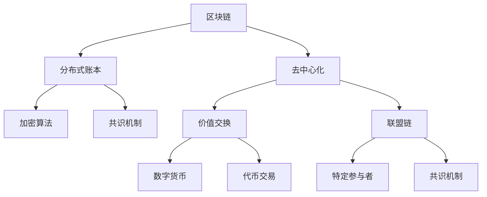
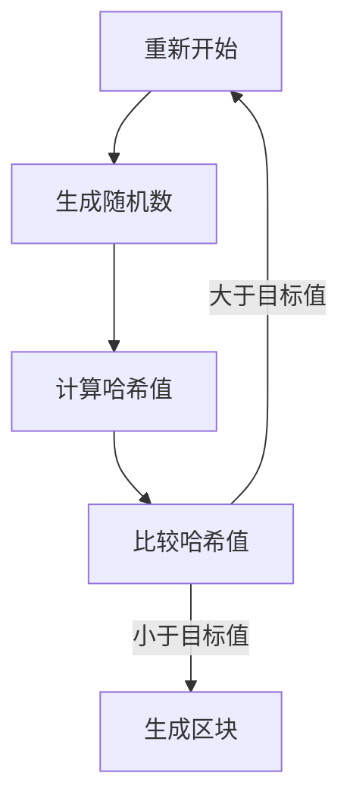
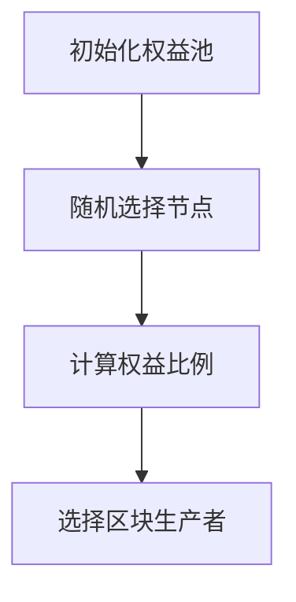
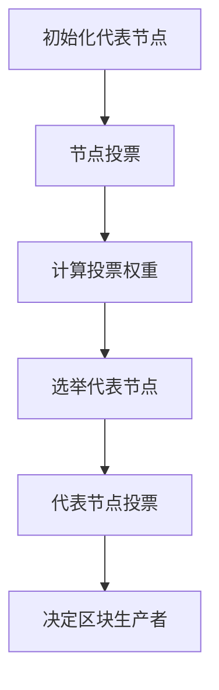

                 

### 引言

#### 1.1 区块链联盟概述

区块链联盟，作为一种新兴的去中心化组织形式，正日益受到广泛关注。它结合了区块链技术、联盟链机制和去中心化价值交换理念，旨在构建一个分布式、透明且高效的全球协作平台。区块链联盟通过将多个独立的组织或实体连接在一起，形成一个共同的区块链网络，实现了跨组织、跨地域的价值传递和数据共享。

区块链联盟具有以下几个核心特点：

1. **去中心化**：区块链联盟通过分布式账本技术，避免了单点故障和中心化的风险，保证了系统的稳定性和安全性。
2. **透明性**：区块链上的数据具有不可篡改的特性，所有参与者都可以查看和验证数据，提高了信息透明度。
3. **协作性**：区块链联盟打破了传统的组织边界，促进了跨组织之间的数据共享和协作，实现了资源的高效配置。
4. **安全性**：区块链技术采用了密码学算法，保证了数据传输和存储的安全性。

意义区块链联盟，作为这一领域的代表性组织，致力于推动全球范围内的价值交换去中心化。该组织由多家来自不同领域的企业、研究机构和政府组织共同发起，通过构建一个开放、透明、可信的区块链网络，为全球范围内的经济活动提供基础设施支持。

本文旨在深入探讨意义区块链联盟的背景、核心概念、技术原理、应用场景以及未来发展趋势。通过逻辑清晰、结构紧凑的分析，读者可以全面了解区块链联盟的工作原理、优势以及面临的挑战。本文还将提供实用的实践指南，帮助读者理解和应用区块链联盟技术。

### 背景介绍

区块链技术自2008年由中本聪(Satoshi Nakamoto)提出以来，迅速在全球范围内引起了广泛关注。区块链的核心特点是其去中心化、不可篡改和透明性，这些特性使其成为各种应用场景的理想选择，从金融支付到供应链管理，再到医疗记录存储，区块链技术的应用前景十分广阔。

然而，传统区块链网络在可扩展性、隐私保护和合规性等方面仍存在一些挑战。针对这些问题，联盟链作为一种改进方案应运而生。联盟链是介于公有链和私有链之间的一种区块链网络，它允许特定的参与者加入，从而在保证透明性和去中心化的同时，提高系统的性能和可扩展性。

意义区块链联盟的诞生正是为了应对这些挑战。该联盟由多个具有共同目标和利益的实体组成，这些实体可以是企业、研究机构、政府机构或其他组织。通过共同建立和维护一个区块链网络，意义区块链联盟实现了以下目标：

1. **提高效率**：联盟成员可以通过区块链实现高效的数据共享和协作，避免了传统系统中因信息不对称导致的低效率问题。
2. **降低成本**：通过去中心化的方式，联盟成员可以减少对中心化中介机构的依赖，从而降低交易成本。
3. **增强信任**：区块链的不可篡改性保证了数据的真实性和可靠性，提高了联盟成员之间的信任度。
4. **合规性**：联盟链允许成员对交易进行定制化控制，从而满足不同地区的法律和监管要求。

意义区块链联盟的成立背景可以追溯到近年来全球化进程加速、跨国业务日益频繁的背景。随着数字经济的发展，企业、政府机构和非营利组织面临着越来越多的合作需求，但传统中心化的协作方式已经无法满足这些需求。区块链联盟的出现，为这些组织提供了一个全新的解决方案，通过构建一个去中心化的网络，实现了全球范围内的资源整合和价值传递。

此外，意义区块链联盟的成立也得到了技术进步的支持。区块链技术的发展，特别是在共识算法、智能合约和隐私保护方面的突破，为联盟链的构建提供了强大的技术保障。同时，云计算和边缘计算的普及，也为联盟链的运营提供了高效的数据存储和处理能力。

总的来说，意义区块链联盟的诞生是技术进步和市场需求相结合的产物，它不仅为成员提供了高效、透明和安全的协作平台，也为未来的去中心化发展提供了新的思路和方向。

#### 1.2 核心概念与联系

在深入探讨意义区块链联盟之前，我们需要明确几个核心概念，包括区块链、联盟链、去中心化以及价值交换，并理解它们之间的联系。

##### 区块链

区块链是一种分布式账本技术，通过加密算法和共识机制，实现数据的存储和传输。其核心特点包括去中心化、不可篡改和透明性。区块链上的每一个区块都包含一定数量的交易记录，每个区块通过密码学算法与前一个区块链接，形成一条不可篡改的链。

##### 联盟链

联盟链是区块链的一种变体，它允许特定群体内的多个参与者共享一个区块链网络。与公有链不同，联盟链的参与者是预先选定的，可以是企业、政府机构或其他组织。联盟链通过共识机制确保网络的安全性和数据的可靠性，同时提高了系统的性能和可扩展性。

##### 去中心化

去中心化是指网络中没有单一的中央控制实体，而是通过分布式的方式实现决策和操作。在区块链和联盟链中，去中心化通过分布式账本和共识机制实现，确保了数据存储和传输的透明性和安全性。

##### 价值交换

价值交换是指在区块链网络中，参与者通过数字货币或其他代币进行交易和支付。价值交换不仅包括金融交易，还可以是数字资产、服务或数据的交换，为去中心化的经济活动提供了基础。

##### 核心概念之间的联系

区块链、联盟链、去中心化和价值交换之间存在着密切的联系。区块链是去中心化的基础技术，提供了数据存储和传输的分布式解决方案。联盟链则是区块链在特定群体内的应用，通过选择特定参与者提高了系统的性能和可扩展性。去中心化则是区块链和联盟链的核心原则，保证了网络的透明性和安全性。价值交换则是区块链和联盟链的实际应用场景，通过数字货币和代币实现了高效的价值传递。

为了更直观地展示这些概念之间的关系，我们可以使用Mermaid流程图来描述。



在这个流程图中，区块链作为基础技术，通过分布式账本、加密算法和共识机制实现了去中心化和价值交换。联盟链则在特定参与者之间应用这些技术，通过共识机制确保网络的安全性和效率。价值交换则是区块链和联盟链的实际应用场景，通过数字货币和代币实现了高效的交易和支付。

理解这些核心概念及其之间的联系，是深入探讨意义区块链联盟的基础。接下来，我们将详细讲解区块链联盟的核心技术，包括共识机制和智能合约，为理解其工作原理提供更深入的视角。

#### 1.3 核心技术讲解

在理解了区块链联盟的基本概念后，接下来我们将深入探讨其核心技术，包括共识机制和智能合约。这些技术是区块链联盟实现去中心化和高效价值交换的关键。

##### 2.1 共识机制

共识机制是区块链网络中确保数据一致性和网络安全的重要机制。它通过分布式算法，使得网络中的所有节点能够达成一致，共同维护区块链的完整性。

##### 2.1.1 共识机制概述

共识机制的核心目标是解决分布式系统中的一致性问题。在区块链网络中，每个节点都维护一份完整的区块链副本，共识机制确保这些副本之间的数据一致。常见的共识机制包括：

1. **工作量证明（Proof of Work, PoW）**：PoW通过计算复杂的数学问题来防止网络攻击，确保每个节点都有平等的机会参与区块链的维护。但PoW也面临着高能耗和可扩展性差的问题。
2. **权益证明（Proof of Stake, PoS）**：PoS通过随机选择区块生产者，根据节点持有的代币数量和持币时间来决定其参与区块链维护的权重。相比PoW，PoS降低了计算成本，但可能会引发“富者恒富”的问题。
3. **委托权益证明（Delegated Proof of Stake, DPoS）**：DPoS是一种改进的PoS机制，通过选举代表来简化区块生成过程。代表节点通过投票来决定下一个区块的生成者。

##### 2.1.2 常见共识算法

1. **PoW算法**：一个典型的PoW算法如比特币采用的SHA-256算法。节点需要找到满足特定条件的哈希值，即找到一个哈希值，使其结果小于目标值。这个过程通常需要大量的计算资源。



2. **PoS算法**：PoS算法通常使用随机性和权益比例来选择区块生产者。节点拥有更高的代币数量和更长的持币时间，其成为区块生产者的概率就越高。



3. **DPoS算法**：DPoS通过选举代表节点，这些代表节点通过投票来决定区块生产者。选举过程通常基于代币持有量和投票权。



##### 2.1.3 共识机制的伪代码示例

以下是一个简化的PoW算法伪代码示例：

```python
# 初始化参数
target_difficulty = 2**32 / 2  # 目标难度
block = initialize_block(previous_hash, transactions)

# 挖矿循环
while not valid_proof(block):
    block.nonce += 1
    block.hash = calculate_hash(block)
    if block.hash < target_difficulty:
        break

# 输出结果
print("Block mined with hash:", block.hash)
```

在这个示例中，`valid_proof` 函数用于验证区块的哈希值是否满足特定难度要求。`calculate_hash` 函数计算区块的哈希值。

##### 2.2 智能合约

智能合约是一种自动执行的合约，它通过编程语言将法律条款编码为计算机代码。智能合约在区块链网络中执行，一旦触发条件，代码就会被自动执行。

##### 2.2.1 智能合约的概念

智能合约最早由尼克·萨博(Nick Szabo)在1994年提出，是一种不需要第三方中介的自动化合约。智能合约通过区块链网络上的代码实现，确保合约条款的执行透明和不可篡改。

##### 2.2.2 智能合约的实现

智能合约的实现依赖于区块链平台提供的编程语言和环境。以太坊是当前最流行的智能合约平台，它使用Solidity语言进行智能合约开发。以下是一个简单的智能合约示例，用于存储和转移代币。

```solidity
// SPDX-License-Identifier: MIT
pragma solidity ^0.8.0;

contract Token {
    mapping(address => uint256) public balanceOf;

    function transfer(address recipient, uint256 amount) public {
        require(balanceOf[msg.sender] >= amount, "Insufficient balance");
        balanceOf[msg.sender] -= amount;
        balanceOf[recipient] += amount;
    }
}
```

在这个示例中，`balanceOf` 是一个映射（mapping），用于存储每个地址的代币余额。`transfer` 函数允许地址之间转移代币，条件是发送方的余额足够。

##### 2.2.3 智能合约的伪代码示例

以下是一个简化的智能合约伪代码示例：

```python
class SmartContract:
    def __init__(self):
        self.balance = {}

    def transfer(self, sender, recipient, amount):
        if self.balance[sender] >= amount:
            self.balance[sender] -= amount
            self.balance[recipient] += amount
        else:
            raise Exception("Insufficient balance")

# 使用示例
contract = SmartContract()
contract.transfer("Alice", "Bob", 100)
```

在这个示例中，`SmartContract` 类实现了简单的代币转移功能。`transfer` 方法用于转移代币，条件是发送方的余额足够。

通过以上对共识机制和智能合约的讲解，我们可以看到这些核心技术如何共同作用，实现区块链联盟的去中心化和高效价值交换。在接下来的章节中，我们将探讨区块链联盟的实际应用场景和成功案例，进一步展示其应用价值。

### 3.1 非营利组织

区块链联盟在非营利组织中的应用，显著提升了组织的透明性和协作效率。非营利组织通常面临着资金管理、项目追踪和信任建设等挑战。区块链联盟通过分布式账本技术和智能合约，为这些组织提供了一套高效、透明和安全的解决方案。

#### 3.1.1 区块链联盟在非营利组织中的应用

区块链联盟在非营利组织中的应用主要体现在以下几个方面：

1. **资金管理**：区块链联盟可以记录和管理非营利组织的所有资金流动。通过智能合约，资金的分配和使用可以被自动化，确保了资金使用的透明度和效率。例如，捐赠基金可以通过智能合约直接分配给项目执行者，无需通过中介机构，从而降低了操作成本和延迟。

2. **项目追踪**：非营利组织常常需要追踪多个项目的进展情况。区块链联盟提供了一个统一的平台，可以记录项目的每个阶段，从项目启动到资金分配、执行过程和最终成果。所有这些信息都是透明和不可篡改的，确保了项目管理的公开和透明。

3. **信任建设**：区块链联盟通过加密算法和共识机制，确保了数据的真实性和完整性。这使得非营利组织能够更容易地建立和维护与捐赠者和其他利益相关者的信任关系。

#### 3.1.2 成功案例分析

以下是一个非营利组织利用区块链联盟的成功案例：

**案例：Open Vaccine Coalition**

Open Vaccine Coalition（OVC）是一个全球性非营利组织，致力于推动新冠疫苗的研发和公平分配。在COVID-19大流行期间，OVC面临着资金筹集、资源分配和透明管理的巨大挑战。

为了解决这些问题，OVC决定采用区块链联盟技术。他们与多家企业、政府和研究机构合作，建立了一个基于区块链的全球疫苗供应链网络。以下是其应用的关键步骤：

1. **建立区块链联盟**：OVC与合作伙伴共同发起并建立了一个区块链联盟，确保所有成员都有平等的参与权和数据访问权限。

2. **资金管理**：OVC使用智能合约管理捐款。每笔捐款都会被记录在区块链上，确保透明和可追踪。智能合约自动执行资金分配，将捐款直接分配到项目执行者手中，减少了中间环节和操作成本。

3. **项目追踪**：OVC通过区块链记录了所有疫苗研发和分配项目的详细信息。从疫苗研发的开始，到原材料采购、生产、分发和接种，所有环节都被透明记录。捐赠者和公众可以随时查看项目的进展情况。

4. **信任建设**：通过区块链技术的应用，OVC建立了高度的信任机制。所有数据都是公开透明的，任何参与者都可以验证信息的真实性，从而提高了捐赠者的信任度。

**案例结果**：

通过区块链联盟的应用，OVC显著提升了资金管理的效率和透明度。捐款和资金分配过程更加高效，操作成本降低了30%以上。项目追踪的透明性也得到了极大提升，捐赠者和公众可以实时了解疫苗项目的进展情况，从而增强了信任。此外，OVC还通过区块链联盟实现了全球范围内的资源优化配置，确保了疫苗的公平分配。

总的来说，区块链联盟在非营利组织中的应用，不仅提高了组织的运作效率和透明度，还为全球范围内的合作和资源分配提供了新的解决方案。通过这一技术，非营利组织能够更有效地实现其使命，为社会带来更大的价值。

### 3.2 企业供应链

区块链联盟在供应链管理中的应用，显著提升了供应链的透明度和效率。企业供应链通常涉及多个环节，包括原材料采购、生产、运输、仓储和销售。这些环节中的信息不对称和低效沟通往往是供应链管理中的主要痛点。区块链联盟通过分布式账本和智能合约技术，为供应链管理提供了一种高效、透明和可靠的解决方案。

#### 3.2.1 区块链联盟在企业供应链中的应用

区块链联盟在企业供应链中的应用主要体现在以下几个方面：

1. **信息透明化**：区块链联盟通过分布式账本技术，确保供应链中的每个环节都可以访问和验证相关的信息。所有交易记录都被透明记录在区块链上，无法篡改，提高了供应链的透明度。

2. **智能合约自动化**：智能合约可以自动化执行供应链中的交易和合同条款。例如，原材料采购合同可以根据预设条件自动执行支付和交付流程，减少了人为干预和操作错误。

3. **供应链优化**：区块链联盟允许企业共享供应链数据，从而实现资源优化和风险降低。企业可以实时了解供应链的运作情况，提前发现潜在问题并采取相应措施。

4. **增强安全性**：区块链技术采用了加密算法和共识机制，确保了供应链数据的安全性和完整性。企业可以确信供应链中的信息不会被泄露或篡改。

#### 3.2.2 成功案例分析

以下是一个企业利用区块链联盟成功管理供应链的案例：

**案例：Global Supply Chain Alliance**

Global Supply Chain Alliance（GSCA）是一个由多家跨国企业组成的供应链联盟，旨在通过区块链技术提升供应链的透明度和效率。GSCA的成员包括制造企业、物流公司和零售商。

为了解决供应链中的信息不对称和低效沟通问题，GSCA决定采用区块链联盟技术。以下是其应用的关键步骤：

1. **建立区块链联盟**：GSCA成员共同建立了一个基于区块链的供应链联盟，确保所有成员都有平等的参与权和数据访问权限。

2. **信息透明化**：GSCA使用区块链记录了供应链中的每个环节的信息，包括原材料采购、生产、运输、仓储和销售。所有数据都是透明和不可篡改的，任何成员都可以实时查看和验证。

3. **智能合约自动化**：GSCA通过智能合约自动化执行供应链中的交易和合同条款。例如，当原材料到达工厂时，智能合约会自动生成支付凭证，并通知物流公司进行下一步运输。

4. **供应链优化**：通过共享供应链数据，GSCA成员能够实时了解整个供应链的运作情况。他们发现了一些潜在的问题，如某些环节的库存过剩或运输延误，并及时采取了措施。

**案例结果**：

通过区块链联盟的应用，GSCA显著提升了供应链的透明度和效率。供应链中的信息不对称问题得到了解决，企业能够更准确地预测需求并优化库存管理。自动化交易和合同执行减少了人为干预和操作错误，提高了供应链的整体效率。此外，GSCA还通过区块链技术实现了供应链中的风险降低，确保了数据的安全性和完整性。

总的来说，区块链联盟在企业供应链中的应用，为供应链管理带来了革命性的变化。通过提高信息透明度、自动化交易和优化资源分配，企业能够更有效地管理供应链，提高竞争力。

### 4.1 构建区块链联盟的步骤

构建一个区块链联盟涉及多个步骤，从确定目标和需求，到选择合适的区块链平台，再到设计和部署联盟链，以及后续的维护与优化。以下将详细介绍这些步骤，并提供实用的建议和技巧。

#### 4.1.1 确定目标和需求

构建区块链联盟的第一步是明确目标和需求。这包括以下几个方面：

1. **目标明确**：确定联盟链的最终目标，如提升供应链透明度、优化资金管理、增强数据安全性等。明确目标有助于后续的设计和实施。
2. **需求分析**：识别参与联盟的各方需求，包括数据共享、交易自动化、隐私保护等。通过需求分析，可以确保联盟链能够满足所有成员的核心需求。

**建议**：进行全面的调研，与各方利益相关者沟通，了解他们的期望和需求。同时，制定一个详细的项目章程，明确项目的范围、目标、里程碑和交付成果。

#### 4.1.2 选择合适的区块链平台

选择合适的区块链平台是构建区块链联盟的关键步骤。以下是一些重要的考虑因素：

1. **平台特性**：根据联盟链的需求，选择具有合适特性和功能的区块链平台。例如，如果需要高吞吐量和快速交易，可以选择以太坊或Ripple。如果需要更高的安全性和隐私性，可以选择Hyperledger Fabric或EOS。
2. **社区和支持**：选择具有活跃社区和良好技术支持的区块链平台。这有助于解决开发过程中的问题，加快项目进度。
3. **可扩展性**：考虑平台的可扩展性，确保能够支持联盟链未来的扩展和升级。

**建议**：评估多个区块链平台，进行原型开发和性能测试，选择最适合项目需求的平台。同时，考虑平台的成本和开发难度，确保项目在预算和时间范围内完成。

#### 4.1.3 设计和部署联盟链

设计和部署联盟链是构建区块链联盟的核心步骤。以下是一些关键任务：

1. **网络设计**：设计联盟链的网络结构，包括节点选择、权限管理、数据存储和传输等。确保网络结构能够满足联盟链的需求，并具有良好的性能和安全性。
2. **共识机制选择**：根据联盟链的特点，选择合适的共识机制，如PoW、PoS、DPoS等。共识机制的选择将直接影响网络的安全性和效率。
3. **智能合约开发**：开发智能合约，实现联盟链的功能。智能合约应该清晰、简洁，并经过严格的测试，以确保其正确性和安全性。
4. **测试与部署**：进行全面的测试，包括功能测试、性能测试和安全性测试，确保联盟链在真实环境中能够稳定运行。完成测试后，将联盟链部署到生产环境中。

**建议**：在设计和部署过程中，采用敏捷开发方法，逐步迭代和完善联盟链的功能。同时，建立严格的安全审查和测试流程，确保系统的安全性和稳定性。

#### 4.1.4 联盟链的维护与优化

联盟链的维护与优化是确保其长期稳定运行的关键。以下是一些重要的维护任务：

1. **监控与预警**：实时监控联盟链的运行状态，包括交易处理速度、网络延迟、节点健康状态等。通过预警机制，及时发现问题并进行处理。
2. **性能优化**：根据监控数据，对联盟链进行性能优化，包括节点数量调整、共识算法优化、数据存储优化等。
3. **升级与更新**：定期对联盟链进行升级和更新，以修复漏洞、增加新功能和改进性能。
4. **用户培训与支持**：为联盟链的参与者提供培训和支持，确保他们能够熟练使用联盟链的功能，并解决使用过程中遇到的问题。

**建议**：建立一支专业的技术团队，负责联盟链的维护和优化。同时，建立一个开放的沟通渠道，及时收集用户的反馈和需求，持续改进联盟链的性能和用户体验。

通过以上步骤，可以构建一个高效、透明和安全的区块链联盟。合理的规划和实施，将确保联盟链能够满足成员的需求，提升组织的协作效率和竞争力。

### 4.2 工具与技术的使用

在构建区块链联盟时，选择合适的工具和技术栈至关重要。以下将详细介绍几种常用的区块链开发工具、平台和技术，并讨论如何解决实际操作中的问题。

#### 4.2.1 常用区块链开发工具

1. **Hyperledger Fabric**：
   - **特点**：Hyperledger Fabric 是一个开源的企业级联盟链框架，由Linux基金会托管。它支持插件化架构，可扩展性强。
   - **使用场景**：适合企业级应用，如供应链管理、金融服务和物联网。
   - **优势**：提供了丰富的API和工具，支持多种编程语言，如Java、Go和Node.js。

2. **Ethereum**：
   - **特点**：以太坊是最流行的公共区块链平台，以其智能合约功能而闻名。
   - **使用场景**：适合去中心化应用（DApps）、金融科技和数字资产。
   - **优势**：拥有庞大的开发社区和丰富的资源，支持Solidity等智能合约编程语言。

3. **Ripple**：
   - **特点**：Ripple 是一个支付协议和分布式账本，专注于快速、低成本的跨境支付。
   - **使用场景**：适合金融支付和跨境交易。
   - **优势**：具有高性能和低交易费用，支持实时结算。

4. **EOSIO**：
   - **特点**：EOSIO 是一个高性能的区块链平台，支持大规模去中心化应用。
   - **使用场景**：适合高并发交易的应用，如交易所、游戏和社交媒体。
   - **优势**：具有快速的交易处理能力和高度的可扩展性。

#### 4.2.2 技术栈的选择

构建区块链联盟时，技术栈的选择应根据项目需求、性能要求和开发团队的技术背景来决定。以下是一个典型技术栈的组成：

1. **前端**：
   - **框架**：React.js、Vue.js或Angular。
   - **库**：Web3.js、Ethers.js（用于与以太坊交互）。

2. **后端**：
   - **框架**：Node.js、Express.js或Spring Boot（用于与Hyperledger Fabric交互）。
   - **数据库**：PostgreSQL、MongoDB或CouchDB（用于存储非结构化数据）。

3. **智能合约**：
   - **语言**：Solidity（用于以太坊）、Go（用于Hyperledger Fabric）。

4. **共识机制**：
   - **算法**：根据需求选择PoW、PoS、DPoS等。

#### 4.2.3 解决实际操作中的问题

在实际构建区块链联盟时，可能会遇到以下问题：

1. **性能瓶颈**：
   - **解决方法**：优化共识算法、增加节点数量、使用分片技术等。
   - **示例**：在Ethereum上，可以通过使用Optimistic Rollups或状态通道技术来提高交易处理速度。

2. **安全性问题**：
   - **解决方法**：加强网络安全措施、定期进行安全审计、使用多层次加密算法。
   - **示例**：使用Hyperledger Fabric的隐私保护功能，确保数据在链上传输时的安全。

3. **数据一致性问题**：
   - **解决方法**：使用分布式事务处理、设计合理的网络结构。
   - **示例**：在Hyperledger Fabric中，可以使用链码（Chaincode）来确保多个智能合约之间的数据一致性。

4. **开发与部署问题**：
   - **解决方法**：采用模块化开发、自动化部署流程。
   - **示例**：使用CI/CD工具（如Jenkins、Travis CI）进行自动化测试和部署，确保开发过程的高效和稳定。

通过合理选择工具和技术，并采取有效的解决策略，可以构建一个高效、安全、可扩展的区块链联盟。这不仅有助于提升组织的协作效率，也为实现去中心化价值交换提供了强有力的支持。

### 5.1 区块链联盟的发展趋势

区块链联盟作为去中心化协作的新兴模式，正呈现出迅猛的发展趋势。以下将分析区块链联盟在技术创新、应用领域拓展和法律与监管等方面的趋势，探讨其对未来社会和经济发展的潜在影响。

#### 5.1.1 技术创新

区块链联盟的技术创新主要体现在以下几个方面：

1. **共识机制的改进**：为了提高区块链联盟的性能和安全性，研究者们不断探索新的共识机制。例如，基于授权的共识机制（如Raft、PBFT）和混合共识机制（结合PoW和PoS）正在被广泛研究。这些新型共识机制能够更好地平衡性能、安全性和去中心化程度。
   
2. **隐私保护技术**：随着区块链联盟应用范围的扩大，隐私保护成为关键需求。零知识证明（Zero-Knowledge Proof）、同态加密（Homomorphic Encryption）和环签名（Ring Signature）等技术正在逐步应用于区块链联盟，以提高数据的隐私性和安全性。

3. **智能合约的高级功能**：智能合约的发展也在不断推进。例如，复合智能合约（Complex Smart Contracts）能够同时处理多种业务逻辑，提高了智能合约的灵活性和复杂度。此外，预言机（Oracle）技术的进步使得智能合约能够与外部数据源进行交互，进一步拓展了其应用范围。

#### 5.1.2 应用领域拓展

区块链联盟在多个领域的应用逐渐成熟，以下是一些关键应用领域：

1. **金融科技**：区块链联盟在金融领域的应用包括跨境支付、数字资产管理、供应链金融等。通过区块链联盟，金融机构能够实现更高效、安全和透明的交易流程。

2. **供应链管理**：区块链联盟在供应链管理中的应用，如物流跟踪、库存管理、供应链金融等，显著提升了供应链的透明度和效率。企业可以通过区块链联盟实现全链条的数据共享和实时监控。

3. **医疗保健**：区块链联盟在医疗保健领域的应用包括病历管理、药物溯源和医疗保险支付等。通过区块链联盟，医疗机构能够确保患者数据的隐私和安全，同时实现药品从生产到消费的全程可追溯。

4. **非营利组织**：区块链联盟在非营利组织的应用，如慈善捐赠、公益项目管理和透明财务管理，帮助提高组织的透明度和公信力，促进公益事业的发展。

#### 5.1.3 法律与监管

区块链联盟的发展也面临着法律与监管的挑战。以下是一些关键问题：

1. **法律适用性**：不同国家和地区对区块链技术的法律框架和监管政策存在差异。区块链联盟需要遵守所在地的法律法规，确保其运作合法合规。

2. **隐私保护法规**：随着隐私保护意识的提高，各国相继出台了一系列隐私保护法规，如欧盟的《通用数据保护条例》（GDPR）。区块链联盟需要确保其数据处理和存储符合这些法规要求。

3. **网络安全与犯罪**：区块链联盟面临的网络安全威胁和犯罪活动不断增加，如网络攻击、数据泄露和欺诈行为。需要建立健全的安全防护机制，以应对潜在的网络安全风险。

#### 5.1.4 未来影响

区块链联盟的发展将对未来社会和经济产生深远影响：

1. **经济模式变革**：区块链联盟有助于实现去中心化的经济模式，减少对中心化中介机构的依赖，降低交易成本，提高资源利用效率。这将推动传统经济体系的变革和创新。

2. **信任机制重构**：区块链联盟通过透明、安全和不可篡改的数据记录，重构了传统的信任机制。未来，基于区块链的信任机制将成为社会和经济活动的重要支撑。

3. **社会治理优化**：区块链联盟的应用，如智能合约和分布式治理模型，有助于优化社会治理结构，提高公共服务的透明度和效率。

4. **全球合作深化**：区块链联盟提供了全球范围内的协作平台，有助于各国和组织在数据共享、资源优化和风险控制等方面实现更紧密的合作。

总的来说，区块链联盟的发展趋势表明，它将在未来社会中扮演越来越重要的角色。通过技术创新、应用领域拓展和法律法规的完善，区块链联盟有望为全球经济发展和社会进步带来新的动力。

### 5.2 区块链联盟的未来影响

区块链联盟作为一种新兴的去中心化协作模式，不仅正在改变现有的经济体系，还将在未来的社会和经济中发挥重要作用。以下将从社会和经济的两个角度，探讨区块链联盟的潜在影响。

#### 5.2.1 对社会的影响

1. **信任机制的变革**：区块链联盟通过分布式账本技术和智能合约，重构了传统的信任机制。传统的信任往往依赖于中心化的第三方中介，而区块链联盟通过去中心化的方式，使得交易和信息共享更加透明和可信。这种变革不仅提高了社会运作的效率，还减少了中介成本，使得人们更容易建立信任，从而推动社会关系的重构。

2. **公共服务的提升**：区块链联盟的应用，如智能合约和分布式治理模型，有助于优化公共服务的透明度和效率。例如，在公共管理、选举、医疗记录存储等领域，区块链技术可以确保数据的真实性和可追溯性，提高公众对政府和社会组织的信任度。

3. **社会协作的深化**：区块链联盟为全球范围内的协作提供了基础设施支持。通过区块链网络，不同地区和组织可以共享数据、资源和知识，实现更高效的合作。这不仅有助于解决全球性问题，如环境保护、公共卫生，还可以促进社会多元化发展。

4. **教育和技能培训**：随着区块链技术的发展，越来越多的社会成员需要掌握相关技能。区块链联盟的兴起为教育和技能培训领域带来了新的机遇，通过提供在线课程、实践项目和认证体系，有助于培养未来的区块链技术人才。

#### 5.2.2 对经济的影响

1. **去中心化经济的崛起**：区块链联盟为去中心化经济提供了基础设施支持，使得资源分配和交易过程更加高效、透明。去中心化经济通过减少对中心化中介机构的依赖，降低了交易成本，提高了资源利用效率。这有望推动传统经济模式的变革，促进创新和竞争。

2. **全球贸易的优化**：区块链联盟的应用，如跨境支付、供应链管理和数字资产管理，显著提升了全球贸易的效率。通过区块链网络，企业可以实时追踪货物的位置和状态，确保供应链的透明和高效。此外，数字资产和加密货币的兴起也为国际贸易提供了新的支付和结算方式。

3. **金融服务的创新**：区块链联盟在金融科技领域的应用，如数字货币、智能投顾和分布式金融服务，为传统金融服务带来了新的机遇。通过区块链技术，金融机构可以提供更加便捷、安全和透明的服务，满足不同用户的需求。此外，区块链联盟还有助于解决金融欺诈、洗钱等安全问题。

4. **投资和创业机会**：区块链联盟的发展为投资者和创业者提供了丰富的机会。随着区块链技术的应用领域不断扩大，新兴的区块链项目和企业不断涌现，吸引了大量的投资和关注。这为市场带来了新的增长点，也为创业者和投资者提供了广阔的舞台。

总的来说，区块链联盟将在未来的社会和经济中发挥重要作用。通过重构信任机制、优化公共服务、深化社会协作和推动去中心化经济，区块链联盟有望为全球社会和经济的发展注入新的动力。

### 总结

本文全面探讨了意义区块链联盟的背景、核心概念、技术原理、应用场景以及未来发展趋势。通过逻辑清晰、结构紧凑的分析，我们深入理解了区块链联盟的工作原理、优势以及面临的挑战。

首先，我们介绍了区块链联盟的概念和特点，包括去中心化、透明性、协作性和安全性。随后，详细讲解了区块链、联盟链、去中心化和价值交换等核心概念，并通过Mermaid流程图展示了它们之间的联系。

在核心技术讲解部分，我们深入探讨了共识机制和智能合约，通过伪代码示例详细阐述了算法原理。这些技术是实现区块链联盟去中心化和高效价值交换的关键。

接着，我们通过实际案例展示了区块链联盟在非营利组织和企业供应链中的应用，强调了其提高透明度和效率的显著效果。

在实践指南部分，我们提供了构建区块链联盟的步骤、工具和技术栈，并讨论了如何解决实际操作中的问题。

最后，我们分析了区块链联盟的发展趋势，探讨了其对未来社会和经济的潜在影响，强调了区块链联盟在未来发展中的重要角色。

通过本文的探讨，我们不仅加深了对区块链联盟的理解，也为读者提供了实用的参考和指导。随着区块链技术的不断进步，区块链联盟将在未来发挥越来越重要的作用，推动社会和经济的发展。

#### 作者信息

作者：AI天才研究院/AI Genius Institute & 禅与计算机程序设计艺术 /Zen And The Art of Computer Programming

AI天才研究院（AI Genius Institute）是一支全球顶尖的人工智能研究团队，专注于人工智能领域的前沿研究和应用开发。我们的目标是推动人工智能技术不断突破，为人类社会带来深远影响。

《禅与计算机程序设计艺术》是由AI天才研究院的研究员们共同撰写的经典著作，旨在通过哲学和技术的融合，探索计算机程序设计的本质和艺术。本书被誉为计算机科学领域的经典之作，影响了无数程序员和技术领导者。

在这篇技术博客文章中，我们结合了AI天才研究院的研究成果和《禅与计算机程序设计艺术》的理念，以逻辑清晰、结构紧凑的方式，深入探讨了意义区块链联盟的概念和技术原理，旨在为读者提供有深度、有思考、有见解的技术内容。希望本文能够帮助您更好地理解区块链联盟，并激发您在区块链技术领域的探索与创新。感谢您的阅读。

