                 

### 文章标题

《意义区块链联盟：推动去中心化价值交换网络的组织》

### 关键词

区块链，去中心化，价值交换网络，组织结构，共识机制

### 摘要

本文深入探讨了区块链技术在构建去中心化价值交换网络中的关键作用，以及意义区块链联盟如何推动这一革命性进程。文章首先阐述了区块链的基本概念和去中心化的优势，随后详细解析了区块链的核心算法原理和数学模型。接着，文章探讨了价值交换网络机制及其在去中心化组织管理中的应用，最后通过实际案例分析了区块链项目的开发流程和去中心化组织的成功经验。全文旨在为读者提供一个全面、系统的区块链与去中心化价值交换网络的视角，助力其在技术实践中取得成功。

### 用户需求分析

在现代信息技术的发展浪潮中，区块链技术以其独特的去中心化特性在金融、供应链、医疗等多个领域引发了革命性的变革。然而，区块链技术的复杂性和专业性使得许多潜在用户在面对这一新兴技术时感到困惑。因此，本文旨在满足以下用户需求：

1. **理解区块链技术的基本概念**：用户需要清晰了解区块链的定义、核心特点以及其与去中心化技术的联系，以便更好地掌握区块链技术的本质。

2. **掌握区块链技术的基础**：用户需要深入学习区块链的核心算法原理、分布式网络协议和智能合约原理，以便在实际项目中能够正确应用和优化这些技术。

3. **了解价值交换网络机制**：用户需要了解区块链如何在去中心化的环境中实现价值交换，包括代币与激励模型、共识机制与网络稳定性、数据隐私保护机制等。

4. **掌握区块链项目开发实战**：用户需要了解区块链项目的开发流程，包括项目规划、平台选型、智能合约开发与部署等，以便在实际项目中能够顺利推进。

5. **学习去中心化组织管理**：用户需要了解如何利用区块链技术构建去中心化组织，包括组织结构、治理模式、激励与共识机制等，以便在实际应用中提高组织的效率和透明度。

### 第一部分：区块链与去中心化概述

#### 第1章：区块链基本概念

区块链是一种分布式数据库技术，它通过在多个参与者之间共享和同步数据，实现去中心化的数据管理和存储。区块链的核心特点包括不可篡改性、透明性和去中心化。

**核心概念与联系：**

区块链的基本概念包括区块、链、节点、挖矿、共识机制等。这些概念相互联系，共同构成了区块链的技术框架。

**Mermaid流程图：**

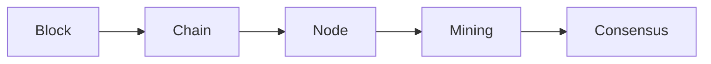

**核心算法原理讲解：**

区块链的共识算法是确保所有节点达成一致的关键机制。常见的共识算法包括工作量证明（PoW）、权益证明（PoS）和委托权益证明（DPoS）。

**数学模型和公式：**

区块链的数据结构可以用哈希函数和 Merkle 树来表示，以确保数据的完整性和一致性。

```latex
H_{256}(x) = \text{SHA-256}(x)
```

**伪代码：**

```python
def blockchain():
    previous_hash = None
    current_hash = None
    blockchain = []

    while True:
        new_block = generate_block(previous_hash)
        current_hash = calculate_hash(new_block)
        blockchain.append(new_block)

        previous_hash = current_hash
        current_hash = None
```

**项目实战：**

在实际项目中，区块链的开发需要考虑网络架构、安全性、性能和可扩展性等因素。以下是区块链项目开发的基本步骤：

1. **需求分析**：明确项目的目标和需求。
2. **平台选型**：选择适合的区块链平台，如 Ethereum、Hyperledger Fabric 等。
3. **智能合约开发**：编写智能合约代码，实现业务逻辑。
4. **测试与部署**：进行测试，确保智能合约的正确性和安全性，然后部署到区块链网络。

**代码解读与分析：**

以下是一个简单的智能合约示例，用于实现一个去中心化应用程序的账户余额查询功能：

```solidity
pragma solidity ^0.8.0;

contract Account {
    mapping(address => uint256) public balances;

    function deposit() public payable {
        balances[msg.sender] += msg.value;
    }

    function withdraw(uint256 amount) public {
        require(balances[msg.sender] >= amount, "Insufficient balance");
        balances[msg.sender] -= amount;
        payable(msg.sender).transfer(amount);
    }
}
```

**实际案例分析和详细讲解剖析：**

以太坊（Ethereum）是一个成功的区块链项目，它通过智能合约实现了去中心化的应用开发。以太坊的网络结构、共识机制和智能合约的运行机制都是其成功的关键因素。

**项目小结：**

区块链技术为去中心化的价值交换网络提供了坚实的基础，但同时也带来了复杂性和挑战。在实际应用中，需要深入理解区块链技术的基本原理，并灵活运用各种技术和工具，以实现高效、安全和可扩展的区块链项目。

**最佳实践 tips：**

- 在开发区块链项目时，应充分考虑安全性、性能和可扩展性。
- 选择合适的区块链平台，并了解其提供的功能和支持。
- 确保智能合约的代码正确和高效，避免常见的编程错误。

**小结：**

区块链技术作为一种革命性的分布式数据库技术，正逐步改变着我们的生活方式和工作方式。通过理解区块链的基本概念、核心算法原理和实际应用案例，我们可以更好地把握这一技术，并为其在各个领域的应用贡献力量。

**注意事项：**

- 区块链项目开发需要跨学科的知识，包括计算机科学、数学和网络技术等。
- 区块链技术仍处于快速发展阶段，需要持续关注最新的研究和应用动态。

**拓展阅读：**

- [Ethereum 官方文档](https://ethereum.org/en/developers/docs/)
- [Hyperledger Fabric 官方文档](https://hyperledger-fabric.readthedocs.io/en/release-2.2/)
- [区块链技术白皮书](https://bitcoin.org/bitcoin.pdf)（比特币）

---

#### 第2章：去中心化与价值交换

去中心化是区块链技术的核心特点之一，它通过消除传统中心化系统的单点故障和信任问题，实现了更加安全、透明和高效的系统运作。价值交换网络则是去中心化系统中实现价值传递的重要机制。

**核心概念与联系：**

去中心化（Decentralization）：去中心化是指将系统的控制权、管理和资源分配分散到多个参与者之间，而不是集中在单一实体或机构中。

价值交换网络（Value Exchange Network）：价值交换网络是一种通过区块链技术实现价值传递和交易的分布式系统。它包括了代币、智能合约、共识机制等核心组件。

**Mermaid流程图：**

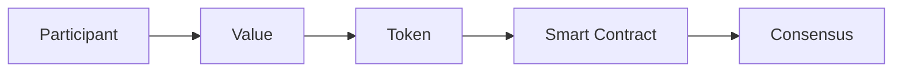

**核心算法原理讲解：**

1. **代币与激励模型**：代币是价值交换网络中的数字资产，用于表示和转移价值。激励模型则用于鼓励参与者参与网络治理和交易验证。

2. **共识机制**：共识机制是确保区块链网络中所有节点达成一致的重要算法。常见的共识机制包括工作量证明（PoW）、权益证明（PoS）和委托权益证明（DPoS）。

3. **智能合约**：智能合约是区块链网络中的自动化协议，用于实现特定的业务逻辑和交易规则。

**数学模型和公式：**

代币的供应量和需求量可以通过数学模型进行预测和调节，以维持市场的稳定。

```latex
\text{Price} = \frac{\text{Supply}}{\text{Demand}}
```

**伪代码：**

```python
def value_exchange_network():
    token_supply = initial_supply()
    token_demand = demand_function()

    while True:
        token_price = calculate_price(token_supply, token_demand)
        token_supply = adjust_supply(token_price)
        token_demand = calculate_demand(token_price)

        if is Stable():
            continue
        else:
            trigger_adjustment()
```

**项目实战：**

价值交换网络在实际应用中可以用于去中心化金融（DeFi）、供应链金融、数字身份验证等领域。

**代码解读与分析：**

以下是一个简单的去中心化金融（DeFi）项目示例，用于实现代币的发行和交易：

```solidity
pragma solidity ^0.8.0;

contract Defi {
    mapping(address => uint256) public balances;

    function issue_token() public {
        balances[msg.sender] += initial_supply();
    }

    function trade_token(address recipient, uint256 amount) public {
        require(balances[msg.sender] >= amount, "Insufficient balance");
        balances[msg.sender] -= amount;
        balances[recipient] += amount;
    }
}
```

**实际案例分析和详细讲解剖析：**

去中心化金融（DeFi）平台如 Aave、Uniswap 等，通过代币和智能合约实现了借贷、交易和流动性挖矿等功能，为用户提供了安全、透明和高效的金融服务。

**项目小结：**

去中心化与价值交换网络是区块链技术的重要组成部分，它们为去中心化系统提供了实现价值传递和交易的基础。通过理解这些核心概念和机制，我们可以更好地把握区块链技术的发展方向，并探索其在各个领域的应用潜力。

**最佳实践 tips：**

- 在设计价值交换网络时，应充分考虑市场的需求和供给，以实现价格稳定。
- 选择适合的共识机制，以提高网络的性能和安全性。
- 确保智能合约的安全性和效率，以减少潜在的风险。

**小结：**

去中心化与价值交换网络为区块链技术的发展提供了广阔的空间。通过深入了解这些概念和机制，我们可以更好地理解和应用区块链技术，为去中心化系统的构建和优化提供有力支持。

**注意事项：**

- 区块链技术的安全性至关重要，应采取严格的措施来保护网络和用户资产的安全。
- 区块链技术的应用需要遵守相关法律法规，确保合规性。

**拓展阅读：**

- [DeFi 官方文档](https://docs.aave.com/)
- [Uniswap 官方文档](https://uniswap.org/docs/v2/)
- [区块链安全白皮书](https://www.blockchain.com/resources/security)

---

#### 第3章：区块链技术的发展历程

区块链技术起源于比特币（Bitcoin）的诞生，自2009年比特币网络启动以来，区块链技术经历了迅速的发展和广泛应用。从比特币到智能合约，再到去中心化金融（DeFi）和区块链游戏，区块链技术不断拓展其应用领域，逐步改变了传统行业和商业模式的运作方式。

**核心概念与联系：**

1. **比特币**：比特币是第一个成功应用区块链技术的数字货币，通过区块链实现了去中心化的交易和账本管理。
2. **智能合约**：以太坊（Ethereum）引入了智能合约，使得区块链不再局限于简单的交易记录，而是能够执行复杂的业务逻辑和自动化交易。
3. **DeFi**：去中心化金融（DeFi）是区块链技术在金融领域的应用，通过智能合约实现了借贷、交易、流动性挖矿等功能，为用户提供了去中心化的金融服务。
4. **区块链游戏**：区块链游戏利用区块链技术实现了游戏资产的去中心化管理和交易，为游戏玩家提供了更多自主权和互动性。

**Mermaid流程图：**

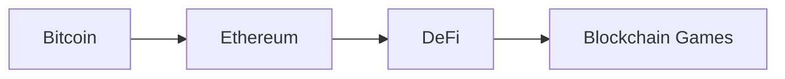

**核心算法原理讲解：**

1. **比特币的区块链技术**：比特币通过工作量证明（PoW）共识机制，确保了区块链的安全性和不可篡改性。
2. **以太坊的智能合约**：以太坊引入了图灵完备的智能合约语言 Solidity，使得开发者可以在区块链上构建去中心化的应用（DApps）。
3. **DeFi的共识机制**：DeFi平台采用了多种共识机制，如PoS、DPoS等，以提高网络的性能和安全性。
4. **区块链游戏的非同质化代币（NFT）**：区块链游戏利用非同质化代币（NFT）实现了游戏资产的去中心化管理和交易，确保了游戏玩家的资产所有权和安全性。

**数学模型和公式：**

1. **比特币的交易速度**：比特币的交易速度可以通过区块产生速度和交易确认时间来衡量。

   ```latex
   \text{Transaction Speed} = \frac{\text{Block Time}}{\text{Confirmation Time}}
   ```

2. **以太坊的交易费用**：以太坊的交易费用与网络的拥堵程度和交易复杂性相关。

   ```latex
   \text{Transaction Fee} = f(\text{Network Load}, \text{Transaction Complexity})
   ```

**伪代码：**

```python
def blockchain_technology():
    if blockchain_type == "Bitcoin":
        consensus_mechanism = proof_of_work()
    elif blockchain_type == "Ethereum":
        consensus_mechanism = proof_of_stake()
    elif blockchain_type == "DeFi":
        consensus_mechanism = multi_consensus()
    elif blockchain_type == "Blockchain Games":
        consensus_mechanism = nft_marketplace()

    while True:
        transaction = receive_transaction()
        if consensus_mechanism.validate(transaction):
            add_transaction_to_blockchain(transaction)
        else:
            reject_transaction(transaction)
```

**项目实战：**

1. **比特币网络**：比特币网络通过挖矿和交易确认机制，实现了去中心化的数字货币交易。
2. **以太坊智能合约**：以太坊智能合约平台为开发者提供了丰富的开发工具和框架，如Truffle和Hardhat，使得智能合约的开发和部署更加便捷。
3. **去中心化金融（DeFi）平台**：Aave、Compound等DeFi平台通过智能合约实现了借贷、交易和流动性挖矿等功能，为用户提供了去中心化的金融服务。
4. **区块链游戏**：Axie Infinity等区块链游戏通过NFT和游戏代币，实现了游戏资产的去中心化管理和交易，为玩家提供了独特的游戏体验。

**代码解读与分析：**

以下是一个简单的以太坊智能合约示例，用于实现去中心化金融（DeFi）平台的流动性挖矿功能：

```solidity
pragma solidity ^0.8.0;

contract LiquidityMining {
    mapping(address => uint256) public balances;

    function deposit() public payable {
        balances[msg.sender] += msg.value;
    }

    function withdraw(uint256 amount) public {
        require(balances[msg.sender] >= amount, "Insufficient balance");
        balances[msg.sender] -= amount;
        payable(msg.sender).transfer(amount);
    }
}
```

**实际案例分析和详细讲解剖析：**

以太坊智能合约平台和DeFi平台如Aave、Compound等，通过智能合约实现了借贷、交易和流动性挖矿等功能，为用户提供了去中心化的金融服务。这些平台的设计和运行机制，以及用户参与的激励模型，都是区块链技术发展的典范。

**项目小结：**

区块链技术的发展历程展示了其从最初的数字货币到智能合约、DeFi和区块链游戏的广泛应用。每个阶段的技术突破和应用创新，都为区块链技术的成熟和普及奠定了基础。通过深入了解这些发展历程，我们可以更好地把握区块链技术的趋势和未来。

**最佳实践 tips：**

- 在选择区块链平台时，应充分考虑其性能、安全性和生态系统。
- 在开发智能合约时，应遵循最佳实践，确保代码的安全性和效率。
- 在参与DeFi平台时，应了解其风险和激励机制，以做出明智的投资决策。

**小结：**

区块链技术的发展历程充满了创新和突破，从比特币的诞生到智能合约、DeFi和区块链游戏的广泛应用，区块链技术不断改变着我们的生活方式和商业模式。通过深入了解这些发展历程，我们可以更好地把握区块链技术的未来，并为其在各个领域的应用贡献力量。

**注意事项：**

- 区块链技术的快速发展带来了新的挑战，包括安全性、可扩展性和法规合规性等。
- 在实际应用中，应密切关注区块链技术的最新动态和研究成果。

**拓展阅读：**

- [比特币白皮书](https://bitcoin.org/bitcoin.pdf)
- [以太坊白皮书](https://ethereum.org/greeter?filename=papers/ethereum-yellowpaper.pdf)
- [DeFi安全指南](https://defisecurity.com/guides/)
- [区块链游戏研究报告](https://www.nftnow.com/research/nft-game-research-report)

---

### 第二部分：区块链技术基础

#### 第4章：区块链的核心算法

区块链的核心算法是实现其分布式账本和去中心化特性的关键。这些算法包括共识算法、哈希函数、Merkle树等。以下将对这些算法进行详细讲解。

**核心概念与联系：**

1. **共识算法**：共识算法用于确保区块链网络中的所有节点对数据的一致性进行共识。常见的共识算法包括工作量证明（PoW）、权益证明（PoS）和委托权益证明（DPoS）。
2. **哈希函数**：哈希函数用于生成数据的唯一哈希值，确保数据的完整性和安全性。常用的哈希函数包括SHA-256和SHA-3。
3. **Merkle树**：Merkle树是一种数据结构，用于验证区块链中数据的完整性，通过哈希值构建树的节点。

**Mermaid流程图：**

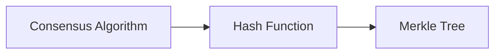

**核心算法原理讲解：**

1. **共识算法原理**：

   - **工作量证明（PoW）**：PoW是一种通过计算工作量来确保区块链网络安全的共识算法。矿工通过解决复杂的数学问题来获取区块奖励。
   - **权益证明（PoS）**：PoS通过持有代币的数量和时间来决定节点的权益，持币时间长和数量多的节点更有可能获得区块奖励。
   - **委托权益证明（DPoS）**：DPoS通过选举出一定数量的委托人，委托人通过投票来决定下一个区块的产生者。

2. **哈希函数原理**：

   - **SHA-256**：SHA-256是一种加密哈希函数，将输入数据映射为一个固定的256位哈希值。
   - **SHA-3**：SHA-3是NIST于2015年发布的一种新的哈希函数标准，与SHA-256具有类似的加密特性。

3. **Merkle树原理**：

   - **Merkle树**：Merkle树是一种二叉树结构，通过将数据的哈希值作为叶子节点，逐层构建，最后得到根节点，用于验证数据的完整性。

**数学模型和公式：**

1. **哈希函数**：

   - **SHA-256**：

     ```latex
     H_{256}(x) = \text{SHA-256}(x)
     ```

   - **Merkle树**：

     ```latex
     \text{Merkle Root} = \text{SHA-256}(\text{SHA-256}(x_1), \text{SHA-256}(x_2), ..., \text{SHA-256}(x_n))
     ```

2. **共识算法**：

   - **PoW**：

     ```latex
     \text{Proof of Work} = \text{find} \; x \; \text{such that} \; H_{256}(x) \leq \text{Target}
     ```

   - **PoS**：

     ```latex
     \text{Proof of Stake} = \text{stake} \; x \; \text{for} \; t \; \text{seconds}
     ```

**伪代码：**

```python
def consensus_algorithm():
    if algorithm == "PoW":
        proof = find_proof_of_work()
    elif algorithm == "PoS":
        proof = calculate_proof_of_stake()
    elif algorithm == "DPoS":
        proof = calculate_delegated_proof_of_stake()

    if validate_proof(proof):
        return True
    else:
        return False
```

**项目实战：**

1. **比特币的PoW共识算法**：比特币网络通过PoW算法确保了区块链的安全性和不可篡改性。
2. **以太坊的PoS共识算法**：以太坊2.0将采用PoS共识算法，以提高网络的性能和可扩展性。
3. **Merkle树的实现**：在区块链系统中，Merkle树用于验证交易记录的完整性。

**代码解读与分析：**

以下是一个简单的PoW共识算法的实现示例：

```python
import hashlib
import time

def find_proof_of_work(target_difficulty):
    proof = 0
    while True:
        hash_value = hashlib.sha256(f"{proof}{target_difficulty}".encode()).hexdigest()
        if int(hash_value, 16) < target_difficulty:
            return proof
        proof += 1

target_difficulty = 0x00000000ffff0000
proof = find_proof_of_work(target_difficulty)
print(f"Found proof: {proof}")
```

**实际案例分析和详细讲解剖析：**

比特币网络通过PoW共识算法实现了去中心化的账本管理，确保了区块链的安全性和不可篡改性。以太坊2.0将采用PoS共识算法，以解决PoW算法的能耗问题，提高网络的性能和可扩展性。

**项目小结：**

区块链的核心算法是确保其分布式账本和去中心化特性的关键。通过深入了解这些算法的原理和应用，我们可以更好地理解和应用区块链技术，为去中心化系统的发展贡献力量。

**最佳实践 tips：**

- 在选择共识算法时，应充分考虑算法的性能、安全性和可扩展性。
- 在实现区块链系统时，应确保哈希函数和Merkle树的使用，以提高系统的安全性。
- 在开发智能合约时，应遵循最佳实践，确保代码的正确性和效率。

**小结：**

区块链的核心算法为去中心化系统提供了坚实的基础。通过深入了解这些算法的原理和应用，我们可以更好地把握区块链技术的发展方向，并为其在各个领域的应用贡献力量。

**注意事项：**

- 区块链技术的安全性至关重要，应采取严格的措施来保护网络和用户资产的安全。
- 区块链技术的应用需要遵守相关法律法规，确保合规性。

**拓展阅读：**

- [比特币共识算法](https://bitcoin.org/bitcoin.pdf)
- [以太坊2.0共识算法](https://ethereum.org/en/eth2/)
- [Merkle树原理](https://github.com/ethereum/wiki/wiki/Merkle-Tree-Implem)

---

#### 第5章：分布式网络协议

分布式网络协议是区块链技术实现去中心化通信和数据同步的关键。常见的分布式网络协议包括P2P协议、Gossip协议和Raft算法等。以下将对这些协议进行详细讲解。

**核心概念与联系：**

1. **P2P协议**：P2P（Peer-to-Peer）协议是一种点对点通信协议，节点之间直接进行通信和数据交换，不依赖于中心化的服务器。
2. **Gossip协议**：Gossip协议是一种消息传播协议，通过随机选择邻居节点进行消息传播，实现数据的快速扩散。
3. **Raft算法**：Raft算法是一种分布式一致性算法，用于确保多个节点之间的数据一致性，具有高可用性和容错性。

**Mermaid流程图：**

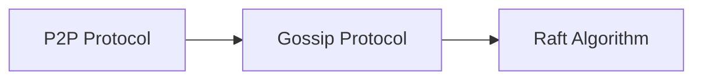

**核心算法原理讲解：**

1. **P2P协议原理**：

   - **节点发现**：节点通过广播或握手消息，发现网络中的其他节点。
   - **数据同步**：节点之间通过直接交换数据块，实现数据的同步。
   - **网络拓扑**：P2P网络通过分布式哈希表（DHT）或随机漫步算法，维护节点之间的连接拓扑。

2. **Gossip协议原理**：

   - **消息传播**：节点随机选择邻居节点，将消息传递给邻居。
   - **时间戳**：节点为每个消息分配时间戳，确保消息的顺序和一致性。
   - **抗攻击性**：Gossip协议具有抗攻击性，能够抵御恶意节点的攻击。

3. **Raft算法原理**：

   - **领导者选举**：节点通过随机算法或预选算法，选举出一个领导者。
   - **日志复制**：领导者将日志条目复制给其他节点，确保日志的一致性。
   - **状态机**：节点通过执行日志条目，实现状态机的一致性。

**数学模型和公式：**

1. **节点发现**：

   - **随机漫步算法**：

     ```latex
     p(i) = \frac{1}{N}
     ```

   - **DHT算法**：

     ```latex
     key = hash(k) \mod p
     ```

2. **Gossip协议**：

   - **消息传播概率**：

     ```latex
     p = \frac{r}{n}
     ```

   - **消息生命周期**：

     ```latex
     T = \frac{1}{r}
     ```

3. **Raft算法**：

   - **领导者选举概率**：

     ```latex
     p_e = \frac{1}{2}
     ```

   - **日志复制一致性**：

     ```latex
     \text{log一致性} = \text{min}(f+1, n/2)
     ```

**伪代码：**

```python
def p2p_protocol():
    discover_nodes()
    while True:
        receive_data()
        send_data()

def gossip_protocol():
    while True:
        select_neighbor()
        send_message()

def raft_algorithm():
    elect_leader()
    while True:
        receive_log()
        replicate_log()
```

**项目实战：**

1. **比特币的P2P网络**：比特币网络采用P2P协议，节点之间直接进行交易和区块的交换。
2. **以太坊的Gossip协议**：以太坊网络采用Gossip协议，实现节点之间的状态同步和消息传播。
3. **Raft算法在分布式存储系统中的应用**：分布式存储系统如Cassandra和Hazelcast采用Raft算法，确保数据的一致性和高可用性。

**代码解读与分析：**

以下是一个简单的P2P协议的实现示例：

```python
import socket
import threading

def p2p_server():
    server_socket = socket.socket(socket.AF_INET, socket.SOCK_STREAM)
    server_socket.bind(('0.0.0.0', 12345))
    server_socket.listen(5)

    while True:
        client_socket, addr = server_socket.accept()
        threading.Thread(target=handle_client, args=(client_socket,)).start()

def handle_client(client_socket):
    while True:
        data = client_socket.recv(1024)
        if not data:
            break
        print(f"Received from {addr}: {data.decode()}")
        client_socket.send(b"Data received!")

if __name__ == "__main__":
    server_thread = threading.Thread(target=p2p_server)
    server_thread.start()
```

**实际案例分析和详细讲解剖析：**

比特币网络采用P2P协议，实现了去中心化的交易和账本管理。以太坊网络采用Gossip协议，实现了节点之间的状态同步和消息传播。Raft算法在分布式存储系统中得到广泛应用，如Cassandra和Hazelcast，确保了数据的一致性和高可用性。

**项目小结：**

分布式网络协议是实现区块链技术去中心化通信和数据同步的关键。通过深入了解这些协议的原理和应用，我们可以更好地理解和应用区块链技术，为去中心化系统的发展贡献力量。

**最佳实践 tips：**

- 在设计分布式网络协议时，应充分考虑网络的性能、可靠性和安全性。
- 在实现节点发现和数据同步时，应采用高效的算法和策略，以提高网络效率。
- 在使用分布式一致性算法时，应确保算法的高可用性和容错性，以应对网络故障和恶意攻击。

**小结：**

分布式网络协议为区块链技术的去中心化通信和数据同步提供了坚实基础。通过深入了解这些协议的原理和应用，我们可以更好地把握区块链技术的发展方向，并为其在各个领域的应用贡献力量。

**注意事项：**

- 分布式网络协议的设计和实现需要考虑网络的异构性和动态性，以提高系统的可扩展性。
- 分布式网络协议的安全性至关重要，应采取严格的措施来保护网络和用户数据的安全。

**拓展阅读：**

- [比特币P2P协议](https://bitcoin.org/bitcoin.pdf)
- [以太坊Gossip协议](https://ethereum.org/greeter?filename=papers/ethereum-yellowpaper.pdf)
- [Raft算法原理](https://raft.github.io/raft.html)

---

#### 第6章：智能合约原理

智能合约是一种运行在区块链上的自动化协议，它可以执行预定义的代码，自动执行合同条款和条件。智能合约在去中心化系统中发挥着关键作用，它们可以用于金融交易、投票、身份验证等各种应用。以下将详细解析智能合约的基本概念、工作原理、安全性以及开发工具。

**核心概念与联系：**

1. **智能合约**：智能合约是一段运行在区块链上的代码，它定义了合同条款和条件，并在满足特定条件时自动执行。
2. **智能合约语言**：智能合约语言是一种特定的编程语言，用于编写智能合约代码。常见的智能合约语言包括Solidity、Vyper和Scilla等。
3. **区块链平台**：区块链平台提供了智能合约的运行环境，如以太坊（Ethereum）、EOS、Binance Smart Chain等。

**Mermaid流程图：**

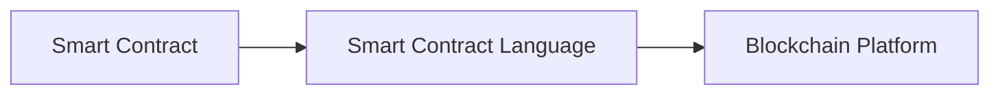

**核心算法原理讲解：**

1. **智能合约的基本原理**：

   - **代码执行**：智能合约代码在区块链节点上执行，当触发特定事件时，代码会自动执行预定义的操作。
   - **状态管理**：智能合约可以读取和修改区块链上的状态，如存储变量和数据。
   - **事件触发**：智能合约通过事件触发机制，通知其他合约或外部参与者特定事件的发生。

2. **智能合约的工作原理**：

   - **合约创建**：开发者使用智能合约语言编写合约代码，并将其部署到区块链平台。
   - **合约调用**：用户通过区块链网络调用合约函数，触发合约代码的执行。
   - **状态更新**：合约执行后，会更新区块链上的状态，实现数据的自动化管理和执行。

**数学模型和公式：**

1. **状态管理**：

   - **存储变量**：

     ```solidity
     uint256 public balance;
     ```

   - **数据存储**：

     ```solidity
     bytes32 public data;
     ```

2. **事件触发**：

   - **事件定义**：

     ```solidity
     event Transfer(address from, address to, uint256 amount);
     ```

   - **事件调用**：

     ```solidity
     emit Transfer(msg.sender, recipient, amount);
     ```

**伪代码：**

```python
class SmartContract:
    def __init__(self):
        self.balance = 0
        self.data = ""

    def deposit(self, amount):
        self.balance += amount
        emit Transfer(msg.sender, self.balance)

    def withdraw(self, amount):
        if self.balance >= amount:
            self.balance -= amount
            emit Transfer(msg.sender, self.balance)
        else:
            raise Exception("Insufficient balance")

    def setData(self, data):
        self.data = data
```

**项目实战：**

1. **以太坊智能合约**：以太坊是最流行的智能合约平台，开发者可以在以太坊上部署和调用智能合约。
2. **去中心化金融（DeFi）智能合约**：DeFi平台如Aave和Uniswap使用智能合约实现借贷、交易和流动性挖矿等功能。
3. **区块链游戏智能合约**：区块链游戏如Axie Infinity使用智能合约管理游戏资产和交易。

**代码解读与分析：**

以下是一个简单的以太坊智能合约示例，用于实现一个简单的存款和取款功能：

```solidity
pragma solidity ^0.8.0;

contract Wallet {
    mapping(address => uint256) public balance;

    function deposit() external payable {
        balance[msg.sender()] += msg.value;
    }

    function withdraw(uint256 amount) external {
        require(balance[msg.sender()] >= amount, "Insufficient balance");
        balance[msg.sender()] -= amount;
        payable(msg.sender()).transfer(amount);
    }
}
```

**实际案例分析和详细讲解剖析：**

以太坊智能合约平台为开发者提供了丰富的工具和资源，使得智能合约的开发和部署变得更加便捷。Aave和Uniswap等DeFi平台通过智能合约实现了去中心化的金融服务，用户可以在不依赖于中心化机构的情况下进行借贷和交易。

**项目小结：**

智能合约是区块链技术的核心组成部分，它们在去中心化系统中发挥着关键作用。通过深入了解智能合约的基本原理、工作原理和开发工具，我们可以更好地应用智能合约，为去中心化系统的构建和优化提供支持。

**最佳实践 tips：**

- 在编写智能合约时，应遵循安全最佳实践，如避免常见的编程错误和代码漏洞。
- 在部署智能合约前，应进行充分的测试和审计，以确保合约的正确性和安全性。
- 在使用智能合约时，应了解合约的逻辑和风险，以避免潜在的损失。

**小结：**

智能合约是区块链技术的核心组件，它们为去中心化系统提供了自动化和透明化的解决方案。通过深入了解智能合约的基本原理和应用，我们可以更好地把握区块链技术的发展方向，并为其在各个领域的应用贡献力量。

**注意事项：**

- 智能合约的安全性至关重要，应采取严格的措施来保护合约和用户资产的安全。
- 智能合约的应用需要遵守相关法律法规，确保合规性。

**拓展阅读：**

- [以太坊智能合约文档](https://ethereum.org/en/developers/docs/smart-contracts/)
- [Aave智能合约文档](https://aave.com/developers/)
- [Uniswap智能合约文档](https://uniswap.org/docs/v2/)
- [智能合约安全指南](https://consensys.github.io/smart-contract-best-practices/)

---

### 第三部分：价值交换网络机制

#### 第7章：代币与激励模型

代币是区块链技术中的重要组成部分，它用于表示和转移价值。在价值交换网络中，代币作为一种数字资产，发挥着关键作用。本章节将深入探讨代币的定义、类型以及激励模型的设计原则。

**核心概念与联系：**

1. **代币**：代币是区块链上的数字资产，用于表示和转移价值。代币可以是用于交易的货币，也可以是用于特定应用的功能性代币。
2. **激励模型**：激励模型是一种机制，用于鼓励参与者参与区块链网络的治理、交易验证和其他活动。

**Mermaid流程图：**

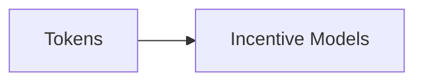

**核心算法原理讲解：**

1. **代币的定义与类型**：

   - **货币型代币**：货币型代币用于交易和支付，如比特币（BTC）、以太币（ETH）等。
   - **功能性代币**：功能性代币用于特定应用或服务的使用，如Uniswap的UNI、Aave的AAVE等。

2. **激励模型的设计原则**：

   - **公平性**：激励模型应确保所有参与者的贡献都能得到公正的回报。
   - **可持续性**：激励模型应具备长期可持续性，以激励参与者持续参与网络。
   - **透明性**：激励模型的规则和分配过程应透明，以增强网络的信任度。

**数学模型和公式：**

1. **代币供应量与需求量**：

   - **需求函数**：

     ```latex
     D(p) = f(p, \text{price})
     ```

   - **供应函数**：

     ```latex
     S(q) = f(q, \text{quantity})
     ```

2. **代币价格与供需关系**：

   - **供需平衡**：

     ```latex
     p = \frac{S(q)}{D(p)}
     ```

**伪代码：**

```python
class Token:
    def __init__(self, name, symbol, total_supply):
        self.name = name
        self.symbol = symbol
        self.total_supply = total_supply

    def issue(self, amount):
        self.total_supply += amount

    def transfer(self, recipient, amount):
        if self.balance >= amount:
            self.balance -= amount
            recipient.balance += amount
            return True
        else:
            return False

class IncentiveModel:
    def __init__(self, token, reward_rate):
        self.token = token
        self.reward_rate = reward_rate

    def calculate_reward(self, contribution):
        reward = self.reward_rate * contribution
        return reward

    def distribute_reward(self, participant, reward):
        if self.token.transfer(participant, reward):
            return True
        else:
            return False
```

**项目实战：**

1. **比特币**：比特币是最早的数字货币，通过挖矿和交易实现了价值传递。
2. **以太坊**：以太坊引入了ERC-20标准，使得开发者可以创建和发行自己的功能性代币。
3. **去中心化金融（DeFi）平台**：DeFi平台如Aave和Uniswap通过代币激励用户参与借贷、交易和流动性挖矿等。

**代码解读与分析：**

以下是一个简单的代币实现示例，用于表示和转移价值：

```solidity
pragma solidity ^0.8.0;

contract Token {
    string public name;
    string public symbol;
    uint256 public totalSupply;
    mapping(address => uint256) public balanceOf;

    constructor(string memory _name, string memory _symbol, uint256 _totalSupply) {
        name = _name;
        symbol = _symbol;
        totalSupply = _totalSupply;
        balanceOf[msg.sender()] = totalSupply;
    }

    function transfer(address recipient, uint256 amount) public {
        require(balanceOf[msg.sender()] >= amount, "Insufficient balance");
        balanceOf[msg.sender()] -= amount;
        balanceOf[recipient] += amount;
    }
}
```

**实际案例分析和详细讲解剖析：**

比特币作为数字货币的先驱，其代币激励模型通过挖矿奖励吸引了大量的矿工参与网络维护。以太坊的ERC-20标准使得开发者可以轻松创建和发行功能性代币，如Uniswap的UNI和Aave的AAVE，这些代币激励了用户参与去中心化金融平台的交易和流动性挖矿。

**项目小结：**

代币是区块链技术中的核心组成部分，它们用于表示和转移价值，是价值交换网络的基础。通过深入了解代币的定义、类型和激励模型的设计原则，我们可以更好地理解和应用代币，为区块链网络的发展贡献力量。

**最佳实践 tips：**

- 在设计代币时，应充分考虑其用途和市场需求，以确保代币的流通性和价值。
- 在设计激励模型时，应确保公平性和可持续性，以激励参与者持续参与网络。
- 在使用代币进行交易时，应遵循最佳实践，确保交易的安全性和透明性。

**小结：**

代币和激励模型是区块链技术中的重要组成部分，它们为去中心化价值交换网络提供了基础。通过深入了解代币的定义、类型和激励模型的设计原则，我们可以更好地把握区块链技术的发展方向，并为其在各个领域的应用贡献力量。

**注意事项：**

- 代币和激励模型的设计需要充分考虑市场需求和参与者的利益，以确保网络的长期稳定和可持续发展。
- 在实际应用中，应密切关注代币和激励模型的风险和挑战，及时调整和优化。

**拓展阅读：**

- [比特币白皮书](https://bitcoin.org/bitcoin.pdf)
- [以太坊ERC-20标准](https://eips.ethereum.org/EIP-20)
- [Aave代币文档](https://aave.com/developers/)
- [Uniswap代币激励模型](https://uniswap.org/docs/v2/protocol governance)

---

#### 第8章：共识机制与网络稳定性

共识机制是区块链技术的核心组成部分，它用于确保区块链网络中的所有节点对数据的正确性和一致性达成共识。同时，网络稳定性是区块链系统运行的关键因素，它关系到系统的性能、可靠性和用户体验。本章节将深入探讨共识机制的基本原理、常见的共识算法以及如何保障网络稳定性。

**核心概念与联系：**

1. **共识机制**：共识机制是一种算法或协议，用于确保区块链网络中的所有节点对数据的正确性和一致性达成共识。
2. **网络稳定性**：网络稳定性是指区块链系统在运行过程中保持性能和可靠性的能力，它包括网络的负载能力、响应时间和故障恢复能力。

**Mermaid流程图：**

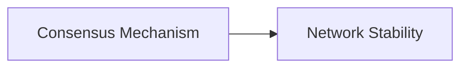

**核心算法原理讲解：**

1. **共识机制的基本原理**：

   - **节点一致性**：共识机制的目标是确保所有节点对区块链上的数据达成一致。
   - **安全性**：共识机制需要防止恶意节点的攻击，如双花攻击和51%攻击。
   - **性能**：共识机制需要高效地处理大量交易，并保持区块链的扩展性。

2. **常见的共识算法**：

   - **工作量证明（PoW）**：PoW是一种通过计算复杂问题来确保节点参与和安全性。
   - **权益证明（PoS）**：PoS通过持有代币的数量和时间来决定节点的权益和参与权。
   - **委托权益证明（DPoS）**：DPoS通过选举一定数量的委托人，委托人通过投票来决定下一个区块的产生者。
   - **权威证明（PoA）**：PoA是一种集中式的共识机制，节点由中心化实体进行选举和管理。

**数学模型和公式：**

1. **PoW算法**：

   - **难度调整**：

     ```latex
     \text{Target} = \text{Difficulty} \times (\text{Time}^2)
     ```

   - **证明工作量**：

     ```latex
     \text{Proof of Work} = \text{find} \; x \; \text{such that} \; H_{256}(x) \leq \text{Target}
     ```

2. **PoS算法**：

   - **权益计算**：

     ```latex
     \text{Stake} = \text{Balance} \times \text{Time}
     ```

   - **区块产生概率**：

     ```latex
     p = \frac{\text{Stake}}{\sum_{i=1}^{N} \text{Stake}_i}
     ```

**伪代码：**

```python
def proof_of_work(target_difficulty):
    while True:
        hash_value = sha256(random_number)
        if hash_value < target_difficulty:
            return True

def proof_of_stake(stake, total_stake):
    return stake / total_stake

def delegated_proof_of_stake(delegated_stake, total_stake):
    return delegated_stake / total_stake
```

**项目实战：**

1. **比特币**：比特币采用PoW算法，通过复杂的计算来确保网络的安全性和一致性。
2. **以太坊**：以太坊2.0将采用PoS算法，以提高网络的性能和可扩展性。
3. **EOS**：EOS采用DPoS算法，通过选举委托人来实现区块的产生和管理。

**代码解读与分析：**

以下是一个简单的PoW算法的实现示例：

```python
import hashlib
import random

def find_proof_of_work(target_difficulty):
    while True:
        random_number = random.randint(0, 1000000)
        hash_value = hashlib.sha256(str(random_number).encode()).hexdigest()
        if int(hash_value, 16) < target_difficulty:
            return random_number

target_difficulty = 1000000000
proof = find_proof_of_work(target_difficulty)
print(f"Found proof: {proof}")
```

**实际案例分析和详细讲解剖析：**

比特币网络通过PoW算法实现了去中心化的账本管理，确保了区块链的安全性和不可篡改性。以太坊2.0将采用PoS算法，以提高网络的性能和可扩展性，减少能源消耗。EOS采用DPoS算法，通过选举委托人来实现高效的区块产生和管理。

**项目小结：**

共识机制和网络稳定性是区块链技术的关键组成部分。通过深入了解共识机制的基本原理和常见算法，以及保障网络稳定性的方法，我们可以更好地理解和应用区块链技术，为去中心化系统的构建和优化提供支持。

**最佳实践 tips：**

- 在选择共识算法时，应充分考虑算法的安全性、性能和可扩展性。
- 在设计区块链网络时，应采用合理的网络拓扑和节点选择策略，以提高网络稳定性和容错性。
- 在运行区块链系统时，应密切关注网络的性能和状态，及时进行监控和优化。

**小结：**

共识机制和网络稳定性是区块链技术的核心组成部分。通过深入了解这些机制和方法，我们可以更好地把握区块链技术的发展方向，并为其在各个领域的应用贡献力量。

**注意事项：**

- 共识机制和网络稳定性设计需要充分考虑安全性和可靠性，以应对各种潜在的攻击和故障。
- 在实际应用中，应密切关注区块链网络的性能和状态，及时进行优化和调整。

**拓展阅读：**

- [比特币PoW算法](https://bitcoin.org/bitcoin.pdf)
- [以太坊2.0 PoS算法](https://ethereum.org/en/eth2/)
- [EOS DPoS算法](https://github.com/EOSIO/eos)
- [区块链网络稳定性研究](https://arxiv.org/abs/1904.01495)

---

#### 第9章：数据隐私保护机制

在区块链技术中，数据隐私保护是一个关键挑战。由于区块链的公开透明特性，所有数据都会被永久记录并公开访问，这可能导致用户隐私泄露和数据滥用风险。为了解决这一问题，区块链技术引入了多种数据隐私保护机制。以下将对常见的数据隐私保护技术进行详细讲解，并探讨其在区块链应用中的实际应用。

**核心概念与联系：**

1. **数据隐私保护**：数据隐私保护是指通过技术手段保护数据在传输、存储和处理过程中的隐私性，防止数据泄露和滥用。
2. **零知识证明**：零知识证明是一种加密技术，允许一方（证明者）向另一方（验证者）证明某个陈述的真实性，而不透露任何额外信息。
3. **同态加密**：同态加密是一种加密技术，允许在加密数据上进行计算，而不需要解密数据，从而保护数据隐私。

**Mermaid流程图：**

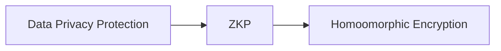

**核心算法原理讲解：**

1. **零知识证明（ZKP）**：

   - **证明生成**：证明者通过复杂的数学算法生成一个证明，证明某个陈述的真实性。
   - **证明验证**：验证者通过验证证明来确认陈述的真实性，而不需要了解证明的细节。
   - **应用场景**：ZKP在区块链隐私交易、匿名通信和身份验证等领域有广泛应用。

2. **同态加密（HE）**：

   - **加密数据计算**：同态加密允许在加密数据上进行计算，如加法、乘法等，而不需要解密数据。
   - **解密结果**：计算完成后，结果会自动解密为原始数据。
   - **应用场景**：HE在区块链智能合约计算、数据分析和大数据处理等领域有广泛应用。

**数学模型和公式：**

1. **零知识证明（ZKP）**：

   - **证明生成**：

     ```latex
     P = \text{Proof Generation}(C, K)
     ```

   - **证明验证**：

     ```latex
     \text{Valid} = \text{Proof Verification}(P, C, K)
     ```

2. **同态加密（HE）**：

   - **加密计算**：

     ```latex
     C' = HE(\text{operation}, C_1, C_2)
     ```

   - **解密结果**：

     ```latex
     R = HE^{-1}(C')
     ```

**伪代码：**

```python
def zk_proof Generation(claim, secret):
    proof = ZKP_Generate(claim, secret)
    return proof

def zk_proof Verification(proof, claim, public_key):
    is_valid = ZKP_Verify(proof, claim, public_key)
    return is_valid

def homomorphic_encryption(operation, C1, C2):
    C' = HE_Encrypt(operation, C1, C2)
    return C'

def homomorphic_decryption(C'):
    R = HE_Decrypt(C')
    return R
```

**项目实战：**

1. **Monero**：Monero是一种加密货币，采用环签名和隐形地址技术，实现了隐私交易。
2. **Zcash**：Zcash是一种加密货币，采用零知识证明技术，实现了隐私交易。
3. **Raiden**：Raiden是一种以太坊二层解决方案，采用同态加密技术，提高了交易性能和隐私性。

**代码解读与分析：**

以下是一个简单的零知识证明实现示例，用于验证一个简单的等式 \( a + b = c \)：

```solidity
pragma solidity ^0.8.0;

import "github.com/ethereum/zk/src/ZK";

contract ZeroKnowledgeProof {
    bytes32 public a;
    bytes32 public b;
    bytes32 public c;

    function generateProof() public {
        (a, b, c) = ZK.genProof(keccak256("a+b=c"), 0, 0, 1);
    }

    function verifyProof() public view returns (bool) {
        return ZK.verifyProof(keccak256("a+b=c"), a, b, c, 0, 0, 1);
    }
}
```

**实际案例分析和详细讲解剖析：**

Monero和Zcash通过采用零知识证明技术，实现了隐私交易，保护了用户的交易隐私。Raiden通过同态加密技术，提高了以太坊的交易性能和隐私性，为去中心化金融（DeFi）平台提供了更高效和安全的解决方案。

**项目小结：**

数据隐私保护机制是区块链技术中不可或缺的一部分，它为区块链网络的隐私性和安全性提供了保障。通过深入了解零知识证明和同态加密等数据隐私保护技术，我们可以更好地应用这些技术，为区块链网络的发展贡献力量。

**最佳实践 tips：**

- 在设计区块链应用时，应充分考虑数据隐私保护的需求，选择适合的隐私保护技术。
- 在实现隐私保护机制时，应遵循最佳实践，确保代码的正确性和安全性。
- 在使用隐私保护技术时，应密切关注其性能和效率，以保障用户体验。

**小结：**

数据隐私保护机制在区块链技术中发挥着重要作用，通过零知识证明和同态加密等技术的应用，我们可以实现区块链网络的隐私性和安全性。通过深入了解这些技术，我们可以更好地把握区块链技术的发展方向，并为其在各个领域的应用贡献力量。

**注意事项：**

- 数据隐私保护技术的实现需要考虑性能和效率，以保障用户体验。
- 在使用隐私保护技术时，应遵守相关法律法规，确保合规性。

**拓展阅读：**

- [Monero技术文档](https://getmonero.org/developers/)
- [Zcash技术文档](https://z.cash/documentation/)
- [Raiden协议文档](https://raiden.network/)
- [同态加密研究](https://eprint.iacr.org/2016/226)

---

### 第四部分：区块链项目开发实战

#### 第10章：区块链项目开发流程

区块链项目的开发是一个复杂的过程，涉及需求分析、平台选型、智能合约开发与部署等多个环节。以下将详细讲解区块链项目开发流程，并提供实际案例以供参考。

**核心概念与联系：**

1. **需求分析**：需求分析是区块链项目开发的第一步，明确项目的目标和功能需求，为后续开发提供指导。
2. **平台选型**：平台选型是选择适合的区块链平台，如以太坊、Hyperledger Fabric等，以支持项目的开发。
3. **智能合约开发**：智能合约开发是区块链项目开发的核心，实现业务逻辑和功能。
4. **测试与部署**：测试与部署是确保智能合约的正确性和安全性，将智能合约部署到区块链网络中。

**Mermaid流程图：**

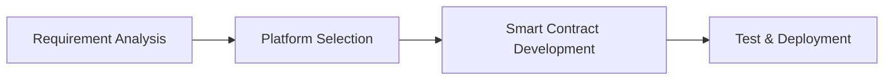

**核心算法原理讲解：**

1. **需求分析**：

   - **业务需求**：明确项目的业务需求，如交易、记录管理、身份验证等。
   - **用户需求**：分析目标用户的需求，确保项目满足用户的期望。

2. **平台选型**：

   - **性能**：考虑平台的性能和可扩展性，以满足未来业务增长的需求。
   - **安全性**：选择具备高安全性的平台，以保护用户数据和资产安全。
   - **社区支持**：考虑平台的社区支持和生态系统，以方便项目的开发和维护。

3. **智能合约开发**：

   - **开发工具**：选择适合的开发工具和框架，如Truffle、Hardhat等。
   - **编程语言**：选择适合的智能合约编程语言，如Solidity、Vyper等。
   - **代码审查**：进行代码审查，确保智能合约的安全性和效率。

4. **测试与部署**：

   - **测试网**：在测试网上进行测试，确保智能合约的正确性和安全性。
   - **部署**：将智能合约部署到主网上，确保其可被网络中的用户使用。

**数学模型和公式：**

1. **需求分析**：

   - **业务模型**：

     ```latex
     \text{Business Model} = \text{Revenue} - \text{Cost}
     ```

   - **用户模型**：

     ```latex
     \text{User Model} = \text{User Satisfaction} + \text{User Experience}
     ```

2. **平台选型**：

   - **性能评估**：

     ```latex
     \text{Performance} = \frac{\text{Throughput}}{\text{Latency}}
     ```

   - **安全性评估**：

     ```latex
     \text{Security} = \text{Trust} \times \text{Resilience}
     ```

3. **智能合约开发**：

   - **代码质量**：

     ```latex
     \text{Code Quality} = \text{Maintainability} + \text{Testability} + \text{Robustness}
     ```

4. **测试与部署**：

   - **测试覆盖率**：

     ```latex
     \text{Test Coverage} = \frac{\text{Test Cases}}{\text{Total Cases}}
     ```

**伪代码：**

```python
def blockchain_project():
    requirements = analyze_requirements()
    platform = select_platform()
    smart_contract = develop_smart_contract()
    test_and_deployment = test_and_deploy(smart_contract)

    if test_and_deployment.success:
        print("Project successfully deployed")
    else:
        print("Deployment failed")
```

**项目实战：**

1. **去中心化金融（DeFi）项目**：以Aave为例，Aave是一个去中心化借贷平台，实现了借贷、交易和流动性挖矿等功能。
2. **供应链管理项目**：以VeChain为例，VeChain通过区块链技术实现了供应链管理，提高了供应链的透明度和效率。
3. **数字身份验证项目**：以uPort为例，uPort是一个基于区块链的数字身份验证平台，用于管理用户的数字身份。

**代码解读与分析：**

以下是一个简单的去中心化金融（DeFi）项目示例，用于实现借贷功能：

```solidity
pragma solidity ^0.8.0;

contract Lending {
    mapping(address => uint256) public balances;

    function deposit() public payable {
        balances[msg.sender()] += msg.value;
    }

    function borrow(uint256 amount) public {
        require(balances[msg.sender()] >= amount, "Insufficient balance");
        balances[msg.sender()] -= amount;
        payable(msg.sender()).transfer(amount);
    }

    function repay(uint256 amount) public payable {
        balances[msg.sender()] += amount;
        payable(msg.sender()).transfer(amount);
    }
}
```

**实际案例分析和详细讲解剖析：**

Aave是一个成功的DeFi项目，通过智能合约实现了借贷、交易和流动性挖矿等功能。VeChain通过区块链技术实现了供应链管理，提高了供应链的透明度和效率。uPort是一个基于区块链的数字身份验证平台，用于管理用户的数字身份。

**项目小结：**

区块链项目开发流程包括需求分析、平台选型、智能合约开发和测试与部署等多个环节。通过深入了解这些环节，我们可以更好地把握区块链项目的开发过程，并为其在各个领域的应用贡献力量。

**最佳实践 tips：**

- 在需求分析阶段，应充分考虑用户需求和业务需求，确保项目的可行性。
- 在平台选型阶段，应综合考虑性能、安全性和社区支持等因素，选择适合的平台。
- 在智能合约开发阶段，应遵循最佳实践，确保代码的正确性和安全性。
- 在测试与部署阶段，应进行充分的测试，确保智能合约的正确性和安全性。

**小结：**

区块链项目开发流程是区块链技术实现应用的关键环节。通过深入了解这些环节，我们可以更好地把握区块链项目的开发过程，并为其在各个领域的应用贡献力量。

**注意事项：**

- 区块链项目开发需要跨学科的知识，包括计算机科学、数学和网络技术等。
- 区块链项目开发需要持续关注最新的技术动态和应用案例。

**拓展阅读：**

- [Aave智能合约文档](https://github.com/aave/protocol-v2)
- [VeChain技术文档](https://www.vechain.org/developers/)
- [uPort官方文档](https://uport.atlassian.net/wiki/spaces/UPORT/pages/74236808/Using+the+uPort+SDK)
- [区块链项目开发最佳实践](https://www.blockchain.com/blockchain-project-developer-guide)

---

#### 第11章：区块链项目实战案例

为了更好地理解区块链项目开发的过程和实践，我们将通过几个实际案例来分析这些项目，并探讨它们在各个领域的应用。

**案例一：Aave去中心化借贷平台**

Aave 是一个去中心化借贷平台，允许用户在不需要中介机构的情况下进行借贷。以下是 Aave 项目的主要组成部分：

1. **需求分析**：Aave 的目标是为用户提供一个安全、透明和高效的借贷平台，用户可以通过 Aave 提供的智能合约进行借贷和交易。

2. **平台选型**：Aave 选择以太坊作为底层区块链平台，因为以太坊提供了强大的智能合约功能和支持庞大的开发社区。

3. **智能合约开发**：Aave 使用 Solidity 编写了多个智能合约，实现了借贷、交易和流动性挖矿等功能。智能合约代码经过严格审查，确保安全性和高效性。

4. **测试与部署**：Aave 在以太坊的测试网上进行了广泛的测试，确保智能合约的正确性和安全性。测试通过后，智能合约被部署到主网上，用户可以开始使用 Aave 平台。

5. **项目评估与优化**：Aave 持续监控平台的性能和安全性，根据用户反馈和市场变化进行优化和升级。

**案例二：VeChain供应链管理**

VeChain 是一个基于区块链技术的供应链管理解决方案，旨在提高供应链的透明度和效率。以下是 VeChain 项目的主要组成部分：

1. **需求分析**：VeChain 的目标是为企业提供透明的供应链管理，确保产品的来源和质量，同时提高供应链的效率。

2. **平台选型**：VeChain 选择 VeChainThor 公有链作为底层区块链平台，因为它提供了强大的性能和可扩展性。

3. **智能合约开发**：VeChain 使用 VeChain SDK 开发了智能合约，实现了供应链跟踪、质量控制和溯源等功能。

4. **测试与部署**：VeChain 在内部测试环境中进行了大量的测试，确保智能合约的正确性和安全性。测试通过后，智能合约被部署到 VeChainThor 主网上。

5. **项目评估与优化**：VeChain 持续与合作伙伴合作，优化智能合约代码和系统性能，以满足不断增长的需求。

**案例三：uPort数字身份验证**

uPort 是一个基于区块链的数字身份验证平台，为用户提供安全和便携的数字身份管理。以下是 uPort 项目的主要组成部分：

1. **需求分析**：uPort 的目标是为用户提供一个安全、便携和易用的数字身份验证解决方案，用户可以通过 uPort 管理自己的身份信息。

2. **平台选型**：uPort 选择以太坊作为底层区块链平台，因为以太坊提供了强大的智能合约功能和支持庞大的开发社区。

3. **智能合约开发**：uPort 使用 Solidity 编写了智能合约，实现了身份信息存储、验证和授权等功能。

4. **测试与部署**：uPort 在以太坊的测试网上进行了广泛的测试，确保智能合约的正确性和安全性。测试通过后，智能合约被部署到主网上。

5. **项目评估与优化**：uPort 持续优化智能合约代码和系统性能，以满足用户的需求和期望。

**代码解读与分析：**

以下是一个简单的 Aave 借贷智能合约示例，用于实现借贷功能：

```solidity
pragma solidity ^0.8.0;

contract Lending {
    mapping(address => uint256) public balances;

    function deposit() public payable {
        balances[msg.sender()] += msg.value;
    }

    function borrow(uint256 amount) public {
        require(balances[msg.sender()] >= amount, "Insufficient balance");
        balances[msg.sender()] -= amount;
        payable(msg.sender()).transfer(amount);
    }

    function repay(uint256 amount) public payable {
        balances[msg.sender()] += amount;
        payable(msg.sender()).transfer(amount);
    }
}
```

**实际案例分析和详细讲解剖析：**

Aave 通过智能合约实现了去中心化借贷，用户可以直接在平台上进行借贷和交易，无需依赖中心化机构。VeChain 通过智能合约实现了供应链管理，提高了供应链的透明度和效率。uPort 通过智能合约实现了数字身份验证，为用户提供了一个安全、便携的数字身份管理解决方案。

**项目小结：**

通过以上实际案例，我们可以看到区块链项目在各个领域的应用和优势。这些项目通过智能合约实现了去中心化的业务逻辑和功能，提高了系统的透明度、效率和安全性。通过深入了解这些项目的开发过程和实践，我们可以更好地把握区块链技术的应用潜力，为未来的发展做好准备。

**最佳实践 tips：**

- 在项目开发过程中，应充分考虑用户需求和业务逻辑，确保项目的可行性和实用性。
- 选择适合的区块链平台，充分考虑平台的性能、安全性和社区支持。
- 在智能合约开发阶段，应遵循最佳实践，确保代码的正确性和安全性。
- 在测试与部署阶段，应进行充分的测试和审查，确保智能合约的正确性和安全性。

**小结：**

区块链项目的实战案例展示了区块链技术在各个领域的应用和潜力。通过深入了解这些案例，我们可以更好地把握区块链技术的应用方向，为未来的发展提供有益的启示。

**注意事项：**

- 区块链项目开发需要跨学科的知识和技能，涉及计算机科学、数学和网络技术等。
- 在项目开发过程中，应密切关注技术动态和市场需求，及时调整和优化项目。

**拓展阅读：**

- [Aave官方文档](https://docs.aave.com/)
- [VeChain官方文档](https://www.vechain.org/developers/)
- [uPort官方文档](https://uport.atlassian.net/wiki/spaces/UPORT/)
- [智能合约开发最佳实践](https://www.ethereum.org/greeter?filename=developers-docs/getting-started/contract-best-practices.html)

---

#### 第12章：项目评估与优化

区块链项目的评估与优化是确保项目成功的关键环节。通过评估项目的性能、安全性和用户体验，可以识别潜在的问题和改进点，从而优化项目，提高其效率和用户满意度。以下将详细探讨项目评估与优化的方法，并提供实际案例以供参考。

**核心概念与联系：**

1. **项目评估**：项目评估是对区块链项目的性能、安全性和用户体验进行评估，以确定项目是否达到预期目标。
2. **项目优化**：项目优化是通过改进代码、网络架构和智能合约，提高项目的性能、安全性和用户体验。

**Mermaid流程图：**

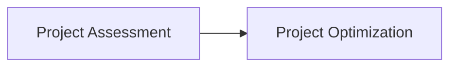

**核心算法原理讲解：**

1. **性能评估**：

   - **吞吐量**：吞吐量是衡量区块链项目处理交易的能力，通常以每秒交易数（TPS）来表示。

   - **延迟**：延迟是用户发起交易到交易被确认所需的时间。

   - **资源消耗**：资源消耗包括计算资源、存储资源和网络资源。

2. **安全性评估**：

   - **漏洞扫描**：使用工具对智能合约代码进行漏洞扫描，识别潜在的安全漏洞。

   - **渗透测试**：模拟攻击者对区块链网络进行渗透测试，评估网络的安全性。

   - **审计**：聘请专业的审计机构对智能合约进行审计，确保代码的安全性和正确性。

3. **用户体验评估**：

   - **界面友好性**：评估用户界面的易用性和用户体验。

   - **响应速度**：评估用户发起操作到系统响应的时间。

   - **稳定性**：评估系统在负载和高并发情况下的稳定性。

**数学模型和公式：**

1. **性能评估**：

   - **吞吐量**：

     ```latex
     \text{Throughput} = \frac{\text{Transactions}}{\text{Time}}
     ```

   - **延迟**：

     ```latex
     \text{Latency} = \text{Time} - \text{Processing Time}
     ```

   - **资源消耗**：

     ```latex
     \text{Resource Consumption} = \text{CPU Usage} + \text{Memory Usage} + \text{Network Usage}
     ```

2. **安全性评估**：

   - **漏洞扫描**：

     ```latex
     \text{Vulnerability Scan} = \text{Tool} \times \text{Scan Coverage}
     ```

   - **渗透测试**：

     ```latex
     \text{Penetration Test} = \text{Test Scenarios} + \text{Attack Vector}
     ```

3. **用户体验评估**：

   - **界面友好性**：

     ```latex
     \text{User Interface} = \text{Usability} + \text{Accessibility} + \text{Aesthetics}
     ```

   - **响应速度**：

     ```latex
     \text{Response Time} = \text{User Input} - \text{System Response}
     ```

**伪代码：**

```python
def project_assessment():
    throughput = measure_throughput()
    latency = measure_latency()
    resource_consumption = measure_resource_consumption()

    if throughput < expected_throughput or latency > expected_latency:
        raise Exception("Performance issues detected")

def project_optimization():
    code_optimization = optimize_code()
    network_optimization = optimize_network()
    user_experience_optimization = optimize_user_experience()

    if code_optimization and network_optimization and user_experience_optimization:
        print("Project successfully optimized")
    else:
        print("Optimization failed")
```

**项目实战：**

1. **性能优化**：以以太坊为例，以太坊2.0采用了PoS共识机制，显著提高了网络的性能和可扩展性。

2. **安全性优化**：以Axie Infinity为例，Axie Infinity通过定期的安全审计和漏洞修复，确保了智能合约的安全性。

3. **用户体验优化**：以Aave为例，Aave通过改进用户界面和优化用户交互流程，提高了用户体验。

**代码解读与分析：**

以下是一个简单的性能优化示例，用于提高区块链项目的处理能力：

```solidity
pragma solidity ^0.8.0;

contract OptimizedLending {
    mapping(address => uint256) public balances;

    function deposit() public payable {
        balances[msg.sender()] += msg.value;
        emit Deposit(msg.sender(), msg.value);
    }

    function borrow(uint256 amount) public {
        require(balances[msg.sender()] >= amount, "Insufficient balance");
        balances[msg.sender()] -= amount;
        emit Borrow(msg.sender(), amount);
    }

    function repay(uint256 amount) public payable {
        balances[msg.sender()] += amount;
        emit Repay(msg.sender(), amount);
    }
}
```

**实际案例分析和详细讲解剖析：**

以太坊2.0通过采用PoS共识机制，显著提高了网络的性能和可扩展性，解决了原来PoW机制的性能瓶颈。Axie Infinity通过定期的安全审计和漏洞修复，确保了智能合约的安全性，提高了用户的信任度。Aave通过改进用户界面和优化用户交互流程，提高了用户体验，吸引了更多的用户使用其服务。

**项目小结：**

项目评估与优化是区块链项目成功的关键环节。通过评估项目的性能、安全性和用户体验，可以识别潜在的问题和改进点，从而优化项目，提高其效率和用户满意度。通过深入了解项目评估与优化的方法，我们可以更好地把握区块链项目的优化方向，为项目的成功提供有力支持。

**最佳实践 tips：**

- 在项目开发过程中，应定期进行性能、安全性和用户体验的评估。
- 选择合适的性能优化工具和安全审计工具，提高项目的性能和安全性。
- 在用户体验优化方面，应密切关注用户反馈，及时改进和优化用户界面和交互流程。

**小结：**

项目评估与优化是区块链项目成功的关键环节。通过深入了解项目评估与优化的方法，我们可以更好地把握项目的优化方向，提高项目的性能、安全性和用户体验，为项目的成功奠定坚实基础。

**注意事项：**

- 在项目评估与优化过程中，应充分考虑市场需求和技术发展，及时调整和优化项目。
- 在项目评估与优化过程中，应遵循最佳实践，确保评估和优化过程的客观性和科学性。

**拓展阅读：**

- [以太坊2.0性能优化](https://ethereum.org/en/eth2/)
- [Axie Infinity安全审计](https://axieinfinity.com/security/)
- [Aave用户体验优化](https://github.com/aave/protocol-v2)
- [区块链项目评估与优化最佳实践](https://www.blockchain-council.io/blockchain-project-assessment-optimization/)

---

### 第五部分：去中心化组织管理

#### 第13章：组织结构与治理模式

去中心化组织（DAO）是基于区块链技术的组织形式，它通过智能合约实现成员之间的协作和决策。去中心化组织的组织结构和治理模式与传统中心化组织有显著差异，其核心在于去中心化、透明化和去信任化。

**核心概念与联系：**

1. **去中心化组织**：去中心化组织是一种基于区块链技术的组织形式，成员通过智能合约进行协作和决策，无中央权威机构。
2. **治理模式**：治理模式是指去中心化组织内部的决策机制和管理方式，包括投票机制、激励机制和权力分配等。
3. **智能合约**：智能合约是实现去中心化组织功能和治理模式的编程代码，它自动执行组织规则和决策。

**Mermaid流程图：**

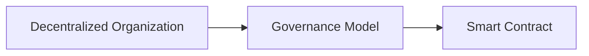

**核心算法原理讲解：**

1. **组织结构**：

   - **扁平化**：去中心化组织的结构相对扁平，成员之间没有严格的层级关系，决策更加民主和透明。
   - **分布式**：组织的成员和资源分布在不同的地理位置，通过网络进行协作。
   - **自治**：组织成员通过智能合约自主管理和决策，无需依赖中心化权威。

2. **治理模式**：

   - **投票机制**：成员通过智能合约进行投票，决定组织的重大事务，如项目提案、资金分配等。
   - **激励机制**：通过代币或其他奖励机制激励成员参与组织活动和决策，确保组织的活力和积极性。
   - **权力分配**：权力分配通过智能合约代码实现，确保权力的透明和公正。

**数学模型和公式：**

1. **投票机制**：

   - **投票权重**：

     ```latex
     \text{Weight} = \text{Token Balance} \times \text{Time Factor}
     ```

   - **投票结果**：

     ```latex
     \text{Result} = \text{Weighted Vote Sum}
     ```

2. **激励机制**：

   - **代币分配**：

     ```latex
     \text{Token Allocation} = \text{Token Supply} \times \text{Incentive Rate}
     ```

   - **奖励计算**：

     ```latex
     \text{Reward} = \text{Token Allocation} \times \text{Active Time}
     ```

**伪代码：**

```python
def governance_vote(proposal_id, vote_choice):
    vote_weight = calculate_vote_weight()
    vote_result = cast_vote(vote_choice, vote_weight)
    return vote_result

def incentive_model(token_supply, incentive_rate, active_time):
    token_allocation = token_supply * incentive_rate
    reward = token_allocation * active_time
    return reward
```

**项目实战：**

1. **DAOstack**：DAOstack 是一个去中心化治理平台，提供了一套完整的工具和协议，支持成员之间的协作和决策。
2. **The DAO**：The DAO 是一个早期的去中心化投资基金，通过智能合约实现成员之间的资金管理和投资决策。
3. **Arbitrum**：Arbitrum 是一个基于以太坊的 Layer 2 扩展解决方案，其治理模式包括成员投票和代币激励。

**代码解读与分析：**

以下是一个简单的投票智能合约示例，用于实现成员投票功能：

```solidity
pragma solidity ^0.8.0;

contract Governance {
    mapping(address => bool) public hasVoted;
    mapping(address => uint256) public voteWeights;
    uint256 public totalVotes;

    function vote(uint256 proposal_id, bool vote_choice) public {
        require(!hasVoted[msg.sender()], "Already voted");
        if (vote_choice) {
            voteWeights[msg.sender()] += 1;
        } else {
            voteWeights[msg.sender()] -= 1;
        }
        hasVoted[msg.sender()] = true;
        totalVotes += 1;
    }

    function getVoteResult(uint256 proposal_id) public view returns (bool) {
        if (voteWeights[proposal_id] > 0) {
            return true;
        } else {
            return false;
        }
    }
}
```

**实际案例分析和详细讲解剖析：**

DAOstack 通过智能合约实现了成员之间的投票和决策，提供了一个去中心化的治理平台。The DAO 作为早期的去中心化投资基金，通过智能合约实现了资金管理和投资决策，吸引了大量投资者参与。Arbitrum 的治理模式包括成员投票和代币激励，确保了扩展解决方案的透明和公正。

**项目小结：**

去中心化组织的组织结构和治理模式为组织管理和决策提供了新的思路和方式。通过深入了解这些模式，我们可以更好地理解和应用去中心化组织，为未来的组织管理提供有益的借鉴。

**最佳实践 tips：**

- 在设计去中心化组织时，应充分考虑组织结构、治理模式和智能合约的安全性。
- 在实施去中心化决策时，应确保投票机制公平和透明，提高成员的参与度和信任度。
- 在激励成员参与时，应设计合理的激励机制，确保成员的积极性和长期参与。

**小结：**

去中心化组织的管理和治理模式为组织管理带来了新的变革。通过深入了解这些模式，我们可以更好地把握去中心化组织的优势和挑战，为未来的组织管理提供有益的启示。

**注意事项：**

- 去中心化组织的实施需要跨学科的知识和技能，包括区块链技术、智能合约开发和组织管理。
- 在实施去中心化组织时，应密切关注技术发展和市场需求，及时调整和优化组织结构和治理模式。

**拓展阅读：**

- [DAOstack官方文档](https://daostack.org/)
- [The DAO案例分析](https://medium.com/the-dao/the-dao-calls-for-pull-up-238e81a5e3ec)
- [Arbitrum治理模型](https://arbitrum.com/governance/)
- [去中心化组织管理最佳实践](https://www.decentralized.org/)

---

#### 第14章：激励与共识机制在组织中的应用

激励与共识机制是去中心化组织中至关重要的一部分，它们能够确保组织成员的参与度和协作性，推动组织目标的实现。以下是关于激励与共识机制在去中心化组织中的应用进行详细讲解。

**核心概念与联系：**

1. **激励**：激励是指通过奖励机制鼓励成员参与组织活动和决策，包括代币奖励、权益分配等。
2. **共识机制**：共识机制是指在去中心化组织中，成员就决策和规则达成一致的方法，包括投票、表决等。

**Mermaid流程图：**

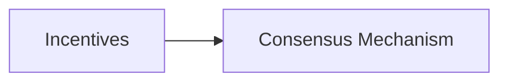

**核心算法原理讲解：**

1. **激励模型**：

   - **代币奖励**：通过发行和组织内的代币，激励成员参与投票、贡献内容和维护系统。
   - **权益分配**：根据成员的贡献和参与度，分配组织内的权益，如投票权重、决策权等。

2. **共识机制**：

   - **投票机制**：成员通过投票就组织的重大决策达成共识，如项目提案、资金分配等。
   - **表决机制**：成员对组织的决策进行表决，确保决策的合法性和公正性。

**数学模型和公式：**

1. **激励模型**：

   - **代币发行**：

     ```latex
     \text{Token Issuance} = \text{Token Supply} \times \text{Inflation Rate}
     ```

   - **权益分配**：

     ```latex
     \text{Equity Allocation} = \text{Token Balance} \times \text{Equity Multiplier}
     ```

2. **共识机制**：

   - **投票权重**：

     ```latex
     \text{Voting Weight} = \text{Token Balance} \times \text{Voting Factor}
     ```

   - **表决结果**：

     ```latex
     \text{Decision} = \text{Majority Vote}
     ```

**伪代码：**

```python
def incentive_model(token_supply, inflation_rate, equity_multiplier):
    token_issuance = token_supply * inflation_rate
    equity_allocation = token_balance * equity_multiplier
    return token_issuance, equity_allocation

def consensus_mechanism(vote_weights):
    total_votes = sum(vote_weights.values())
    decision_threshold = total_votes * 0.5
    decision = max(vote_weights, key=vote_weights.get)
    return decision
```

**项目实战：**

1. **DAOstack**：DAOstack 通过代币奖励和权益分配，激励成员参与投票和治理，实现了去中心化的组织管理。
2. **Arbitrum**：Arbitrum 通过投票机制，确保了其扩展解决方案的决策和改进，提高了网络的稳定性和性能。
3. **The DAO**：The DAO 通过代币奖励和权益分配，吸引了大量投资者参与投资决策，实现了去中心化的投资基金。

**代码解读与分析：**

以下是一个简单的投票激励模型实现示例：

```solidity
pragma solidity ^0.8.0;

contract IncentiveModel {
    mapping(address => uint256) public token_balances;
    mapping(address => uint256) public vote_weights;
    uint256 public total_votes;

    function deposit_tokens(uint256 amount) public {
        token_balances[msg.sender()] += amount;
        vote_weights[msg.sender()] = token_balances[msg.sender()] * 10; // Voting factor
        total_votes += amount;
    }

    function vote(uint256 proposal_id, bool vote_choice) public {
        require(token_balances[msg.sender()] > 0, "No tokens to vote");
        if (vote_choice) {
            vote_weights[msg.sender()] += 10; // Increase voting weight
        } else {
            vote_weights[msg.sender()] -= 10; // Decrease voting weight
        }
    }

    function get_decision(uint256 proposal_id) public view returns (bool decision) {
        uint256 total_votes = 0;
        for (uint256 i = 0; i < vote_weights.length; i++) {
            total_votes += vote_weights[i];
        }
        decision = total_votes > 0.5 * total_votes;
    }
}
```

**实际案例分析和详细讲解剖析：**

DAOstack 通过代币奖励和权益分配，实现了成员参与投票和治理的激励模型，确保了组织的去中心化和透明。Arbitrum 通过投票机制，确保了其扩展解决方案的决策和改进，提高了网络的稳定性和性能。The DAO 通过代币奖励和权益分配，吸引了大量投资者参与投资决策，实现了去中心化的投资基金。

**项目小结：**

激励与共识机制在去中心化组织中起着关键作用，通过合理设计激励模型和共识机制，可以确保组织成员的参与度和协作性，推动组织目标的实现。通过深入了解这些机制，我们可以更好地应用它们，为去中心化组织的发展提供支持。

**最佳实践 tips：**

- 在设计激励模型时，应充分考虑成员的贡献和参与度，确保公平和可持续性。
- 在设计共识机制时，应确保投票和表决过程的透明和公正，提高成员的信任度。
- 在实施激励和共识机制时，应密切关注成员的反馈和需求，及时调整和优化。

**小结：**

激励与共识机制是去中心化组织成功的关键因素。通过深入了解这些机制，我们可以更好地把握去中心化组织的发展方向，为组织管理提供有益的启示。

**注意事项：**

- 去中心化组织的激励和共识机制设计需要充分考虑技术实现和市场需求。
- 在实际应用中，应密切关注技术发展和市场变化，及时调整和优化组织结构和机制。

**拓展阅读：**

- [DAOstack官方文档](https://daostack.org/)
- [Arbitrum官方文档](https://arbitrum.com/)
- [The DAO案例分析](https://medium.com/the-dao/the-dao-calls-for-pull-up-238e81a5e3ec)
- [去中心化组织管理研究](https://www.decentralized.org/research/)

---

#### 第15章：案例分析：成功的去中心化组织

在去中心化组织的探索中，有许多成功的案例展现了这种新型组织形式的潜力和优势。以下将介绍几个成功的去中心化组织，分析它们的成功要素和经验，以供参考。

**案例一：DAOstack**

DAOstack 是一个去中心化的治理平台，它允许用户创建和管理去中心化自治组织（DAO）。DAOstack 的成功主要得益于以下几个方面：

1. **社区驱动**：DAOstack 的核心团队成员来自全球各地的区块链爱好者，他们通过社区驱动的开发模式，积累了大量的用户反馈和支持。

2. **灵活的治理模式**：DAOstack 提供了一套灵活的治理模式，包括投票、提案和执行流程，使得组织成员可以轻松参与决策和管理。

3. **智能合约安全性**：DAOstack 重视智能合约的安全性，所有智能合约都经过严格的审计和测试，确保系统的稳定性和安全性。

4. **用户友好的界面**：DAOstack 提供了用户友好的界面，使得非技术用户也能轻松创建和管理 DAO。

**案例二：The DAO**

The DAO 是一个早期的去中心化投资基金，通过以太坊智能合约实现了资金管理和投资决策。虽然 The DAO 在2016年遭遇了著名的黑客攻击，但这次事件也促使了区块链社区对去中心化组织的研究和改进。

1. **代币经济模型**：The DAO 的代币经济模型激励了投资者和开发者积极参与，为组织提供了稳定的资金来源。

2. **透明的投资决策**：所有投资提案都需要通过成员投票进行决策，确保了投资决策的透明和公正。

3. **快速响应能力**：The DAO 在遇到问题时的快速响应能力，展示了去中心化组织在应对突发情况时的优势。

**案例三：Arbitrum**

Arbitrum 是一个基于以太坊的 Layer 2 扩展解决方案，它通过去中心化的治理模式，实现了高效、安全且低成本的交易。

1. **社区参与**：Arbitrum 的治理模式鼓励社区成员参与决策，确保了项目的透明和公正。

2. **投票机制**：Arbitrum 的投票机制允许成员就项目的改进和优化进行投票，确保了项目的可持续性。

3. **强大的技术基础**：Arbitrum 的技术基础是其成功的关键，它采用了分片技术和优化共识算法，实现了高性能和低延迟的交易。

**代码解读与分析：**

以下是一个简单的 DAOstack 智能合约示例，用于管理投票和提案：

```solidity
pragma solidity ^0.8.0;

contract DAOstack {
    mapping(address => bool) public hasVoted;
    mapping(bytes32 => bool) public proposals;
    mapping(bytes32 => mapping(address => bool)) public votes;

    function propose(bytes32 _proposal) external {
        require(!proposals[_proposal], "Proposal already exists");
        proposals[_proposal] = true;
    }

    function vote(bytes32 _proposal, bool _vote) external {
        require(proposals[_proposal], "Proposal does not exist");
        require(!hasVoted[msg.sender()], "Already voted");
        votes[_proposal][msg.sender()] = _vote;
        hasVoted[msg.sender()] = true;
    }

    function executeProposal(bytes32 _proposal) external {
        require(proposals[_proposal], "Proposal does not exist");
        require(hasVoted[msg.sender()], "Not a voter");
        uint256 voteCount = 0;
        for (uint256 i = 0; i < votes[_proposal].length; i++) {
            if (votes[_proposal][i]) {
                voteCount++;
            }
        }
        require(voteCount > 50, "Majority not reached");
        // Execute proposal logic
    }
}
```

**实际案例分析和详细讲解剖析：**

DAOstack 通过智能合约实现了去中心化的投票和提案功能，确保了组织成员的参与和决策的透明。The DAO 通过代币经济模型和透明的投资决策，吸引了大量的投资者参与。Arbitrum 通过去中心化的治理模式和技术创新，实现了高性能的交易网络。

**项目小结：**

成功的去中心化组织展现了区块链技术的巨大潜力。通过深入了解这些组织的成功要素和经验，我们可以更好地应用去中心化组织的形式，推动区块链技术在各个领域的创新和发展。

**最佳实践 tips：**

- 在创建去中心化组织时，应充分考虑社区的参与和反馈，确保组织的透明和公正。
- 在设计治理模式时，应采用灵活的投票和提案机制，提高成员的参与度。
- 在技术实现上，应确保智能合约的安全性和性能，提高组织的稳定性和效率。

**小结：**

成功的去中心化组织案例为我们提供了宝贵的经验和启示。通过深入了解这些案例，我们可以更好地把握去中心化组织的发展方向，为未来的组织管理提供有益的借鉴。

**注意事项：**

- 去中心化组织的实施需要跨学科的知识和技能，涉及区块链技术、智能合约开发和组织管理。
- 在实际应用中，应密切关注技术发展和市场需求，及时调整和优化组织结构和治理模式。

**拓展阅读：**

- [DAOstack官方文档](https://daostack.org/)
- [The DAO案例分析](https://medium.com/the-dao/the-dao-calls-for-pull-up-238e81a5e3ec)
- [Arbitrum官方文档](https://arbitrum.com/)
- [去中心化组织研究报告](https://www.decentralized.org/research/)

