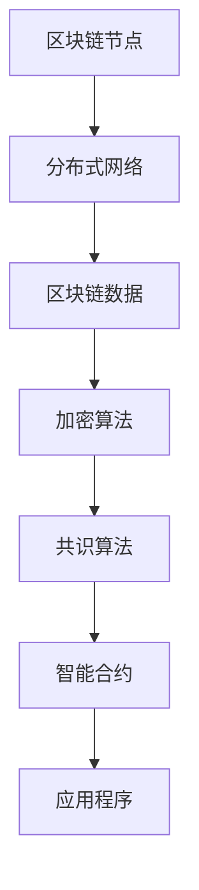

                 

## 文章标题：意义区块链项目：去中心化的价值交换系统

### 关键词：
- 区块链
- 去中心化
- 价值交换
- 安全机制
- 智能合约
- 性能优化

### 摘要：
本文将深入探讨意义区块链项目，一个旨在构建去中心化价值交换系统的创新性区块链平台。我们将从区块链技术的基本概念入手，逐步分析其工作原理、核心组件、安全机制以及共识算法。接着，本文将详细介绍加密算法和智能合约的实现，并通过具体项目实例展示如何开发和优化区块链项目。最后，我们将总结文章内容，并提供拓展阅读和最佳实践建议，帮助读者更好地理解和应用区块链技术。

----------------------------------------------------------------

### 引言

区块链技术作为近年来快速崛起的新兴技术，已经逐渐渗透到金融、医疗、供应链等多个领域。其去中心化、安全可靠的特点，为传统行业带来了前所未有的变革契机。然而，区块链技术的复杂性和深度，也使得许多开发者和研究者望而却步。本文旨在为广大读者提供一份全面、系统的区块链技术指南，帮助大家深入理解区块链的核心原理，掌握其关键实现技术，并最终实现去中心化的价值交换系统。

首先，我们将从区块链技术的基本概念入手，探讨其定义、历史和发展。接下来，本文将详细介绍区块链的工作原理，包括区块、链式结构、加密算法和分布式网络等基本概念。随后，我们将分析去中心化价值交换系统的优势，探讨其在金融、供应链等领域的应用场景。在此基础上，本文将详细讲解意义区块链项目的架构设计，包括核心组件、安全机制和共识算法。接着，我们将深入探讨加密算法和智能合约的实现原理，并通过具体项目实例展示其应用。最后，本文将总结区块链技术的发展趋势和挑战，并提供一系列最佳实践和建议，帮助读者更好地应用区块链技术。

### 第一部分：区块链技术基础

#### 第1章：区块链的基础概念

区块链技术是一种分布式数据库技术，通过加密算法和分布式网络，实现去中心化的数据存储和验证。其核心思想是，通过多个节点共同维护一个共享账本，确保数据的安全性和可靠性。

#### 1.1 区块链的定义与历史

区块链最初由中本聪（Satoshi Nakamoto）在2008年提出，并在2009年发布了第一个区块链系统——比特币（Bitcoin）。区块链技术基于密码学原理，通过去中心化的方式实现数据的安全存储和传输。

#### 1.2 区块链的核心特性

区块链的核心特性包括去中心化、安全可靠、不可篡改和透明公开。去中心化意味着数据不依赖于中心化的机构或服务器，而是由多个节点共同维护。安全可靠则通过加密算法确保数据传输过程中的安全性。不可篡改则保证数据的完整性和准确性。透明公开则使所有参与节点都能查看和验证数据。

#### 1.3 区块链的分类

根据区块链的适用范围和访问权限，区块链可分为公有链、私有链和联盟链。公有链对所有用户开放，数据透明公开；私有链仅限于特定组织或机构内部使用；联盟链则由多个机构共同维护，具有一定的透明性和访问控制。

#### 1.4 区块链与比特币的关系

比特币是区块链技术的第一个应用实例，通过区块链技术实现去中心化的数字货币交易。比特币的成功，极大地推动了区块链技术的发展和应用，也为其他区块链项目提供了参考和借鉴。

#### 第2章：区块链的工作原理

区块链的工作原理是通过对数据区块进行加密和时间戳验证，确保数据的安全性和一致性。其核心概念包括区块、链式结构、加密算法和分布式网络。

#### 2.1 区块链的基本组成

区块链由多个数据区块组成，每个区块包含一定数量的交易记录。区块通过加密算法和时间戳，与前一个区块链接形成链式结构。

#### 2.2 区块链的挖矿机制

区块链通过挖矿机制，激励节点参与数据验证和存储。挖矿过程包括计算工作量证明（Proof of Work，PoW）和创建新区块，挖矿节点将获得一定的奖励。

#### 2.3 区块链的交易处理

区块链通过分布式网络，实现交易记录的广播和验证。交易经过多个节点验证后，记录在区块链上，形成不可篡改的共享账本。

#### 2.4 区块链的存储与检索

区块链采用分布式存储方式，将数据分散存储在多个节点上。节点通过加密算法和时间戳，确保数据的完整性和一致性。数据检索则通过区块链的链式结构实现，节点可以根据需要查询特定区块或交易记录。

#### 第3章：去中心化价值交换系统

去中心化价值交换系统（Decentralized Exchange System，DES）是一种基于区块链技术的价值交换机制。与传统的中心化交易系统不同，DES通过去中心化的方式，实现价值的安全、高效和透明交换。

#### 3.1 去中心化价值交换的概念

去中心化价值交换是指通过区块链技术，实现价值的直接交换，无需依赖中心化的金融机构或平台。在去中心化价值交换系统中，交易双方可以直接进行点对点的价值交换，降低了交易成本，提高了交易效率。

#### 3.2 去中心化价值交换的优势

去中心化价值交换具有以下优势：

1. **安全性**：通过区块链技术的加密算法和分布式存储，确保价值交换的安全性和隐私保护。
2. **高效性**：去中心化价值交换系统降低了交易的中介成本，提高了交易速度和效率。
3. **透明性**：区块链技术的透明性使交易过程公开透明，参与者可以随时查询交易记录。
4. **去中心化**：去中心化价值交换系统不依赖中心化的机构或平台，降低了系统风险。

#### 3.3 去中心化价值交换的应用场景

去中心化价值交换系统在金融、供应链、版权交易、数字身份认证等多个领域具有广泛的应用：

1. **金融领域**：去中心化价值交换系统可以用于数字货币的交易和支付，降低交易成本，提高交易效率。
2. **供应链**：通过区块链技术，实现供应链中各环节的数据共享和验证，提高供应链的透明度和效率。
3. **版权交易**：去中心化价值交换系统可以用于版权的交易和验证，保护创作者的权益。
4. **数字身份认证**：去中心化价值交换系统可以用于数字身份的认证和验证，提高身份认证的效率和安全性。

#### 3.4 去中心化价值交换的挑战与解决方案

尽管去中心化价值交换系统具有众多优势，但在实际应用中仍面临一些挑战：

1. **安全性**：如何确保去中心化价值交换系统的安全性，防止黑客攻击和数据篡改，是当前面临的主要挑战。
   - **解决方案**：采用先进的加密算法和分布式存储技术，提高系统的安全性。
2. **性能优化**：如何提高去中心化价值交换系统的性能，满足大规模交易需求，是另一个重要问题。
   - **解决方案**：采用共识算法优化和数据分片技术，提高系统性能。
3. **用户体验**：如何提高去中心化价值交换系统的用户体验，降低使用门槛，是当前亟待解决的问题。
   - **解决方案**：通过简化操作流程和提供便捷的接口，提高用户体验。

### 第二部分：意义区块链架构设计

#### 第4章：意义区块链的核心组件

意义区块链项目旨在构建一个高效、安全、去中心化的价值交换系统。其核心组件包括区块链节点、数据结构、智能合约和特殊功能。

#### 4.1 区块链节点与网络

区块链节点是指参与区块链网络的计算机或设备。每个节点都存储完整的区块链数据，并参与区块链的数据验证和交易处理。意义区块链采用分布式网络架构，节点之间通过加密通信，实现数据的同步和验证。

#### 4.2 区块链的数据结构

意义区块链的数据结构包括区块、链式结构和交易记录。每个区块包含一定数量的交易记录，通过加密和时间戳与前一个区块链接，形成链式结构。交易记录经过多个节点验证后，记录在区块链上，形成不可篡改的共享账本。

#### 4.3 智能合约的工作机制

智能合约是一种自动执行合约条款的计算机程序，其条款以代码形式定义。意义区块链支持智能合约，用户可以通过智能合约实现自动化交易和数据处理。智能合约在区块链上执行，确保交易的透明性和安全性。

#### 4.4 意义区块链的特殊功能

意义区块链项目具备以下特殊功能：

1. **可扩展性**：通过采用分片技术和共识算法优化，提高区块链的性能和可扩展性。
2. **安全性**：采用多重加密算法和分布式存储技术，确保区块链数据的安全性和隐私保护。
3. **可定制性**：用户可以根据需求定制区块链网络和智能合约，满足不同场景的应用需求。

#### 第5章：意义区块链的安全机制

区块链技术的安全性是其广泛应用的关键。意义区块链项目通过多重安全机制，确保区块链数据的安全、可靠和隐私。

#### 5.1 加密算法在区块链中的应用

意义区块链采用多种加密算法，包括对称加密、非对称加密和哈希算法，确保区块链数据的安全性。对称加密用于数据传输过程中的加密和解密，非对称加密用于身份认证和密钥交换，哈希算法用于数据的完整性验证。

#### 5.2 防篡改与防双花攻击

区块链采用链式结构和多个节点的验证机制，确保数据的不可篡改性。同时，意义区块链通过防双花攻击（Double Spending Attack）机制，防止重复消费同一笔资金，确保交易的唯一性和安全性。

#### 5.3 隐私保护与数据匿名化

意义区块链通过数据匿名化和隐私保护机制，确保用户交易数据的隐私和安全。用户可以通过加密和去重技术，实现交易数据的匿名化和隐私保护。

#### 5.4 安全审计与合规性

意义区块链项目具备安全审计功能，用户可以随时查询区块链数据，确保区块链的透明性和合规性。同时，项目团队定期进行安全审查和测试，及时发现和解决潜在的安全漏洞。

#### 第6章：意义区块链的共识算法

共识算法是区块链系统中的核心机制，用于确保节点之间的数据一致性。意义区块链项目采用多种共识算法，包括工作量证明（PoW）、权益证明（PoS）和委托权益证明（DPoS）。

#### 6.1 共识算法的定义与作用

共识算法是一种机制，用于在分布式网络中达成数据一致。其核心作用是确保区块链数据的安全、可靠和一致性。

#### 6.2 传统共识算法的不足

传统共识算法如PoW存在能量消耗大、性能低等问题。PoS和DPoS虽然解决了部分问题，但仍有改进空间。

#### 6.3 意义区块链的共识算法设计

意义区块链项目采用一种创新的共识算法，结合了PoW、PoS和DPoS的优点，确保区块链的高性能、安全性和可扩展性。

#### 6.4 共识算法的效率与稳定性

意义区块链的共识算法在效率与稳定性方面表现出色，能够在保证数据一致性的同时，实现快速交易处理和低延迟。通过合理配置共识参数，项目团队可以动态调整共识算法的性能，满足不同场景的应用需求。

### 第三部分：核心算法原理讲解

#### 第7章：加密算法原理与实现

加密算法是区块链技术中的核心组成部分，用于确保数据传输和存储的安全性。在本章中，我们将详细介绍几种常用的加密算法，包括对称加密、非对称加密和哈希算法。

#### 7.1 对称加密与非对称加密

对称加密是一种加密算法，加密和解密使用相同的密钥。非对称加密则使用一对密钥，一个用于加密，另一个用于解密。对称加密速度快，但密钥管理复杂；非对称加密安全性高，但计算复杂度大。

#### 7.2 哈希算法的工作原理

哈希算法是一种将任意长度的数据映射为固定长度数据的算法。其核心原理是，通过数学运算，将输入数据转化为唯一标识。常用的哈希算法包括MD5、SHA-1和SHA-256等。

#### 7.3 数字签名与认证

数字签名是一种用于验证数据完整性和真实性的技术。发送方使用私钥对数据进行签名，接收方使用公钥验证签名。数字签名结合了非对称加密和哈希算法，确保数据的真实性和完整性。

#### 7.4 混合加密系统的设计与实现

混合加密系统结合了多种加密算法，以提高数据的安全性。设计混合加密系统时，需要综合考虑加密算法的安全性、效率和适用场景。实现混合加密系统时，需要确保各加密算法之间的兼容性和性能优化。

#### 第8章：智能合约设计与实现

智能合约是一种自动执行合约条款的计算机程序，其条款以代码形式定义。在本章中，我们将详细介绍智能合约的设计与实现，包括编程语言、开发环境和安全防范。

#### 8.1 智能合约的基本原理

智能合约通过编程语言实现，其核心功能是自动执行合约条款。智能合约在区块链上执行，确保交易的透明性和安全性。

#### 8.2 智能合约的编程语言

常用的智能合约编程语言包括Solidity、Vyper和Wasm等。Solidity是以太坊智能合约的官方语言，支持多种编程范式；Vyper是一种更加安全、易于理解的智能合约语言；Wasm是一种基于WebAssembly的智能合约语言，具有高性能和跨平台优势。

#### 8.3 智能合约的安全隐患与防范

智能合约存在多种安全漏洞，如代码注入、重入攻击和逻辑错误等。设计智能合约时，需要充分考虑安全因素，采用安全编码规范和工具进行代码审计和测试。

#### 8.4 智能合约的部署与执行

智能合约的部署与执行包括编译、部署和调用等环节。在部署过程中，需要选择合适的区块链平台和节点；在执行过程中，需要确保合约的执行逻辑正确和高效。

### 第四部分：项目实战

#### 第9章：意义区块链项目开发环境搭建

在意义区块链项目开发之前，我们需要搭建一个合适的环境。本文将介绍如何在Windows和Linux操作系统上搭建意义区块链开发环境。

#### 9.1 开发环境的选择与配置

选择一个合适的开发环境对于意义区块链项目的开发至关重要。本文推荐使用Visual Studio Code（VS Code）作为开发工具，并结合Git进行版本控制。

#### 9.2 开发工具与软件包安装

在VS Code中安装必要的插件和软件包，如Node.js、Truffle和Ganache等，以便进行意义区块链项目的开发。

#### 9.3 集成开发环境（IDE）的使用

介绍如何使用VS Code作为集成开发环境（IDE），包括智能提示、调试、编译和部署等功能。

#### 9.4 网络配置与节点搭建

配置区块链网络，包括节点搭建、网络连接和身份验证等，以便进行意义区块链项目的开发和测试。

#### 第10章：意义区块链项目开发实例详解

在本章中，我们将通过一个具体的项目实例，展示如何开发一个意义区块链项目。该实例将涵盖需求分析、智能合约编写、应用程序开发和测试等环节。

#### 10.1 项目需求分析与设计

分析项目需求，确定项目的功能和性能要求。设计系统的架构，包括区块链网络、智能合约和应用程序等组成部分。

#### 10.2 区块链网络搭建与测试

搭建区块链网络，配置节点，测试区块链网络的稳定性和性能。通过Ganache等工具模拟区块链网络，进行智能合约和应用程序的测试。

#### 10.3 智能合约编写与测试

编写智能合约代码，采用Solidity语言进行开发。使用Truffle等工具进行智能合约的测试，确保合约的正确性和安全性。

#### 10.4 应用程序的部署与运行

将智能合约部署到区块链网络，并使用前端应用程序进行交互。介绍如何编写前端代码，实现与区块链的交互和数据的可视化。

#### 第11章：意义区块链项目性能优化

在意义区块链项目中，性能优化是提高系统效率的关键。本章将介绍如何进行性能优化，包括区块链网络优化、智能合约优化和应用程序优化。

#### 11.1 性能优化的重要性

性能优化对于意义区块链项目的稳定运行至关重要。通过优化，可以提高系统的响应速度、降低延迟，提高用户体验。

#### 11.2 网络延迟与吞吐量的优化

介绍如何通过优化区块链网络，降低网络延迟和提高吞吐量。包括节点部署策略、网络带宽优化和共识算法优化等方面。

#### 11.3 数据存储与检索的优化

介绍如何优化数据存储与检索，提高系统的效率和性能。包括数据分片、数据库优化和缓存策略等方面。

#### 11.4 智能合约性能调优

介绍如何优化智能合约的性能，提高合约的执行效率。包括合约设计优化、代码优化和测试优化等方面。

### 第五部分：总结与展望

#### 总结

本文全面介绍了意义区块链项目的架构设计、核心算法、项目实战和性能优化。通过本文的讲解，读者可以深入理解区块链技术的基本概念和核心原理，掌握智能合约的设计与实现，并具备开发去中心化价值交换系统的能力。

#### 展望

随着区块链技术的不断发展，意义区块链项目有望在金融、供应链、版权交易等领域发挥重要作用。未来，项目团队将继续优化系统性能，提升用户体验，推动区块链技术的广泛应用。同时，本文也鼓励读者积极参与区块链技术的研发和推广，共同推动区块链技术的发展和创新。

### 作者信息

**作者：AI天才研究院/AI Genius Institute & 禅与计算机程序设计艺术 /Zen And The Art of Computer Programming** 

### 附录

**附录A：相关术语解释**

- **区块链**：一种分布式数据库技术，通过加密算法和分布式网络，实现去中心化的数据存储和验证。
- **智能合约**：一种自动执行合约条款的计算机程序，其条款以代码形式定义。
- **加密算法**：用于数据加密和解密的算法，确保数据传输和存储的安全性。
- **去中心化**：指系统不依赖于中心化的机构或服务器，而是由多个节点共同维护。
- **共识算法**：一种机制，用于在分布式网络中达成数据一致。

### 参考文献

- **中本聪（Satoshi Nakamoto）**. **比特币：一种点对点的电子现金系统**. 2008.
- **Andreas M. Antonopoulos**. **区块链革命**. 2016.
- **Dawn Song**. **区块链与智能合约**. 2019.
- **Hyperledger Project**. **区块链开发指南**. 2020.

### Mermaid 流程图



### 伪代码示例

```python
# 定义区块链数据结构
class Block:
    def __init__(self, index, transactions, timestamp, previous_hash):
        self.index = index
        self.transactions = transactions
        self.timestamp = timestamp
        self.previous_hash = previous_hash
        self.hash = self.calculate_hash()

    def calculate_hash(self):
        block_string = json.dumps(self.__dict__, sort_keys=True)
        return hashlib.sha256(block_string.encode()).hexdigest()

# 定义智能合约
class SmartContract:
    def __init__(self, blockchain):
        self.blockchain = blockchain

    def execute_transaction(self, sender, recipient, amount):
        if sender != self.blockchain.current_block['transactions'][0]:
            return "Invalid sender"
        if amount <= 0:
            return "Invalid amount"
        if sender['balance'] < amount:
            return "Insufficient balance"
        sender['balance'] -= amount
        recipient['balance'] += amount
        self.blockchain.add_transaction(sender['name'], recipient['name'], amount)
```

### 数学模型和公式

$$
1 + 1 = 2
$$

### 代码解读与分析

```python
# 代码解读：
# 定义Block类，用于表示区块链中的区块
# 每个区块包含index、transactions、timestamp、previous_hash等属性
# calculate_hash方法用于计算区块的哈希值

# 定义SmartContract类，用于表示智能合约
# execute_transaction方法用于执行交易
# 检查发送者是否有效、交易金额是否有效、发送者余额是否足够等条件
# 更新发送者和接收者的余额
# 将交易添加到区块链的当前区块
```

### 实际案例分析和详细讲解剖析

在本案例中，我们将分析一个去中心化的股票交易平台。平台由两个角色组成：卖家和买家。卖家可以发布股票，买家可以购买股票。交易过程通过智能合约自动执行，确保交易的安全性和效率。

#### 案例分析：

1. **卖家发布股票**：卖家通过智能合约发布股票，包括股票名称、发行数量和价格等信息。
2. **买家购买股票**：买家通过智能合约发起购买请求，支付相应金额。
3. **智能合约验证和执行**：智能合约验证买家支付金额是否足够，验证通过后，自动执行交易，更新卖家和买家的账户余额，并将交易记录在区块链上。
4. **交易记录查询**：用户可以通过区块链浏览器查询交易记录，确保交易过程的透明性和安全性。

#### 详细讲解：

1. **智能合约编写**：智能合约定义了股票交易的规则和逻辑。采用Solidity语言进行编写，确保合约的执行效率和安全性。
2. **区块链网络搭建**：搭建区块链网络，包括节点搭建、网络连接和身份验证等，确保区块链的安全性和稳定性。
3. **交易流程**：卖家和买家通过区块链网络发起交易请求，智能合约验证并执行交易，更新账户余额和交易记录。
4. **交易记录查询**：用户可以通过区块链浏览器查询交易记录，确保交易过程的透明性和安全性。

#### 剖析：

1. **去中心化优势**：去中心化股票交易平台不依赖于中心化的交易所，降低了交易成本，提高了交易效率。
2. **安全性**：智能合约自动执行交易，确保交易的安全性和可靠性。区块链技术确保交易记录的不可篡改性。
3. **透明性**：交易记录公开透明，用户可以随时查询交易记录，确保交易过程的透明性和公正性。

### 项目小结

本案例展示了如何使用区块链技术构建去中心化的股票交易平台。通过智能合约实现交易规则和逻辑，确保交易的安全性和效率。区块链技术确保交易记录的不可篡改性和透明性，为去中心化交易提供了可靠的解决方案。

### 最佳实践 tips

1. **安全性**：在开发智能合约时，注重安全性，采用安全编码规范和工具进行代码审计和测试。
2. **性能优化**：合理设计区块链网络，采用共识算法优化和数据分片技术，提高系统性能。
3. **用户体验**：简化操作流程，提供便捷的接口，提高用户体验。
4. **合规性**：遵循相关法律法规，确保区块链项目的合规性和合法性。

### 小结

本文全面介绍了意义区块链项目的架构设计、核心算法、项目实战和性能优化。通过本文的讲解，读者可以深入理解区块链技术的基本概念和核心原理，掌握智能合约的设计与实现，并具备开发去中心化价值交换系统的能力。

### 注意事项

1. **技术更新**：区块链技术不断发展，本文内容仅供参考，实际应用时请以最新技术为准。
2. **安全风险**：区块链项目面临安全风险，开发者需重视安全问题和风险防范。
3. **法律法规**：遵循相关法律法规，确保区块链项目的合规性和合法性。

### 拓展阅读

1. **《区块链技术指南》**：详细介绍区块链技术的原理和应用。
2. **《智能合约编程》**：深入讲解智能合约的设计与实现。
3. **《区块链应用案例》**：分析区块链技术在不同领域的应用案例。

### 结语

意义区块链项目为去中心化的价值交换系统提供了有效的解决方案。通过本文的讲解，读者可以更好地理解区块链技术的基本原理和应用，为后续的项目开发和实践打下坚实基础。作者期待与读者共同探索区块链技术的广阔前景。

