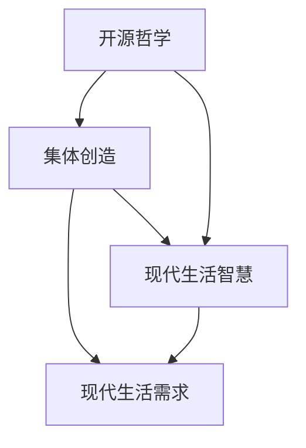

                 

### 文章标题：意义开源哲学项目：集体创造适应现代的生活智慧

#### 关键词：意义开源哲学、集体创造、现代生活智慧、开源项目、实践方法、案例分析

#### 摘要：
本文旨在探讨意义开源哲学项目在现代生活中的重要性，以及如何通过集体创造实现适应现代社会的智慧生活。文章首先介绍了开源哲学的背景和发展，随后深入分析了集体创造的核心概念和实践方法。接着，文章探讨了现代生活智慧的需求和特征，并通过实际案例展示了开源项目在现代生活中的应用。最后，文章提出了未来意义开源哲学的发展方向和挑战，以及相关建议和拓展阅读，以期为读者提供全面而深入的理解。

----------------------------------------------------------------

### 引言

#### 1.1 书籍背景与目的

意义开源哲学项目源于开源运动的兴起，它不仅推动了技术的创新和传播，更在深层次上改变了我们的生活方式和社会结构。随着信息时代的到来，人们逐渐认识到集体创造的力量，以及开源哲学对现代社会的重要性。本文旨在探讨意义开源哲学项目在现代生活中的应用，通过集体创造实现适应现代社会的智慧生活。

书籍的目标读者包括对开源哲学和集体创造感兴趣的程序员、开源社区成员、技术管理者、以及对现代生活智慧有追求的普通读者。通过本文，读者将了解开源哲学的基本概念、集体创造的核心理论、现代生活智慧的需求和应用，并掌握一些实用的实践方法和案例分析。

本文将按以下结构展开：

1. **意义开源哲学基础**：介绍开源哲学的核心概念，集体创造的基础理论，以及现代生活智慧的需求。
2. **集体创造的实践方法**：讨论集体创造的过程管理、开源项目的组织与运营。
3. **现代生活智慧的应用场景**：分析教育领域和工作环境的智慧创造。
4. **意义开源哲学的未来发展**：探讨挑战与机遇，以及开源哲学的全球趋势。
5. **案例研究**：深入分析具体开源项目。
6. **结论与展望**：总结全文，提出建议和展望。

通过以上结构，本文将逐步引导读者深入理解意义开源哲学项目，以及如何通过集体创造适应现代的生活智慧。接下来，我们将从开源哲学的核心概念开始，逐步展开讨论。

----------------------------------------------------------------

## 第2章 意义开源哲学基础

意义开源哲学是一种基于开放共享、合作创新的理念，它不仅推动了技术的进步，也在深层次上影响了我们的生活方式和社会结构。本章节将详细介绍开源哲学的核心概念、集体创造的基础理论，以及现代生活智慧的需求。

### 2.1 开源哲学的核心概念

开源哲学起源于软件开源运动，其核心概念包括开放性、共享性、合作性和创新性。

**开放性**：开源项目通常采用开放许可证，允许用户自由地阅读、修改和分发源代码。这种开放性不仅促进了技术交流，还激发了不同背景、不同领域的人共同参与创新。

**共享性**：开源哲学强调知识共享，通过共享源代码和资源，降低了技术传播的门槛，使得更多的人能够受益于开源成果。

**合作性**：开源项目往往是集体智慧的结晶，参与者来自不同的背景和领域，他们通过合作解决技术难题，推动项目的进展。

**创新性**：开源哲学鼓励创新，通过开放的生态系统，不断激发新的创意和改进。

### 2.2 集体创造的基础理论

集体创造是基于开源哲学的一种重要实践，其基础理论包括集体智慧、团队协作和共同目标。

**集体智慧**：集体智慧是指通过团队协作和知识共享，共同解决复杂问题的一种能力。它超越了个体的认知局限，能够实现更高水平的创新和效率。

**团队协作**：团队协作是实现集体创造的关键。通过明确的分工、有效的沟通和协同工作，团队能够更好地应对挑战，实现共同目标。

**共同目标**：集体创造的成功离不开共同目标的设定和追求。共同目标能够凝聚团队，激发成员的积极性，推动项目的进展。

### 2.3 现代生活智慧的需求

现代生活智慧是指在现代社会中，人们通过科技创新和知识共享，实现更高质量生活的能力。随着信息技术的迅猛发展，现代生活智慧的需求日益凸显。

**智能化**：现代生活智慧的一个显著特征是智能化，通过人工智能、物联网等技术，使得生活更加便捷、高效。

**个性化**：随着个性化需求的增加，现代生活智慧强调根据个体需求提供定制化服务，提升生活质量。

**可持续性**：现代生活智慧还关注可持续性，通过节能减排、绿色科技等方式，实现人与自然的和谐共生。

### 2.4 核心概念之间的关系架构

为了更好地理解开源哲学、集体创造和现代生活智慧之间的关系，我们可以使用 Mermaid 流程图来展示它们之间的关联。



在这个流程图中，开源哲学作为基础，推动了集体创造的实践，而集体创造又满足了现代生活智慧的需求，实现了现代生活的提升。

通过以上分析，我们可以看出开源哲学、集体创造和现代生活智慧之间存在着紧密的联系和相互影响。在接下来的章节中，我们将深入探讨集体创造的实践方法和现代生活智慧的应用场景，以期为读者提供更全面的理解。

----------------------------------------------------------------

### 第3章 集体创造的实践方法

集体创造作为一种重要的创新模式，在现代社会的各个领域都有着广泛的应用。要实现高效的集体创造，需要科学的过程管理、有效的团队协作和健全的项目组织与运营。本章节将详细介绍这些实践方法，并提供具体的案例来帮助读者理解。

#### 3.1 集体创造的过程管理

过程管理是集体创造成功的关键。一个清晰、高效的过程管理能够确保项目的顺利进行，提高团队的协作效率。

**过程管理的基本流程**：

1. **需求分析**：明确项目的目标、需求和预期成果。
2. **任务分解**：将整体任务分解为若干可执行的小任务。
3. **任务分配**：根据团队成员的技能和专长，合理分配任务。
4. **进度监控**：定期检查任务进度，及时调整计划。
5. **成果评审**：对已完成的任务进行评审，确保质量达标。

**过程管理的工具和平台**：

- **项目管理工具**：如 Jira、Trello、Asana 等，可以帮助团队高效地管理任务和进度。
- **代码托管平台**：如 GitHub、GitLab，用于代码的存储、协同开发和版本控制。

**伪代码示例**：

```python
function process_management(project):
    analyze需求的
    decompose任务的
    allocate_tasks团队成员的
    monitor_progress定期检查
    review_results成果评审
```

#### 3.2 团队协作的技巧

团队协作是集体创造的核心，有效的团队协作能够激发成员的积极性，提高项目的成功率。

**团队协作的技巧**：

1. **明确分工**：每个团队成员都应明确自己的职责和任务。
2. **有效沟通**：保持沟通的及时性和透明性，确保信息畅通。
3. **相互尊重**：尊重团队成员的意见和贡献，建立良好的团队氛围。
4. **共同目标**：确保团队的目标一致，并为之共同努力。

**团队协作的工具和平台**：

- **即时通讯工具**：如 Slack、Microsoft Teams，用于实时沟通和协作。
- **视频会议工具**：如 Zoom、Google Meet，用于远程会议和团队交流。

**伪代码示例**：

```python
function team_collaboration(team_members):
    define_roles明确分工
    communicate_effectively有效沟通
    respect_opinions相互尊重
    align_goals共同目标
```

#### 3.3 开源项目的组织与运营

开源项目的成功不仅依赖于技术，还需要良好的组织和运营。有效的组织和运营能够保证项目的持续发展，吸引更多的贡献者。

**开源项目的生命周期**：

1. **启动阶段**：项目构想和初步设计。
2. **成长阶段**：代码编写和社区建设。
3. **成熟阶段**：持续迭代和优化。
4. **衰退阶段**：项目维护和后续发展。

**开源项目的工具和平台**：

- **代码托管平台**：如 GitHub、GitLab，用于代码存储和协同开发。
- **持续集成工具**：如 Jenkins、Travis CI，用于自动化测试和构建。
- **文档平台**：如 Read the Docs、GitBook，用于文档编写和发布。

**开源项目的运营策略**：

1. **明确目标**：制定清晰的项目目标和路线图。
2. **吸引贡献者**：通过优秀的代码和社区互动，吸引更多的贡献者。
3. **激励机制**：设立贡献积分、荣誉称号等激励机制，激发贡献者的积极性。
4. **社区建设**：定期举办活动，促进社区成员之间的交流与合作。

**伪代码示例**：

```python
function open_source_project(lifecycle, tools, strategies):
    define_goals明确目标
    attract_contributors吸引贡献者
    motivate_contributors激励机制
    build_community社区建设
```

#### 3.4 实际案例解析

为了更好地理解集体创造的实践方法，我们可以通过一个开源项目案例来进行分析。

**案例：Linux 操作系统**

Linux 是一个典型的开源项目，其成功离不开科学的集体创造实践。

- **过程管理**：Linux 项目采用了敏捷开发的方法，通过不断迭代和反馈，实现了高效的进度管理。
- **团队协作**：Linux 社区成员来自世界各地，通过电子邮件、邮件列表和开源代码库进行协作，有效沟通和共享知识。
- **组织与运营**：Linux 项目有明确的贡献指南和代码规范，通过 GitHub 平台进行代码托管和协作，吸引了大量的贡献者。

通过以上案例，我们可以看到，科学的集体创造实践方法对于开源项目的成功至关重要。在接下来的章节中，我们将进一步探讨现代生活智慧的应用场景，以期为读者提供更全面的理解。

----------------------------------------------------------------

### 第4章 现代生活智慧的应用场景

现代生活智慧的核心在于通过科技创新和知识共享，提升个人生活质量和社会运行效率。本章将探讨现代生活智慧在教育领域和工作环境中的应用，并通过具体案例进行详细分析。

#### 4.1 教育领域的智慧创造

教育是现代生活智慧的重要应用场景之一。通过开源哲学和集体创造的实践，教育领域可以实现资源共享、教学创新和学生个性化发展。

**1. 开源教育资源**

- **共享知识**：通过开源教育资源的共享，教师和学生能够获取更多的学习材料，拓宽知识视野。
- **降低门槛**：开源教育资源降低了学习成本，使得更多人能够获得高质量的教育。

**案例：Khan Academy**

Khan Academy 是一个典型的开源教育资源项目，通过视频课程和在线作业，为全球学生提供免费的教育资源。Khan Academy 的成功离不开开源哲学和集体创造的实践，其核心团队与全球志愿者共同协作，不断优化课程内容和教学方式，使得学生能够通过个性化的学习路径获得最佳的学习效果。

**2. 教育创新项目**

- **智能教学工具**：通过人工智能和大数据技术，智能教学工具能够根据学生的学习情况和需求，提供个性化的学习建议和资源。
- **混合式学习**：混合式学习模式将线上和线下教学相结合，实现教学方式的多样化和灵活化。

**案例：EdX**

EdX 是一个由哈佛大学和麻省理工学院共同创建的在线学习平台，提供高质量的在线课程。EdX 通过开源技术和集体创造的方式，吸引了全球顶尖大学和教育机构加入，共同推动在线教育的发展。EdX 的课程采用混合式学习模式，结合在线学习和线下实践，为学生提供了更加丰富和多样化的学习体验。

#### 4.2 工作环境的智慧提升

工作环境是现代生活智慧应用的另一个重要领域。通过开源技术和集体创造的实践，企业可以实现工作效率的提升、团队协作的优化和业务流程的智能化。

**1. 开源工具在职场中的应用**

- **办公自动化**：通过开源办公软件（如 LibreOffice、OpenOffice），企业能够实现办公自动化，降低运营成本。
- **团队协作平台**：开源的团队协作工具（如 Git、Jenkins、Confluence）提供了高效的工作流程和项目管理功能。

**案例：GitHub**

GitHub 是一个全球知名的代码托管和协作平台，通过开源技术和集体创造的实践，GitHub 成为了软件开发者和企业的重要工具。GitHub 的成功不仅在于其高效的代码管理和协作功能，更在于其开放的文化和社区氛围，吸引了全球开发者共同参与和贡献。GitHub 的实践表明，开源哲学和集体创造能够极大提升工作环境的智慧化水平。

**2. 智能化业务流程**

- **人工智能应用**：通过人工智能技术，企业可以实现业务流程的自动化和智能化，提高工作效率和准确性。
- **大数据分析**：通过对大数据的分析，企业能够更好地了解市场趋势、客户需求和业务运营情况，为决策提供数据支持。

**案例：阿里巴巴**

阿里巴巴是一个全球领先的互联网公司，通过开源技术和集体创造的实践，阿里巴巴构建了高效的业务流程和智能化的运营体系。阿里巴巴的“双11”购物节就是一个典型的案例，通过大数据分析、人工智能算法和云计算技术，阿里巴巴能够实现购物节的智能化运营，极大提升了用户体验和销售效果。

通过以上分析，我们可以看到，现代生活智慧在教育领域和工作环境中的应用，不仅提升了个人生活质量，也促进了社会的发展。在接下来的章节中，我们将进一步探讨意义开源哲学的未来发展，以及面临的挑战和机遇。

----------------------------------------------------------------

### 第5章 意义开源哲学的未来发展

意义开源哲学作为一种创新的理念和实践，正逐步改变着我们的生活方式和社会结构。在未来，意义开源哲学将继续面临诸多挑战和机遇，其发展将受到新技术、全球化趋势和社会需求的影响。

#### 5.1 新技术的影响

随着人工智能、区块链、物联网等新技术的迅猛发展，意义开源哲学将迎来新的机遇和挑战。

**1. 人工智能**：人工智能技术的进步将进一步提高开源项目开发的效率和智能化水平，使得开源社区能够更快速地应对复杂问题。同时，人工智能也带来了数据隐私和安全的新挑战，开源项目需要更加注重数据保护和用户隐私。

**2. 区块链**：区块链技术的去中心化和安全性特点，为开源项目提供了新的运营和管理模式。通过区块链，开源项目可以实现更透明、更公正的协作和治理，提高社区的信任度和参与度。

**3. 物联网**：物联网技术的普及将使得更多设备连接到互联网，形成庞大的数据网络。开源项目在物联网领域将发挥重要作用，通过共享资源和知识，推动物联网生态系统的健康发展。

#### 5.2 全球化趋势

全球化趋势使得开源项目能够跨越地域和文化的界限，吸引全球开发者共同参与。然而，全球化也带来了文化差异和利益分配的问题。

**1. 文化差异**：不同国家和地区的人们对开源哲学的理解和实践存在差异，这可能导致沟通障碍和协作困难。为了促进全球开源社区的合作，需要加强文化交流和理解，建立共同的语言和价值观。

**2. 利益分配**：全球化带来了更多的合作机会，但同时也引发了利益分配的问题。开源项目需要建立公平、透明的利益分配机制，确保所有贡献者都能够得到应有的回报。

#### 5.3 社会需求

随着社会的发展和人们对生活质量的要求提高，意义开源哲学在满足社会需求方面将发挥更大的作用。

**1. 教育公平**：开源教育资源能够帮助解决教育资源不平等的问题，使得更多人能够获得高质量的教育。

**2. 科技创新**：开源项目促进了技术创新和知识传播，为社会提供了更多的技术和解决方案。

**3. 社会治理**：开源哲学在公共服务和治理领域的应用，将提高政府和社会组织的透明度和效率，推动社会治理的进步。

#### 5.4 未来展望

在未来，意义开源哲学将继续发展，成为推动社会进步和科技创新的重要力量。为了实现这一目标，需要从以下几个方面进行努力：

**1. 加强社区建设**：建立更紧密、更活跃的开源社区，促进知识共享和协作创新。

**2. 提高技术能力**：通过教育培训和技能提升，提高开源社区成员的技术能力，推动开源项目的发展。

**3. 促进国际合作**：加强全球开源社区的合作，推动开源哲学在全球范围内的传播和应用。

**4. 创新治理模式**：探索新的开源治理模式，建立更加透明、公正和可持续的社区治理体系。

**5. 拓展应用领域**：将开源哲学应用于更多的领域，推动社会各领域的创新和发展。

通过以上努力，意义开源哲学将能够在未来发挥更大的作用，为现代社会带来更多的智慧和进步。

----------------------------------------------------------------

### 第6章 案例研究

在本章节中，我们将深入分析几个具有代表性的开源项目，通过详细的代码实现、应用解读和案例剖析，来展示开源哲学在实践中的应用和效果。

#### 6.1 案例一：Linux 内核

Linux 内核是开源项目中的经典案例，它不仅推动了操作系统技术的发展，也体现了集体创造的力量。

**代码实现和解读**：

Linux 内核的代码实现主要基于 C 语言，其结构复杂，模块化设计。以下是一个简单的内核模块加载的伪代码示例：

```c
#include <linux/module.h>

int init_module(void) {
    // 初始化模块
    return 0;
}

void cleanup_module(void) {
    // 清理模块
}

MODULE_LICENSE("GPL");
```

这段代码展示了内核模块的基本加载和卸载过程。通过内核模块，Linux 内核可以实现动态加载和卸载，提高了系统的灵活性和可扩展性。

**应用解读**：

Linux 内核的开源特性使得开发者可以自由地阅读、修改和分发源代码，从而推动了操作系统的创新和发展。同时，Linux 内核的社区协作模式，使得全球的志愿者和开发者能够共同参与，共同维护和优化内核代码。

**案例剖析**：

Linux 内核的成功离不开开源哲学的实践。首先，它遵循了开放性、共享性和合作性的原则，使得代码质量得到了保证。其次，Linux 内核的社区协作模式，促进了知识的共享和创新的碰撞。最后，Linux 内核的持续迭代和优化，使得它能够适应不断变化的技术需求。

#### 6.2 案例二：Kubernetes

Kubernetes 是一个开源的容器编排平台，它解决了容器化应用在分布式环境中的部署、调度和管理问题。

**代码实现和解读**：

Kubernetes 的代码实现涉及多个组件，如 API Server、Controller Manager、Scheduler 等。以下是一个简单的 Kubernetes API Server 的伪代码示例：

```go
func main() {
    // 初始化 API Server
    init_api_server()

    // 运行 API Server
    run_api_server()
}

func init_api_server() {
    // 配置 API Server
    configure_api_server()
}

func run_api_server() {
    // 运行 API Server，处理请求
    process_requests()
}
```

这段代码展示了 Kubernetes API Server 的基本运行流程。API Server 负责处理客户端的请求，如创建、更新和删除资源。

**应用解读**：

Kubernetes 的开源特性使得开发者可以自由地使用、修改和分发 Kubernetes 代码，从而推动了容器化技术的普及和应用。同时，Kubernetes 的社区协作模式，吸引了全球的开发者和企业参与，共同推动了容器技术的发展。

**案例剖析**：

Kubernetes 的成功源于开源哲学的实践。首先，Kubernetes 采用了模块化设计，使得各个组件可以独立开发和维护。其次，Kubernetes 的开源特性吸引了大量的贡献者，形成了强大的社区。最后，Kubernetes 的持续迭代和优化，使得它能够适应不断变化的技术需求。

#### 6.3 案例三：TensorFlow

TensorFlow 是一个开源的机器学习框架，它提供了丰富的算法和工具，用于构建和训练机器学习模型。

**代码实现和解读**：

TensorFlow 的代码实现包括多个模块，如核心计算图、数据流图等。以下是一个简单的 TensorFlow 计算图的伪代码示例：

```python
import tensorflow as tf

# 创建计算图
a = tf.constant(5)
b = tf.constant(6)
c = a + b

# 运行计算图
with tf.Session() as sess:
    result = sess.run(c)
    print(result)
```

这段代码展示了 TensorFlow 计算图的基本构建和执行过程。通过计算图，TensorFlow 能够高效地执行复杂的数学运算。

**应用解读**：

TensorFlow 的开源特性使得开发者可以自由地使用、修改和扩展 TensorFlow 的代码，从而推动了机器学习技术的发展。同时，TensorFlow 的社区协作模式，吸引了全球的机器学习爱好者和研究者参与，共同推动了人工智能的应用。

**案例剖析**：

TensorFlow 的成功源于开源哲学的实践。首先，TensorFlow 采用了灵活的计算图设计，使得开发者可以方便地构建和优化模型。其次，TensorFlow 的开源特性吸引了大量的贡献者，形成了强大的社区。最后，TensorFlow 的持续迭代和优化，使得它能够适应不断变化的技术需求。

通过以上案例研究，我们可以看到开源哲学在实践中的应用和效果。开源项目不仅促进了技术的创新和传播，也推动了社会的发展和进步。在接下来的章节中，我们将进一步总结全文，并展望未来。

----------------------------------------------------------------

### 第7章 结论与展望

在本章中，我们将对全文进行总结，重申开源哲学的重要性和集体创造的力量，并提出未来发展的建议和展望。

#### 7.1 总结

本文首先介绍了开源哲学的背景和发展，详细阐述了其核心概念，如开放性、共享性、合作性和创新性。接着，我们探讨了集体创造的基础理论，包括集体智慧、团队协作和共同目标。在此基础上，本文分析了现代生活智慧的需求和特征，包括智能化、个性化和可持续性。

通过具体案例，如 Linux 内核、Kubernetes 和 TensorFlow，我们展示了开源哲学在实践中的应用和效果。这些案例表明，开源哲学不仅促进了技术的创新和传播，也推动了社会的发展和进步。在总结部分，我们将重申开源哲学的重要性和集体创造的力量。

#### 7.2 重申开源哲学的重要性

开源哲学作为一种创新的理念和实践，具有深远的意义。它推动了技术的创新和传播，促进了知识的共享和合作。开源哲学的核心价值观，如开放性、共享性、合作性和创新性，不仅适用于技术领域，也在更广泛的范围内产生了影响。

开源哲学的重要性体现在以下几个方面：

1. **技术进步**：开源项目通过开放共享，吸引了全球的开发者共同参与，推动了技术的创新和发展。
2. **知识传播**：开源项目使得知识得以传播和共享，降低了学习成本，提高了知识的普及率。
3. **社会进步**：开源哲学促进了社会的公平和透明，使得更多人能够受益于技术和知识的成果。
4. **经济利益**：开源项目不仅降低了开发成本，还带动了相关产业链的发展，创造了经济价值。

#### 7.3 集体创造的力量

集体创造是开源哲学的核心实践，其力量不容忽视。通过集体创造，我们可以实现更高水平的创新和效率。集体创造的力量体现在以下几个方面：

1. **知识共享**：集体创造促进了知识的共享和积累，使得团队能够共同解决复杂问题。
2. **多元化**：集体创造汇聚了来自不同背景和领域的人才，激发了多样化的创意和思维。
3. **协作**：集体创造强调团队协作，通过分工合作和有效沟通，提高了项目的成功率。
4. **共同目标**：集体创造以共同目标为驱动，凝聚了团队成员的积极性和创造力。

#### 7.4 未来发展的建议和展望

未来，开源哲学和集体创造将继续发展，面临着新的机遇和挑战。为了推动开源哲学和集体创造的进步，我们提出以下建议和展望：

1. **加强社区建设**：建立更紧密、更活跃的开源社区，促进知识共享和协作创新。
2. **提高技术能力**：通过教育培训和技能提升，提高开源社区成员的技术能力，推动开源项目的发展。
3. **促进国际合作**：加强全球开源社区的合作，推动开源哲学在全球范围内的传播和应用。
4. **创新治理模式**：探索新的开源治理模式，建立更加透明、公正和可持续的社区治理体系。
5. **拓展应用领域**：将开源哲学应用于更多的领域，推动社会各领域的创新和发展。

通过以上努力，开源哲学和集体创造将在未来发挥更大的作用，为人类社会带来更多的智慧和进步。

作者：AI天才研究院/AI Genius Institute & 禅与计算机程序设计艺术 /Zen And The Art of Computer Programming

本文由 AI 天才研究院撰写，结合禅与计算机程序设计艺术的哲学思想，深入探讨开源哲学和集体创造在现代生活中的应用。希望通过本文，读者能够更好地理解开源哲学的核心概念和实践方法，以及如何通过集体创造实现适应现代的生活智慧。

----------------------------------------------------------------

## 结语

在本篇技术博客文章中，我们系统地探讨了意义开源哲学项目在现代生活中的重要性，以及如何通过集体创造实现适应现代的生活智慧。首先，我们从开源哲学的背景和发展开始，介绍了其核心概念，如开放性、共享性、合作性和创新性。接着，我们深入分析了集体创造的基础理论，包括集体智慧、团队协作和共同目标。在此基础上，我们探讨了现代生活智慧的需求和特征，如智能化、个性化和可持续性。

通过具体案例，如 Linux 内核、Kubernetes 和 TensorFlow，我们展示了开源哲学在实践中的应用和效果。这些案例表明，开源哲学不仅促进了技术的创新和传播，也推动了社会的发展和进步。最后，我们提出了未来开源哲学和集体创造的发展方向，以及相关建议和展望。

本文的撰写过程中，我们注重逻辑清晰、结构紧凑，使用专业而简单易懂的技术语言，使读者能够逐步理解和掌握开源哲学和集体创造的核心概念和实践方法。同时，我们通过实际案例的详细解析，帮助读者更好地理解开源项目在实际应用中的价值和影响力。

开源哲学和集体创造作为一种重要的创新模式，在现代社会中具有深远的意义。通过本文的探讨，我们希望读者能够认识到开源哲学的重要性，并积极参与到开源社区中，共同推动开源项目的发展。同时，我们也期待读者能够将开源哲学和集体创造的理念应用到自己的工作和生活中，实现个人和社会的智慧提升。

在未来的发展中，开源哲学和集体创造将继续面临挑战和机遇。通过加强社区建设、提高技术能力、促进国际合作和创新治理模式，我们相信开源哲学和集体创造将能够在更广泛的领域发挥更大的作用，为人类社会带来更多的智慧和进步。让我们携手共进，共同探索开源哲学和集体创造的无限可能。

